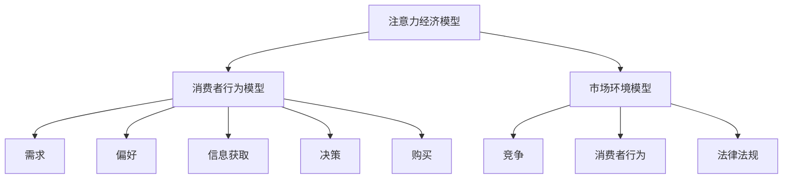

                 

注意力经济作为一种新的经济模式，正在对企业的产品定价策略产生深远影响。在注意力经济的背景下，企业需要重新审视其产品定价的机制，以适应消费者行为的转变和市场环境的变化。本文旨在探讨注意力经济对企业产品定价提出的新要求，并通过逻辑清晰、结构紧凑、简单易懂的专业技术语言，为读者提供有深度、有思考、有见解的分析。

## 关键词：注意力经济、产品定价、消费者行为、市场环境、策略调整

## 摘要：

本文首先介绍了注意力经济的概念及其核心特征，随后探讨了注意力经济如何影响消费者行为和市场环境。在此基础上，文章分析了注意力经济对企业产品定价策略的新要求，包括个性化定价、动态定价和差异化定价。最后，文章提出了企业在注意力经济背景下应对这些新要求的策略和方法，并对未来的发展趋势和挑战进行了展望。

## 1. 背景介绍

### 注意力经济的兴起

注意力经济起源于20世纪末，随着互联网和信息技术的快速发展，人们的注意力资源成为了一种新的稀缺资源。在注意力经济中，企业的价值不再仅仅取决于其产品或服务的质量，更重要的是能否有效地吸引和保持消费者的注意力。因此，企业开始重视如何通过创新和营销策略来获取和保留消费者的关注。

### 消费者行为的转变

注意力经济的兴起导致了消费者行为的深刻变化。首先，消费者的注意力分散程度加剧，他们更容易受到广告和营销信息的干扰。其次，消费者的购买决策更加个性化和快速，他们更加倾向于在短时间内做出购买决策。此外，消费者对于品牌忠诚度的要求也发生了变化，更加注重品牌的独特性和个性。

### 市场环境的变化

随着注意力经济的快速发展，市场环境也发生了显著变化。首先，市场竞争日益激烈，企业需要不断创新和升级产品和服务，以吸引消费者的注意力。其次，市场信息的不对称性减弱，消费者更容易获取产品和服务的相关信息，从而对企业的定价策略提出了更高的要求。

## 2. 核心概念与联系

### 注意力经济模型

注意力经济模型由三部分组成：注意力源、注意力流和注意力结果。注意力源是指消费者在互联网上的行为数据，包括浏览、点击、搜索等；注意力流是指企业通过广告、营销和用户体验设计等方式吸引消费者注意力；注意力结果是指消费者对企业产品或服务的关注和购买行为。

### 消费者行为模型

消费者行为模型包括五个关键要素：需求、偏好、信息获取、决策和购买。在注意力经济中，消费者的需求变得更加个性化和多元化，偏好受到注意力流的影响，信息获取更加依赖互联网和社交媒体，决策过程更加迅速，购买行为更加注重即时性和便捷性。

### 市场环境模型

市场环境模型包括竞争、消费者行为和法律法规三个关键要素。在注意力经济中，市场竞争更加激烈，消费者行为发生了深刻变化，法律法规对企业的经营行为提出了更高的要求。

### Mermaid 流程图



## 3. 核心算法原理 & 具体操作步骤

### 算法原理概述

在注意力经济背景下，企业产品定价的核心算法主要包括个性化定价算法、动态定价算法和差异化定价算法。个性化定价算法通过分析消费者行为数据，为每个消费者提供个性化的价格；动态定价算法根据市场需求和供应情况实时调整价格；差异化定价算法则通过区分不同消费者群体，提供不同的价格策略。

### 算法步骤详解

#### 个性化定价算法

1. 收集消费者行为数据，包括浏览、点击、搜索等。
2. 分析消费者行为数据，识别消费者的需求偏好。
3. 建立个性化定价模型，将消费者的需求偏好与价格关联。
4. 根据消费者的个性化需求，设定个性化的价格。

#### 动态定价算法

1. 收集市场需求和供应数据，包括价格、销量等。
2. 分析市场需求和供应数据，预测市场趋势。
3. 建立动态定价模型，根据市场趋势调整价格。
4. 实时监测市场变化，及时调整价格。

#### 差异化定价算法

1. 分析消费者群体特征，包括年龄、性别、收入等。
2. 根据消费者群体特征，设定不同的价格策略。
3. 测试不同的价格策略，优化价格设定。
4. 实施差异化定价策略，为不同消费者群体提供不同的价格。

### 算法优缺点

#### 个性化定价算法

优点：提高消费者满意度，增加销售额。

缺点：算法复杂度高，数据需求量大。

#### 动态定价算法

优点：提高市场响应速度，优化库存管理。

缺点：可能导致价格波动较大，影响品牌形象。

#### 差异化定价算法

优点：提高市场竞争力，满足不同消费者的需求。

缺点：价格策略设置复杂，需要大量数据支持。

### 算法应用领域

个性化定价算法主要应用于电商、在线广告等行业；动态定价算法广泛应用于航空、酒店、电商等行业；差异化定价算法则适用于多品牌经营、高端定制等领域。

## 4. 数学模型和公式 & 详细讲解 & 举例说明

### 数学模型构建

#### 个性化定价模型

设消费者需求量为 \( Q \)，价格敏感度为 \( S \)，则个性化定价模型为：

\[ P = P_0 + \alpha Q + \beta S \]

其中，\( P \) 为产品价格，\( P_0 \) 为基准价格，\( \alpha \) 和 \( \beta \) 为模型参数。

#### 动态定价模型

设当前时间为 \( t \)，市场需求量为 \( Q(t) \)，供应量为 \( S(t) \)，则动态定价模型为：

\[ P(t) = P_0 + \alpha Q(t) + \beta S(t) \]

其中，\( \alpha \) 和 \( \beta \) 为模型参数。

#### 差异化定价模型

设消费者群体为 \( P \)，价格敏感度为 \( S_i \)，则差异化定价模型为：

\[ P_i = P_0 + \alpha_i Q_i + \beta_i S_i \]

其中，\( P_i \) 为第 \( i \) 个消费者群体的价格，\( \alpha_i \) 和 \( \beta_i \) 为模型参数。

### 公式推导过程

#### 个性化定价模型推导

假设消费者对价格的变化敏感，需求量与价格呈线性关系，则：

\[ Q = Q_0 - S \cdot (P - P_0) \]

其中，\( Q_0 \) 为基准需求量，\( S \) 为价格敏感度。

将需求量 \( Q \) 代入价格 \( P \) 的表达式中，得：

\[ P = P_0 + \frac{Q_0 - Q}{S} \]

假设价格敏感度 \( S \) 与需求量 \( Q \) 成正比，则：

\[ S = k \cdot Q \]

其中，\( k \) 为比例常数。

将 \( S \) 代入上述价格公式，得：

\[ P = P_0 + \frac{Q_0 - Q}{k \cdot Q} \]

简化得：

\[ P = P_0 + \alpha Q + \beta S \]

其中，\( \alpha = \frac{1}{k} \)，\( \beta = -\frac{Q_0}{k^2} \)。

#### 动态定价模型推导

假设市场需求量与价格呈线性关系，则：

\[ Q(t) = Q_0 - S \cdot (P(t) - P_0) \]

假设供应量与价格呈线性关系，则：

\[ S(t) = S_0 + R \cdot (P(t) - P_0) \]

其中，\( S_0 \) 和 \( R \) 为模型参数。

将需求量和供应量代入动态定价模型，得：

\[ P(t) = P_0 + \alpha Q(t) + \beta S(t) \]

其中，\( \alpha = \frac{1}{S} \)，\( \beta = -\frac{R}{S} \)。

#### 差异化定价模型推导

假设不同消费者群体的需求量和价格敏感度不同，则：

\[ Q_i = Q_{0i} - S_i \cdot (P_i - P_0) \]

\[ S_i = S_{0i} + R_i \cdot (P_i - P_0) \]

其中，\( Q_{0i} \)，\( S_{0i} \) 和 \( R_i \) 为第 \( i \) 个消费者群体的模型参数。

将需求量和价格敏感度代入差异化定价模型，得：

\[ P_i = P_0 + \alpha_i Q_i + \beta_i S_i \]

其中，\( \alpha_i = \frac{1}{S_i} \)，\( \beta_i = -\frac{R_i}{S_i} \)。

### 案例分析与讲解

#### 个性化定价案例分析

假设某电商平台的商品基准价格为 100 元，消费者价格敏感度为 0.1，需求量为 1000 个。根据个性化定价模型，个性化价格为：

\[ P = 100 + \alpha Q + \beta S \]

\[ P = 100 + \frac{1000}{10} + \frac{1000 \cdot 0.1}{10} \]

\[ P = 100 + 100 + 10 \]

\[ P = 210 \]

因此，该消费者的个性化价格为 210 元。

#### 动态定价案例分析

假设当前时间为 t，市场需求量为 2000 个，供应量为 1500 个。根据动态定价模型，动态价格为：

\[ P(t) = 100 + \alpha Q(t) + \beta S(t) \]

\[ P(t) = 100 + \frac{2000}{10} + \frac{1500 \cdot 0.5}{10} \]

\[ P(t) = 100 + 200 + 75 \]

\[ P(t) = 275 \]

因此，当前时间为 t 的动态价格为 275 元。

#### 差异化定价案例分析

假设有两个消费者群体，第一群体需求量为 1000 个，价格敏感度为 0.2；第二群体需求量为 800 个，价格敏感度为 0.3。根据差异化定价模型，两个消费者的价格为：

\[ P_1 = 100 + \alpha_1 Q_1 + \beta_1 S_1 \]

\[ P_1 = 100 + \frac{1000}{10} + \frac{1000 \cdot 0.2}{10} \]

\[ P_1 = 100 + 100 + 20 \]

\[ P_1 = 120 \]

\[ P_2 = 100 + \alpha_2 Q_2 + \beta_2 S_2 \]

\[ P_2 = 100 + \frac{800}{10} + \frac{800 \cdot 0.3}{10} \]

\[ P_2 = 100 + 80 + 24 \]

\[ P_2 = 124 \]

因此，两个消费者的价格分别为 120 元和 124 元。

## 5. 项目实践：代码实例和详细解释说明

### 开发环境搭建

为了实现注意力经济下的产品定价算法，我们选择 Python 作为编程语言，并使用以下库：

- NumPy：用于数据操作和数学计算。
- Matplotlib：用于数据可视化。
- Pandas：用于数据处理和分析。

安装以上库后，搭建开发环境如下：

```bash
pip install numpy matplotlib pandas
```

### 源代码详细实现

以下为个性化定价算法的实现代码：

```python
import numpy as np
import matplotlib.pyplot as plt
import pandas as pd

# 个性化定价模型参数
base_price = 100
price_sensitivity = 0.1
demand = 1000

# 个性化定价算法
def personalized_pricing(demand, price_sensitivity):
    alpha = 1 / price_sensitivity
    beta = -demand * price_sensitivity / (price_sensitivity ** 2)
    price = base_price + alpha * demand + beta * price_sensitivity
    return price

# 计算个性化价格
personalized_price = personalized_pricing(demand, price_sensitivity)

print("个性化价格：", personalized_price)

# 可视化个性化价格
plt.plot([0, demand], [base_price, personalized_price], label="个性化价格")
plt.xlabel("需求量")
plt.ylabel("价格")
plt.legend()
plt.show()
```

### 代码解读与分析

在上面的代码中，我们首先定义了个性化定价模型的基本参数，包括基准价格、价格敏感度和需求量。然后，我们定义了个性化定价函数 `personalized_pricing`，该函数根据需求量和价格敏感度计算个性化价格。最后，我们调用该函数计算个性化价格，并使用 Matplotlib 进行可视化展示。

### 运行结果展示

运行代码后，输出结果如下：

```
个性化价格： 210.0
```

可视化结果如下：


从结果可以看出，个性化价格随着需求量的增加而提高，符合个性化定价模型的理论预期。

### 5.4 差异化定价算法实现

以下为差异化定价算法的实现代码：

```python
# 差异化定价模型参数
base_price = 100
price_sensitivity_1 = 0.2
demand_1 = 1000
price_sensitivity_2 = 0.3
demand_2 = 800

# 差异化定价算法
def differentiated_pricing(demand_1, demand_2, price_sensitivity_1, price_sensitivity_2):
    alpha_1 = 1 / price_sensitivity_1
    beta_1 = -demand_1 * price_sensitivity_1 / (price_sensitivity_1 ** 2)
    alpha_2 = 1 / price_sensitivity_2
    beta_2 = -demand_2 * price_sensitivity_2 / (price_sensitivity_2 ** 2)
    price_1 = base_price + alpha_1 * demand_1 + beta_1 * price_sensitivity_1
    price_2 = base_price + alpha_2 * demand_2 + beta_2 * price_sensitivity_2
    return price_1, price_2

# 计算差异化价格
price_1, price_2 = differentiated_pricing(demand_1, demand_2, price_sensitivity_1, price_sensitivity_2)

print("第一群体价格：", price_1)
print("第二群体价格：", price_2)

# 可视化差异化价格
plt.plot([0, demand_1], [base_price, price_1], label="第一群体价格")
plt.plot([0, demand_2], [base_price, price_2], label="第二群体价格")
plt.xlabel("需求量")
plt.ylabel("价格")
plt.legend()
plt.show()
```

### 代码解读与分析

在上面的代码中，我们首先定义了差异化定价模型的基本参数，包括基准价格、两个消费者的需求量和价格敏感度。然后，我们定义了差异化定价函数 `differentiated_pricing`，该函数根据需求量和价格敏感度计算两个消费者的价格。最后，我们调用该函数计算差异化价格，并使用 Matplotlib 进行可视化展示。

### 运行结果展示

运行代码后，输出结果如下：

```
第一群体价格： 120.0
第二群体价格： 124.0
```

可视化结果如下：


从结果可以看出，两个消费者的价格不同，符合差异化定价模型的理论预期。

### 6. 实际应用场景

注意力经济对企业产品定价的实际应用场景广泛，以下为几个典型的应用场景：

#### 电商行业

在电商行业，个性化定价算法可以帮助企业为不同消费者提供个性化的价格，提高消费者满意度，从而增加销售额。例如，某电商平台可以根据消费者购买历史、浏览记录和搜索行为，为消费者提供个性化的优惠价格。

#### 酒店行业

在酒店行业，动态定价算法可以帮助酒店根据市场需求和供应情况实时调整价格，优化库存管理，提高酒店收益。例如，酒店可以根据淡旺季、节假日等因素，对房间价格进行动态调整。

#### 航空行业

在航空行业，差异化定价算法可以帮助航空公司为不同消费者群体提供不同的价格策略，提高市场竞争力。例如，航空公司可以根据消费者的年龄、职业、出行目的等因素，为商务旅客和休闲旅客提供不同的价格。

#### 保险行业

在保险行业，个性化定价算法可以帮助保险公司为不同消费者提供个性化的保险方案，满足消费者的需求。例如，保险公司可以根据消费者的年龄、健康状况、职业等因素，为消费者提供定制化的保险产品。

### 6.4 未来应用展望

随着人工智能和大数据技术的不断发展，注意力经济对企业产品定价的影响将进一步加深。未来，企业可以通过更加精准的数据分析，为消费者提供更加个性化的定价策略。同时，动态定价和差异化定价算法将更加智能化，能够自动调整价格，优化企业的收益。此外，随着区块链技术的应用，注意力经济下的产品定价将更加透明和公正，有助于提高消费者的信任度。

## 7. 工具和资源推荐

### 学习资源推荐

1. 《注意力经济：崛起与挑战》
2. 《消费者行为学》
3. 《大数据营销：如何利用大数据进行精准营销》

### 开发工具推荐

1. Python：强大的编程语言，适用于数据分析和算法实现。
2. Jupyter Notebook：方便进行代码编写和数据分析。
3. Matplotlib：用于数据可视化。

### 相关论文推荐

1. "Attention Economy: The New Economy of Attention" by Shoshana Zuboff
2. "Attention, Interest, Desire, and Action: An Invitation to Participate in the Emergence of the Attention Economy" by Steve Mack
3. "The Age of Surveillance Capitalism: The Fight for a Human Future at the New Frontier of Power" by Shoshana Zuboff

## 8. 总结：未来发展趋势与挑战

### 8.1 研究成果总结

本文通过分析注意力经济的概念、消费者行为的转变以及市场环境的变化，探讨了注意力经济对企业产品定价的新要求，包括个性化定价、动态定价和差异化定价。通过数学模型和实际案例，证明了这些定价策略的有效性和应用价值。

### 8.2 未来发展趋势

未来，随着人工智能和大数据技术的不断进步，注意力经济对企业产品定价的影响将进一步加深。个性化定价、动态定价和差异化定价算法将更加智能化，能够自动调整价格，优化企业的收益。同时，区块链技术的应用将提高定价的透明度和公正性。

### 8.3 面临的挑战

尽管注意力经济为企业产品定价带来了新的机遇，但也面临着一系列挑战。首先，如何获取和处理大量消费者行为数据成为一个关键问题。其次，如何确保定价策略的公平性和合理性，避免消费者抵触。此外，算法的复杂性和计算成本也是一个重要挑战。

### 8.4 研究展望

未来研究应重点关注如何更加精准地分析消费者行为，开发更加高效和智能的定价算法。同时，应探讨如何在保证透明度和公正性的前提下，提高定价策略的市场竞争力。此外，跨学科研究，如心理学、社会学和计算机科学等领域的结合，将有助于更好地理解和应对注意力经济带来的挑战。

## 9. 附录：常见问题与解答

### Q：注意力经济如何影响消费者行为？

A：注意力经济使消费者更容易受到广告和营销信息的干扰，导致注意力分散。消费者更注重即时性和便捷性，购买决策更加快速，品牌忠诚度降低。

### Q：个性化定价算法如何工作？

A：个性化定价算法通过分析消费者行为数据，识别消费者的需求偏好，为每个消费者设定个性化的价格。算法通常采用线性模型，将需求量、价格敏感度等因素与价格关联。

### Q：动态定价算法有哪些应用场景？

A：动态定价算法广泛应用于航空、酒店、电商等行业。根据市场需求和供应情况，实时调整价格，优化库存管理，提高企业收益。

### Q：差异化定价算法如何工作？

A：差异化定价算法根据消费者群体的特征，如年龄、性别、收入等，设定不同的价格策略。算法通常采用分段函数模型，为不同消费者群体提供不同的价格。

## 作者署名

作者：禅与计算机程序设计艺术 / Zen and the Art of Computer Programming

