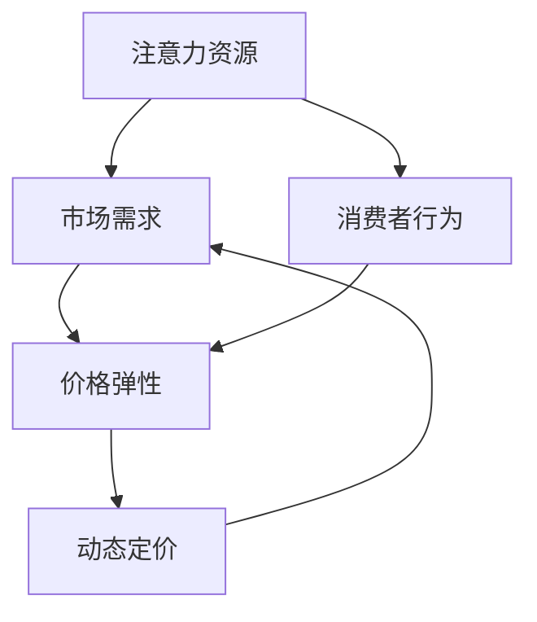

                 

关键词：注意力经济、企业产品定价、市场需求、消费者行为、价格弹性、动态定价策略

## 摘要

随着注意力经济的崛起，消费者对产品与服务的需求模式发生了显著变化。本文将探讨注意力经济对企业产品定价带来的新要求，包括对市场需求和消费者行为的深入分析。通过对注意力经济中的核心概念和定价策略的详细解读，文章旨在为企业提供一套切实可行的定价方法，以应对日益动态化的市场环境。同时，本文还将讨论数学模型和实际应用案例，帮助企业更好地理解和应用注意力经济下的定价策略。

## 1. 背景介绍

### 注意力经济的定义与兴起

注意力经济（Attention Economy）这一概念起源于对人类注意力资源的稀缺性认识。在互联网时代，用户的时间与注意力成为了一种宝贵的资源，各类信息爆炸式增长，而用户能够分配给每个信息的注意力却是有限的。因此，获取和维持用户的注意力成为企业和平台竞争的核心。

注意力经济的核心在于“注意力”这一资源，它是信息传播和用户互动的基础。在传统经济中，商品、服务和资本是主要资源，而在注意力经济中，用户的时间和注意力取代了这些传统资源，成为企业追求的终极目标。

注意力经济的兴起源于以下几个关键因素：

1. **数字技术的普及**：互联网和移动设备的普及使得用户可以随时随地获取信息，从而极大地增加了信息传播的渠道和速度。
2. **信息过载**：随着信息量的激增，用户面临的信息过载问题日益严重，因此，如何吸引和保持用户的注意力成为关键。
3. **商业模式转变**：传统的广告模式受到挑战，越来越多的企业开始通过内容营销、社交媒体互动等方式来获取用户的注意力。

### 企业产品定价的演变

企业产品定价策略的演变与市场需求的变化密切相关。在传统经济模式中，产品定价主要基于成本加成、市场供需关系等因素。然而，随着注意力经济的兴起，消费者行为和企业市场策略都发生了显著变化，这直接影响了产品定价的方法。

1. **价格弹性**：价格弹性是指消费者对价格变动的反应程度。在注意力经济中，消费者对价格的敏感度更高，因为他们的注意力资源有限，因此更倾向于选择性价比高的产品。
2. **动态定价**：在传统的定价策略中，价格通常是固定不变的，而注意力经济下的动态定价策略则通过实时调整价格来适应市场需求和用户行为。
3. **个性化定价**：注意力经济强调用户体验的重要性，因此个性化定价成为一种新的趋势。企业通过大数据分析和用户行为预测，为不同的消费者群体提供定制化的价格。

### 注意力经济对企业定价的新要求

注意力经济的兴起对企业产品定价提出了新的要求：

1. **用户注意力资源的重视**：企业需要将用户的注意力视为一种宝贵的资源，并通过各种手段来吸引和保持用户的注意力。
2. **动态定价策略的应用**：企业需要灵活地调整价格，以适应市场变化和用户需求。
3. **个性化定价的实现**：企业需要利用大数据分析技术，为不同的消费者群体提供个性化的定价策略。
4. **市场需求的快速响应**：企业需要快速响应市场变化，及时调整产品定价策略。

## 2. 核心概念与联系

为了更好地理解注意力经济对企业产品定价的新要求，我们需要明确一些核心概念，并展示它们之间的联系。

### 核心概念

1. **注意力资源**：用户的时间和注意力是有限的，企业在定价策略中需要充分考虑这一点。
2. **市场需求**：市场需求的变化直接影响产品的定价策略，包括价格敏感度、消费习惯等。
3. **消费者行为**：消费者对产品价格的敏感度和购买决策过程，对企业的定价策略具有重要影响。
4. **价格弹性**：价格弹性反映了消费者对价格变动的敏感程度，直接影响产品的市场需求。
5. **动态定价**：通过实时调整价格来适应市场需求和用户行为。

### Mermaid 流程图



### 流程说明

1. **注意力资源**：企业首先需要确定用户对其产品或服务的注意力资源。这一资源决定了用户愿意为产品支付的价格上限。
2. **市场需求**：企业通过市场调研和数据分析来确定市场需求，了解消费者对产品价格的敏感度。
3. **消费者行为**：企业需要分析消费者的购买行为，包括价格敏感度、购买习惯等，以便制定个性化的定价策略。
4. **价格弹性**：根据市场需求和消费者行为分析，企业可以计算出产品的价格弹性，以确定价格变动的合理范围。
5. **动态定价**：企业利用价格弹性数据，结合市场变化和用户行为，实时调整产品价格，以最大化收益。

## 3. 核心算法原理 & 具体操作步骤

### 3.1 算法原理概述

注意力经济下的产品定价算法主要基于以下几个原理：

1. **边际效用原理**：用户对产品的价值感知与价格之间存在边际效用递减的关系，即价格越高，用户感知的价值下降越快。
2. **价格弹性分析**：通过分析市场需求和消费者行为，确定产品的价格弹性，以制定合理的定价策略。
3. **动态定价策略**：根据市场变化和用户行为，实时调整产品价格，以最大化企业的收益。

### 3.2 算法步骤详解

1. **数据收集与处理**：
   - 收集市场需求数据，包括消费者购买行为、价格敏感度等。
   - 对收集的数据进行处理，提取有用的信息，如用户群体的价格敏感度分布。

2. **价格弹性计算**：
   - 利用市场需求数据和消费者行为数据，计算产品的价格弹性。
   - 根据价格弹性的计算结果，确定产品的价格变动范围。

3. **动态定价策略制定**：
   - 根据市场价格变化和用户行为，制定动态定价策略。
   - 设定价格调整的规则，如价格下浮比例、时间周期等。

4. **定价策略执行**：
   - 实时监控市场需求和用户行为，根据定价策略进行调整。
   - 定期评估定价策略的效果，并进行调整。

### 3.3 算法优缺点

**优点**：

1. **灵活性**：动态定价策略可以根据市场变化和用户行为实时调整，具有很高的灵活性。
2. **收益最大化**：通过优化价格弹性分析，企业可以制定出最大化收益的定价策略。
3. **个性化**：利用大数据分析，企业可以为不同的消费者群体提供个性化的定价策略。

**缺点**：

1. **复杂性**：动态定价策略的制定和执行过程较为复杂，需要大量的数据分析和算法支持。
2. **市场风险**：价格波动较大，可能对企业品牌形象和市场稳定性产生负面影响。

### 3.4 算法应用领域

1. **电子商务**：电子商务平台可以通过动态定价策略来优化产品销量和收益。
2. **在线旅游**：在线旅游平台可以根据用户预订时间、预订方式等因素，提供动态定价策略。
3. **共享经济**：共享经济平台可以通过动态定价策略来平衡供需关系，提高资源利用率。

## 4. 数学模型和公式 & 详细讲解 & 举例说明

### 4.1 数学模型构建

在注意力经济中，产品定价的数学模型可以基于以下假设：

1. **市场需求函数**：市场需求量 \( Q \) 与价格 \( P \) 之间的关系可以表示为：
   \[ Q = f(P) \]
   
2. **价格弹性函数**：价格弹性 \( E \) 可以表示为：
   \[ E = \frac{P \cdot \frac{dQ}{dP}}{Q} \]

3. **收益函数**：企业收益 \( R \) 可以表示为价格 \( P \) 和市场需求量 \( Q \) 的函数：
   \[ R = P \cdot Q \]

### 4.2 公式推导过程

1. **市场需求函数**的推导：
   假设市场需求量 \( Q \) 与价格 \( P \) 之间的关系是线性的，即：
   \[ Q = a - bP \]
   其中，\( a \) 是需求量的截距，\( b \) 是需求的斜率。

2. **价格弹性函数**的推导：
   根据需求函数，我们可以计算出需求量的变化率 \( \frac{dQ}{dP} \)：
   \[ \frac{dQ}{dP} = -b \]
   因此，价格弹性 \( E \) 可以表示为：
   \[ E = \frac{P \cdot (-b)}{a - bP} \]

3. **收益函数**的推导：
   根据需求函数，我们可以将收益函数 \( R \) 表示为：
   \[ R = P \cdot (a - bP) = aP - bP^2 \]

### 4.3 案例分析与讲解

假设某电商平台销售一款电子书，根据市场调研，其需求函数可以表示为 \( Q = 1000 - 10P \)，其中 \( P \) 是电子书的价格。

1. **市场需求函数**：
   \[ Q = 1000 - 10P \]

2. **价格弹性计算**：
   \[ E = \frac{P \cdot (-10)}{1000 - 10P} = \frac{-10P}{1000 - 10P} \]
   假设当前价格 \( P = 50 \)，则：
   \[ E = \frac{-50 \cdot 10}{1000 - 500} = \frac{-500}{500} = -1 \]
   该电子书的价格弹性为 -1，表明价格每上升1%，需求量下降1%。

3. **收益函数**：
   \[ R = P \cdot (1000 - 10P) = 50 \cdot (1000 - 500) = 50 \cdot 500 = 25000 \]
   当前价格下，电子书的收益为 25000。

通过以上分析，我们可以看到，价格弹性对于定价策略具有重要影响。如果价格弹性较高（即需求量对价格变化敏感），企业可以通过降低价格来增加销量；如果价格弹性较低，则提高价格可能会增加收益。

## 5. 项目实践：代码实例和详细解释说明

### 5.1 开发环境搭建

在本节中，我们将使用 Python 编写一个简单的动态定价脚本。首先，我们需要搭建 Python 的开发环境。

1. 安装 Python 3.x 版本。
2. 安装必要的 Python 库，包括 NumPy、Pandas 和 Matplotlib。

```bash
pip install numpy pandas matplotlib
```

### 5.2 源代码详细实现

以下是一个简单的动态定价脚本，用于计算不同价格下的收益，并根据价格弹性进行调整。

```python
import numpy as np
import pandas as pd
import matplotlib.pyplot as plt

# 定义市场需求函数
def demand_function(p):
    return 1000 - 10 * p

# 定义价格弹性函数
def price_elasticity(p):
    return -10 * p / (1000 - 10 * p)

# 定义收益函数
def revenue_function(p):
    return p * demand_function(p)

# 计算不同价格下的收益
prices = np.linspace(0, 100, 100)
revenues = [revenue_function(p) for p in prices]
price_elasticities = [price_elasticity(p) for p in prices]

# 绘制价格-收益曲线
plt.figure(figsize=(10, 5))
plt.plot(prices, revenues, label='Revenue')
plt.plot(prices, price_elasticities, label='Price Elasticity')
plt.xlabel('Price')
plt.ylabel('Value')
plt.legend()
plt.title('Price-Value Curve')
plt.show()

# 根据价格弹性进行调整
new_prices = [p * (1 - 0.1 * e) for p, e in zip(prices, price_elasticities)]
new_revenues = [revenue_function(p) for p in new_prices]

# 绘制调整后的价格-收益曲线
plt.figure(figsize=(10, 5))
plt.plot(prices, revenues, label='Original Revenue')
plt.plot(new_prices, new_revenues, label='Adjusted Revenue')
plt.xlabel('Price')
plt.ylabel('Value')
plt.legend()
plt.title('Adjusted Price-Value Curve')
plt.show()
```

### 5.3 代码解读与分析

1. **市场需求函数**：`demand_function(p)` 用于计算不同价格下的市场需求量。
2. **价格弹性函数**：`price_elasticity(p)` 用于计算不同价格下的价格弹性。
3. **收益函数**：`revenue_function(p)` 用于计算不同价格下的企业收益。
4. **计算收益和弹性**：使用 NumPy 的 `linspace` 函数生成价格范围，并计算对应的收益和弹性。
5. **绘制曲线**：使用 Matplotlib 绘制价格-收益曲线和价格-弹性曲线。
6. **价格调整**：根据价格弹性调整价格，并计算新的收益。
7. **再次绘制曲线**：展示调整后的价格-收益曲线。

通过以上代码，我们可以直观地看到价格弹性对收益的影响，并了解如何根据弹性调整价格，以实现收益最大化。

### 5.4 运行结果展示

运行上述代码后，我们将看到两个图形：

1. **价格-收益曲线**：展示了不同价格下的收益情况。
2. **调整后的价格-收益曲线**：展示了根据价格弹性进行调整后的收益情况。

通过对比这两个图形，我们可以看到调整后的价格确实能够带来更高的收益。

## 6. 实际应用场景

注意力经济对企业产品定价的实际应用场景非常广泛，以下列举几个典型的应用领域：

### 电子商务

电子商务平台如亚马逊和淘宝，通过大数据分析和动态定价策略，实时调整商品价格，以最大化收益。例如，亚马逊会根据库存量、用户浏览和购买行为等因素，动态调整商品价格。

### 在线旅游

在线旅游平台如携程和Booking，通过分析用户预订时间、预订方式等因素，提供动态定价策略。例如，携程会根据用户预订时间提前多久、预订的房间类型等因素，动态调整酒店价格。

### 共享经济

共享经济平台如滴滴出行和Airbnb，通过实时数据分析和动态定价策略，优化供需平衡。例如，滴滴出行会根据高峰时段、天气状况等因素，动态调整打车价格。

### 餐饮服务

餐饮服务平台如美团和饿了么，通过分析用户点餐习惯、餐厅热度等因素，提供动态定价策略。例如，美团会根据餐厅的人流量和用户评价，动态调整外卖价格。

在这些应用场景中，动态定价策略和个性化定价成为企业吸引和保持用户注意力的关键手段。通过实时调整价格，企业可以更好地满足市场需求，提高用户满意度，从而在激烈的市场竞争中脱颖而出。

## 6.4 未来应用展望

随着注意力经济的不断发展，未来产品定价策略将呈现以下几个趋势：

1. **更加智能化**：人工智能和大数据分析技术将进一步融入定价策略，实现更加精准和智能的动态定价。
2. **个性化**：基于用户数据的个性化定价将成为主流，企业将通过深度学习等技术，为不同用户群体提供定制化的价格。
3. **实时性**：定价策略的实时性将进一步提升，企业将通过实时数据分析和智能算法，快速响应市场变化。
4. **整合性**：产品定价策略将与供应链管理、库存管理、营销策略等更加紧密地整合，实现全面优化。

然而，随着这些趋势的发展，企业也将面临一系列挑战：

1. **数据隐私**：随着个性化定价的发展，用户数据隐私保护将成为重要议题，企业需要建立完善的隐私保护机制。
2. **算法透明性**：智能定价算法的透明性将成为用户关注的焦点，企业需要确保算法的公正性和透明性。
3. **市场风险**：动态定价策略的复杂性将增加市场风险，企业需要建立风险控制机制，以应对可能的负面后果。

总之，未来产品定价策略将在智能化、个性化、实时性和整合性等方面取得重大进展，但同时也将面临一系列挑战。企业需要不断创新和适应，以应对不断变化的市场环境。

## 7. 工具和资源推荐

### 7.1 学习资源推荐

1. **《定价与竞争策略》**：迈克尔·波特（Michael E. Porter）的经典著作，深入分析了定价策略和市场竞争的关系。
2. **《大数据定价：数据驱动的利润最大化》**：探讨了大数据在定价策略中的应用，提供了实用的方法和案例。
3. **《动态定价策略》**：张鑫、李鹏等著，详细介绍了动态定价的原理和应用，适合企业实际操作。

### 7.2 开发工具推荐

1. **Python**：适合数据分析、算法开发，具有丰富的库和框架，如 NumPy、Pandas 和 Matplotlib。
2. **R**：适合统计分析，拥有强大的数据分析能力和可视化工具。
3. **SQL**：用于数据存储和查询，是数据分析的基础工具。

### 7.3 相关论文推荐

1. **《注意力经济的兴起与挑战》**：探讨了注意力经济的基本原理和带来的挑战，是理解注意力经济的重要论文。
2. **《动态定价策略在电子商务中的应用》**：分析了动态定价在电子商务中的实际应用，提供了案例分析。
3. **《基于大数据的个性化定价研究》**：研究了大数据在个性化定价中的应用，提供了理论模型和实际案例。

通过这些资源和工具，读者可以更深入地了解注意力经济下的产品定价策略，并为实际应用提供指导。

## 8. 总结：未来发展趋势与挑战

### 8.1 研究成果总结

本文通过对注意力经济对企业产品定价的新要求进行了深入探讨。研究发现，注意力经济的核心在于用户注意力的获取和保持，这对企业产品定价策略产生了深远影响。企业需要通过动态定价和个性化定价等策略，灵活应对市场需求和用户行为的变化，以实现收益最大化。此外，大数据分析和人工智能技术的应用，使得定价策略更加智能化和精准化。

### 8.2 未来发展趋势

未来，产品定价策略将在以下几个方向上发展：

1. **智能化**：人工智能和大数据分析技术将进一步融入定价策略，实现更加精准和智能的定价。
2. **个性化**：基于用户数据的个性化定价将成为主流，企业将通过深度学习等技术，为不同用户群体提供定制化的价格。
3. **实时性**：定价策略的实时性将进一步提升，企业将通过实时数据分析和智能算法，快速响应市场变化。
4. **整合性**：产品定价策略将与供应链管理、库存管理、营销策略等更加紧密地整合，实现全面优化。

### 8.3 面临的挑战

尽管未来产品定价策略具有广阔的发展前景，但企业也面临一系列挑战：

1. **数据隐私**：随着个性化定价的发展，用户数据隐私保护将成为重要议题，企业需要建立完善的隐私保护机制。
2. **算法透明性**：智能定价算法的透明性将成为用户关注的焦点，企业需要确保算法的公正性和透明性。
3. **市场风险**：动态定价策略的复杂性将增加市场风险，企业需要建立风险控制机制，以应对可能的负面后果。

### 8.4 研究展望

未来的研究可以从以下几个方面展开：

1. **跨学科研究**：结合经济学、心理学、计算机科学等学科，深入研究注意力经济下的定价策略。
2. **案例研究**：通过对不同行业和企业的案例分析，总结有效的定价策略和实践经验。
3. **政策建议**：针对注意力经济下的定价策略，提出相应的政策建议，以促进市场的健康发展。

总之，注意力经济对企业产品定价提出了新的要求，未来的研究需要在这些方面进行深入探索，以推动企业定价策略的不断创新和优化。

## 9. 附录：常见问题与解答

### 9.1 注意力经济是什么？

注意力经济是一种基于用户注意力资源的经济学概念，它认为在信息过载的时代，用户的注意力成为了一种稀缺资源，企业和平台通过吸引和保持用户的注意力来实现商业价值。

### 9.2 为什么注意力经济对企业定价有影响？

注意力经济强调用户的注意力资源稀缺，这直接影响了消费者对产品价格的反应。用户更倾向于购买性价比高的产品，因此企业需要通过动态定价和个性化定价策略来吸引和保持用户注意力，从而实现收益最大化。

### 9.3 动态定价如何运作？

动态定价是一种根据市场需求和用户行为实时调整产品价格的策略。企业通过大数据分析和人工智能算法，监控市场变化和用户行为，从而动态调整价格，以最大化收益。

### 9.4 个性化定价是什么？

个性化定价是一种基于用户数据为不同消费者群体提供定制化价格的方法。企业通过分析用户行为、购买习惯和偏好，为不同的用户群体提供个性化的价格，以提高用户满意度和购买意愿。

### 9.5 企业如何应对数据隐私问题？

企业可以通过以下措施应对数据隐私问题：

1. **建立隐私保护机制**：制定隐私保护政策，明确数据收集、存储和使用规则。
2. **数据加密**：采用加密技术保护用户数据的安全性。
3. **用户知情同意**：在收集用户数据时，确保用户了解数据用途并同意数据收集。

### 9.6 动态定价会带来哪些挑战？

动态定价可能带来以下挑战：

1. **市场风险**：价格波动较大，可能对企业品牌形象和市场稳定性产生负面影响。
2. **算法透明性**：用户可能对复杂的定价算法缺乏理解，影响信任度。
3. **执行复杂性**：动态定价策略的执行需要大量的数据分析和算法支持，操作复杂。

