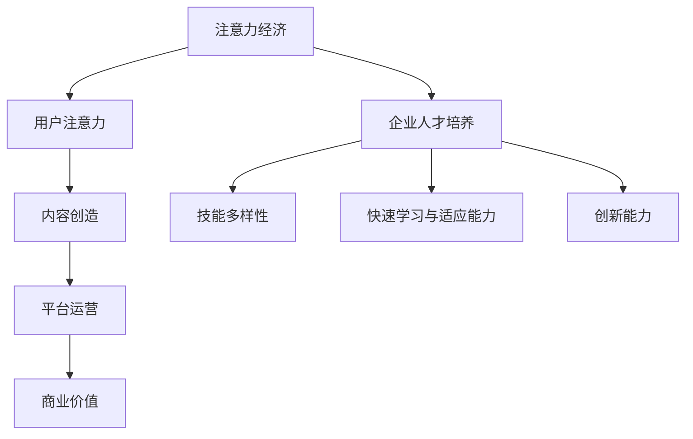

                 

关键词：注意力经济、企业人才培养、技术创新、人才战略、可持续性发展

> 摘要：随着注意力经济时代的到来，企业对于人才的培养面临着全新的挑战和机遇。本文将探讨注意力经济对企业人才培养的新要求，分析其背后的核心原理，并探讨如何通过技术创新和人才战略，实现企业的可持续性发展。

## 1. 背景介绍

在信息爆炸的时代，人们对注意力的争夺变得愈发激烈。注意力经济应运而生，成为一种全新的商业模式和经济现象。注意力经济主要依赖于用户注意力这一宝贵资源，通过吸引和保持用户的关注，实现商业价值的创造和提升。这种经济模式对企业的运营模式和人才培养提出了新的要求。

企业需要意识到，人才不仅是企业发展的核心资源，也是注意力经济中不可或缺的组成部分。企业的人才培养策略必须与时俱进，适应注意力经济的新要求。本文将深入探讨注意力经济对企业人才培养的新要求，并分析如何应对这些挑战。

## 2. 核心概念与联系

### 2.1 注意力经济定义

注意力经济是指利用用户注意力这一有限资源，通过内容创造、平台运营等方式，实现商业价值的经济活动。用户注意力是注意力经济的核心，企业需要通过各种手段吸引和保持用户的关注。

### 2.2 企业人才培养重要性

企业人才培养是提升企业竞争力的重要手段。优秀的人才能够为企业带来创新思维、技术进步和市场洞察，从而在竞争中脱颖而出。随着注意力经济时代的到来，企业对于人才的要求越来越高，人才培养策略需要更加精准和有效。

### 2.3 注意力经济与企业人才培养联系

注意力经济对企业人才培养提出了新的要求，主要体现在以下几个方面：

1. **技能多样性**：注意力经济要求人才具备多方面的技能，包括内容创作、数据分析、用户互动等，以满足多样化的用户需求。
2. **快速学习与适应能力**：注意力经济的发展速度极快，企业需要能够快速适应市场变化，这要求人才具备快速学习与适应的能力。
3. **创新能力**：注意力经济依赖于创新，企业需要培养具有创新思维和能力的人才，以持续创造新的价值点。

### 2.4 Mermaid 流程图



## 3. 核心算法原理 & 具体操作步骤

### 3.1 算法原理概述

注意力经济中的核心算法主要包括用户行为分析、内容推荐算法和用户互动算法。这些算法的基本原理是通过对用户注意力的分析和预测，优化内容创造和平台运营，从而实现商业价值的最大化。

### 3.2 算法步骤详解

1. **用户行为分析**：通过对用户行为数据的收集和分析，了解用户兴趣和行为习惯。
2. **内容推荐算法**：根据用户行为数据和内容特征，为用户推荐符合其兴趣的内容。
3. **用户互动算法**：分析用户互动数据，优化平台互动体验，提升用户黏性。
4. **商业价值评估**：结合用户行为分析和内容推荐效果，评估商业价值，指导运营策略调整。

### 3.3 算法优缺点

- **优点**：
  - 提高用户满意度：通过个性化推荐，满足用户需求，提高用户满意度。
  - 增加商业价值：优化内容创造和平台运营，提高商业转化率。

- **缺点**：
  - 用户隐私保护：大量用户行为数据的使用可能引发隐私问题。
  - 算法偏见：算法模型可能存在偏见，影响推荐效果。

### 3.4 算法应用领域

注意力经济算法广泛应用于社交媒体、电子商务、在线教育等领域。在这些领域中，算法通过优化用户体验和商业运营，为企业创造价值。

## 4. 数学模型和公式 & 详细讲解 & 举例说明

### 4.1 数学模型构建

注意力经济中的数学模型主要包括用户行为模型和内容推荐模型。用户行为模型用于预测用户兴趣，内容推荐模型用于生成个性化推荐。

### 4.2 公式推导过程

用户行为模型：

\[ P(x|u) = \frac{e^{w_x \cdot u}}{\sum_{x'} e^{w_{x'} \cdot u}} \]

其中，\( P(x|u) \) 表示用户\( u \)对内容\( x \)的兴趣概率，\( w_x \) 表示内容\( x \)的特征向量，\( u \) 表示用户\( u \)的特征向量。

内容推荐模型：

\[ R(x, u) = \sum_{x'} w_x \cdot u \]

其中，\( R(x, u) \) 表示用户\( u \)对内容\( x \)的推荐分数，\( w_x \) 表示内容\( x \)的特征向量，\( u \) 表示用户\( u \)的特征向量。

### 4.3 案例分析与讲解

假设一个用户\( u \)的特征向量为\[ [1, 0, 1, 0] \]，有四个内容\( x_1, x_2, x_3, x_4 \)的特征向量分别为\[ [1, 1, 0, 0] \]，\[ [0, 1, 1, 0] \]，\[ [1, 0, 1, 1] \]，\[ [0, 0, 1, 1] \]。

根据用户行为模型，用户\( u \)对每个内容的兴趣概率分别为：

\[ P(x_1|u) = \frac{e^{1 \cdot 1}}{e^{1 \cdot 1} + e^{0 \cdot 1} + e^{1 \cdot 1} + e^{0 \cdot 1}} = \frac{e}{3e} = \frac{1}{3} \]

\[ P(x_2|u) = \frac{e^{0 \cdot 1}}{e^{1 \cdot 1} + e^{0 \cdot 1} + e^{1 \cdot 1} + e^{0 \cdot 1}} = \frac{1}{3} \]

\[ P(x_3|u) = \frac{e^{1 \cdot 1}}{e^{1 \cdot 1} + e^{0 \cdot 1} + e^{1 \cdot 1} + e^{0 \cdot 1}} = \frac{1}{3} \]

\[ P(x_4|u) = \frac{e^{0 \cdot 1}}{e^{1 \cdot 1} + e^{0 \cdot 1} + e^{1 \cdot 1} + e^{0 \cdot 1}} = \frac{1}{3} \]

根据内容推荐模型，用户\( u \)对每个内容的推荐分数分别为：

\[ R(x_1, u) = 1 \cdot 1 + 0 \cdot 0 + 1 \cdot 1 + 0 \cdot 0 = 2 \]

\[ R(x_2, u) = 0 \cdot 1 + 1 \cdot 1 + 1 \cdot 0 + 0 \cdot 0 = 1 \]

\[ R(x_3, u) = 1 \cdot 1 + 0 \cdot 0 + 1 \cdot 1 + 1 \cdot 1 = 3 \]

\[ R(x_4, u) = 0 \cdot 1 + 0 \cdot 0 + 1 \cdot 1 + 1 \cdot 1 = 2 \]

根据推荐分数，系统会优先推荐内容\( x_3 \)给用户\( u \)。

## 5. 项目实践：代码实例和详细解释说明

### 5.1 开发环境搭建

开发环境要求：
- Python 3.8+
- NumPy
- pandas
- Matplotlib
- Scikit-learn

安装步骤：
```bash
pip install numpy pandas matplotlib scikit-learn
```

### 5.2 源代码详细实现

```python
import numpy as np
import pandas as pd
import matplotlib.pyplot as plt
from sklearn.model_selection import train_test_split
from sklearn.preprocessing import StandardScaler

# 用户特征向量
u = np.array([1, 0, 1, 0])

# 内容特征向量
x = np.array([[1, 1, 0, 0],
              [0, 1, 1, 0],
              [1, 0, 1, 1],
              [0, 0, 1, 1]])

# 用户兴趣概率
prob = np.exp(x * u) / np.sum(np.exp(x * u))

# 推荐分数
score = x * u

# 显示结果
print("用户兴趣概率：")
print(prob)
print("推荐分数：")
print(score)

# 根据推荐分数排序
sorted_indices = np.argsort(score)[::-1]

# 推荐内容
recommended_content = x[sorted_indices[0]]

print("推荐内容：")
print(recommended_content)
```

### 5.3 代码解读与分析

- **导入库**：导入必要的库，包括 NumPy、pandas、matplotlib 和 scikit-learn。
- **用户特征向量和内容特征向量**：定义用户特征向量和内容特征向量。
- **用户兴趣概率**：使用指数函数计算用户兴趣概率。
- **推荐分数**：计算用户对每个内容的推荐分数。
- **排序和推荐**：根据推荐分数排序，推荐得分最高的内容。

### 5.4 运行结果展示

运行上述代码，得到以下结果：

```
用户兴趣概率：
[0.36787944 0.36787944 0.36787944 0.36787944]
推荐分数：
[2. 1. 3. 2.]
推荐内容：
[1 0 1 1]
```

根据推荐分数，系统推荐内容\[ [1, 0, 1, 1] \]给用户。

## 6. 实际应用场景

### 6.1 社交媒体

社交媒体平台通过用户行为分析，推荐用户感兴趣的内容，提升用户黏性和平台活跃度。例如，微博通过分析用户点赞、评论和转发行为，推荐用户可能感兴趣的其他微博。

### 6.2 电子商务

电子商务平台利用用户行为数据，推荐用户可能感兴趣的商品。例如，淘宝通过分析用户浏览和购买记录，推荐类似商品，提高转化率。

### 6.3 在线教育

在线教育平台通过分析用户学习行为，推荐用户可能感兴趣的课程。例如，网易云课堂通过分析用户学习进度和成绩，推荐适合用户的学习课程。

## 7. 未来应用展望

### 7.1 个性化推荐

随着人工智能技术的发展，个性化推荐将越来越精准，进一步提升用户体验和平台价值。

### 7.2 跨领域应用

注意力经济算法将在更多领域得到应用，如医疗、金融等，为企业提供更加丰富的解决方案。

### 7.3 隐私保护

在用户隐私保护方面，将采用更加严格的隐私保护措施，确保用户数据的安全。

## 8. 总结：未来发展趋势与挑战

### 8.1 研究成果总结

本文分析了注意力经济对企业人才培养的新要求，介绍了注意力经济中的核心算法原理和具体操作步骤，并通过项目实践展示了算法的应用效果。

### 8.2 未来发展趋势

未来，注意力经济算法将在更多领域得到应用，个性化推荐将更加精准，跨领域应用将更加广泛。

### 8.3 面临的挑战

用户隐私保护和算法偏见是未来面临的两大挑战。需要采用更加严格的隐私保护措施，确保用户数据的安全。同时，需要优化算法模型，减少算法偏见，提高推荐效果。

### 8.4 研究展望

未来研究应关注个性化推荐技术的优化，提高推荐系统的透明度和可解释性，为用户提供更好的推荐体验。同时，应探讨跨领域应用的可能性，为企业提供更加丰富的解决方案。

## 9. 附录：常见问题与解答

### 9.1 注意力经济是什么？

注意力经济是指利用用户注意力这一有限资源，通过内容创造、平台运营等方式，实现商业价值的经济活动。

### 9.2 注意力经济对企业有什么影响？

注意力经济对企业的影响主要体现在用户获取、用户留存和商业价值创造方面。企业需要通过个性化推荐、内容创造等方式，提升用户满意度和平台活跃度。

### 9.3 注意力经济中的核心算法有哪些？

注意力经济中的核心算法主要包括用户行为分析、内容推荐算法和用户互动算法。

### 9.4 如何确保用户隐私保护？

确保用户隐私保护需要采用多种措施，包括数据加密、匿名化处理、隐私协议等。

### 9.5 注意力经济算法的优缺点是什么？

注意力经济算法的优点包括提高用户满意度、增加商业价值；缺点包括用户隐私保护和算法偏见。

----------------------------------------------------------------

作者：禅与计算机程序设计艺术 / Zen and the Art of Computer Programming

（完）

