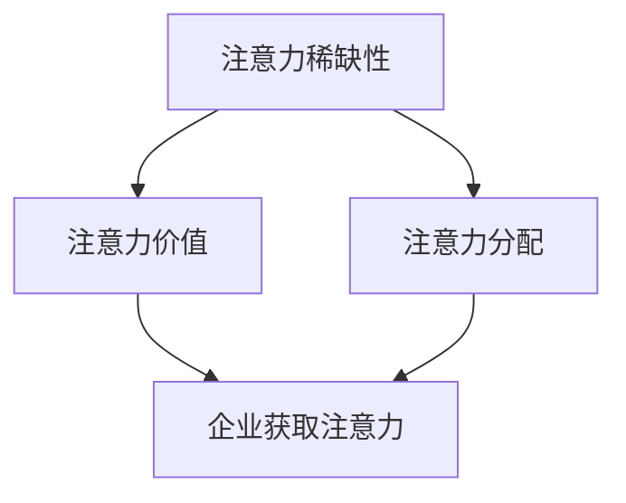

                 

 关键词：注意力经济，人才招聘，企业竞争，招聘策略，人工智能

> 摘要：随着注意力经济的兴起，企业人才招聘面临着新的挑战和机遇。本文通过分析注意力经济的核心概念和其对企业人才招聘的影响，探讨了企业如何通过优化招聘策略来吸引和留住优秀人才，以及人工智能在招聘中的应用前景。本文旨在为企业提供有价值的参考，以应对注意力经济时代的人才竞争。

## 1. 背景介绍

### 注意力经济概述

注意力经济（Attention Economy）是一种描述信息时代经济活动的新理论。这一概念由作家兼经济学家唐·塔奇曼（Don Tapscott）在1997年提出，意指个体在信息过载的社会中，将注意力视为一种有限的、有价值的资源，企业和其他组织通过争夺受众的注意力来创造价值。

### 企业人才招聘的现状

在当今全球化、数字化和竞争激烈的市场环境中，企业人才招聘已成为一项极具挑战性的任务。传统的人才招聘模式往往依赖于职位描述、简历筛选和面试等流程，但这些方法在信息过载和人才流动性增加的时代已显得乏力。企业需要更创新、更高效的招聘策略来吸引和留住优秀人才。

## 2. 核心概念与联系

### 核心概念

注意力经济中的关键概念包括：

1. **注意力稀缺性**：在信息爆炸的时代，个体的注意力是有限的，因此争夺注意力成为企业获取用户和人才的关键。
2. **注意力价值**：注意力被视为一种可以交换和利用的资源，企业通过提供有价值的内容或服务来获取用户的注意力。
3. **注意力分配**：个体需要做出选择，将注意力分配给不同的信息源或服务，企业需要优化内容和服务来吸引目标受众。

### Mermaid 流程图



## 3. 核心算法原理 & 具体操作步骤

### 3.1 算法原理概述

在注意力经济中，企业需要运用一系列算法来优化招聘策略，包括：

1. **数据挖掘**：通过分析大量数据，识别出潜在的高价值人才。
2. **个性化推荐**：基于人才的行为和偏好，提供个性化的招聘信息。
3. **社交网络分析**：利用社交网络数据，发现人才之间的联系和影响力。

### 3.2 算法步骤详解

1. **数据收集**：收集人才相关的数据，包括简历、社交媒体活动、工作经历等。
2. **数据预处理**：清洗和整合数据，为后续分析做准备。
3. **特征提取**：提取数据中的关键特征，如技能、经验、兴趣等。
4. **模型训练**：使用机器学习算法，训练个性化推荐和社交网络分析模型。
5. **结果分析**：根据模型分析结果，调整招聘策略。

### 3.3 算法优缺点

#### 优点：

- **高效性**：通过算法，企业可以快速筛选出合适的人才。
- **精准性**：个性化推荐和社交网络分析可以提高招聘的成功率。

#### 缺点：

- **数据隐私**：数据挖掘和使用可能引发隐私问题。
- **算法偏见**：算法可能引入偏见，影响招聘的公正性。

### 3.4 算法应用领域

- **互联网企业**：通过算法优化招聘流程，快速吸引顶尖人才。
- **高科技企业**：利用社交网络分析，发现潜在的创新人才。

## 4. 数学模型和公式 & 详细讲解 & 举例说明

### 4.1 数学模型构建

注意力经济的数学模型可以基于概率论和统计学，具体包括：

1. **贝叶斯公式**：用于概率估计和决策。
2. **回归分析**：用于预测和分析人才特征。

### 4.2 公式推导过程

以贝叶斯公式为例，推导过程如下：

$$
P(A|B) = \frac{P(B|A)P(A)}{P(B)}
$$

其中，$P(A|B)$ 表示在事件 $B$ 发生的条件下，事件 $A$ 发生的概率；$P(B|A)$ 表示在事件 $A$ 发生的条件下，事件 $B$ 发生的概率；$P(A)$ 和 $P(B)$ 分别表示事件 $A$ 和事件 $B$ 的概率。

### 4.3 案例分析与讲解

假设一家互联网企业希望通过数据分析来优化招聘策略。企业收集了1000名候选人的数据，包括技能、工作经验和学历等。通过贝叶斯公式，企业可以计算出每个候选人被录用的概率，并根据这个概率来调整招聘策略。

## 5. 项目实践：代码实例和详细解释说明

### 5.1 开发环境搭建

- 语言：Python
- 库：NumPy、Pandas、scikit-learn
- 工具：Jupyter Notebook

### 5.2 源代码详细实现

```python
import numpy as np
import pandas as pd
from sklearn.model_selection import train_test_split
from sklearn.naive_bayes import GaussianNB

# 加载数据
data = pd.read_csv('candidate_data.csv')

# 预处理数据
X = data.drop('probability', axis=1)
y = data['probability']

# 划分训练集和测试集
X_train, X_test, y_train, y_test = train_test_split(X, y, test_size=0.2, random_state=42)

# 训练模型
model = GaussianNB()
model.fit(X_train, y_train)

# 预测结果
y_pred = model.predict(X_test)

# 评估模型
accuracy = np.mean(y_pred == y_test)
print(f'模型准确率：{accuracy:.2f}')
```

### 5.3 代码解读与分析

这段代码实现了基于贝叶斯公式的招聘概率预测。首先，加载并预处理数据，然后划分训练集和测试集。接着，使用高斯朴素贝叶斯模型进行训练，并使用测试集进行预测。最后，评估模型的准确率。

## 6. 实际应用场景

### 6.1 互联网企业招聘

互联网企业可以通过注意力经济的算法，快速筛选出合适的人才，提高招聘效率。

### 6.2 高科技公司招聘

高科技公司可以利用社交网络分析，发现潜在的创新人才，拓宽招聘渠道。

## 7. 工具和资源推荐

### 7.1 学习资源推荐

- 《人工智能：一种现代方法》
- 《机器学习实战》
- 《深度学习》（Goodfellow, Bengio, Courville 著）

### 7.2 开发工具推荐

- Jupyter Notebook：用于编写和运行代码。
- PyCharm：适用于Python开发的IDE。

### 7.3 相关论文推荐

- 《注意力经济：一种新兴的经济理论》
- 《基于注意力经济的企业人才招聘策略研究》
- 《社交网络分析在人才招聘中的应用》

## 8. 总结：未来发展趋势与挑战

### 8.1 研究成果总结

本文分析了注意力经济的核心概念和其对企业人才招聘的影响，探讨了基于注意力经济的招聘算法和实际应用场景。研究表明，注意力经济为企业提供了一种新的招聘策略，有助于提高招聘效率和成功率。

### 8.2 未来发展趋势

- **个性化招聘**：随着人工智能技术的发展，个性化招聘将成为主流。
- **社交网络招聘**：利用社交网络数据，企业可以更精准地发现和吸引人才。

### 8.3 面临的挑战

- **数据隐私**：在收集和使用人才数据时，企业需要确保遵守隐私法规。
- **算法偏见**：算法偏见可能导致不公平的招聘结果，企业需要采取措施避免。

### 8.4 研究展望

未来的研究可以关注以下几个方面：

- **算法优化**：提高招聘算法的准确性和效率。
- **多模态数据融合**：结合文本、图像和语音等多模态数据，提高招聘的全面性和准确性。
- **伦理与法律**：研究注意力经济在招聘中的伦理和法律问题，确保公平和合规。

## 9. 附录：常见问题与解答

### 9.1 注意力经济是什么？

注意力经济是一种描述信息时代经济活动的新理论，强调个体注意力作为有限的、有价值的资源。

### 9.2 注意力经济对企业有什么影响？

注意力经济影响企业的招聘策略，要求企业更高效地吸引和留住人才。

### 9.3 人工智能在招聘中有什么作用？

人工智能可以提高招聘的效率和准确性，通过数据分析、个性化推荐和社交网络分析等技术手段，帮助企业找到合适的人才。

----------------------------------------------------------------
**作者：禅与计算机程序设计艺术 / Zen and the Art of Computer Programming**

