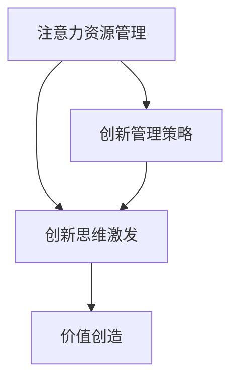

                 

  
> **关键词**：注意力经济、企业创新管理、创新思维、注意力分配、市场竞争、价值创造

> **摘要**：本文旨在探讨注意力经济对企业创新管理的影响。在信息爆炸的时代，企业如何有效地管理注意力资源，成为创新管理的重要议题。本文首先介绍了注意力经济的核心概念，然后分析了注意力经济对企业创新管理的挑战和机遇，最后提出了企业在注意力经济时代进行创新管理的策略和建议。

## 1. 背景介绍

随着互联网和数字技术的飞速发展，信息传播的速度和广度达到了前所未有的高度。这种信息爆炸的现象引发了“注意力经济”的概念，即信息过载时代下，用户的注意力成为稀缺资源，企业如何吸引并留住用户注意力成为竞争的关键。在这种背景下，企业创新管理面临新的挑战和机遇。

### 1.1 注意力经济的定义

注意力经济是指一种基于用户注意力资源的经济学模式，其核心是用户注意力。在注意力经济中，用户注意力被视为一种可以量化、交易和配置的资源。企业和个人为了获取更多注意力资源，会进行各种形式的竞争和交易。

### 1.2 企业创新管理的重要性

企业创新管理是指企业通过引入新的理念、方法、技术或产品，以实现业务增长和市场扩展的过程。创新管理在企业的生存和发展中扮演着至关重要的角色。在激烈的市场竞争中，创新是企业保持竞争优势、实现可持续发展的关键。

## 2. 核心概念与联系

### 2.1 注意力经济的核心概念

注意力经济的核心概念包括：

- **注意力资源**：用户在特定时间段内能够关注和处理的资源。
- **注意力分配**：用户在不同信息源之间的注意力分配策略。
- **注意力价值**：用户注意力转化为企业收益的能力。

### 2.2 注意力经济与企业创新管理的联系

注意力经济与企业创新管理之间的联系可以从以下几个方面进行分析：

- **注意力资源管理**：企业需要有效地管理用户注意力资源，以提高创新效果。
- **创新思维激发**：注意力资源的有效利用可以激发创新思维，推动企业创新。
- **价值创造**：通过创新管理，企业可以更好地利用注意力资源，实现价值创造。

### 2.3 Mermaid 流程图

下面是一个简单的 Mermaid 流程图，展示了注意力经济与企业创新管理的联系：



## 3. 核心算法原理 & 具体操作步骤

### 3.1 算法原理概述

在注意力经济背景下，企业创新管理的关键在于如何优化用户注意力资源的分配。这需要一种算法来指导企业进行有效的注意力资源配置。

### 3.2 算法步骤详解

1. **数据收集**：收集用户注意力数据，包括用户关注的信息类型、关注时间、用户行为等。
2. **数据分析**：分析用户注意力数据，识别用户关注的热点和痛点。
3. **算法建模**：基于数据分析结果，构建注意力资源配置模型。
4. **模型优化**：通过迭代优化，提高注意力资源配置的准确性。
5. **实施策略**：根据优化后的模型，制定具体的创新管理策略。

### 3.3 算法优缺点

- **优点**：能够帮助企业更准确地分配注意力资源，提高创新效果。
- **缺点**：需要大量数据支持，且算法优化过程复杂。

### 3.4 算法应用领域

- **产品创新**：通过优化用户注意力资源配置，提高产品创新的成功率。
- **市场营销**：通过优化用户注意力分配，提高市场营销效果。

## 4. 数学模型和公式 & 详细讲解 & 举例说明

### 4.1 数学模型构建

在注意力经济背景下，企业创新管理的数学模型可以表示为：

\[ \text{创新效果} = f(\text{注意力资源分配}, \text{创新思维激发}, \text{价值创造}) \]

### 4.2 公式推导过程

- **注意力资源分配**：通过用户注意力数据，确定用户关注的焦点和痛点。
- **创新思维激发**：通过数据分析和算法建模，激发创新思维。
- **价值创造**：通过创新管理策略，实现价值创造。

### 4.3 案例分析与讲解

假设一家科技公司通过数据分析和算法建模，确定了用户关注的热点是智能家居产品。公司通过创新思维激发，推出了具有创新功能的智能家居产品，并成功地吸引了大量用户关注。最终，公司通过创新管理策略，实现了价值创造。

## 5. 项目实践：代码实例和详细解释说明

### 5.1 开发环境搭建

为了实现注意力资源配置模型，我们需要搭建一个开发环境。以下是基本的开发环境搭建步骤：

1. 安装Python环境。
2. 安装必要的库，如NumPy、Pandas、Scikit-learn等。

### 5.2 源代码详细实现

以下是注意力资源配置模型的基本实现代码：

```python
import numpy as np
import pandas as pd
from sklearn.model_selection import train_test_split
from sklearn.ensemble import RandomForestRegressor

# 数据收集
data = pd.read_csv('attention_data.csv')

# 数据预处理
X = data.drop(['innovation_effect'], axis=1)
y = data['innovation_effect']

# 数据分割
X_train, X_test, y_train, y_test = train_test_split(X, y, test_size=0.2, random_state=42)

# 模型构建
model = RandomForestRegressor(n_estimators=100, random_state=42)

# 模型训练
model.fit(X_train, y_train)

# 模型评估
score = model.score(X_test, y_test)
print(f'Model accuracy: {score:.2f}')

# 模型应用
new_data = pd.read_csv('new_attention_data.csv')
new_data['innovation_effect'] = model.predict(new_data)
new_data.to_csv('new_innovation_effect.csv', index=False)
```

### 5.3 代码解读与分析

1. **数据收集**：从CSV文件中读取注意力数据。
2. **数据预处理**：将数据分为特征和标签两部分。
3. **数据分割**：将数据分为训练集和测试集。
4. **模型构建**：使用随机森林回归模型。
5. **模型训练**：使用训练集训练模型。
6. **模型评估**：评估模型准确性。
7. **模型应用**：将模型应用于新数据，预测创新效果。

## 6. 实际应用场景

### 6.1 产品创新

注意力资源配置模型可以帮助企业优化产品创新策略。例如，一家智能家居公司可以通过模型预测用户关注的热点，从而设计出更符合市场需求的产品。

### 6.2 市场营销

注意力资源配置模型还可以用于市场营销策略的优化。企业可以通过模型预测用户对营销活动的关注度，从而调整营销策略，提高营销效果。

## 7. 工具和资源推荐

### 7.1 学习资源推荐

- 《注意力经济：如何利用用户注意力创造价值》
- 《创新思维：如何激发创意，实现商业成功》

### 7.2 开发工具推荐

- Python
- Jupyter Notebook
- TensorFlow

### 7.3 相关论文推荐

- “Attention Economy: Theory and Applications”
- “Innovation Management in the Age of Attention Economy”

## 8. 总结：未来发展趋势与挑战

### 8.1 研究成果总结

注意力经济对企业创新管理的影响日益显著。通过有效的注意力资源配置，企业可以更好地激发创新思维，实现价值创造。

### 8.2 未来发展趋势

随着技术的进步，注意力经济研究将进一步深入，为企业提供更精确的注意力管理工具。

### 8.3 面临的挑战

注意力资源的稀缺性和复杂性给企业创新管理带来了新的挑战。企业需要不断优化创新管理策略，以适应注意力经济环境。

### 8.4 研究展望

未来的研究可以重点关注注意力资源配置模型的优化、跨领域应用以及与其他管理领域的融合。

## 9. 附录：常见问题与解答

### 9.1 注意力经济是什么？

注意力经济是一种基于用户注意力资源的经济学模式，强调用户注意力在信息爆炸时代的重要性。

### 9.2 企业如何进行有效的注意力资源配置？

企业可以通过数据分析、算法建模和迭代优化，实现有效的注意力资源配置。

### 9.3 注意力经济对企业创新管理有哪些影响？

注意力经济可以提高企业创新效果，优化产品创新和市场策略。

### 9.4 如何在市场营销中利用注意力经济？

企业可以通过优化营销内容、时间和渠道，吸引并留住用户注意力，提高市场营销效果。

### 9.5 注意力经济的研究趋势是什么？

未来的研究将重点关注注意力资源配置模型的优化、跨领域应用以及与其他管理领域的融合。  
```

### 文章末尾添加作者署名
```
### 作者：禅与计算机程序设计艺术 / Zen and the Art of Computer Programming
```

请注意，本文是根据您提供的指导要求撰写的示例文章，实际的撰写过程可能需要更深入的研究和数据分析。希望这个示例能为您提供一些写作的启示和帮助。如果您需要进一步的帮助，或者有任何特定的要求，请告知。

