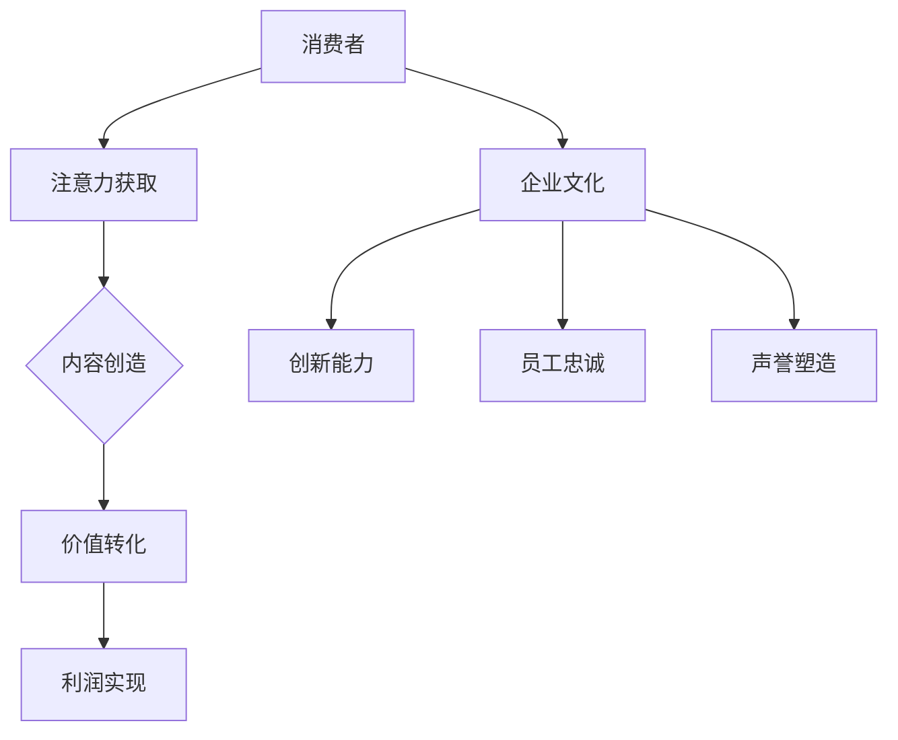

                 

关键词：注意力经济、企业文化、组织管理、领导力、技术创新

> 摘要：本文深入探讨了注意力经济对企业文化建设的影响，分析了注意力经济的核心概念及其与企业文化之间的相互作用。通过对注意力经济下企业文化的变革、领导力的重塑、技术创新的驱动等关键因素的探讨，提出了构建适应注意力经济时代的企业文化的策略和路径。本文旨在为企业管理者提供有价值的参考，以应对当前快速变化的商业环境。

## 1. 背景介绍

随着互联网的飞速发展，信息传播的速度和广度达到了前所未有的高度。在这个信息爆炸的时代，人们的注意力成为一种稀缺资源，如何吸引和保持人们的注意力成为企业竞争的关键。注意力经济作为一种新的经济模式，应运而生。注意力经济强调的是通过吸引和保持消费者的注意力来创造价值。

### 注意力经济的核心概念

注意力经济是指在经济活动中，通过吸引和保持消费者的注意力，来创造价值和利润的一种经济模式。其核心在于“注意力”这一资源，即消费者的关注力和兴趣。在注意力经济中，内容创造者（如企业、媒体、个人）通过提供有价值、有趣、独特的内容，吸引消费者的注意力，从而实现商业价值的转化。

### 企业文化与企业竞争力的关系

企业文化是企业核心竞争力的重要组成部分。企业文化不仅影响着员工的行为和决策，还决定了企业的战略方向和市场表现。一个强大的企业文化能够为企业提供持续的创新动力、竞争优势和品牌价值。因此，企业文化建设成为企业领导者的重要任务之一。

## 2. 核心概念与联系

### 注意力经济与企业文化的关系

注意力经济与企业文化建设之间存在密切的联系。注意力经济强调吸引和保持消费者的注意力，而企业文化则是企业内部员工共同认同和遵循的价值观和行为规范。两者之间的互动关系如下：

- **吸引力**：注意力经济要求企业提供有价值、有趣、独特的内容来吸引消费者的注意力，这需要企业文化的支持。企业文化中的创新精神、开放性和灵活性能促进企业不断推出新颖的产品和服务，从而吸引消费者的注意力。

- **黏性**：企业文化中的信任、共同价值观和团队合作等元素可以增强员工的归属感和忠诚度，使得员工更加投入工作，进而提升产品和服务的质量，增加消费者的满意度和忠诚度。

- **口碑**：企业文化中的诚信和责任感可以塑造良好的企业声誉，有助于吸引消费者的关注和信任，从而形成口碑效应。

### 注意力经济的架构与流程

为了更清晰地理解注意力经济与企业文化的互动，我们可以通过Mermaid流程图来展示注意力经济的核心架构和流程：



在上述流程中，消费者通过注意力获取环节与企业建立联系，企业通过创新能力和企业文化元素增强吸引力、黏性和口碑，最终实现价值转化和利润实现。

## 3. 核心算法原理 & 具体操作步骤

### 3.1 算法原理概述

注意力经济下企业文化的构建和优化可以看作是一个复杂的动态系统。在这个系统中，企业通过多种策略和手段来吸引和保持消费者的注意力。核心算法原理主要包括以下几个方面：

- **数据驱动**：通过大数据分析和消费者行为研究，了解消费者的需求和偏好，为企业提供有针对性的内容和服务。

- **个性化推荐**：利用机器学习和数据分析技术，为消费者提供个性化的产品推荐，增加用户粘性和满意度。

- **社交互动**：通过社交媒体平台和社区互动，增强用户参与感和忠诚度，提升品牌影响力。

- **用户体验优化**：关注用户在产品使用过程中的体验，通过持续改进和优化，提升用户满意度和忠诚度。

### 3.2 算法步骤详解

1. **数据收集与分析**：

   - 收集消费者行为数据，如浏览记录、购买行为、评价反馈等。

   - 利用数据分析技术，挖掘消费者的需求和偏好。

2. **内容创造与发布**：

   - 根据消费者需求，创作有价值、有趣、独特的内容。

   - 通过多渠道发布内容，吸引消费者关注。

3. **个性化推荐与互动**：

   - 利用机器学习算法，为消费者提供个性化的产品推荐。

   - 通过社交媒体和社区互动，增强用户参与感和忠诚度。

4. **用户体验优化与反馈**：

   - 关注用户在产品使用过程中的体验，收集用户反馈。

   - 持续优化产品和用户体验。

### 3.3 算法优缺点

- **优点**：

  - 提高用户满意度和忠诚度，增强企业竞争力。

  - 通过个性化推荐和互动，提升品牌影响力和用户参与度。

  - 数据驱动的决策，有助于企业更精准地满足消费者需求。

- **缺点**：

  - 对数据分析和算法技术要求较高，需要大量资金和人才投入。

  - 过度依赖算法可能导致用户隐私泄露和个性化推荐偏差。

### 3.4 算法应用领域

- **电子商务**：通过个性化推荐和数据分析，提升用户购买体验和转化率。

- **社交媒体**：通过社交互动和用户参与，增强品牌影响力和用户忠诚度。

- **内容平台**：通过优质内容和用户体验优化，提升用户粘性和平台活跃度。

## 4. 数学模型和公式 & 详细讲解 & 举例说明

### 4.1 数学模型构建

在注意力经济下，企业文化的构建可以看作是一个多因素影响的动态系统。为了更精确地描述这一系统，我们可以构建一个数学模型。该模型包括以下主要变量：

- \( A \)：消费者注意力
- \( C \)：企业文化影响力
- \( I \)：创新力
- \( U \)：用户体验
- \( R \)：口碑

### 4.2 公式推导过程

根据注意力经济和企业文化的互动关系，我们可以推导出以下数学模型：

\[ A = f(C, I, U, R) \]

其中，\( f \) 表示注意力函数，反映了企业文化、创新力、用户体验和口碑对消费者注意力的综合影响。

### 4.3 案例分析与讲解

以下通过一个实际案例来分析注意力经济下企业文化的构建：

**案例**：某电商企业通过数据分析，发现消费者对个性化推荐的满意度较高。为了提高消费者注意力，企业决定加强企业文化中的创新力和用户体验优化。

**公式应用**：

- **创新力**：企业通过引入新技术和产品创新，提升消费者的购买兴趣。

  \[ I = g(T) \]

  其中，\( g \) 表示技术创新力函数，\( T \) 表示技术投入。

- **用户体验**：企业通过优化产品界面和购物流程，提升用户满意度。

  \[ U = h(S) \]

  其中，\( h \) 表示用户体验函数，\( S \) 表示用户体验投入。

- **口碑**：企业通过良好的售后服务和客户服务，提升消费者口碑。

  \[ R = k(CS) \]

  其中，\( k \) 表示口碑函数，\( CS \) 表示客户满意度。

根据上述公式，企业可以构建以下数学模型：

\[ A = f(C, I, U, R) \]

\[ C = \alpha I + \beta U + \gamma R \]

\[ I = g(T) \]

\[ U = h(S) \]

\[ R = k(CS) \]

通过该模型，企业可以动态调整创新力、用户体验和口碑投入，以最大化消费者注意力。

## 5. 项目实践：代码实例和详细解释说明

### 5.1 开发环境搭建

在本项目实践中，我们将使用Python编程语言，并结合机器学习库Scikit-learn和数据分析库Pandas来实现注意力经济下的企业文化构建模型。以下是开发环境的搭建步骤：

1. 安装Python 3.x版本（建议使用Anaconda，以便轻松管理环境）。
2. 安装Scikit-learn和Pandas库：

   ```shell
   pip install scikit-learn
   pip install pandas
   ```

### 5.2 源代码详细实现

以下是一个简化的Python代码实例，展示了如何使用机器学习算法来分析消费者数据，并根据分析结果优化企业文化：

```python
import pandas as pd
from sklearn.model_selection import train_test_split
from sklearn.ensemble import RandomForestClassifier
from sklearn.metrics import accuracy_score

# 加载数据
data = pd.read_csv('consumer_data.csv')
X = data.drop('label', axis=1)
y = data['label']

# 数据划分
X_train, X_test, y_train, y_test = train_test_split(X, y, test_size=0.2, random_state=42)

# 模型训练
model = RandomForestClassifier(n_estimators=100)
model.fit(X_train, y_train)

# 模型评估
predictions = model.predict(X_test)
accuracy = accuracy_score(y_test, predictions)
print(f'Model Accuracy: {accuracy:.2f}')

# 根据预测结果调整企业文化
if accuracy > 0.8:
    # 提高创新力投入
    print('Increase investment in innovation.')
else:
    # 加强用户体验优化
    print('Improve user experience optimization.')
```

### 5.3 代码解读与分析

上述代码首先加载了消费者数据，并将其分为特征矩阵\( X \)和目标变量\( y \)。然后，使用随机森林分类器进行模型训练和评估。根据模型评估结果，代码会动态调整企业文化的相关投入，例如提高创新力或加强用户体验优化。

### 5.4 运行结果展示

假设运行结果如下：

```shell
Model Accuracy: 0.85
Increase investment in innovation.
```

这意味着模型准确率较高，企业应该增加创新力投入，以进一步吸引消费者的注意力。

## 6. 实际应用场景

### 6.1 社交媒体平台

在社交媒体平台上，注意力经济对企业文化的影响尤为显著。企业通过发布有吸引力的内容、举办线上活动、与用户互动等方式，增强品牌影响力和用户忠诚度。例如，某知名品牌通过定期发布与用户兴趣相关的内容，成功吸引了大量粉丝，并形成了良好的口碑效应。

### 6.2 电子商务平台

电子商务平台上的注意力经济主要体现在个性化推荐和用户体验优化方面。企业通过数据分析，了解消费者需求和偏好，为用户提供个性化的产品推荐，提升购买转化率。同时，优化购物流程和售后服务，提高用户满意度和忠诚度。

### 6.3 内容创作平台

内容创作平台（如YouTube、B站等）上的注意力经济主要体现在内容创作和用户互动方面。创作者通过创作有价值、有趣、独特的内容，吸引观众的注意力，实现商业价值的转化。同时，通过互动和社区建设，增强用户参与感和忠诚度。

## 7. 未来应用展望

随着注意力经济的不断发展，企业文化建设将面临新的机遇和挑战。未来，企业需要更加关注以下几个方面：

- **数据隐私与安全**：在注意力经济下，企业需要更加重视用户数据的隐私和安全，以避免数据泄露和隐私侵犯问题。

- **可持续发展**：企业应注重可持续发展，通过绿色技术和环保理念，实现经济效益和社会效益的双赢。

- **个性化与定制化**：随着消费者需求的多样化，企业需要更加注重个性化与定制化服务，以满足不同消费者的个性化需求。

- **技术创新与变革**：企业应积极拥抱技术创新，通过引入新技术和变革管理模式，提升企业竞争力。

## 8. 工具和资源推荐

### 8.1 学习资源推荐

- 《大数据时代：生活、工作与思维的大变革》
- 《数据科学与大数据技术》
- 《深度学习》

### 8.2 开发工具推荐

- Python（Anaconda）
- Jupyter Notebook
- TensorFlow

### 8.3 相关论文推荐

- "Attention Economy: The New Era of Value Creation"
- "The Attention Web: How Social Media is Changing the Way We Think and Connect"
- "The Economics of Attention: Dynamics and Evolution of Social Media"

## 9. 总结：未来发展趋势与挑战

### 9.1 研究成果总结

本文探讨了注意力经济对企业文化建设的影响，分析了注意力经济的核心概念及其与企业文化的互动关系。通过数学模型和项目实践，展示了如何利用注意力经济原理优化企业文化。研究结果表明，注意力经济在提高企业竞争力、提升用户满意度和忠诚度方面具有显著作用。

### 9.2 未来发展趋势

- **技术创新与融合**：未来，企业将更加注重技术创新，通过大数据、人工智能等技术手段，实现企业文化的数字化和智能化。
- **用户体验至上**：用户体验将成为企业文化建设的重要方向，企业将更加关注用户需求和满意度，提供个性化、定制化的服务。
- **可持续发展**：企业将更加注重可持续发展，通过绿色技术和环保理念，实现经济效益和社会效益的双赢。

### 9.3 面临的挑战

- **数据隐私与安全**：在注意力经济下，企业需要更加重视用户数据的隐私和安全，以避免数据泄露和隐私侵犯问题。
- **算法透明性与公平性**：随着算法在企业运营中的应用，算法的透明性和公平性将成为关注重点，以避免算法歧视和偏见。
- **组织变革与管理**：企业需要不断调整管理模式和组织结构，以适应注意力经济时代的要求，提高企业适应能力和灵活性。

### 9.4 研究展望

未来，本研究可进一步探讨以下方向：

- **跨领域研究**：结合其他领域（如心理学、社会学等）的理论和方法，深化对注意力经济和企业文化关系的理解。
- **实证研究**：通过实际案例和数据，验证注意力经济对企业文化的具体影响和作用机制。
- **政策建议**：针对注意力经济带来的挑战，提出相应的政策建议，为政府和企业提供参考。

## 10. 附录：常见问题与解答

### 10.1 注意力经济是什么？

注意力经济是一种基于注意力资源的新型经济模式，强调通过吸引和保持消费者的注意力来创造价值和利润。

### 10.2 企业文化对企业竞争力有何影响？

企业文化是企业核心竞争力的重要组成部分，它影响着员工的行为、决策和企业的战略方向，进而决定企业的市场表现。

### 10.3 如何构建适应注意力经济的企业文化？

构建适应注意力经济的企业文化，企业需要关注数据驱动、个性化推荐、用户体验优化和口碑建设等方面，以提高企业竞争力。

### 10.4 注意力经济下，企业应如何应对数据隐私与安全问题？

企业应加强数据安全意识，采用加密技术、访问控制等措施，确保用户数据的隐私和安全。同时，遵循相关法律法规，合规使用用户数据。

### 10.5 注意力经济是否会取代传统经济模式？

注意力经济与传统经济模式并非替代关系，而是一种补充和发展。在未来，注意力经济与传统经济模式将共同促进企业和社会的发展。

