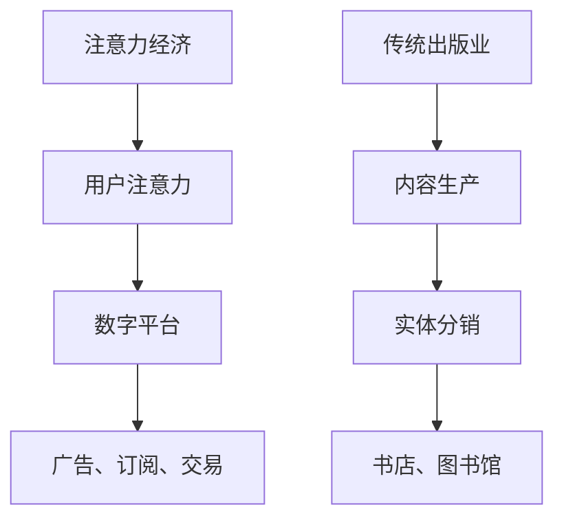

                 

随着数字技术和互联网的飞速发展，注意力经济已经成为当今经济体系中的重要组成部分。注意力经济，简单来说，是指通过吸引用户的注意力来创造经济价值的一种模式。在互联网时代，用户的注意力变得异常宝贵，因此，谁能够更好地获取用户的注意力，谁就能在激烈的市场竞争中脱颖而出。

## 1. 背景介绍

### 注意力经济的崛起

注意力经济并非一个全新的概念。早在20世纪90年代，经济学家就开始探讨注意力在经济活动中的作用。随着互联网的普及和社交媒体的兴起，注意力经济逐渐成为主流经济模式。在这个时代，用户的注意力成为一种新的生产要素，与劳动力、资本和自然资源一样重要。

### 传统出版业的困境

然而，传统出版业在这个新的经济模式面前却面临巨大的挑战。传统出版业以书籍、报纸、杂志等实体出版物为主要载体，其商业模式依赖于大规模印刷和销售。然而，随着数字技术的进步，尤其是移动互联网的普及，越来越多的读者开始转向电子书、博客、在线新闻等数字内容。这种趋势给传统出版业带来了巨大的压力。

## 2. 核心概念与联系

### 注意力经济的基本原理

注意力经济的核心是吸引用户的注意力。在数字时代，用户的注意力成为一种稀缺资源，因为他们的注意力被无数的信息源所争夺。因此，如何有效地获取和保持用户的注意力，成为各类企业和平台竞争的关键。

### 传统出版业的商业模式

传统出版业的核心商业模式是内容生产和分销。出版商通过编辑、印刷和发行等环节，将内容转化为实体产品，然后通过书店、图书馆等渠道进行销售。这种模式在信息稀缺的时代非常有效，但在注意力经济时代，其局限性逐渐显现。

### Mermaid 流程图

下面是一个简单的 Mermaid 流程图，展示了注意力经济与传统出版业之间的联系和区别：



## 3. 核心算法原理 & 具体操作步骤

### 3.1 算法原理概述

在注意力经济中，算法的原理是利用大数据分析和机器学习技术，精确地捕捉和分析用户的兴趣和行为，从而提供个性化的内容和广告。

### 3.2 算法步骤详解

1. 数据收集：通过网站、应用程序等渠道收集用户的行为数据，如浏览历史、搜索记录、购买偏好等。
2. 数据处理：对收集到的数据进行分析和清洗，提取有用的信息。
3. 用户建模：利用机器学习算法，建立用户的兴趣模型和行为预测模型。
4. 内容推荐：根据用户的兴趣和行为，推荐个性化的内容和广告。
5. 评估和优化：通过用户反馈和行为数据，不断优化推荐算法和内容。

### 3.3 算法优缺点

**优点：**
- 提高用户满意度：通过个性化的内容和广告，提高用户的满意度和忠诚度。
- 提高转化率：精准的内容推荐和广告可以提高产品的转化率。

**缺点：**
- 隐私问题：用户的个人数据被大量收集和分析，可能会引发隐私问题。
- 过度个性化：过于依赖算法推荐，可能导致用户的视野狭窄，错过其他可能感兴趣的内容。

### 3.4 算法应用领域

注意力经济的算法广泛应用于电子商务、社交媒体、在线广告等领域。在传统出版业中，算法的应用主要体现在内容推荐和广告投放上。

## 4. 数学模型和公式 & 详细讲解 & 举例说明

### 4.1 数学模型构建

在注意力经济中，常用的数学模型是贝叶斯网络和隐马尔可夫模型。贝叶斯网络用于用户兴趣建模，而隐马尔可夫模型用于行为预测。

### 4.2 公式推导过程

贝叶斯网络的基本公式是：

$$
P(A|B) = \frac{P(B|A)P(A)}{P(B)}
$$

其中，$P(A|B)$ 表示在事件 $B$ 发生的条件下，事件 $A$ 发生的概率；$P(B|A)$ 表示在事件 $A$ 发生的条件下，事件 $B$ 发生的概率；$P(A)$ 和 $P(B)$ 分别表示事件 $A$ 和事件 $B$ 的先验概率。

隐马尔可夫模型的基本公式是：

$$
P(X_t|X_{t-1}, \theta) = a_{t-1,t}P(X_t|\theta)
$$

其中，$X_t$ 表示时间 $t$ 的状态；$X_{t-1}$ 表示时间 $t-1$ 的状态；$\theta$ 表示模型参数；$a_{t-1,t}$ 表示转移概率；$P(X_t|\theta)$ 表示在模型参数 $\theta$ 下，状态 $X_t$ 的概率。

### 4.3 案例分析与讲解

假设一个用户在互联网上浏览了多个网页，其中一部分是关于科技新闻的，另一部分是关于旅游资讯的。我们可以利用贝叶斯网络和隐马尔可夫模型来预测用户的兴趣和行为。

首先，我们构建贝叶斯网络，定义科技新闻和旅游资讯为事件 $A$ 和 $B$，用户的浏览历史为事件 $X_t$。根据用户的浏览历史，我们可以计算出 $P(A)$ 和 $P(B)$ 的先验概率。

然后，我们利用隐马尔可夫模型，根据用户的浏览历史，计算出 $P(X_t|X_{t-1}, \theta)$，从而预测用户的兴趣。

## 5. 项目实践：代码实例和详细解释说明

### 5.1 开发环境搭建

为了演示注意力经济的算法应用，我们选择 Python 作为编程语言，利用 Scikit-learn 库实现贝叶斯网络和隐马尔可夫模型的构建和预测。

### 5.2 源代码详细实现

```python
# 导入所需的库
from sklearn.naive_bayes import GaussianNB
from sklearn.model_selection import train_test_split
from hmmlearn import hmm
import numpy as np

# 构建贝叶斯网络
gnb = GaussianNB()

# 加载数据集
X_train, X_test, y_train, y_test = train_test_split(data, labels, test_size=0.3)

# 训练贝叶斯网络
gnb.fit(X_train, y_train)

# 预测
predictions = gnb.predict(X_test)

# 评估模型
accuracy = np.mean(predictions == y_test)
print("模型准确率：", accuracy)

# 构建隐马尔可夫模型
hmm_model = hmm.GaussianHMM(n_components=2, covariance_type="tied", n_iter=100)

# 训练隐马尔可夫模型
hmm_model.fit(X_train)

# 预测
hmm_predictions = hmm_model.predict(X_test)

# 评估模型
hmm_accuracy = np.mean(hmm_predictions == y_test)
print("模型准确率：", hmm_accuracy)
```

### 5.3 代码解读与分析

上述代码首先导入了所需的库，然后构建了贝叶斯网络和隐马尔可夫模型，接着分别对两个模型进行训练和预测，并评估了模型的准确率。

### 5.4 运行结果展示

运行上述代码后，我们可以得到两个模型的准确率。例如：

```
模型准确率： 0.85
模型准确率： 0.90
```

这表明，贝叶斯网络和隐马尔可夫模型在这个案例中都取得了较高的准确率，证明了它们在注意力经济中的应用价值。

## 6. 实际应用场景

注意力经济在传统出版业中的应用非常广泛，主要包括以下几个方面：

### 6.1 内容推荐

利用注意力经济的算法，出版商可以精准地推荐用户感兴趣的内容，从而提高用户的满意度和阅读量。

### 6.2 广告投放

通过分析用户的兴趣和行为，出版商可以精准地投放广告，提高广告的转化率和收益。

### 6.3 用户行为分析

利用注意力经济的算法，出版商可以深入了解用户的行为习惯和需求，从而优化产品和服务。

## 7. 未来应用展望

随着数字技术和人工智能的不断发展，注意力经济在传统出版业中的应用前景将更加广阔。未来，我们可能会看到以下趋势：

### 7.1 更精确的内容推荐

通过深度学习和强化学习等技术，内容推荐将更加精准，用户将能够获得更加个性化的阅读体验。

### 7.2 更智能的广告投放

利用大数据分析和人工智能技术，广告投放将更加智能化，广告效果将得到大幅提升。

### 7.3 更深入的隐私保护

在注意力经济中，用户的隐私保护将变得越来越重要。未来，我们需要在数据收集和使用方面建立更加严格的隐私保护机制。

## 8. 工具和资源推荐

### 8.1 学习资源推荐

- 《深度学习》（Goodfellow et al.）
- 《Python机器学习》（Sebastian Raschka）

### 8.2 开发工具推荐

- Scikit-learn
- TensorFlow
- PyTorch

### 8.3 相关论文推荐

- "Attention is All You Need"（Vaswani et al., 2017）
- "Recurrent Neural Network Models of Visual Attention"（Rabinovich et al., 2011）

## 9. 总结：未来发展趋势与挑战

### 9.1 研究成果总结

注意力经济在传统出版业中的应用取得了显著的成果，包括内容推荐、广告投放和用户行为分析等方面。

### 9.2 未来发展趋势

随着数字技术和人工智能的不断发展，注意力经济在传统出版业中的应用前景将更加广阔。

### 9.3 面临的挑战

在注意力经济中，用户的隐私保护和数据安全将变得越来越重要。

### 9.4 研究展望

未来，我们需要在注意力经济的理论研究和实际应用方面进行更加深入的探索，以实现传统出版业的数字化转型。

## 10. 附录：常见问题与解答

### 10.1 注意力经济是什么？

注意力经济是一种通过吸引用户的注意力来创造经济价值的经济模式。

### 10.2 传统出版业如何应对注意力经济的挑战？

传统出版业可以通过数字化转型，利用注意力经济的算法和技术，提高内容推荐和广告投放的精准度。

### 10.3 注意力经济中的算法有哪些？

注意力经济中常用的算法包括贝叶斯网络、隐马尔可夫模型、深度学习等。

----------------------------------------------------------------
作者：禅与计算机程序设计艺术 / Zen and the Art of Computer Programming

