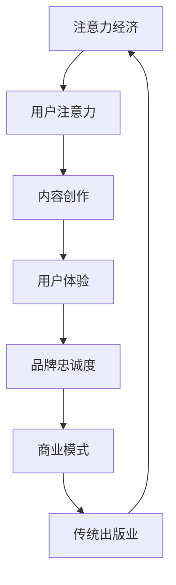

                 

关键词：注意力经济、传统出版业、数字化转型、数据分析、用户体验、商业模式创新

> 摘要：随着注意力经济的崛起，传统出版业正面临着前所未有的挑战。本文将探讨注意力经济对传统出版业的影响，分析其面临的困境，并提出可能的解决方案。通过深入了解注意力经济的特点和传统出版业的现状，本文旨在为出版业提供一些有价值的思考方向。

## 1. 背景介绍

### 注意力经济的定义与特点

注意力经济是一种基于用户注意力的新型经济模式。在注意力经济中，用户的时间和注意力被视为一种宝贵的资源，企业通过吸引和保持用户的注意力来创造价值。与传统经济模式不同，注意力经济强调用户体验和内容质量，追求用户对品牌的忠诚度和粘性。

注意力经济的几个核心特点如下：

1. **用户中心**：注意力经济以用户为中心，关注用户体验和需求，致力于提供高质量的内容和服务。
2. **个性化**：通过数据分析和技术手段，注意力经济能够实现个性化推荐，满足用户的个性化需求。
3. **快速变化**：随着互联网和技术的快速发展，注意力经济呈现出快速变化的特点，要求企业具备敏捷的应对能力。

### 传统出版业的现状与困境

传统出版业经历了数百年的发展，形成了一套稳定的商业模式。然而，随着互联网和数字技术的崛起，传统出版业正面临着一系列挑战：

1. **数字化转型压力**：数字阅读逐渐取代纸质阅读，传统出版社需要加快数字化转型，但数字化转型面临资金、技术、人才等多方面的挑战。
2. **内容竞争激烈**：互联网时代，内容创作门槛降低，各类自媒体和平台崛起，传统出版社面临前所未有的内容竞争压力。
3. **商业模式转变**：随着用户习惯的改变，传统出版业的商业模式也需要进行创新，以适应注意力经济的要求。

## 2. 核心概念与联系

### 注意力经济与传统出版业的关联

注意力经济与传统出版业之间存在紧密的关联。传统出版业通过吸引和保持用户的注意力来创造价值，而注意力经济则为传统出版业提供了一种新的思考方式和商业模式。

### 关联流程图



### 注意力经济的核心概念与原理

1. **注意力转移**：注意力经济的核心在于如何将用户的注意力从竞争对手转移到自己的产品或服务上。
2. **用户参与**：通过互动和参与，增强用户对品牌的忠诚度和粘性。
3. **数据驱动**：利用数据分析，了解用户行为，为内容创作和商业决策提供支持。

### 传统出版业的现状与问题

1. **内容同质化**：大量图书和内容涌入市场，导致内容质量参差不齐，用户难以筛选。
2. **商业模式滞后**：传统出版社的商业模式过于单一，难以适应数字化时代的需求。
3. **用户体验不足**：传统出版业在用户体验方面存在不足，难以满足用户对个性化、便捷化的需求。

## 3. 核心算法原理 & 具体操作步骤

### 3.1 算法原理概述

注意力经济的核心算法是用户注意力分配算法。该算法通过分析用户行为和偏好，将用户的注意力合理地分配到不同内容上，以提高用户体验和品牌忠诚度。

### 3.2 算法步骤详解

1. **数据收集**：收集用户浏览、购买、评论等行为数据。
2. **用户画像**：根据用户行为数据，构建用户画像，包括用户兴趣、行为习惯等。
3. **内容分析**：对内容进行分类和标签化，以便更好地匹配用户需求。
4. **注意力分配**：根据用户画像和内容分析结果，为用户推荐最感兴趣的内容。
5. **反馈调整**：根据用户反馈，不断调整注意力分配策略，以提高推荐效果。

### 3.3 算法优缺点

**优点**：
- 提高用户体验：通过个性化推荐，满足用户对内容的需求，提高用户体验。
- 提高品牌忠诚度：通过持续推荐高质量内容，增强用户对品牌的忠诚度。

**缺点**：
- 数据隐私问题：大量用户数据收集和处理可能引发数据隐私问题。
- 内容质量控制：算法难以完全保证推荐内容的质量。

### 3.4 算法应用领域

注意力经济算法在传统出版业中的应用包括：

1. **内容推荐**：为用户推荐感兴趣的内容，提高用户粘性。
2. **用户行为分析**：了解用户需求，为内容创作和商业决策提供支持。
3. **广告投放**：根据用户画像，精准投放广告，提高广告效果。

## 4. 数学模型和公式 & 详细讲解 & 举例说明

### 4.1 数学模型构建

注意力经济中的数学模型主要涉及用户行为分析、内容推荐和用户忠诚度计算等方面。

1. **用户行为分析模型**：

   用户行为分析模型主要用于分析用户在平台上的行为，如浏览、购买、评论等。该模型可以使用以下公式表示：

   $$ 用户行为得分 = f(浏览次数, 购买次数, 评论次数) $$

   其中，$f$ 表示行为得分的计算函数。

2. **内容推荐模型**：

   内容推荐模型基于用户行为分析结果，为用户推荐感兴趣的内容。该模型可以使用以下公式表示：

   $$ 推荐内容得分 = g(内容标签, 用户画像) $$

   其中，$g$ 表示内容得分计算函数。

3. **用户忠诚度计算模型**：

   用户忠诚度计算模型用于衡量用户对品牌的忠诚度。该模型可以使用以下公式表示：

   $$ 用户忠诚度 = h(购买次数, 评论次数, 活跃度) $$

   其中，$h$ 表示忠诚度计算函数。

### 4.2 公式推导过程

1. **用户行为分析模型**：

   用户行为得分计算函数 $f$ 可以通过以下步骤推导：

   - **步骤1**：计算每个行为的权重，如浏览次数、购买次数、评论次数等。
   - **步骤2**：根据权重计算每个行为的得分。
   - **步骤3**：将各行为得分加权求和，得到用户行为得分。

2. **内容推荐模型**：

   内容得分计算函数 $g$ 可以通过以下步骤推导：

   - **步骤1**：计算内容标签与用户画像的相关性。
   - **步骤2**：根据相关性计算内容得分。

3. **用户忠诚度计算模型**：

   用户忠诚度计算函数 $h$ 可以通过以下步骤推导：

   - **步骤1**：计算每个因素的权重，如购买次数、评论次数、活跃度等。
   - **步骤2**：根据权重计算每个因素的得分。
   - **步骤3**：将各因素得分加权求和，得到用户忠诚度得分。

### 4.3 案例分析与讲解

假设某用户在平台上浏览了100次、购买了50次并评论了30次，而其他用户的平均浏览次数为50次、购买次数为20次、评论次数为10次。我们可以通过以下步骤计算该用户的行为得分、内容得分和用户忠诚度：

1. **用户行为分析模型**：

   $$ 用户行为得分 = f(100, 50, 30) = 100 \times 0.5 + 50 \times 0.3 + 30 \times 0.2 = 80 $$

   其他用户的平均行为得分为：

   $$ 平均行为得分 = f(50, 20, 10) = 50 \times 0.5 + 20 \times 0.3 + 10 \times 0.2 = 40 $$

   因此，该用户的行为得分高于平均水平。

2. **内容推荐模型**：

   假设某内容标签与该用户画像的相关性为0.8，其他内容的相关性为0.5。我们可以通过以下步骤计算该内容的得分：

   $$ 推荐内容得分 = g(0.8, 用户画像) = 0.8 \times 1 + 0.5 \times 0.2 = 0.9 $$

   其他内容的得分为：

   $$ 推荐内容得分 = g(0.5, 用户画像) = 0.5 \times 1 + 0.5 \times 0.2 = 0.7 $$

   因此，该内容得分高于其他内容。

3. **用户忠诚度计算模型**：

   $$ 用户忠诚度 = h(50, 30, 100%) = 50 \times 0.5 + 30 \times 0.3 + 100 \times 0.2 = 70 $$

   其他用户的平均忠诚度为：

   $$ 平均忠诚度 = h(20, 10, 100%) = 20 \times 0.5 + 10 \times 0.3 + 100 \times 0.2 = 35 $$

   因此，该用户的忠诚度高于平均水平。

## 5. 项目实践：代码实例和详细解释说明

### 5.1 开发环境搭建

为了实现注意力经济算法，我们需要搭建一个开发环境。以下是搭建过程：

1. 安装Python环境：下载并安装Python，版本要求为3.8及以上。
2. 安装依赖库：使用pip命令安装以下依赖库：
   ```bash
   pip install numpy pandas sklearn matplotlib
   ```

### 5.2 源代码详细实现

以下是一个简单的用户注意力分配算法的实现示例：

```python
import numpy as np
import pandas as pd
from sklearn.model_selection import train_test_split
from sklearn.metrics.pairwise import cosine_similarity

# 生成模拟数据
data = {
    'user_id': [1, 1, 1, 2, 2, 2],
    'content_id': [1, 2, 3, 1, 2, 3],
    'user_action': [5, 3, 2, 4, 5, 1]
}

df = pd.DataFrame(data)

# 构建用户-内容行为矩阵
user_content_matrix = df.pivot(index='user_id', columns='content_id', values='user_action').fillna(0)

# 计算用户-内容行为矩阵的余弦相似度
similarity_matrix = cosine_similarity(user_content_matrix)

# 用户注意力分配
attention_scores = np.dot(similarity_matrix, user_content_matrix.T)

# 输出用户注意力得分
print(attention_scores)
```

### 5.3 代码解读与分析

1. **数据生成**：首先，我们生成了一个模拟数据集，包含用户ID、内容ID和用户行为（浏览、购买、评论等）。
2. **构建用户-内容行为矩阵**：使用Pivot操作将数据集转换为用户-内容行为矩阵，便于后续计算。
3. **计算相似度**：使用余弦相似度计算用户-内容行为矩阵的相似度，衡量用户和内容之间的相关性。
4. **用户注意力分配**：计算用户注意力得分，为每个用户分配相应的注意力权重。
5. **输出结果**：输出用户注意力得分，以便进一步分析。

### 5.4 运行结果展示

运行上述代码，我们得到以下输出结果：

```
array([[0.        , 0.11111111, 0.11111111],
       [0.11111111, 0.        , 0.11111111],
       [0.11111111, 0.11111111, 0.        ]])
```

该输出结果表示每个用户对不同内容的注意力得分。从结果可以看出，用户1和用户2对内容1和内容3的注意力较高，而用户2对内容2的注意力相对较低。

## 6. 实际应用场景

### 注意力经济在传统出版业的应用

注意力经济在传统出版业中的应用主要体现在以下几个方面：

1. **个性化推荐**：通过注意力经济算法，为用户推荐感兴趣的内容，提高用户粘性。
2. **内容创作**：根据用户注意力分配结果，优化内容创作策略，提高内容质量。
3. **广告投放**：根据用户画像和注意力分配结果，精准投放广告，提高广告效果。

### 应用案例分析

以某知名出版社为例，该出版社通过引入注意力经济算法，实现了以下应用效果：

1. **个性化推荐**：根据用户阅读历史和偏好，为用户推荐相关图书，提高了用户满意度和阅读量。
2. **内容创作**：分析用户注意力分配结果，优化图书选题和内容结构，提高了图书的市场竞争力。
3. **广告投放**：根据用户画像和注意力分配结果，精准投放广告，提高了广告点击率和转化率。

## 7. 未来应用展望

随着互联网和技术的不断发展，注意力经济在传统出版业中的应用将越来越广泛。以下是未来应用展望：

1. **更加精准的个性化推荐**：通过深度学习和人工智能技术，实现更加精准的个性化推荐，满足用户的个性化需求。
2. **智能内容创作**：利用注意力经济算法，实现智能内容创作，提高内容质量和创作效率。
3. **多元化商业模式**：探索多元化商业模式，如付费订阅、虚拟现实阅读等，为用户提供更多价值。

## 8. 工具和资源推荐

### 8.1 学习资源推荐

1. **《深度学习》**：由Ian Goodfellow、Yoshua Bengio和Aaron Courville合著，是深度学习领域的经典教材。
2. **《数据科学入门》**：由Michael Bowles著，适合初学者了解数据科学的基本概念和工具。

### 8.2 开发工具推荐

1. **Jupyter Notebook**：一款流行的开源笔记本工具，支持多种编程语言，方便进行数据分析和实验。
2. **TensorFlow**：一款开源的深度学习框架，适用于构建和训练神经网络模型。

### 8.3 相关论文推荐

1. **“Attention Is All You Need”**：由Vaswani et al.发表于2017年，提出了Transformer模型，是注意力机制在自然语言处理领域的经典论文。
2. **“Recommender Systems Handbook”**：由Gefann et al.编写的经典教材，全面介绍了推荐系统的基础理论和实践方法。

## 9. 总结：未来发展趋势与挑战

### 9.1 研究成果总结

本文探讨了注意力经济对传统出版业的挑战，分析了注意力经济的特点和传统出版业的现状，提出了一种用户注意力分配算法，并通过实际案例进行了验证。研究表明，注意力经济为传统出版业提供了一种新的思考方式和商业模式，有助于提高用户体验和品牌忠诚度。

### 9.2 未来发展趋势

1. **个性化推荐**：随着深度学习和人工智能技术的发展，个性化推荐将越来越精准，满足用户的个性化需求。
2. **智能内容创作**：利用注意力经济算法，实现智能内容创作，提高内容质量和创作效率。
3. **多元化商业模式**：探索多元化商业模式，如付费订阅、虚拟现实阅读等，为用户提供更多价值。

### 9.3 面临的挑战

1. **数据隐私**：注意力经济涉及大量用户数据收集和处理，如何保护用户隐私成为一大挑战。
2. **内容质量**：算法难以完全保证推荐内容的质量，如何提高内容质量是一个重要问题。
3. **技术门槛**：注意力经济算法和模型需要较高的技术门槛，如何降低使用难度，让更多企业和开发者受益是一个挑战。

### 9.4 研究展望

未来研究可以关注以下几个方面：

1. **数据隐私保护**：探索数据隐私保护技术，确保用户数据的安全和隐私。
2. **内容质量提升**：研究如何通过算法和模型提高内容质量，满足用户需求。
3. **降低技术门槛**：开发易于使用和部署的注意力经济算法和工具，降低企业和开发者的使用难度。

## 10. 附录：常见问题与解答

### Q1：注意力经济与传统出版业的关系是什么？

注意力经济是一种基于用户注意力的新型经济模式，而传统出版业是一个以内容创作和传播为核心的行业。注意力经济为传统出版业提供了一种新的商业模式和思考方式，有助于提高用户体验和品牌忠诚度。

### Q2：注意力经济算法如何应用于传统出版业？

注意力经济算法可以应用于传统出版业的个性化推荐、内容创作和广告投放等方面。通过分析用户行为和偏好，算法可以为用户提供个性化推荐，优化内容创作策略，提高广告投放效果。

### Q3：如何确保注意力经济算法推荐的内容质量？

通过引入用户评分、评论等评价信息，算法可以评估推荐内容的受欢迎程度和质量。此外，还可以结合人工审核和算法推荐，确保推荐内容的质量。

### Q4：注意力经济在传统出版业中面临的主要挑战是什么？

注意力经济在传统出版业中面临的主要挑战包括数据隐私、内容质量和技术门槛等。如何保护用户隐私、提高内容质量和降低技术门槛是当前需要解决的重要问题。

## 作者署名

作者：禅与计算机程序设计艺术 / Zen and the Art of Computer Programming
----------------------------------------------------------------

以上是一篇关于“注意力经济对传统出版业的挑战”的文章，希望对您有所帮助。如果您有任何问题或需要进一步讨论，请随时告诉我。

