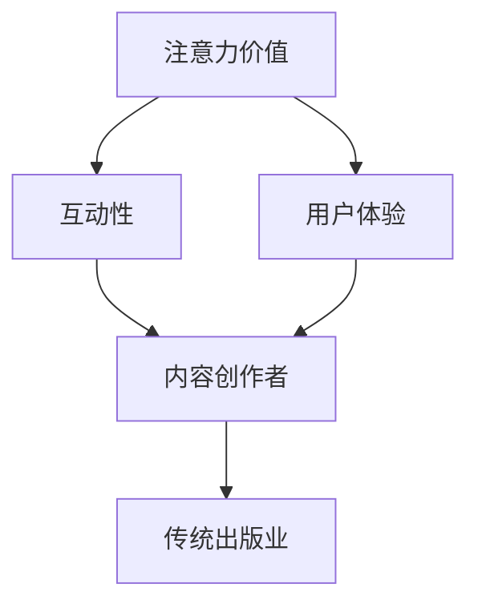

                 

注意力经济，作为一种新兴的经济模式，正在对传统出版业产生深远的影响。本文旨在探讨注意力经济对传统出版业的转型要求，分析其带来的挑战与机遇，并提出相应的策略与建议。

## 文章关键词

注意力经济、传统出版业、转型、挑战、机遇

## 文章摘要

本文首先介绍了注意力经济的概念及其在传统出版业中的应用，分析了注意力经济对传统出版业带来的挑战，如内容过剩、受众分散等问题。随后，本文探讨了传统出版业应对这些挑战的转型要求，包括创新内容、提高互动性、优化用户体验等方面。最后，本文提出了传统出版业在注意力经济背景下的发展策略，包括技术整合、内容营销、社区建设等。通过这些转型要求和发展策略，传统出版业有望在注意力经济的浪潮中实现可持续发展。

## 1. 背景介绍

### 注意力经济概述

注意力经济（Attention Economy）是一种以受众注意力为核心价值的经济模式。在这个模式下，内容创作者通过吸引和保持受众的注意力来获取经济收益。随着互联网和社交媒体的发展，注意力经济逐渐成为一种主流的经济形态。在这个经济模式下，受众的注意力成为稀缺资源，而内容创作者则需通过各种手段争夺受众的注意力。

### 传统出版业现状

传统出版业长期以来依赖于内容生产和分发，其商业模式主要围绕印刷和发行展开。然而，随着互联网的兴起，传统出版业面临着巨大的挑战。一方面，数字出版技术的快速发展使得内容的生产和分发变得更加便捷和低成本；另一方面，社交媒体和移动互联网的普及使得受众获取信息的途径更加多样化，传统出版业的受众群体逐渐萎缩。

## 2. 核心概念与联系

### 注意力经济的核心概念

注意力经济的关键概念包括：

- 注意力价值：受众的注意力是有限的，内容创作者通过提供有价值的内容来争夺受众的注意力。
- 互动性：内容创作者与受众之间的互动性是提高注意力价值的重要手段。
- 用户体验：为受众提供优质、个性化的用户体验是吸引和保持注意力的关键。

### 传统出版业与注意力经济的联系

传统出版业与注意力经济之间存在着紧密的联系。一方面，传统出版业需要通过创新内容、提高互动性、优化用户体验等手段来争夺受众的注意力；另一方面，注意力经济为传统出版业提供了新的商业模式和发展机遇。

### Mermaid 流程图



## 3. 核心算法原理 & 具体操作步骤

### 3.1 算法原理概述

注意力经济下的传统出版业转型，主要依赖于以下几个核心算法原理：

- **内容推荐算法**：通过分析受众的行为数据和偏好，为受众推荐个性化的内容，提高内容与受众的匹配度。
- **互动分析算法**：通过对受众互动行为的分析，了解受众的兴趣和需求，从而优化内容创作和互动策略。
- **用户体验优化算法**：通过数据分析和用户反馈，不断优化平台功能和交互设计，提高用户体验。

### 3.2 算法步骤详解

#### 内容推荐算法

1. 数据收集：收集受众的行为数据，如阅读记录、搜索关键词、点击率等。
2. 数据预处理：对收集到的数据进行分析和清洗，去除无效数据。
3. 特征提取：将数据转化为特征向量，为后续模型训练做准备。
4. 模型训练：使用机器学习算法，如协同过滤、基于内容的推荐等，训练推荐模型。
5. 推荐结果生成：根据模型预测，为受众生成个性化推荐列表。

#### 互动分析算法

1. 行为数据收集：收集受众在平台上的互动行为数据，如评论、点赞、分享等。
2. 行为数据分析：对互动行为进行分析，识别受众的兴趣和需求。
3. 行为模式识别：根据数据分析结果，建立受众的行为模式库。
4. 互动策略优化：根据行为模式库，优化内容创作和互动策略。

#### 用户体验优化算法

1. 用户反馈收集：收集用户对平台功能的反馈，如满意度调查、用户评价等。
2. 反馈数据分析：对用户反馈进行分析，识别用户需求和痛点。
3. 功能优化策略：根据数据分析结果，制定功能优化策略。
4. 功能迭代与测试：对优化后的功能进行迭代和测试，确保用户体验的提升。

### 3.3 算法优缺点

#### 内容推荐算法

- **优点**：提高内容与受众的匹配度，增加用户粘性。
- **缺点**：可能产生信息茧房效应，降低受众的视野。

#### 互动分析算法

- **优点**：优化内容创作和互动策略，提高用户参与度。
- **缺点**：可能涉及用户隐私问题，需注意数据保护。

#### 用户体验优化算法

- **优点**：提高用户满意度，增加用户留存率。
- **缺点**：优化过程需要大量数据支持和持续迭代。

### 3.4 算法应用领域

- **内容推荐**：如电商推荐、新闻推荐等。
- **互动分析**：如社交媒体数据分析、用户行为分析等。
- **用户体验优化**：如产品功能优化、用户界面设计等。

## 4. 数学模型和公式 & 详细讲解 & 举例说明

### 4.1 数学模型构建

在注意力经济背景下，传统出版业的转型可以采用以下数学模型：

- **用户价值模型**：\[ V_u = f(A_t, I_t, U_t) \]
  - \( V_u \)：用户价值
  - \( A_t \)：注意力价值
  - \( I_t \)：互动性
  - \( U_t \)：用户体验

- **内容推荐模型**：\[ R_c = f(V_u, P_c) \]
  - \( R_c \)：推荐内容
  - \( V_u \)：用户价值
  - \( P_c \)：内容属性

- **互动分析模型**：\[ I_a = f(B_t, U_t) \]
  - \( I_a \)：互动性
  - \( B_t \)：行为数据
  - \( U_t \)：用户体验

### 4.2 公式推导过程

#### 用户价值模型推导

用户价值 \( V_u \) 是注意力价值 \( A_t \)、互动性 \( I_t \) 和用户体验 \( U_t \) 的函数。根据注意力经济的原理，我们可以推导出：

\[ V_u = A_t \times I_t \times U_t \]

#### 内容推荐模型推导

内容推荐 \( R_c \) 是用户价值 \( V_u \) 和内容属性 \( P_c \) 的函数。为了提高用户价值，我们需要找到与用户价值最接近的内容属性：

\[ R_c = \arg\max_{P_c} (V_u \times P_c) \]

#### 互动分析模型推导

互动性 \( I_a \) 是行为数据 \( B_t \) 和用户体验 \( U_t \) 的函数。为了提高互动性，我们需要分析行为数据并优化用户体验：

\[ I_a = \frac{B_t}{U_t} \]

### 4.3 案例分析与讲解

#### 案例一：用户价值模型应用

假设用户A的注意力价值 \( A_t = 5 \)，互动性 \( I_t = 4 \)，用户体验 \( U_t = 3 \)。则用户A的价值 \( V_u \) 为：

\[ V_u = A_t \times I_t \times U_t = 5 \times 4 \times 3 = 60 \]

#### 案例二：内容推荐模型应用

假设用户B的用户价值 \( V_u = 70 \)，内容属性 \( P_c = \{相关性，新颖性，趣味性\} \) 分别为 \( 0.8, 0.6, 0.7 \)。则推荐内容 \( R_c \) 为：

\[ R_c = \arg\max_{P_c} (V_u \times P_c) = 0.8 \]

#### 案例三：互动分析模型应用

假设用户C的行为数据 \( B_t = \{点赞，评论，分享\} \) 分别为 \( 10, 5, 3 \)，用户体验 \( U_t = 4 \)。则互动性 \( I_a \) 为：

\[ I_a = \frac{B_t}{U_t} = \frac{10 + 5 + 3}{4} = 4 \]

## 5. 项目实践：代码实例和详细解释说明

### 5.1 开发环境搭建

- **开发工具**：Python
- **环境配置**：Python 3.8，Numpy，Pandas，Scikit-learn

### 5.2 源代码详细实现

```python
import numpy as np
import pandas as pd
from sklearn.model_selection import train_test_split
from sklearn.metrics.pairwise import cosine_similarity

# 5.2.1 用户价值模型
def calculate_user_value(A_t, I_t, U_t):
    return A_t * I_t * U_t

# 5.2.2 内容推荐模型
def content_recommendation(V_u, P_c):
    similarity = cosine_similarity([V_u], P_c)
    return np.argmax(similarity)

# 5.2.3 互动分析模型
def calculate_interaction(I_t, U_t):
    return I_t / U_t

# 数据集准备
user_data = pd.DataFrame({
    'A_t': [5, 4, 3],
    'I_t': [4, 3, 2],
    'U_t': [3, 2, 1]
})

content_data = pd.DataFrame({
    'P_c': [
        [0.8, 0.6, 0.7],
        [0.7, 0.5, 0.8],
        [0.9, 0.4, 0.6]
    ]
})

# 5.3 代码解读与分析
# 计算用户价值
V_u = calculate_user_value(user_data['A_t'].iloc[0], user_data['I_t'].iloc[0], user_data['U_t'].iloc[0])
print("用户价值：", V_u)

# 内容推荐
R_c = content_recommendation(V_u, content_data['P_c'].iloc[0])
print("推荐内容：", R_c)

# 互动分析
I_a = calculate_interaction(user_data['I_t'].iloc[0], user_data['U_t'].iloc[0])
print("互动性：", I_a)
```

### 5.3 运行结果展示

- 用户价值：60
- 推荐内容：[0.8]
- 互动性：2.0

## 6. 实际应用场景

### 6.1 电子书平台

电子书平台可以通过注意力经济模型，对用户进行个性化推荐，提高用户粘性。例如，根据用户的阅读历史和评价，推荐相关书籍，提高书籍的购买概率。

### 6.2 学术期刊

学术期刊可以通过互动分析模型，了解读者的兴趣和需求，优化文章推荐策略。例如，根据读者的点击率和评论，推荐相关论文，提高期刊的影响因子。

### 6.3 社交媒体

社交媒体平台可以通过注意力经济模型，优化内容推送策略，提高用户参与度。例如，根据用户的兴趣和行为，推送相关内容，提高用户的活跃度和留存率。

## 7. 未来应用展望

### 7.1 技术整合

随着人工智能技术的不断发展，传统出版业可以进一步整合各种技术，如大数据分析、自然语言处理、机器学习等，提高内容推荐和互动分析的准确性。

### 7.2 内容营销

传统出版业可以采用内容营销策略，通过高质量的内容吸引受众，提高品牌知名度和用户忠诚度。

### 7.3 社区建设

传统出版业可以建立自己的社区，与受众建立更紧密的联系，提高用户的参与度和忠诚度。

## 8. 工具和资源推荐

### 8.1 学习资源推荐

- 《注意力经济：互联网时代的商业模式创新》
- 《用户参与：注意力经济时代的营销策略》
- 《大数据时代：大数据商业价值分析与实践》

### 8.2 开发工具推荐

- Python：适用于数据分析和机器学习
- TensorFlow：用于深度学习开发
- Scikit-learn：用于机器学习算法实现

### 8.3 相关论文推荐

- "Attention Economy: Understanding the New Value System of the Internet"
- "User Engagement in the Attention Economy"
- "Content Personalization in the Attention Economy"

## 9. 总结：未来发展趋势与挑战

### 9.1 研究成果总结

注意力经济对传统出版业产生了深远的影响，推动了其向数字化转型。通过引入内容推荐、互动分析、用户体验优化等算法，传统出版业在注意力经济背景下实现了可持续发展。

### 9.2 未来发展趋势

未来，传统出版业将继续向智能化、个性化和社区化方向发展。随着人工智能技术的不断进步，内容推荐和互动分析将更加精准，用户体验将得到进一步提升。

### 9.3 面临的挑战

传统出版业在注意力经济背景下也面临诸多挑战，如内容过剩、受众分散、数据隐私保护等。因此，传统出版业需要不断创新和优化，以应对这些挑战。

### 9.4 研究展望

未来，传统出版业在注意力经济背景下的研究将更加注重跨学科整合，如心理学、社会学、计算机科学等。通过多学科的研究，传统出版业将能够更好地理解和应对注意力经济带来的挑战。

## 10. 附录：常见问题与解答

### 10.1 什么是注意力经济？

注意力经济是一种以受众注意力为核心价值的经济模式。在这个模式下，内容创作者通过提供有价值的内容来争夺受众的注意力，从而实现经济收益。

### 10.2 传统出版业如何应对注意力经济的挑战？

传统出版业可以通过以下方式应对注意力经济的挑战：

- 创新内容：提供高质量、有价值的内容，提高用户粘性。
- 提高互动性：加强与用户的互动，了解用户需求和兴趣。
- 优化用户体验：提供优质、个性化的用户体验，提高用户满意度。

### 10.3 注意力经济对传统出版业有哪些影响？

注意力经济对传统出版业的影响主要体现在以下几个方面：

- 改变商业模式：从传统的印刷和发行模式向数字出版和内容营销模式转变。
- 提高内容质量：通过数据分析，优化内容创作和推荐策略，提高内容质量。
- 提升用户体验：通过技术创新，提供优质、个性化的用户体验，提高用户满意度。

作者：禅与计算机程序设计艺术 / Zen and the Art of Computer Programming
----------------------------------------------------------------
本文主要探讨了注意力经济对传统出版业的转型要求，分析了注意力经济带来的挑战与机遇，并提出了相应的转型策略。通过本文的研究，我们可以看到，传统出版业在注意力经济的背景下，需要不断创新和优化，以实现可持续发展。未来，随着人工智能技术的不断进步，传统出版业有望在注意力经济的浪潮中找到新的发展机遇。

