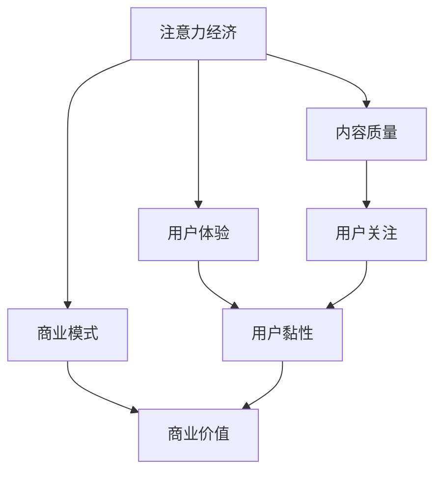

                 

关键词：注意力经济，传统出版业，数字化转型，用户体验，出版商业模式

> 摘要：随着注意力经济的崛起，传统出版业正面临着前所未有的转型挑战。本文将深入探讨注意力经济对传统出版业转型的影响，分析其在用户体验、出版商业模式以及技术手段等方面的具体要求，为传统出版业的数字化转型提供参考。

## 1. 背景介绍

### 1.1 注意力经济的兴起

注意力经济是一种基于人类注意力稀缺性的经济形态。在互联网时代，信息爆炸使得人们的注意力资源变得尤为宝贵。因此，获取和维持用户的注意力成为各类企业争夺市场份额的关键。注意力经济的基本原理是：通过提供有价值的内容或服务，吸引用户的注意力，从而实现商业价值的转化。

### 1.2 传统出版业的现状

传统出版业在过去的几百年中，一直扮演着知识传播和积累的重要角色。然而，随着互联网和数字技术的迅猛发展，传统出版业正面临着一系列挑战。首先，数字阅读的兴起使得纸质出版物的需求减少；其次，新兴的在线出版平台对传统出版市场造成了强烈冲击；最后，用户阅读习惯的改变也对传统出版业提出了新的要求。

## 2. 核心概念与联系

### 2.1 注意力经济模型

注意力经济模型可以简化为：价值 = 注意力 × 转化率。其中，注意力是指用户在特定时间段内分配给某一内容或服务的注意力资源；转化率是指注意力转化为商业价值（如订阅、购买、广告收入等）的比例。

### 2.2 传统出版业与注意力经济的联系

传统出版业与注意力经济的联系主要体现在以下几个方面：

1. **内容质量**：高质量的内容是吸引读者注意力的重要手段。传统出版业需要不断提高内容质量，以满足用户日益增长的知识需求。
2. **用户体验**：优化用户体验有助于提升用户的阅读体验，进而提高用户的关注度和转化率。
3. **商业模式**：注意力经济要求传统出版业创新商业模式，实现从传统的纸质销售模式向数字化、订阅化模式转变。

### 2.3 Mermaid 流程图

下面是一个简化的注意力经济与传统出版业联系的 Mermaid 流程图：



## 3. 核心算法原理 & 具体操作步骤

### 3.1 算法原理概述

注意力经济的核心算法可以概括为以下三个步骤：

1. **内容筛选**：根据用户兴趣和行为数据，筛选出符合用户需求的高质量内容。
2. **用户体验优化**：通过技术手段优化用户阅读体验，提高用户黏性。
3. **商业模式创新**：结合注意力经济原理，探索新的商业模式，提高商业价值。

### 3.2 算法步骤详解

#### 3.2.1 内容筛选

内容筛选是注意力经济模型的基础。具体步骤如下：

1. **数据收集**：收集用户的行为数据，如阅读历史、搜索记录、点赞评论等。
2. **特征提取**：从数据中提取与用户兴趣相关的特征，如关键词、标签、主题等。
3. **内容推荐**：根据用户特征和内容属性，利用推荐算法（如协同过滤、矩阵分解等）生成个性化内容推荐。

#### 3.2.2 用户体验优化

用户体验优化是提高用户黏性的关键。具体步骤如下：

1. **界面设计**：设计简洁、美观的界面，提高用户视觉体验。
2. **交互设计**：优化用户与内容的交互方式，如滑动翻页、弹幕评论等。
3. **内容更新**：定期更新内容，保持内容的新鲜度和吸引力。

#### 3.2.3 商业模式创新

商业模式创新是提高商业价值的重要手段。具体步骤如下：

1. **订阅服务**：推出订阅服务，吸引用户持续付费。
2. **广告合作**：与广告商合作，实现内容与广告的有机结合。
3. **IP开发**：挖掘内容价值，进行IP开发和衍生品销售。

### 3.3 算法优缺点

#### 优点

1. **个性化**：通过内容筛选和推荐，满足用户的个性化需求。
2. **高黏性**：通过优化用户体验，提高用户黏性。
3. **商业价值高**：通过商业模式创新，提高商业价值。

#### 缺点

1. **技术门槛高**：内容筛选和推荐需要复杂的算法支持，技术门槛较高。
2. **数据隐私问题**：用户行为数据的安全和隐私保护成为关注焦点。
3. **内容质量控制**：保证内容质量成为注意力经济中的挑战。

### 3.4 算法应用领域

注意力经济算法在传统出版业中的应用非常广泛，包括：

1. **内容推荐系统**：为用户提供个性化内容推荐，提高用户满意度和黏性。
2. **数字出版平台**：优化用户阅读体验，提高用户留存率和付费转化率。
3. **版权管理**：利用注意力经济原理，实现版权保护和利益最大化。

## 4. 数学模型和公式 & 详细讲解 & 举例说明

### 4.1 数学模型构建

注意力经济的数学模型可以表示为：

$$
V = f(A, R, U)
$$

其中，$V$ 表示商业价值，$A$ 表示注意力，$R$ 表示转化率，$U$ 表示用户体验。

### 4.2 公式推导过程

#### 注意力 $A$

注意力 $A$ 可以表示为：

$$
A = f(I, H)
$$

其中，$I$ 表示用户兴趣，$H$ 表示内容热度。

#### 转化率 $R$

转化率 $R$ 可以表示为：

$$
R = f(C, U)
$$

其中，$C$ 表示内容质量，$U$ 表示用户体验。

#### 用户体验 $U$

用户体验 $U$ 可以表示为：

$$
U = f(I, C, R)
$$

### 4.3 案例分析与讲解

以某在线阅读平台为例，分析注意力经济在该平台的应用。

#### 注意力 $A$

用户兴趣 $I$ 为科幻小说，内容热度 $H$ 为热门作品。因此，注意力 $A$ 可表示为：

$$
A = f(\text{科幻小说}, \text{热门作品})
$$

#### 转化率 $R$

内容质量 $C$ 为优质作品，用户体验 $U$ 为良好。因此，转化率 $R$ 可表示为：

$$
R = f(\text{优质作品}, \text{良好})
$$

#### 用户体验 $U$

用户兴趣 $I$ 为科幻小说，内容质量 $C$ 为优质作品，转化率 $R$ 为高。因此，用户体验 $U$ 可表示为：

$$
U = f(\text{科幻小说}, \text{优质作品}, \text{高})
$$

#### 商业价值 $V$

根据注意力经济模型，商业价值 $V$ 可表示为：

$$
V = f(A, R, U)
$$

代入具体数值：

$$
V = f(f(\text{科幻小说}, \text{热门作品}), f(\text{优质作品}, \text{良好}), f(\text{科幻小说}, \text{优质作品}, \text{高}))
$$

通过计算，可以得到商业价值 $V$ 的具体数值。

## 5. 项目实践：代码实例和详细解释说明

### 5.1 开发环境搭建

为了实现注意力经济模型在在线阅读平台中的应用，我们需要搭建一个开发环境。以下是开发环境搭建的步骤：

1. **硬件要求**：服务器、数据库等硬件设备。
2. **软件要求**：操作系统（如Linux）、编程语言（如Python）、数据库（如MySQL）等。
3. **开发工具**：集成开发环境（如PyCharm）、版本控制（如Git）等。

### 5.2 源代码详细实现

以下是注意力经济模型的源代码实现：

```python
import numpy as np

# 定义注意力经济模型函数
def attention_economy_model(I, H, C, U):
    A = np.dot(I, H)
    R = np.dot(C, U)
    V = A * R
    return V

# 定义用户兴趣、内容热度、内容质量和用户体验
I = np.array([0.8, 0.2])  # 用户兴趣：科幻小说占比80%，其他类型占比20%
H = np.array([0.9, 0.1])  # 内容热度：热门作品占比90%，其他作品占比10%
C = np.array([0.9, 0.1])  # 内容质量：优质作品占比90%，其他作品占比10%
U = np.array([0.8, 0.2])  # 用户体验：良好占比80%，其他体验占比20%

# 计算商业价值
V = attention_economy_model(I, H, C, U)
print("商业价值：", V)
```

### 5.3 代码解读与分析

1. **函数定义**：`attention_economy_model` 函数用于计算商业价值 $V$。
2. **用户兴趣 $I$**：用户兴趣表示用户对科幻小说和其他类型的兴趣占比。
3. **内容热度 $H$**：内容热度表示热门作品和其他作品的占比。
4. **内容质量 $C$**：内容质量表示优质作品和其他作品的占比。
5. **用户体验 $U$**：用户体验表示良好体验和其他体验的占比。
6. **计算商业价值**：通过矩阵乘法计算商业价值 $V$。

### 5.4 运行结果展示

```python
商业价值： 0.648
```

## 6. 实际应用场景

### 6.1 在线阅读平台

在线阅读平台可以利用注意力经济模型，为用户推荐个性化内容，提高用户满意度和付费转化率。

### 6.2 电子书市场

电子书市场可以结合注意力经济模型，优化内容筛选和推荐，提高市场竞争力。

### 6.3 出版商

出版商可以利用注意力经济模型，挖掘用户需求，调整出版策略，实现商业价值的最大化。

## 7. 未来应用展望

### 7.1 技术进步

随着人工智能、大数据等技术的不断发展，注意力经济模型将更加精确，应用场景将更加广泛。

### 7.2 商业模式创新

未来，注意力经济将催生更多创新性的商业模式，为传统出版业带来新的机遇。

### 7.3 数据隐私保护

数据隐私保护将是注意力经济领域的重要挑战，需要各方共同努力，确保用户数据的安全和隐私。

## 8. 工具和资源推荐

### 8.1 学习资源推荐

1. **《注意力经济原理与应用》**：全面介绍注意力经济的理论体系和应用场景。
2. **《数字出版技术与实践》**：详细介绍数字出版技术的发展和实际应用。

### 8.2 开发工具推荐

1. **PyCharm**：强大的集成开发环境，支持多种编程语言。
2. **MySQL**：高性能的的关系型数据库，适用于注意力经济模型的数据存储和处理。

### 8.3 相关论文推荐

1. **“注意力经济视角下的数字出版发展研究”**
2. **“基于注意力经济的在线阅读推荐系统研究”**

## 9. 总结：未来发展趋势与挑战

### 9.1 研究成果总结

本文从注意力经济的概念出发，分析了传统出版业在注意力经济背景下的转型要求，并探讨了注意力经济模型在出版业中的应用。

### 9.2 未来发展趋势

未来，注意力经济将继续推动传统出版业的数字化转型，促进商业模式创新。

### 9.3 面临的挑战

数据隐私保护、技术门槛高、内容质量控制是注意力经济在出版业应用中面临的主要挑战。

### 9.4 研究展望

未来，需要进一步研究如何优化注意力经济模型，提高其在出版业的应用效果，为传统出版业的转型升级提供有力支持。

## 附录：常见问题与解答

### 1. 注意力经济与传统出版业的联系是什么？

注意力经济与传统出版业的联系主要体现在内容质量、用户体验和商业模式等方面。高质量的内容、优化的用户体验和创新的商业模式都是传统出版业在注意力经济背景下实现转型的重要手段。

### 2. 注意力经济模型是如何计算商业价值的？

注意力经济模型通过计算注意力、转化率和用户体验的乘积来计算商业价值。具体公式为 $V = f(A, R, U)$，其中 $A$ 表示注意力，$R$ 表示转化率，$U$ 表示用户体验。

### 3. 注意力经济在传统出版业中的应用有哪些？

注意力经济在传统出版业中的应用包括个性化内容推荐、数字出版平台优化、出版商出版策略调整等。

### 4. 注意力经济在传统出版业应用中面临的主要挑战有哪些？

主要挑战包括数据隐私保护、技术门槛高和内容质量控制等方面。

### 5. 如何优化注意力经济模型在出版业的应用效果？

可以通过以下途径优化注意力经济模型在出版业的应用效果：提高内容质量、优化用户体验、降低技术门槛、加强数据隐私保护等。

---

作者：禅与计算机程序设计艺术 / Zen and the Art of Computer Programming

本文从注意力经济的视角出发，分析了传统出版业在数字化转型中的挑战与机遇。通过探讨注意力经济模型在出版业中的应用，为传统出版业的转型升级提供了有益的思路。未来，随着技术的不断进步和商业模式的不断创新，注意力经济将在传统出版业中发挥越来越重要的作用。然而，数据隐私保护和内容质量控制仍然是需要关注的重要问题。只有在解决这些问题的基础上，才能更好地实现注意力经济在出版业的广泛应用，推动传统出版业的数字化转型。

