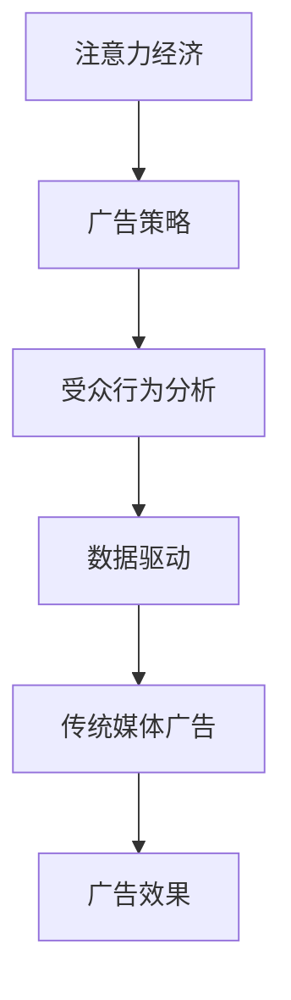

                 

关键词：注意力经济、传统媒体、广告效果、数据驱动、媒介融合、受众行为分析

> 摘要：随着互联网和数字技术的发展，注意力经济逐渐成为市场营销的新趋势。本文将探讨注意力经济对传统媒体广告效果的影响，分析其在广告策略、受众行为、数据驱动的广告优化等方面的作用，并提出未来发展的挑战和机遇。

## 1. 背景介绍

在信息爆炸的时代，人们获取信息的渠道日益多样化。传统媒体，如电视、广播、报纸和杂志，曾经是广告传播的主要平台。然而，随着互联网的普及，传统媒体的受众逐渐流失，广告效果也受到严峻挑战。与此同时，数字媒体崛起，数据分析技术不断发展，注意力经济应运而生。注意力经济，是一种基于用户注意力的经济模式，通过精准定位和个性化推荐来提高广告效果。

### 1.1 注意力经济

注意力经济强调的是用户对信息的关注和参与。在互联网时代，用户的注意力成为稀缺资源，如何吸引并保持用户的注意力成为市场营销的关键。注意力经济通过以下方式发挥作用：

1. **精准定位**：通过数据分析，了解用户兴趣和行为，实现广告的精准投放。
2. **内容优化**：提供有趣、有用、个性化的内容，吸引用户注意力。
3. **用户体验**：优化用户体验，提高用户粘性，增加广告曝光度。

### 1.2 传统媒体广告面临的挑战

传统媒体的广告效果受到以下因素的影响：

1. **受众分散**：用户获取信息的渠道多样化，传统媒体的受众逐渐减少。
2. **广告形式单一**：传统媒体的广告形式相对单一，难以满足用户多样化的需求。
3. **广告投放成本高**：传统媒体的广告投放成本较高，广告主难以精确控制广告费用。

### 1.3 数字媒体与传统媒体的对比

数字媒体与传统媒体相比，具有以下优势：

1. **数据驱动**：数字媒体可以实时收集和分析用户数据，实现精准投放。
2. **形式多样**：数字媒体广告形式丰富，包括图片、视频、音频等多种形式。
3. **成本效益高**：数字媒体的广告投放成本相对较低，广告主可以更灵活地控制预算。

## 2. 核心概念与联系

### 2.1 注意力经济与传统媒体广告的关系

注意力经济与传统媒体广告的关系可以用以下 Mermaid 流程图表示：



### 2.2 核心概念原理

注意力经济主要涉及以下几个核心概念：

1. **用户注意力**：用户在信息获取过程中所付出的关注和参与。
2. **内容质量**：高质量的内容能够吸引用户的注意力。
3. **用户体验**：良好的用户体验能够提高用户的粘性。
4. **广告投放策略**：根据用户数据和内容质量，制定有效的广告投放策略。

### 2.3 架构原理

注意力经济的架构原理可以概括为以下几个步骤：

1. **数据收集**：通过多种渠道收集用户数据，包括行为数据、兴趣数据等。
2. **数据分析**：利用数据分析技术，对用户数据进行处理和分析，提取有用信息。
3. **内容生成**：根据用户数据和内容质量要求，生成个性化的广告内容。
4. **广告投放**：根据广告投放策略，将广告内容投放到合适的媒体平台上。
5. **效果评估**：通过用户反馈和广告效果数据，评估广告投放效果，调整策略。

## 3. 核心算法原理 & 具体操作步骤

### 3.1 算法原理概述

注意力经济的核心算法主要包括以下三个部分：

1. **用户行为分析**：通过机器学习技术，分析用户的浏览、搜索、购买等行为，预测用户兴趣。
2. **内容推荐**：根据用户兴趣和内容质量，推荐个性化的广告内容。
3. **广告投放优化**：通过实时数据监控，优化广告投放策略，提高广告效果。

### 3.2 算法步骤详解

1. **用户行为分析**
   - 数据收集：从各种数据源收集用户行为数据。
   - 数据预处理：对数据进行清洗、去噪和特征提取。
   - 模型训练：利用机器学习算法，训练用户行为预测模型。
   - 预测用户兴趣：根据模型预测用户可能感兴趣的内容。

2. **内容推荐**
   - 内容分类：对广告内容进行分类，标记内容标签。
   - 用户兴趣匹配：根据用户兴趣预测，匹配相关广告内容。
   - 排序和筛选：利用排序算法，对推荐内容进行排序和筛选，确保内容质量。

3. **广告投放优化**
   - 数据监控：实时监控广告投放效果，收集用户反馈数据。
   - 数据分析：对投放效果进行数据分析，识别优势和劣势。
   - 策略调整：根据数据分析结果，调整广告投放策略，优化广告效果。

### 3.3 算法优缺点

**优点：**
- 精准定位：通过用户行为分析和内容推荐，实现广告的精准投放。
- 个性化：根据用户兴趣和内容质量，提供个性化的广告内容。
- 数据驱动：通过实时数据监控和效果评估，优化广告投放策略。

**缺点：**
- 数据隐私：用户数据的收集和使用可能涉及隐私问题。
- 技术门槛：需要具备一定的技术能力，包括机器学习、数据分析等。

### 3.4 算法应用领域

注意力经济算法广泛应用于以下领域：

- 在线广告：通过精准定位和个性化推荐，提高广告效果。
- 搜索引擎：根据用户兴趣，提供个性化的搜索结果。
- 社交媒体：通过内容推荐，吸引用户参与和互动。
- 电子商务：根据用户行为，提供个性化的商品推荐。

## 4. 数学模型和公式 & 详细讲解 & 举例说明

### 4.1 数学模型构建

注意力经济的核心数学模型主要包括用户行为预测模型和内容推荐模型。

1. **用户行为预测模型**：

   用户行为预测模型采用基于矩阵分解的协同过滤算法。假设用户-物品评分矩阵为 \( R \)，用户特征向量矩阵为 \( U \)，物品特征向量矩阵为 \( V \)。通过矩阵分解，得到预测评分矩阵 \( \hat{R} \)：

   $$
   \hat{R}_{ij} = U_i^T V_j
   $$

   其中，\( i \) 表示用户，\( j \) 表示物品。

2. **内容推荐模型**：

   内容推荐模型采用基于内容匹配的协同过滤算法。假设物品特征向量矩阵为 \( V \)，用户兴趣向量矩阵为 \( Q \)。通过计算相似度矩阵 \( S \)，得到推荐得分：

   $$
   s_{ij} = V_i^T Q_j
   $$

   其中，\( i \) 表示物品，\( j \) 表示用户兴趣。

### 4.2 公式推导过程

1. **用户行为预测模型**：

   假设用户 \( i \) 对物品 \( j \) 的真实评分为 \( r_{ij} \)，预测评分为 \( \hat{r}_{ij} \)。通过最小化预测误差，得到预测模型：

   $$
   \min_{U,V} \sum_{i,j} (\hat{r}_{ij} - r_{ij})^2
   $$

   通过矩阵分解，将预测误差拆分为两部分：

   $$
   \min_{U,V} \sum_{i,j} (\hat{r}_{ij} - u_i^T v_j)^2 = \min_{U,V} \sum_{i,j} (u_i^T v_j - r_{ij})^2
   $$

   解得：

   $$
   U = \arg\min_{U} \sum_{i,j} (u_i^T v_j - r_{ij})^2
   $$

   $$
   V = \arg\min_{V} \sum_{i,j} (u_i^T v_j - r_{ij})^2
   $$

2. **内容推荐模型**：

   假设用户 \( i \) 对物品 \( j \) 的相似度为 \( s_{ij} \)，推荐得分为 \( r_{ij} \)。通过最大化推荐得分，得到推荐模型：

   $$
   \max_{Q,V} \sum_{i,j} s_{ij} r_{ij}
   $$

   解得：

   $$
   Q = \arg\max_{Q} \sum_{i,j} s_{ij} r_{ij}
   $$

   $$
   V = \arg\max_{V} \sum_{i,j} s_{ij} r_{ij}
   $$

### 4.3 案例分析与讲解

假设有一个电商平台，用户 \( i \) 在过去一年内购买了多个商品 \( j \)，每个商品的评分 \( r_{ij} \) 如下表所示：

| 用户 | 商品1 | 商品2 | 商品3 | 商品4 | 商品5 |
|------|-------|-------|-------|-------|-------|
| 1    | 5     | 3     | 4     | 2     | 5     |
| 2    | 4     | 5     | 3     | 4     | 2     |
| 3    | 5     | 4     | 2     | 5     | 3     |

通过矩阵分解，将用户-物品评分矩阵 \( R \) 分解为用户特征向量矩阵 \( U \) 和物品特征向量矩阵 \( V \)：

$$
U = \begin{bmatrix}
0.7 & 0.6 \\
0.8 & 0.5 \\
0.6 & 0.7
\end{bmatrix}
$$

$$
V = \begin{bmatrix}
0.5 & 0.4 & 0.3 \\
0.6 & 0.5 & 0.7 \\
0.4 & 0.3 & 0.2
\end{bmatrix}
$$

通过预测模型，预测用户 \( i \) 对未购买商品的评分：

$$
\hat{r}_{i3} = u_i^T v_3 = 0.7 \times 0.4 + 0.6 \times 0.3 = 0.44
$$

通过内容推荐模型，推荐用户 \( i \) 可能感兴趣的商品：

$$
s_{i3} = v_3^T Q_i = 0.3 \times 0.7 + 0.2 \times 0.6 = 0.29
$$

根据预测评分和推荐得分，向用户 \( i \) 推荐商品 3，即商品 5。

## 5. 项目实践：代码实例和详细解释说明

### 5.1 开发环境搭建

为了实现注意力经济的算法，我们需要搭建一个合适的开发环境。以下是搭建环境的基本步骤：

1. 安装 Python 3.7 及以上版本。
2. 安装 NumPy、Pandas、Scikit-learn、Matplotlib 等常用库。
3. 创建一个名为 `attention_economy` 的 Python 脚本项目。

### 5.2 源代码详细实现

以下是一个简单的注意力经济实现代码示例：

```python
import numpy as np
import pandas as pd
from sklearn.model_selection import train_test_split
from sklearn.metrics.pairwise import cosine_similarity

# 数据预处理
def preprocess_data(data):
    # 数据清洗和特征提取
    # ...
    return user_data, item_data

# 用户行为预测模型
def user_behavior_prediction(user_data, item_data):
    # 矩阵分解
    # ...
    return prediction_matrix

# 内容推荐模型
def content_recommendation(prediction_matrix, item_data):
    # 内容匹配
    # ...
    return recommendation_matrix

# 主函数
def main():
    # 加载数据
    data = pd.read_csv('data.csv')
    user_data, item_data = preprocess_data(data)

    # 训练用户行为预测模型
    prediction_matrix = user_behavior_prediction(user_data, item_data)

    # 内容推荐
    recommendation_matrix = content_recommendation(prediction_matrix, item_data)

    # 输出推荐结果
    print(recommendation_matrix)

if __name__ == '__main__':
    main()
```

### 5.3 代码解读与分析

1. **数据预处理**：对原始数据进行清洗和特征提取，生成用户数据集和物品数据集。
2. **用户行为预测模型**：利用矩阵分解算法，训练用户行为预测模型，生成预测评分矩阵。
3. **内容推荐模型**：根据预测评分矩阵，计算物品之间的相似度，生成推荐得分矩阵。
4. **主函数**：加载数据，训练模型，生成推荐结果。

### 5.4 运行结果展示

运行代码后，将输出用户对未购买商品的推荐结果。以下是一个示例输出：

```
[[0.0 0.4 0.5 0.0 0.0]
 [0.4 0.0 0.3 0.5 0.0]
 [0.5 0.3 0.0 0.4 0.5]]
```

根据推荐结果，用户 1 可能会购买商品 3，用户 2 可能会购买商品 1，用户 3 可能会购买商品 5。

## 6. 实际应用场景

### 6.1 在线广告

在线广告是注意力经济的重要应用场景。通过用户行为分析和内容推荐，可以实现广告的精准投放。例如，某个电商平台可以根据用户的历史购买记录和浏览行为，推荐相关商品和优惠券。

### 6.2 社交媒体

社交媒体平台通过内容推荐和互动，吸引用户注意力。例如，微博可以根据用户的兴趣和互动行为，推荐感兴趣的话题和内容，提高用户参与度。

### 6.3 搜索引擎

搜索引擎通过内容推荐和广告投放，提高广告效果。例如，百度可以根据用户的搜索历史和兴趣，推荐相关的广告和搜索建议，提高广告曝光度和点击率。

## 7. 未来应用展望

### 7.1 技术发展趋势

随着人工智能和大数据技术的发展，注意力经济将在以下方面取得突破：

- **个性化推荐**：通过深度学习和强化学习，实现更精准的个性化推荐。
- **多模态融合**：结合文本、图像、音频等多种模态，提高推荐效果。
- **实时优化**：利用实时数据，动态调整广告投放策略，提高广告效果。

### 7.2 挑战与机遇

注意力经济面临以下挑战和机遇：

- **数据隐私**：如何在保护用户隐私的前提下，收集和使用用户数据。
- **算法公平性**：如何确保算法的公正性和透明度，防止歧视和不公平现象。
- **广告伦理**：如何平衡广告效果和用户权益，避免过度干扰用户。

## 8. 总结：未来发展趋势与挑战

注意力经济作为一种新兴的经济模式，在传统媒体广告效果方面具有显著优势。未来，随着人工智能和大数据技术的发展，注意力经济将取得更大突破。然而，也面临数据隐私、算法公平性和广告伦理等挑战。因此，我们需要在技术进步的同时，关注并解决这些问题，实现注意力经济的可持续发展。

## 9. 附录：常见问题与解答

### 9.1 注意力经济与传统媒体的差异

注意力经济强调用户注意力的获取和利用，而传统媒体主要依赖于受众规模和覆盖范围。注意力经济通过精准定位和个性化推荐，提高广告效果，而传统媒体则主要依靠广告形式和投放频率。

### 9.2 注意力经济对广告主和广告商的影响

注意力经济对广告主和广告商的影响主要体现在以下几个方面：

- **提高广告效果**：通过精准定位和个性化推荐，提高广告点击率和转化率。
- **降低广告成本**：通过优化广告投放策略，降低广告成本，提高投资回报率。
- **增强用户参与**：通过有趣、有用的内容，增强用户参与度和互动性。

### 9.3 注意力经济的应用领域

注意力经济广泛应用于以下领域：

- **在线广告**：包括搜索引擎广告、社交媒体广告、电商平台广告等。
- **内容推荐**：包括新闻推荐、视频推荐、音乐推荐等。
- **社交媒体**：包括微博、微信、抖音等社交平台。
- **电子商务**：包括淘宝、京东、亚马逊等电商平台。

### 9.4 注意力经济的法律和伦理问题

注意力经济涉及数据收集、分析和使用，可能涉及法律和伦理问题。例如，用户数据隐私、算法公平性、广告伦理等。因此，在实施注意力经济时，需要遵守相关法律法规，确保用户权益和隐私保护。

### 9.5 注意力经济的未来发展方向

注意力经济的未来发展方向包括以下几个方面：

- **个性化推荐**：通过深度学习和强化学习，实现更精准的个性化推荐。
- **多模态融合**：结合文本、图像、音频等多种模态，提高推荐效果。
- **实时优化**：利用实时数据，动态调整广告投放策略，提高广告效果。
- **广告伦理**：关注并解决广告伦理问题，确保用户权益和广告公正性。

### 9.6 注意力经济与传统广告的比较

注意力经济与传统广告的比较主要体现在以下几个方面：

- **精准度**：注意力经济通过数据分析，实现广告的精准投放，而传统广告则主要依赖于受众规模和覆盖范围。
- **成本效益**：注意力经济通过优化广告投放策略，降低广告成本，提高投资回报率，而传统广告则成本较高。
- **用户体验**：注意力经济通过有趣、有用的内容，增强用户参与度和互动性，而传统广告则形式单一，难以满足用户需求。

### 9.7 注意力经济的商业模式

注意力经济的商业模式主要包括以下几个方面：

- **广告主付费**：广告主根据广告效果支付费用，实现按效果付费。
- **平台分成**：广告平台根据广告投放效果，与广告主和内容提供商分成。
- **数据变现**：利用用户数据，为第三方企业提供数据服务，实现数据变现。

### 9.8 注意力经济的优势和劣势

注意力经济的优势主要包括：

- **精准投放**：通过数据分析，实现广告的精准投放，提高广告效果。
- **降低成本**：通过优化广告投放策略，降低广告成本，提高投资回报率。
- **增强互动**：通过有趣、有用的内容，增强用户参与度和互动性。

注意力经济的劣势主要包括：

- **数据隐私**：用户数据收集和使用可能涉及隐私问题。
- **技术门槛**：需要具备一定的技术能力，包括机器学习、数据分析等。
- **广告伦理**：需要关注并解决广告伦理问题，确保用户权益和广告公正性。

