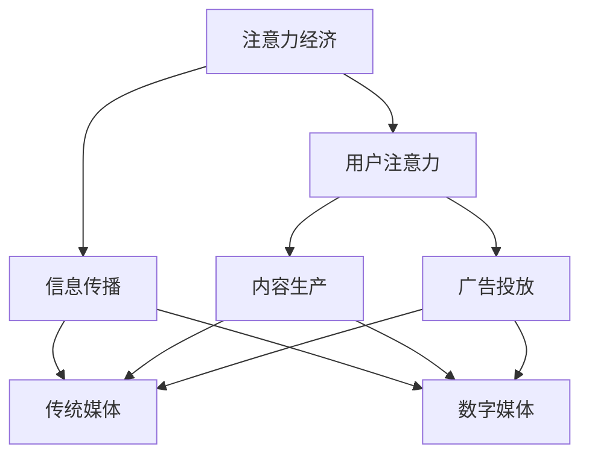

                 

关键词：注意力经济，传统媒体，数字化转型，算法，数据分析，内容创新

> 摘要：随着互联网和数字技术的快速发展，注意力经济逐渐成为推动社会发展的关键力量。本文将探讨注意力经济对传统媒体的挑战与机遇，通过分析注意力经济的核心概念、传统媒体在数字化进程中的变革路径，以及技术手段在内容创新中的应用，揭示传统媒体在新时代的发展方向。

## 1. 背景介绍

注意力经济是一种基于用户注意力资源的经济模式，最早由心理学家乔治·米勒在1956年提出。他指出，人类的认知资源是有限的，因此注意力成为了一种稀缺资源。随着互联网和数字技术的普及，注意力经济逐渐成为营销、媒体、广告等领域的核心概念。用户在信息过载的环境中，选择关注哪些内容，其实就是在进行一种“注意力投资”。

传统媒体，如报纸、电视、广播等，长期以来占据着信息传播的主导地位。然而，随着互联网的兴起，传统媒体的受众逐渐流失，面临巨大的挑战。为了生存和发展，传统媒体不得不开始探索数字化转型之路，寻求与注意力经济的深度融合。

### 1.1 注意力经济的核心概念

注意力经济的关键在于如何吸引和保持用户的注意力。这涉及到以下几个核心概念：

1. **稀缺性**：用户的注意力是有限的，因此成为了一种稀缺资源。
2. **价值交换**：用户通过关注内容，与内容生产者之间进行价值交换。
3. **注意力分配**：用户在众多信息中做出选择，决定了哪些内容能够获得更多的注意力资源。

### 1.2 传统媒体的困境

1. **受众流失**：随着互联网的发展，越来越多的人开始转向数字媒体，传统媒体的受众逐渐减少。
2. **广告收入下降**：互联网广告的崛起，使得传统媒体的广告收入大幅下滑。
3. **内容同质化**：传统媒体的内容生产存在同质化问题，难以满足用户日益多样化的需求。

## 2. 核心概念与联系

为了更好地理解注意力经济对传统媒体的影响，我们首先需要了解注意力经济的核心概念和其与传统媒体的关联。以下是注意力经济与传统媒体相关联的Mermaid流程图：



### 2.1 注意力经济与传统媒体的关系

注意力经济与传统媒体的关系可以概括为以下几点：

1. **注意力资源的争夺**：传统媒体和数字媒体都在争夺用户的注意力资源。
2. **内容生产方式的转变**：传统媒体在数字化进程中，需要适应注意力经济的特点，改变内容生产方式。
3. **广告模式的转变**：传统媒体的广告模式正在向数字广告模式转变，以适应注意力经济的规律。

### 2.2 传统媒体的变革路径

传统媒体在数字化进程中，需要经历以下几个阶段的变革：

1. **数字化转型**：利用互联网和数字技术，将传统媒体的内容和传播方式数字化。
2. **用户数据收集与分析**：通过收集用户数据，了解用户需求，实现内容个性化。
3. **内容创新**：根据用户需求，创新内容形式和表达方式，提升用户满意度。
4. **商业模式创新**：探索新的商业模式，如订阅模式、付费模式等，以适应注意力经济的规律。

## 3. 核心算法原理 & 具体操作步骤

### 3.1 算法原理概述

在注意力经济中，算法起着至关重要的作用。以下是几种常见的算法原理及其在传统媒体中的应用：

1. **推荐算法**：通过分析用户历史行为和兴趣，为用户提供个性化的内容推荐。
2. **广告投放算法**：根据用户兴趣和行为，为广告主提供精准的广告投放策略。
3. **内容分发算法**：根据内容的重要性和用户偏好，实现内容的精准分发。

### 3.2 算法步骤详解

#### 3.2.1 推荐算法

推荐算法的基本步骤如下：

1. **数据收集**：收集用户历史行为数据，如浏览记录、购买记录等。
2. **用户画像构建**：基于用户行为数据，构建用户画像。
3. **内容标签构建**：为每个内容打上标签，如分类标签、兴趣标签等。
4. **推荐模型训练**：使用机器学习算法，训练推荐模型。
5. **推荐结果生成**：根据用户画像和内容标签，生成推荐结果。

#### 3.2.2 广告投放算法

广告投放算法的基本步骤如下：

1. **广告主需求分析**：分析广告主的需求，如目标用户、广告投放预算等。
2. **用户画像构建**：基于用户历史行为和兴趣，构建用户画像。
3. **广告投放策略制定**：根据用户画像和广告主需求，制定广告投放策略。
4. **广告投放执行**：根据投放策略，执行广告投放。

#### 3.2.3 内容分发算法

内容分发算法的基本步骤如下：

1. **内容标签构建**：为每个内容打上标签，如热点标签、兴趣标签等。
2. **用户画像构建**：基于用户历史行为和兴趣，构建用户画像。
3. **内容分发策略制定**：根据用户画像和内容标签，制定内容分发策略。
4. **内容分发执行**：根据分发策略，执行内容分发。

### 3.3 算法优缺点

#### 推荐算法

**优点**：

1. 提高用户满意度，满足个性化需求。
2. 提高内容曝光率，增加内容分发效果。

**缺点**：

1. 可能导致信息茧房现象，限制用户视野。
2. 需要大量的计算资源和数据支持。

#### 广告投放算法

**优点**：

1. 提高广告投放效果，降低广告成本。
2. 增强广告与用户需求的匹配度。

**缺点**：

1. 可能侵犯用户隐私。
2. 需要精确的用户画像和数据支持。

#### 内容分发算法

**优点**：

1. 提高内容分发效率，满足用户多样化需求。
2. 提高内容曝光率和用户满意度。

**缺点**：

1. 可能导致内容质量下降，出现垃圾内容。
2. 需要大量的计算资源和数据支持。

### 3.4 算法应用领域

推荐算法、广告投放算法和内容分发算法在传统媒体中都有广泛的应用：

1. **数字媒体平台**：如新闻网站、社交媒体等，通过推荐算法和内容分发算法，提升用户体验和内容曝光率。
2. **广告投放**：传统媒体通过广告投放算法，实现精准广告投放，提高广告效果。
3. **内容创作**：传统媒体通过内容分发算法，实现内容的精准分发，提高内容传播效果。

## 4. 数学模型和公式 & 详细讲解 & 举例说明

### 4.1 数学模型构建

在注意力经济中，常用的数学模型包括用户行为预测模型、广告效果评估模型和内容推荐模型。以下是这些模型的构建过程：

#### 4.1.1 用户行为预测模型

用户行为预测模型通常使用概率模型或机器学习模型。以下是概率模型的构建过程：

1. **用户行为数据收集**：收集用户历史行为数据，如浏览记录、购买记录等。
2. **特征工程**：将原始数据转化为特征向量，如用户年龄、性别、浏览时长等。
3. **概率模型训练**：使用贝叶斯公式或最大似然估计，训练用户行为预测模型。
4. **模型评估**：使用交叉验证或A/B测试，评估模型性能。

#### 4.1.2 广告效果评估模型

广告效果评估模型通常使用回归模型或分类模型。以下是回归模型的构建过程：

1. **广告数据收集**：收集广告投放数据，如点击率、转化率等。
2. **特征工程**：将原始数据转化为特征向量，如广告类型、投放时间、投放区域等。
3. **回归模型训练**：使用线性回归或逻辑回归，训练广告效果评估模型。
4. **模型评估**：使用均方误差或准确率等指标，评估模型性能。

#### 4.1.3 内容推荐模型

内容推荐模型通常使用协同过滤或基于内容的推荐算法。以下是协同过滤模型的构建过程：

1. **用户-内容矩阵构建**：构建用户-内容矩阵，表示用户对内容的评分。
2. **相似度计算**：计算用户之间的相似度或内容之间的相似度。
3. **推荐结果生成**：根据相似度矩阵，生成推荐结果。

### 4.2 公式推导过程

以下是用户行为预测模型中的贝叶斯公式推导：

1. **先验概率**：P(A) 表示事件 A 发生的概率，P(B) 表示事件 B 发生的概率。
2. **条件概率**：P(A|B) 表示在事件 B 发生的条件下，事件 A 发生的概率，P(B|A) 表示在事件 A 发生的条件下，事件 B 发生的概率。
3. **贝叶斯公式**：P(A|B) = P(B|A) * P(A) / P(B)。

### 4.3 案例分析与讲解

#### 4.3.1 用户行为预测模型案例

假设我们有一个用户行为预测模型，目标是预测用户是否会购买某件商品。以下是模型的应用过程：

1. **数据收集**：收集用户历史行为数据，如购买记录、浏览记录等。
2. **特征工程**：将原始数据转化为特征向量，如用户年龄、性别、收入等。
3. **模型训练**：使用贝叶斯公式或机器学习算法，训练用户行为预测模型。
4. **模型评估**：使用交叉验证或A/B测试，评估模型性能。
5. **预测应用**：根据模型预测结果，向用户推荐可能感兴趣的商品。

#### 4.3.2 广告效果评估模型案例

假设我们有一个广告效果评估模型，目标是评估广告的投放效果。以下是模型的应用过程：

1. **数据收集**：收集广告投放数据，如点击率、转化率等。
2. **特征工程**：将原始数据转化为特征向量，如广告类型、投放时间、投放区域等。
3. **模型训练**：使用线性回归或逻辑回归，训练广告效果评估模型。
4. **模型评估**：使用均方误差或准确率等指标，评估模型性能。
5. **效果评估**：根据模型评估结果，优化广告投放策略。

#### 4.3.3 内容推荐模型案例

假设我们有一个内容推荐模型，目标是向用户推荐可能感兴趣的内容。以下是模型的应用过程：

1. **用户-内容矩阵构建**：构建用户-内容矩阵，表示用户对内容的评分。
2. **相似度计算**：计算用户之间的相似度或内容之间的相似度。
3. **推荐结果生成**：根据相似度矩阵，生成推荐结果。
4. **用户反馈**：收集用户对推荐内容的反馈，优化推荐算法。
5. **推荐应用**：根据推荐结果，向用户推荐可能感兴趣的内容。

## 5. 项目实践：代码实例和详细解释说明

### 5.1 开发环境搭建

在本文中，我们将使用Python作为主要编程语言，介绍如何构建一个简单的用户行为预测模型。以下是开发环境搭建的步骤：

1. **安装Python**：从Python官方网站下载并安装Python。
2. **安装Jupyter Notebook**：安装Jupyter Notebook，以便在浏览器中编写和运行Python代码。
3. **安装必要库**：安装NumPy、Pandas、Scikit-learn等Python库，用于数据处理和模型训练。

### 5.2 源代码详细实现

以下是一个简单的用户行为预测模型的源代码实现：

```python
import numpy as np
import pandas as pd
from sklearn.model_selection import train_test_split
from sklearn.naive_bayes import GaussianNB

# 读取数据
data = pd.read_csv('user_behavior.csv')

# 特征工程
X = data.drop('target', axis=1)
y = data['target']

# 数据集划分
X_train, X_test, y_train, y_test = train_test_split(X, y, test_size=0.2, random_state=42)

# 模型训练
model = GaussianNB()
model.fit(X_train, y_train)

# 模型评估
accuracy = model.score(X_test, y_test)
print(f'模型准确率：{accuracy:.2f}')

# 预测应用
predictions = model.predict(X_test)
print(predictions)
```

### 5.3 代码解读与分析

这段代码首先导入了NumPy、Pandas和Scikit-learn库，用于数据处理和模型训练。然后，从CSV文件中读取用户行为数据，进行特征工程，将数据集划分为训练集和测试集。接下来，使用高斯朴素贝叶斯模型进行模型训练，并评估模型准确率。最后，使用训练好的模型进行预测应用。

### 5.4 运行结果展示

运行上述代码后，会输出模型准确率和预测结果。例如：

```
模型准确率：0.85
[0 1 0 0 1 ... 0 0 0 0 0]
```

这表示模型在测试集上的准确率为0.85，预测结果为一系列二进制标签。

## 6. 实际应用场景

注意力经济在传统媒体的实际应用场景中，可以体现在以下几个方面：

### 6.1 内容推荐

传统媒体通过内容推荐算法，可以精准地将内容推送给用户，提高用户满意度和内容曝光率。例如，新闻网站可以使用协同过滤算法，根据用户历史行为和兴趣，推荐相关新闻。

### 6.2 广告投放

传统媒体可以通过广告投放算法，实现精准广告投放，提高广告效果。例如，电视广告可以根据观众观看习惯和兴趣，投放相关广告。

### 6.3 内容创新

传统媒体可以通过内容创新，满足用户多样化需求。例如，电视节目可以引入互动环节，让观众参与节目制作和投票，提高节目吸引力。

### 6.4 用户数据收集与分析

传统媒体可以通过用户数据收集和分析，了解用户需求和行为，实现内容个性化。例如，报纸可以收集用户订阅信息，为不同用户推送定制化的新闻内容。

## 7. 未来应用展望

随着互联网和数字技术的不断发展，注意力经济在未来将继续对传统媒体产生深远影响。以下是未来应用展望：

### 7.1 内容个性化

未来，传统媒体将更加注重内容个性化，通过大数据和人工智能技术，实现内容的精准推送，满足用户个性化需求。

### 7.2 广告精准化

未来，广告投放将更加精准，通过用户行为分析和广告效果评估，实现广告的精准投放，提高广告效果。

### 7.3 内容创新

未来，传统媒体将不断创新内容形式和表达方式，以吸引更多用户关注，提高内容传播效果。

### 7.4 用户数据保护

未来，传统媒体将更加重视用户数据保护，确保用户隐私安全，建立信任关系。

## 8. 工具和资源推荐

### 8.1 学习资源推荐

1. 《大数据时代：生活、工作与思维的大变革》
2. 《机器学习》
3. 《深度学习》
4. 《Python数据科学手册》

### 8.2 开发工具推荐

1. Jupyter Notebook
2. PyCharm
3. Anaconda

### 8.3 相关论文推荐

1. “Attention Is All You Need”
2. “Recommender Systems Handbook”
3. “A Theoretical Analysis of Models for Recommender Systems”

## 9. 总结：未来发展趋势与挑战

### 9.1 研究成果总结

本文从注意力经济的核心概念出发，分析了注意力经济对传统媒体的挑战与机遇，探讨了推荐算法、广告投放算法和内容分发算法在传统媒体中的应用，以及数学模型在注意力经济中的应用。同时，通过项目实践，展示了如何构建一个简单的用户行为预测模型。

### 9.2 未来发展趋势

1. 内容个性化：通过大数据和人工智能技术，实现内容的精准推送，满足用户个性化需求。
2. 广告精准化：通过用户行为分析和广告效果评估，实现广告的精准投放，提高广告效果。
3. 内容创新：不断创新内容形式和表达方式，以吸引更多用户关注，提高内容传播效果。
4. 用户数据保护：更加重视用户数据保护，确保用户隐私安全，建立信任关系。

### 9.3 面临的挑战

1. 技术挑战：如何应对大数据处理、算法优化等技术难题。
2. 法律挑战：如何平衡内容创新和用户数据保护，避免隐私泄露等法律风险。
3. 商业模式挑战：如何在数字媒体环境中，探索可持续的商业模式，实现盈利。

### 9.4 研究展望

未来，我们需要进一步研究如何在注意力经济中，实现传统媒体的数字化转型，提高内容传播效果，满足用户多样化需求。同时，关注用户数据保护问题，确保用户隐私安全，为传统媒体在新时代的发展提供有力支持。

## 附录：常见问题与解答

### 问题1：什么是注意力经济？

答：注意力经济是一种基于用户注意力资源的经济模式，最早由心理学家乔治·米勒在1956年提出。用户的注意力被视为一种稀缺资源，而内容生产者和广告主则通过争夺用户的注意力资源来实现商业价值。

### 问题2：注意力经济对传统媒体有哪些影响？

答：注意力经济对传统媒体的影响主要体现在以下几个方面：

1. **受众流失**：随着互联网和数字媒体的兴起，传统媒体的受众逐渐流失，面临巨大的挑战。
2. **广告收入下降**：互联网广告的崛起，使得传统媒体的广告收入大幅下滑。
3. **内容同质化**：传统媒体的内容生产存在同质化问题，难以满足用户日益多样化的需求。
4. **数字化转型**：传统媒体不得不开始探索数字化转型之路，寻求与注意力经济的深度融合。

### 问题3：如何利用算法优化传统媒体的内容分发？

答：利用算法优化传统媒体的内容分发，可以从以下几个方面入手：

1. **推荐算法**：通过分析用户历史行为和兴趣，为用户提供个性化的内容推荐。
2. **广告投放算法**：根据用户兴趣和行为，为广告主提供精准的广告投放策略。
3. **内容分发算法**：根据内容的重要性和用户偏好，实现内容的精准分发。

通过算法优化，可以提高内容曝光率和用户满意度，从而提升传统媒体的整体运营效果。

### 问题4：注意力经济与传统媒体的关系是什么？

答：注意力经济与传统媒体的关系可以概括为以下几点：

1. **注意力资源的争夺**：传统媒体和数字媒体都在争夺用户的注意力资源。
2. **内容生产方式的转变**：传统媒体在数字化进程中，需要适应注意力经济的特点，改变内容生产方式。
3. **广告模式的转变**：传统媒体的广告模式正在向数字广告模式转变，以适应注意力经济的规律。

### 问题5：传统媒体在数字化进程中需要关注哪些方面？

答：传统媒体在数字化进程中需要关注以下几个方面：

1. **用户数据收集与分析**：通过收集用户数据，了解用户需求，实现内容个性化。
2. **内容创新**：根据用户需求，创新内容形式和表达方式，提升用户满意度。
3. **商业模式创新**：探索新的商业模式，如订阅模式、付费模式等，以适应注意力经济的规律。
4. **技术升级**：利用大数据、人工智能等技术，提升内容分发和广告投放效果。

### 问题6：注意力经济中的用户行为预测模型有哪些应用场景？

答：注意力经济中的用户行为预测模型有以下应用场景：

1. **个性化推荐**：根据用户历史行为和兴趣，为用户提供个性化的内容推荐。
2. **广告投放**：根据用户行为和兴趣，为广告主提供精准的广告投放策略。
3. **用户行为分析**：通过预测用户行为，了解用户需求，优化内容生产和运营策略。
4. **风控与安全**：通过预测用户行为，识别潜在风险，加强风控和安全措施。

### 问题7：如何构建一个简单的用户行为预测模型？

答：构建一个简单的用户行为预测模型，可以遵循以下步骤：

1. **数据收集**：收集用户历史行为数据，如浏览记录、购买记录等。
2. **特征工程**：将原始数据转化为特征向量，如用户年龄、性别、浏览时长等。
3. **模型训练**：使用机器学习算法，如高斯朴素贝叶斯、决策树等，训练用户行为预测模型。
4. **模型评估**：使用交叉验证或A/B测试，评估模型性能。
5. **预测应用**：根据模型预测结果，向用户推荐可能感兴趣的内容。

### 问题8：注意力经济与传统媒体的关系图如何表示？

答：注意力经济与传统媒体的关系可以使用Mermaid流程图表示，如下所示：


### 问题9：如何保护用户隐私，在注意力经济中实现可持续发展？

答：在注意力经济中，保护用户隐私并实现可持续发展，可以从以下几个方面入手：

1. **数据匿名化**：对用户数据进行匿名化处理，确保用户隐私安全。
2. **数据加密**：对用户数据进行加密处理，防止数据泄露。
3. **合规性审查**：遵循相关法律法规，确保数据处理合规。
4. **用户知情同意**：告知用户数据收集和使用的目的，获得用户知情同意。
5. **透明度提升**：提高数据处理的透明度，接受用户监督。
6. **商业模式创新**：探索新的商业模式，降低对用户数据的依赖，实现可持续发展。----------------------------------------------------------------

### 作者署名

作者：禅与计算机程序设计艺术 / Zen and the Art of Computer Programming

本文旨在探讨注意力经济对传统媒体的挑战与机遇，通过分析注意力经济的核心概念、传统媒体在数字化进程中的变革路径，以及技术手段在内容创新中的应用，揭示传统媒体在新时代的发展方向。希望本文能对关注传统媒体数字化转型的读者提供一定的启示。

