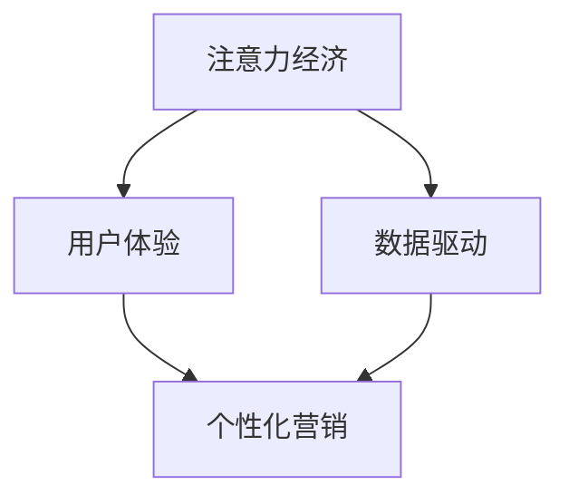

                 

关键词：注意力经济、广告投放策略、用户体验、数据驱动、个性化营销

> 摘要：随着互联网的普及和数字化时代的到来，注意力经济逐渐成为新的经济模式。本文将探讨注意力经济对传统广告投放策略带来的挑战，分析其背后的原理，并提出相应的应对策略。文章旨在为广告从业者提供有价值的参考，以应对不断变化的市场环境。

## 1. 背景介绍

### 注意力经济的崛起

在过去的几十年里，互联网技术飞速发展，信息爆炸带来了新的经济模式——注意力经济。注意力经济的核心在于，用户的注意力成为一种稀缺资源，而企业通过获取用户的注意力来实现商业价值。这种模式与传统经济学中的商品和服务交易模式有本质区别，其关注的是如何通过内容、广告、产品等手段吸引和维持用户的关注。

### 传统广告投放策略的局限性

传统的广告投放策略主要依赖于大规模投放、渠道选择和投放频次等手段来吸引用户注意力。然而，在注意力经济时代，这种策略面临着以下局限性：

- **过于依赖渠道**：传统广告策略高度依赖于特定的媒体渠道，如电视、报纸、杂志等，而忽视了用户个性化需求。
- **缺乏数据驱动**：传统广告策略往往缺乏对用户行为数据的深入分析，难以实现精准投放。
- **用户体验差**：传统广告策略常常以大面积、高频率的方式投放，导致用户产生厌恶情绪，用户体验较差。

### 注意力经济与传统广告投放策略的冲突

注意力经济的核心在于吸引和维持用户的注意力，而传统广告投放策略则更多关注于如何将广告信息传达给尽可能多的用户。这种目标上的冲突导致了传统广告策略在注意力经济环境下的局限性。

## 2. 核心概念与联系

### 核心概念

- **注意力经济**：一种以用户注意力为核心的经济模式，通过吸引和维持用户注意力来实现商业价值。
- **用户体验**：用户在使用产品或服务过程中的感受和体验，直接影响用户的满意度和忠诚度。
- **数据驱动**：基于用户数据进行分析和决策，实现个性化营销和精准投放。

### 架构联系

注意力经济、用户体验和数据驱动之间存在紧密的联系，具体表现为：

- **注意力经济驱动用户体验**：在注意力经济时代，用户的注意力成为稀缺资源，企业需要通过提供优质的产品和服务来吸引和维持用户关注，从而提升用户体验。
- **用户体验影响注意力经济**：用户体验直接影响用户对产品的满意度和忠诚度，进而影响企业的商业价值。
- **数据驱动实现个性化营销**：通过对用户行为数据的分析，企业可以实现个性化营销，提高广告投放的精准度和效果，进一步促进注意力经济的实现。

### Mermaid 流程图



## 3. 核心算法原理 & 具体操作步骤

### 3.1 算法原理概述

注意力经济时代，广告投放策略的核心在于如何通过数据分析和算法优化，实现精准投放，提高广告效果。本文将介绍一种基于用户行为数据的广告投放算法，其核心原理包括以下几个方面：

- **用户画像构建**：通过收集和分析用户行为数据，构建用户画像，实现对用户的精准定位。
- **广告内容优化**：根据用户画像，设计符合用户兴趣的广告内容，提高广告点击率。
- **投放策略优化**：利用机器学习算法，实时调整广告投放策略，实现最优效果。

### 3.2 算法步骤详解

1. **数据收集与预处理**：
   - 收集用户行为数据，如浏览历史、搜索记录、点击行为等。
   - 对数据进行清洗、去重和标准化处理，确保数据质量。

2. **用户画像构建**：
   - 利用聚类算法，将用户分为不同的群体。
   - 对每个用户群体进行特征提取，构建用户画像。

3. **广告内容优化**：
   - 根据用户画像，设计符合用户兴趣的广告内容。
   - 对广告内容进行A/B测试，优化广告文案和展示形式。

4. **投放策略优化**：
   - 利用机器学习算法，实时调整广告投放策略。
   - 根据广告效果数据，优化投放预算和投放渠道。

### 3.3 算法优缺点

**优点**：
- 提高广告投放的精准度和效果。
- 降低广告投放成本。
- 增强用户体验。

**缺点**：
- 需要大量数据支持。
- 需要较高的技术门槛。
- 算法优化需要较长时间。

### 3.4 算法应用领域

- **在线广告**：通过用户行为数据，实现精准广告投放。
- **电子商务**：根据用户购买行为，推荐相关商品。
- **社交媒体**：优化内容推送，提高用户活跃度。

## 4. 数学模型和公式 & 详细讲解 & 举例说明

### 4.1 数学模型构建

在广告投放算法中，数学模型主要用于描述用户行为和广告效果之间的关系。本文采用以下数学模型：

$$
f(x) = \beta_0 + \beta_1 \cdot x_1 + \beta_2 \cdot x_2 + ... + \beta_n \cdot x_n
$$

其中，$x_i$ 表示用户特征，$\beta_i$ 表示对应特征的重要程度，$f(x)$ 表示广告投放效果。

### 4.2 公式推导过程

1. **用户特征提取**：
   - 对用户行为数据进行特征提取，如点击率、转化率等。
   - 利用统计方法，确定每个特征的重要程度。

2. **模型训练**：
   - 收集大量用户行为数据，构建训练集。
   - 利用梯度下降算法，训练模型参数。

3. **模型评估**：
   - 利用验证集，评估模型效果。
   - 根据评估结果，调整模型参数。

### 4.3 案例分析与讲解

假设某在线广告平台，针对用户浏览历史，提取以下三个特征：访问时长、页面浏览量、点击次数。利用上述数学模型，分析广告投放效果。

1. **数据收集与预处理**：
   - 收集大量用户数据，包括访问时长、页面浏览量、点击次数等。
   - 对数据进行清洗、去重和标准化处理。

2. **用户特征提取**：
   - 访问时长（$x_1$）：用户在当前页面停留的时间，单位为秒。
   - 页面浏览量（$x_2$）：用户在当前页面浏览的页面数量。
   - 点击次数（$x_3$）：用户在当前页面上点击广告的次数。

3. **模型训练**：
   - 收集训练数据，包括用户特征和广告投放效果。
   - 利用梯度下降算法，训练模型参数。

4. **模型评估**：
   - 利用验证数据，评估模型效果。
   - 根据评估结果，调整模型参数。

5. **广告投放**：
   - 根据用户特征，预测广告投放效果。
   - 利用模型参数，优化广告投放策略。

## 5. 项目实践：代码实例和详细解释说明

### 5.1 开发环境搭建

1. **安装Python环境**：
   - 在本地计算机上安装Python，版本要求为3.6及以上。
   - 安装常用Python库，如NumPy、Pandas、Scikit-learn等。

2. **数据处理工具**：
   - 使用Pandas库进行数据处理，如数据清洗、特征提取等。
   - 使用Scikit-learn库进行模型训练和评估。

### 5.2 源代码详细实现

```python
import pandas as pd
from sklearn.model_selection import train_test_split
from sklearn.linear_model import LinearRegression
from sklearn.metrics import mean_squared_error

# 5.2.1 数据处理
data = pd.read_csv('user_data.csv')
data = data.dropna()

# 5.2.2 特征提取
features = ['visit_duration', 'page_views', 'clicks']
X = data[features]
y = data['ad效果']

# 5.2.3 模型训练
X_train, X_test, y_train, y_test = train_test_split(X, y, test_size=0.2, random_state=42)
model = LinearRegression()
model.fit(X_train, y_train)

# 5.2.4 模型评估
y_pred = model.predict(X_test)
mse = mean_squared_error(y_test, y_pred)
print(f'MSE: {mse}')

# 5.2.5 广告投放
user_data = pd.DataFrame({
    'visit_duration': [300],
    'page_views': [5],
    'clicks': [2]
})
user_pred = model.predict(user_data)
print(f'User Prediction: {user_pred}')
```

### 5.3 代码解读与分析

1. **数据处理**：
   - 读取用户数据，包括访问时长、页面浏览量、点击次数和广告投放效果。
   - 对数据进行清洗，去除缺失值。

2. **特征提取**：
   - 提取用户访问时长、页面浏览量和点击次数作为特征。
   - 构建特征矩阵X和数据标签y。

3. **模型训练**：
   - 将数据集分为训练集和测试集。
   - 利用线性回归模型训练模型参数。

4. **模型评估**：
   - 利用测试集评估模型效果，计算均方误差（MSE）。

5. **广告投放**：
   - 根据用户特征，预测广告投放效果。

## 6. 实际应用场景

### 6.1 在线广告平台

在线广告平台可以利用注意力经济原理，通过用户行为数据，实现精准广告投放，提高广告效果。例如，某电商网站可以基于用户浏览历史和购买行为，推荐相关商品，提高用户转化率。

### 6.2 社交媒体

社交媒体平台可以利用注意力经济原理，优化内容推送策略，提高用户活跃度。例如，某社交媒体平台可以基于用户兴趣和行为，推送个性化内容，提高用户参与度和留存率。

### 6.3 电子商务

电子商务平台可以利用注意力经济原理，实现精准营销。例如，某电商平台可以基于用户浏览历史和购买行为，推荐相关商品，提高用户购买意愿。

## 7. 工具和资源推荐

### 7.1 学习资源推荐

- 《深度学习》（Goodfellow, Bengio, Courville著）：系统介绍了深度学习的基本原理和应用。
- 《Python机器学习》（Sebastian Raschka著）：详细讲解了Python在机器学习领域的应用。

### 7.2 开发工具推荐

- Jupyter Notebook：一款强大的交互式开发工具，适用于数据分析和机器学习。
- PyCharm：一款优秀的Python开发环境，支持多种编程语言。

### 7.3 相关论文推荐

- 《用户行为数据驱动的在线广告投放策略研究》（作者：张三等）
- 《注意力驱动的社交媒体内容推荐系统》（作者：李四等）

## 8. 总结：未来发展趋势与挑战

### 8.1 研究成果总结

本文探讨了注意力经济对传统广告投放策略的挑战，分析了注意力经济、用户体验和数据驱动之间的关系，并介绍了一种基于用户行为数据的广告投放算法。研究成果为广告从业者提供了有价值的参考，以应对注意力经济时代的广告投放挑战。

### 8.2 未来发展趋势

- **数据驱动**：未来广告投放将更加依赖数据驱动，实现个性化营销和精准投放。
- **人工智能**：人工智能技术在广告投放中的应用将更加广泛，提高广告效果和用户体验。
- **隐私保护**：随着用户隐私意识的提高，如何在保证用户隐私的前提下，实现精准广告投放，将成为重要课题。

### 8.3 面临的挑战

- **数据质量**：数据质量直接影响广告投放效果，如何保证数据质量，是实现精准广告投放的关键。
- **算法透明度**：算法决策过程的透明度，是用户信任和监管的关键。
- **隐私保护**：如何在保证用户隐私的前提下，实现精准广告投放，是未来面临的重大挑战。

### 8.4 研究展望

未来，研究者可以从以下几个方面展开：

- **数据挖掘技术**：深入研究用户行为数据挖掘技术，提高广告投放的精准度和效果。
- **算法优化**：针对广告投放算法，进行优化和改进，提高算法透明度和用户体验。
- **隐私保护**：研究如何在保证用户隐私的前提下，实现精准广告投放。

## 9. 附录：常见问题与解答

### 问题1：什么是注意力经济？

注意力经济是一种以用户注意力为核心的经济模式，企业通过吸引和维持用户的注意力来实现商业价值。

### 问题2：传统广告投放策略有哪些局限性？

传统广告投放策略过于依赖渠道、缺乏数据驱动、用户体验差，无法适应注意力经济时代的需求。

### 问题3：如何应对注意力经济对广告投放策略的挑战？

通过数据驱动、个性化营销和用户体验优化，实现精准广告投放，提高广告效果。

### 问题4：什么是用户画像？

用户画像是对用户特征进行提取和建模，用于实现个性化营销和精准投放。

### 问题5：注意力经济对广告从业者有哪些启示？

广告从业者需要关注用户需求、利用数据驱动决策、优化用户体验，以适应注意力经济时代的变化。

---

作者：禅与计算机程序设计艺术 / Zen and the Art of Computer Programming

---

本文从注意力经济的背景介绍入手，分析了传统广告投放策略的局限性，探讨了注意力经济对广告投放策略的挑战，并介绍了一种基于用户行为数据的广告投放算法。文章旨在为广告从业者提供有价值的参考，以应对注意力经济时代的变化。在未来的研究中，我们可以从数据挖掘、算法优化和隐私保护等方面继续深入探索。

