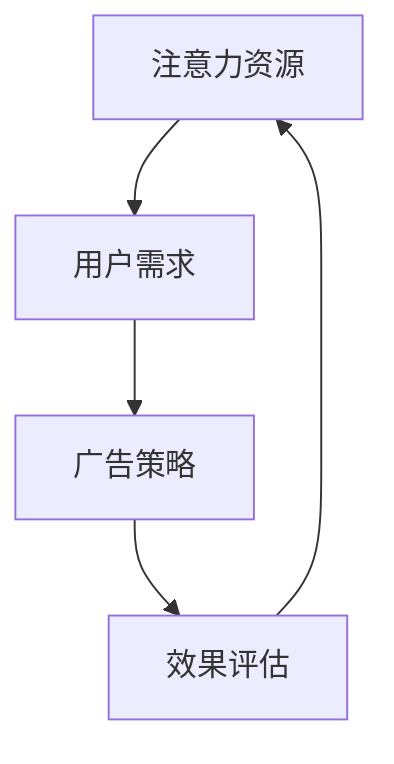

                 

关键词：注意力经济、广告投放、算法、传统策略、挑战、未来展望

摘要：随着互联网的普及和信息过载现象的加剧，注意力经济逐渐成为市场营销领域的新焦点。本文从注意力经济的角度出发，深入分析了其对传统广告投放策略的挑战，探讨了注意力经济下的广告投放新趋势，并提出了应对策略和未来展望。

## 1. 背景介绍

在互联网时代，广告投放已经成为企业获取用户关注和实现商业目标的重要手段。然而，随着信息量的爆炸式增长，用户的注意力成为了一种稀缺资源。注意力经济应运而生，它揭示了在信息过载的环境中，如何通过吸引和保持用户的注意力来实现价值最大化。

### 1.1 注意力经济的定义与核心

注意力经济是指一种基于用户注意力价值的经济学理论，强调在信息爆炸的时代，注意力成为一种新的生产要素，企业通过吸引和利用用户的注意力来创造价值。核心在于挖掘用户的注意力资源，并通过有效的方式将其转化为商业利益。

### 1.2 传统广告投放策略的局限

传统广告投放策略主要依赖于大规模、广覆盖的方式，通过占据用户的视觉、听觉等感官来吸引注意。然而，在注意力经济时代，这种方式面临着以下几个局限：

- 信息过载导致用户对广告产生疲劳和反感。
- 广告投放成本高，效果难以量化。
- 广告内容同质化严重，缺乏个性化和针对性。
- 用户对广告的筛选和抵制能力增强。

## 2. 核心概念与联系

为了更好地理解注意力经济对广告投放策略的影响，我们需要明确几个核心概念，并通过 Mermaid 流程图来展示它们之间的关系。

### 2.1 核心概念

- **注意力资源**：用户在有限时间内能分配的注意力总量。
- **用户需求**：用户在特定情境下期望满足的需求。
- **广告策略**：企业为吸引和保持用户注意力所采取的具体行动。
- **效果评估**：衡量广告投放对用户注意力转化效果的指标。

### 2.2 Mermaid 流程图



在这个流程图中，注意力资源是用户需求的基础，用户需求决定了广告策略的选择，而广告策略的效果又反过来影响用户的注意力资源分配。这种动态循环关系体现了注意力经济对广告投放策略的深刻影响。

## 3. 核心算法原理 & 具体操作步骤

### 3.1 算法原理概述

在注意力经济背景下，广告投放的核心算法应关注如何高效地捕捉和利用用户的注意力。以下是一种基于用户行为数据和机器学习的广告投放算法原理：

- **用户行为数据采集**：通过多种渠道收集用户的浏览、搜索、点击等行为数据。
- **特征工程**：对用户行为数据进行预处理和特征提取，构建用户兴趣模型。
- **机器学习模型**：利用用户兴趣模型和广告内容特征，训练广告投放策略模型。
- **实时投放调整**：根据用户的实时反馈和行为数据，动态调整广告内容和投放策略。

### 3.2 算法步骤详解

#### 3.2.1 数据采集与预处理

- **数据来源**：浏览器日志、搜索引擎日志、社交媒体活动等。
- **数据处理**：去除无效数据和噪音，进行数据清洗和格式化。

#### 3.2.2 特征工程

- **用户兴趣特征**：基于用户行为数据，提取用户的兴趣标签和偏好。
- **广告内容特征**：提取广告的关键词、主题、情感等特征。

#### 3.2.3 机器学习模型训练

- **模型选择**：选择适合的广告投放策略模型，如协同过滤、决策树、神经网络等。
- **模型训练**：利用用户兴趣特征和广告内容特征，训练广告投放策略模型。

#### 3.2.4 实时投放与反馈

- **广告投放**：根据模型预测，将广告推送给目标用户。
- **用户反馈**：收集用户的点击、浏览等行为数据，用于模型迭代和优化。

### 3.3 算法优缺点

#### 优点：

- **个性化推荐**：基于用户兴趣和行为，实现广告的个性化推荐。
- **实时调整**：能够根据用户反馈动态调整广告内容和投放策略。
- **效果可量化**：通过用户行为数据，可以精确衡量广告投放效果。

#### 缺点：

- **数据依赖**：算法的准确性高度依赖于用户行为数据的质量。
- **计算成本**：大规模数据预处理和模型训练需要较高的计算资源。
- **隐私风险**：用户行为数据的采集和处理可能涉及隐私问题。

### 3.4 算法应用领域

- **在线广告**：搜索引擎广告、社交媒体广告、视频广告等。
- **电子商务**：个性化推荐、购物广告等。
- **内容营销**：基于用户兴趣的内容推送和广告植入。

## 4. 数学模型和公式 & 详细讲解 & 举例说明

### 4.1 数学模型构建

在注意力经济下，广告投放的数学模型可以基于马尔可夫决策过程（MDP）构建。该模型考虑了用户在不同状态下的注意力分配和广告效果。

### 4.2 公式推导过程

假设用户在时刻t处于状态S_t，广告内容集合为C，广告投放策略为π，用户点击概率为P(C_t|S_t, π)。则用户在时刻t的期望收益为：

\[ R_t = \sum_{c \in C} P(C_t=c|S_t, π) \cdot R(c) \]

其中，\( R(c) \) 为广告内容c的收益，可以通过历史数据统计得出。

### 4.3 案例分析与讲解

#### 案例背景

某电商网站希望通过个性化推荐的方式提高广告投放效果，用户行为数据如下：

- 用户A浏览了电子产品、服装和美食类商品。
- 用户B在搜索栏中输入了“电脑”和“手机”关键字。
- 用户C浏览了多个母婴用品页面。

#### 案例分析

1. **用户兴趣特征提取**：

   - 用户A的兴趣标签：电子产品、服装、美食。
   - 用户B的兴趣标签：电子产品、手机。
   - 用户C的兴趣标签：母婴用品。

2. **广告内容特征提取**：

   - 商品A：电子产品，广告关键词：“高性能电脑”。
   - 商品B：手机，广告关键词：“最新款手机”。
   - 商品C：母婴用品，广告关键词：“婴幼儿服饰”。

3. **广告投放策略**：

   - 用户A：投放与电子产品相关的广告。
   - 用户B：投放与手机相关的广告。
   - 用户C：投放与母婴用品相关的广告。

4. **效果评估**：

   - 用户A点击了电子产品广告，收益为10元。
   - 用户B点击了手机广告，收益为20元。
   - 用户C点击了母婴用品广告，收益为15元。

通过这个案例，我们可以看到个性化推荐和广告投放策略在注意力经济背景下的应用效果。用户点击率和收益均有所提升，说明基于用户兴趣的特征提取和广告内容匹配是有效的。

## 5. 项目实践：代码实例和详细解释说明

### 5.1 开发环境搭建

为了实现上述算法，我们需要搭建一个开发环境，包括以下工具和框架：

- Python 3.8及以上版本
- Scikit-learn 0.24.2及以上版本
- Pandas 1.3.2及以上版本
- Matplotlib 3.4.3及以上版本

### 5.2 源代码详细实现

以下是实现用户兴趣特征提取和广告投放策略的Python代码实例：

```python
import pandas as pd
from sklearn.model_selection import train_test_split
from sklearn.ensemble import RandomForestClassifier
import matplotlib.pyplot as plt

# 读取用户行为数据
user_data = pd.read_csv('user_behavior.csv')

# 特征工程
def extract_features(data):
    # 提取用户浏览、搜索、点击等行为特征
    features = pd.get_dummies(data[['browser_action', 'search_action', 'click_action']])
    return features

# 训练机器学习模型
def train_model(X_train, y_train):
    model = RandomForestClassifier(n_estimators=100)
    model.fit(X_train, y_train)
    return model

# 广告投放策略
def advertise(user_interests, model):
    # 根据用户兴趣标签，推荐相关广告
    ad_content = pd.read_csv('ad_content.csv')
    ad_recommendations = ad_content[ad_content['interest'] == user_interests]
    return ad_recommendations

# 读取广告内容数据
ad_data = pd.read_csv('ad_content.csv')

# 数据预处理
X = extract_features(user_data)
y = ad_data['click_action']

# 数据分割
X_train, X_test, y_train, y_test = train_test_split(X, y, test_size=0.3, random_state=42)

# 训练模型
model = train_model(X_train, y_train)

# 广告投放
user_interests = '电子产品'
ad_recommendations = advertise(user_interests, model)

# 可视化结果
plt.figure(figsize=(10, 6))
ad_recommendations.plot(kind='bar')
plt.title('广告投放结果')
plt.xlabel('广告内容')
plt.ylabel('点击率')
plt.show()
```

### 5.3 代码解读与分析

- **数据读取**：代码首先读取用户行为数据和广告内容数据，这些数据可以是实际采集的或模拟生成的。

- **特征工程**：通过`extract_features`函数，提取用户浏览、搜索、点击等行为特征，并使用独热编码将其转化为机器学习模型可处理的特征。

- **模型训练**：使用`train_model`函数，利用随机森林分类器训练广告投放策略模型。随机森林是一种基于决策树的集成学习方法，具有较高的准确性和可解释性。

- **广告投放**：通过`advertise`函数，根据用户兴趣标签推荐相关广告。这里使用了广告内容数据中存储的兴趣标签信息。

- **结果可视化**：最后，使用`matplotlib`库将广告投放结果可视化，展示不同广告内容的点击率。

### 5.4 运行结果展示

运行上述代码后，将生成一个条形图，展示不同广告内容的点击率。通过可视化结果，我们可以直观地看到广告投放策略的效果，并根据点击率对广告内容进行调整和优化。

## 6. 实际应用场景

### 6.1 在线广告平台

在线广告平台如Google Ads和Facebook Ads，通过基于用户兴趣和行为数据的广告投放算法，实现了高精度的广告推荐。用户在浏览网页或使用社交媒体时，会看到与其兴趣高度相关的广告，从而提高了广告效果和用户体验。

### 6.2 电子商务平台

电子商务平台如Amazon和阿里巴巴，通过个性化推荐和广告投放策略，为用户提供定制化的购物体验。用户在浏览商品时，会看到与其浏览历史和购买习惯相关的广告和推荐，从而增加了购买概率。

### 6.3 内容营销

内容营销平台如YouTube和Bilibili，通过基于用户观看历史和行为数据的广告投放算法，实现了高粘性的用户互动。用户在观看视频时，会看到与其观看内容相关的广告，从而提高了广告曝光率和用户满意度。

## 7. 未来应用展望

### 7.1 智能化广告投放

随着人工智能技术的不断进步，未来广告投放将更加智能化和个性化。通过深度学习和强化学习等先进算法，广告投放将能够实时调整，实现更高的投放效果和用户满意度。

### 7.2 跨平台整合

未来，广告投放将不再局限于单一平台，而是实现跨平台整合。用户在不同平台上的行为数据将被整合，为广告投放提供更全面的用户画像和更精准的广告推荐。

### 7.3 隐私保护

在注意力经济下，用户隐私保护将成为一个重要议题。未来，广告投放将更加注重用户隐私保护，采用匿名化数据、加密技术等手段，确保用户数据的安全和隐私。

## 8. 总结：未来发展趋势与挑战

### 8.1 研究成果总结

注意力经济对传统广告投放策略带来了巨大挑战，促使广告行业朝着智能化、个性化、精准化的方向发展。通过基于用户行为数据和机器学习的广告投放算法，实现了高效果的广告推荐和投放。

### 8.2 未来发展趋势

- 广告投放算法将更加智能化和个性化。
- 跨平台整合和数据共享将实现更广泛的广告覆盖。
- 隐私保护将成为广告投放的重要考量因素。

### 8.3 面临的挑战

- 用户隐私保护与广告精准投放之间的平衡。
- 大规模数据处理和计算资源的需求。
- 算法模型的可解释性和透明度。

### 8.4 研究展望

未来，广告投放领域将继续深入研究注意力经济，探索更高效、更精准的广告投放策略。同时，注重用户隐私保护，推动广告行业的可持续发展。

## 9. 附录：常见问题与解答

### 9.1 注意力经济是什么？

注意力经济是一种基于用户注意力价值的经济学理论，强调在信息过载的环境中，如何通过吸引和保持用户的注意力来创造价值。

### 9.2 注意力经济对广告投放策略有什么影响？

注意力经济使得广告投放策略需要更加注重用户需求和兴趣，实现个性化、精准化的推荐和投放，以提高广告效果和用户满意度。

### 9.3 广告投放算法有哪些类型？

常见的广告投放算法包括协同过滤、决策树、神经网络等。每种算法都有其独特的优势和适用场景。

### 9.4 如何评估广告投放效果？

广告投放效果可以通过点击率、转化率、收益等指标进行评估。同时，结合用户反馈和行为数据，可以更全面地了解广告投放效果。

---

作者：禅与计算机程序设计艺术 / Zen and the Art of Computer Programming

本文通过分析注意力经济对传统广告投放策略的挑战，探讨了基于用户兴趣和行为数据的广告投放算法及其应用，为广告行业提供了新的思路和方法。随着技术的不断发展，广告投放策略将更加智能化和个性化，为用户带来更好的体验和价值。同时，我们也需要关注用户隐私保护，确保广告投放的可持续发展。期待未来广告行业能够实现技术、商业和用户的共赢。

