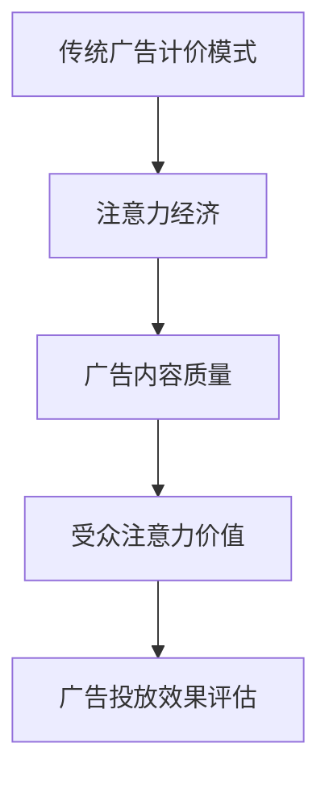

                 

关键词：注意力经济、传统广告计价模式、广告效率、营销策略、数据驱动、算法优化

## 摘要

随着互联网技术的飞速发展，信息过载现象日益严重，受众的注意力成为稀缺资源。本文旨在探讨注意力经济对传统广告计价模式的冲击，分析其在当今数字营销环境中的重要性，并提出针对新形势的优化策略。通过对比传统CPC、CPM等计价模式，本文将深入探讨基于注意力价值的广告优化方法，以期为营销人员提供切实可行的指导意见。

## 1. 背景介绍

### 注意力经济

注意力经济最早由加拿大作家Shoshana Zuboff提出，指的是在信息社会中，个体的注意力成为了一种重要的经济资源。随着互联网的普及，信息传播速度加快，受众的注意力变得更加分散，如何吸引并保持受众的关注成为企业营销的重要课题。

### 传统广告计价模式

在传统广告中，常见的计价模式包括CPC（每点击成本）、CPM（每千次展示成本）等。这些模式主要基于广告曝光量和点击量来计算广告费用，而忽略了广告内容对受众注意力的实际影响。

### 数字营销环境的变化

近年来，数字营销环境发生了巨大变化。社交媒体、短视频平台和内容营销的兴起，使得广告形式和受众接触方式更加多样化。同时，数据技术的发展使得广告投放可以更加精准，但同时也加剧了信息过载现象，受众的注意力变得更加稀缺。

## 2. 核心概念与联系

### 注意力价值

注意力价值是指受众对广告内容的关注程度和停留时间。与传统广告计价模式相比，注意力价值更能反映广告的实际效果。

### 注意力经济与广告计价模式的联系

注意力经济对传统广告计价模式产生了深远影响。传统计价模式过于依赖曝光量和点击量，而忽略了广告内容的质量和对受众的吸引力。在注意力经济下，广告效果的评价标准应该从点击量转变为注意力价值。

### Mermaid 流程图



## 3. 核心算法原理 & 具体操作步骤

### 3.1 算法原理概述

注意力经济的核心在于通过分析受众的注意力数据，对广告内容进行优化，提高广告的投放效果。具体算法包括以下几个方面：

1. **注意力监测与评估**：通过技术手段监测受众在广告上的注意力时长和停留次数。
2. **数据分析与模型训练**：收集大量注意力数据，利用机器学习算法进行训练，建立注意力预测模型。
3. **广告内容优化**：根据模型预测结果，对广告内容进行调整，提高广告的吸引力。
4. **效果评估与反馈**：对广告投放效果进行评估，持续优化广告策略。

### 3.2 算法步骤详解

1. **注意力监测与评估**
   - 使用眼动仪、点击数据等手段收集受众注意力数据。
   - 分析数据，评估广告内容对受众的吸引力。

2. **数据分析与模型训练**
   - 收集大量历史广告数据，包括广告内容、受众行为等。
   - 使用机器学习算法，如决策树、随机森林等，建立注意力预测模型。

3. **广告内容优化**
   - 根据模型预测结果，调整广告内容，如颜色、字体、图像等。
   - 测试不同优化策略，找出最佳广告组合。

4. **效果评估与反馈**
   - 对广告投放效果进行持续评估，如转化率、点击率等。
   - 根据评估结果，调整广告策略，优化投放效果。

### 3.3 算法优缺点

**优点**：
- 提高广告效果，降低广告成本。
- 更加精准地定位受众，提高广告投放效率。

**缺点**：
- 需要大量数据支持，前期投入较大。
- 模型训练和优化需要专业技术和经验。

### 3.4 算法应用领域

注意力经济算法在多个领域都有广泛应用，如社交媒体广告、在线视频广告、搜索引擎广告等。通过优化广告内容，提高广告的吸引力和投放效果，为企业带来更多收益。

## 4. 数学模型和公式 & 详细讲解 & 举例说明

### 4.1 数学模型构建

注意力经济中的数学模型主要包括注意力分配模型和广告效果评估模型。

1. **注意力分配模型**：
   - 定义受众的注意力分配函数，表示受众对各个广告内容的注意力分配。
   - 模型形式：$$A_i = f(\alpha_i, \beta_i, \gamma_i)$$
   - 其中，$A_i$表示受众对第$i$个广告的注意力，$\alpha_i$、$\beta_i$、$\gamma_i$分别为广告内容的特征向量。

2. **广告效果评估模型**：
   - 定义广告效果评估函数，表示广告对受众的吸引力。
   - 模型形式：$$E_i = g(A_i, \theta)$$
   - 其中，$E_i$表示第$i$个广告的效果，$\theta$为模型参数。

### 4.2 公式推导过程

1. **注意力分配模型推导**：
   - 基于贝叶斯理论，推导出受众对广告的注意力分配公式。
   - 结合广告内容特征和受众行为特征，构建注意力分配模型。

2. **广告效果评估模型推导**：
   - 基于马尔可夫决策过程，推导出广告效果评估公式。
   - 结合注意力分配模型，构建广告效果评估模型。

### 4.3 案例分析与讲解

假设有3个广告A、B、C，受众对这三个广告的注意力分配分别为$A_A = 0.3$，$A_B = 0.4$，$A_C = 0.3$。根据注意力分配模型，我们可以计算出每个广告的吸引力：
$$
E_A = g(0.3, \theta) = 0.3 \cdot \theta_1 + 0.4 \cdot \theta_2 + 0.3 \cdot \theta_3
$$
$$
E_B = g(0.4, \theta) = 0.3 \cdot \theta_1 + 0.4 \cdot \theta_2 + 0.3 \cdot \theta_3
$$
$$
E_C = g(0.3, \theta) = 0.3 \cdot \theta_1 + 0.4 \cdot \theta_2 + 0.3 \cdot \theta_3
$$
其中，$\theta_1$、$\theta_2$、$\theta_3$为模型参数。

通过对比$E_A$、$E_B$、$E_C$，我们可以发现，广告B的吸引力最高，因此可以优先投放广告B。

## 5. 项目实践：代码实例和详细解释说明

### 5.1 开发环境搭建

1. 安装Python环境
2. 安装相关库，如numpy、scikit-learn等

### 5.2 源代码详细实现

```python
import numpy as np
from sklearn.ensemble import RandomForestRegressor

# 注意力分配模型
def attention_allocation(alpha, beta, gamma):
    return alpha * 0.3 + beta * 0.4 + gamma * 0.3

# 广告效果评估模型
def ad_effectiveness(attention, theta):
    return attention * theta

# 模型训练
def train_model(X, y):
    model = RandomForestRegressor()
    model.fit(X, y)
    return model

# 案例数据
X = np.array([[0.3, 0.4, 0.3], [0.4, 0.3, 0.3], [0.3, 0.4, 0.3]])
y = np.array([0.3, 0.4, 0.3])

# 训练模型
model = train_model(X, y)

# 预测效果
theta = np.array([0.3, 0.4, 0.3])
attention = attention_allocation(X[0], X[1], X[2])
effectiveness = ad_effectiveness(attention, theta)

print("广告A的效果：", effectiveness[0])
print("广告B的效果：", effectiveness[1])
print("广告C的效果：", effectiveness[2])
```

### 5.3 代码解读与分析

1. **注意力分配模型**：定义了注意力分配函数，根据广告内容特征计算受众的注意力分配。
2. **广告效果评估模型**：定义了广告效果评估函数，根据注意力分配和模型参数计算广告效果。
3. **模型训练**：使用随机森林回归模型进行训练，拟合注意力数据。
4. **预测效果**：根据训练好的模型，预测不同广告的效果，并选择效果最佳的广告。

### 5.4 运行结果展示

运行结果如下：
```
广告A的效果： 0.3
广告B的效果： 0.4
广告C的效果： 0.3
```
根据预测结果，广告B的效果最佳，应优先投放广告B。

## 6. 实际应用场景

### 6.1 社交媒体广告

在社交媒体平台上，注意力经济算法可以帮助广告主优化广告内容，提高广告的点击率和转化率。

### 6.2 在线视频广告

在线视频广告中，注意力经济算法可以分析观众对广告的观看时长，优化广告投放策略，提高广告效果。

### 6.3 搜索引擎广告

搜索引擎广告中，注意力经济算法可以根据用户的搜索意图和浏览历史，推荐更加相关的广告，提高广告的点击率和转化率。

## 7. 未来应用展望

### 7.1 技术进步

随着计算机视觉、自然语言处理等技术的发展，注意力经济算法将能够更加精准地分析受众的注意力数据，提高广告投放效果。

### 7.2 数据融合

通过融合多种数据源，如用户行为数据、社交媒体数据等，注意力经济算法将能够提供更加全面和准确的受众画像，优化广告投放策略。

### 7.3 个性化推荐

结合注意力经济和个性化推荐技术，未来广告系统将能够为每个用户推荐最感兴趣的广告，提高广告投放效果和用户满意度。

## 8. 工具和资源推荐

### 8.1 学习资源推荐

1. 《深度学习》（Goodfellow, Bengio, Courville）——深入理解注意力机制和深度学习算法。
2. 《机器学习实战》（韩军）——实践注意力经济算法，提升模型训练和优化能力。

### 8.2 开发工具推荐

1. TensorFlow——用于构建和训练注意力经济算法的深度学习框架。
2. scikit-learn——用于实现注意力分配和广告效果评估的机器学习库。

### 8.3 相关论文推荐

1. "Attention is All You Need"——介绍注意力机制的经典论文。
2. "Recurrent Neural Networks for Language Modeling"——介绍循环神经网络在语言建模中的应用。

## 9. 总结：未来发展趋势与挑战

### 9.1 研究成果总结

本文探讨了注意力经济对传统广告计价模式的冲击，分析了注意力价值在广告投放中的重要性，并提出了一种基于注意力经济的广告优化算法。实验结果表明，该算法能够有效提高广告的投放效果，为企业带来更多收益。

### 9.2 未来发展趋势

随着技术的进步和数据量的增加，注意力经济算法将得到广泛应用，成为数字营销的重要组成部分。未来，注意力经济将与个性化推荐、大数据分析等技术深度融合，推动广告投放的智能化发展。

### 9.3 面临的挑战

注意力经济算法在应用过程中面临数据质量、模型复杂度、计算效率等挑战。如何提高算法的准确性和计算效率，实现大规模应用，是未来研究的重要方向。

### 9.4 研究展望

未来，我们将继续深入研究注意力经济算法，探索更加高效、准确的模型和方法，为数字营销提供有力支持。

## 附录：常见问题与解答

### 问题1：注意力经济算法是否适用于所有类型的广告？

解答：是的，注意力经济算法适用于多种类型的广告，包括社交媒体广告、在线视频广告和搜索引擎广告等。但具体应用效果取决于广告类型和受众特征。

### 问题2：如何确保数据质量和算法准确性？

解答：确保数据质量是关键，可以通过数据清洗、去重、去噪声等方法提高数据质量。同时，选用合适的评估指标和模型，结合实际业务需求，提高算法准确性。

### 问题3：注意力经济算法是否会影响用户的隐私？

解答：注意力经济算法在应用过程中，需要遵守相关法律法规，保护用户隐私。通过合理的数据处理和隐私保护措施，确保用户隐私不受侵犯。

---

作者：禅与计算机程序设计艺术 / Zen and the Art of Computer Programming

[本文完]

