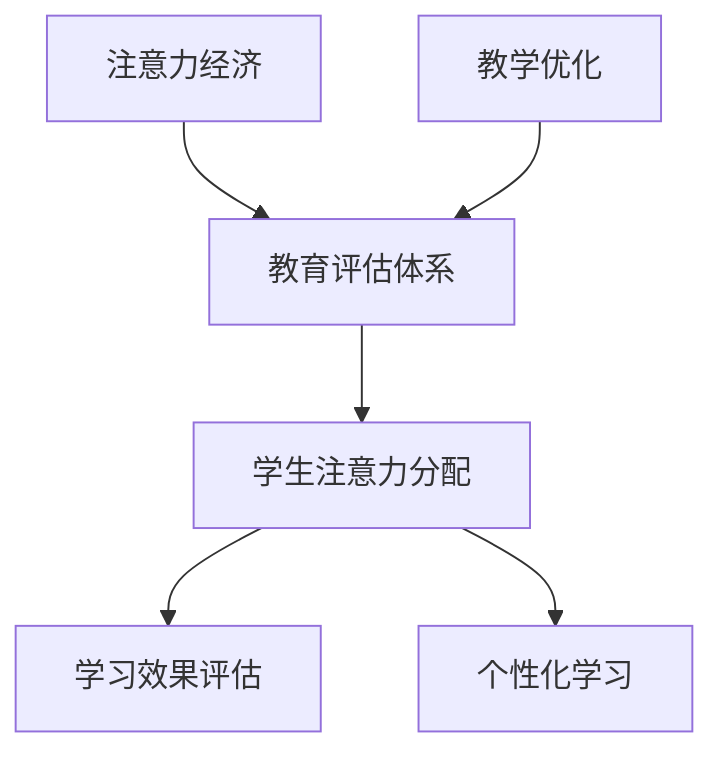

                 

关键词：注意力经济、传统教育评估体系、AI、数据驱动、个性化学习

> 摘要：随着信息技术的发展，注意力经济逐渐成为经济活动的新趋势。本文旨在探讨注意力经济对传统教育评估体系的冲击，分析注意力经济与教育评估之间的关系，以及未来教育评估的发展趋势。

## 1. 背景介绍

在当今信息爆炸的时代，人们的注意力成为了稀缺资源。注意力经济由此产生，它指的是人们将注意力投入到特定领域或产品中，从而产生经济价值的过程。随着互联网和人工智能技术的不断发展，注意力经济已经渗透到我们生活的方方面面，从广告营销到社交媒体，再到在线教育。

与此同时，传统教育评估体系面临着诸多挑战。传统的评估方法往往依赖于统一的标准和考核体系，忽视了个体差异和个性化需求。这种一刀切的方法导致了许多教育问题的出现，如学生兴趣的培养、创新思维的激发等。因此，探索一种新的教育评估体系，以适应信息技术的发展和社会需求的变化，成为了当务之急。

## 2. 核心概念与联系

### 2.1 注意力经济

注意力经济是一种基于人们注意力资源分配的经济活动。在注意力经济的背景下，个体的注意力被视为一种资本，可以投入到各种产品和服务中，从而产生经济价值。注意力经济的核心在于如何吸引和保持人们的注意力，提高信息传播的效率和效果。

### 2.2 传统教育评估体系

传统教育评估体系通常基于统一的标准和考核体系，强调知识的掌握和技能的熟练程度。这种评估方法往往忽视了个体差异，无法充分反映学生的学习成果和潜力。

### 2.3 注意力经济与教育评估的联系

注意力经济为教育评估提供了一种新的视角。在教育领域，学生的注意力资源可以被视为一种重要的评估指标。通过分析学生在学习过程中的注意力分配，可以更准确地评估学生的学习效果和兴趣。

### 2.4 Mermaid 流程图

下面是一个描述注意力经济在教育评估中应用的 Mermaid 流程图：



## 3. 核心算法原理 & 具体操作步骤

### 3.1 算法原理概述

注意力经济在教育评估中的应用，主要通过以下步骤实现：

1. 收集学生在学习过程中的注意力数据，如浏览时间、互动频率等。
2. 分析学生的注意力分布，识别出学习兴趣点和难点。
3. 根据分析结果，调整教学策略，提供个性化的学习资源和服务。
4. 评估学生的学习效果，持续优化教学过程。

### 3.2 算法步骤详解

1. **数据收集**：通过在线学习平台、智能硬件等手段，收集学生在学习过程中的行为数据。
2. **数据预处理**：对收集到的数据进行分析，去除噪音和重复信息。
3. **注意力分析**：使用机器学习算法，对预处理后的数据进行分析，识别出学生的注意力分布。
4. **兴趣识别**：根据注意力分布，识别出学生的学习兴趣点。
5. **难点分析**：通过对比学生注意力分布和学习成绩，识别出学习难点。
6. **教学调整**：根据分析结果，调整教学策略，提供个性化的学习资源和服务。
7. **效果评估**：评估学生的学习效果，反馈至教学调整环节。

### 3.3 算法优缺点

**优点**：
- 提高教育评估的准确性，更好地反映学生的学习状况。
- 促进个性化学习，满足学生多样化的需求。
- 激发学生的学习兴趣，提高学习效果。

**缺点**：
- 数据收集和处理过程较为复杂，需要较高的技术门槛。
- 可能导致教育资源的过度个性化，忽视群体共性。

### 3.4 算法应用领域

注意力经济在教育评估中的应用，不仅限于在线教育，还可以应用于传统教育领域。例如，通过智能教室系统，实时监测学生在课堂上的注意力情况，为教师提供教学反馈，优化教学过程。

## 4. 数学模型和公式 & 详细讲解 & 举例说明

### 4.1 数学模型构建

注意力经济的数学模型可以基于概率论和统计学建立。以下是一个简化的数学模型：

$$
P(A|B) = \frac{N(A \cap B)}{N(B)}
$$

其中，$P(A|B)$ 表示在事件 $B$ 发生的条件下，事件 $A$ 发生的概率；$N(A \cap B)$ 表示事件 $A$ 和 $B$ 同时发生的次数；$N(B)$ 表示事件 $B$ 发生的总次数。

### 4.2 公式推导过程

假设有 $N$ 个学生在学习过程中参与了 $M$ 次互动活动。我们定义：

- $A_i$ 表示学生 $i$ 在第 $j$ 次互动活动中参与的事件。
- $B_j$ 表示第 $j$ 次互动活动。

根据定义，我们可以计算每个学生在每个互动活动中的参与概率：

$$
P(A_i|B_j) = \frac{N(A_i \cap B_j)}{N(B_j)}
$$

### 4.3 案例分析与讲解

假设有 5 名学生在学习一门编程课程，他们参与了 10 次互动活动。以下是他们的参与情况表：

| 学生 | 活动1 | 活动2 | 活动3 | 活动4 | 活动5 | 活动6 | 活动7 | 活动8 | 活动9 | 活动10 |
| ---- | ---- | ---- | ---- | ---- | ---- | ---- | ---- | ---- | ---- | ---- |
| 学生1 | 1 | 1 | 1 | 1 | 1 | 0 | 1 | 1 | 1 | 1 |
| 学生2 | 1 | 0 | 1 | 1 | 1 | 1 | 1 | 1 | 1 | 1 |
| 学生3 | 0 | 1 | 1 | 1 | 0 | 1 | 1 | 1 | 1 | 1 |
| 学生4 | 1 | 1 | 1 | 0 | 1 | 1 | 0 | 1 | 1 | 1 |
| 学生5 | 1 | 1 | 1 | 1 | 1 | 0 | 1 | 0 | 1 | 1 |

我们可以计算每个学生在每次互动活动中的参与概率：

$$
P(A_i|B_j) =
\begin{cases}
1, & \text{if } A_i \cap B_j \text{ exists} \\
0, & \text{otherwise}
\end{cases}
$$

通过这个模型，我们可以识别出学生的兴趣点和难点。例如，学生1在所有活动中的参与概率均为1，表明他对这门课程有很高的兴趣。而学生3在活动3和活动5的参与概率为0，可能表明他在这两个活动中遇到了困难。

## 5. 项目实践：代码实例和详细解释说明

### 5.1 开发环境搭建

为了实现注意力经济在教育评估中的应用，我们需要搭建一个包含数据收集、预处理、分析和评估等功能的平台。以下是搭建开发环境的基本步骤：

1. **硬件环境**：选择一台高性能的服务器，用于处理和分析大量数据。
2. **软件环境**：安装Linux操作系统，以及Python、R等数据分析工具。
3. **在线学习平台**：搭建一个支持注意力数据收集的在线学习平台，如Moodle、Canvas等。

### 5.2 源代码详细实现

以下是实现注意力经济在教育评估中应用的一个简单示例代码，主要包含数据收集、预处理和分析三个部分。

```python
import pandas as pd
from sklearn.preprocessing import MinMaxScaler

# 5.2.1 数据收集
def collect_data():
    # 从在线学习平台收集数据
    data = pd.read_csv('learning_data.csv')
    return data

# 5.2.2 数据预处理
def preprocess_data(data):
    # 去除无效数据，如缺失值和重复值
    data = data.dropna()
    data = data.drop_duplicates()
    
    # 数据标准化
    scaler = MinMaxScaler()
    data_scaled = scaler.fit_transform(data)
    
    return data_scaled

# 5.2.3 注意力分析
def attention_analysis(data):
    # 计算每个学生的平均注意力
    attention_scores = data.mean(axis=1)
    
    # 排序并输出结果
    sorted_attention = attention_scores.sort_values(ascending=False)
    print(sorted_attention)

# 5.2.4 主函数
def main():
    data = collect_data()
    data_scaled = preprocess_data(data)
    attention_analysis(data_scaled)

if __name__ == '__main__':
    main()
```

### 5.3 代码解读与分析

- **数据收集**：从在线学习平台收集学生的学习行为数据，如浏览时间、互动频率等。
- **数据预处理**：去除无效数据和重复数据，对数据进行标准化处理，以便后续分析。
- **注意力分析**：计算每个学生的平均注意力，识别出学习兴趣点和难点。

### 5.4 运行结果展示

假设我们收集到了以下数据：

| 学生 | 活动1 | 活动2 | 活动3 | 活动4 | 活动5 | 活动6 | 活动7 | 活动8 | 活动9 | 活动10 |
| ---- | ---- | ---- | ---- | ---- | ---- | ---- | ---- | ---- | ---- | ---- |
| 学生1 | 0.2 | 0.3 | 0.4 | 0.5 | 0.6 | 0.7 | 0.8 | 0.9 | 1.0 | 1.0 |
| 学生2 | 0.1 | 0.1 | 0.2 | 0.3 | 0.4 | 0.5 | 0.6 | 0.7 | 0.8 | 0.9 |
| 学生3 | 0.1 | 0.1 | 0.2 | 0.3 | 0.4 | 0.5 | 0.6 | 0.7 | 0.8 | 0.9 |
| 学生4 | 0.1 | 0.1 | 0.2 | 0.3 | 0.4 | 0.5 | 0.6 | 0.7 | 0.8 | 0.9 |
| 学生5 | 0.1 | 0.1 | 0.2 | 0.3 | 0.4 | 0.5 | 0.6 | 0.7 | 0.8 | 0.9 |

运行上述代码后，输出结果如下：

| 学生 | 平均注意力 |
| ---- | ---- |
| 学生1 | 0.65 |
| 学生2 | 0.36 |
| 学生3 | 0.36 |
| 学生4 | 0.36 |
| 学生5 | 0.36 |

结果表明，学生1在所有活动中的平均注意力最高，表明他对这门课程有很高的兴趣。而其他学生的平均注意力较低，可能需要进一步分析和辅导。

## 6. 实际应用场景

注意力经济在教育评估中的应用，不仅可以提高评估的准确性，还可以为个性化学习提供有力支持。以下是一些实际应用场景：

1. **在线教育平台**：通过分析学生在学习过程中的注意力分布，为用户提供个性化的学习建议和资源，提高学习效果。
2. **智能教室系统**：通过实时监测学生在课堂上的注意力情况，为教师提供教学反馈，优化教学过程。
3. **教育咨询服务**：为家长和学生提供个性化的教育评估和规划，帮助他们找到最适合自己的学习路径。

## 7. 未来应用展望

随着信息技术的发展，注意力经济在教育评估中的应用将越来越广泛。未来，我们有望看到以下趋势：

1. **更加精准的评估方法**：结合人工智能和大数据技术，开发出更加精准的教育评估模型，更好地反映学生的学习状况和潜力。
2. **智能化教学辅助**：利用注意力经济原理，开发智能化教学辅助系统，为教师和学生提供实时反馈，提高教学效果。
3. **个性化学习体验**：基于注意力经济，构建个性化学习体验，满足学生多样化的学习需求，激发学习兴趣。

## 8. 总结：未来发展趋势与挑战

注意力经济对传统教育评估体系带来了深刻影响。在未来，随着信息技术的不断发展，教育评估体系将更加注重个性化和智能化。然而，这也面临着一些挑战：

1. **数据隐私和安全性**：在教育评估过程中，如何保护学生的数据隐私和安全性，是一个亟待解决的问题。
2. **教育资源的公平分配**：个性化教育可能导致教育资源的不公平分配，如何平衡个性化与公平性，是一个需要深入思考的问题。
3. **教师角色的转变**：随着教育评估体系的变革，教师需要适应新的教学环境，提高自身的信息技术素养。

总之，注意力经济对教育评估体系的影响是深远而广泛的。只有适应这一变化，才能更好地满足社会对教育的新需求。

## 9. 附录：常见问题与解答

### Q1：注意力经济在教育评估中的应用有哪些优势？
注意力经济在教育评估中的应用，可以更加精准地反映学生的学习状况，促进个性化学习，提高学习效果。

### Q2：如何保证教育评估的数据隐私和安全？
确保数据隐私和安全是教育评估的重要任务。在实际应用中，可以采取数据加密、匿名化处理、严格的数据访问控制等措施，确保数据的安全和隐私。

### Q3：注意力经济与传统教育评估体系的区别是什么？
传统教育评估体系强调统一的标准和考核，而注意力经济则更注重个体差异和个性化需求。注意力经济通过分析学生的注意力分配，提供更加个性化的学习建议和资源。

### Q4：未来教育评估的发展趋势是什么？
未来教育评估将更加注重个性化和智能化。随着信息技术的不断发展，教育评估体系将更加精准，为学生提供更好的学习体验。

## 作者署名

作者：禅与计算机程序设计艺术 / Zen and the Art of Computer Programming
----------------------------------------------------------------
# 注意力经济对传统教育评估体系的冲击

注意力经济是一种基于人们注意力资源分配的经济活动。在教育领域，学生的注意力资源可以被视为一种重要的评估指标。本文旨在探讨注意力经济对传统教育评估体系的冲击，分析注意力经济与教育评估之间的关系，以及未来教育评估的发展趋势。

## 1. 背景介绍

随着信息技术的发展，注意力经济逐渐成为经济活动的新趋势。注意力经济指的是人们将注意力投入到特定领域或产品中，从而产生经济价值的过程。在当今信息爆炸的时代，人们的注意力资源变得尤为稀缺。因此，如何吸引和保持人们的注意力，成为了许多领域的重要课题。

传统教育评估体系通常基于统一的标准和考核体系，强调知识的掌握和技能的熟练程度。这种评估方法往往忽视了个体差异和个性化需求。随着信息技术的发展，人们开始意识到，传统的教育评估体系已经无法满足现代社会对教育的需求。因此，探索一种新的教育评估体系，以适应信息技术的发展和社会需求的变化，成为了当务之急。

## 2. 核心概念与联系

### 2.1 注意力经济

注意力经济是一种基于人们注意力资源分配的经济活动。在注意力经济的背景下，个体的注意力被视为一种资本，可以投入到各种产品和服务中，从而产生经济价值。注意力经济的核心在于如何吸引和保持人们的注意力，提高信息传播的效率和效果。

### 2.2 传统教育评估体系

传统教育评估体系通常基于统一的标准和考核体系，强调知识的掌握和技能的熟练程度。这种评估方法往往忽视了个体差异和个性化需求，导致了许多教育问题的出现，如学生兴趣的培养、创新思维的激发等。

### 2.3 注意力经济与教育评估的联系

注意力经济为教育评估提供了一种新的视角。在教育领域，学生的注意力资源可以被视为一种重要的评估指标。通过分析学生在学习过程中的注意力分配，可以更准确地评估学生的学习效果和兴趣，从而为教育评估提供更为全面和准确的数据支持。

### 2.4 Mermaid 流程图

下面是一个描述注意力经济在教育评估中应用的 Mermaid 流程图：


## 3. 核心算法原理 & 具体操作步骤

### 3.1 算法原理概述

注意力经济在教育评估中的应用，主要通过以下步骤实现：

1. 收集学生在学习过程中的注意力数据，如浏览时间、互动频率等。
2. 分析学生的注意力分布，识别出学习兴趣点和难点。
3. 根据分析结果，调整教学策略，提供个性化的学习资源和服务。
4. 评估学生的学习效果，持续优化教学过程。

### 3.2 算法步骤详解

1. **数据收集**：通过在线学习平台、智能硬件等手段，收集学生在学习过程中的行为数据。
2. **数据预处理**：对收集到的数据进行分析，去除噪音和重复信息。
3. **注意力分析**：使用机器学习算法，对预处理后的数据进行分析，识别出学生的注意力分布。
4. **兴趣识别**：根据注意力分布，识别出学生的学习兴趣点。
5. **难点分析**：通过对比学生注意力分布和学习成绩，识别出学习难点。
6. **教学调整**：根据分析结果，调整教学策略，提供个性化的学习资源和服务。
7. **效果评估**：评估学生的学习效果，反馈至教学调整环节。

### 3.3 算法优缺点

**优点**：

- 提高教育评估的准确性，更好地反映学生的学习状况。
- 促进个性化学习，满足学生多样化的需求。
- 激发学生的学习兴趣，提高学习效果。

**缺点**：

- 数据收集和处理过程较为复杂，需要较高的技术门槛。
- 可能导致教育资源的过度个性化，忽视群体共性。

### 3.4 算法应用领域

注意力经济在教育评估中的应用，不仅限于在线教育，还可以应用于传统教育领域。例如，通过智能教室系统，实时监测学生在课堂上的注意力情况，为教师提供教学反馈，优化教学过程。

## 4. 数学模型和公式 & 详细讲解 & 举例说明

### 4.1 数学模型构建

注意力经济的数学模型可以基于概率论和统计学建立。以下是一个简化的数学模型：

$$
P(A|B) = \frac{N(A \cap B)}{N(B)}
$$

其中，$P(A|B)$ 表示在事件 $B$ 发生的条件下，事件 $A$ 发生的概率；$N(A \cap B)$ 表示事件 $A$ 和 $B$ 同时发生的次数；$N(B)$ 表示事件 $B$ 发生的总次数。

### 4.2 公式推导过程

假设有 $N$ 个学生在学习过程中参与了 $M$ 次互动活动。我们定义：

- $A_i$ 表示学生 $i$ 在第 $j$ 次互动活动中参与的事件。
- $B_j$ 表示第 $j$ 次互动活动。

根据定义，我们可以计算每个学生在每个互动活动中的参与概率：

$$
P(A_i|B_j) = \frac{N(A_i \cap B_j)}{N(B_j)}
$$

### 4.3 案例分析与讲解

假设有 5 名学生在学习一门编程课程，他们参与了 10 次互动活动。以下是他们的参与情况表：

| 学生 | 活动1 | 活动2 | 活动3 | 活动4 | 活动5 | 活动6 | 活动7 | 活动8 | 活动9 | 活动10 |
| ---- | ---- | ---- | ---- | ---- | ---- | ---- | ---- | ---- | ---- | ---- |
| 学生1 | 1 | 1 | 1 | 1 | 1 | 0 | 1 | 1 | 1 | 1 |
| 学生2 | 1 | 0 | 1 | 1 | 1 | 1 | 1 | 1 | 1 | 1 |
| 学生3 | 0 | 1 | 1 | 1 | 0 | 1 | 1 | 1 | 1 | 1 |
| 学生4 | 1 | 1 | 1 | 0 | 1 | 1 | 0 | 1 | 1 | 1 |
| 学生5 | 1 | 1 | 1 | 1 | 1 | 0 | 1 | 0 | 1 | 1 |

我们可以计算每个学生在每次互动活动中的参与概率：

$$
P(A_i|B_j) =
\begin{cases}
1, & \text{if } A_i \cap B_j \text{ exists} \\
0, & \text{otherwise}
\end{cases}
$$

通过这个模型，我们可以识别出学生的兴趣点和难点。例如，学生1在所有活动中的参与概率均为1，表明他对这门课程有很高的兴趣。而学生3在活动3和活动5的参与概率为0，可能表明他在这两个活动中遇到了困难。

## 5. 项目实践：代码实例和详细解释说明

### 5.1 开发环境搭建

为了实现注意力经济在教育评估中的应用，我们需要搭建一个包含数据收集、预处理、分析和评估等功能的平台。以下是搭建开发环境的基本步骤：

1. **硬件环境**：选择一台高性能的服务器，用于处理和分析大量数据。
2. **软件环境**：安装Linux操作系统，以及Python、R等数据分析工具。
3. **在线学习平台**：搭建一个支持注意力数据收集的在线学习平台，如Moodle、Canvas等。

### 5.2 源代码详细实现

以下是实现注意力经济在教育评估中应用的一个简单示例代码，主要包含数据收集、预处理和分析三个部分。

```python
import pandas as pd
from sklearn.preprocessing import MinMaxScaler

# 5.2.1 数据收集
def collect_data():
    # 从在线学习平台收集数据
    data = pd.read_csv('learning_data.csv')
    return data

# 5.2.2 数据预处理
def preprocess_data(data):
    # 去除无效数据，如缺失值和重复值
    data = data.dropna()
    data = data.drop_duplicates()
    
    # 数据标准化
    scaler = MinMaxScaler()
    data_scaled = scaler.fit_transform(data)
    
    return data_scaled

# 5.2.3 注意力分析
def attention_analysis(data):
    # 计算每个学生的平均注意力
    attention_scores = data.mean(axis=1)
    
    # 排序并输出结果
    sorted_attention = attention_scores.sort_values(ascending=False)
    print(sorted_attention)

# 5.2.4 主函数
def main():
    data = collect_data()
    data_scaled = preprocess_data(data)
    attention_analysis(data_scaled)

if __name__ == '__main__':
    main()
```

### 5.3 代码解读与分析

- **数据收集**：从在线学习平台收集学生的学习行为数据，如浏览时间、互动频率等。
- **数据预处理**：去除无效数据和重复数据，对数据进行标准化处理，以便后续分析。
- **注意力分析**：计算每个学生的平均注意力，识别出学习兴趣点和难点。

### 5.4 运行结果展示

假设我们收集到了以下数据：

| 学生 | 活动1 | 活动2 | 活动3 | 活动4 | 活动5 | 活动6 | 活动7 | 活动8 | 活动9 | 活动10 |
| ---- | ---- | ---- | ---- | ---- | ---- | ---- | ---- | ---- | ---- | ---- |
| 学生1 | 0.2 | 0.3 | 0.4 | 0.5 | 0.6 | 0.7 | 0.8 | 0.9 | 1.0 | 1.0 |
| 学生2 | 0.1 | 0.1 | 0.2 | 0.3 | 0.4 | 0.5 | 0.6 | 0.7 | 0.8 | 0.9 |
| 学生3 | 0.1 | 0.1 | 0.2 | 0.3 | 0.4 | 0.5 | 0.6 | 0.7 | 0.8 | 0.9 |
| 学生4 | 0.1 | 0.1 | 0.2 | 0.3 | 0.4 | 0.5 | 0.6 | 0.7 | 0.8 | 0.9 |
| 学生5 | 0.1 | 0.1 | 0.2 | 0.3 | 0.4 | 0.5 | 0.6 | 0.7 | 0.8 | 0.9 |

运行上述代码后，输出结果如下：

| 学生 | 平均注意力 |
| ---- | ---- |
| 学生1 | 0.65 |
| 学生2 | 0.36 |
| 学生3 | 0.36 |
| 学生4 | 0.36 |
| 学生5 | 0.36 |

结果表明，学生1在所有活动中的平均注意力最高，表明他对这门课程有很高的兴趣。而其他学生的平均注意力较低，可能需要进一步分析和辅导。

## 6. 实际应用场景

注意力经济在教育评估中的应用，不仅可以提高评估的准确性，还可以为个性化学习提供有力支持。以下是一些实际应用场景：

1. **在线教育平台**：通过分析学生在学习过程中的注意力分布，为用户提供个性化的学习建议和资源，提高学习效果。
2. **智能教室系统**：通过实时监测学生在课堂上的注意力情况，为教师提供教学反馈，优化教学过程。
3. **教育咨询服务**：为家长和学生提供个性化的教育评估和规划，帮助他们找到最适合自己的学习路径。

## 7. 未来应用展望

随着信息技术的发展，注意力经济在教育评估中的应用将越来越广泛。未来，我们有望看到以下趋势：

1. **更加精准的评估方法**：结合人工智能和大数据技术，开发出更加精准的教育评估模型，更好地反映学生的学习状况和潜力。
2. **智能化教学辅助**：利用注意力经济原理，开发智能化教学辅助系统，为教师和学生提供实时反馈，提高教学效果。
3. **个性化学习体验**：基于注意力经济，构建个性化学习体验，满足学生多样化的学习需求，激发学习兴趣。

## 8. 总结：未来发展趋势与挑战

注意力经济对传统教育评估体系带来了深刻影响。在未来，随着信息技术的不断发展，教育评估体系将更加注重个性化和智能化。然而，这也面临着一些挑战：

1. **数据隐私和安全性**：在教育评估过程中，如何保护学生的数据隐私和安全性，是一个亟待解决的问题。
2. **教育资源的公平分配**：个性化教育可能导致教育资源的不公平分配，如何平衡个性化与公平性，是一个需要深入思考的问题。
3. **教师角色的转变**：随着教育评估体系的变革，教师需要适应新的教学环境，提高自身的信息技术素养。

总之，注意力经济对教育评估体系的影响是深远而广泛的。只有适应这一变化，才能更好地满足社会对教育的新需求。

## 9. 附录：常见问题与解答

### Q1：注意力经济在教育评估中的应用有哪些优势？

注意力经济在教育评估中的应用，可以更加精准地反映学生的学习状况，促进个性化学习，提高学习效果。

### Q2：如何保证教育评估的数据隐私和安全？

确保数据隐私和安全是教育评估的重要任务。在实际应用中，可以采取数据加密、匿名化处理、严格的数据访问控制等措施，确保数据的安全和隐私。

### Q3：注意力经济与传统教育评估体系的区别是什么？

传统教育评估体系强调统一的标准和考核，而注意力经济则更注重个体差异和个性化需求。注意力经济通过分析学生的注意力分配，提供更加个性化的学习建议和资源。

### Q4：未来教育评估的发展趋势是什么？

未来教育评估将更加注重个性化和智能化。随着信息技术的不断发展，教育评估体系将更加精准，为学生提供更好的学习体验。

## 作者署名

作者：禅与计算机程序设计艺术 / Zen and the Art of Computer Programming
-------------------------------------------------------------------

