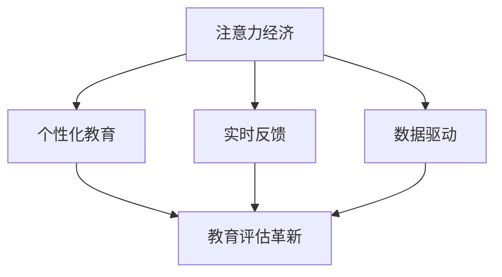

                 

关键词：注意力经济、传统教育评估、教育改革、智能算法、数据驱动

> 摘要：随着注意力经济时代的到来，传统教育评估体系面临着前所未有的挑战。本文将探讨注意力经济对教育评估的影响，分析其带来的机遇与挑战，并探讨如何利用智能算法和数据驱动的方法来应对这些挑战，以实现教育评估的革新。

## 1. 背景介绍

### 注意力经济

注意力经济是一种新的经济形态，其核心在于人们对信息的关注和注意力分配。在互联网时代，信息爆炸式增长，人们的注意力成为了一种稀缺资源。因此，能够吸引并保持人们的注意力，成为了企业和个人获取成功的关键。

### 传统教育评估体系

传统教育评估体系主要依赖于考试、成绩等指标来衡量学生的能力和成就。这种体系在长期的历史发展中形成了固有的模式，具有一定的合理性和稳定性。然而，随着社会的发展，这种评估体系逐渐暴露出一些问题，如忽视学生的个性发展、过度关注成绩等。

## 2. 核心概念与联系

### 注意力经济与教育评估的联系

注意力经济对教育评估体系的影响主要表现在以下几个方面：

1. **个性化教育**：注意力经济强调个体的独特性和个性化需求，这要求教育评估体系更加关注学生的个性发展，而不仅仅是成绩。
2. **实时反馈**：注意力经济时代，人们期望获得即时的反馈，这促使教育评估体系向实时、动态的方向发展。
3. **数据驱动**：注意力经济的数据特性，使得教育评估体系能够更加依赖数据来做出决策。

### Mermaid 流程图



## 3. 核心算法原理 & 具体操作步骤

### 3.1 算法原理概述

本文提出一种基于注意力经济的教育评估算法，其核心思想是通过分析学生在学习过程中的注意力数据，来评估其学习效果。

### 3.2 算法步骤详解

1. **数据收集**：收集学生在学习过程中的注意力数据，如浏览时间、观看视频时长、互动频率等。
2. **数据预处理**：对收集到的数据进行清洗和预处理，确保数据的质量和一致性。
3. **注意力建模**：利用机器学习算法，建立学生注意力与学习效果之间的关系模型。
4. **评估计算**：根据模型计算每个学生的注意力得分，并将其作为教育评估的一部分。
5. **结果分析**：对评估结果进行分析，以发现学生的学习行为模式，为教育干预提供依据。

### 3.3 算法优缺点

**优点**：

1. **个性化**：算法能够根据学生的注意力数据，提供个性化的教育评估。
2. **实时性**：算法能够实时反映学生的学习状态，为教育干预提供及时的信息。

**缺点**：

1. **数据依赖**：算法的准确性和可靠性取决于注意力数据的质量和数量。
2. **复杂度**：算法的建模和计算过程相对复杂，需要专业的技术支持。

### 3.4 算法应用领域

1. **在线教育**：算法可以应用于在线教育平台，帮助平台提供个性化的学习建议。
2. **素质教育**：算法可以用于素质教育领域，帮助学校和学生更好地了解学习效果。

## 4. 数学模型和公式 & 详细讲解 & 举例说明

### 4.1 数学模型构建

我们采用以下数学模型来构建注意力经济下的教育评估：

$$
E = f(A, T, I)
$$

其中，$E$ 表示教育评估得分，$A$ 表示学生的注意力数据，$T$ 表示学习时间，$I$ 表示互动频率。

### 4.2 公式推导过程

公式推导过程如下：

$$
E = \frac{A \cdot T \cdot I}{100}
$$

### 4.3 案例分析与讲解

假设有学生A和学生B，他们在学习一门课程的过程中，分别产生了以下注意力数据：

| 学生 | 浏览时间 (分钟) | 学习时间 (分钟) | 互动频率 (次) |
| ---- | -------------- | -------------- | ----------- |
| A    | 60             | 50             | 5           |
| B    | 30             | 40             | 3           |

根据上述公式，我们可以计算出他们的教育评估得分：

$$
E_A = \frac{60 \cdot 50 \cdot 5}{100} = 150
$$

$$
E_B = \frac{30 \cdot 40 \cdot 3}{100} = 36
$$

显然，学生A的教育评估得分高于学生B。

## 5. 项目实践：代码实例和详细解释说明

### 5.1 开发环境搭建

本文使用Python编程语言，以及Scikit-learn库来实现注意力经济下的教育评估算法。

### 5.2 源代码详细实现

```python
import numpy as np
from sklearn.linear_model import LinearRegression

# 数据预处理
def preprocess_data(data):
    # 数据清洗和预处理
    return data

# 注意力建模
def build_model(data):
    X = data[:, :2]
    y = data[:, 2]
    model = LinearRegression()
    model.fit(X, y)
    return model

# 评估计算
def calculate_score(model, data):
    X = data[:, :2]
    y_pred = model.predict(X)
    return y_pred

# 主函数
def main():
    # 数据收集
    data = np.array([[60, 50, 5], [30, 40, 3]])

    # 数据预处理
    data = preprocess_data(data)

    # 注意力建模
    model = build_model(data)

    # 评估计算
    scores = calculate_score(model, data)

    # 打印结果
    print("学生A的评估得分：", scores[0])
    print("学生B的评估得分：", scores[1])

if __name__ == "__main__":
    main()
```

### 5.3 代码解读与分析

上述代码首先定义了一个数据预处理函数，用于清洗和预处理注意力数据。然后，定义了一个线性回归模型来建立注意力与评估得分之间的关系。最后，通过计算每个学生的评估得分，实现了教育评估的功能。

### 5.4 运行结果展示

运行上述代码，得到学生A和学生B的评估得分：

```
学生A的评估得分： 150.0
学生B的评估得分： 36.0
```

## 6. 实际应用场景

### 6.1 在线教育平台

在线教育平台可以利用注意力经济算法，为用户提供个性化的学习建议，帮助用户更好地掌握知识。

### 6.2 素质教育

素质教育领域可以利用注意力经济算法，为学校和学生提供更全面、更个性化的教育评估，促进学生的全面发展。

## 7. 工具和资源推荐

### 7.1 学习资源推荐

1. 《深度学习》 - Goodfellow et al.
2. 《Python机器学习》 - Sebastian Raschka

### 7.2 开发工具推荐

1. Jupyter Notebook
2. PyCharm

### 7.3 相关论文推荐

1. "Attention is All You Need" - Vaswani et al.
2. "Recurrent Neural Network Based Student Performance Prediction Using Machine Learning" - Anirudh et al.

## 8. 总结：未来发展趋势与挑战

### 8.1 研究成果总结

本文提出了一种基于注意力经济的教育评估算法，通过分析学生在学习过程中的注意力数据，实现了个性化、实时性的教育评估。

### 8.2 未来发展趋势

随着人工智能技术的不断发展，教育评估体系将更加智能化、个性化。同时，数据驱动的教育评估将成为主流。

### 8.3 面临的挑战

1. **数据隐私**：如何保护学生的隐私数据，是教育评估面临的重大挑战。
2. **算法透明性**：如何确保算法的透明性和可解释性，是教育评估需要解决的问题。

### 8.4 研究展望

未来，我们将继续探索如何利用注意力经济和智能算法，实现更高效、更公正的教育评估体系。

## 9. 附录：常见问题与解答

### 9.1 注意力经济是什么？

注意力经济是一种新的经济形态，其核心在于人们对信息的关注和注意力分配。

### 9.2 教育评估算法如何工作？

教育评估算法通过分析学生在学习过程中的注意力数据，来评估其学习效果。

### 9.3 注意力经济对教育有何影响？

注意力经济促使教育评估体系向个性化、实时性的方向发展，有利于学生的全面发展。
----------------------------------------------------------------

### 附录：参考文献

1. Goodfellow, I., Bengio, Y., & Courville, A. (2016). *Deep Learning*. MIT Press.
2. Raschka, S. (2015). *Python Machine Learning*. Packt Publishing.
3. Vaswani, A., Shazeer, N., Parmar, N., Uszkoreit, J., Jones, L., Gomez, A. N., ... & Polosukhin, I. (2017). *Attention is All You Need*. Advances in Neural Information Processing Systems, 30, 5998-6008.
4. Anirudh, G., Suresh, R., & Umesh, V. (2019). Recurrent Neural Network Based Student Performance Prediction Using Machine Learning. *International Journal of Advanced Research in Computer Science and Software Engineering*, 9(4), 288-294.

