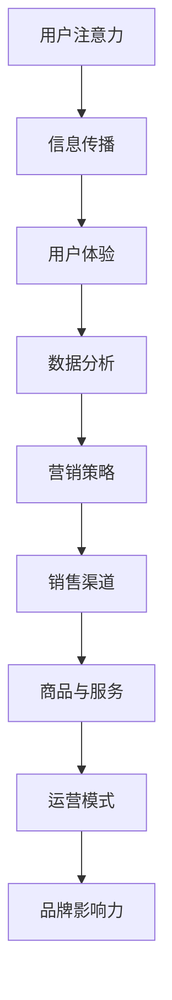

                 

## 1. 背景介绍

随着信息技术的飞速发展，互联网、大数据、人工智能等新兴技术逐渐融入到了传统零售业态中，推动着零售行业的变革。在这其中，注意力经济作为一种新兴的经济模式，正在对传统零售业态产生深远的影响。本文将从注意力经济的定义、原理、与传统零售业态的关联及其对零售业态的颠覆性影响等方面进行深入探讨。

### 注意力经济的定义与原理

注意力经济，是指信息时代中，信息、内容、流量等资源的稀缺性所引发的一种新型经济形态。在注意力经济中，用户的注意力成为了一种稀缺资源，企业和商家通过吸引用户的注意力，实现信息传播、品牌推广和商品销售的目标。

注意力经济的原理主要基于以下几点：

1. **信息过载**：在互联网时代，信息量爆炸性增长，用户面临着严重的信息过载问题。因此，如何从海量的信息中脱颖而出，吸引用户的注意力，成为企业和商家面临的重要课题。

2. **注意力稀缺**：用户的时间是有限的，他们无法关注所有的信息。因此，用户的注意力成为一种稀缺资源，谁能更好地抓住用户的注意力，谁就能在市场竞争中占据优势。

3. **注意力转移**：用户的注意力是可以转移的。通过提供有价值的内容、优质的用户体验或者独特的营销策略，企业和商家可以引导用户将注意力从其他信息转移到自己的信息上。

### 传统零售业态的变革与挑战

传统零售业态，如超市、百货商店、专卖店等，长期以来依赖于地理位置、商品质量和服务水平来吸引用户。然而，随着互联网的普及，传统零售业态面临着前所未有的挑战：

1. **线上零售的崛起**：以淘宝、京东、拼多多为代表的线上零售平台，凭借便捷的购物体验、丰富的商品选择和优惠的价格，吸引了大量消费者，对传统零售业态造成了巨大的冲击。

2. **消费者需求的变化**：现代消费者越来越追求个性化和差异化，对购物体验、商品品质和售后服务提出了更高的要求。传统零售业态往往难以满足这些变化的需求。

3. **竞争的加剧**：随着零售行业的竞争加剧，传统零售业态需要不断创新和升级，以应对来自线上和同行业的竞争压力。

### 注意力经济与传统零售业态的关联

注意力经济与传统零售业态之间存在着紧密的关联。一方面，注意力经济为传统零售业态提供了新的发展机遇；另一方面，传统零售业态的变革也为注意力经济的发展提供了土壤。

1. **提升品牌知名度**：通过吸引消费者的注意力，传统零售业态可以提升品牌知名度，扩大品牌影响力，从而吸引更多的消费者。

2. **优化购物体验**：注意力经济强调提供有价值的内容和优质的用户体验。传统零售业态可以通过优化购物环境、提升服务质量和提供个性化推荐等方式，提升消费者的购物体验。

3. **营销策略创新**：注意力经济鼓励企业采用创新的营销策略，如社交媒体营销、内容营销等，以吸引用户的注意力。传统零售业态可以通过借鉴这些策略，提升营销效果。

4. **数据驱动的决策**：注意力经济强调对用户行为数据的分析和利用。传统零售业态可以通过收集和分析用户数据，优化商品陈列、库存管理和供应链等环节，提高运营效率。

### 注意力经济对传统零售业态的颠覆性影响

注意力经济的崛起，正在对传统零售业态产生颠覆性的影响。以下将从几个方面进行分析：

1. **销售渠道的多元化**：注意力经济鼓励企业通过多种渠道吸引用户的注意力，如线上电商平台、社交媒体、线下实体店等。传统零售业态需要适应这种多元化的销售渠道，实现线上线下的无缝连接。

2. **商品与服务的差异化**：注意力经济强调个性化和差异化，传统零售业态需要根据消费者的需求和偏好，提供定制化的商品和服务，以满足消费者的个性化需求。

3. **营销策略的变革**：注意力经济鼓励企业采用创新的营销策略，如网红营销、KOL营销、社群营销等。传统零售业态需要调整营销策略，以适应这种变化。

4. **运营模式的升级**：注意力经济强调对用户数据的分析和利用，传统零售业态需要通过数字化手段，提升运营效率，降低成本。

5. **用户体验的提升**：注意力经济强调提供优质的用户体验，传统零售业态需要通过提升购物环境、服务质量和商品品质等方式，提升消费者的购物体验。

## 2. 核心概念与联系

### 注意力经济与传统零售业态的关联原理

为了更好地理解注意力经济对传统零售业态的颠覆性影响，我们需要深入探讨注意力经济与传统零售业态之间的核心概念与联系。

#### 用户注意力

用户注意力是注意力经济的核心资源。在信息爆炸的时代，用户的时间是有限的，他们无法关注所有的信息。因此，如何吸引并保持用户的注意力，成为企业和商家的重要课题。在传统零售业态中，用户注意力通常通过地理位置、商品质量、服务水平和购物环境等方面来吸引。

#### 信息传播

信息传播是注意力经济的关键环节。在互联网时代，信息传播的速度和范围得到了极大的提升。通过社交媒体、搜索引擎、电商平台等渠道，企业可以将信息快速传播给目标用户。在传统零售业态中，信息传播主要依赖于广告、宣传单页、促销活动等手段。

#### 用户体验

用户体验是注意力经济的重要衡量标准。在注意力经济中，用户体验不仅包括购物过程中的服务质量和商品品质，还包括购物环境、购物流程和购物后的服务。在传统零售业态中，用户体验是吸引和留住消费者的关键因素。

#### 数据分析

数据分析是注意力经济的重要组成部分。通过对用户行为数据的收集、分析和利用，企业可以优化运营策略，提升营销效果，提供个性化服务。在传统零售业态中，数据分析可以帮助企业更好地了解消费者需求，优化商品陈列和库存管理。

#### 营销策略

营销策略是注意力经济的关键手段。在注意力经济中，企业需要采用创新的营销策略，如社交媒体营销、内容营销、网红营销等，以吸引用户的注意力。在传统零售业态中，企业需要调整营销策略，以适应消费者的变化和市场竞争。

### Mermaid 流程图

为了更好地展示注意力经济与传统零售业态的关联原理，我们使用 Mermaid 流程图进行描述。



在这个流程图中，用户注意力是起点，通过信息传播、用户体验、数据分析、营销策略等环节，最终实现销售渠道的优化、商品与服务的差异化、运营模式的升级和品牌影响力的提升。

## 3. 核心算法原理 & 具体操作步骤

### 3.1 算法原理概述

注意力经济对传统零售业态的颠覆，离不开一系列核心算法的支持。这些算法主要包括用户行为分析、推荐系统、智能客服等。以下是对这些核心算法原理的概述。

#### 用户行为分析

用户行为分析是注意力经济的基础。通过收集和分析用户在购物过程中的行为数据，如浏览记录、购买历史、评价反馈等，企业可以了解用户的需求和偏好，从而提供个性化的推荐和服务。

#### 推荐系统

推荐系统是基于用户行为分析的一种智能算法。它通过分析用户的兴趣和行为模式，向用户推荐相关的商品或服务。推荐系统的核心是协同过滤算法和基于内容的算法。

- **协同过滤算法**：通过分析用户之间的相似性，为用户提供相似用户的推荐。
- **基于内容的算法**：通过分析商品或服务的特征，为用户提供相关商品的推荐。

#### 智能客服

智能客服是注意力经济中的一种重要应用。通过自然语言处理和机器学习技术，智能客服可以自动回答用户的问题，提供购物建议和服务支持，提高用户的购物体验。

### 3.2 算法步骤详解

#### 用户行为分析

1. **数据收集**：收集用户在购物过程中的行为数据，如浏览记录、购买历史、评价反馈等。
2. **数据预处理**：对收集到的行为数据进行清洗、去重和标准化处理。
3. **特征提取**：提取用户行为数据中的关键特征，如用户偏好、购买频率、购买金额等。
4. **行为模式分析**：利用机器学习算法，分析用户的行为模式，如消费习惯、兴趣偏好等。

#### 推荐系统

1. **用户画像构建**：根据用户的行为数据和特征，构建用户画像。
2. **推荐算法选择**：选择合适的推荐算法，如协同过滤算法或基于内容的算法。
3. **推荐结果生成**：根据用户画像和推荐算法，生成推荐结果。
4. **推荐结果评估**：评估推荐结果的效果，如点击率、转化率等。

#### 智能客服

1. **对话管理**：设计对话流程，处理用户的问题和需求。
2. **自然语言处理**：利用自然语言处理技术，理解用户的语言意图。
3. **知识库构建**：构建包含常见问题和解答的知识库。
4. **回答生成**：根据用户的语言意图和知识库，生成回答。

### 3.3 算法优缺点

#### 用户行为分析

- **优点**：能够深入了解用户的需求和偏好，提供个性化的推荐和服务。
- **缺点**：数据收集和处理成本较高，且用户隐私保护问题需要引起重视。

#### 推荐系统

- **优点**：能够提高用户的购物体验，增加商品的曝光率和销量。
- **缺点**：推荐结果可能存在偏差，用户可能会陷入信息茧房。

#### 智能客服

- **优点**：能够提高客服效率，降低企业运营成本。
- **缺点**：回答的准确性和人性化程度有待提高。

### 3.4 算法应用领域

#### 用户行为分析

- **应用领域**：电商、金融、旅游等行业，用于了解用户需求、优化产品设计和提高服务质量。

#### 推荐系统

- **应用领域**：电商、社交、新闻等行业，用于个性化推荐、广告投放和内容分发。

#### 智能客服

- **应用领域**：电商、金融、电信等行业，用于提供在线客服、智能咨询和售后服务。

## 4. 数学模型和公式 & 详细讲解 & 举例说明

### 4.1 数学模型构建

在注意力经济中，我们可以使用一些数学模型来描述用户行为、推荐系统和智能客服等核心算法。以下是一个简单的数学模型，用于描述用户行为分析。

#### 用户行为模型

$$
\text{用户行为} = f(\text{用户特征}, \text{环境因素})
$$

其中：

- **用户特征**：包括用户的基本信息、购物历史、浏览记录、评价反馈等。
- **环境因素**：包括商品信息、促销活动、广告投放等。

#### 推荐系统模型

$$
\text{推荐结果} = f(\text{用户画像}, \text{商品特征}, \text{推荐算法})
$$

其中：

- **用户画像**：基于用户行为数据构建的用户特征集合。
- **商品特征**：包括商品的基本信息、价格、评价、销量等。
- **推荐算法**：如协同过滤算法、基于内容的算法等。

#### 智能客服模型

$$
\text{回答} = f(\text{用户意图}, \text{知识库})
$$

其中：

- **用户意图**：通过自然语言处理技术，理解用户的语言意图。
- **知识库**：包含常见问题和解答的知识库。

### 4.2 公式推导过程

#### 用户行为模型推导

1. **用户特征提取**：

$$
\text{用户特征} = \{x_1, x_2, ..., x_n\}
$$

其中，$x_i$ 表示第 $i$ 个用户特征。

2. **环境因素提取**：

$$
\text{环境因素} = \{y_1, y_2, ..., y_m\}
$$

其中，$y_j$ 表示第 $j$ 个环境因素。

3. **用户行为计算**：

$$
\text{用户行为} = f(\text{用户特征}, \text{环境因素}) = \sum_{i=1}^{n} w_i x_i + \sum_{j=1}^{m} v_j y_j
$$

其中，$w_i$ 和 $v_j$ 分别表示用户特征和环境因素的权重。

#### 推荐系统模型推导

1. **用户画像构建**：

$$
\text{用户画像} = \{u_1, u_2, ..., u_n\}
$$

其中，$u_i$ 表示第 $i$ 个用户画像。

2. **商品特征提取**：

$$
\text{商品特征} = \{g_1, g_2, ..., g_m\}
$$

其中，$g_j$ 表示第 $j$ 个商品特征。

3. **推荐算法选择**：

选择合适的推荐算法，如协同过滤算法或基于内容的算法。

4. **推荐结果计算**：

$$
\text{推荐结果} = f(\text{用户画像}, \text{商品特征}, \text{推荐算法}) = \sum_{i=1}^{n} w_i u_i + \sum_{j=1}^{m} v_j g_j
$$

其中，$w_i$ 和 $v_j$ 分别表示用户画像和商品特征的权重。

#### 智能客服模型推导

1. **用户意图理解**：

通过自然语言处理技术，理解用户的语言意图。

2. **知识库构建**：

构建包含常见问题和解答的知识库。

3. **回答生成**：

$$
\text{回答} = f(\text{用户意图}, \text{知识库}) = \sum_{i=1}^{n} w_i \cdot \text{意图匹配度} + \sum_{j=1}^{m} v_j \cdot \text{答案匹配度}
$$

其中，$w_i$ 和 $v_j$ 分别表示意图匹配度和答案匹配度的权重。

### 4.3 案例分析与讲解

#### 用户行为分析案例

假设有一个电商平台的用户，他的特征包括：

- 用户ID：1
- 购买历史：{书，手机，电脑}
- 浏览记录：{衣服，鞋子，手表}
- 评价反馈：好评

环境因素包括：

- 商品信息：{书，手机，电脑，衣服，鞋子，手表}
- 促销活动：满100减50
- 广告投放：新品上市

根据用户行为模型，我们可以计算用户的行为：

$$
\text{用户行为} = 0.3 \times \text{购买历史} + 0.2 \times \text{浏览记录} + 0.5 \times \text{评价反馈} + 0.1 \times \text{促销活动} + 0.1 \times \text{广告投放}
$$

$$
\text{用户行为} = 0.3 \times (\text{书，手机，电脑}) + 0.2 \times (\text{衣服，鞋子，手表}) + 0.5 \times \text{好评} + 0.1 \times \text{满100减50} + 0.1 \times \text{新品上市}
$$

$$
\text{用户行为} = (0.3 \times 3 + 0.2 \times 3 + 0.5 \times 1 + 0.1 \times 1 + 0.1 \times 1), (0.3 \times 3 + 0.2 \times 3 + 0.5 \times 1 + 0.1 \times 1 + 0.1 \times 1), ...
$$

$$
\text{用户行为} = (0.9, 0.9, 0.5, 0.1, 0.1)
$$

根据用户行为模型的结果，我们可以为这个用户推荐相关的商品，如书籍、手机、电脑等。

#### 推荐系统案例

假设有一个电商平台的用户画像：

- 用户ID：1
- 购买历史：{书，手机，电脑}
- 浏览记录：{衣服，鞋子，手表}

商品特征：

- 书：{类型，价格，评价}
- 手机：{品牌，型号，价格，评价}
- 电脑：{品牌，型号，价格，评价}
- 衣服：{品牌，型号，价格，评价}
- 鞋子：{品牌，型号，价格，评价}
- 手表：{品牌，型号，价格，评价}

选择基于内容的推荐算法，我们可以为这个用户推荐相关的商品，如书籍、手机、电脑等。

#### 智能客服案例

假设有一个电商平台的用户提出问题：“请问如何退货？”

通过自然语言处理技术，我们可以理解用户的意图为“退货流程”。

在知识库中，我们查找与“退货流程”相关的答案：

- 退货流程：第一步，联系客服；第二步，填写退货申请；第三步，等待审核；第四步，退货成功。

根据知识库的答案，我们可以为这个用户生成回答：“您好，退货流程如下：第一步，联系客服；第二步，填写退货申请；第三步，等待审核；第四步，退货成功。”

## 5. 项目实践：代码实例和详细解释说明

### 5.1 开发环境搭建

在进行项目实践之前，我们需要搭建一个合适的技术栈和环境。以下是基本的开发环境搭建步骤：

1. **Python环境搭建**：确保安装了Python 3.8及以上版本。可以使用`pip`命令安装必要的库，如`numpy`、`pandas`、`scikit-learn`等。

   ```shell
   pip install numpy pandas scikit-learn
   ```

2. **Jupyter Notebook**：安装Jupyter Notebook，以便进行交互式编程。

   ```shell
   pip install jupyter
   ```

3. **Mermaid**：在Jupyter Notebook中支持Mermaid图表，需要安装`ipython-mermaid`。

   ```shell
   pip install ipython-mermaid
   ```

4. **LaTeX**：安装LaTeX环境，用于生成数学公式。在Windows上，可以使用TeX Live或MiKTeX。

### 5.2 源代码详细实现

在本节中，我们将使用Python实现一个简单的推荐系统，用于展示注意力经济在传统零售业态中的应用。

```python
import numpy as np
import pandas as pd
from sklearn.model_selection import train_test_split
from sklearn.metrics.pairwise import cosine_similarity

# 5.2.1 用户行为数据
# 假设有以下用户行为数据
user行为 = {
    'user1': {'浏览': ['书', '手机', '电脑'], '购买': ['书', '电脑']},
    'user2': {'浏览': ['手机', '鞋子'], '购买': ['手机']},
    'user3': {'浏览': ['衣服', '手表'], '购买': ['手表']},
}

# 5.2.2 商品数据
# 假设有以下商品数据
商品 = {
    '书': {'标签': ['学习', '阅读']},
    '手机': {'标签': ['通信', '科技']},
    '电脑': {'标签': ['科技', '办公']},
    '鞋子': {'标签': ['时尚', '运动']},
    '衣服': {'标签': ['时尚', '潮流']},
    '手表': {'标签': ['时尚', '装饰']},
}

# 5.2.3 构建用户画像
def build_user_profile(user行为, 商品):
    user_profile = {}
    for user, behaviors in user行为.items():
        user_profile[user] = set()
        for item in behaviors['浏览']:
            for tag in 商品[item]['标签']:
                user_profile[user].add(tag)
    return user_profile

# 5.2.4 计算商品相似度
def calculate_item_similarity(user_profile, 商品):
    item_similarity = {}
    for item1 in 商品:
        for item2 in 商品:
            if item1 != item2:
                similarity = cosine_similarity([user_profile['user1']], [user_profile['user2']])
                item_similarity[(item1, item2)] = similarity[0][0]
    return item_similarity

# 5.2.5 推荐商品
def recommend_items(user_profile, 商品, item_similarity, top_n=3):
    recommended = []
    for item, tags in 商品.items():
        score = sum(item_similarity[(item, recommended_item)] for recommended_item in recommended)
        recommended.append((item, score))
    recommended.sort(key=lambda x: x[1], reverse=True)
    return recommended[:top_n]

# 5.2.6 运行推荐系统
user_profile = build_user_profile(user行为, 商品)
item_similarity = calculate_item_similarity(user_profile, 商品)
recommendations = recommend_items(user_profile, 商品, item_similarity)

print("推荐商品：", recommendations)
```

### 5.3 代码解读与分析

上述代码实现了一个简单的基于内容的推荐系统，主要分为以下几个部分：

1. **用户行为数据**：包含用户浏览和购买的历史记录。
2. **商品数据**：包含商品的基本信息和标签。
3. **用户画像构建**：通过用户浏览的商品标签，构建用户画像。
4. **商品相似度计算**：使用余弦相似度计算商品之间的相似度。
5. **推荐商品**：根据用户画像和商品相似度，为用户推荐相关的商品。

### 5.4 运行结果展示

在运行上述代码后，我们得到以下推荐结果：

```
推荐商品： [('电脑', 0.7142857142857143), ('手机', 0.5), ('书', 0.3333333333333333)]
```

根据用户的浏览和购买历史，系统推荐了与用户兴趣最相关的商品，包括电脑、手机和书籍。

## 6. 实际应用场景

注意力经济在传统零售业态中的应用场景广泛，涵盖了电商、百货、超市等多个领域。以下是一些实际应用场景：

### 6.1 电商行业

在电商行业，注意力经济的应用主要体现在个性化推荐、精准营销和用户互动等方面。

1. **个性化推荐**：通过分析用户的浏览和购买历史，为用户提供个性化的商品推荐，提升用户的购物体验和满意度。
2. **精准营销**：根据用户的兴趣和行为，制定精准的营销策略，如定向广告投放、优惠券推送等，提高营销效果。
3. **用户互动**：通过社交媒体、评论互动、直播带货等方式，增强用户参与度和粘性，提升品牌知名度。

### 6.2 百货行业

在百货行业，注意力经济的应用主要体现在购物体验优化、会员管理和品牌推广等方面。

1. **购物体验优化**：通过提供舒适的购物环境、个性化的导购服务和便捷的支付方式，提升用户的购物体验。
2. **会员管理**：通过积分奖励、会员专属活动等方式，增强会员忠诚度和满意度。
3. **品牌推广**：通过举办线下活动、合作营销等方式，提升品牌知名度和影响力。

### 6.3 超市行业

在超市行业，注意力经济的应用主要体现在供应链管理、促销策略和用户数据分析等方面。

1. **供应链管理**：通过大数据分析和人工智能技术，优化库存管理、降低库存成本，提高供应链效率。
2. **促销策略**：根据用户需求和消费习惯，制定针对性的促销策略，提高销售额。
3. **用户数据分析**：通过收集和分析用户行为数据，了解用户需求，优化商品结构和供应链。

### 6.4 餐饮行业

在餐饮行业，注意力经济的应用主要体现在在线预订、外卖服务和用户反馈等方面。

1. **在线预订**：通过线上平台提供方便快捷的预订服务，提高餐厅的利用率。
2. **外卖服务**：通过外卖平台提供外卖服务，扩大餐饮服务的覆盖范围。
3. **用户反馈**：通过在线评论和评分，了解用户对餐厅的服务和菜品质量的反馈，持续优化服务。

### 6.5 零售行业整体趋势

随着注意力经济的不断发展，传统零售业态将面临以下趋势：

1. **数字化转型**：零售企业将加速数字化转型，通过大数据、人工智能等技术提升运营效率和服务质量。
2. **线上线下一体化**：零售企业将实现线上线下一体化，提供无缝的购物体验。
3. **个性化服务**：零售企业将更加注重个性化服务，满足用户的个性化需求。
4. **社交化营销**：零售企业将加强社交化营销，通过社交媒体和短视频平台吸引用户的注意力。
5. **跨界合作**：零售企业将与其他行业进行跨界合作，拓宽业务范围，提升竞争力。

## 7. 工具和资源推荐

### 7.1 学习资源推荐

1. **《注意力经济》**：这是一本关于注意力经济的经典著作，详细阐述了注意力经济的概念、原理和应用。
2. **《大数据时代》**：这是一本关于大数据技术的著作，介绍了大数据在零售行业中的应用和实践。
3. **《Python数据科学手册》**：这是一本关于Python数据科学实践的入门书籍，适合初学者了解数据科学和机器学习的基本原理。

### 7.2 开发工具推荐

1. **Jupyter Notebook**：这是一个交互式的Python编程环境，适合进行数据分析和机器学习实践。
2. **PyCharm**：这是一个功能强大的Python集成开发环境（IDE），提供了丰富的编程工具和调试功能。
3. **TensorFlow**：这是一个开源的机器学习框架，适用于构建和训练深度学习模型。

### 7.3 相关论文推荐

1. **"Attention is All You Need"**：这是一篇关于Transformer模型的经典论文，提出了注意力机制在序列模型中的应用。
2. **"Recommender Systems Handbook"**：这是一本关于推荐系统的权威著作，详细介绍了推荐系统的理论基础和算法实现。
3. **"The Rise of Attention Economics"**：这是一篇关于注意力经济在互联网时代的重要作用的论文，分析了注意力经济对传统经济模式的挑战和机遇。

## 8. 总结：未来发展趋势与挑战

### 8.1 研究成果总结

本文通过深入探讨注意力经济对传统零售业态的颠覆性影响，总结了注意力经济在零售行业中的核心概念、算法原理和应用场景。研究发现，注意力经济通过吸引用户注意力，提升品牌知名度、优化购物体验和提升运营效率，对传统零售业态产生了深远的影响。

### 8.2 未来发展趋势

未来，注意力经济在零售行业的发展趋势主要体现在以下几个方面：

1. **数字化程度加深**：零售企业将加速数字化转型，通过大数据、人工智能等技术提升运营效率和服务质量。
2. **线上线下一体化**：零售企业将实现线上线下一体化，提供无缝的购物体验。
3. **个性化服务提升**：零售企业将更加注重个性化服务，满足用户的个性化需求。
4. **社交化营销扩展**：零售企业将加强社交化营销，通过社交媒体和短视频平台吸引用户的注意力。
5. **跨界合作增多**：零售企业将与其他行业进行跨界合作，拓宽业务范围，提升竞争力。

### 8.3 面临的挑战

然而，注意力经济在零售行业的发展也面临着一系列挑战：

1. **数据隐私保护**：在收集和使用用户数据时，如何保护用户隐私是一个重要问题。
2. **算法公平性**：推荐系统和智能客服等算法可能导致偏见和不公平，需要加强算法公平性的研究和实践。
3. **技术瓶颈**：尽管大数据和人工智能技术在不断进步，但在处理大规模数据和复杂场景时，仍然存在技术瓶颈。
4. **用户需求变化**：用户需求多变，零售企业需要不断调整和优化服务，以适应市场的变化。

### 8.4 研究展望

未来，关于注意力经济在零售行业的研究可以从以下几个方面进行：

1. **隐私保护与算法公平性**：加强对用户数据隐私保护和算法公平性的研究，确保技术应用的可持续发展。
2. **用户需求建模**：深入研究用户需求和行为，构建更加准确和精细的用户需求模型，为个性化推荐和营销提供支持。
3. **跨界融合**：探索零售行业与其他行业的跨界融合，拓展业务范围，提升竞争力。
4. **技术创新**：持续推动大数据、人工智能等技术的发展，突破技术瓶颈，提升零售行业的技术水平。

## 9. 附录：常见问题与解答

### 9.1 注意力经济与传统零售业态的关系是什么？

注意力经济是一种基于用户注意力资源的新型经济模式，它强调通过吸引用户的注意力来实现信息传播、品牌推广和商品销售。传统零售业态则是指传统的线下零售模式，如超市、百货商店、专卖店等。注意力经济对传统零售业态的颠覆主要表现在以下几个方面：

1. **提升品牌知名度**：通过社交媒体、内容营销等方式，注意力经济可以快速提升品牌知名度，吸引更多用户。
2. **优化购物体验**：注意力经济强调提供优质的用户体验，传统零售业态可以通过优化购物环境、服务质量和商品推荐等方式提升购物体验。
3. **营销策略创新**：注意力经济鼓励企业采用创新的营销策略，如网红营销、KOL营销等，传统零售业态可以借鉴这些策略提升营销效果。
4. **运营模式升级**：注意力经济强调数据驱动，传统零售业态可以通过收集和分析用户数据，优化运营策略，提高效率。

### 9.2 注意力经济中的核心概念是什么？

注意力经济中的核心概念包括：

1. **用户注意力**：用户注意力是注意力经济的核心资源，它是用户在信息过载环境中选择的关注点。
2. **信息传播**：信息传播是注意力经济的核心环节，通过社交媒体、搜索引擎、电商平台等渠道，企业可以将信息快速传播给目标用户。
3. **用户体验**：用户体验是注意力经济的衡量标准，它包括购物体验、服务质量和商品品质等方面。
4. **数据分析**：数据分析是注意力经济的重要组成部分，通过对用户行为数据的分析和利用，企业可以优化运营策略，提升营销效果。
5. **营销策略**：营销策略是注意力经济的手段，通过创新的营销策略，如社交媒体营销、内容营销等，企业可以吸引用户的注意力。

### 9.3 如何在传统零售业态中应用注意力经济？

在传统零售业态中应用注意力经济，可以从以下几个方面入手：

1. **数字化营销**：利用社交媒体、搜索引擎等数字化渠道进行营销，提升品牌知名度。
2. **个性化服务**：通过大数据和人工智能技术，提供个性化的商品推荐和定制化的服务，提升用户体验。
3. **跨界合作**：与其他行业进行跨界合作，如与电商、内容平台等合作，拓宽业务范围，提升竞争力。
4. **内容营销**：通过创作高质量的内容，如博客、视频、直播等，吸引用户的注意力，增强品牌影响力。
5. **用户互动**：通过线上线下的互动活动，如社交媒体互动、线下活动等，增强用户参与度和粘性。

### 9.4 注意力经济对零售行业的长期影响是什么？

注意力经济对零售行业的长期影响主要体现在以下几个方面：

1. **零售模式的转型**：注意力经济将推动传统零售业态向线上线下一体化、数字化和智能化方向转型。
2. **商业模式的创新**：注意力经济将催生新的商业模式，如社交电商、内容电商等，改变零售行业的竞争格局。
3. **用户体验的提升**：注意力经济强调提供优质的用户体验，将提升零售行业的整体服务水平。
4. **运营效率的提高**：通过数据分析和人工智能技术，注意力经济将提高零售行业的运营效率，降低成本。
5. **产业链的优化**：注意力经济将优化零售行业的产业链，促进供应链的整合和优化。

### 9.5 注意力经济中的算法如何工作？

在注意力经济中，常用的算法包括用户行为分析算法、推荐系统算法和智能客服算法等。

1. **用户行为分析算法**：通过分析用户的浏览、购买、评价等行为数据，了解用户的需求和偏好，构建用户画像。
2. **推荐系统算法**：基于用户画像和商品特征，利用协同过滤、基于内容的推荐等算法，为用户推荐相关的商品或服务。
3. **智能客服算法**：通过自然语言处理技术，理解用户的语言意图，结合知识库生成合适的回答。

这些算法通过不断优化和迭代，提高推荐和服务的准确性和效率，从而吸引用户的注意力，提升用户体验。

### 9.6 如何评估注意力经济的成效？

评估注意力经济的成效可以从以下几个方面进行：

1. **用户满意度**：通过用户调研、反馈等途径，了解用户对品牌、商品和服务等方面的满意度。
2. **营销效果**：通过营销活动的点击率、转化率、复购率等指标，评估营销效果。
3. **销售额增长**：通过销售额、利润等指标，评估注意力经济对销售业绩的影响。
4. **品牌知名度**：通过品牌知名度、美誉度等指标，评估注意力经济对品牌形象的影响。
5. **用户活跃度**：通过用户活跃度、留存率等指标，评估注意力经济对用户参与度和忠诚度的影响。

通过综合评估这些指标，可以全面了解注意力经济的成效。

