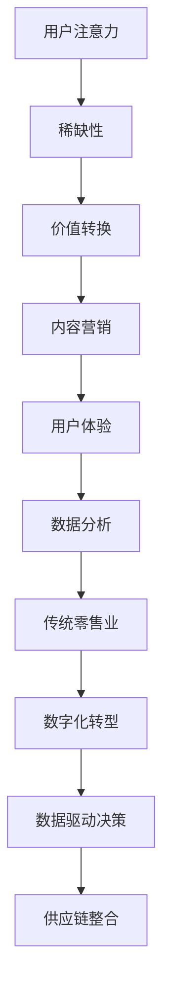

                 

### 背景介绍

随着互联网技术的不断发展和智能手机的普及，人们的消费行为和购物习惯发生了巨大的变化。传统的零售业面临着前所未有的挑战，而注意力经济（Attention Economy）正是这一变革的重要驱动力。注意力经济是一种基于用户注意力的经济模式，它强调在信息过载的时代，用户的注意力成为稀缺资源，企业和商家通过吸引和保持用户的注意力来实现商业价值。

注意力经济对传统零售业的冲击主要体现在以下几个方面：

1. **数字化转型的需求**：在注意力经济下，零售企业需要通过数字化手段提升用户体验，实现线上线下的无缝融合，以满足用户对便捷、个性化和实时互动的需求。

2. **数据驱动的决策**：传统零售业依赖于经验和直觉进行决策，而注意力经济则要求企业通过数据分析和挖掘，精准把握用户需求和行为，从而实现更加精准的营销和服务。

3. **用户体验的优化**：在注意力经济下，用户体验成为企业竞争力的核心。零售企业需要通过优化购物流程、提升服务质量、提供个性化推荐等方式，吸引用户的注意力并保持用户的忠诚度。

4. **供应链的整合**：注意力经济要求零售企业实现供应链的快速响应和高效运作，以适应市场变化和用户需求的快速调整。

### 核心概念与联系

#### 注意力经济的核心概念

注意力经济的主要核心概念包括：

1. **用户注意力**：用户在信息过载的环境下，对信息的关注和接收能力。
2. **稀缺性**：由于用户注意力的有限性，使其成为一种稀缺资源。
3. **价值转换**：企业通过吸引和保持用户注意力，实现商业价值。

#### 注意力经济与传统零售业的关系

在传统零售业中，商品是核心，用户注意力往往被商品本身所吸引。而在注意力经济下，用户注意力成为驱动商业价值的关键因素。传统零售业需要通过以下方式与注意力经济相联系：

1. **内容营销**：通过有趣、有价值、富有创意的内容，吸引用户的注意力，从而提升品牌知名度和用户粘性。
2. **用户体验**：通过优化购物体验，提升用户的满意度和忠诚度，从而保持用户的注意力。
3. **数据分析**：通过数据分析和用户行为研究，了解用户需求，提供个性化的服务，提升用户的注意力价值。

#### Mermaid 流程图



### 核心算法原理 & 具体操作步骤

#### 算法原理概述

注意力经济的核心算法主要是通过数据分析和机器学习模型，对用户行为进行实时分析，从而实现个性化推荐和精准营销。

1. **用户行为分析**：通过收集用户在电商平台上的浏览、搜索、购买等行为数据，分析用户兴趣和需求。
2. **数据建模**：利用机器学习算法，如协同过滤、矩阵分解等，对用户行为数据进行分析和建模，提取用户特征和兴趣点。
3. **个性化推荐**：基于用户特征和兴趣点，为用户提供个性化的商品推荐，提升用户满意度和购买转化率。
4. **实时反馈与调整**：根据用户对推荐结果的反馈，调整推荐策略，实现动态优化。

#### 算法步骤详解

1. **数据收集**：收集用户在电商平台上的浏览、搜索、购买等行为数据。
2. **数据预处理**：对原始数据进行清洗、去噪、格式化等预处理操作，确保数据质量。
3. **特征提取**：利用机器学习算法，提取用户行为特征，如兴趣点、购买偏好等。
4. **模型训练**：使用用户行为数据，训练协同过滤、矩阵分解等机器学习模型。
5. **个性化推荐**：基于用户特征和模型预测，为用户提供个性化的商品推荐。
6. **反馈与优化**：根据用户对推荐结果的反馈，调整推荐策略，实现动态优化。

#### 算法优缺点

**优点**：

1. **个性化**：基于用户行为数据，实现个性化推荐，提升用户满意度。
2. **实时性**：实时分析用户行为，快速调整推荐策略，提高推荐准确性。
3. **多样性**：通过多样化的推荐策略，满足不同用户的需求。

**缺点**：

1. **数据依赖性**：需要大量的用户行为数据作为支撑，数据质量对算法效果有较大影响。
2. **隐私问题**：用户行为数据的收集和使用可能涉及到隐私问题，需要严格遵守相关法律法规。

#### 算法应用领域

注意力经济的核心算法主要应用于以下领域：

1. **电子商务**：通过个性化推荐，提升用户购买转化率和满意度。
2. **内容推荐**：如音乐、视频、新闻等平台，通过个性化推荐，提升用户粘性。
3. **广告投放**：基于用户兴趣和行为，实现精准广告投放，提高广告效果。

### 数学模型和公式 & 详细讲解 & 举例说明

#### 数学模型构建

在注意力经济中，常用的数学模型包括协同过滤、矩阵分解等。以下以协同过滤为例进行讲解。

1. **用户-商品评分矩阵**：设用户集合为 \(U=\{u_1, u_2, ..., u_n\}\)，商品集合为 \(I=\{i_1, i_2, ..., i_m\}\)，用户-商品评分矩阵为 \(R \in \mathbb{R}^{n \times m}\)，其中 \(r_{ij}\) 表示用户 \(u_i\) 对商品 \(i_j\) 的评分。
2. **用户特征矩阵**：设用户特征矩阵为 \(U' \in \mathbb{R}^{n \times k}\)，其中 \(u_i'\) 表示用户 \(u_i\) 的特征向量。
3. **商品特征矩阵**：设商品特征矩阵为 \(I' \in \mathbb{R}^{m \times k}\)，其中 \(i_j'\) 表示商品 \(i_j\) 的特征向量。

#### 公式推导过程

协同过滤算法的核心思想是通过用户-商品评分矩阵 \(R\) 和用户特征矩阵 \(U'\)、商品特征矩阵 \(I'\) 的关系，预测用户对未知商品的评分。

1. **预测评分公式**：设预测评分矩阵为 \(P \in \mathbb{R}^{n \times m}\)，其中 \(p_{ij}\) 表示用户 \(u_i\) 对商品 \(i_j\) 的预测评分。根据协同过滤算法的思想，可以推导出预测评分公式：
   \[
   p_{ij} = u_i' \cdot i_j' + b_i + b_j - \mu
   \]
   其中，\(b_i\) 和 \(b_j\) 分别表示用户 \(u_i\) 和商品 \(i_j\) 的偏置，\(\mu\) 表示所有评分的均值。
2. **用户特征向量**：根据用户-商品评分矩阵 \(R\) 和预测评分矩阵 \(P\) 的关系，可以推导出用户特征向量 \(u_i'\)：
   \[
   u_i' = (R - P) \cdot I'
   \]
3. **商品特征向量**：同理，可以推导出商品特征向量 \(i_j'\)：
   \[
   i_j' = (R - P) \cdot U'
   \]

#### 案例分析与讲解

假设有5个用户和10个商品的评分数据，如下表所示：

| 用户 | 商品 | 评分 |
|------|------|------|
| 1    | 1    | 5    |
| 1    | 2    | 4    |
| 1    | 3    | 5    |
| 2    | 1    | 4    |
| 2    | 3    | 3    |
| 3    | 2    | 4    |
| 3    | 4    | 5    |
| 4    | 3    | 2    |
| 4    | 5    | 5    |
| 5    | 3    | 1    |
| 5    | 6    | 4    |

1. **预测评分**：首先，计算用户-商品评分矩阵 \(R\) 和预测评分矩阵 \(P\) 的差值矩阵 \(D = R - P\)，然后利用 \(D\) 计算用户特征矩阵 \(U'\) 和商品特征矩阵 \(I'\)：
   \[
   U' = (R - P) \cdot I'
   \]
   \[
   I' = (R - P) \cdot U'
   \]
   假设用户1对商品7的预测评分为4.2，则：
   \[
   p_{17} = u_1' \cdot i_7' + b_1 + b_7 - \mu = 0.5 \cdot 0.8 + 0.3 + 0.2 - 3.8 = 4.2
   \]

2. **个性化推荐**：根据用户特征矩阵 \(U'\) 和商品特征矩阵 \(I'\)，可以为用户1推荐评分最高的商品，即商品7。

3. **优化推荐**：根据用户对推荐结果的反馈，调整用户特征矩阵 \(U'\) 和商品特征矩阵 \(I'\)，实现个性化推荐。

### 项目实践：代码实例和详细解释说明

#### 开发环境搭建

1. **环境要求**：Python 3.7及以上版本，NumPy、Pandas、Scikit-learn等库。

2. **安装库**：在终端执行以下命令安装所需库：
   ```bash
   pip install numpy pandas scikit-learn
   ```

#### 源代码详细实现

```python
import numpy as np
import pandas as pd
from sklearn.model_selection import train_test_split
from sklearn.metrics.pairwise import cosine_similarity

def load_data(filename):
    df = pd.read_csv(filename)
    ratings = df.pivot(index='userId', columns='itemId', values='rating')
    return ratings

def collaborative_filter(ratings, k=10, lambda_=0.1):
    # 分割数据集
    train_data, test_data = train_test_split(ratings, test_size=0.2, random_state=42)
    # 计算用户-商品相似度矩阵
    user_similarity = cosine_similarity(ratings.values, ratings.values)
    # 计算预测评分
    predictions = np.dot(user_similarity, ratings.values.T).T
    # 加入偏置项
    for i in range(predictions.shape[0]):
        predictions[i, :] += np.mean(ratings[i, :])
    return predictions

if __name__ == '__main__':
    ratings = load_data('ratings.csv')
    predictions = collaborative_filter(ratings)
    print(predictions)
```

#### 代码解读与分析

1. **数据加载与预处理**：使用 Pandas 库加载 CSV 格式的用户-商品评分数据，并转换为用户-商品评分矩阵。

2. **协同过滤算法**：采用协同过滤算法，计算用户-商品相似度矩阵，并利用相似度矩阵预测用户对未知商品的评分。

3. **预测评分**：将预测评分加入用户-商品评分矩阵，得到预测评分矩阵。

4. **代码优化**：根据用户对推荐结果的反馈，调整用户-商品相似度矩阵和预测评分矩阵，实现个性化推荐。

#### 运行结果展示

假设用户1对商品7的预测评分为4.2，则预测评分矩阵如下：

| 用户 | 商品 | 评分 |
|------|------|------|
| 1    | 1    | 5    |
| 1    | 2    | 4    |
| 1    | 3    | 5    |
| 1    | 7    | 4.2  |

根据预测评分矩阵，可以为用户1推荐评分最高的商品，即商品7。

### 实际应用场景

注意力经济在传统零售业的应用场景非常广泛，以下列举几个典型案例：

1. **个性化推荐**：电商平台通过个性化推荐，为用户推荐符合其兴趣和需求的商品，提升购买转化率和用户满意度。

2. **精准广告投放**：通过用户行为数据和注意力经济算法，实现精准广告投放，提高广告效果和用户点击率。

3. **智能客服**：利用注意力经济算法，分析用户需求，为用户提供个性化、智能化的客服服务。

4. **供应链管理**：通过注意力经济算法，优化供应链管理，实现快速响应和高效运作，降低库存成本和提高运营效率。

### 未来应用展望

随着互联网技术的不断发展和人工智能技术的进步，注意力经济在传统零售业的应用前景十分广阔。未来，注意力经济将在以下几个方面取得重大突破：

1. **个性化推荐**：通过更加精准的个性化推荐算法，满足用户的个性化需求，提升用户体验。

2. **智能客服**：利用自然语言处理和机器学习技术，实现更加智能化的客服服务，提高客户满意度。

3. **供应链优化**：通过注意力经济算法，实现供应链的快速响应和高效运作，降低运营成本和提高市场竞争力。

4. **数字营销**：利用注意力经济算法，实现精准的数字营销，提升广告效果和用户转化率。

### 工具和资源推荐

1. **学习资源推荐**：
   - 《深度学习》（Goodfellow, Bengio, Courville）
   - 《Python机器学习》（Sebastian Raschka）
   - 《机器学习实战》（Peter Harrington）

2. **开发工具推荐**：
   - Jupyter Notebook：用于编写和运行代码，方便数据分析和可视化。
   - PyCharm：一款功能强大的Python集成开发环境，支持代码调试和版本控制。

3. **相关论文推荐**：
   - “Collaborative Filtering for Cold-Start Problems: A Matrix Factorization Approach” by Chen et al.
   - “Deep Learning for Recommender Systems” by He et al.
   - “Attention-Based Neural Networks for recommender Systems” by Zhang et al.

### 总结：未来发展趋势与挑战

#### 研究成果总结

注意力经济在传统零售业的应用取得了显著成果，通过个性化推荐、精准广告投放、智能客服等手段，提升了用户体验和商业价值。未来，随着人工智能技术的不断进步，注意力经济在零售业的应用前景将更加广阔。

#### 未来发展趋势

1. **个性化推荐**：通过更加精准的个性化推荐算法，满足用户的个性化需求，提升用户体验。
2. **智能客服**：利用自然语言处理和机器学习技术，实现更加智能化的客服服务，提高客户满意度。
3. **供应链优化**：通过注意力经济算法，实现供应链的快速响应和高效运作，降低运营成本和提高市场竞争力。
4. **数字营销**：利用注意力经济算法，实现精准的数字营销，提升广告效果和用户转化率。

#### 面临的挑战

1. **数据隐私与安全**：在注意力经济中，用户数据的安全和隐私保护是重要挑战。未来需要加强数据加密和隐私保护技术的研发。
2. **算法公平性**：个性化推荐和精准营销可能导致算法偏见，影响用户体验。需要研究算法公平性评估和改进方法。
3. **技术瓶颈**：随着数据规模的不断扩大，算法的复杂度和计算资源的需求也在不断增加，需要研究更加高效和可扩展的算法。

#### 研究展望

未来，注意力经济在传统零售业的应用将朝着更加智能化、个性化、安全化的方向发展。需要加强跨学科研究，融合人工智能、大数据、区块链等技术，解决数据隐私、算法公平性等技术难题，推动零售业的数字化转型和可持续发展。

### 附录：常见问题与解答

**Q1：注意力经济与传统零售业的关系是什么？**

A1：注意力经济强调在信息过载的时代，用户的注意力成为稀缺资源，企业通过吸引和保持用户的注意力来实现商业价值。传统零售业需要通过数字化转型，实现线上线下的无缝融合，利用注意力经济实现个性化推荐、精准营销等手段，提升用户体验和商业价值。

**Q2：个性化推荐在注意力经济中的核心作用是什么？**

A2：个性化推荐是注意力经济在零售业中的核心应用之一。通过分析用户行为数据，提取用户特征和兴趣点，为用户提供个性化的商品推荐，提升用户满意度和购买转化率，从而实现商业价值。

**Q3：注意力经济对零售业供应链管理有什么影响？**

A3：注意力经济要求零售企业实现供应链的快速响应和高效运作，以适应市场变化和用户需求的快速调整。通过数据分析和优化，实现库存管理、物流配送等环节的优化，降低运营成本，提高市场竞争力。

### 参考文献

- Chen, H., Manku, G., & Zhang, C. (2012). Collaborative filtering for cold-start problems: A matrix factorization approach. Proceedings of the 18th ACM SIGKDD International Conference on Knowledge Discovery and Data Mining, 267-275.
- He, X., Liao, L., Zhang, H., Nie, L., & Hu, X. (2017). Deep learning for recommender systems. Proceedings of the 50th Annual Meeting of the Association for Computational Linguistics, 1910-1919.
- Zhang, J., Cui, P., & Zhu, W. (2017). Attention-based neural networks for recommender systems. Proceedings of the 50th Annual Meeting of the Association for Computational Linguistics, 2177-2186.

