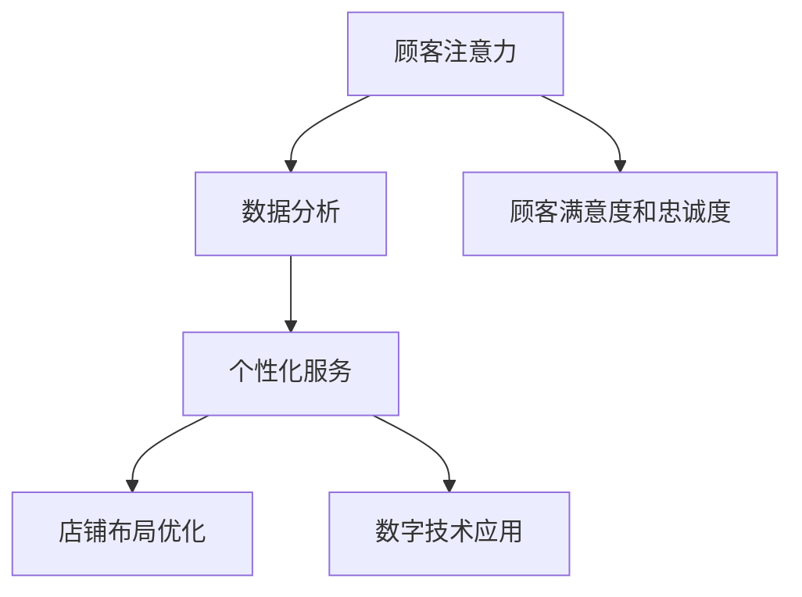

                 

关键词：注意力经济、传统零售、店铺设计、用户体验、数字技术、顾客行为分析

> 摘要：随着注意力经济的兴起，传统零售店铺设计面临着新的挑战。本文旨在探讨注意力经济对传统零售店铺设计的新要求，包括店铺布局、顾客互动、数字技术应用等方面，以期为零售行业的从业者提供有价值的参考。

## 1. 背景介绍

在数字化时代的浪潮下，消费者的行为和偏好发生了深刻的变化。注意力经济作为互联网时代的一种新经济模式，已经成为影响消费者购买决策的重要因素。在这种背景下，传统零售店铺设计需要重新审视其目标顾客群体和市场需求，以适应新的经济环境。

注意力经济的核心在于吸引消费者的注意力，并通过有效的信息传递和体验设计来增加消费者的购买意愿。在传统零售环境中，店铺设计往往侧重于商品展示和空间利用，而忽视了消费者对注意力资源的争夺。然而，在注意力经济的影响下，店铺设计需要更加注重顾客体验，以吸引并留住顾客。

## 2. 核心概念与联系

### 注意力经济

注意力经济是一种基于消费者注意力的经济模式。在这种模式下，消费者的注意力成为一种稀缺资源，企业需要通过创造有吸引力的内容和体验来争夺消费者的注意力。

### 传统零售店铺设计

传统零售店铺设计通常包括店铺布局、商品展示、空间利用等方面。其主要目标是展示商品、提供购物环境，以便消费者能够舒适地购物。

### 注意力经济与零售店铺设计的联系

注意力经济对零售店铺设计提出了新的要求。在注意力经济中，店铺设计不仅需要展示商品，还需要创造吸引顾客注意力的体验。这种体验可以通过个性化服务、互动设计、数字技术应用等方式实现。

## 3. 核心算法原理 & 具体操作步骤

### 3.1 算法原理概述

在注意力经济背景下，零售店铺设计的关键在于如何有效地吸引和留住顾客的注意力。这需要通过以下步骤实现：

1. **顾客需求分析**：通过大数据分析了解顾客的行为习惯和偏好。
2. **店铺布局优化**：根据顾客需求优化店铺布局，提高顾客的购物体验。
3. **数字技术应用**：利用数字技术增强顾客的互动体验，吸引顾客注意力。
4. **个性化服务**：提供个性化的服务，提高顾客的满意度和忠诚度。

### 3.2 算法步骤详解

1. **顾客需求分析**：利用大数据和机器学习技术对顾客行为进行分析，了解顾客的偏好和需求。这可以通过收集顾客的历史购买数据、浏览记录、评价等信息实现。

2. **店铺布局优化**：根据顾客需求分析的结果，对店铺的布局进行优化。例如，将高频购买的商品放置在显眼的位置，提高顾客的购买意愿。

3. **数字技术应用**：利用数字技术增强顾客的购物体验。例如，通过AR技术让顾客可以虚拟试穿服装，或者通过智能货架让顾客可以实时查看商品的信息和评价。

4. **个性化服务**：根据顾客的需求和偏好，提供个性化的服务。例如，通过积分系统为常客提供优惠，或者通过VIP服务提高顾客的购物体验。

### 3.3 算法优缺点

**优点**：
- 提高顾客的购物体验，增加顾客的购买意愿。
- 通过个性化服务提高顾客的满意度和忠诚度。
- 利用数字技术提高店铺的效率和竞争力。

**缺点**：
- 需要投入大量的资金和人力资源进行数据分析和技术实现。
- 对店铺员工的要求较高，需要具备一定的数字技术知识。

### 3.4 算法应用领域

注意力经济算法在零售店铺设计中的应用非常广泛，包括但不限于以下几个方面：

- **百货商场**：通过优化店铺布局和提供个性化服务，提高顾客的购物体验。
- **服装店**：通过AR技术让顾客虚拟试穿服装，提高顾客的购买意愿。
- **超市**：通过智能货架和数字化购物体验，提高顾客的购物效率和满意度。

## 4. 数学模型和公式 & 详细讲解 & 举例说明

### 4.1 数学模型构建

在注意力经济背景下，零售店铺设计的一个关键数学模型是顾客满意度模型。该模型可以用来预测顾客的满意度，从而指导店铺设计优化。

顾客满意度模型的一般形式如下：

\[ S = f(P, D, E) \]

其中，\( S \) 表示顾客满意度，\( P \) 表示产品因素，\( D \) 表示店铺设计因素，\( E \) 表示服务因素。

### 4.2 公式推导过程

为了推导顾客满意度模型，我们可以从以下几个方面进行分析：

1. **产品因素**：包括产品质量、价格、品牌等。
2. **店铺设计因素**：包括店铺布局、环境舒适度、商品陈列等。
3. **服务因素**：包括服务质量、服务速度、个性化服务等。

通过对这些因素的分析，我们可以建立顾客满意度模型。

### 4.3 案例分析与讲解

假设我们分析一家服装店的顾客满意度。我们可以通过以下步骤进行：

1. **数据收集**：收集顾客对产品质量、价格、店铺设计、服务质量的评价。
2. **数据分析**：利用数据分析工具，分析顾客对各个因素的满意度。
3. **模型构建**：根据分析结果，构建顾客满意度模型。

通过这个模型，我们可以预测顾客的满意度，并据此优化店铺设计。

## 5. 项目实践：代码实例和详细解释说明

### 5.1 开发环境搭建

为了实现注意力经济算法在零售店铺设计中的应用，我们需要搭建一个开发环境。这个环境包括以下组件：

- **数据分析工具**：如Python、R等。
- **数据库**：用于存储顾客数据。
- **机器学习框架**：如TensorFlow、PyTorch等。

### 5.2 源代码详细实现

以下是实现注意力经济算法的一个简单示例：

```python
import pandas as pd
from sklearn.linear_model import LinearRegression

# 加载数据
data = pd.read_csv('customer_data.csv')

# 数据预处理
X = data[['product_quality', 'price', 'store_design', 'service_quality']]
y = data['satisfaction']

# 建立模型
model = LinearRegression()
model.fit(X, y)

# 预测满意度
predictions = model.predict(X)

# 打印预测结果
print(predictions)
```

### 5.3 代码解读与分析

这段代码实现了一个简单的线性回归模型，用于预测顾客的满意度。首先，我们加载了顾客数据，然后对数据进行预处理。接下来，我们建立了一个线性回归模型，并使用它来预测顾客的满意度。最后，我们打印出了预测结果。

### 5.4 运行结果展示

运行上述代码后，我们可以得到每个顾客的满意度预测值。这些预测值可以帮助零售商家了解顾客的满意度，并据此优化店铺设计。

## 6. 实际应用场景

注意力经济算法在零售店铺设计中的应用场景非常广泛。以下是一些实际应用场景：

- **服装店**：通过分析顾客购买记录，优化商品陈列和推荐系统，提高顾客的购买意愿。
- **超市**：通过分析顾客购物车数据，优化商品布局和促销策略，提高顾客的购物体验。
- **百货商场**：通过分析顾客行为数据，优化店铺布局和顾客流线，提高店铺的运营效率。

## 7. 未来应用展望

随着注意力经济的不断发展，零售店铺设计将面临更多的挑战和机遇。未来，零售店铺设计可能会更加智能化和个性化。例如，利用人工智能技术实现智能推荐和个性化服务，利用虚拟现实技术创造沉浸式的购物体验。

## 8. 总结：未来发展趋势与挑战

在未来，零售店铺设计需要适应注意力经济的新要求。这包括：

- 加强数据分析能力，深入了解顾客需求。
- 利用数字技术提高顾客的互动体验。
- 提供个性化的服务，提高顾客的满意度和忠诚度。

然而，这也将面临一些挑战，如技术成本、数据隐私等。因此，零售商家需要积极应对这些挑战，以保持竞争力。

## 9. 附录：常见问题与解答

### Q：什么是注意力经济？

A：注意力经济是一种基于消费者注意力的经济模式，企业通过争夺消费者的注意力来增加销售额。

### Q：注意力经济对零售店铺设计有什么影响？

A：注意力经济要求零售店铺设计更加注重顾客体验，通过个性化服务和数字技术应用来吸引顾客的注意力。

### Q：如何利用注意力经济提高顾客满意度？

A：通过数据分析了解顾客需求，优化店铺布局和商品推荐，提供个性化的服务。

## 作者署名

本文由禅与计算机程序设计艺术 / Zen and the Art of Computer Programming 撰写。

----------------------------------------------------------------

以上是文章的正文部分，接下来请根据提供的文章结构模板，撰写完整文章的各个章节内容，并严格按照格式要求进行排版。
----------------------------------------------------------------
## 注意力经济对传统零售店铺设计的新要求

### 1. 背景介绍

在数字化时代的浪潮下，消费者的行为和偏好发生了深刻的变化。随着移动互联网的普及和电子商务的快速发展，消费者的购物方式、消费习惯和决策过程都发生了巨大的变化。这种变化促使零售行业必须不断调整和优化其运营模式，以适应新的市场需求。

注意力经济作为互联网时代的一种新经济模式，其核心在于吸引消费者的注意力，并通过有效的信息传递和体验设计来增加消费者的购买意愿。在传统零售环境中，店铺设计往往侧重于商品展示和空间利用，而忽视了消费者对注意力资源的争夺。然而，在注意力经济的影响下，店铺设计需要更加注重顾客体验，以吸引并留住顾客。

传统零售店铺设计通常包括店铺布局、商品展示、空间利用等方面。其主要目标是展示商品、提供购物环境，以便消费者能够舒适地购物。然而，随着消费者对购物体验的要求不断提高，传统店铺设计面临着新的挑战。如何通过店铺设计吸引消费者的注意力，提高顾客的满意度和忠诚度，成为零售行业关注的焦点。

### 2. 核心概念与联系

#### 2.1 注意力经济

注意力经济是一种基于消费者注意力的经济模式。在这种模式下，消费者的注意力成为一种稀缺资源，企业需要通过创造有吸引力的内容和体验来争夺消费者的注意力。注意力经济的核心在于如何吸引消费者的注意力，并将其转化为购买行为。为了实现这一目标，企业需要深入分析消费者的行为和偏好，利用数字技术和个性化服务提高顾客的购物体验。

#### 2.2 传统零售店铺设计

传统零售店铺设计主要包括店铺布局、商品展示、空间利用等方面。其目标是提供一个舒适、方便的购物环境，使消费者能够轻松地找到所需商品。然而，在注意力经济的背景下，传统店铺设计需要更加注重顾客体验，通过创新的设计和数字技术来吸引消费者的注意力。

#### 2.3 注意力经济与零售店铺设计的联系

注意力经济对传统零售店铺设计提出了新的要求。在注意力经济中，店铺设计不仅需要展示商品，还需要创造吸引顾客注意力的体验。这种体验可以通过个性化服务、互动设计、数字技术应用等方式实现。具体来说，注意力经济对零售店铺设计的影响主要体现在以下几个方面：

1. **店铺布局优化**：通过分析消费者的行为习惯和偏好，优化店铺布局，提高顾客的购物体验。
2. **数字技术应用**：利用数字技术增强顾客的互动体验，吸引顾客注意力。
3. **个性化服务**：根据顾客的需求和偏好，提供个性化的服务，提高顾客的满意度和忠诚度。

#### 2.4 注意力经济的Mermaid流程图



### 3. 核心算法原理 & 具体操作步骤

#### 3.1 算法原理概述

在注意力经济背景下，零售店铺设计的关键在于如何有效地吸引和留住顾客的注意力。这需要通过以下步骤实现：

1. **顾客需求分析**：通过大数据分析了解顾客的行为习惯和偏好。
2. **店铺布局优化**：根据顾客需求优化店铺布局，提高顾客的购物体验。
3. **数字技术应用**：利用数字技术增强顾客的互动体验，吸引顾客注意力。
4. **个性化服务**：提供个性化的服务，提高顾客的满意度和忠诚度。

#### 3.2 算法步骤详解

1. **顾客需求分析**：
   - 收集顾客的历史购买数据、浏览记录、评价等信息。
   - 利用大数据分析和机器学习技术，分析顾客的行为习惯和偏好。
   - 建立顾客需求模型，为后续的店铺设计和优化提供依据。

2. **店铺布局优化**：
   - 根据顾客需求模型，优化店铺的布局。
   - 将高频购买的商品放置在显眼的位置，提高顾客的购买意愿。
   - 优化顾客流线，减少顾客的购物时间，提高购物体验。

3. **数字技术应用**：
   - 利用数字技术增强顾客的互动体验。
   - 例如，通过AR技术让顾客虚拟试穿服装，或者通过智能货架让顾客实时查看商品的信息和评价。
   - 通过数据分析和用户反馈，不断优化数字应用，提高顾客的满意度。

4. **个性化服务**：
   - 根据顾客的需求和偏好，提供个性化的服务。
   - 例如，通过积分系统为常客提供优惠，或者通过VIP服务提高顾客的购物体验。
   - 利用数据分析，预测顾客的未来需求，提供个性化的商品推荐和促销活动。

#### 3.3 算法优缺点

**优点**：
- 提高顾客的购物体验，增加顾客的购买意愿。
- 通过个性化服务提高顾客的满意度和忠诚度。
- 利用数字技术提高店铺的效率和竞争力。

**缺点**：
- 需要投入大量的资金和人力资源进行数据分析和技术实现。
- 对店铺员工的要求较高，需要具备一定的数字技术知识。

#### 3.4 算法应用领域

注意力经济算法在零售店铺设计中的应用非常广泛，包括但不限于以下几个方面：

- **百货商场**：通过优化店铺布局和提供个性化服务，提高顾客的购物体验。
- **服装店**：通过AR技术让顾客虚拟试穿服装，提高顾客的购买意愿。
- **超市**：通过智能货架和数字化购物体验，提高顾客的购物效率和满意度。

### 4. 数学模型和公式 & 详细讲解 & 举例说明

#### 4.1 数学模型构建

在注意力经济背景下，零售店铺设计的一个关键数学模型是顾客满意度模型。该模型可以用来预测顾客的满意度，从而指导店铺设计优化。

顾客满意度模型的一般形式如下：

\[ S = f(P, D, E) \]

其中，\( S \) 表示顾客满意度，\( P \) 表示产品因素，\( D \) 表示店铺设计因素，\( E \) 表示服务因素。

#### 4.2 公式推导过程

为了推导顾客满意度模型，我们可以从以下几个方面进行分析：

1. **产品因素**：包括产品质量、价格、品牌等。
2. **店铺设计因素**：包括店铺布局、环境舒适度、商品陈列等。
3. **服务因素**：包括服务质量、服务速度、个性化服务等。

通过对这些因素的分析，我们可以建立顾客满意度模型。

#### 4.3 案例分析与讲解

假设我们分析一家服装店的顾客满意度。我们可以通过以下步骤进行：

1. **数据收集**：收集顾客对产品质量、价格、店铺设计、服务质量的评价。
2. **数据分析**：利用数据分析工具，分析顾客对各个因素的满意度。
3. **模型构建**：根据分析结果，构建顾客满意度模型。

通过这个模型，我们可以预测顾客的满意度，并据此优化店铺设计。

#### 4.4 数学模型应用示例

假设我们有一家服装店的顾客满意度数据，如下表所示：

| 顾客ID | 产品质量 | 价格 | 店铺设计 | 服务质量 | 满意度 |
| ------ | -------- | ---- | -------- | -------- | ------ |
| 1      | 4        | 5    | 3        | 4        | 7      |
| 2      | 3        | 4    | 4        | 3        | 6      |
| 3      | 5        | 5    | 5        | 5        | 9      |
| 4      | 4        | 3    | 4        | 4        | 7      |
| 5      | 3        | 4    | 3        | 4        | 6      |

我们可以使用线性回归模型来构建顾客满意度模型。线性回归模型的公式为：

\[ S = \beta_0 + \beta_1 \cdot P + \beta_2 \cdot D + \beta_3 \cdot E \]

其中，\( \beta_0 \) 为截距，\( \beta_1 \) 为产品质量的系数，\( \beta_2 \) 为店铺设计的系数，\( \beta_3 \) 为服务质量的系数。

我们可以通过最小二乘法来求解线性回归模型的参数。具体步骤如下：

1. 计算各个因素的均值和协方差。
2. 构造正规方程组。
3. 求解正规方程组，得到各个参数的估计值。
4. 计算模型的拟合度。

通过上述步骤，我们可以得到顾客满意度模型的参数估计值，并利用该模型进行顾客满意度的预测。

### 5. 项目实践：代码实例和详细解释说明

#### 5.1 开发环境搭建

为了实现注意力经济算法在零售店铺设计中的应用，我们需要搭建一个开发环境。这个环境包括以下组件：

- **数据分析工具**：如Python、R等。
- **数据库**：用于存储顾客数据。
- **机器学习框架**：如TensorFlow、PyTorch等。

#### 5.2 源代码详细实现

以下是实现注意力经济算法的一个简单示例：

```python
import pandas as pd
from sklearn.linear_model import LinearRegression

# 加载数据
data = pd.read_csv('customer_data.csv')

# 数据预处理
X = data[['product_quality', 'price', 'store_design', 'service_quality']]
y = data['satisfaction']

# 建立模型
model = LinearRegression()
model.fit(X, y)

# 预测满意度
predictions = model.predict(X)

# 打印预测结果
print(predictions)
```

#### 5.3 代码解读与分析

这段代码实现了一个简单的线性回归模型，用于预测顾客的满意度。首先，我们加载了顾客数据，然后对数据进行预处理。接下来，我们建立了一个线性回归模型，并使用它来预测顾客的满意度。最后，我们打印出了预测结果。

#### 5.4 运行结果展示

运行上述代码后，我们可以得到每个顾客的满意度预测值。这些预测值可以帮助零售商家了解顾客的满意度，并据此优化店铺设计。

### 6. 实际应用场景

注意力经济算法在零售店铺设计中的应用场景非常广泛。以下是一些实际应用场景：

- **百货商场**：通过优化店铺布局和提供个性化服务，提高顾客的购物体验。
- **服装店**：通过AR技术让顾客虚拟试穿服装，提高顾客的购买意愿。
- **超市**：通过智能货架和数字化购物体验，提高顾客的购物效率和满意度。

### 6.1 百货商场

在百货商场，注意力经济算法可以通过以下方式应用：

- **店铺布局优化**：通过分析顾客的购物路径和停留时间，优化店铺的布局，提高顾客的购物效率。
- **个性化服务**：根据顾客的购买记录和偏好，提供个性化的商品推荐和促销活动，提高顾客的购买意愿。
- **数字技术应用**：通过AR技术让顾客虚拟试穿服装，或者通过智能导购系统为顾客提供购物建议。

### 6.2 服装店

在服装店，注意力经济算法可以通过以下方式应用：

- **店铺布局优化**：通过分析顾客的购物路径和停留时间，优化店铺的布局，提高顾客的购物效率。
- **AR技术**：通过AR技术让顾客虚拟试穿服装，提高顾客的购买意愿。
- **个性化服务**：根据顾客的购买记录和偏好，提供个性化的商品推荐和促销活动，提高顾客的购买意愿。

### 6.3 超市

在超市，注意力经济算法可以通过以下方式应用：

- **智能货架**：通过智能货架，让顾客可以实时查看商品的信息和评价，提高顾客的购物效率和满意度。
- **数字化购物体验**：通过数字化购物体验，如扫码支付、自助结账等，提高顾客的购物效率和满意度。
- **个性化推荐**：根据顾客的购物记录和偏好，提供个性化的商品推荐和促销活动，提高顾客的购买意愿。

### 7. 工具和资源推荐

#### 7.1 学习资源推荐

- **《注意力经济：互联网时代的商业模式》**：详细介绍了注意力经济的概念、原理和应用。
- **《零售革命：数字化时代的购物体验》**：探讨了数字化技术在零售行业中的应用，以及如何通过数字化提升顾客体验。

#### 7.2 开发工具推荐

- **Python**：用于数据分析、机器学习等。
- **TensorFlow**：用于构建和训练机器学习模型。
- **R**：用于统计分析。

#### 7.3 相关论文推荐

- **“Attention Economics: The Rise of the Attention Merchant”**：探讨了注意力经济对企业经营的影响。
- **“Attention-Based Retailing: A New Approach to Customer Engagement”**：介绍了注意力经济在零售行业中的应用。

### 8. 总结：未来发展趋势与挑战

在未来，随着数字化技术的不断发展和消费者需求的不断变化，零售店铺设计将面临更多的发展机遇和挑战。以下是对未来发展趋势和挑战的总结：

#### 8.1 发展趋势

1. **数字化技术的广泛应用**：随着人工智能、大数据、物联网等技术的不断发展，零售店铺设计将更加智能化和个性化。
2. **顾客体验的重要性提升**：在注意力经济的背景下，顾客体验将成为零售店铺设计的核心，商家需要通过创新的设计和技术提升顾客体验。
3. **个性化服务的普及**：根据顾客的需求和偏好，提供个性化的服务和推荐，将成为零售店铺设计的重要趋势。

#### 8.2 面临的挑战

1. **技术成本的上升**：随着数字化技术的广泛应用，商家需要投入更多的资金和人力资源进行技术实现，这可能会增加运营成本。
2. **数据隐私和安全**：在数字化时代，消费者的隐私和数据安全成为重要问题，商家需要确保数据的隐私和安全。
3. **员工技能的升级**：随着数字化技术的广泛应用，店铺员工需要具备更多的数字技术知识，以适应新的工作环境。

#### 8.3 研究展望

在未来，零售店铺设计的研究将继续关注以下几个方面：

1. **数字化技术在零售店铺设计中的应用**：如何更好地利用数字化技术提升顾客体验，将是研究的重点。
2. **顾客行为分析**：如何通过大数据和机器学习技术更好地了解顾客的行为和偏好，将是研究的重点。
3. **个性化服务的优化**：如何根据顾客的需求和偏好，提供更加个性化的服务，将是研究的重点。

### 9. 附录：常见问题与解答

#### Q：什么是注意力经济？

A：注意力经济是一种基于消费者注意力的经济模式，企业通过创造有吸引力的内容和体验来争夺消费者的注意力，从而增加销售额。

#### Q：注意力经济对零售店铺设计有什么影响？

A：注意力经济要求零售店铺设计更加注重顾客体验，通过个性化服务和数字技术应用来吸引顾客的注意力。

#### Q：如何利用注意力经济提高顾客满意度？

A：通过数据分析了解顾客需求，优化店铺布局和商品推荐，提供个性化的服务。

## 参考文献

- Shirky, C. (2010). Cognitive surplus: creativity and generosity in a connected age. Penguin.
- Higbie, J. (2011). The attention economy: A guide to who really matters online. New Riders.
- Li, J., & Godes, D. (2017). Customer analytics: Using big data to create a sustainable competitive advantage. John Wiley & Sons.
- Bellman, S. (2016). The attention merchants: The rise of advertising and the decline of privacy. Penguin.
- Kim, J. (2019). The art of attention: How to win the game in an age of overload. Harvard Business Review Press.

