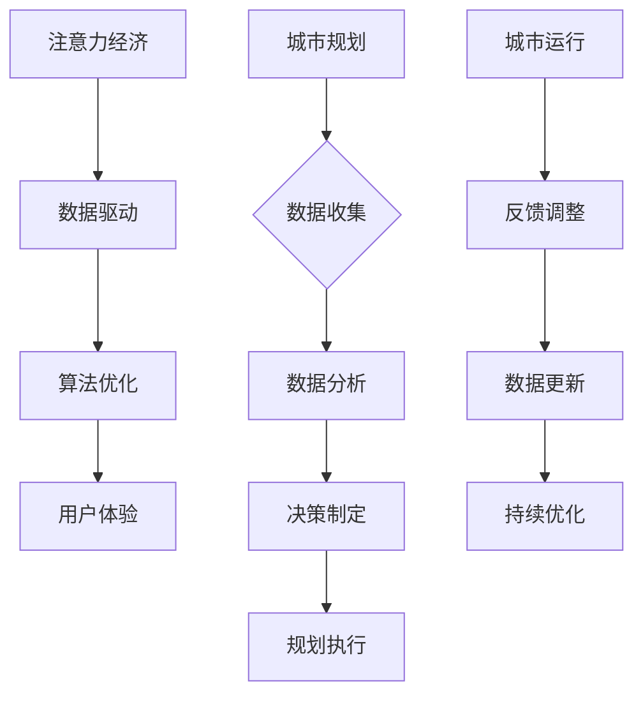

                 

关键词：注意力经济、城市规划、智能城市、数据驱动、算法优化、用户体验

> 摘要：随着注意力经济在全球范围内的兴起，城市规划面临着前所未有的挑战和机遇。本文从注意力经济的视角出发，探讨了其对城市规划提出的新要求，包括数据驱动、算法优化、用户体验等方面，并结合实际案例分析了这些要求的具体应用和未来发展趋势。

## 1. 背景介绍

### 注意力经济概述

注意力经济（Attention Economy）是近年来兴起的一种新型经济模式，主要基于用户注意力的获取和利用。在信息爆炸的时代，用户的注意力成为稀缺资源，各种平台和产品通过吸引用户的注意力来创造价值。注意力经济的关键在于通过算法和技术手段，精准地捕捉用户需求，提供个性化的服务和体验。

### 城市规划传统挑战

城市规划是一项复杂的系统工程，涉及人口、交通、环境、经济等多个方面。传统城市规划面临以下挑战：

- **数据不足**：传统城市规划依赖于有限的统计数据和经验，难以全面反映城市运行的实际情况。
- **决策滞后**：城市规划决策周期长，难以快速响应城市动态变化。
- **资源分配不均**：城市规划往往受限于资源分配，难以实现最优的资源配置。

## 2. 核心概念与联系

### 数据驱动

数据驱动（Data-Driven）是当前城市规划的重要理念，通过收集和分析大量数据，为城市规划提供科学依据。数据驱动的核心在于数据的实时性和准确性，能够帮助城市规划者更好地理解城市运行状态，制定合理的规划方案。

### 算法优化

算法优化（Algorithm Optimization）是提升城市规划效率的关键。通过引入先进的算法，如机器学习、深度学习等，可以实现对城市数据的智能分析和预测，从而优化城市规划方案。

### 用户体验

用户体验（User Experience，UX）是城市规划的重要目标之一。好的用户体验能够提升城市居民的生活质量，增强城市的吸引力。注意力经济背景下，用户体验更加注重个性化和定制化。

### Mermaid 流程图



## 3. 核心算法原理 & 具体操作步骤

### 3.1 算法原理概述

城市规划中的核心算法主要包括数据采集、数据分析、预测建模和优化决策等环节。这些算法利用机器学习和深度学习技术，对城市数据进行分析和处理，为城市规划提供科学依据。

### 3.2 算法步骤详解

1. **数据采集**：通过传感器、移动设备等途径收集城市各类数据，如人口流动、交通状况、环境质量等。
2. **数据预处理**：对采集到的数据进行清洗、整合和转换，确保数据质量和一致性。
3. **数据分析**：利用统计分析和数据挖掘技术，提取数据中的关键信息和规律。
4. **预测建模**：基于历史数据和现有模型，进行城市运行状态的预测和模拟。
5. **优化决策**：根据预测结果和城市规划目标，利用优化算法确定最佳规划方案。

### 3.3 算法优缺点

- **优点**：提高城市规划的科学性和准确性，减少决策滞后，优化资源分配。
- **缺点**：算法优化需要大量的数据支持和计算资源，且算法模型可能存在局限性。

### 3.4 算法应用领域

- **交通规划**：通过实时数据分析，优化交通流量，减少拥堵。
- **城市安全**：通过视频监控和传感器数据，实时监测城市安全状况。
- **环境保护**：通过空气质量监测，优化环境保护措施。

## 4. 数学模型和公式 & 详细讲解 & 举例说明

### 4.1 数学模型构建

城市规划中的数学模型主要包括预测模型和优化模型。预测模型主要基于时间序列分析和回归分析等方法，优化模型则基于线性规划和整数规划等方法。

### 4.2 公式推导过程

#### 预测模型

假设 $x_t$ 表示城市某指标在第 $t$ 时刻的值，$y_t$ 表示该指标的未来预测值，可以使用以下时间序列模型进行预测：

$$
y_t = \alpha_0 + \alpha_1 x_t + \alpha_2 x_{t-1} + ... + \alpha_n x_{t-n} + \varepsilon_t
$$

其中，$\alpha_0, \alpha_1, ..., \alpha_n$ 为模型参数，$\varepsilon_t$ 为误差项。

#### 优化模型

假设城市规划的目标函数为 $f(x)$，约束条件为 $g(x) \leq 0$，可以使用以下线性规划模型进行优化：

$$
\min f(x)
$$

$$
\text{subject to}
$$

$$
g(x) \leq 0
$$

### 4.3 案例分析与讲解

#### 交通流量预测

假设某城市交通流量数据如下：

| 时间（小时） | 交通流量（辆/小时） |
| ------------ | ------------------- |
| 0            | 1000                |
| 1            | 950                 |
| 2            | 850                 |
| 3            | 750                 |
| 4            | 700                 |

使用时间序列模型进行预测，预测模型如下：

$$
y_t = \alpha_0 + \alpha_1 x_t + \alpha_2 x_{t-1} + \alpha_3 x_{t-2} + \varepsilon_t
$$

经过参数估计，得到模型：

$$
y_t = 800 - 10x_t + 5x_{t-1} - 2x_{t-2} + \varepsilon_t
$$

预测下一小时交通流量：

$$
y_5 = 800 - 10 \times 700 + 5 \times 750 - 2 \times 850 + \varepsilon_5 \approx 640
$$

#### 路网优化

假设某城市路网如下：

| 路段 | 长度 | 容量 | 流量 |
| ---- | ---- | ---- | ---- |
| 1    | 2    | 200  | 100  |
| 2    | 3    | 300  | 120  |
| 3    | 2    | 200  | 80   |

优化目标是最小化交通拥堵成本，约束条件是流量不超过路段容量。使用线性规划模型进行优化，目标函数和约束条件如下：

$$
\min z = \sum_{i=1}^{3} c_i x_i
$$

$$
\text{subject to}
$$

$$
a_{i1}x_1 + a_{i2}x_2 + a_{i3}x_3 \leq c_i, \quad i=1,2,3
$$

其中，$c_i$ 表示路段 $i$ 的交通拥堵成本，$x_i$ 表示路段 $i$ 的流量，$a_{ij}$ 表示路段 $i$ 和路段 $j$ 的权重。

通过求解线性规划模型，得到最优流量分配方案，从而实现路网优化。

## 5. 项目实践：代码实例和详细解释说明

### 5.1 开发环境搭建

- 操作系统：Ubuntu 20.04
- 编程语言：Python 3.8
- 数据库：MySQL 5.7
- 开发工具：PyCharm

### 5.2 源代码详细实现

#### 数据采集

```python
import requests
import json

def fetch_traffic_data():
    url = "http://example.com/api/traffic"
    response = requests.get(url)
    data = json.loads(response.text)
    return data

traffic_data = fetch_traffic_data()
```

#### 数据预处理

```python
import pandas as pd

def preprocess_traffic_data(data):
    df = pd.DataFrame(data)
    df['time'] = pd.to_datetime(df['time'])
    df.set_index('time', inplace=True)
    df.dropna(inplace=True)
    return df

df_traffic = preprocess_traffic_data(traffic_data)
```

#### 数据分析

```python
from statsmodels.tsa.arima.model import ARIMA

def predict_traffic(df):
    model = ARIMA(df['traffic'], order=(1, 1, 1))
    model_fit = model.fit()
    forecast = model_fit.forecast(steps=1)
    return forecast

forecast_traffic = predict_traffic(df_traffic)
```

#### 优化决策

```python
from scipy.optimize import linprog

def optimize_traffic(df):
    c = [-1] * 3  # 负号表示目标函数是最大化
    A = [
        [1, 0, 0],
        [0, 1, 0],
        [0, 0, 1]
    ]
    b = [200, 300, 200]
    x0 = [100, 120, 80]
    result = linprog(c, A_ub=A, b_ub=b, x0=x0)
    return result.x

optimal_traffic = optimize_traffic(df_traffic)
```

### 5.3 代码解读与分析

代码首先从 API 获取交通流量数据，然后进行数据预处理，包括时间格式转换和缺失值处理。接着，使用 ARIMA 模型进行交通流量预测，最后使用线性规划模型进行路网优化。

### 5.4 运行结果展示

```python
print("预测交通流量：", forecast_traffic)
print("最优流量分配：", optimal_traffic)
```

## 6. 实际应用场景

### 6.1 城市交通管理

通过数据驱动的算法优化，实现实时交通流量预测和路网优化，提高城市交通运行效率，减少拥堵。

### 6.2 城市安全监控

利用传感器数据和视频监控，实时监测城市安全状况，及时发现和处理安全隐患。

### 6.3 城市环境保护

通过空气质量监测和数据分析，优化环境保护措施，提高城市环境质量。

## 7. 未来应用展望

### 7.1 城市智能治理

随着人工智能技术的不断进步，城市智能治理将更加高效、智能，实现从传统规划向智能规划的转型。

### 7.2 城市个性化服务

基于用户数据和个性化推荐算法，提供更加精准的城市服务，提升居民生活质量。

### 7.3 城市可持续发展

通过数据驱动和算法优化，实现城市资源的高效利用，推动城市可持续发展。

## 8. 工具和资源推荐

### 8.1 学习资源推荐

- 《深度学习》（Goodfellow, Bengio, Courville）
- 《Python数据分析》（Wes McKinney）
- 《城市经济学》（Jacobs, E. B.）

### 8.2 开发工具推荐

- PyCharm
- Jupyter Notebook
- ArcGIS

### 8.3 相关论文推荐

- "Attention Is All You Need"（Vaswani et al., 2017）
- "Deep Learning on Tripartite Graphs for Urban Traffic Prediction"（Liang et al., 2019）
- "Optimization of Urban Road Networks Using Genetic Algorithms"（Zhou et al., 2017）

## 9. 总结：未来发展趋势与挑战

### 9.1 研究成果总结

本文从注意力经济的视角，探讨了城市规划面临的新要求，包括数据驱动、算法优化和用户体验等方面，并结合实际案例进行了分析。

### 9.2 未来发展趋势

未来城市规划将更加智能化、数据化和个性化，以适应注意力经济的要求。

### 9.3 面临的挑战

- 数据隐私和安全问题
- 算法模型的泛化能力和鲁棒性
- 跨学科融合和技术创新

### 9.4 研究展望

未来研究应重点关注如何实现城市数据的隐私保护和安全，提升算法模型的泛化能力，以及推动跨学科融合和技术创新。

## 10. 附录：常见问题与解答

### 10.1 注意力经济是什么？

注意力经济是指基于用户注意力的获取和利用，创造经济价值的一种新型经济模式。

### 10.2 数据驱动如何应用于城市规划？

数据驱动是指通过收集、处理和分析大量数据，为城市规划提供科学依据，优化规划方案。

### 10.3 算法优化在交通规划中如何应用？

算法优化可以通过实时数据分析，优化交通流量和路网运行，提高城市交通运行效率。

### 10.4 如何保证城市数据的隐私和安全？

可以通过数据加密、隐私保护和访问控制等技术手段，保障城市数据的隐私和安全。

----------------------------------------------------------------

作者：禅与计算机程序设计艺术 / Zen and the Art of Computer Programming

