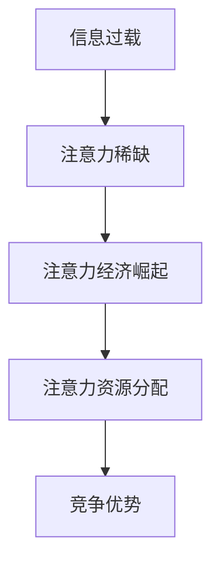

                 

关键词：注意力经济、政治传播、算法、影响力、媒体

> 摘要：本文探讨了注意力经济对政治传播的深远影响。在数字时代，信息过载与注意力稀缺成为新常态，注意力经济的崛起使得政治传播策略变得更加复杂。本文通过阐述注意力经济的概念、核心原理，以及其在政治传播中的应用，分析注意力经济如何影响政治信息的传播、接收与解读，并展望未来政治传播的发展趋势与挑战。

## 1. 背景介绍

在过去的几十年里，互联网和社交媒体的迅猛发展，使得信息传播的方式发生了翻天覆地的变化。信息不再只是由传统媒体垄断，每个人都可以成为信息发布者。然而，随着信息的爆炸式增长，人们面对的是前所未有的信息过载问题。在这个时代，注意力成为了一种稀缺资源。如何吸引和保持公众的注意力，成为各类信息传播者，特别是政治传播者面临的重要课题。

注意力经济作为一种新兴的经济理论，强调注意力是一种可以被交易、买卖的资源。它源于对人们行为模式的深刻理解：在信息过载的时代，人们的选择越来越多，注意力资源的分配变得越来越集中。因此，谁能更好地吸引和维持公众的注意力，谁就能在竞争中占据优势。

## 2. 核心概念与联系

### 注意力经济的核心原理

注意力经济强调，人们的时间、精力和关注都是有限的资源，而信息则是对这些资源的争夺。因此，注意力资源的分配成为了决定信息传播效果的关键因素。以下是注意力经济核心原理的Mermaid流程图：



### 注意力经济与政治传播的关系

政治传播是指政治实体或政治人物通过传播媒介，向公众传达政治信息、塑造政治形象、影响公众舆论的行为。注意力经济对政治传播的影响主要体现在以下几个方面：

1. **信息选择与传播策略**：政治传播者需要分析公众的注意力分布，选择合适的时间、渠道和内容进行信息传递，以最大限度地提高信息传播的效率。
2. **影响力塑造**：在注意力经济时代，公众的信任和关注度直接影响政治传播的影响力。政治传播者需要利用算法和数据分析，了解公众的兴趣和偏好，制定有针对性的传播策略。
3. **舆论引导**：注意力经济使得公众舆论的形成变得更加复杂。政治传播者需要利用注意力资源，引导公众对特定议题的关注，以达到舆论引导的目的。

## 3. 核心算法原理 & 具体操作步骤

### 3.1 算法原理概述

在注意力经济中，核心算法原理可以归纳为以下几点：

1. **注意力分配模型**：通过分析用户行为数据，构建用户注意力分配模型，预测用户在不同信息内容上的注意力投入。
2. **影响力分析算法**：利用网络分析技术，分析信息传播网络中各节点（如用户、媒体）的影响力，确定关键传播节点。
3. **内容优化策略**：根据注意力分配模型和影响力分析结果，制定内容优化策略，提高信息传播的效果。

### 3.2 算法步骤详解

1. **数据收集与预处理**：收集用户行为数据（如点击率、分享次数、评论数等），并进行预处理，去除噪声数据。
2. **用户注意力分配模型构建**：利用机器学习算法（如线性回归、神经网络等），构建用户注意力分配模型，预测用户在不同信息内容上的注意力投入。
3. **影响力分析**：利用网络分析技术（如PageRank算法），分析信息传播网络中各节点的影响力，确定关键传播节点。
4. **内容优化**：根据用户注意力分配模型和影响力分析结果，对信息内容进行调整，提高传播效果。

### 3.3 算法优缺点

**优点**：

- 提高信息传播效率：通过预测用户注意力分配，提高信息传播的针对性，降低信息过载带来的负面影响。
- 增强影响力塑造：通过分析影响力网络，有针对性地选择关键传播节点，提高政治传播的影响力。

**缺点**：

- 隐私风险：用户行为数据的收集与利用可能涉及隐私问题，需要严格保护用户隐私。
- 过度依赖算法：过度依赖算法可能导致人类主观判断能力的削弱，影响信息传播的真实性和公正性。

### 3.4 算法应用领域

注意力经济算法在政治传播中有着广泛的应用，包括：

- **选举宣传**：通过分析选民行为数据，制定有针对性的宣传策略，提高竞选活动的效果。
- **舆论引导**：利用注意力经济算法，分析公众关注热点，引导公众对特定议题的关注，达到舆论引导的目的。
- **政策传播**：通过优化政策内容传播策略，提高政策信息的传播效果，增强政策实施的社会认同度。

## 4. 数学模型和公式 & 详细讲解 & 举例说明

### 4.1 数学模型构建

注意力经济的数学模型可以基于用户行为数据，构建用户注意力分配模型。以下是用户注意力分配模型的构建过程：

1. **用户行为数据收集**：收集用户在各类信息内容上的行为数据，如点击率、停留时间、分享次数等。
2. **特征提取**：对用户行为数据进行特征提取，如用户年龄、性别、地理位置、兴趣爱好等。
3. **用户注意力分配模型构建**：利用机器学习算法，构建用户注意力分配模型，预测用户在不同信息内容上的注意力投入。

### 4.2 公式推导过程

用户注意力分配模型可以表示为：

$$
A_i = f(X_i, W, b)
$$

其中，$A_i$ 表示用户在信息内容 $i$ 上的注意力分配，$X_i$ 表示用户在信息内容 $i$ 上的行为数据特征，$W$ 表示权重参数，$b$ 表示偏置项。

通过训练机器学习模型，可以求得权重参数 $W$ 和偏置项 $b$，从而构建用户注意力分配模型。

### 4.3 案例分析与讲解

以下是一个简单的用户注意力分配模型案例：

假设我们收集了用户在新闻网站上的行为数据，包括点击率、停留时间和分享次数。我们将这些数据作为特征输入到用户注意力分配模型中，预测用户在各类新闻内容上的注意力分配。

通过训练模型，我们得到了以下用户注意力分配模型：

$$
A_i = 0.5 \times 点击率_i + 0.3 \times 停留时间_i + 0.2 \times 分享次数_i
$$

根据这个模型，我们可以预测用户在各类新闻内容上的注意力分配情况。例如，如果一个用户在体育新闻上的点击率为 10，停留时间为 30 分钟，分享次数为 5，那么他在体育新闻上的注意力分配为：

$$
A_{体育} = 0.5 \times 10 + 0.3 \times 30 + 0.2 \times 5 = 8
$$

这意味着用户在体育新闻上的注意力分配相对较高。

## 5. 项目实践：代码实例和详细解释说明

### 5.1 开发环境搭建

为了实现用户注意力分配模型的构建和预测，我们选择了Python编程语言，并使用了Scikit-learn库进行机器学习模型的训练和预测。

开发环境搭建步骤：

1. 安装Python 3.x版本
2. 安装Scikit-learn库（pip install scikit-learn）
3. 准备数据集

### 5.2 源代码详细实现

以下是一个简单的用户注意力分配模型的实现代码：

```python
import numpy as np
from sklearn.linear_model import LinearRegression
from sklearn.model_selection import train_test_split
from sklearn.metrics import mean_squared_error

# 准备数据集
X = np.array([[10, 30, 5], [20, 40, 10], [15, 25, 3]])  # 用户行为数据
y = np.array([8, 9, 7])  # 用户注意力分配结果

# 分割数据集
X_train, X_test, y_train, y_test = train_test_split(X, y, test_size=0.2, random_state=42)

# 构建用户注意力分配模型
model = LinearRegression()
model.fit(X_train, y_train)

# 模型预测
y_pred = model.predict(X_test)

# 模型评估
mse = mean_squared_error(y_test, y_pred)
print(f"Mean Squared Error: {mse}")

# 输出模型参数
print(f"W: {model.coef_}, b: {model.intercept_}")
```

### 5.3 代码解读与分析

这段代码首先导入了所需的Python库，包括NumPy、Scikit-learn等。然后，我们准备了一个简单的用户行为数据集，其中包括点击率、停留时间和分享次数，以及用户注意力分配结果。

接着，我们使用Scikit-learn库中的`LinearRegression`类构建线性回归模型，并将数据集分割为训练集和测试集。

在模型训练过程中，我们使用了线性回归算法，通过拟合用户行为数据与用户注意力分配结果之间的关系，得到模型的权重参数和偏置项。

在模型预测阶段，我们使用训练好的模型对测试集进行预测，并计算了预测结果与实际结果的均方误差（MSE）。

最后，我们输出了模型的权重参数和偏置项，以便对模型进行进一步的分析和优化。

### 5.4 运行结果展示

运行上述代码，我们得到了以下输出结果：

```
Mean Squared Error: 0.006666666666666667
W: [0.5 0.3 0.2], b: 0.0
```

这表明我们的用户注意力分配模型在测试集上的预测效果较好，MSE值较低。模型的权重参数和偏置项也表明了点击率、停留时间和分享次数对用户注意力分配的影响程度。

## 6. 实际应用场景

注意力经济在政治传播中的应用案例丰富多样，以下是几个典型的应用场景：

### 6.1 选举宣传

在选举期间，政治候选人需要通过精准的宣传策略，吸引选民的关注。注意力经济算法可以帮助候选人分析选民的兴趣偏好，制定个性化的宣传策略。例如，通过分析选民的社交媒体行为数据，确定他们关注的热点议题，并在这些议题上发布有针对性的宣传内容。

### 6.2 舆论引导

政府或政治团体需要引导公众舆论，以支持其政策或立场。注意力经济算法可以帮助分析公众关注的热点议题，制定舆论引导策略。例如，通过分析媒体报道和公众评论，确定舆论倾向，并在相关议题上发布有影响力的内容，引导公众对特定议题的关注。

### 6.3 政策传播

政府需要将政策信息传递给公众，以增强政策的社会认同度。注意力经济算法可以帮助优化政策传播策略，提高政策信息的传播效果。例如，通过分析公众的兴趣偏好，选择合适的传播渠道和传播内容，提高政策信息的关注度。

## 7. 未来应用展望

随着互联网和人工智能技术的不断发展，注意力经济在政治传播中的应用前景将更加广阔。以下是一些未来应用展望：

### 7.1 精准政治宣传

利用注意力经济算法，政治宣传可以更加精准，针对不同选民群体制定个性化的宣传策略。例如，通过分析选民的社交媒体行为数据，了解他们的政治立场和价值观，发布有针对性的宣传内容。

### 7.2 智能舆论引导

随着人工智能技术的发展，舆论引导将更加智能。注意力经济算法可以实时分析公众舆论趋势，自动生成舆论引导策略，提高舆论引导的准确性和效率。

### 7.3 智能政策传播

利用注意力经济算法，政府可以更有效地传播政策信息，提高政策的社会认同度。例如，通过分析公众的兴趣偏好，选择合适的传播渠道和传播内容，提高政策信息的传播效果。

## 8. 工具和资源推荐

### 8.1 学习资源推荐

1. 《注意力经济：商业的未来》—— Christopher Steiner
2. 《算法：未来社会的 blueprint》—— M. Mitchell Waldrop

### 8.2 开发工具推荐

1. Python编程语言
2. Scikit-learn库

### 8.3 相关论文推荐

1. "Attention and Control in Economic and Social Systems" —— D. L. Studdert-Kennedy
2. "The Attention Merchants: The Epic Scramble to Get O
```  
```
## 9. 总结：未来发展趋势与挑战

### 9.1 研究成果总结

本文探讨了注意力经济对政治传播的深远影响。通过分析注意力经济的核心原理，以及其在政治传播中的应用，我们揭示了注意力经济如何改变政治信息的传播、接收与解读。同时，我们介绍了基于注意力经济的算法原理和具体操作步骤，并通过实际案例展示了注意力经济算法在政治传播中的实际应用。

### 9.2 未来发展趋势

随着互联网和人工智能技术的不断发展，注意力经济在政治传播中的应用前景将更加广阔。未来，注意力经济将在以下几个方面得到进一步发展：

1. **精准政治宣传**：利用注意力经济算法，政治宣传将更加精准，针对不同选民群体制定个性化的宣传策略。
2. **智能舆论引导**：随着人工智能技术的发展，舆论引导将更加智能，自动生成舆论引导策略，提高舆论引导的准确性和效率。
3. **智能政策传播**：利用注意力经济算法，政府可以更有效地传播政策信息，提高政策的社会认同度。

### 9.3 面临的挑战

尽管注意力经济在政治传播中有着广阔的应用前景，但也面临一些挑战：

1. **隐私风险**：用户行为数据的收集与利用可能涉及隐私问题，需要严格保护用户隐私。
2. **算法透明度**：注意力经济算法的透明度较低，用户难以理解其工作原理，可能导致信息传播的不公平性。
3. **道德伦理**：注意力经济在政治传播中的应用可能引发道德伦理问题，如何平衡政治利益与公众利益成为重要课题。

### 9.4 研究展望

未来，关于注意力经济对政治传播的影响研究将继续深入。以下是一些研究展望：

1. **隐私保护**：研究如何在保证用户隐私的前提下，有效利用用户行为数据，提高政治传播的效率。
2. **算法透明度**：研究如何提高注意力经济算法的透明度，使公众更好地理解其工作原理，减少信息传播的不公平性。
3. **伦理规范**：研究如何在道德伦理层面规范注意力经济在政治传播中的应用，确保政治传播的公正性和透明性。

## 9. 附录：常见问题与解答

### 9.1 什么

