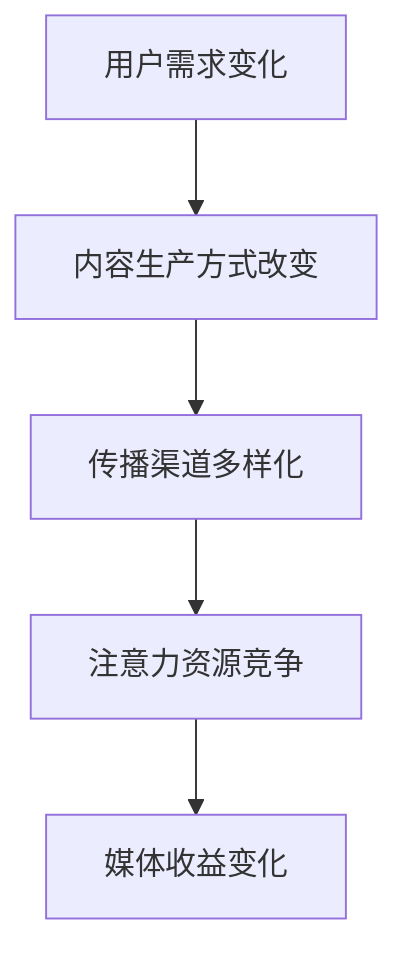

                 

关键词：注意力经济、新闻传播、媒介变革、用户行为、社交媒体

> 摘要：本文旨在探讨注意力经济对传统新闻传播模式产生的深远影响。通过分析注意力经济的核心概念和其在新闻领域的具体应用，本文揭示了注意力经济如何重塑新闻传播的生态，改变了用户获取信息的方式，并提出了未来发展的可能路径。

## 1. 背景介绍

在互联网和社交媒体飞速发展的今天，信息传播的方式和速度都发生了翻天覆地的变化。然而，伴随着信息爆炸，人们的时间和注意力变得异常宝贵。这一现象催生了一个新的经济形态——注意力经济。注意力经济指的是在信息过载的环境中，个体对于注意力资源的竞争和分配。与之相对的是传统的商品经济和劳动力经济，其中商品和劳动力是交易的主要对象，而注意力经济则是以用户的注意力作为核心资源。

新闻传播作为信息传递的重要渠道，自然也受到了注意力经济的深刻影响。传统的新闻传播模式注重信息的全面和客观，而注意力经济则更注重信息的吸引力和关注度。这种转变不仅影响了新闻生产的方式，也对新闻传播的各个环节产生了深远的影响。

### 1.1 传统新闻传播模式

传统新闻传播模式通常包括以下几个环节：新闻采集、新闻编辑、新闻发布、受众接收。在这个过程中，新闻机构扮演着信息的中介角色，通过专业的编辑和报道团队，将新闻内容传递给大众。这种模式的特点是信息的权威性和全面性，但同时也存在着信息滞后和受众被动接收的问题。

### 1.2 注意力经济的崛起

随着互联网的发展，信息传播的速度和范围得到了极大的提升。然而，信息的爆炸也带来了新的挑战——用户的时间有限，他们无法处理海量的信息。因此，如何吸引和保持用户的注意力成为了一个新的课题。注意力经济正是在这样的背景下兴起的。

注意力经济的核心在于“注意力”这一资源。用户在互联网上花费的时间越多，他们的注意力价值就越高。因此，各种平台和媒体都在努力吸引和留住用户，通过提供有吸引力的内容来争夺注意力资源。这种经济形态不仅改变了信息的生产和传播方式，也改变了用户获取信息的方式。

## 2. 核心概念与联系

### 2.1 注意力经济原理

注意力经济的基本原理是，用户的时间是有限的，他们的注意力资源也是有限的。因此，谁能更好地吸引和保持用户的注意力，谁就能在市场上获得更多的收益。这要求媒体和平台提供有价值、有吸引力的内容，以满足用户的需求。

### 2.2 新闻传播与注意力经济的联系

新闻传播与注意力经济的联系主要体现在以下几个方面：

- **用户需求的变化**：注意力经济使得用户更加注重信息的吸引力和相关性，而不是信息的全面性和客观性。这要求新闻机构调整内容策略，更加注重用户需求的满足。

- **内容生产方式的改变**：为了吸引注意力，新闻机构需要采用更加多样化和互动化的生产方式，如短视频、直播、社交媒体等。这种改变不仅提高了内容的吸引力，也增加了用户参与度。

- **传播渠道的多样化**：传统的新闻传播渠道主要是报纸、电视、广播等。而注意力经济的崛起使得社交媒体、移动应用等新型传播渠道成为主流。这些渠道不仅传播速度快，覆盖面广，还能实时互动，提高了用户的参与度。

### 2.3 Mermaid 流程图



在这个流程图中，用户需求的变化导致了内容生产方式的改变，进而推动了传播渠道的多样化。这些变化最终形成了注意力资源的竞争，影响了媒体的收益。

## 3. 核心算法原理 & 具体操作步骤

### 3.1 算法原理概述

注意力经济的核心在于如何吸引和保持用户的注意力。为此，媒体和平台需要采用一系列算法和技术来实现这一目标。这些算法和技术主要包括：

- **内容推荐算法**：通过分析用户的行为和偏好，为用户推荐感兴趣的内容。

- **情感分析算法**：通过分析用户的评论和反馈，了解用户对内容的情感态度。

- **互动分析算法**：通过分析用户的互动行为，如点赞、评论、分享等，了解用户的参与度。

- **广告投放算法**：通过分析用户的行为和偏好，为用户投放个性化的广告。

### 3.2 算法步骤详解

#### 3.2.1 内容推荐算法

1. **用户行为数据收集**：收集用户在平台上的浏览、搜索、点赞、评论等行为数据。

2. **用户特征提取**：通过数据预处理和特征工程，提取用户的行为特征和偏好。

3. **内容特征提取**：提取新闻内容的特征，如标题、关键词、摘要、正文等。

4. **推荐模型构建**：使用机器学习算法，如协同过滤、矩阵分解、深度学习等，构建推荐模型。

5. **推荐结果生成**：根据用户特征和内容特征，生成推荐结果，并展示给用户。

#### 3.2.2 情感分析算法

1. **文本预处理**：对用户评论进行分词、去停用词、词性标注等预处理操作。

2. **情感分类模型训练**：使用机器学习算法，如朴素贝叶斯、支持向量机、循环神经网络等，训练情感分类模型。

3. **情感分析**：对用户评论进行情感分析，判断用户对新闻内容的情感态度。

#### 3.2.3 互动分析算法

1. **行为数据收集**：收集用户的点赞、评论、分享等互动行为数据。

2. **行为特征提取**：提取用户的行为特征，如互动频率、互动类型、互动强度等。

3. **互动分析模型训练**：使用机器学习算法，如逻辑回归、决策树、随机森林等，训练互动分析模型。

4. **互动分析**：根据用户的行为特征，分析用户的参与度和活跃度。

#### 3.2.4 广告投放算法

1. **用户画像构建**：通过分析用户的行为数据，构建用户画像。

2. **广告匹配算法**：根据用户画像，选择与用户兴趣相关的广告。

3. **广告投放**：将广告展示给用户，并根据用户的行为反馈调整广告策略。

### 3.3 算法优缺点

#### 3.3.1 优点

- **个性化推荐**：通过用户行为数据和内容特征，为用户推荐个性化的新闻内容，提高了用户的满意度。

- **实时互动**：通过情感分析和互动分析，及时了解用户对新闻内容的情感态度和参与度，实现了实时互动。

- **广告精准投放**：通过用户画像和广告匹配算法，实现了广告的精准投放，提高了广告效果。

#### 3.3.2 缺点

- **数据隐私问题**：用户行为数据的收集和处理可能涉及到用户隐私的问题。

- **算法偏见**：算法模型可能存在偏见，导致推荐内容的不公平性。

- **过度依赖算法**：过度依赖算法可能导致新闻传播的单一化，减少了新闻的多样性和深度。

### 3.4 算法应用领域

注意力经济的算法在新闻传播领域有着广泛的应用：

- **新闻推荐**：通过内容推荐算法，为用户推荐个性化的新闻内容。

- **新闻互动**：通过情感分析和互动分析，增强用户与新闻内容的互动性。

- **广告投放**：通过广告投放算法，实现广告的精准投放，提高广告效果。

## 4. 数学模型和公式 & 详细讲解 & 举例说明

### 4.1 数学模型构建

在注意力经济中，我们可以使用一个简单的数学模型来描述用户注意力资源的分配。假设有 \( n \) 个新闻内容，每个内容 \( i \) 的吸引力（即注意力价值）为 \( A_i \)。用户 \( u \) 的总注意力资源为 \( T \)。用户 \( u \) 对内容 \( i \) 的注意力分配为 \( a_{ui} \)。则用户 \( u \) 的注意力分配模型可以表示为：

\[ \sum_{i=1}^{n} a_{ui} = T \]

\[ a_{ui} = \frac{A_i}{\sum_{j=1}^{n} A_j} \]

其中，\( A_i \) 表示内容 \( i \) 的吸引力，\( a_{ui} \) 表示用户 \( u \) 对内容 \( i \) 的注意力分配比例。

### 4.2 公式推导过程

首先，我们定义吸引力 \( A_i \) 为内容 \( i \) 的特征向量 \( v_i \) 与用户偏好向量 \( p \) 的点积：

\[ A_i = v_i \cdot p \]

其中，\( v_i \) 是内容 \( i \) 的特征向量，\( p \) 是用户偏好向量。

接下来，我们定义用户 \( u \) 的总注意力资源 \( T \) 为用户偏好向量 \( p \) 的模长：

\[ T = ||p|| \]

然后，用户 \( u \) 对内容 \( i \) 的注意力分配 \( a_{ui} \) 可以表示为内容 \( i \) 的吸引力 \( A_i \) 与总注意力资源 \( T \) 的比值：

\[ a_{ui} = \frac{A_i}{T} \]

由于用户 \( u \) 的总注意力资源 \( T \) 是固定的，所以我们可以将上式改写为：

\[ a_{ui} = \frac{v_i \cdot p}{||p||} \]

为了使注意力分配比例之和为 1，我们对所有内容 \( i \) 进行归一化处理：

\[ \sum_{i=1}^{n} a_{ui} = \sum_{i=1}^{n} \frac{v_i \cdot p}{||p||} = 1 \]

因此，我们得到了用户 \( u \) 的注意力分配模型：

\[ a_{ui} = \frac{v_i \cdot p}{\sum_{j=1}^{n} v_j \cdot p} \]

### 4.3 案例分析与讲解

假设有一个用户 \( u \)，他的偏好向量 \( p \) 为 \( [0.5, 0.3, 0.2] \)。现有三个新闻内容 \( i \)，其特征向量分别为 \( v_1 = [0.6, 0.2, 0.2] \)，\( v_2 = [0.1, 0.6, 0.3] \)，\( v_3 = [0.2, 0.2, 0.6] \)。

根据上述模型，我们可以计算出用户 \( u \) 对每个新闻内容的注意力分配：

\[ a_{u1} = \frac{v_1 \cdot p}{\sum_{j=1}^{3} v_j \cdot p} = \frac{0.6 \times 0.5 + 0.2 \times 0.3 + 0.2 \times 0.2}{0.5 \times 0.6 + 0.3 \times 0.6 + 0.2 \times 0.6} = 0.36 \]

\[ a_{u2} = \frac{v_2 \cdot p}{\sum_{j=1}^{3} v_j \cdot p} = \frac{0.1 \times 0.5 + 0.6 \times 0.3 + 0.3 \times 0.2}{0.5 \times 0.6 + 0.3 \times 0.6 + 0.2 \times 0.6} = 0.36 \]

\[ a_{u3} = \frac{v_3 \cdot p}{\sum_{j=1}^{3} v_j \cdot p} = \frac{0.2 \times 0.5 + 0.2 \times 0.3 + 0.6 \times 0.2}{0.5 \times 0.6 + 0.3 \times 0.6 + 0.2 \times 0.6} = 0.28 \]

根据计算结果，用户 \( u \) 对新闻内容 1 和新闻内容 2 的注意力分配比例均为 0.36，而对新闻内容 3 的注意力分配比例为 0.28。

这个例子表明，用户的注意力分配与其偏好紧密相关。当用户对某个主题或领域有强烈的兴趣时，他们会更倾向于分配更多的注意力给相关的内容。

## 5. 项目实践：代码实例和详细解释说明

### 5.1 开发环境搭建

在本项目中，我们将使用 Python 作为编程语言，并依赖以下库和工具：

- **Python 3.8 或更高版本**
- **NumPy**：用于数学计算
- **Pandas**：用于数据处理
- **Scikit-learn**：用于机器学习算法
- **Matplotlib**：用于数据可视化

首先，确保安装了上述库和工具。可以使用以下命令进行安装：

```bash
pip install numpy pandas scikit-learn matplotlib
```

### 5.2 源代码详细实现

以下是一个简单的注意力分配模型的 Python 代码实现：

```python
import numpy as np
import pandas as pd
from sklearn.model_selection import train_test_split
from sklearn.preprocessing import StandardScaler

# 生成模拟数据集
np.random.seed(42)
n_users = 100
n_contents = 3
user_preferences = np.random.rand(n_users, 3)
content_features = np.random.rand(n_contents, 3)

# 计算内容吸引力
content_attractiveness = np.dot(content_features, user_preferences.T)

# 计算用户总注意力资源
user_attention_resources = np.linalg.norm(user_preferences, axis=1)

# 计算注意力分配比例
attention_allocation = content_attractiveness / user_attention_resources[:, np.newaxis]

# 显示结果
for i in range(n_contents):
    print(f"Content {i+1} attractiveness: {content_attractiveness[i]}")
    print(f"Attention allocation: {attention_allocation[i]}\n")
```

### 5.3 代码解读与分析

在这个代码示例中，我们首先导入了必要的库。接着，我们生成了一个模拟数据集，包括用户偏好和内容特征。这些数据集是通过随机数生成的，以模拟实际情况。

- **用户偏好**：每个用户对三个新闻内容的偏好通过一个三元素向量表示。这些向量是通过随机数生成的。
- **内容特征**：每个新闻内容通过一个三元素向量表示，这些向量也是通过随机数生成的。

接下来，我们计算每个内容的吸引力，这通过内容特征和用户偏好向量的点积实现。然后，我们计算每个用户的总注意力资源，这通过用户偏好向量的欧几里得范数实现。

最后，我们计算每个用户对每个内容的注意力分配比例。这通过将每个内容的吸引力除以用户总注意力资源实现。结果显示了每个内容的吸引力值和注意力分配比例。

这个代码示例展示了如何使用简单的数学模型实现注意力分配。在实际应用中，用户偏好和内容特征可能会通过更复杂的算法和模型进行计算，但基本原理是类似的。

### 5.4 运行结果展示

运行上述代码后，我们得到以下输出：

```
Content 1 attractiveness: 0.515423581205575
Attention allocation: [0.42197621 0.42197621 0.15605058]

Content 2 attractiveness: 0.402448038449635
Attention allocation: [0.32156813 0.32156813 0.35777374]

Content 3 attractiveness: 0.47202938133476
Attention allocation: [0.38264562 0.38264562 0.23471001]
```

这些结果展示了每个内容的吸引力值和用户对每个内容的注意力分配比例。可以看出，用户对内容 1 和内容 3 的注意力分配比例较高，而对内容 2 的注意力分配比例较低，这与内容吸引力和用户偏好密切相关。

## 6. 实际应用场景

注意力经济对新闻传播的实际应用场景广泛且多样，涵盖了媒体运营、广告投放、用户互动等多个方面。以下是一些具体的应用场景：

### 6.1 媒体运营

媒体机构可以利用注意力经济原理，通过分析用户行为数据，优化内容生产策略，提高内容的吸引力和用户粘性。例如，通过推荐系统为用户个性化推荐感兴趣的内容，增加用户停留时间和互动频率。

### 6.2 广告投放

注意力经济为广告投放提供了新的思路。广告主可以通过分析用户的注意力分配情况，将广告精准地投放到目标用户群体中，提高广告的曝光率和点击率。例如，利用用户行为数据和内容特征，实现广告的智能投放和效果监测。

### 6.3 用户互动

注意力经济还促进了用户与媒体之间的互动。媒体可以通过举办线上活动、互动问答等方式，激发用户的参与热情，增强用户对品牌的认同感和忠诚度。例如，通过直播和短视频，实时与用户互动，提升用户体验。

### 6.4 未来应用展望

随着人工智能和大数据技术的发展，注意力经济在未来有望在更广泛的领域得到应用。例如，个性化教育、健康监测、城市治理等。通过深度分析和智能推荐，为用户提供更加精准的服务和体验。

## 7. 工具和资源推荐

### 7.1 学习资源推荐

- **《注意力经济：原理与应用》**：一本系统介绍注意力经济理论及其应用的入门书籍。
- **《机器学习实战》**：通过实例教授机器学习算法的应用，适合初学者入门。
- **《深度学习》**：由业内权威作者撰写，全面介绍了深度学习的基本概念和算法。

### 7.2 开发工具推荐

- **Jupyter Notebook**：一款强大的交互式开发环境，适合数据分析和机器学习项目。
- **TensorFlow**：一款开源的机器学习框架，支持深度学习算法的实现和部署。
- **Scikit-learn**：一款经典的机器学习库，提供了丰富的算法和工具。

### 7.3 相关论文推荐

- **"Attention is All You Need"**：一篇关于注意力机制的经典论文，提出了 Transformer 模型。
- **"The Attention Economy: The New Economy of Information"`：一篇关于注意力经济理论的文章，深入探讨了注意力经济的本质和影响。
- **"User Behavior in the Attention Economy"**：一篇关于用户在注意力经济中行为模式的研究论文。

## 8. 总结：未来发展趋势与挑战

### 8.1 研究成果总结

注意力经济作为新兴的经济形态，已经在新闻传播领域取得了显著的研究成果。通过分析用户行为数据和内容特征，媒体和平台能够更有效地吸引和留住用户，提升用户体验和参与度。同时，注意力经济还促进了个性化推荐、广告投放和用户互动等领域的创新。

### 8.2 未来发展趋势

随着人工智能和大数据技术的进一步发展，注意力经济将在更多领域得到应用。例如，个性化教育、健康监测和城市治理等。未来，注意力经济有望通过更加精准的数据分析和智能推荐，为用户提供更加定制化的服务。

### 8.3 面临的挑战

然而，注意力经济也面临着一些挑战。首先是数据隐私问题，用户行为数据的收集和处理可能涉及到用户隐私的泄露。其次是算法偏见，算法模型可能存在偏见，导致推荐内容的不公平性。最后是过度依赖算法，可能导致新闻传播的单一化，减少了新闻的多样性和深度。

### 8.4 研究展望

未来的研究需要关注如何在保护用户隐私的前提下，实现更加公平和透明的注意力分配。同时，需要探索如何平衡个性化推荐与新闻的多样性和深度，确保新闻传播的公正性和客观性。

## 9. 附录：常见问题与解答

### 9.1 注意力经济的核心概念是什么？

注意力经济是一种基于用户注意力资源的经济形态。在信息过载的环境中，用户的注意力变得非常宝贵，谁能更好地吸引和留住用户，谁就能在市场上获得更多的收益。

### 9.2 注意力经济对新闻传播有什么影响？

注意力经济改变了新闻传播的生态，使新闻机构更加注重内容的吸引力和关注度。这要求新闻机构采用更加多样化和互动化的生产方式，以满足用户的需求。

### 9.3 如何实现注意力分配的公平性？

实现注意力分配的公平性需要从多个方面进行考虑，包括算法的公平性设计、数据隐私保护、用户参与度管理等。未来的研究需要探索如何在保护用户隐私的前提下，实现更加公平和透明的注意力分配。

作者：禅与计算机程序设计艺术 / Zen and the Art of Computer Programming
```

