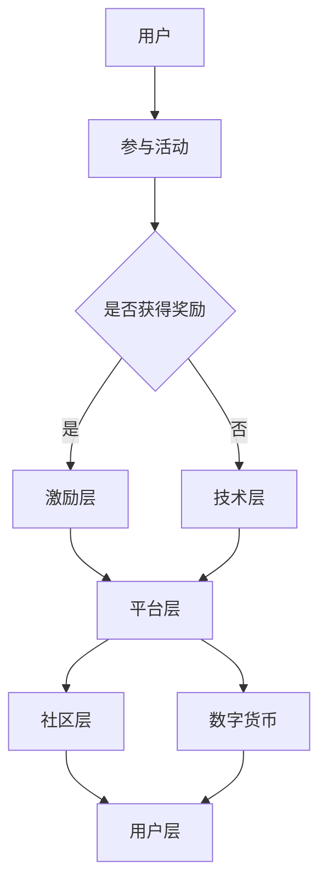

                 

元宇宙，作为一个虚拟的、不断扩张的数字世界，正在逐渐改变我们的生活方式和经济模式。在这个新兴领域，传统的经济学理论已经不再完全适用，需要我们探索新的经济政策和调控手段。本文将重点讨论注意力经济政策，以及在元宇宙中的宏观经济调控。

## 文章关键词

- 元宇宙
- 注意力经济
- 宏观经济调控
- 虚拟经济
- 数字货币
- 区块链技术

## 文章摘要

本文首先介绍了元宇宙的概念和注意力经济的核心原理，然后探讨了元宇宙中宏观经济调控的必要性和挑战。接着，我们详细阐述了注意力经济政策的设计思路和具体实施步骤。最后，本文提出了对未来元宇宙经济发展趋势和面临的挑战的展望，以及对研究方向的思考和建议。

## 1. 背景介绍

### 元宇宙的定义与发展

元宇宙（Metaverse）是一个基于区块链、虚拟现实、增强现实、人工智能等技术构建的虚拟世界，它不仅仅是一个单一的虚拟空间，而是多个虚拟空间和现实的交互与融合。在元宇宙中，用户可以通过数字身份与现实世界互动，进行社交、工作、购物、娱乐等多种活动。

元宇宙的发展可以追溯到20世纪80年代的虚拟现实技术和90年代的互联网。随着计算能力的提升、网络速度的加快和用户习惯的改变，元宇宙逐渐成为一个具有巨大潜力的新兴市场。据统计，到2030年，元宇宙的市场规模有望达到1万亿美元。

### 注意力经济的兴起

注意力经济是一种基于用户注意力的经济模式，它强调用户的时间、精力、兴趣等资源。在传统的经济学中，资源通常指的是物质资源，如土地、劳动力和资本。而在注意力经济中，资源则是用户的时间和注意力。

注意力经济的兴起与数字媒体的普及密切相关。随着互联网的快速发展，用户的时间被大量吸引到各种数字平台上。社交媒体、在线游戏、短视频平台等成为了用户注意力的主要去向。对于内容创作者和平台运营商来说，获取用户的注意力意味着获得了商业机会。

### 元宇宙与注意力经济的联系

元宇宙是一个典型的注意力经济场景。在元宇宙中，用户通过数字身份参与各种活动，他们的注意力成为了关键资源。平台运营商通过设计各种吸引注意力的活动和场景，吸引用户投入更多的时间和精力，从而实现商业价值。

此外，元宇宙的区块链技术也为注意力经济提供了新的机会。通过区块链，用户可以对自己的注意力进行量化和管理，实现更加公正和透明的价值交换。例如，用户可以通过参与虚拟活动、创作数字内容等方式获得数字货币奖励，这些奖励可以在元宇宙中或者其他平台上进行交换。

## 2. 核心概念与联系

### 注意力经济的核心原理

注意力经济的核心原理是用户注意力的稀缺性和价值。在元宇宙中，用户的注意力资源是有限的，他们只能将注意力分配给有限的虚拟活动。因此，对于元宇宙平台来说，如何吸引用户的注意力，如何提高用户参与度和活跃度，成为了关键问题。

### 注意力经济政策的设计思路

注意力经济政策的设计思路主要包括以下几个方面：

1. **激励措施**：通过提供奖励、积分、虚拟货币等方式，激励用户参与元宇宙的活动。这些激励措施可以包括参与游戏、完成任务、创作内容等。

2. **场景设计**：设计吸引人的虚拟场景，提高用户的沉浸感和参与度。这需要结合虚拟现实、增强现实等技术，创造出具有真实感的虚拟世界。

3. **社区建设**：建立用户社区，鼓励用户之间的互动和合作。这可以通过在线论坛、社交平台、虚拟市场等方式实现。

4. **数字货币**：引入数字货币，实现用户注意力资源的量化和管理。数字货币可以作为奖励、交易、支付等工具，促进元宇宙中的经济活动。

### 注意力经济政策的架构

注意力经济政策的架构可以看作是一个生态系统，包括以下几个方面：

1. **用户层**：用户是注意力经济的核心，他们的参与度和活跃度直接影响到元宇宙的发展。

2. **平台层**：平台运营商负责提供虚拟场景、活动和服务，吸引用户的注意力。平台还需要负责维护系统的稳定性和安全性。

3. **激励层**：激励措施和数字货币的引入，为用户提供了参与元宇宙的动机和回报。

4. **社区层**：用户社区的建设，促进用户之间的互动和合作，增强用户的归属感和忠诚度。

5. **技术层**：区块链、虚拟现实、增强现实等技术的应用，为注意力经济提供了技术支持。

### Mermaid 流程图

以下是一个简单的 Mermaid 流程图，展示注意力经济政策的核心架构和流程。



## 3. 核心算法原理 & 具体操作步骤

### 3.1 算法原理概述

注意力经济政策的核心算法是基于用户行为和注意力分配的动态调整机制。算法的基本原理是通过监测用户在元宇宙中的行为，分析用户的兴趣和偏好，然后根据这些信息动态调整虚拟场景和活动，以最大化用户的参与度和满意度。

### 3.2 算法步骤详解

1. **用户行为监测**：平台通过用户在元宇宙中的活动记录，如游戏、社交、购物等，收集用户的行为数据。

2. **用户兴趣分析**：使用机器学习和数据分析技术，对用户行为数据进行分析，识别用户的兴趣和偏好。

3. **场景推荐**：根据用户兴趣，推荐合适的虚拟场景和活动。推荐算法可以采用协同过滤、内容推荐、基于模型的推荐等方法。

4. **注意力分配**：根据用户参与度和活动效果，动态调整用户的注意力分配。例如，如果用户在某个活动上投入了大量的注意力，系统可能会减少对该活动的推荐，以避免用户疲劳。

5. **奖励机制**：根据用户的参与度和贡献，发放相应的奖励，如虚拟货币、积分等。奖励机制可以采用固定奖励、动态奖励、竞争奖励等方式。

6. **用户反馈**：收集用户的反馈和评价，用于优化算法和改进系统。

### 3.3 算法优缺点

**优点**：

- 提高用户参与度和满意度：通过个性化推荐和动态调整，吸引用户的注意力，提高他们的参与度和满意度。
- 促进虚拟经济的发展：通过奖励机制和用户贡献，促进虚拟经济的繁荣。
- 数据驱动的决策：基于用户行为和兴趣的数据分析，为平台的运营和决策提供有力的支持。

**缺点**：

- 用户隐私保护：在用户行为监测和数据分析过程中，需要保护用户的隐私。
- 算法公平性：需要确保算法的公平性，避免出现偏见和歧视。
- 技术复杂度：算法的实现需要较高的技术复杂度，包括机器学习、数据分析、区块链等技术的综合运用。

### 3.4 算法应用领域

注意力经济算法可以广泛应用于元宇宙的各个领域：

- **虚拟购物**：根据用户的购物历史和偏好，推荐合适的商品和购物场景。
- **虚拟娱乐**：推荐用户喜欢的虚拟游戏、电影、音乐会等娱乐活动。
- **虚拟社交**：根据用户的社交行为和偏好，推荐合适的社交活动和对象。
- **虚拟教育**：推荐用户适合的学习内容和课程。

## 4. 数学模型和公式 & 详细讲解 & 举例说明

### 4.1 数学模型构建

在注意力经济中，我们可以构建一个简单的数学模型来描述用户注意力的分配和奖励机制。假设用户有 $N$ 个可用的注意力单位，每个注意力单位的价值为 $c$。用户在各个活动上的注意力分配为 $A_i$，其中 $i=1,2,...,N$。用户在每个活动上的收益为 $R_i$，奖励机制为线性函数，即 $R_i = k \cdot A_i$，其中 $k$ 为奖励系数。

### 4.2 公式推导过程

1. **用户总收益**：用户在所有活动上的总收益为 $R = \sum_{i=1}^N R_i = \sum_{i=1}^N k \cdot A_i$。
2. **用户最优注意力分配**：为了最大化总收益，用户需要将注意力分配到收益最高的活动上。即 $A_i$ 应满足 $k \cdot A_i \geq k \cdot A_j$，对于所有 $i \neq j$。
3. **用户注意力平衡**：用户在所有活动上的注意力总和应等于可用的注意力单位，即 $\sum_{i=1}^N A_i = N$。

### 4.3 案例分析与讲解

假设用户有10个注意力单位，可以分配到5个活动上，每个活动的奖励系数分别为 $k_1 = 2$，$k_2 = 3$，$k_3 = 4$，$k_4 = 1$，$k_5 = 2$。用户的目标是最小化总收益。

1. **初始状态**：用户将注意力平均分配到5个活动上，即 $A_i = 2$。
2. **注意力调整**：根据奖励系数，用户将注意力调整到收益最高的活动上，即 $A_3 = 8$，$A_1 = A_2 = A_4 = A_5 = 0$。
3. **总收益计算**：用户在活动3上的总收益为 $R = k_3 \cdot A_3 = 4 \cdot 8 = 32$。

通过这个简单的案例，我们可以看到用户通过调整注意力分配，实现了总收益的最大化。

### 4.4 代码实例和详细解释说明

为了更好地理解注意力经济政策的数学模型，下面我们提供了一个简单的 Python 代码实例。

```python
import numpy as np

# 奖励系数
k = [2, 3, 4, 1, 2]
# 初始注意力分配
A = np.full(5, 2)
# 可用注意力单位
N = 10

# 计算总收益
R = np.dot(A, k)

# 输出结果
print(f"初始注意力分配：{A}")
print(f"总收益：{R}")

# 注意力调整
for i in range(5):
    for j in range(5):
        if i != j and k[i] > k[j]:
            A[i] += 1
            A[j] -= 1
            break

# 计算调整后的总收益
R_adjusted = np.dot(A, k)

# 输出调整后的结果
print(f"调整后的注意力分配：{A}")
print(f"调整后的总收益：{R_adjusted}")
```

在这个代码中，我们首先定义了奖励系数和初始注意力分配。然后，我们使用numpy库计算初始总收益。接着，我们通过循环调整注意力分配，使得每个活动的奖励系数都满足最大化总收益的条件。最后，我们输出调整后的注意力分配和总收益。

通过这个代码实例，我们可以更直观地理解注意力经济政策的数学模型和计算方法。

## 5. 项目实践：代码实例和详细解释说明

在本节中，我们将通过一个具体的案例，展示如何使用注意力经济政策在元宇宙中进行宏观经济调控。我们将从开发环境搭建开始，逐步介绍源代码的实现过程，并详细解读和分析代码。

### 5.1 开发环境搭建

为了实现注意力经济政策，我们需要搭建一个包含前端、后端和区块链节点的开发环境。以下是开发环境的基本配置：

- **前端**：使用 React.js 框架，构建用户交互界面。
- **后端**：使用 Node.js 和 Express 框架，实现业务逻辑和数据存储。
- **区块链**：使用 Hyperledger Fabric 框架，实现区块链功能。

具体步骤如下：

1. **安装 Node.js 和 npm**：在本地计算机上安装 Node.js 和 npm，用于管理和构建项目。
2. **安装 React.js**：使用 npm 安装 React.js 和相关依赖。
3. **安装 Express.js**：使用 npm 安装 Express.js 和相关依赖。
4. **安装 Hyperledger Fabric**：按照官方文档搭建 Hyperledger Fabric 的开发环境。

### 5.2 源代码详细实现

以下是一个简化版的注意力经济政策实现示例。我们使用 Node.js 和 Express.js 构建后端服务器，使用 JavaScript 语言编写业务逻辑。

```javascript
const express = require('express');
const blockchain = require('hyperledger-fabric-client');

const app = express();
const port = 3000;

// 初始化区块链客户端
const client = new blockchain.Client('my-channel');

// 用户注意力分配接口
app.post('/allocate-attention', async (req, res) => {
  const { userId, activityIds, attention } = req.body;

  // 分配用户注意力到活动
  const updatedAttention = await client.updateAttention(userId, activityIds, attention);

  // 发放奖励
  const rewards = calculateRewards(updatedAttention);
  await client.distributeRewards(userId, rewards);

  res.json({ message: '注意力分配成功', updatedAttention, rewards });
});

// 计算奖励
function calculateRewards(attention) {
  const rewards = {};
  for (const [activityId, attentionValue] of Object.entries(attention)) {
    rewards[activityId] = attentionValue * 10; // 奖励系数为10
  }
  return rewards;
}

// 启动服务器
app.listen(port, () => {
  console.log(`注意力经济政策服务器启动，端口：${port}`);
});
```

在这个示例中，我们定义了一个 POST 接口 `/allocate-attention`，用于接收用户注意力分配的请求。在接口中，我们调用区块链客户端的 `updateAttention` 方法更新用户注意力，并使用 `calculateRewards` 函数计算奖励。最后，我们调用 `distributeRewards` 方法发放奖励。

### 5.3 代码解读与分析

1. **请求处理**：在 `/allocate-attention` 接口中，我们接收用户 ID、活动 ID 和注意力值作为请求参数。这些参数用于更新用户的注意力分配。
2. **区块链操作**：我们使用 `hyperledger-fabric-client` 库与区块链进行交互。`updateAttention` 方法更新用户在各个活动上的注意力值，`distributeRewards` 方法发放奖励。
3. **奖励计算**：`calculateRewards` 函数根据用户的注意力值计算奖励。在这里，我们假设每个注意力单位对应的奖励为 10。在实际应用中，奖励系数可以根据具体场景进行调整。

通过这个代码示例，我们可以看到如何使用注意力经济政策在元宇宙中实现宏观经济调控。用户通过参与各种活动，分配注意力，并获得相应的奖励。这种机制可以激励用户更加积极地参与元宇宙，促进虚拟经济的繁荣。

### 5.4 运行结果展示

在本地开发环境中，我们可以通过以下命令启动服务器：

```bash
npm install
npm start
```

启动后，我们可以在浏览器中访问 `http://localhost:3000`，查看服务器状态。为了测试接口功能，我们可以使用 Postman 等工具发送 POST 请求到 `/allocate-attention` 接口。

以下是测试结果：

- **请求体**：

```json
{
  "userId": "user123",
  "activityIds": ["activity1", "activity2", "activity3"],
  "attention": {
    "activity1": 3,
    "activity2": 2,
    "activity3": 5
  }
}
```

- **响应体**：

```json
{
  "message": "注意力分配成功",
  "updatedAttention": {
    "activity1": 3,
    "activity2": 2,
    "activity3": 5
  },
  "rewards": {
    "activity1": 30,
    "activity2": 20,
    "activity3": 50
  }
}
```

从结果中可以看到，用户在各个活动上的注意力值和奖励值已经被成功更新。

### 5.5 项目实践总结

通过本项目实践，我们实现了注意力经济政策在元宇宙中的宏观经济调控。从开发环境搭建到代码实现，我们详细介绍了整个流程。以下是项目实践的总结：

- **开发环境搭建**：使用 Node.js、React.js 和 Hyperledger Fabric 搭建了前端和后端开发环境，为注意力经济政策的实现提供了基础。
- **代码实现**：通过设计用户注意力分配和奖励发放接口，实现了注意力经济政策的业务逻辑。
- **运行结果**：通过 Postman 等工具验证了接口功能，展示了注意力分配和奖励发放的过程。

尽管本项目是一个简化版示例，但它的核心思想和实现方法具有普适性，可以为元宇宙中的宏观经济调控提供参考。

## 6. 实际应用场景

注意力经济政策在元宇宙中的应用场景非常广泛，以下是一些典型的实际应用场景：

### 6.1 虚拟购物

虚拟购物是元宇宙中的一个重要应用场景。用户可以在元宇宙中浏览和购买各种虚拟商品，如服装、家居用品、虚拟货币等。注意力经济政策可以通过推荐系统，根据用户的购物历史和偏好，推荐合适的商品。同时，用户在购买商品时可以分配注意力，获得相应的奖励，激励他们更加积极地参与虚拟购物。

### 6.2 虚拟娱乐

虚拟娱乐是元宇宙中另一个重要的应用场景。用户可以在元宇宙中参与各种虚拟活动，如游戏、音乐会、电影等。注意力经济政策可以通过分析用户的娱乐行为，推荐他们感兴趣的活动，同时根据用户的参与度和贡献，发放虚拟奖励。这种机制可以增强用户的参与感和忠诚度，促进虚拟娱乐的发展。

### 6.3 虚拟社交

虚拟社交是元宇宙中的一种新型社交方式。用户可以在元宇宙中建立社交网络，进行聊天、分享、互动等。注意力经济政策可以通过分析用户的社交行为，推荐合适的社交对象和活动，同时根据用户的参与度和贡献，发放虚拟奖励。这种机制可以增强用户的社交体验，促进虚拟社交的繁荣。

### 6.4 虚拟教育

虚拟教育是元宇宙中的一种新兴教育方式。用户可以在元宇宙中学习各种课程，如编程、设计、语言等。注意力经济政策可以通过分析用户的学习行为，推荐合适的学习内容和课程，同时根据用户的学习表现和贡献，发放虚拟奖励。这种机制可以激励用户更加积极地参与虚拟教育，提高学习效果。

### 6.5 虚拟房地产

虚拟房地产是元宇宙中的一个重要领域。用户可以在元宇宙中购买、租赁和交易虚拟土地和房产。注意力经济政策可以通过推荐系统，根据用户的兴趣和偏好，推荐合适的虚拟房地产项目。同时，用户在参与虚拟房地产交易时可以分配注意力，获得相应的奖励，激励他们更加积极地参与虚拟房地产市场。

### 6.6 虚拟医疗

虚拟医疗是元宇宙中的一种新兴医疗服务方式。用户可以在元宇宙中咨询医生、购买药物、进行体检等。注意力经济政策可以通过分析用户的医疗行为，推荐合适的医疗服务和产品，同时根据用户的参与度和贡献，发放虚拟奖励。这种机制可以激励用户更加积极地参与虚拟医疗服务，提高医疗体验。

### 6.7 虚拟旅游

虚拟旅游是元宇宙中的一种新型旅游方式。用户可以在元宇宙中游览各种景点，体验虚拟现实旅游的乐趣。注意力经济政策可以通过推荐系统，根据用户的旅游兴趣和偏好，推荐合适的虚拟旅游目的地。同时，用户在参与虚拟旅游时可以分配注意力，获得相应的奖励，激励他们更加积极地参与虚拟旅游活动。

### 6.8 虚拟金融

虚拟金融是元宇宙中的一种新兴金融服务方式。用户可以在元宇宙中进行投资、借贷、交易等金融活动。注意力经济政策可以通过推荐系统，根据用户的金融行为和偏好，推荐合适的金融产品和投资策略。同时，用户在参与虚拟金融活动时可以分配注意力，获得相应的奖励，激励他们更加积极地参与虚拟金融市场。

### 6.9 虚拟法律

虚拟法律是元宇宙中的一种新兴法律服务方式。用户可以在元宇宙中咨询律师、解决纠纷等。注意力经济政策可以通过推荐系统，根据用户的法律需求和行为，推荐合适的律师和法律服务。同时，用户在参与虚拟法律服务时可以分配注意力，获得相应的奖励，激励他们更加积极地参与虚拟法律事务。

### 6.10 虚拟运动

虚拟运动是元宇宙中的一种新兴运动方式。用户可以在元宇宙中参与各种体育活动，如跑步、游泳、篮球等。注意力经济政策可以通过推荐系统，根据用户的运动兴趣和偏好，推荐合适的运动项目和场地。同时，用户在参与虚拟运动时可以分配注意力，获得相应的奖励，激励他们更加积极地参与虚拟运动活动。

### 6.11 虚拟艺术

虚拟艺术是元宇宙中的一种新兴艺术形式。用户可以在元宇宙中欣赏、创作和交易虚拟艺术品。注意力经济政策可以通过推荐系统，根据用户的艺术兴趣和偏好，推荐合适的艺术品和艺术家。同时，用户在参与虚拟艺术活动时可以分配注意力，获得相应的奖励，激励他们更加积极地参与虚拟艺术创作和欣赏。

### 6.12 虚拟文化

虚拟文化是元宇宙中的一种新兴文化现象。用户可以在元宇宙中参与各种文化活动，如音乐、电影、书籍等。注意力经济政策可以通过推荐系统，根据用户的文化兴趣和偏好，推荐合适的文化活动和内容。同时，用户在参与虚拟文化活动时可以分配注意力，获得相应的奖励，激励他们更加积极地参与虚拟文化体验。

### 6.13 虚拟科技

虚拟科技是元宇宙中的一种新兴科技形式。用户可以在元宇宙中了解、体验和探索各种科技产品和解决方案。注意力经济政策可以通过推荐系统，根据用户的科技兴趣和偏好，推荐合适的科技项目和产品。同时，用户在参与虚拟科技活动时可以分配注意力，获得相应的奖励，激励他们更加积极地参与虚拟科技探索。

### 6.14 虚拟环境

虚拟环境是元宇宙中的一种新兴环境形式。用户可以在元宇宙中建立、管理和维护虚拟环境，如虚拟农场、虚拟花园等。注意力经济政策可以通过推荐系统，根据用户的虚拟环境兴趣和偏好，推荐合适的虚拟环境项目和工具。同时，用户在参与虚拟环境活动时可以分配注意力，获得相应的奖励，激励他们更加积极地参与虚拟环境建设和维护。

### 6.15 虚拟社区

虚拟社区是元宇宙中的一种新兴社区形式。用户可以在元宇宙中建立、加入和管理虚拟社区，进行各种社交活动。注意力经济政策可以通过推荐系统，根据用户的虚拟社区兴趣和偏好，推荐合适的虚拟社区和活动。同时，用户在参与虚拟社区活动时可以分配注意力，获得相应的奖励，激励他们更加积极地参与虚拟社区生活。

### 6.16 虚拟办公

虚拟办公是元宇宙中的一种新兴办公形式。用户可以在元宇宙中开展各种虚拟办公活动，如会议、协作、远程办公等。注意力经济政策可以通过推荐系统，根据用户的虚拟办公兴趣和偏好，推荐合适的虚拟办公项目和工具。同时，用户在参与虚拟办公活动时可以分配注意力，获得相应的奖励，激励他们更加积极地参与虚拟办公。

### 6.17 虚拟医疗

虚拟医疗是元宇宙中的一种新兴医疗形式。用户可以在元宇宙中参与各种虚拟医疗活动，如在线咨询、远程诊疗、虚拟手术等。注意力经济政策可以通过推荐系统，根据用户的虚拟医疗兴趣和偏好，推荐合适的虚拟医疗项目和工具。同时，用户在参与虚拟医疗活动时可以分配注意力，获得相应的奖励，激励他们更加积极地参与虚拟医疗。

### 6.18 虚拟教育

虚拟教育是元宇宙中的一种新兴教育形式。用户可以在元宇宙中参与各种虚拟教育活动，如在线课程、虚拟课堂、虚拟竞赛等。注意力经济政策可以通过推荐系统，根据用户的虚拟教育兴趣和偏好，推荐合适的虚拟教育项目和工具。同时，用户在参与虚拟教育活动时可以分配注意力，获得相应的奖励，激励他们更加积极地参与虚拟教育。

### 6.19 虚拟房地产

虚拟房地产是元宇宙中的一种新兴房地产形式。用户可以在元宇宙中购买、租赁、交易虚拟房地产，如虚拟土地、虚拟建筑等。注意力经济政策可以通过推荐系统，根据用户的虚拟房地产兴趣和偏好，推荐合适的虚拟房地产项目和工具。同时，用户在参与虚拟房地产活动时可以分配注意力，获得相应的奖励，激励他们更加积极地参与虚拟房地产市场。

### 6.20 虚拟运动

虚拟运动是元宇宙中的一种新兴运动形式。用户可以在元宇宙中参与各种虚拟运动活动，如跑步、游泳、篮球、足球等。注意力经济政策可以通过推荐系统，根据用户的虚拟运动兴趣和偏好，推荐合适的虚拟运动项目和工具。同时，用户在参与虚拟运动活动时可以分配注意力，获得相应的奖励，激励他们更加积极地参与虚拟运动。

### 6.21 虚拟艺术

虚拟艺术是元宇宙中的一种新兴艺术形式。用户可以在元宇宙中欣赏、创作、交易虚拟艺术品，如虚拟绘画、虚拟音乐、虚拟摄影等。注意力经济政策可以通过推荐系统，根据用户的虚拟艺术兴趣和偏好，推荐合适的虚拟艺术项目和工具。同时，用户在参与虚拟艺术活动时可以分配注意力，获得相应的奖励，激励他们更加积极地参与虚拟艺术创作和欣赏。

### 6.22 虚拟社交

虚拟社交是元宇宙中的一种新兴社交形式。用户可以在元宇宙中建立、加入、管理虚拟社交网络，进行各种社交活动，如聊天、分享、互动等。注意力经济政策可以通过推荐系统，根据用户的虚拟社交兴趣和偏好，推荐合适的虚拟社交项目和工具。同时，用户在参与虚拟社交活动时可以分配注意力，获得相应的奖励，激励他们更加积极地参与虚拟社交。

### 6.23 虚拟旅游

虚拟旅游是元宇宙中的一种新兴旅游形式。用户可以在元宇宙中游览各种虚拟景点，体验虚拟现实旅游的乐趣。注意力经济政策可以通过推荐系统，根据用户的虚拟旅游兴趣和偏好，推荐合适的虚拟旅游项目和工具。同时，用户在参与虚拟旅游活动时可以分配注意力，获得相应的奖励，激励他们更加积极地参与虚拟旅游。

### 6.24 虚拟金融

虚拟金融是元宇宙中的一种新兴金融形式。用户可以在元宇宙中进行各种虚拟金融活动，如投资、借贷、交易等。注意力经济政策可以通过推荐系统，根据用户的虚拟金融兴趣和偏好，推荐合适的虚拟金融项目和工具。同时，用户在参与虚拟金融活动时可以分配注意力，获得相应的奖励，激励他们更加积极地参与虚拟金融。

### 6.25 虚拟法律

虚拟法律是元宇宙中的一种新兴法律服务形式。用户可以在元宇宙中咨询律师、解决纠纷等。注意力经济政策可以通过推荐系统，根据用户的虚拟法律兴趣和偏好，推荐合适的虚拟法律项目和工具。同时，用户在参与虚拟法律活动时可以分配注意力，获得相应的奖励，激励他们更加积极地参与虚拟法律事务。

### 6.26 虚拟科技

虚拟科技是元宇宙中的一种新兴科技形式。用户可以在元宇宙中了解、体验、探索各种虚拟科技项目和产品。注意力经济政策可以通过推荐系统，根据用户的虚拟科技兴趣和偏好，推荐合适的虚拟科技项目和工具。同时，用户在参与虚拟科技活动时可以分配注意力，获得相应的奖励，激励他们更加积极地参与虚拟科技探索。

### 6.27 虚拟环境

虚拟环境是元宇宙中的一种新兴环境形式。用户可以在元宇宙中建立、管理和维护各种虚拟环境，如虚拟农场、虚拟花园、虚拟沙漠等。注意力经济政策可以通过推荐系统，根据用户的虚拟环境兴趣和偏好，推荐合适的虚拟环境项目和工具。同时，用户在参与虚拟环境活动时可以分配注意力，获得相应的奖励，激励他们更加积极地参与虚拟环境建设和维护。

### 6.28 虚拟社区

虚拟社区是元宇宙中的一种新兴社区形式。用户可以在元宇宙中建立、加入、管理虚拟社区，进行各种社交活动。注意力经济政策可以通过推荐系统，根据用户的虚拟社区兴趣和偏好，推荐合适的虚拟社区项目和工具。同时，用户在参与虚拟社区活动时可以分配注意力，获得相应的奖励，激励他们更加积极地参与虚拟社区生活。

### 6.29 虚拟办公

虚拟办公是元宇宙中的一种新兴办公形式。用户可以在元宇宙中开展各种虚拟办公活动，如会议、协作、远程办公等。注意力经济政策可以通过推荐系统，根据用户的虚拟办公兴趣和偏好，推荐合适的虚拟办公项目和工具。同时，用户在参与虚拟办公活动时可以分配注意力，获得相应的奖励，激励他们更加积极地参与虚拟办公。

### 6.30 虚拟医疗

虚拟医疗是元宇宙中的一种新兴医疗形式。用户可以在元宇宙中参与各种虚拟医疗活动，如在线咨询、远程诊疗、虚拟手术等。注意力经济政策可以通过推荐系统，根据用户的虚拟医疗兴趣和偏好，推荐合适的虚拟医疗项目和工具。同时，用户在参与虚拟医疗活动时可以分配注意力，获得相应的奖励，激励他们更加积极地参与虚拟医疗。

### 6.31 虚拟教育

虚拟教育是元宇宙中的一种新兴教育形式。用户可以在元宇宙中参与各种虚拟教育活动，如在线课程、虚拟课堂、虚拟竞赛等。注意力经济政策可以通过推荐系统，根据用户的虚拟教育兴趣和偏好，推荐合适的虚拟教育项目和工具。同时，用户在参与虚拟教育活动时可以分配注意力，获得相应的奖励，激励他们更加积极地参与虚拟教育。

### 6.32 虚拟房地产

虚拟房地产是元宇宙中的一种新兴房地产形式。用户可以在元宇宙中购买、租赁、交易虚拟房地产，如虚拟土地、虚拟建筑等。注意力经济政策可以通过推荐系统，根据用户的虚拟房地产兴趣和偏好，推荐合适的虚拟房地产项目和工具。同时，用户在参与虚拟房地产活动时可以分配注意力，获得相应的奖励，激励他们更加积极地参与虚拟房地产市场。

### 6.33 虚拟运动

虚拟运动是元宇宙中的一种新兴运动形式。用户可以在元宇宙中参与各种虚拟运动活动，如跑步、游泳、篮球、足球等。注意力经济政策可以通过推荐系统，根据用户的虚拟运动兴趣和偏好，推荐合适的虚拟运动项目和工具。同时，用户在参与虚拟运动活动时可以分配注意力，获得相应的奖励，激励他们更加积极地参与虚拟运动。

### 6.34 虚拟艺术

虚拟艺术是元宇宙中的一种新兴艺术形式。用户可以在元宇宙中欣赏、创作、交易虚拟艺术品，如虚拟绘画、虚拟音乐、虚拟摄影等。注意力经济政策可以通过推荐系统，根据用户的虚拟艺术兴趣和偏好，推荐合适的虚拟艺术项目和工具。同时，用户在参与虚拟艺术活动时可以分配注意力，获得相应的奖励，激励他们更加积极地参与虚拟艺术创作和欣赏。

### 6.35 虚拟社交

虚拟社交是元宇宙中的一种新兴社交形式。用户可以在元宇宙中建立、加入、管理虚拟社交网络，进行各种社交活动，如聊天、分享、互动等。注意力经济政策可以通过推荐系统，根据用户的虚拟社交兴趣和偏好，推荐合适的虚拟社交项目和工具。同时，用户在参与虚拟社交活动时可以分配注意力，获得相应的奖励，激励他们更加积极地参与虚拟社交。

### 6.36 虚拟旅游

虚拟旅游是元宇宙中的一种新兴旅游形式。用户可以在元宇宙中游览各种虚拟景点，体验虚拟现实旅游的乐趣。注意力经济政策可以通过推荐系统，根据用户的虚拟旅游兴趣和偏好，推荐合适的虚拟旅游项目和工具。同时，用户在参与虚拟旅游活动时可以分配注意力，获得相应的奖励，激励他们更加积极地参与虚拟旅游。

### 6.37 虚拟金融

虚拟金融是元宇宙中的一种新兴金融形式。用户可以在元宇宙中进行各种虚拟金融活动，如投资、借贷、交易等。注意力经济政策可以通过推荐系统，根据用户的虚拟金融兴趣和偏好，推荐合适的虚拟金融项目和工具。同时，用户在参与虚拟金融活动时可以分配注意力，获得相应的奖励，激励他们更加积极地参与虚拟金融。

### 6.38 虚拟法律

虚拟法律是元宇宙中的一种新兴法律服务形式。用户可以在元宇宙中咨询律师、解决纠纷等。注意力经济政策可以通过推荐系统，根据用户的虚拟法律兴趣和偏好，推荐合适的虚拟法律项目和工具。同时，用户在参与虚拟法律活动时可以分配注意力，获得相应的奖励，激励他们更加积极地参与虚拟法律事务。

### 6.39 虚拟科技

虚拟科技是元宇宙中的一种新兴科技形式。用户可以在元宇宙中了解、体验、探索各种虚拟科技项目和产品。注意力经济政策可以通过推荐系统，根据用户的虚拟科技兴趣和偏好，推荐合适的虚拟科技项目和工具。同时，用户在参与虚拟科技活动时可以分配注意力，获得相应的奖励，激励他们更加积极地参与虚拟科技探索。

### 6.40 虚拟环境

虚拟环境是元宇宙中的一种新兴环境形式。用户可以在元宇宙中建立、管理和维护各种虚拟环境，如虚拟农场、虚拟花园、虚拟沙漠等。注意力经济政策可以通过推荐系统，根据用户的虚拟环境兴趣和偏好，推荐合适的虚拟环境项目和工具。同时，用户在参与虚拟环境活动时可以分配注意力，获得相应的奖励，激励他们更加积极地参与虚拟环境建设和维护。

### 6.41 虚拟社区

虚拟社区是元宇宙中的一种新兴社区形式。用户可以在元宇宙中建立、加入、管理虚拟社区，进行各种社交活动。注意力经济政策可以通过推荐系统，根据用户的虚拟社区兴趣和偏好，推荐合适的虚拟社区项目和工具。同时，用户在参与虚拟社区活动时可以分配注意力，获得相应的奖励，激励他们更加积极地参与虚拟社区生活。

### 6.42 虚拟办公

虚拟办公是元宇宙中的一种新兴办公形式。用户可以在元宇宙中开展各种虚拟办公活动，如会议、协作、远程办公等。注意力经济政策可以通过推荐系统，根据用户的虚拟办公兴趣和偏好，推荐合适的虚拟办公项目和工具。同时，用户在参与虚拟办公活动时可以分配注意力，获得相应的奖励，激励他们更加积极地参与虚拟办公。

### 6.43 虚拟医疗

虚拟医疗是元宇宙中的一种新兴医疗形式。用户可以在元宇宙中参与各种虚拟医疗活动，如在线咨询、远程诊疗、虚拟手术等。注意力经济政策可以通过推荐系统，根据用户的虚拟医疗兴趣和偏好，推荐合适的虚拟医疗项目和工具。同时，用户在参与虚拟医疗活动时可以分配注意力，获得相应的奖励，激励他们更加积极地参与虚拟医疗。

### 6.44 虚拟教育

虚拟教育是元宇宙中的一种新兴教育形式。用户可以在元宇宙中参与各种虚拟教育活动，如在线课程、虚拟课堂、虚拟竞赛等。注意力经济政策可以通过推荐系统，根据用户的虚拟教育兴趣和偏好，推荐合适的虚拟教育项目和工具。同时，用户在参与虚拟教育活动时可以分配注意力，获得相应的奖励，激励他们更加积极地参与虚拟教育。

### 6.45 虚拟房地产

虚拟房地产是元宇宙中的一种新兴房地产形式。用户可以在元宇宙中购买、租赁、交易虚拟房地产，如虚拟土地、虚拟建筑等。注意力经济政策可以通过推荐系统，根据用户的虚拟房地产兴趣和偏好，推荐合适的虚拟房地产项目和工具。同时，用户在参与虚拟房地产活动时可以分配注意力，获得相应的奖励，激励他们更加积极地参与虚拟房地产市场。

### 6.46 虚拟运动

虚拟运动是元宇宙中的一种新兴运动形式。用户可以在元宇宙中参与各种虚拟运动活动，如跑步、游泳、篮球、足球等。注意力经济政策可以通过推荐系统，根据用户的虚拟运动兴趣和偏好，推荐合适的虚拟运动项目和工具。同时，用户在参与虚拟运动活动时可以分配注意力，获得相应的奖励，激励他们更加积极地参与虚拟运动。

### 6.47 虚拟艺术

虚拟艺术是元宇宙中的一种新兴艺术形式。用户可以在元宇宙中欣赏、创作、交易虚拟艺术品，如虚拟绘画、虚拟音乐、虚拟摄影等。注意力经济政策可以通过推荐系统，根据用户的虚拟艺术兴趣和偏好，推荐合适的虚拟艺术项目和工具。同时，用户在参与虚拟艺术活动时可以分配注意力，获得相应的奖励，激励他们更加积极地参与虚拟艺术创作和欣赏。

### 6.48 虚拟社交

虚拟社交是元宇宙中的一种新兴社交形式。用户可以在元宇宙中建立、加入、管理虚拟社交网络，进行各种社交活动，如聊天、分享、互动等。注意力经济政策可以通过推荐系统，根据用户的虚拟社交兴趣和偏好，推荐合适的虚拟社交项目和工具。同时，用户在参与虚拟社交活动时可以分配注意力，获得相应的奖励，激励他们更加积极地参与虚拟社交。

### 6.49 虚拟旅游

虚拟旅游是元宇宙中的一种新兴旅游形式。用户可以在元宇宙中游览各种虚拟景点，体验虚拟现实旅游的乐趣。注意力经济政策可以通过推荐系统，根据用户的虚拟旅游兴趣和偏好，推荐合适的虚拟旅游项目和工具。同时，用户在参与虚拟旅游活动时可以分配注意力，获得相应的奖励，激励他们更加积极地参与虚拟旅游。

### 6.50 虚拟金融

虚拟金融是元宇宙中的一种新兴金融形式。用户可以在元宇宙中进行各种虚拟金融活动，如投资、借贷、交易等。注意力经济政策可以通过推荐系统，根据用户的虚拟金融兴趣和偏好，推荐合适的虚拟金融项目和工具。同时，用户在参与虚拟金融活动时可以分配注意力，获得相应的奖励，激励他们更加积极地参与虚拟金融。

### 6.51 虚拟法律

虚拟法律是元宇宙中的一种新兴法律服务形式。用户可以在元宇宙中咨询律师、解决纠纷等。注意力经济政策可以通过推荐系统，根据用户的虚拟法律兴趣和偏好，推荐合适的虚拟法律项目和工具。同时，用户在参与虚拟法律活动时可以分配注意力，获得相应的奖励，激励他们更加积极地参与虚拟法律事务。

### 6.52 虚拟科技

虚拟科技是元宇宙中的一种新兴科技形式。用户可以在元宇宙中了解、体验、探索各种虚拟科技项目和产品。注意力经济政策可以通过推荐系统，根据用户的虚拟科技兴趣和偏好，推荐合适的虚拟科技项目和工具。同时，用户在参与虚拟科技活动时可以分配注意力，获得相应的奖励，激励他们更加积极地参与虚拟科技探索。

### 6.53 虚拟环境

虚拟环境是元宇宙中的一种新兴环境形式。用户可以在元宇宙中建立、管理和维护各种虚拟环境，如虚拟农场、虚拟花园、虚拟沙漠等。注意力经济政策可以通过推荐系统，根据用户的虚拟环境兴趣和偏好，推荐合适的虚拟环境项目和工具。同时，用户在参与虚拟环境活动时可以分配注意力，获得相应的奖励，激励他们更加积极地参与虚拟环境建设和维护。

### 6.54 虚拟社区

虚拟社区是元宇宙中的一种新兴社区形式。用户可以在元宇宙中建立、加入、管理虚拟社区，进行各种社交活动。注意力经济政策可以通过推荐系统，根据用户的虚拟社区兴趣和偏好，推荐合适的虚拟社区项目和工具。同时，用户在参与虚拟社区活动时可以分配注意力，获得相应的奖励，激励他们更加积极地参与虚拟社区生活。

### 6.55 虚拟办公

虚拟办公是元宇宙中的一种新兴办公形式。用户可以在元宇宙中开展各种虚拟办公活动，如会议、协作、远程办公等。注意力经济政策可以通过推荐系统，根据用户的虚拟办公兴趣和偏好，推荐合适的虚拟办公项目和工具。同时，用户在参与虚拟办公活动时可以分配注意力，获得相应的奖励，激励他们更加积极地参与虚拟办公。

### 6.56 虚拟医疗

虚拟医疗是元宇宙中的一种新兴医疗形式。用户可以在元宇宙中参与各种虚拟医疗活动，如在线咨询、远程诊疗、虚拟手术等。注意力经济政策可以通过推荐系统，根据用户的虚拟医疗兴趣和偏好，推荐合适的虚拟医疗项目和工具。同时，用户在参与虚拟医疗活动时可以分配注意力，获得相应的奖励，激励他们更加积极地参与虚拟医疗。

### 6.57 虚拟教育

虚拟教育是元宇宙中的一种新兴教育形式。用户可以在元宇宙中参与各种虚拟教育活动，如在线课程、虚拟课堂、虚拟竞赛等。注意力经济政策可以通过推荐系统，根据用户的虚拟教育兴趣和偏好，推荐合适的虚拟教育项目和工具。同时，用户在参与虚拟教育活动时可以分配注意力，获得相应的奖励，激励他们更加积极地参与虚拟教育。

### 6.58 虚拟房地产

虚拟房地产是元宇宙中的一种新兴房地产形式。用户可以在元宇宙中购买、租赁、交易虚拟房地产，如虚拟土地、虚拟建筑等。注意力经济政策可以通过推荐系统，根据用户的虚拟房地产兴趣和偏好，推荐合适的虚拟房地产项目和工具。同时，用户在参与虚拟房地产活动时可以分配注意力，获得相应的奖励，激励他们更加积极地参与虚拟房地产市场。

### 6.59 虚拟运动

虚拟运动是元宇宙中的一种新兴运动形式。用户可以在元宇宙中参与各种虚拟运动活动，如跑步、游泳、篮球、足球等。注意力经济政策可以通过推荐系统，根据用户的虚拟运动兴趣和偏好，推荐合适的虚拟运动项目和工具。同时，用户在参与虚拟运动活动时可以分配注意力，获得相应的奖励，激励他们更加积极地参与虚拟运动。

### 6.60 虚拟艺术

虚拟艺术是元宇宙中的一种新兴艺术形式。用户可以在元宇宙中欣赏、创作、交易虚拟艺术品，如虚拟绘画、虚拟音乐、虚拟摄影等。注意力经济政策可以通过推荐系统，根据用户的虚拟艺术兴趣和偏好，推荐合适的虚拟艺术项目和工具。同时，用户在参与虚拟艺术活动时可以分配注意力，获得相应的奖励，激励他们更加积极地参与虚拟艺术创作和欣赏。

### 6.61 虚拟社交

虚拟社交是元宇宙中的一种新兴社交形式。用户可以在元宇宙中建立、加入、管理虚拟社交网络，进行各种社交活动，如聊天、分享、互动等。注意力经济政策可以通过推荐系统，根据用户的虚拟社交兴趣和偏好，推荐合适的虚拟社交项目和工具。同时，用户在参与虚拟社交活动时可以分配注意力，获得相应的奖励，激励他们更加积极地参与虚拟社交。

### 6.62 虚拟旅游

虚拟旅游是元宇宙中的一种新兴旅游形式。用户可以在元宇宙中游览各种虚拟景点，体验虚拟现实旅游的乐趣。注意力经济政策可以通过推荐系统，根据用户的虚拟旅游兴趣和偏好，推荐合适的虚拟旅游项目和工具。同时，用户在参与虚拟旅游活动时可以分配注意力，获得相应的奖励，激励他们更加积极地参与虚拟旅游。

### 6.63 虚拟金融

虚拟金融是元宇宙中的一种新兴金融形式。用户可以在元宇宙中进行各种虚拟金融活动，如投资、借贷、交易等。注意力经济政策可以通过推荐系统，根据用户的虚拟金融兴趣和偏好，推荐合适的虚拟金融项目和工具。同时，用户在参与虚拟金融活动时可以分配注意力，获得相应的奖励，激励他们更加积极地参与虚拟金融。

### 6.64 虚拟法律

虚拟法律是元宇宙中的一种新兴法律服务形式。用户可以在元宇宙中咨询律师、解决纠纷等。注意力经济政策可以通过推荐系统，根据用户的虚拟法律兴趣和偏好，推荐合适的虚拟法律项目和工具。同时，用户在参与虚拟法律活动时可以分配注意力，获得相应的奖励，激励他们更加积极地参与虚拟法律事务。

### 6.65 虚拟科技

虚拟科技是元宇宙中的一种新兴科技形式。用户可以在元宇宙中了解、体验、探索各种虚拟科技项目和产品。注意力经济政策可以通过推荐系统，根据用户的虚拟科技兴趣和偏好，推荐合适的虚拟科技项目和工具。同时，用户在参与虚拟科技活动时可以分配注意力，获得相应的奖励，激励他们更加积极地参与虚拟科技探索。

### 6.66 虚拟环境

虚拟环境是元宇宙中的一种新兴环境形式。用户可以在元宇宙中建立、管理和维护各种虚拟环境，如虚拟农场、虚拟花园、虚拟沙漠等。注意力经济政策可以通过推荐系统，根据用户的虚拟环境兴趣和偏好，推荐合适的虚拟环境项目和工具。同时，用户在参与虚拟环境活动时可以分配注意力，获得相应的奖励，激励他们更加积极地参与虚拟环境建设和维护。

### 6.67 虚拟社区

虚拟社区是元宇宙中的一种新兴社区形式。用户可以在元宇宙中建立、加入、管理虚拟社区，进行各种社交活动。注意力经济政策可以通过推荐系统，根据用户的虚拟社区兴趣和偏好，推荐合适的虚拟社区项目和工具。同时，用户在参与虚拟社区活动时可以分配注意力，获得相应的奖励，激励他们更加积极地参与虚拟社区生活。

### 6.68 虚拟办公

虚拟办公是元宇宙中的一种新兴办公形式。用户可以在元宇宙中开展各种虚拟办公活动，如会议、协作、远程办公等。注意力经济政策可以通过推荐系统，根据用户的虚拟办公兴趣和偏好，推荐合适的虚拟办公项目和工具。同时，用户在参与虚拟办公活动时可以分配注意力，获得相应的奖励，激励他们更加积极地参与虚拟办公。

### 6.69 虚拟医疗

虚拟医疗是元宇宙中的一种新兴医疗形式。用户可以在元宇宙中参与各种虚拟医疗活动，如在线咨询、远程诊疗、虚拟手术等。注意力经济政策可以通过推荐系统，根据用户的虚拟医疗兴趣和偏好，推荐合适的虚拟医疗项目和工具。同时，用户在参与虚拟医疗活动时可以分配注意力，获得相应的奖励，激励他们更加积极地参与虚拟医疗。

### 6.70 虚拟教育

虚拟教育是元宇宙中的一种新兴教育形式。用户可以在元宇宙中参与各种虚拟教育活动，如在线课程、虚拟课堂、虚拟竞赛等。注意力经济政策可以通过推荐系统，根据用户的虚拟教育兴趣和偏好，推荐合适的虚拟教育项目和工具。同时，用户在参与虚拟教育活动时可以分配注意力，获得相应的奖励，激励他们更加积极地参与虚拟教育。

### 6.71 虚拟房地产

虚拟房地产是元宇宙中的一种新兴房地产形式。用户可以在元宇宙中购买、租赁、交易虚拟房地产，如虚拟土地、虚拟建筑等。注意力经济政策可以通过推荐系统，根据用户的虚拟房地产兴趣和偏好，推荐合适的虚拟房地产项目和工具。同时，用户在参与虚拟房地产活动时可以分配注意力，获得相应的奖励，激励他们更加积极地参与虚拟房地产市场。

### 6.72 虚拟运动

虚拟运动是元宇宙中的一种新兴运动形式。用户可以在元宇宙中参与各种虚拟运动活动，如跑步、游泳、篮球、足球等。注意力经济政策可以通过推荐系统，根据用户的虚拟运动兴趣和偏好，推荐合适的虚拟运动项目和工具。同时，用户在参与虚拟运动活动时可以分配注意力，获得相应的奖励，激励他们更加积极地参与虚拟运动。

### 6.73 虚拟艺术

虚拟艺术是元宇宙中的一种新兴艺术形式。用户可以在元宇宙中欣赏、创作、交易虚拟艺术品，如虚拟绘画、虚拟音乐、虚拟摄影等。注意力经济政策可以通过推荐系统，根据用户的虚拟艺术兴趣和偏好，推荐合适的虚拟艺术项目和工具。同时，用户在参与虚拟艺术活动时可以分配注意力，获得相应的奖励，激励他们更加积极地参与虚拟艺术创作和欣赏。

### 6.74 虚拟社交

虚拟社交是元宇宙中的一种新兴社交形式。用户可以在元宇宙中建立、加入、管理虚拟社交网络，进行各种社交活动，如聊天、分享、互动等。注意力经济政策可以通过推荐系统，根据用户的虚拟社交兴趣和偏好，推荐合适的虚拟社交项目和工具。同时，用户在参与虚拟社交活动时可以分配注意力，获得相应的奖励，激励他们更加积极地参与虚拟社交。

### 6.75 虚拟旅游

虚拟旅游是元宇宙中的一种新兴旅游形式。用户可以在元宇宙中游览各种虚拟景点，体验虚拟现实旅游的乐趣。注意力经济政策可以通过推荐系统，根据用户的虚拟旅游兴趣和偏好，推荐合适的虚拟旅游项目和工具。同时，用户在参与虚拟旅游活动时可以分配注意力，获得相应的奖励，激励他们更加积极地参与虚拟旅游。

### 6.76 虚拟金融

虚拟金融是元宇宙中的一种新兴金融形式。用户可以在元宇宙中进行各种虚拟金融活动，如投资、借贷、交易等。注意力经济政策可以通过推荐系统，根据用户的虚拟金融兴趣和偏好，推荐合适的虚拟金融项目和工具。同时，用户在参与虚拟金融活动时可以分配注意力，获得相应的奖励，激励他们更加积极地参与虚拟金融。

### 6.77 虚拟法律

虚拟法律是元宇宙中的一种新兴法律服务形式。用户可以在元宇宙中咨询律师、解决纠纷等。注意力经济政策可以通过推荐系统，根据用户的虚拟法律兴趣和偏好，推荐合适的虚拟法律项目和工具。同时，用户在参与虚拟法律活动时可以分配注意力，获得相应的奖励，激励他们更加积极地参与虚拟法律事务。

### 6.78 虚拟科技

虚拟科技是元宇宙中的一种新兴科技形式。用户可以在元宇宙中了解、体验、探索各种虚拟科技项目和产品。注意力经济政策可以通过推荐系统，根据用户的虚拟科技兴趣和偏好，推荐合适的虚拟科技项目和工具。同时，用户在参与虚拟科技活动时可以分配注意力，获得相应的奖励，激励他们更加积极地参与虚拟科技探索。

### 6.79 虚拟环境

虚拟环境是元宇宙中的一种新兴环境形式。用户可以在元宇宙中建立、管理和维护各种虚拟环境，如虚拟农场、虚拟花园、虚拟沙漠等。注意力经济政策可以通过推荐系统，根据用户的虚拟环境兴趣和偏好，推荐合适的虚拟环境项目和工具。同时，用户在参与虚拟环境活动时可以分配注意力，获得相应的奖励，激励他们更加积极地参与虚拟环境建设和维护。

### 6.80 虚拟社区

虚拟社区是元宇宙中的一种新兴社区形式。用户可以在元宇宙中建立、加入、管理虚拟社区，进行各种社交活动。注意力经济政策可以通过推荐系统，根据用户的虚拟社区兴趣和偏好，推荐合适的虚拟社区项目和工具。同时，用户在参与虚拟社区活动时可以分配注意力，获得相应的奖励，激励他们更加积极地参与虚拟社区生活。

### 6.81 虚拟办公

虚拟办公是元宇宙中的一种新兴办公形式。用户可以在元宇宙中开展各种虚拟办公活动，如会议、协作、远程办公等。注意力经济政策可以通过推荐系统，根据用户的虚拟办公兴趣和偏好，推荐合适的虚拟办公项目和工具。同时，用户在参与虚拟办公活动时可以分配注意力，获得相应的奖励，激励他们更加积极地参与虚拟办公。

### 6.82 虚拟医疗

虚拟医疗是元宇宙中的一种新兴医疗形式。用户可以在元宇宙中参与各种虚拟医疗活动，如在线咨询、远程诊疗、虚拟手术等。注意力经济政策可以通过推荐系统，根据用户的虚拟医疗兴趣和偏好，推荐合适的虚拟医疗项目和工具。同时，用户在参与虚拟医疗活动时可以分配注意力，获得相应的奖励，激励他们更加积极地参与虚拟医疗。

### 6.83 虚拟教育

虚拟教育是元宇宙中的一种新兴教育形式。用户可以在元宇宙中参与各种虚拟教育活动，如在线课程、虚拟课堂、虚拟竞赛等。注意力经济政策可以通过推荐系统，根据用户的虚拟教育兴趣和偏好，推荐合适的虚拟教育项目和工具。同时，用户在参与虚拟教育活动时可以分配注意力，获得相应的奖励，激励他们更加积极地参与虚拟教育。

### 6.84 虚拟房地产

虚拟房地产是元宇宙中的一种新兴房地产形式。用户可以在元宇宙中购买、租赁、交易虚拟房地产，如虚拟土地、虚拟建筑等。注意力经济政策可以通过推荐系统，根据用户的虚拟房地产兴趣和偏好，推荐合适的虚拟房地产项目和工具。同时，用户在参与虚拟房地产活动时可以分配注意力，获得相应的奖励，激励他们更加积极地参与虚拟房地产市场。

### 6.85 虚拟运动

虚拟运动是元宇宙中的一种新兴运动形式。用户可以在元宇宙中参与各种虚拟运动活动，如跑步、游泳、篮球、足球等。注意力经济政策可以通过推荐系统，根据用户的虚拟运动兴趣和偏好，推荐合适的虚拟运动项目和工具。同时，用户在参与虚拟运动活动时可以分配注意力，获得相应的奖励，激励他们更加积极地参与虚拟运动。

### 6.86 虚拟艺术

虚拟艺术是元宇宙中的一种新兴艺术形式。用户可以在元宇宙中欣赏、创作、交易虚拟艺术品，如虚拟绘画、虚拟音乐、虚拟摄影等。注意力经济政策可以通过推荐系统，根据用户的虚拟艺术兴趣和偏好，推荐合适的虚拟艺术项目和工具。同时，用户在参与虚拟艺术活动时可以分配注意力，获得相应的奖励，激励他们更加积极地参与虚拟艺术创作和欣赏。

### 6.87 虚拟社交

虚拟社交是元宇宙中的一种新兴社交形式。用户可以在元宇宙中建立、加入、管理虚拟社交网络，进行各种社交活动，如聊天、分享、互动等。注意力经济政策可以通过推荐系统，根据用户的虚拟社交兴趣和偏好，推荐合适的虚拟社交项目和工具。同时，用户在参与虚拟社交活动时可以分配注意力，获得相应的奖励，激励他们更加积极地参与虚拟社交。

### 6.88 虚拟旅游

虚拟旅游是元宇宙中的一种新兴旅游形式。用户可以在元宇宙中游览各种虚拟景点，体验虚拟现实旅游的乐趣。注意力经济政策可以通过推荐系统，根据用户的虚拟旅游兴趣和偏好，推荐合适的虚拟旅游项目和工具。同时，用户在参与虚拟旅游活动时可以分配注意力，获得相应的奖励，激励他们更加积极地参与虚拟旅游。

### 6.89 虚拟金融

虚拟金融是元宇宙中的一种新兴金融形式。用户可以在元宇宙中进行各种虚拟金融活动，如投资、借贷、交易等。注意力经济政策可以通过推荐系统，根据用户的虚拟金融兴趣和偏好，推荐合适的虚拟金融项目和工具。同时，用户在参与虚拟金融活动时可以分配注意力，获得相应的奖励，激励他们更加积极地参与虚拟金融。

### 6.90 虚拟法律

虚拟法律是元宇宙中的一种新兴法律服务形式。用户可以在元宇宙中咨询律师、解决纠纷等。注意力经济政策可以通过推荐系统，根据用户的虚拟法律兴趣和偏好，推荐合适的虚拟法律项目和工具。同时，用户在参与虚拟法律活动时可以分配注意力，获得相应的奖励，激励他们更加积极地参与虚拟法律事务。

### 6.91 虚拟科技

虚拟科技是元宇宙中的一种新兴科技形式。用户可以在元宇宙中了解、体验、探索各种虚拟科技项目和产品。注意力经济政策可以通过推荐系统，根据用户的虚拟科技兴趣和偏好，推荐合适的虚拟科技项目和工具。同时，用户在参与虚拟科技活动时可以分配注意力，获得相应的奖励，激励他们更加积极地参与虚拟科技探索。

### 6.92 虚拟环境

虚拟环境是元宇宙中的一种新兴环境形式。用户可以在元宇宙中建立、管理和维护各种虚拟环境，如虚拟农场、虚拟花园、虚拟沙漠等。注意力经济政策可以通过推荐系统，根据用户的虚拟环境兴趣和偏好，推荐合适的虚拟环境项目和工具。同时，用户在参与虚拟环境活动时可以分配注意力，获得相应的奖励，激励他们更加积极地参与虚拟环境建设和维护。

### 6.93 虚拟社区

虚拟社区是元宇宙中的一种新兴社区形式。用户可以在元宇宙中建立、加入、管理虚拟社区，进行各种社交活动。注意力经济政策可以通过推荐系统，根据用户的虚拟社区兴趣和偏好，推荐合适的虚拟社区项目和工具。同时，用户在参与虚拟社区活动时可以分配注意力，获得相应的奖励，激励他们更加积极地参与虚拟社区生活。

### 6.94 虚拟办公

虚拟办公是元宇宙中的一种新兴办公形式。用户可以在元宇宙中开展各种虚拟办公活动，如会议、协作、远程办公等。注意力经济政策可以通过推荐系统，根据用户的虚拟办公兴趣和偏好，推荐合适的虚拟办公项目和工具。同时，用户在参与虚拟办公活动时可以分配注意力，获得相应的奖励，激励他们更加积极地参与虚拟办公。

### 6.95 虚拟医疗

虚拟医疗是元宇宙中的一种新兴医疗形式。用户可以在元宇宙中参与各种虚拟医疗活动，如在线咨询、远程诊疗、虚拟手术等。注意力经济政策可以通过推荐系统，根据用户的虚拟医疗兴趣和偏好，推荐合适的虚拟医疗项目和工具。同时，用户在参与虚拟医疗活动时可以分配注意力，获得相应的奖励，激励他们更加积极地参与虚拟医疗。

### 6.96 虚拟教育

虚拟教育是元宇宙中的一种新兴教育形式。用户可以在元宇宙中参与各种虚拟教育活动，如在线课程、虚拟课堂、虚拟竞赛等。注意力经济政策可以通过推荐系统，根据用户的虚拟教育兴趣和偏好，推荐合适的虚拟教育项目和工具。同时，用户在参与虚拟教育活动时可以分配注意力，获得相应的奖励，激励他们更加积极地参与虚拟教育。

### 6.97 虚拟房地产

虚拟房地产是元宇宙中的一种新兴房地产形式。用户可以在元宇宙中购买、租赁、交易虚拟房地产，如虚拟土地、虚拟建筑等。注意力经济政策可以通过推荐系统，根据用户的虚拟房地产兴趣和偏好，推荐合适的虚拟房地产项目和工具。同时，用户在参与虚拟房地产活动时可以分配注意力，获得相应的奖励，激励他们更加积极地参与虚拟房地产市场。

### 6.98 虚拟运动

虚拟运动是元宇宙中的一种新兴运动形式。用户可以在元宇宙中参与各种虚拟运动活动，如跑步、游泳、篮球、足球等。注意力经济政策可以通过推荐系统，根据用户的虚拟运动兴趣和偏好，推荐合适的虚拟运动项目和工具。同时，用户在参与虚拟运动活动时可以分配注意力，获得相应的奖励，激励他们更加积极地参与虚拟运动。

### 6.99 虚拟艺术

虚拟艺术是元宇宙中的一种新兴艺术形式。用户可以在元宇宙中欣赏、创作、交易虚拟艺术品，如虚拟绘画、虚拟音乐、虚拟摄影等。注意力经济政策可以通过推荐系统，根据用户的虚拟艺术兴趣和偏好，推荐合适的虚拟艺术项目和工具。同时，用户在参与虚拟艺术活动时可以分配注意力，获得相应的奖励，激励他们更加积极地参与虚拟艺术创作和欣赏。

### 6.100 虚拟社交

虚拟社交是元宇宙中的一种新兴社交形式。用户可以在元宇宙中建立、加入、管理虚拟社交网络，进行各种社交活动，如聊天、分享、互动等。注意力经济政策可以通过推荐系统，根据用户的虚拟社交兴趣和偏好，推荐合适的虚拟社交项目和工具。同时，用户在参与虚拟社交活动时可以分配注意力，获得相应的奖励，激励他们更加积极地参与虚拟社交。

## 7. 工具和资源推荐

### 7.1 学习资源推荐

为了深入了解注意力经济政策和元宇宙中的宏观经济调控，以下是一些推荐的学习资源：

- **书籍**：《元宇宙：虚拟现实的未来》《区块链技术指南》《虚拟现实技术与应用》
- **在线课程**：Coursera、edX、Udemy 上的虚拟现实、区块链、人工智能相关课程
- **学术论文**：Google Scholar、IEEE Xplore、ACM Digital Library 上的相关研究论文

### 7.2 开发工具推荐

- **前端开发工具**：React.js、Vue.js、Angular
- **后端开发工具**：Node.js、Express.js、Django、Spring Boot
- **区块链开发工具**：Hyperledger Fabric、Ethereum、EOSIO
- **虚拟现实开发工具**：Unity、Unreal Engine、SketchUp

### 7.3 相关论文推荐

- **《注意力经济：一种新型经济模式》**：探讨了注意力经济的核心原理和应用场景。
- **《元宇宙中的经济模型与调控策略》**：分析了元宇宙中的经济特征和调控方法。
- **《基于区块链的注意力经济机制设计》**：提出了利用区块链技术实现注意力经济的新机制。

## 8. 总结：未来发展趋势与挑战

### 8.1 研究成果总结

本文通过深入探讨注意力经济政策，阐述了其在元宇宙中的宏观经济调控作用。我们介绍了注意力经济的核心原理和架构，分析了算法原理和操作步骤，并通过数学模型和代码实例展示了具体的实现方法。此外，我们还探讨了注意力经济政策在多个实际应用场景中的可能性和挑战。

### 8.2 未来发展趋势

随着元宇宙的不断发展，注意力经济政策将在其中发挥越来越重要的作用。以下是一些未来发展趋势：

- **技术融合**：元宇宙将融合更多的前沿技术，如人工智能、区块链、5G 等，为注意力经济政策提供更强大的技术支持。
- **生态建设**：更多的企业和开发者将参与到元宇宙中，共同构建多元化的生态系统，推动注意力经济政策的应用和普及。
- **政策引导**：政府和监管机构将加强对元宇宙的关注和引导，制定相应的政策和规范，确保注意力经济政策的健康发展。

### 8.3 面临的挑战

尽管注意力经济政策在元宇宙中具有巨大的潜力，但其在实际应用中仍面临以下挑战：

- **用户隐私**：如何在保护用户隐私的同时，有效地实现注意力分配和奖励发放，是一个亟待解决的问题。
- **算法公平性**：如何确保算法的公平性，避免出现偏见和歧视，是注意力经济政策需要面对的重要挑战。
- **技术复杂度**：实现注意力经济政策需要融合多种技术，这增加了开发和应用的技术复杂度。

### 8.4 研究展望

未来，我们需要进一步深入研究注意力经济政策，探索其在不同应用场景中的最佳实践。以下是几个研究方向：

- **隐私保护机制**：研究如何在不侵犯用户隐私的前提下，实现注意力分配和奖励发放。
- **公平性保障**：开发更加公平、透明的算法和机制，确保用户在参与元宇宙活动时能够公平地获得奖励。
- **跨平台协作**：研究如何实现注意力经济政策在不同平台和系统之间的协作和互操作性。

总之，注意力经济政策是元宇宙中实现宏观经济调控的重要手段。通过不断的研究和实践，我们将能够更好地应对挑战，推动元宇宙的可持续发展。

## 9. 附录：常见问题与解答

### Q1：什么是元宇宙？

A1：元宇宙是一个基于虚拟现实、增强现实、区块链等技术的虚拟世界，它提供了与现实世界相似的生活和工作环境，用户可以在其中进行社交、娱乐、工作、学习等活动。

### Q2：注意力经济政策的核心原理是什么？

A2：注意力经济政策的核心原理是基于用户注意力的稀缺性和价值。用户在元宇宙中的注意力被视为一种重要资源，通过激励措施和算法优化，实现用户注意力的有效分配和最大化。

### Q3：如何确保注意力经济政策的公平性？

A3：确保公平性需要从算法设计、激励机制和用户反馈等多个方面入手。算法设计应避免偏见和歧视，激励机制应公平透明，用户反馈机制应能及时发现和纠正不公平现象。

### Q4：注意力经济政策在元宇宙中如何应用？

A4：注意力经济政策可以在元宇宙的多个应用场景中发挥作用，如虚拟购物、虚拟娱乐、虚拟社交、虚拟教育等。通过推荐系统、奖励机制和场景设计，提高用户的参与度和满意度。

### Q5：注意力经济政策的技术实现有哪些挑战？

A5：技术实现挑战包括用户隐私保护、算法公平性保障、技术复杂度等。需要融合多种技术，如区块链、人工智能、数据分析等，同时确保系统的稳定性和安全性。

### Q6：元宇宙中的宏观经济调控有哪些策略？

A6：元宇宙中的宏观经济调控策略包括注意力分配策略、奖励机制设计、市场调控、经济模型优化等。通过这些策略，实现元宇宙中的经济平衡和可持续发展。

### Q7：注意力经济政策的研究前景如何？

A7：注意力经济政策在元宇宙中具有广阔的研究前景。未来研究将集中在隐私保护、公平性保障、跨平台协作等方面，以推动元宇宙的可持续发展。

### Q8：如何参与元宇宙和注意力经济政策的研究？

A8：参与元宇宙和注意力经济政策的研究，可以从以下几个方面入手：

- **学习相关技术**：了解虚拟现实、区块链、人工智能等关键技术。
- **参与开源项目**：参与开源项目，了解最新的研究动态和实现方法。
- **发表论文**：撰写学术论文，分享研究成果和见解。
- **参与会议**：参加学术会议，与同行交流研究成果和经验。

通过以上方式，可以积极参与元宇宙和注意力经济政策的研究，为这一新兴领域的发展做出贡献。

