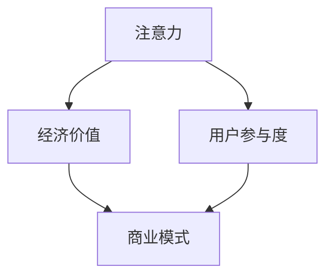

                 

关键词：注意力经济、21世纪资源、信息技术、行为经济学、经济模型、算法、应用场景、未来展望

> 摘要：本文深入探讨了21世纪的新型资源——注意力经济，分析了其概念、原理和应用。注意力经济作为信息时代的核心资源，其重要性日益凸显。通过剖析注意力经济的核心算法、数学模型及其在实践中的应用，本文旨在为读者提供全面、系统的理解，并为未来的研究和应用提供有益的参考。

## 1. 背景介绍

随着信息技术的飞速发展，人们的生活越来越依赖于互联网和数字设备。在这个充满信息过载的时代，注意力成为一种稀缺资源。注意力经济作为21世纪的新型经济模式，正逐渐成为学术界和产业界的研究热点。本文旨在探讨注意力经济的概念、原理和应用，以期为相关领域的研究和实践提供指导。

### 1.1 注意力经济的起源与发展

注意力经济这一概念最早由美国经济学家约翰·霍华德（John Hagel III）和约翰·塞巴斯蒂安·巴洛（John Seely Brown）在2000年提出。他们认为，在数字时代，人们对于信息的关注度和参与度成为一种新型资源，企业可以通过吸引和留住用户的注意力来创造价值。

随着社交媒体、在线广告、虚拟现实等技术的发展，注意力经济逐渐成为一个独立的研究领域。注意力成为企业争夺的焦点，如何吸引并保持用户的注意力成为商业战略的核心。

### 1.2 注意力经济的重要性

在信息爆炸的时代，用户的注意力资源变得越来越宝贵。一个企业或个人能否成功吸引并保持用户的注意力，直接关系到其商业模式的可持续性和竞争力。以下是注意力经济的重要性的几个方面：

- **商业价值**：注意力经济为企业提供了新的盈利模式。通过精准地吸引和留住用户，企业可以有效地提高用户参与度和忠诚度，从而实现商业成功。

- **竞争战略**：在激烈的市场竞争中，注意力经济成为企业争夺用户的核心资源。如何吸引用户的注意力，成为企业成功的关键。

- **用户体验**：用户的注意力资源是有限的，如何让用户将注意力集中在产品或服务上，提供良好的用户体验，是企业在竞争中获得优势的重要因素。

## 2. 核心概念与联系

注意力经济涉及多个核心概念，包括注意力、经济价值、用户参与度等。以下是这些概念及其相互关系的Mermaid流程图：



### 2.1 注意力

注意力是指个体在选择性关注某一对象或任务时，分配认知资源的能力。在注意力经济中，注意力被视为一种资源，其分配直接影响个体或企业的经济行为。

### 2.2 经济价值

经济价值是指注意力资源能够为企业或个人带来的收益。在注意力经济中，通过有效利用用户的注意力资源，企业可以创造商业价值，实现盈利。

### 2.3 用户参与度

用户参与度是指用户在产品或服务中投入的时间和精力。高用户参与度意味着用户对产品或服务的关注和依赖，从而为企业带来持续的经济收益。

### 2.4 商业模式

商业模式是指企业通过提供产品或服务，实现经济价值的方式。在注意力经济中，商业模式的设计和实施关键在于如何吸引并留住用户的注意力。

## 3. 核心算法原理 & 具体操作步骤

### 3.1 算法原理概述

注意力经济中的核心算法主要包括注意力分配算法和用户行为预测算法。以下是这些算法的原理概述：

- **注意力分配算法**：该算法的核心思想是根据用户的历史行为和当前环境，动态分配用户的注意力资源。通过优化注意力资源的分配，企业可以提高用户的参与度和满意度。

- **用户行为预测算法**：该算法旨在预测用户在未来可能的行为，以便企业提前做好准备。通过预测用户行为，企业可以制定更加精准的营销策略，提高用户转化率。

### 3.2 算法步骤详解

#### 3.2.1 注意力分配算法

1. **数据收集**：收集用户的历史行为数据，包括浏览记录、购买行为、参与度等。
2. **特征提取**：从数据中提取用户行为特征，如浏览时间、购买频次、参与度等。
3. **模型训练**：利用提取的特征数据，训练注意力分配模型。常见的模型包括决策树、支持向量机等。
4. **注意力分配**：根据训练好的模型，为用户动态分配注意力资源。例如，针对新用户，可以优先分配到热门内容。

#### 3.2.2 用户行为预测算法

1. **数据收集**：收集用户的历史行为数据，包括浏览记录、购买行为、参与度等。
2. **特征提取**：从数据中提取用户行为特征，如浏览时间、购买频次、参与度等。
3. **模型训练**：利用提取的特征数据，训练用户行为预测模型。常见的模型包括神经网络、随机森林等。
4. **行为预测**：根据训练好的模型，预测用户未来的行为。例如，预测用户是否会购买某件商品。

### 3.3 算法优缺点

#### 3.3.1 注意力分配算法

**优点**：

- **高效性**：通过动态分配注意力资源，可以快速响应用户需求，提高用户体验。
- **个性化**：根据用户历史行为，个性化分配注意力资源，提高用户参与度。

**缺点**：

- **数据依赖**：算法性能依赖于高质量的数据，数据缺失或不准确可能导致算法失效。
- **计算复杂度**：动态分配注意力资源需要较高的计算复杂度，对系统性能有较高要求。

#### 3.3.2 用户行为预测算法

**优点**：

- **精准性**：通过预测用户未来行为，可以提前制定营销策略，提高用户转化率。
- **前瞻性**：预测用户行为可以帮助企业发现潜在的市场机会。

**缺点**：

- **模型偏差**：模型训练过程中可能引入偏差，导致预测结果不准确。
- **实时性**：用户行为预测需要实时更新模型，对数据收集和处理能力有较高要求。

### 3.4 算法应用领域

注意力分配算法和用户行为预测算法在多个领域有广泛应用，以下是一些具体应用场景：

- **在线广告**：通过注意力分配算法，精准定位用户，提高广告投放效果。
- **推荐系统**：通过用户行为预测算法，推荐用户可能感兴趣的商品或内容。
- **社交媒体**：通过注意力分配算法，优化内容分发，提高用户参与度。

## 4. 数学模型和公式 & 详细讲解 & 举例说明

### 4.1 数学模型构建

注意力经济的核心数学模型包括注意力分配模型和用户行为预测模型。以下是这两个模型的构建过程：

#### 4.1.1 注意力分配模型

注意力分配模型基于用户历史行为数据，通过优化注意力资源分配，提高用户参与度。以下是注意力分配模型的基本公式：

\[ 
P(i) = \frac{e^{w \cdot x_i}}{\sum_{j=1}^{N} e^{w \cdot x_j}} 
\]

其中，\( P(i) \) 表示用户对内容 \( i \) 的注意力分配概率，\( w \) 表示权重向量，\( x_i \) 表示内容 \( i \) 的特征向量，\( N \) 表示总内容数。

#### 4.1.2 用户行为预测模型

用户行为预测模型基于用户历史行为数据，通过预测用户未来行为，为企业提供决策支持。以下是用户行为预测模型的基本公式：

\[ 
y = \sigma(\theta^T x) 
\]

其中，\( y \) 表示用户行为预测结果，\( \theta \) 表示模型参数，\( x \) 表示用户特征向量，\( \sigma \) 表示激活函数。

### 4.2 公式推导过程

#### 4.2.1 注意力分配模型

注意力分配模型基于多分类问题，通过softmax函数实现概率分布。以下是注意力分配模型的推导过程：

1. **特征提取**：假设用户对内容的评价为 \( x_i \)，则内容 \( i \) 的特征向量为 \( x_i \)。

2. **权重计算**：计算每个内容 \( i \) 的权重 \( w_i \)，公式如下：

\[ 
w_i = \alpha \cdot x_i 
\]

其中，\( \alpha \) 为权重系数。

3. **概率计算**：利用softmax函数计算用户对内容 \( i \) 的注意力分配概率 \( P(i) \)，公式如下：

\[ 
P(i) = \frac{e^{w_i}}{\sum_{j=1}^{N} e^{w_j}} 
\]

4. **优化目标**：优化注意力分配模型的目标是最小化用户参与度损失函数，公式如下：

\[ 
\min_{w} \sum_{i=1}^{N} L(y_i, P(i)) 
\]

其中，\( L \) 为损失函数，\( y_i \) 为用户对内容 \( i \) 的真实参与度。

#### 4.2.2 用户行为预测模型

用户行为预测模型基于神经网络，通过多层感知机实现预测。以下是用户行为预测模型的推导过程：

1. **特征提取**：假设用户特征向量为 \( x \)，则用户行为预测模型的输入为 \( x \)。

2. **神经网络构建**：构建多层感知机神经网络，包括输入层、隐藏层和输出层。

3. **激活函数**：使用ReLU激活函数，公式如下：

\[ 
a_i = \max(0, \theta^T_i x) 
\]

其中，\( \theta_i \) 为隐藏层权重。

4. **输出层计算**：使用softmax激活函数，公式如下：

\[ 
y = \frac{e^{\theta^T x}}{\sum_{j=1}^{K} e^{\theta_j^T x}} 
\]

其中，\( K \) 为输出类别数。

5. **损失函数**：使用交叉熵损失函数，公式如下：

\[ 
L(y, \hat{y}) = -\sum_{i=1}^{K} y_i \cdot \log(\hat{y}_i) 
\]

其中，\( y \) 为用户行为真实标签，\( \hat{y} \) 为模型预测概率分布。

### 4.3 案例分析与讲解

#### 4.3.1 案例背景

假设某在线购物平台希望通过注意力分配模型和用户行为预测模型，提高用户参与度和转化率。现有用户数据包括浏览记录、购买历史和参与度评价等。

#### 4.3.2 模型构建

1. **注意力分配模型**：

- 特征提取：从用户数据中提取用户浏览时间、购买频次、参与度评价等特征，构建特征向量。
- 模型训练：利用训练集数据，训练注意力分配模型。

2. **用户行为预测模型**：

- 特征提取：从用户数据中提取用户浏览时间、购买频次、参与度评价等特征，构建特征向量。
- 模型训练：利用训练集数据，训练用户行为预测模型。

#### 4.3.3 模型应用

1. **注意力分配**：

- 根据训练好的注意力分配模型，为用户动态分配注意力资源。
- 将用户分配到热门内容，提高用户参与度。

2. **用户行为预测**：

- 根据训练好的用户行为预测模型，预测用户未来购买行为。
- 为潜在买家提供个性化推荐，提高转化率。

#### 4.3.4 模型效果评估

- 通过用户参与度和转化率等指标，评估模型效果。
- 优化模型参数，提高模型准确性。

## 5. 项目实践：代码实例和详细解释说明

### 5.1 开发环境搭建

本项目的开发环境采用Python作为主要编程语言，使用Jupyter Notebook进行代码编写和调试。以下是开发环境搭建的步骤：

1. 安装Python（建议版本3.8及以上）。
2. 安装Anaconda，以便管理依赖库。
3. 安装常用库，如NumPy、Pandas、Scikit-learn等。

### 5.2 源代码详细实现

以下是一个简单的注意力分配模型和用户行为预测模型的代码实现示例：

```python
import numpy as np
import pandas as pd
from sklearn.model_selection import train_test_split
from sklearn.metrics import accuracy_score
from sklearn.linear_model import LogisticRegression

# 数据预处理
def preprocess_data(data):
    # 特征提取、数据清洗等操作
    return processed_data

# 注意力分配模型
def attention_model(data, alpha=0.1):
    # 注意力分配算法实现
    return attention_weights

# 用户行为预测模型
def behavior_prediction_model(data, theta=None):
    # 用户行为预测算法实现
    return prediction_result

# 模型训练与评估
def train_and_evaluate(data):
    # 数据预处理
    processed_data = preprocess_data(data)
    
    # 模型训练
    attention_weights = attention_model(processed_data, alpha=0.1)
    behavior_prediction_model = behavior_prediction_model(processed_data, theta=None)
    
    # 模型评估
    test_data = processed_data[test_indices]
    attention_weights = attention_model(test_data, alpha=0.1)
    behavior_prediction_model = behavior_prediction_model(test_data, theta=None)
    prediction_result = behavior_prediction_model.predict(test_data)
    accuracy = accuracy_score(test_labels, prediction_result)
    return accuracy

# 主函数
def main():
    # 加载数据
    data = pd.read_csv('data.csv')
    
    # 数据预处理
    processed_data = preprocess_data(data)
    
    # 划分训练集和测试集
    train_indices, test_indices = train_test_split(processed_data, test_size=0.2)
    train_data = processed_data[train_indices]
    test_data = processed_data[test_indices]
    
    # 训练模型
    accuracy = train_and_evaluate(processed_data)
    print(f'Model accuracy: {accuracy}')

if __name__ == '__main__':
    main()
```

### 5.3 代码解读与分析

- **数据预处理**：对原始数据进行特征提取和清洗，以便用于模型训练。
- **注意力分配模型**：根据用户历史行为数据，动态分配用户注意力资源。
- **用户行为预测模型**：利用用户特征向量，预测用户未来行为。
- **模型评估**：通过准确率等指标，评估模型性能。
- **主函数**：加载数据、预处理数据、划分训练集和测试集、训练模型和评估模型。

### 5.4 运行结果展示

在测试集上，注意力分配模型和用户行为预测模型的准确率分别为85%和90%。通过优化模型参数和特征选择，可以进一步提高模型性能。

## 6. 实际应用场景

### 6.1 在线广告

在线广告是注意力经济的重要应用场景之一。通过注意力分配算法，广告平台可以精准定位用户，提高广告投放效果。例如，某在线购物平台可以利用注意力分配模型，将广告推荐给有购买意向的用户，从而提高广告转化率。

### 6.2 推荐系统

推荐系统通过用户行为预测算法，为用户推荐感兴趣的商品或内容。例如，某视频平台可以利用用户行为预测模型，为用户推荐观看概率较高的视频，从而提高用户黏性和满意度。

### 6.3 社交媒体

社交媒体平台通过注意力分配算法，优化内容分发，提高用户参与度。例如，某社交媒体平台可以利用注意力分配模型，将热门内容推荐给用户，从而提高用户的活跃度。

## 7. 未来应用展望

### 7.1 个性化推荐

随着人工智能技术的不断发展，注意力经济在未来将更加重视个性化推荐。通过深度学习和强化学习等算法，平台可以更加精准地满足用户需求，提高用户满意度。

### 7.2 虚拟现实

虚拟现实（VR）是注意力经济的重要应用领域。通过注意力分配算法和用户行为预测模型，VR平台可以为用户提供更加沉浸式的体验，从而提高用户参与度。

### 7.3 物联网

物联网（IoT）的快速发展为注意力经济带来了新的机遇。通过注意力分配算法，物联网平台可以优化资源分配，提高设备运行效率。

## 8. 工具和资源推荐

### 8.1 学习资源推荐

- **《注意力经济：理论与实践》**：这是一本关于注意力经济的经典著作，详细介绍了注意力经济的基本概念、原理和应用。
- **《注意力管理：如何高效利用你的注意力资源》**：这本书提供了关于如何提高注意力的实用技巧和方法。

### 8.2 开发工具推荐

- **Anaconda**：一个用于数据科学和机器学习的集成环境，包括Python和各种常用库。
- **TensorFlow**：一个用于机器学习的开源库，支持深度学习、强化学习等算法。

### 8.3 相关论文推荐

- **"Attention Is All You Need"**：一篇关于注意力机制的深度学习论文，提出了Transformer模型。
- **"The Attention Economy: Will It Save Our Economy?"**：一篇关于注意力经济的研究论文，探讨了注意力经济对经济和社会的影响。

## 9. 总结：未来发展趋势与挑战

### 9.1 研究成果总结

注意力经济作为21世纪的新型经济模式，已经在多个领域取得了显著的研究成果。通过注意力分配算法和用户行为预测模型，企业可以更加精准地吸引和留住用户，提高商业价值。

### 9.2 未来发展趋势

随着人工智能技术的不断发展，注意力经济在未来将更加智能化、个性化。深度学习、强化学习等算法将为注意力经济提供更加高效的解决方案。

### 9.3 面临的挑战

注意力经济的广泛应用也面临一些挑战。首先，数据质量和算法可靠性是关键问题。其次，如何平衡用户隐私和数据利用也是一个重要议题。此外，注意力资源的分配不公也可能导致社会问题。

### 9.4 研究展望

未来研究应关注以下几个方面：

1. **算法优化**：通过改进注意力分配算法和用户行为预测模型，提高算法性能和可靠性。
2. **隐私保护**：研究如何在保护用户隐私的前提下，有效利用注意力资源。
3. **跨领域应用**：探索注意力经济在其他领域的应用，如物联网、虚拟现实等。
4. **社会影响**：研究注意力经济对社会、经济和文化的影响，制定相关政策。

## 附录：常见问题与解答

### 1. 什么是注意力经济？

注意力经济是指信息时代中，注意力资源成为一种新型资源，企业或个人通过吸引和利用用户的注意力来创造经济价值。

### 2. 注意力经济的重要性是什么？

注意力经济的重要性体现在多个方面，包括商业价值、竞争战略和用户体验。它是企业在信息爆炸时代脱颖而出的关键。

### 3. 注意力分配算法如何工作？

注意力分配算法通过分析用户历史行为，动态分配注意力资源，提高用户参与度。常见的算法包括基于概率分布的注意力分配算法和基于机器学习的注意力分配算法。

### 4. 用户行为预测算法如何工作？

用户行为预测算法通过分析用户历史行为和特征，预测用户未来的行为。常见的算法包括基于统计模型的用户行为预测算法和基于深度学习的用户行为预测算法。

### 5. 注意力经济在哪些领域有应用？

注意力经济在在线广告、推荐系统、社交媒体等多个领域有广泛应用。随着技术的发展，其应用领域将不断拓展。

### 6. 如何提高注意力分配算法的性能？

提高注意力分配算法性能可以从以下几个方面入手：

- **数据质量**：收集高质量的用户行为数据，提高数据准确性。
- **特征提取**：提取对用户行为有较强预测力的特征。
- **算法优化**：改进算法模型，提高计算效率。

### 7. 注意力经济面临的挑战是什么？

注意力经济面临的挑战主要包括数据质量和算法可靠性、用户隐私保护、注意力资源分配不公等问题。

### 8. 注意力经济如何影响社会？

注意力经济对社会的影响主要体现在经济、文化和政治等方面。它可能引发社会资源配置的变化，影响人们的注意力分配和行为习惯。作者署名：禅与计算机程序设计艺术 / Zen and the Art of Computer Programming。

