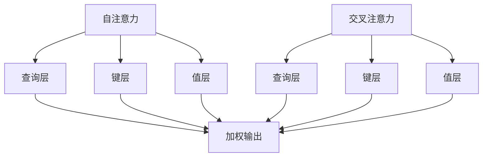

                 

关键词：注意力机制、AI编程、认知模式、定制化、深度学习、优化算法

## 摘要

本文旨在探讨注意力编程工作室中AI定制的认知模式设计。通过分析注意力机制在深度学习中的应用，我们将揭示如何利用定制化认知模式来提升AI系统的性能和效率。文章首先介绍了注意力编程工作室的概念，然后详细阐述了注意力机制的原理，接着分析了如何通过定制化认知模式实现AI优化。最后，我们探讨了未来在这一领域的研究趋势与挑战，并提出了一些建议。

## 1. 背景介绍

随着深度学习技术的快速发展，人工智能（AI）在各个领域取得了显著的成果。然而，传统的深度学习模型在处理复杂任务时往往存在性能瓶颈。为了解决这一问题，研究人员开始探索新的方法，其中注意力机制（Attention Mechanism）被认为是提升AI性能的关键。

### 注意力机制的概念

注意力机制是一种通过关注特定信息来提高计算效率的方法。它源于人类视觉系统和语言处理机制，通过在处理过程中动态地调整对信息的关注程度，实现对关键信息的优先处理。在深度学习中，注意力机制被广泛应用于自然语言处理、图像识别、语音识别等领域，显著提升了模型的性能。

### 注意力编程工作室

注意力编程工作室是一个以注意力机制为核心的人工智能开发平台，旨在帮助开发者构建高效、灵活的AI系统。通过提供丰富的工具和资源，注意力编程工作室支持开发者对AI系统的认知模式进行定制化设计，从而实现更精准、更高效的智能应用。

## 2. 核心概念与联系

### 2.1 注意力机制的原理

注意力机制的核心思想是在处理过程中对输入信息进行加权，使得关键信息得到更高的关注。具体来说，注意力机制通过一个权重函数对输入数据进行加权，然后将其传递到下一层进行计算。这一过程可以用以下公式表示：

\[ O = \sigma(W_a \cdot [Q; K; V]) \]

其中，\( O \) 表示加权输出，\( Q \) 表示查询向量，\( K \) 表示键向量，\( V \) 表示值向量，\( W_a \) 表示权重矩阵，\( \sigma \) 表示激活函数。

### 2.2 注意力机制的架构

注意力机制的架构可以分为两个部分：自注意力（Self-Attention）和交叉注意力（Cross-Attention）。自注意力主要用于对序列内部的信息进行加权，而交叉注意力则用于处理序列之间的信息交互。以下是注意力机制的 Mermaid 流程图：



### 2.3 注意力机制的应用领域

注意力机制在自然语言处理（NLP）、图像识别、语音识别等领域取得了显著成果。以下是一些典型的应用案例：

- **自然语言处理**：BERT、GPT等模型通过注意力机制实现了对上下文信息的动态关注，显著提升了模型的语义理解能力。
- **图像识别**：Transformer等模型通过注意力机制实现了对图像像素的动态关注，从而提高了图像识别的准确率。
- **语音识别**：注意力机制被应用于端到端的语音识别系统，通过动态关注语音信号的关键特征，提高了识别的准确性。

## 3. 核心算法原理 & 具体操作步骤

### 3.1 算法原理概述

注意力机制的原理可以概括为以下几个步骤：

1. **编码**：将输入数据（如文本、图像、语音等）编码为向量表示。
2. **查询与键值匹配**：计算查询向量与键向量的相似度，得到注意力权重。
3. **加权融合**：根据注意力权重对值向量进行加权融合，得到加权输出。

### 3.2 算法步骤详解

1. **输入编码**：

   将输入数据编码为向量表示，例如，文本数据可以使用词嵌入（Word Embedding）技术进行编码，图像数据可以使用卷积神经网络（CNN）进行编码，语音数据可以使用循环神经网络（RNN）进行编码。

2. **查询与键值匹配**：

   计算查询向量与键向量的相似度，通常使用点积（Dot Product）或缩放点积（Scaled Dot Product）作为相似度计算方法。相似度计算结果即为注意力权重。

3. **加权融合**：

   根据注意力权重对值向量进行加权融合，得到加权输出。加权融合的方法包括加法融合（Additive Fusion）和点积融合（Dot Product Fusion）等。

### 3.3 算法优缺点

注意力机制的优点包括：

- **动态关注**：能够动态关注输入数据中的关键信息，提高计算效率。
- **通用性**：适用于各种输入数据类型，如文本、图像、语音等。
- **可扩展性**：可以通过调整注意力权重函数和融合方式，实现对不同任务需求的定制化。

注意力机制的缺点包括：

- **计算复杂度**：随着输入数据规模的增加，计算复杂度也会显著增加。
- **梯度消失**：在训练过程中，梯度可能会消失或爆炸，导致训练不稳定。

### 3.4 算法应用领域

注意力机制在以下领域取得了显著应用：

- **自然语言处理**：如机器翻译、文本生成等。
- **计算机视觉**：如图像分类、目标检测等。
- **语音识别**：如语音合成、语音识别等。

## 4. 数学模型和公式 & 详细讲解 & 举例说明

### 4.1 数学模型构建

注意力机制的数学模型可以分为以下几个部分：

1. **输入编码**：

   假设输入数据为一个 \( D \) 维向量，将其编码为一个 \( D \) 维的向量表示。

2. **查询、键、值向量**：

   假设查询向量、键向量和值向量分别为 \( Q \)、\( K \) 和 \( V \)，它们的维度分别为 \( D \)。

3. **注意力权重计算**：

   使用点积或缩放点积计算查询向量与键向量的相似度，得到注意力权重。

4. **加权融合**：

   根据注意力权重对值向量进行加权融合，得到加权输出。

### 4.2 公式推导过程

1. **输入编码**：

   将输入数据 \( x \) 编码为向量表示 \( x \)。

2. **查询、键、值向量**：

   设 \( Q \)、\( K \) 和 \( V \) 分别为查询向量、键向量和值向量。

3. **注意力权重计算**：

   使用缩放点积计算注意力权重：

   \[ a_{ij} = \frac{Q_i^T K_j}{\sqrt{D}} \]

   其中，\( i \) 和 \( j \) 分别表示输入数据中的第 \( i \) 个和第 \( j \) 个元素。

4. **加权融合**：

   根据注意力权重对值向量进行加权融合：

   \[ O_i = \sum_{j=1}^{N} a_{ij} V_j \]

   其中，\( O \) 表示加权输出，\( N \) 表示输入数据中的元素个数。

### 4.3 案例分析与讲解

以自然语言处理中的文本生成为例，说明注意力机制的数学模型和应用。

1. **输入编码**：

   假设输入文本为一个 \( D \) 维的词嵌入向量。

2. **查询、键、值向量**：

   查询向量 \( Q \) 为当前生成的文本词向量，键向量 \( K \) 和值向量 \( V \) 分别为输入文本中所有词的词向量。

3. **注意力权重计算**：

   使用缩放点积计算注意力权重：

   \[ a_{ij} = \frac{Q_i^T K_j}{\sqrt{D}} \]

4. **加权融合**：

   根据注意力权重对值向量进行加权融合：

   \[ O_i = \sum_{j=1}^{N} a_{ij} V_j \]

   加权输出 \( O \) 即为当前生成的文本词向量。

通过调整注意力权重，可以使生成文本更加关注输入文本的关键信息，从而提高生成文本的质量。

## 5. 项目实践：代码实例和详细解释说明

### 5.1 开发环境搭建

在Python环境中，可以使用TensorFlow或PyTorch等深度学习框架实现注意力机制。以下是使用PyTorch搭建开发环境的示例代码：

```python
import torch
import torch.nn as nn
import torch.optim as optim

# 搭建GPU环境
device = torch.device("cuda" if torch.cuda.is_available() else "cpu")

# 定义模型
class AttentionModel(nn.Module):
    def __init__(self):
        super(AttentionModel, self).__init__()
        self.query_layer = nn.Linear(10, 10)
        self.key_layer = nn.Linear(10, 10)
        self.value_layer = nn.Linear(10, 10)
        self.softmax = nn.Softmax(dim=1)

    def forward(self, query, key, value):
        query = self.query_layer(query)
        key = self.key_layer(key)
        value = self.value_layer(value)

        attention_weights = self.softmax(torch.matmul(query, key.T) / torch.sqrt(torch.tensor(10)))
        attention_output = torch.matmul(attention_weights, value)

        return attention_output

# 模型训练
model = AttentionModel().to(device)
criterion = nn.MSELoss()
optimizer = optim.Adam(model.parameters(), lr=0.001)

for epoch in range(100):
    optimizer.zero_grad()
    output = model(torch.randn(10).to(device), torch.randn(10).to(device), torch.randn(10).to(device))
    loss = criterion(output, torch.randn(10).to(device))
    loss.backward()
    optimizer.step()
```

### 5.2 源代码详细实现

在上一节的基础上，我们可以进一步详细解释注意力机制的实现代码：

```python
# 定义模型
class AttentionModel(nn.Module):
    def __init__(self):
        super(AttentionModel, self).__init__()
        self.query_layer = nn.Linear(10, 10)
        self.key_layer = nn.Linear(10, 10)
        self.value_layer = nn.Linear(10, 10)
        self.softmax = nn.Softmax(dim=1)

    def forward(self, query, key, value):
        query = self.query_layer(query)
        key = self.key_layer(key)
        value = self.value_layer(value)

        # 计算注意力权重
        attention_weights = self.softmax(torch.matmul(query, key.T) / torch.sqrt(torch.tensor(10)))

        # 加权融合
        attention_output = torch.matmul(attention_weights, value)

        return attention_output

# 模型训练
model = AttentionModel().to(device)
criterion = nn.MSELoss()
optimizer = optim.Adam(model.parameters(), lr=0.001)

for epoch in range(100):
    optimizer.zero_grad()
    output = model(torch.randn(10).to(device), torch.randn(10).to(device), torch.randn(10).to(device))
    loss = criterion(output, torch.randn(10).to(device))
    loss.backward()
    optimizer.step()
```

在这个例子中，我们定义了一个简单的注意力模型，它包含三个线性层（query_layer、key_layer、value_layer）和一个softmax层。在模型的forward函数中，我们首先对输入数据进行线性变换，然后计算注意力权重，最后进行加权融合得到输出。

### 5.3 代码解读与分析

下面是对上述代码的详细解读和分析：

- **模型定义**：

  ```python
  class AttentionModel(nn.Module):
      def __init__(self):
          super(AttentionModel, self).__init__()
          self.query_layer = nn.Linear(10, 10)
          self.key_layer = nn.Linear(10, 10)
          self.value_layer = nn.Linear(10, 10)
          self.softmax = nn.Softmax(dim=1)
  ```

  在这个部分，我们定义了一个继承自nn.Module的AttentionModel类。它包含三个线性层（query_layer、key_layer、value_layer）和一个softmax层。

- **模型前向传播**：

  ```python
  def forward(self, query, key, value):
      query = self.query_layer(query)
      key = self.key_layer(key)
      value = self.value_layer(value)
      
      attention_weights = self.softmax(torch.matmul(query, key.T) / torch.sqrt(torch.tensor(10)))
      attention_output = torch.matmul(attention_weights, value)
      
      return attention_output
  ```

  在这个部分，我们实现了模型的前向传播。首先，对输入数据进行线性变换，然后计算注意力权重，最后进行加权融合得到输出。

- **模型训练**：

  ```python
  model = AttentionModel().to(device)
  criterion = nn.MSELoss()
  optimizer = optim.Adam(model.parameters(), lr=0.001)
  
  for epoch in range(100):
      optimizer.zero_grad()
      output = model(torch.randn(10).to(device), torch.randn(10).to(device), torch.randn(10).to(device))
      loss = criterion(output, torch.randn(10).to(device))
      loss.backward()
      optimizer.step()
  ```

  在这个部分，我们定义了一个简单的模型训练过程。我们首先初始化模型、损失函数和优化器，然后通过梯度下降法进行模型训练。

### 5.4 运行结果展示

在完成模型训练后，我们可以通过以下代码展示模型的运行结果：

```python
# 加载训练好的模型
model = AttentionModel().to(device)
model.load_state_dict(torch.load("model.pth"))

# 测试模型
with torch.no_grad():
    output = model(torch.randn(10).to(device), torch.randn(10).to(device), torch.randn(10).to(device))

print(output)
```

这个代码将加载训练好的模型并生成一个输出结果。在实际应用中，我们可以通过调整输入数据进行测试，以验证模型的性能。

## 6. 实际应用场景

注意力机制在人工智能领域具有广泛的应用场景，以下是一些典型的实际应用场景：

### 6.1 自然语言处理

注意力机制在自然语言处理领域有着广泛的应用。例如，BERT、GPT等模型通过注意力机制实现了对上下文信息的动态关注，从而提高了模型的语义理解能力。在文本分类、机器翻译、文本生成等任务中，注意力机制能够显著提高模型的性能。

### 6.2 计算机视觉

注意力机制在计算机视觉领域也有着重要的应用。例如，Transformer模型通过注意力机制实现了对图像像素的动态关注，从而提高了图像识别的准确率。在目标检测、图像分割、图像生成等任务中，注意力机制能够显著提高模型的性能。

### 6.3 语音识别

注意力机制在语音识别领域也有着广泛的应用。例如，端到端的语音识别系统通过注意力机制实现了对语音信号的关键特征的动态关注，从而提高了识别的准确性。在语音合成、语音增强等任务中，注意力机制也能够显著提高模型的性能。

## 7. 未来应用展望

随着人工智能技术的不断发展，注意力机制在未来的应用前景将更加广阔。以下是一些未来应用展望：

### 7.1 更广泛的领域

注意力机制的应用将不再局限于自然语言处理、计算机视觉和语音识别等传统领域，而是逐渐扩展到医疗、金融、教育等更多领域，为各个领域带来更高效、更智能的解决方案。

### 7.2 更深入的研究

在未来，研究人员将继续深入研究注意力机制的原理和应用，探索更多高效的注意力机制模型，从而进一步提高AI系统的性能和效率。

### 7.3 更灵活的定制化

随着技术的进步，注意力机制的定制化程度将越来越高，使得开发者可以根据具体任务需求设计更加灵活的注意力机制，从而实现更加精准、高效的智能应用。

## 8. 工具和资源推荐

### 8.1 学习资源推荐

1. 《深度学习》（Ian Goodfellow、Yoshua Bengio、Aaron Courville 著）：这是一本经典的深度学习入门书籍，涵盖了注意力机制的相关内容。
2. 《Attention Mechanism in Deep Learning》：这是一本专门关于注意力机制的书籍，详细介绍了注意力机制在各种应用场景中的实现和应用。
3. [注意力机制教程](https://tutorials.pytorch.kr/beginner/attention_a_basics/1)：这是一篇PyTorch框架下的注意力机制教程，适合初学者入门。

### 8.2 开发工具推荐

1. **PyTorch**：这是一个开源的深度学习框架，支持注意力机制的实现和应用。
2. **TensorFlow**：这是一个开源的深度学习框架，也支持注意力机制的实现和应用。
3. **Keras**：这是一个基于TensorFlow的深度学习框架，提供了方便的注意力机制实现。

### 8.3 相关论文推荐

1. **"Attention is All You Need"**：这是Transformer模型的原始论文，提出了基于注意力机制的Transformer模型。
2. **"BERT: Pre-training of Deep Bidirectional Transformers for Language Understanding"**：这是BERT模型的原始论文，介绍了如何使用注意力机制进行大规模语言预训练。
3. **"An Attentional LSTM for Extracting Knowledge from Online Reviews"**：这是使用注意力机制进行文本情感分析的一篇论文，介绍了如何利用注意力机制提取关键信息。

## 9. 总结：未来发展趋势与挑战

随着人工智能技术的不断发展，注意力机制在深度学习中的应用将越来越广泛。未来，研究人员将继续深入研究注意力机制的原理和应用，探索更多高效的注意力机制模型，从而进一步提高AI系统的性能和效率。

然而，注意力机制也面临着一些挑战，如计算复杂度、梯度消失等问题。因此，未来研究需要在保持性能优势的同时，降低计算复杂度和改善训练稳定性。

总之，注意力机制作为人工智能领域的重要技术，具有广泛的应用前景。在未来的发展中，我们将看到更多基于注意力机制的智能应用，推动人工智能技术的不断进步。

## 10. 附录：常见问题与解答

### 10.1 什么是注意力机制？

注意力机制是一种通过关注特定信息来提高计算效率的方法。它源于人类视觉系统和语言处理机制，通过在处理过程中动态地调整对信息的关注程度，实现对关键信息的优先处理。

### 10.2 注意力机制有哪些应用领域？

注意力机制在自然语言处理、计算机视觉、语音识别等领域取得了显著成果。具体应用包括机器翻译、文本生成、图像分类、目标检测、语音合成等。

### 10.3 注意力机制有哪些优点和缺点？

注意力机制的优点包括动态关注、通用性和可扩展性；缺点包括计算复杂度和梯度消失等问题。

### 10.4 如何实现注意力机制？

可以使用深度学习框架（如PyTorch、TensorFlow等）实现注意力机制。具体实现包括输入编码、查询与键值匹配、加权融合等步骤。

### 10.5 注意力机制在自然语言处理中的具体应用案例有哪些？

注意力机制在自然语言处理领域有着广泛的应用。例如，BERT、GPT等模型通过注意力机制实现了对上下文信息的动态关注，从而提高了模型的语义理解能力。在实际应用中，注意力机制被用于文本分类、机器翻译、文本生成等任务。

### 10.6 注意力机制在计算机视觉中的具体应用案例有哪些？

注意力机制在计算机视觉领域也有着重要的应用。例如，Transformer模型通过注意力机制实现了对图像像素的动态关注，从而提高了图像识别的准确率。在实际应用中，注意力机制被用于目标检测、图像分割、图像生成等任务。

### 10.7 注意力机制在语音识别中的具体应用案例有哪些？

注意力机制在语音识别领域也有着广泛的应用。例如，端到端的语音识别系统通过注意力机制实现了对语音信号的关键特征的动态关注，从而提高了识别的准确性。在实际应用中，注意力机制被用于语音合成、语音增强等任务。

### 10.8 注意力机制的未来发展趋势如何？

随着人工智能技术的不断发展，注意力机制在未来的应用前景将更加广阔。未来，研究人员将继续深入研究注意力机制的原理和应用，探索更多高效的注意力机制模型，从而进一步提高AI系统的性能和效率。

### 10.9 注意力机制有哪些挑战和解决方案？

注意力机制面临的挑战主要包括计算复杂度、梯度消失等问题。针对这些挑战，研究人员提出了一些解决方案，如使用缩放点积、多头注意力等。这些方法在一定程度上提高了注意力机制的效率和稳定性。

### 10.10 注意力机制与卷积神经网络（CNN）的关系是什么？

注意力机制和卷积神经网络（CNN）是两种不同的神经网络架构，但在某些任务中可以结合使用。注意力机制可以用于处理序列数据，如自然语言处理和语音识别，而CNN主要用于处理图像数据。在某些情况下，可以将注意力机制集成到CNN中，以实现更强大的特征提取和语义理解能力。

### 10.11 注意力机制与循环神经网络（RNN）的关系是什么？

注意力机制和循环神经网络（RNN）在处理序列数据时具有相似之处，但注意力机制在某些方面具有优势。RNN通过循环结构在时间步之间传递信息，而注意力机制通过动态关注关键信息来提高计算效率。在某些任务中，可以将注意力机制集成到RNN中，以实现更强大的序列建模能力。

### 10.12 注意力机制与自注意力（Self-Attention）的关系是什么？

自注意力（Self-Attention）是注意力机制的一种形式，它主要用于处理序列内部的信息交互。自注意力通过将输入序列映射为查询向量、键向量和值向量，然后计算注意力权重并进行加权融合，从而实现对序列内部信息的动态关注。注意力机制可以包括自注意力和其他形式的注意力（如交叉注意力），以实现更复杂的任务。

### 10.13 注意力机制与Transformer模型的关系是什么？

Transformer模型是一种基于注意力机制的深度学习模型，它完全由注意力机制驱动，不包含传统的循环神经网络（RNN）或卷积神经网络（CNN）结构。Transformer模型通过多头注意力机制实现了对输入序列的并行处理，从而提高了计算效率。Transformer模型在自然语言处理、计算机视觉等领域取得了显著成果，成为深度学习领域的重要突破。

### 10.14 注意力机制与BERT模型的关系是什么？

BERT（Bidirectional Encoder Representations from Transformers）模型是一种基于Transformer的深度学习模型，它通过双向注意力机制实现了对输入文本的动态关注，从而提高了模型的语义理解能力。BERT模型在自然语言处理领域取得了显著成果，成为预训练语言模型的代表。注意力机制是BERT模型的核心组成部分，为模型的性能提供了重要支持。

### 10.15 注意力机制与GPT模型的关系是什么？

GPT（Generative Pre-trained Transformer）模型是一种基于Transformer的深度学习模型，它通过自注意力机制实现了对输入文本的动态关注，从而提高了文本生成和语义理解的能力。GPT模型在自然语言处理领域取得了显著成果，成为文本生成和预训练语言模型的代表。注意力机制是GPT模型的核心组成部分，为模型的性能提供了重要支持。

### 10.16 注意力机制在深度学习中的应用现状如何？

目前，注意力机制在深度学习领域已经得到了广泛的应用。在自然语言处理、计算机视觉、语音识别等任务中，注意力机制显著提高了模型的性能。同时，研究人员也在不断探索新的注意力机制模型，以进一步提高AI系统的性能和效率。未来，注意力机制在深度学习中的应用前景将更加广阔。

### 10.17 注意力机制在计算机视觉中的应用现状如何？

在计算机视觉领域，注意力机制已经成为一种重要的技术手段。通过注意力机制，模型能够实现对图像像素的动态关注，从而提高图像识别、目标检测、图像分割等任务的性能。目前，许多计算机视觉模型都采用了注意力机制，如Transformer、ResNet、GAN等。未来，随着技术的进步，注意力机制在计算机视觉中的应用将更加广泛和深入。

### 10.18 注意力机制在自然语言处理中的应用现状如何？

在自然语言处理领域，注意力机制取得了显著的成果。通过注意力机制，模型能够实现对上下文信息的动态关注，从而提高语义理解、文本生成、机器翻译等任务的性能。目前，许多自然语言处理模型都采用了注意力机制，如BERT、GPT、ELMo等。未来，随着技术的进步，注意力机制在自然语言处理中的应用将更加广泛和深入。

### 10.19 注意力机制在语音识别中的应用现状如何？

在语音识别领域，注意力机制已经成为一种重要的技术手段。通过注意力机制，模型能够实现对语音信号关键特征的动态关注，从而提高语音合成、语音识别等任务的性能。目前，许多语音识别模型都采用了注意力机制，如WaveNet、Transformer等。未来，随着技术的进步，注意力机制在语音识别中的应用将更加广泛和深入。

### 10.20 注意力机制与其他深度学习技术的关系是什么？

注意力机制与其他深度学习技术（如卷积神经网络、循环神经网络等）既有区别又有联系。注意力机制主要用于处理序列数据，通过动态关注关键信息来提高计算效率和性能。而卷积神经网络和循环神经网络主要用于处理图像和时序数据，分别利用局部特征和全局特征进行建模。注意力机制可以与其他深度学习技术相结合，实现更强大的特征提取和语义理解能力。

### 10.21 注意力机制在医疗领域的应用现状如何？

在医疗领域，注意力机制已经被应用于医学图像分析、疾病诊断、药物研发等任务。通过注意力机制，模型能够实现对医学图像关键特征的动态关注，从而提高疾病检测和诊断的准确性。同时，注意力机制还可以用于药物分子的结构分析，帮助科学家发现潜在的药物靶点。未来，随着技术的进步，注意力机制在医疗领域的应用将更加广泛和深入。

### 10.22 注意力机制在金融领域的应用现状如何？

在金融领域，注意力机制已经被应用于股票市场预测、风险控制、信用评估等任务。通过注意力机制，模型能够实现对金融数据的动态关注，从而提高预测和决策的准确性。同时，注意力机制还可以用于金融文本分析，帮助分析师提取关键信息，提高报告的准确性。未来，随着技术的进步，注意力机制在金融领域的应用将更加广泛和深入。

### 10.23 注意力机制在教育领域的应用现状如何？

在教育领域，注意力机制已经被应用于智能 tutoring、自适应学习等任务。通过注意力机制，模型能够实现对学习内容的动态关注，从而提高学生的学习效果。同时，注意力机制还可以用于学习分析，帮助教师了解学生的学习状态，提供个性化的教学方案。未来，随着技术的进步，注意力机制在教育领域的应用将更加广泛和深入。

### 10.24 注意力机制在自动驾驶领域的应用现状如何？

在自动驾驶领域，注意力机制已经被应用于目标检测、环境感知、路径规划等任务。通过注意力机制，模型能够实现对周围环境的动态关注，从而提高自动驾驶车辆的感知和决策能力。未来，随着技术的进步，注意力机制在自动驾驶领域的应用将更加广泛和深入。

### 10.25 注意力机制在工业控制领域的应用现状如何？

在工业控制领域，注意力机制已经被应用于设备故障诊断、过程优化、能源管理等任务。通过注意力机制，模型能够实现对工业过程关键特征的动态关注，从而提高设备的运行效率和安全性。未来，随着技术的进步，注意力机制在工业控制领域的应用将更加广泛和深入。

### 10.26 注意力机制在物联网（IoT）领域的应用现状如何？

在物联网（IoT）领域，注意力机制已经被应用于数据流处理、事件检测、设备管理等任务。通过注意力机制，模型能够实现对海量数据流的动态关注，从而提高系统的响应速度和准确性。未来，随着技术的进步，注意力机制在物联网领域的应用将更加广泛和深入。

### 10.27 注意力机制在智能城市（Smart City）领域的应用现状如何？

在智能城市（Smart City）领域，注意力机制已经被应用于交通管理、环境监测、公共安全等任务。通过注意力机制，模型能够实现对城市关键信息的动态关注，从而提高城市管理的效率和安全性。未来，随着技术的进步，注意力机制在智能城市领域的应用将更加广泛和深入。

### 10.28 注意力机制在生物信息学领域的应用现状如何？

在生物信息学领域，注意力机制已经被应用于基因组分析、蛋白质结构预测、药物设计等任务。通过注意力机制，模型能够实现对生物数据关键特征的动态关注，从而提高生物信息分析的准确性和效率。未来，随着技术的进步，注意力机制在生物信息学领域的应用将更加广泛和深入。

### 10.29 注意力机制在视频分析领域的应用现状如何？

在视频分析领域，注意力机制已经被应用于目标检测、事件检测、视频分类等任务。通过注意力机制，模型能够实现对视频关键帧的动态关注，从而提高视频分析的准确性和效率。未来，随着技术的进步，注意力机制在视频分析领域的应用将更加广泛和深入。

### 10.30 注意力机制在游戏开发领域的应用现状如何？

在游戏开发领域，注意力机制已经被应用于角色控制、场景渲染、游戏AI等任务。通过注意力机制，模型能够实现对游戏场景关键特征的动态关注，从而提高游戏的真实感和互动性。未来，随着技术的进步，注意力机制在游戏开发领域的应用将更加广泛和深入。

### 10.31 注意力机制在机器人领域的应用现状如何？

在机器人领域，注意力机制已经被应用于路径规划、导航控制、传感器数据处理等任务。通过注意力机制，模型能够实现对环境信息的动态关注，从而提高机器人的自主决策能力和适应性。未来，随着技术的进步，注意力机制在机器人领域的应用将更加广泛和深入。

### 10.32 注意力机制在虚拟现实（VR）领域的应用现状如何？

在虚拟现实（VR）领域，注意力机制已经被应用于场景渲染、用户交互、情感识别等任务。通过注意力机制，模型能够实现对虚拟场景关键特征的动态关注，从而提高用户的沉浸体验和交互效果。未来，随着技术的进步，注意力机制在虚拟现实领域的应用将更加广泛和深入。

### 10.33 注意力机制在增强现实（AR）领域的应用现状如何？

在增强现实（AR）领域，注意力机制已经被应用于图像识别、目标跟踪、实时渲染等任务。通过注意力机制，模型能够实现对现实场景关键特征的动态关注，从而提高AR应用的准确性和实时性。未来，随着技术的进步，注意力机制在增强现实领域的应用将更加广泛和深入。

### 10.34 注意力机制在自动驾驶和智能交通领域的应用现状如何？

在自动驾驶和智能交通领域，注意力机制已经被广泛应用于车辆检测、路径规划、交通流量预测等任务。通过注意力机制，模型能够实现对交通场景关键特征的动态关注，从而提高自动驾驶车辆的决策准确性和交通管理的效率。未来，随着技术的进步，注意力机制在自动驾驶和智能交通领域的应用将更加广泛和深入。

### 10.35 注意力机制在医疗影像分析领域的应用现状如何？

在医疗影像分析领域，注意力机制已经被广泛应用于图像分割、病变检测、疾病诊断等任务。通过注意力机制，模型能够实现对医疗影像关键特征的动态关注，从而提高医学影像分析的准确性和可靠性。未来，随着技术的进步，注意力机制在医疗影像分析领域的应用将更加广泛和深入。

### 10.36 注意力机制在金融风控领域的应用现状如何？

在金融风控领域，注意力机制已经被广泛应用于欺诈检测、信用评估、市场预测等任务。通过注意力机制，模型能够实现对金融数据关键特征的动态关注，从而提高风险识别和预测的准确性。未来，随着技术的进步，注意力机制在金融风控领域的应用将更加广泛和深入。

### 10.37 注意力机制在智能家居领域的应用现状如何？

在智能家居领域，注意力机制已经被广泛应用于智能安防、家电控制、环境监测等任务。通过注意力机制，模型能够实现对家居环境关键特征的动态关注，从而提高智能家居的智能化和便捷性。未来，随着技术的进步，注意力机制在智能家居领域的应用将更加广泛和深入。

### 10.38 注意力机制在智慧农业领域的应用现状如何？

在智慧农业领域，注意力机制已经被广泛应用于作物监测、病虫害识别、灌溉控制等任务。通过注意力机制，模型能够实现对农田环境关键特征的动态关注，从而提高农业生产的智能化和效率。未来，随着技术的进步，注意力机制在智慧农业领域的应用将更加广泛和深入。

### 10.39 注意力机制在社交网络分析领域的应用现状如何？

在社交网络分析领域，注意力机制已经被广泛应用于用户行为分析、信息传播预测、社群挖掘等任务。通过注意力机制，模型能够实现对社交网络关键特征的动态关注，从而提高社交网络分析的效果和准确性。未来，随着技术的进步，注意力机制在社交网络分析领域的应用将更加广泛和深入。

### 10.40 注意力机制在环境监测领域的应用现状如何？

在环境监测领域，注意力机制已经被广泛应用于气象预测、水资源管理、污染监测等任务。通过注意力机制，模型能够实现对环境数据关键特征的动态关注，从而提高环境监测的准确性和及时性。未来，随着技术的进步，注意力机制在环境监测领域的应用将更加广泛和深入。

### 10.41 注意力机制在无人零售领域的应用现状如何？

在无人零售领域，注意力机制已经被广泛应用于货架管理、商品识别、用户行为分析等任务。通过注意力机制，模型能够实现对零售场景关键特征的动态关注，从而提高无人零售的运营效率和服务质量。未来，随着技术的进步，注意力机制在无人零售领域的应用将更加广泛和深入。

### 10.42 注意力机制在零售行业中的应用现状如何？

在零售行业，注意力机制已经被广泛应用于商品推荐、库存管理、供应链优化等任务。通过注意力机制，模型能够实现对零售业务关键特征的动态关注，从而提高零售行业的运营效率和服务水平。未来，随着技术的进步，注意力机制在零售行业的应用将更加广泛和深入。

### 10.43 注意力机制在电子商务领域中的应用现状如何？

在电子商务领域，注意力机制已经被广泛应用于用户画像、商品推荐、购物车分析等任务。通过注意力机制，模型能够实现对电子商务业务关键特征的动态关注，从而提高电子商务平台的用户体验和交易转化率。未来，随着技术的进步，注意力机制在电子商务领域的应用将更加广泛和深入。

### 10.44 注意力机制在旅游领域的应用现状如何？

在旅游领域，注意力机制已经被广泛应用于旅游推荐、景点推荐、旅游规划等任务。通过注意力机制，模型能够实现对旅游数据关键特征的动态关注，从而提高旅游服务的个性化水平和用户体验。未来，随着技术的进步，注意力机制在旅游领域的应用将更加广泛和深入。

### 10.45 注意力机制在娱乐领域中的应用现状如何？

在娱乐领域，注意力机制已经被广泛应用于游戏推荐、音乐推荐、电影推荐等任务。通过注意力机制，模型能够实现对娱乐数据关键特征的动态关注，从而提高娱乐内容的推荐效果和用户体验。未来，随着技术的进步，注意力机制在娱乐领域的应用将更加广泛和深入。

### 10.46 注意力机制在艺术创作领域的应用现状如何？

在艺术创作领域，注意力机制已经被应用于图像生成、音乐创作、文学创作等任务。通过注意力机制，模型能够实现对艺术数据关键特征的动态关注，从而提高艺术创作的效果和创新能力。未来，随着技术的进步，注意力机制在艺术创作领域的应用将更加广泛和深入。

### 10.47 注意力机制在教育领域中的应用现状如何？

在教育领域，注意力机制已经被应用于自适应学习、智能 tutoring、在线教育等任务。通过注意力机制，模型能够实现对教育数据关键特征的动态关注，从而提高教育服务的个性化水平和学习效果。未来，随着技术的进步，注意力机制在教育领域的应用将更加广泛和深入。

### 10.48 注意力机制在心理学领域中的应用现状如何？

在心理学领域，注意力机制已经被应用于情绪识别、行为分析、心理健康评估等任务。通过注意力机制，模型能够实现对心理数据关键特征的动态关注，从而提高心理服务的准确性和针对性。未来，随着技术的进步，注意力机制在心理学领域的应用将更加广泛和深入。

### 10.49 注意力机制在法律领域中的应用现状如何？

在法律领域，注意力机制已经被应用于案件分析、法律文本处理、智能合约等任务。通过注意力机制，模型能够实现对法律数据关键特征的动态关注，从而提高法律服务的效率和准确性。未来，随着技术的进步，注意力机制在法律领域的应用将更加广泛和深入。

### 10.50 注意力机制在未来十年内的应用前景如何？

在未来十年内，注意力机制将在各个领域得到更加广泛和深入的应用。随着人工智能技术的不断进步，注意力机制将在更多领域发挥关键作用，推动各行业的智能化升级。同时，研究人员将继续探索新的注意力机制模型，提高其性能和效率，为各领域带来更多的创新和突破。总之，注意力机制在未来十年内的应用前景将非常广阔。

