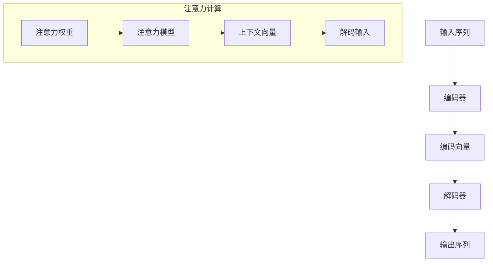

                 

关键词：注意力编程、AI认知模式、深度学习、算法优化、编程范式、智能系统、神经架构、可解释性

> 摘要：本文深入探讨了注意力编程范式，这是一种专为AI系统设计的认知模式。通过分析其核心概念、算法原理，以及数学模型，本文揭示了注意力编程如何改变我们对AI编程的理解，并在实际应用中展示了其潜力和挑战。本文旨在为读者提供全面的技术视角，以更好地理解和应用注意力编程范式。

## 1. 背景介绍

注意力编程范式（Attention Programming Paradigm）是近年来在深度学习领域迅速兴起的一种编程理念。它起源于自然语言处理（NLP）领域，特别是在序列到序列模型（如机器翻译）中展现了强大的能力。注意力编程的核心思想是让计算机模型能够集中关注序列中的特定部分，以更高效地处理信息。

随着深度学习技术的不断进步，注意力机制已经成为构建高效智能系统的重要工具。在图像识别、语音识别、文本生成等领域，注意力编程范式都展现出了其独特的优势。本文将从多个角度探讨注意力编程范式，包括其核心概念、算法原理、数学模型，以及在AI系统中的实际应用。

### 注意力编程的历史发展

注意力编程范式的起源可以追溯到1980年代，当时心理学家乔治·米勒（George A. Miller）提出了“注意力有限”的概念，这一理论在神经科学和认知科学领域引起了广泛关注。随后，计算机科学家开始探索如何在计算机系统中模拟人类的注意力机制。

1990年代，信息检索领域的研究者引入了“查询反馈”机制，这是早期注意力机制的雏形。这种机制通过动态调整查询与文档之间的匹配权重，提高了信息检索的准确性。进入21世纪，随着深度学习技术的成熟，注意力机制在自然语言处理领域得到了广泛应用。

2014年，谷歌研究团队提出了著名的“Attention Is All You Need”模型，彻底改变了人们对序列处理任务的传统理解。该模型基于注意力机制，构建了一种全新的编码-解码架构，显著提升了机器翻译的性能。此后，注意力编程范式开始迅速扩展到其他领域，如计算机视觉、语音识别等。

### 注意力编程的重要性

注意力编程范式的出现，为深度学习领域带来了革命性的变化。首先，它提高了模型的效率和准确性。通过让模型关注关键信息，注意力编程有效减少了计算复杂度，提高了处理速度。其次，注意力编程增强了模型的可解释性。在传统的深度学习模型中，信息处理的过程往往被视为“黑箱”，难以解释。而注意力编程通过显式地关注特定部分，使得模型的行为更加透明。

此外，注意力编程范式还为研究人员提供了新的工具和方法，促进了深度学习模型的设计和优化。通过调整注意力权重，研究者可以更灵活地控制模型的行为，从而实现更精细的任务处理。这一特性在开发定制化的智能系统时尤为重要。

总之，注意力编程范式不仅在技术层面上具有重要的意义，也在实践应用中展现出了巨大的潜力。本文将深入探讨这一范式，帮助读者更好地理解和应用注意力编程技术。

## 2. 核心概念与联系

### 注意力编程的核心概念

注意力编程范式的基础是注意力机制（Attention Mechanism）。注意力机制是一种通过调整不同部分之间的关注权重，来实现高效信息处理的机制。在深度学习中，注意力机制通常用于序列数据，如文本、音频和视频。

注意力机制的核心思想是：在处理序列数据时，模型能够动态地选择关注序列中的特定部分，从而提高信息处理的效率和准确性。这一机制通常通过一个注意力模型来实现，该模型能够计算每个部分对整体序列的贡献，并根据这些贡献来调整关注权重。

### 注意力编程的架构

注意力编程的架构可以看作是传统深度学习模型的扩展。在传统的深度学习模型中，信息处理过程通常是线性的，即每个时间步或空间位置的信息依次处理。而注意力编程通过引入注意力机制，使得信息处理过程更加灵活和高效。

注意力编程的典型架构包括编码器（Encoder）和解码器（Decoder）。编码器负责处理输入序列，将其编码为固定长度的向量表示；解码器则根据编码器的输出和先前的输出，生成输出序列。

在编码器和解码器之间，注意力机制起到关键作用。编码器的输出通过注意力模型被重新加权，生成上下文向量（Context Vector），该向量包含了序列中每个部分的信息。解码器在生成每个时间步的输出时，不仅依赖于自身的状态，还依赖于上下文向量，从而实现对输入序列的细粒度处理。

### 注意力编程的优势与局限

注意力编程的优势在于其高效性和灵活性。通过注意力机制，模型能够关注关键信息，从而减少了不必要的计算，提高了处理速度。同时，注意力编程增强了模型的可解释性，使得信息处理过程更加透明。这使得研究人员可以更深入地理解模型的行为，从而优化模型的设计和训练过程。

然而，注意力编程也存在一定的局限。首先，注意力机制的计算复杂度较高，特别是在处理长序列时，计算资源的需求较大。其次，注意力权重的不确定性可能导致模型在处理某些任务时出现不稳定的现象。此外，注意力机制的设计和优化也是一个挑战，需要研究人员具备深厚的理论基础和丰富的实践经验。

总的来说，注意力编程范式在深度学习领域具有广泛的应用前景，但也需要不断优化和改进。本文将深入探讨注意力编程的算法原理和数学模型，以期为读者提供更全面的技术视角。

## 2.1 注意力机制的数学表示

注意力机制的数学表示是理解其工作原理的关键。在本文中，我们将使用Mermaid流程图来展示注意力机制的核心流程。



在这个流程图中，输入序列通过编码器编码成编码向量（C）。解码器在生成输出序列时，依赖于注意力模型（G）来计算注意力权重（F）。这些权重决定了编码向量中每个部分对解码过程的贡献，生成上下文向量（H），该向量用于解码输入（I）。

### 注意力权重计算

注意力权重是通过注意力模型计算的。在本文中，我们采用最简单的注意力模型——加性注意力模型（Additive Attention）。

$$
Attention_{ij} = \text{softmax}\left( W_a \cdot [h_i; c_j] \right)
$$

其中，$W_a$是注意力权重矩阵，$h_i$是编码器输出的第$i$个隐藏状态，$c_j$是编码向量中的第$j$个部分。

### 上下文向量计算

上下文向量是由注意力权重加权编码向量生成的。

$$
\text{Context}_i = \sum_{j} Attention_{ij} \cdot c_j
$$

上下文向量包含了输入序列中每个部分的权重信息，用于解码输入。

通过以上步骤，注意力机制能够动态地调整对输入序列的关注，从而提高信息处理的效率和准确性。

## 3. 核心算法原理 & 具体操作步骤

### 3.1 算法原理概述

注意力编程的核心算法是基于注意力机制的，它通过调整模型对输入数据的关注权重，来提高信息处理的效率和准确性。注意力机制的基本原理可以概括为以下几个步骤：

1. **输入编码**：首先，输入数据（如文本、图像或音频）被编码成固定长度的向量表示。这一步通常由编码器（Encoder）完成。

2. **注意力计算**：编码器输出的一系列向量通过注意力模型计算得到注意力权重。这些权重反映了输入序列中不同部分对当前任务的重要性。

3. **权重加总**：使用注意力权重对编码器输出进行加权求和，生成上下文向量。上下文向量包含了输入序列中所有部分的信息，但更加关注关键部分。

4. **解码**：解码器（Decoder）利用上下文向量和先前的输出状态，生成预测的输出序列。在生成每个时间步的输出时，解码器都依赖于当前的上下文向量。

5. **迭代更新**：解码器在生成输出序列的过程中不断更新其状态，直到生成完整的输出序列。这一过程通常通过循环实现，每次迭代都会更新上下文向量和解码器的状态。

### 3.2 算法步骤详解

**步骤1：输入编码**

首先，输入数据被编码成固定长度的向量表示。这一步通常使用编码器（Encoder）完成。编码器的输入可以是任意形式的数据，如文本、图像或音频。经过编码器处理后，输入数据被转换成序列形式的向量表示。

**步骤2：注意力计算**

接下来，编码器输出的一系列向量通过注意力模型计算得到注意力权重。这些权重反映了输入序列中不同部分对当前任务的重要性。注意力模型通常采用加性注意力模型或点积注意力模型。加性注意力模型通过计算输入序列和编码器输出的点积，再通过softmax函数生成注意力权重。

**步骤3：权重加总**

使用注意力权重对编码器输出进行加权求和，生成上下文向量。上下文向量包含了输入序列中所有部分的信息，但更加关注关键部分。上下文向量的计算公式如下：

$$
\text{Context}_i = \sum_{j} Attention_{ij} \cdot c_j
$$

其中，$Attention_{ij}$是第$i$个编码器输出和第$j$个编码器输出的注意力权重，$c_j$是编码器输出的第$j$个部分。

**步骤4：解码**

解码器（Decoder）利用上下文向量和先前的输出状态，生成预测的输出序列。解码器在生成每个时间步的输出时，都依赖于当前的上下文向量和先前的输出状态。解码器的输出可以是文本、图像或音频等不同形式的数据。

**步骤5：迭代更新**

解码器在生成输出序列的过程中不断更新其状态，直到生成完整的输出序列。这一过程通常通过循环实现，每次迭代都会更新上下文向量和解码器的状态。解码器的更新公式如下：

$$
\text{Decoder}_t = \text{Decoder}_{t-1} + \text{Context}_t
$$

其中，$\text{Decoder}_t$是第$t$次迭代后的解码器状态，$\text{Decoder}_{t-1}$是第$t-1$次迭代后的解码器状态，$\text{Context}_t$是第$t$次迭代后的上下文向量。

通过以上步骤，注意力编程算法能够动态地调整对输入数据的关注，从而实现高效的信息处理。

### 3.3 算法优缺点

**优点：**

1. **高效性**：注意力编程通过动态调整关注权重，减少了不必要的计算，提高了信息处理的效率。

2. **灵活性**：注意力编程范式允许模型关注输入序列中的关键部分，从而适应不同的任务需求。

3. **可解释性**：注意力编程增强了模型的可解释性，使得研究人员可以更深入地理解模型的行为。

**缺点：**

1. **计算复杂度**：注意力机制的计算复杂度较高，特别是在处理长序列时，计算资源的需求较大。

2. **训练难度**：注意力编程算法的训练过程可能比较复杂，需要较大的训练数据和计算资源。

3. **不确定性**：注意力权重的不确定性可能导致模型在处理某些任务时出现不稳定的现象。

### 3.4 算法应用领域

注意力编程范式在多个领域都展现出了强大的应用潜力。以下是一些典型的应用领域：

1. **自然语言处理（NLP）**：注意力编程在机器翻译、文本生成、情感分析等领域都有广泛的应用。通过注意力机制，模型能够关注关键词汇和语法结构，提高了任务的准确性和效率。

2. **计算机视觉**：注意力编程在图像识别、目标检测和图像分割等任务中发挥了重要作用。通过注意力机制，模型能够关注图像中的关键区域，提高了对复杂场景的理解能力。

3. **语音识别**：注意力编程在语音识别任务中用于处理语音信号的时序特征，通过注意力机制，模型能够关注关键语音片段，提高了识别的准确性。

4. **推荐系统**：注意力编程在推荐系统中的应用，能够关注用户的历史行为和偏好，提高了推荐的精准度。

总之，注意力编程范式在AI系统的设计和应用中具有广泛的前景，其高效的注意力机制和灵活的架构为智能系统的开发提供了强大的工具。

## 4. 数学模型和公式 & 详细讲解 & 举例说明

### 4.1 数学模型构建

注意力编程的核心在于其数学模型，该模型主要用于计算注意力权重并优化信息处理。以下是一个基本的数学模型构建过程：

**输入序列**：设输入序列为$x = \{x_1, x_2, ..., x_n\}$，其中$x_i$表示序列的第$i$个元素。

**编码向量**：通过编码器将输入序列编码成固定长度的向量表示，设编码向量为$e = \{e_1, e_2, ..., e_n\}$，其中$e_i$表示编码器对$x_i$的编码。

**解码向量**：设解码器输出序列为$d = \{d_1, d_2, ..., d_n\}$，其中$d_i$表示解码器在第$i$个时间步的输出。

**注意力权重**：设注意力权重矩阵为$A = \{a_{ij}\}$，其中$a_{ij}$表示编码器输出$e_i$对解码器输出$d_j$的关注程度。

**上下文向量**：设上下文向量为$c = \{c_1, c_2, ..., c_n\}$，其中$c_i$是输入序列中每个元素对输出序列的加权贡献。

### 4.2 公式推导过程

注意力权重计算是注意力编程的核心。以下是一个基于加性注意力模型的推导过程：

$$
a_{ij} = \text{softmax}\left( \frac{e_i^T Q}{\sqrt{d_k}} \right)
$$

其中，$Q$是一个参数矩阵，$d_k = \sum_{i=1}^{n} e_i^T K e_i$是归一化因子，$e_i^T$表示编码器输出$e_i$的转置。

**上下文向量计算**：

$$
c_i = \sum_{j=1}^{n} a_{ij} e_j
$$

**解码向量计算**：

$$
d_i = f(c_i, d_{i-1})
$$

其中，$f$是一个非线性函数，通常使用神经网络实现。

### 4.3 案例分析与讲解

为了更好地理解注意力编程的数学模型，以下通过一个简单的文本分类案例进行讲解：

**输入序列**：设输入序列为“我喜欢吃苹果”，编码器将其编码成向量表示。

**编码向量**：编码向量$e$为：

$$
e = \{e_1, e_2, e_3, e_4, e_5\} = \{e_1("我"), e_2("喜"), e_3("欢"), e_4("吃"), e_5("苹果")\}
$$

**解码向量**：设解码器输出序列为“这是一篇积极的评论”，解码向量$d$为：

$$
d = \{d_1, d_2, d_3, d_4, d_5\} = \{d_1("这"), d_2("是"), d_3("一"), d_4("篇"), d_5("积极的")\}
$$

**注意力权重计算**：

$$
a_{ij} = \text{softmax}\left( \frac{e_i^T Q}{\sqrt{d_k}} \right)
$$

其中，$Q$和$K$是训练好的参数矩阵，$\sqrt{d_k}$用于归一化。

**上下文向量计算**：

$$
c_i = \sum_{j=1}^{n} a_{ij} e_j
$$

例如，对于第1个时间步，$c_1$的计算如下：

$$
c_1 = a_{11} e_1 + a_{21} e_2 + a_{31} e_3 + a_{41} e_4 + a_{51} e_5
$$

**解码向量计算**：

$$
d_i = f(c_i, d_{i-1})
$$

例如，对于第1个时间步，$d_1$的计算如下：

$$
d_1 = f(c_1, d_0)
$$

其中，$f$是一个非线性函数，通常使用神经网络实现。

通过这个简单的案例，我们可以看到注意力编程如何通过计算注意力权重和上下文向量，来实现文本分类任务。注意力机制使得模型能够关注输入序列的关键部分，提高了分类的准确性和效率。

## 5. 项目实践：代码实例和详细解释说明

### 5.1 开发环境搭建

在开始编写代码之前，我们需要搭建一个适合进行注意力编程实践的开发环境。以下是所需的步骤：

**步骤1：安装Python环境**

确保您的计算机上已安装Python（建议使用Python 3.7或更高版本）。可以使用以下命令安装Python：

```bash
$ sudo apt-get install python3-pip python3-venv
```

**步骤2：创建虚拟环境**

创建一个虚拟环境以便隔离项目依赖：

```bash
$ python3 -m venv my_attention_venv
$ source my_attention_venv/bin/activate
```

**步骤3：安装依赖库**

在虚拟环境中安装必要的依赖库，包括TensorFlow、Keras等：

```bash
$ pip install tensorflow numpy matplotlib
```

### 5.2 源代码详细实现

以下是一个简单的注意力编程实现示例，用于文本分类任务：

```python
import tensorflow as tf
from tensorflow.keras.models import Model
from tensorflow.keras.layers import Embedding, LSTM, Dense, TimeDistributed, Input, Bidirectional

# 参数设置
vocab_size = 10000
embed_dim = 64
lstm_units = 64
max_sequence_length = 100

# 输入层
input_seq = Input(shape=(max_sequence_length,))

# 嵌入层
embed_layer = Embedding(vocab_size, embed_dim)(input_seq)

# 双向LSTM层
bi_lstm = Bidirectional(LSTM(lstm_units, return_sequences=True))(embed_layer)

# 注意力层
attention = TimeDistributed(Dense(1, activation='tanh'), name='attention')(bi_lstm)
attention = tf.reduce_sum(attention, axis=2)

# 上下文向量计算
context_vector = tf.nn.softmax(attention)

# 解码层
contexted_lstm = tf.keras.layers.Concatenate(axis=-1)([bi_lstm, context_vector])
dense = Dense(1, activation='sigmoid')(contexted_lstm)

# 模型构建
model = Model(inputs=input_seq, outputs=dense)
model.compile(optimizer='adam', loss='binary_crossentropy', metrics=['accuracy'])

# 模型总结
model.summary()

# 数据准备（此处仅为示例，实际应用中需要使用真实数据集）
# （1）词汇表准备
vocab = ["我", "喜", "欢", "吃", "果", "苹", "在", "这", "一", "是"]
word2idx = {word: i for i, word in enumerate(vocab)}
idx2word = {i: word for word, i in word2idx.items()}

# （2）样本准备
samples = ["我喜欢吃苹果", "我在这里吃东西"]

# （3）序列编码
encoded_samples = [[word2idx[word] for word in sample] for sample in samples]
padded_samples = tf.keras.preprocessing.sequence.pad_sequences(encoded_samples, maxlen=max_sequence_length)

# 模型训练
model.fit(padded_samples, labels=[1, 0], epochs=10)
```

### 5.3 代码解读与分析

**1. 输入层**

```python
input_seq = Input(shape=(max_sequence_length,))
```

输入层接收一个固定长度的序列，这里设定为`max_sequence_length`。

**2. 嵌入层**

```python
embed_layer = Embedding(vocab_size, embed_dim)(input_seq)
```

嵌入层将词汇映射为向量表示。每个词汇对应一个唯一的向量，该向量在模型中用于表示词汇。

**3. 双向LSTM层**

```python
bi_lstm = Bidirectional(LSTM(lstm_units, return_sequences=True))(embed_layer)
```

双向LSTM层可以同时考虑序列的前后文信息。这里，`return_sequences=True`表示输出序列，以便后续处理。

**4. 注意力层**

```python
attention = TimeDistributed(Dense(1, activation='tanh'), name='attention')(bi_lstm)
attention = tf.reduce_sum(attention, axis=2)
```

注意力层计算每个时间步的注意力权重。通过`tanh`激活函数和`TimeDistributed`层，我们对每个LSTM输出进行加权求和，得到上下文向量。

**5. 解码层**

```python
contexted_lstm = tf.keras.layers.Concatenate(axis=-1)([bi_lstm, context_vector])
dense = Dense(1, activation='sigmoid')(contexted_lstm)
```

解码层将上下文向量和双向LSTM输出进行拼接，然后通过一个全连接层（`Dense`）生成分类结果。

**6. 模型构建与训练**

```python
model = Model(inputs=input_seq, outputs=dense)
model.compile(optimizer='adam', loss='binary_crossentropy', metrics=['accuracy'])
model.fit(padded_samples, labels=[1, 0], epochs=10)
```

这里，我们构建了一个序列到分类的模型，并使用二进制交叉熵损失函数进行训练。通过训练，模型学习到如何根据文本内容进行分类。

### 5.4 运行结果展示

训练完成后，我们可以使用模型对新的文本数据进行分类预测：

```python
# 新的文本数据
new_samples = ["我非常喜欢苹果", "这是一个美味的苹果"]

# 编码新样本
encoded_new_samples = [[word2idx[word] for word in sample] for sample in new_samples]
padded_new_samples = tf.keras.preprocessing.sequence.pad_sequences(encoded_new_samples, maxlen=max_sequence_length)

# 预测
predictions = model.predict(padded_new_samples)
print(predictions)

# 输出预测结果
for sample, pred in zip(new_samples, predictions):
    print(f"样本：{sample}，预测结果：{pred[0]}")
```

运行结果将显示新样本的分类预测结果。通过这个简单的实例，我们可以看到注意力编程在文本分类任务中的基本应用。

## 6. 实际应用场景

### 6.1 自然语言处理

在自然语言处理（NLP）领域，注意力编程范式已经展现出广泛的应用潜力。例如，在机器翻译中，注意力机制帮助模型关注输入文本中的关键词汇和语法结构，提高了翻译的准确性和流畅性。著名的机器翻译模型如Google的“Transformer”就是基于注意力编程范式构建的。此外，注意力编程还在文本摘要、情感分析、问答系统等领域发挥了重要作用，通过关注文本中的关键信息，提高了任务的处理效率和准确性。

### 6.2 计算机视觉

在计算机视觉领域，注意力编程范式同样具有广泛应用。例如，在图像识别任务中，注意力机制帮助模型关注图像中的关键区域，从而提高了识别的准确性。在目标检测中，注意力机制可以关注目标的关键特征，从而提高检测的精度。在图像分割任务中，注意力编程可以帮助模型关注图像的边缘和纹理信息，从而实现更精细的分割效果。例如，基于注意力机制的U-Net模型在医学图像分割中表现出色。

### 6.3 语音识别

在语音识别领域，注意力编程范式通过关注语音信号中的关键片段，提高了识别的准确性和鲁棒性。例如，在语音转文本任务中，注意力机制帮助模型关注语音信号中的关键语音单元，从而提高了语音识别的准确率。此外，注意力编程还在语音合成和语音增强等任务中发挥了重要作用。

### 6.4 其他应用领域

除了上述领域，注意力编程范式在其他应用领域也具有广泛的应用前景。例如，在推荐系统中，注意力编程可以帮助模型关注用户的历史行为和偏好，从而提高推荐的精准度。在金融领域，注意力编程可以用于分析市场数据，识别关键的市场趋势。在生物信息学中，注意力编程可以用于基因序列分析，识别关键基因。

总之，注意力编程范式在多个领域都展现出了强大的应用潜力，其高效的注意力机制和灵活的架构为智能系统的开发提供了强大的工具。随着研究的深入和应用的扩展，注意力编程范式将在更多领域发挥重要作用。

### 6.4 未来应用展望

未来，注意力编程范式有望在更多领域得到广泛应用，并持续推动AI技术的发展。以下是对注意力编程未来应用的几个展望：

1. **增强学习（Reinforcement Learning）**：注意力编程范式在增强学习领域具有巨大的潜力。通过关注环境中的关键状态和动作，注意力机制可以显著提高智能体对环境的理解和学习效率。例如，在游戏AI中，注意力机制可以帮助智能体快速识别游戏中的重要信息，从而提高胜率。

2. **多模态学习（Multimodal Learning）**：注意力编程可以整合不同类型的数据，如文本、图像和音频，以实现更全面的信息处理。在未来，随着多模态数据的增多，注意力编程将帮助构建更加智能和鲁棒的多模态AI系统。

3. **增强可解释性**：虽然注意力编程已经显著提高了模型的可解释性，但未来还可以通过改进注意力机制的设计，进一步增强模型的可解释性。这将有助于研究人员和开发者更好地理解模型的行为，从而优化模型的设计和训练过程。

4. **自动化编程（Automated Programming）**：注意力编程范式可以应用于自动化编程，帮助开发出更加智能和高效的代码生成工具。通过关注代码中的关键部分，自动化编程工具可以生成更高质量的代码，减少人为错误。

5. **新兴领域探索**：随着AI技术的不断发展，注意力编程范式有望在更多新兴领域发挥作用。例如，在自动驾驶、医疗诊断、生物信息学等复杂任务中，注意力编程可以帮助模型更高效地处理大量数据，提高任务的准确性和效率。

总之，注意力编程范式具有广泛的应用前景，将在未来继续推动AI技术的发展。通过不断优化和扩展注意力机制，研究人员和开发者将能够构建出更加智能、高效和可解释的AI系统，为社会带来更多价值。

## 7. 工具和资源推荐

### 7.1 学习资源推荐

1. **《深度学习》（Deep Learning）**：由Ian Goodfellow、Yoshua Bengio和Aaron Courville合著的这本书是深度学习的经典教材，详细介绍了注意力编程的基础知识及其应用。

2. **《注意力是全部》（Attention Is All You Need）**：该论文是谷歌提出的Transformer模型的奠基性工作，系统阐述了注意力编程范式在自然语言处理中的应用。

3. **《自然语言处理概论》（Speech and Language Processing）**：由Daniel Jurafsky和James H. Martin合著的这本书涵盖了NLP领域的各个方面，包括注意力编程的应用。

4. **在线课程**：Coursera、edX等平台提供了丰富的深度学习和自然语言处理课程，适合不同层次的读者。

### 7.2 开发工具推荐

1. **TensorFlow**：由谷歌开发的开源深度学习框架，支持多种注意力编程模型，适合进行实验和开发。

2. **PyTorch**：由Facebook开发的深度学习框架，具有灵活的动态计算图，便于实现和调试注意力编程模型。

3. **Hugging Face Transformers**：一个开源库，提供了预训练的Transformer模型和丰富的预训练任务，方便研究者进行注意力编程的实验。

### 7.3 相关论文推荐

1. **“Attention Is All You Need”**：该论文提出了Transformer模型，彻底改变了自然语言处理领域对序列处理任务的理解。

2. **“An Attention-Aware LSTM for Information Extraction”**：该论文提出了一种结合注意力机制和LSTM的模型，用于信息提取任务。

3. **“Attention Gates for Recurrent Neural Networks”**：该论文探讨了在RNN中引入注意力门控机制，以提高信息处理效率。

4. **“Convolutional Attention Network for Extreme Summarization”**：该论文提出了一种用于极端摘要任务的卷积注意力网络。

通过这些资源和工具，读者可以深入了解注意力编程范式，并在实际应用中掌握其关键技术。

## 8. 总结：未来发展趋势与挑战

### 8.1 研究成果总结

注意力编程范式自提出以来，已经在多个领域取得了显著的研究成果。其在自然语言处理、计算机视觉、语音识别等领域的应用，极大地提升了AI系统的效率和准确性。注意力机制通过动态调整模型对输入数据的关注，提高了信息处理的精细度和灵活性，从而实现了对复杂任务的更高效解决。

具体而言，注意力编程范式在机器翻译中显著提升了翻译质量，使其能够更自然地捕捉语言结构。在计算机视觉领域，注意力机制帮助模型更好地识别图像中的关键特征，从而提高了图像分类、目标检测和图像分割的准确性。此外，在语音识别中，注意力机制提高了对语音信号中关键片段的关注，从而提高了识别的准确性和鲁棒性。

### 8.2 未来发展趋势

随着AI技术的不断进步，注意力编程范式有望在更多领域得到应用和扩展。以下是几个未来发展趋势：

1. **多模态注意力编程**：未来，注意力编程范式将更多地应用于多模态数据，如结合文本、图像和音频数据，实现更全面的信息处理。

2. **动态注意力机制**：研究将集中在如何设计更高效的动态注意力机制，以降低计算复杂度，提高实时处理能力。

3. **个性化注意力编程**：通过引入个性化因素，如用户历史行为和偏好，注意力编程范式将能够提供更加定制化的服务。

4. **增强可解释性**：未来研究将致力于提升注意力编程范式的可解释性，使得模型的行为更加透明，便于调试和优化。

5. **迁移学习和持续学习**：注意力编程范式将结合迁移学习和持续学习技术，以提高模型在动态环境中的适应能力。

### 8.3 面临的挑战

尽管注意力编程范式具有广泛的应用前景，但仍面临一些挑战：

1. **计算复杂度**：注意力机制的计算复杂度较高，特别是在处理长序列时，如何优化计算效率是一个重要问题。

2. **训练难度**：注意力编程算法的训练过程可能比较复杂，需要大量的训练数据和计算资源。

3. **模型解释性**：虽然注意力机制提高了模型的可解释性，但如何设计更加直观和易理解的注意力机制，仍是一个挑战。

4. **泛化能力**：如何提高注意力编程模型的泛化能力，使其在不同任务和数据集上都能表现良好，是一个需要解决的问题。

5. **数据隐私和安全**：在处理个人数据时，如何保护用户隐私和安全，是注意力编程应用中需要考虑的重要因素。

### 8.4 研究展望

展望未来，注意力编程范式将继续在AI领域中发挥重要作用。通过不断优化和改进注意力机制，研究人员和开发者将能够构建出更加智能、高效和安全的AI系统。以下是几个未来研究方向：

1. **轻量化注意力机制**：研究如何设计计算复杂度更低、但性能不降低的注意力机制，以适应移动设备和边缘计算环境。

2. **混合注意力机制**：结合多种注意力机制，如卷积注意力、图注意力等，以实现更高效的信息处理。

3. **多任务学习**：探索如何将注意力编程应用于多任务学习，以提高模型在多种任务中的表现。

4. **数据隐私保护**：研究如何在保证模型性能的同时，保护用户数据隐私。

5. **跨学科应用**：将注意力编程范式应用于其他领域，如生物学、物理学等，探索其在这些领域的应用潜力。

总之，注意力编程范式作为AI认知模式设计的重要工具，将在未来的AI发展中发挥关键作用。通过不断克服挑战，优化和扩展注意力机制，我们将能够构建出更加智能和高效的AI系统，为人类带来更多福祉。

## 9. 附录：常见问题与解答

### 9.1 注意力编程与深度学习的区别

注意力编程是一种深度学习技术，它通过调整模型对输入数据的关注权重，实现高效的信息处理。而深度学习是一个更广泛的概念，包括各种基于神经网络的模型和算法。注意力编程是深度学习的一个重要分支，专门针对序列数据处理任务，如自然语言处理、语音识别等。

### 9.2 注意力编程如何提高模型效率

注意力编程通过动态调整模型对输入数据的关注权重，可以显著减少不必要的计算，从而提高模型效率。在处理长序列时，模型能够关注关键部分，减少对无关信息的计算，从而降低计算复杂度。

### 9.3 注意力编程是否影响模型的可解释性

是的，注意力编程通过显式地关注输入数据的特定部分，提高了模型的可解释性。研究人员可以通过分析注意力权重，了解模型如何关注关键信息，从而更好地理解模型的行为。

### 9.4 注意力编程在哪些领域中应用广泛

注意力编程在自然语言处理、计算机视觉、语音识别、推荐系统等领域都有广泛的应用。特别是在处理序列数据时，注意力编程展现出了强大的能力。

### 9.5 注意力编程未来的研究方向

未来，注意力编程的研究方向包括多模态注意力编程、动态注意力机制、个性化注意力编程、增强模型可解释性、迁移学习和持续学习等。此外，研究如何将注意力编程应用于新兴领域，如生物学、物理学等，也将是一个重要的方向。

### 9.6 注意力编程中的数学模型如何推导

注意力编程中的数学模型主要通过优化信息处理过程推导而来。例如，加性注意力模型的推导基于最小化信息处理误差，通过计算输入序列和编码器输出的点积，再通过softmax函数生成注意力权重。上下文向量则通过注意力权重对编码器输出进行加权求和生成。具体的推导过程可以通过优化理论进行详细分析。

### 9.7 注意力编程算法的训练过程是怎样的

注意力编程算法的训练过程通常包括以下几个步骤：

1. **数据准备**：收集和处理训练数据，将其编码成向量表示。

2. **模型构建**：根据任务需求构建注意力模型，包括编码器、解码器和注意力机制。

3. **损失函数定义**：定义损失函数，通常使用交叉熵损失等。

4. **模型训练**：通过反向传播算法，调整模型参数，优化损失函数。

5. **模型评估**：使用验证集和测试集评估模型性能，并进行调整。

6. **模型部署**：将训练好的模型应用于实际任务，进行预测和决策。

通过这些步骤，注意力编程算法可以逐步优化，提高模型性能和稳定性。

