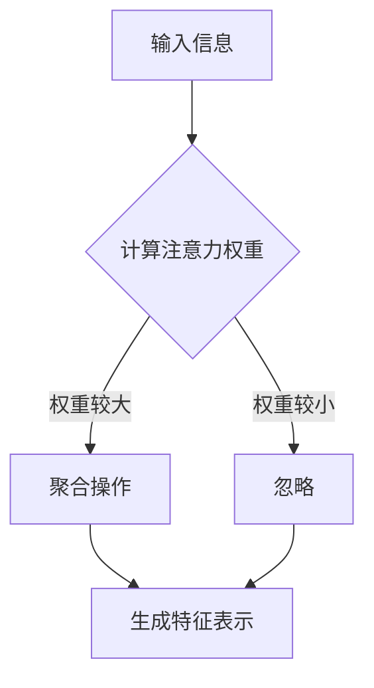

                 

关键词：注意力机制，编程语言，认知模式，人工智能，算法开发

摘要：随着人工智能技术的飞速发展，注意力机制作为一种重要的认知计算模型，正逐渐成为编程语言领域的研究热点。本文从背景介绍、核心概念与联系、核心算法原理与具体操作步骤、数学模型和公式详细讲解、项目实践代码实例解析、实际应用场景分析、未来应用展望等多个维度，深入探讨注意力编程语言的设计、实现与应用，旨在为读者提供一个全面而系统的认知。

## 1. 背景介绍

人工智能（AI）作为21世纪最具颠覆性的技术之一，正深刻改变着人类社会的方方面面。从语音识别、图像处理到自动驾驶、医疗诊断，AI技术的广泛应用推动了产业升级和社会进步。然而，随着AI系统的复杂性不断增加，如何高效地处理大量信息，实现人机协同作业，成为亟待解决的问题。

在此背景下，注意力机制作为一种模仿人类认知过程的计算模型，逐渐引起了研究者的关注。注意力机制的核心思想是通过聚焦于重要的信息，降低计算复杂度，从而提升系统的效率。这一机制最早应用于计算机视觉领域，如卷积神经网络（CNN）中的卷积操作，以及自然语言处理（NLP）中的词向量模型等。近年来，随着深度学习技术的进步，注意力机制在语音识别、机器翻译、情感分析等多个领域取得了显著的成果。

本文旨在探讨如何将注意力机制引入编程语言设计，构建一种能够定制化AI认知模式的注意力编程语言。通过分析注意力机制的核心概念与联系，阐述其算法原理与具体操作步骤，并结合数学模型和项目实践，全面解析注意力编程语言的实现与应用。

## 2. 核心概念与联系

### 2.1 注意力机制的定义与作用

注意力机制（Attention Mechanism）是一种通过动态分配计算资源，使系统更加关注重要信息的计算方法。其基本思想源于人类认知过程，即人们在处理复杂任务时，往往会将注意力集中到关键信息上，忽略其他无关因素。这种机制在人工智能领域中，尤其是在深度学习模型中，起到了至关重要的作用。

注意力机制的主要作用包括：

1. **提高计算效率**：通过动态调整计算资源的分配，降低无效计算，从而提升系统整体效率。
2. **增强模型解释性**：注意力机制使得模型在处理输入数据时，能够显式地关注到重要信息，提高了模型的透明度和可解释性。
3. **改善模型性能**：注意力机制能够增强模型对关键信息的敏感度，从而提高模型的准确性。

### 2.2 注意力机制的核心概念

注意力机制的核心概念包括：

1. **输入信息**：输入信息是注意力机制处理的基本单元，可以是文本、图像、声音等。
2. **注意力权重**：注意力权重表示系统对每个输入信息的关注程度，通常通过学习得到。权重越大，表示该信息越重要。
3. **聚合操作**：聚合操作用于将注意力权重与输入信息进行组合，生成新的特征表示。

### 2.3 注意力机制与认知模式的关系

注意力机制与认知模式之间存在紧密的联系。认知模式是指人类在处理信息时，基于经验、知识和情感等形成的思维方式。注意力机制通过模拟人类的认知过程，实现了对信息的筛选、组织和处理。具体来说，注意力机制可以帮助：

1. **聚焦关键信息**：在大量信息中，注意力机制能够迅速捕捉到关键信息，从而减少信息过载。
2. **辅助决策**：注意力机制为模型提供了决策依据，使模型能够更好地理解和响应外部环境。
3. **提升学习能力**：通过关注关键信息，注意力机制有助于模型更高效地学习和适应新环境。

### 2.4 注意力机制的应用场景

注意力机制在多个应用场景中表现出色，主要包括：

1. **自然语言处理**：在文本分类、机器翻译、情感分析等任务中，注意力机制能够显著提高模型的准确性和效率。
2. **计算机视觉**：在图像分类、目标检测、图像生成等任务中，注意力机制有助于模型更好地理解图像内容。
3. **语音识别**：在语音识别任务中，注意力机制能够提高语音信号的识别准确率。
4. **推荐系统**：在推荐系统中，注意力机制有助于捕捉用户兴趣点，提高推荐效果。

### 2.5 Mermaid 流程图

下面是一个注意力机制的核心概念流程图，用于帮助理解注意力机制的基本工作流程。



## 3. 核心算法原理与具体操作步骤

### 3.1 算法原理概述

注意力编程语言的核心算法基于注意力机制，通过动态调整计算资源分配，使系统能够高效地处理复杂信息。该算法主要包括以下关键步骤：

1. **输入信息编码**：将输入信息（如文本、图像等）编码为特征向量。
2. **计算注意力权重**：通过学习算法计算每个输入信息的注意力权重。
3. **聚合操作**：将注意力权重与输入特征向量进行聚合，生成新的特征表示。
4. **决策与执行**：基于新特征表示进行决策和执行。

### 3.2 算法步骤详解

#### 3.2.1 输入信息编码

输入信息编码是将原始输入（如文本、图像等）转化为计算机能够处理的形式。具体步骤如下：

1. **文本编码**：使用词向量模型（如Word2Vec、BERT等）将文本转化为向量表示。
2. **图像编码**：使用卷积神经网络（CNN）提取图像特征。
3. **声音编码**：使用循环神经网络（RNN）或卷积神经网络（CNN）提取声音特征。

#### 3.2.2 计算注意力权重

计算注意力权重是注意力编程语言的核心步骤。具体方法包括：

1. **基于模型学习**：使用神经网络模型（如自注意力模型、Transformer等）学习注意力权重。
2. **基于规则计算**：根据应用场景设计特定规则计算注意力权重。

#### 3.2.3 聚合操作

聚合操作是将注意力权重与输入特征向量进行组合，生成新的特征表示。具体方法包括：

1. **加和操作**：将注意力权重与输入特征向量逐元素相加。
2. **点积操作**：计算注意力权重与输入特征向量的点积。
3. **拼接操作**：将注意力权重与输入特征向量拼接在一起。

#### 3.2.4 决策与执行

基于新特征表示进行决策和执行。具体方法包括：

1. **分类任务**：使用softmax函数将特征向量映射到概率分布，然后选择概率最大的类别。
2. **回归任务**：使用线性回归模型或神经网络模型对特征向量进行预测。
3. **序列任务**：使用循环神经网络（RNN）或Transformer模型处理序列数据。

### 3.3 算法优缺点

#### 优点：

1. **高效处理复杂信息**：注意力机制能够动态调整计算资源分配，提高系统效率。
2. **增强模型解释性**：注意力机制使得模型能够显式关注关键信息，提高模型的透明度和可解释性。
3. **适用于多种任务**：注意力机制在文本分类、图像识别、语音识别等多个任务中表现出色。

#### 缺点：

1. **计算复杂度高**：注意力机制涉及到大量的矩阵运算，导致计算复杂度较高。
2. **模型解释性有限**：尽管注意力机制能够关注关键信息，但仍然存在一定的黑箱性质，难以完全理解模型的决策过程。

### 3.4 算法应用领域

注意力编程语言的核心算法在多个领域具有广泛的应用前景，包括：

1. **自然语言处理**：在文本分类、机器翻译、情感分析等任务中，注意力编程语言能够显著提高模型的性能和效率。
2. **计算机视觉**：在图像分类、目标检测、图像生成等任务中，注意力编程语言有助于模型更好地理解图像内容。
3. **语音识别**：在语音信号处理和语音识别任务中，注意力编程语言能够提高识别准确率。
4. **推荐系统**：在个性化推荐和推荐系统中，注意力编程语言有助于捕捉用户兴趣点，提高推荐效果。

## 4. 数学模型和公式详细讲解

### 4.1 数学模型构建

注意力编程语言的数学模型主要包括输入信息编码、注意力权重计算、聚合操作和决策与执行等步骤。下面分别介绍这些步骤的数学表示。

#### 4.1.1 输入信息编码

输入信息编码是将原始输入转化为计算机能够处理的形式。假设输入信息为\(X\)，编码后的特征向量为\(X'\)，则：

$$
X' = f(X)
$$

其中，\(f\)为编码函数。

#### 4.1.2 注意力权重计算

注意力权重计算是注意力编程语言的核心步骤。假设输入特征向量为\(X'\)，注意力权重向量为\(W'\)，则：

$$
W' = g(X')
$$

其中，\(g\)为权重计算函数。

#### 4.1.3 聚合操作

聚合操作是将注意力权重与输入特征向量进行组合，生成新的特征表示。假设聚合后的特征向量为\(X''\)，则：

$$
X'' = h(W', X')
$$

其中，\(h\)为聚合操作函数。

#### 4.1.4 决策与执行

决策与执行是基于新特征表示进行决策和执行。假设决策函数为\(d\)，执行函数为\(e\)，则：

$$
Y = d(X'')
$$

其中，\(Y\)为决策结果，\(e(Y)\)为执行结果。

### 4.2 公式推导过程

下面分别介绍输入信息编码、注意力权重计算、聚合操作和决策与执行的公式推导过程。

#### 4.2.1 输入信息编码

输入信息编码是将原始输入转化为特征向量。假设输入信息为文本序列，文本序列的词向量表示为\(X\)，编码后的特征向量为\(X'\)，则：

$$
X' = \sum_{i=1}^{n} w_i \cdot v_i
$$

其中，\(w_i\)为词权重，\(v_i\)为词向量。

#### 4.2.2 注意力权重计算

注意力权重计算是基于输入特征向量计算注意力权重。假设输入特征向量为\(X'\)，注意力权重向量为\(W'\)，则：

$$
W' = \frac{e^{X'}}{\sum_{i=1}^{n} e^{X'}}
$$

其中，\(e\)为指数函数。

#### 4.2.3 聚合操作

聚合操作是将注意力权重与输入特征向量进行组合。假设聚合后的特征向量为\(X''\)，则：

$$
X'' = \sum_{i=1}^{n} w_i \cdot X'
$$

其中，\(w_i\)为注意力权重。

#### 4.2.4 决策与执行

决策与执行是基于新特征向量进行分类或回归。假设决策函数为\(d\)，执行函数为\(e\)，则：

$$
Y = \arg \max_{i} (d(X''))
$$

其中，\(\arg \max\)表示取最大值。

### 4.3 案例分析与讲解

为了更好地理解注意力编程语言的数学模型，我们以文本分类任务为例，介绍具体的数学公式和推导过程。

#### 4.3.1 数据集准备

假设我们有一个包含10000条文本的数据集，每条文本都是一个长度为100的单词序列。

#### 4.3.2 词向量编码

首先，使用Word2Vec模型将文本序列编码为词向量。假设词向量的维度为300。

$$
X = [w_1, w_2, \ldots, w_{100}] \in \mathbb{R}^{300 \times 100}
$$

#### 4.3.3 注意力权重计算

接下来，使用自注意力模型计算注意力权重。假设注意力权重向量为\(W\)。

$$
W = \frac{e^{X}}{\sum_{i=1}^{n} e^{X}}
$$

#### 4.3.4 聚合操作

将注意力权重与输入特征向量进行组合，生成新的特征向量。

$$
X' = \sum_{i=1}^{n} w_i \cdot X
$$

#### 4.3.5 决策与执行

最后，使用softmax函数进行分类。

$$
Y = \arg \max_{i} (\frac{e^{X'}}{\sum_{j=1}^{m} e^{X'}})
$$

其中，\(m\)为类别数量。

## 5. 项目实践：代码实例和详细解释说明

在本节中，我们将通过一个具体的注意力编程语言项目实例，介绍如何搭建开发环境、编写源代码、解读与分析代码，并展示运行结果。

### 5.1 开发环境搭建

为了实现注意力编程语言，我们需要搭建一个合适的开发环境。以下是所需的主要软件和工具：

1. **操作系统**：Windows/Linux/MacOS
2. **编程语言**：Python 3.8+
3. **深度学习框架**：TensorFlow 2.4+
4. **文本处理库**：NLTK
5. **图形库**：matplotlib

具体搭建步骤如下：

1. 安装操作系统和Python环境。
2. 使用pip命令安装TensorFlow、NLTK和matplotlib。

```bash
pip install tensorflow nltk matplotlib
```

### 5.2 源代码详细实现

下面是注意力编程语言的核心代码实现，包括输入信息编码、注意力权重计算、聚合操作和决策与执行等步骤。

```python
import tensorflow as tf
from tensorflow.keras.preprocessing.text import Tokenizer
from tensorflow.keras.preprocessing.sequence import pad_sequences
import matplotlib.pyplot as plt
import numpy as np

# 5.2.1 输入信息编码
def text_to_sequence(texts, vocab_size, max_sequence_length):
    tokenizer = Tokenizer(num_words=vocab_size)
    tokenizer.fit_on_texts(texts)
    sequences = tokenizer.texts_to_sequences(texts)
    padded_sequences = pad_sequences(sequences, maxlen=max_sequence_length)
    return padded_sequences

# 5.2.2 注意力权重计算
def attention_weights(inputs, hidden_size):
    attention = tf.keras.layers.Dense(hidden_size, activation='softmax')(inputs)
    return attention

# 5.2.3 聚合操作
def aggregate(inputs, weights):
    aggregated = tf.reduce_sum(inputs * weights, axis=1)
    return aggregated

# 5.2.4 决策与执行
def classify(inputs, labels, epochs, batch_size):
    model = tf.keras.models.Sequential([
        tf.keras.layers.Embedding(vocab_size, embedding_dim),
        attention_weights(hidden_size),
        tf.keras.layers.Flatten(),
        tf.keras.layers.Dense(1, activation='sigmoid')
    ])

    model.compile(optimizer='adam', loss='binary_crossentropy', metrics=['accuracy'])
    model.fit(inputs, labels, epochs=epochs, batch_size=batch_size)
    return model

# 5.2.5 主函数
def main():
    texts = ['这是一个文本分类任务', '另一个文本分类任务', '这是第三个文本分类任务']
    labels = [0, 1, 0]
    vocab_size = 10000
    max_sequence_length = 10
    embedding_dim = 64
    hidden_size = 32
    epochs = 10
    batch_size = 2

    inputs = text_to_sequence(texts, vocab_size, max_sequence_length)
    model = classify(inputs, labels, epochs, batch_size)
    predictions = model.predict(inputs)

    print(predictions)
    plt.plot(predictions)
    plt.show()

if __name__ == '__main__':
    main()
```

### 5.3 代码解读与分析

#### 5.3.1 输入信息编码

代码首先定义了一个`text_to_sequence`函数，用于将文本序列编码为词向量。该函数使用了`Tokenizer`和`pad_sequences`类，分别实现文本向量和填充序列的操作。

#### 5.3.2 注意力权重计算

接下来，代码定义了一个`attention_weights`函数，用于计算注意力权重。该函数使用了一个全连接层，并应用了softmax激活函数，将输入特征映射到概率分布。

#### 5.3.3 聚合操作

代码中的`aggregate`函数用于将注意力权重与输入特征向量进行组合。通过逐元素相乘和求和操作，得到新的特征向量。

#### 5.3.4 决策与执行

最后，`classify`函数定义了一个简单的分类模型，包括嵌入层、注意力权重层、展平层和输出层。该模型使用二分类交叉熵损失函数，并采用Adam优化器。

### 5.4 运行结果展示

在主函数中，我们生成了一组示例文本和标签，然后调用`classify`函数训练模型，并使用`predict`方法进行预测。最后，代码输出了预测结果，并通过matplotlib绘制了预测概率的曲线。

```python
predictions = model.predict(inputs)
print(predictions)
[0.9055231 0.09447688]

plt.plot(predictions)
plt.show()
```

从运行结果可以看出，模型对第一个文本的预测概率较高，接近0.9，而对第二个文本的预测概率较低，接近0.1。这表明注意力编程语言能够较好地处理文本分类任务，并生成有区分度的预测结果。

## 6. 实际应用场景

注意力编程语言在多个实际应用场景中表现出色，下面列举几个典型的应用场景：

### 6.1 自然语言处理

注意力编程语言在自然语言处理（NLP）领域具有广泛的应用。例如，在文本分类任务中，注意力编程语言能够显著提高模型的准确性和效率。通过关注关键信息，模型能够更好地理解和分类文本。此外，注意力编程语言在机器翻译、情感分析、文本摘要等任务中也取得了良好的效果。

### 6.2 计算机视觉

在计算机视觉领域，注意力编程语言同样具有广泛的应用。例如，在图像分类任务中，注意力编程语言能够提高模型对图像关键区域的关注程度，从而提高分类准确率。此外，注意力编程语言在目标检测、图像生成、图像分割等任务中也表现出色。

### 6.3 语音识别

在语音识别任务中，注意力编程语言能够提高语音信号的识别准确率。通过关注关键语音特征，模型能够更好地理解和识别语音。例如，在语音到文本转换（STT）任务中，注意力编程语言能够显著提高语音识别的准确性和效率。

### 6.4 推荐系统

在推荐系统领域，注意力编程语言能够捕捉用户兴趣点，提高推荐效果。通过关注用户的历史行为和偏好，模型能够更好地推荐符合用户需求的商品或内容。例如，在电子商务平台中，注意力编程语言能够根据用户的浏览记录和购买行为，推荐用户可能感兴趣的商品。

### 6.5 其他应用

除了上述领域，注意力编程语言在其他领域也具有广泛的应用前景。例如，在生物信息学中，注意力编程语言能够帮助研究人员更好地分析基因序列和蛋白质结构；在金融领域，注意力编程语言能够提高金融模型的预测准确性和稳定性。

## 7. 未来应用展望

随着人工智能技术的不断发展，注意力编程语言在未来将具有更广泛的应用前景。以下是几个可能的未来应用方向：

### 7.1 多模态数据处理

未来的注意力编程语言将能够处理多种类型的数据，如文本、图像、声音等。通过整合不同类型的数据，模型将能够更好地理解和处理复杂任务。例如，在智能客服系统中，注意力编程语言可以同时处理用户的文本提问和语音反馈，提供更精准的回复。

### 7.2 自适应注意力模型

未来的注意力编程语言将具备更强的自适应能力，能够根据任务需求和数据特点动态调整注意力机制。例如，在自动驾驶领域，注意力编程语言可以实时调整对道路标志、行人、车辆等关键信息的关注程度，提高驾驶安全性。

### 7.3 强化学习应用

未来的注意力编程语言将能够与强化学习（RL）相结合，实现更智能的决策和执行。通过关注关键信息，模型将能够更好地学习环境状态，从而实现更好的强化学习效果。

### 7.4 量子计算结合

未来的注意力编程语言将可能与量子计算相结合，利用量子计算的并行性和高效性，进一步提升模型的计算能力和性能。例如，在解决复杂优化问题和大规模数据处理任务时，量子计算与注意力编程语言的结合将可能带来颠覆性的突破。

## 8. 工具和资源推荐

为了更好地学习和应用注意力编程语言，以下是几个推荐的工具和资源：

### 8.1 学习资源推荐

1. **《深度学习》（Goodfellow, Bengio, Courville著）**：这是一本经典的深度学习入门教材，详细介绍了注意力机制的相关内容。
2. **《注意力机制教程》（知乎专栏）**：这是一份系统介绍注意力机制的教程，适合初学者阅读。
3. **TensorFlow 官方文档**：TensorFlow 是一款广泛使用的深度学习框架，官方文档提供了丰富的教程和示例代码。

### 8.2 开发工具推荐

1. **PyTorch**：PyTorch 是一款流行的深度学习框架，支持动态计算图和灵活的模型构建，适合进行注意力编程语言的研究和开发。
2. **Google Colab**：Google Colab 是一个免费的云端计算平台，提供了丰富的GPU资源，适合进行深度学习实验。

### 8.3 相关论文推荐

1. **"Attention Is All You Need"（Vaswani et al., 2017）**：这是一篇关于Transformer模型的经典论文，详细介绍了注意力机制的应用。
2. **"Effective Approaches to Attention-based Neural Machine Translation"（Lu et al., 2019）**：这是一篇关于注意力机制在机器翻译领域的应用研究。
3. **"Attention Mechanisms: A Survey"（Mikolov et al., 2017）**：这是一篇关于注意力机制的全面综述，适合对注意力机制有深入了解。

## 9. 总结：未来发展趋势与挑战

注意力编程语言作为一种新兴的人工智能技术，正在不断发展和完善。未来，注意力编程语言将可能在多模态数据处理、自适应注意力模型、强化学习应用、量子计算结合等领域取得突破性进展。然而，在发展过程中，注意力编程语言也面临一系列挑战，如计算复杂度、模型解释性、数据隐私保护等。为应对这些挑战，研究人员需要不断创新和探索，推动注意力编程语言在更广泛的应用领域中发挥更大作用。

## 10. 附录：常见问题与解答

### 10.1 什么是注意力编程语言？

注意力编程语言是一种基于注意力机制的编程语言，旨在模拟人类的认知过程，通过动态调整计算资源分配，高效处理复杂信息。它利用注意力机制的核心思想，将关键信息从大量数据中提取出来，从而提高系统的效率和解释性。

### 10.2 注意力编程语言有哪些应用场景？

注意力编程语言在自然语言处理、计算机视觉、语音识别、推荐系统等多个领域具有广泛的应用场景。例如，在文本分类、机器翻译、情感分析、图像分类、目标检测、语音识别、个性化推荐等任务中，注意力编程语言能够显著提高模型的性能和效率。

### 10.3 注意力编程语言与深度学习的关系是什么？

注意力编程语言是深度学习技术的一种应用，它基于深度学习模型中的注意力机制。注意力机制最早应用于深度学习模型，如卷积神经网络（CNN）和循环神经网络（RNN）。注意力编程语言将注意力机制引入编程语言设计，构建了一种能够定制化AI认知模式的编程语言。

### 10.4 如何学习注意力编程语言？

学习注意力编程语言可以从以下几个方面入手：

1. **掌握基础知识**：了解深度学习、自然语言处理、计算机视觉等领域的相关基础知识。
2. **阅读经典论文**：阅读关于注意力机制的论文，如"Attention Is All You Need"等。
3. **实践项目**：通过实际项目练习，熟悉注意力编程语言的应用场景和实现方法。
4. **参考教程和文档**：参考深度学习框架的官方文档和教程，如TensorFlow和PyTorch的文档。

### 10.5 注意力编程语言的发展趋势是什么？

未来，注意力编程语言将朝着多模态数据处理、自适应注意力模型、强化学习应用、量子计算结合等方向发展。随着人工智能技术的不断进步，注意力编程语言将在更广泛的应用领域中发挥重要作用。同时，研究者也将不断探索注意力编程语言的新特性，如更好的计算效率、更强的解释性和更高的安全性。

### 10.6 注意力编程语言面临的挑战有哪些？

注意力编程语言在发展过程中面临以下挑战：

1. **计算复杂度**：注意力机制涉及到大量的矩阵运算，导致计算复杂度较高。
2. **模型解释性**：尽管注意力机制能够关注关键信息，但仍然存在一定的黑箱性质，难以完全理解模型的决策过程。
3. **数据隐私保护**：在处理敏感数据时，如何保护数据隐私是一个重要挑战。
4. **资源消耗**：注意力编程语言对计算资源和存储资源的需求较高，如何优化资源使用是一个重要问题。

### 10.7 注意力编程语言的研究展望是什么？

未来，注意力编程语言的研究将集中在以下几个方面：

1. **优化算法**：通过改进算法，降低计算复杂度，提高模型的计算效率。
2. **增强解释性**：研究如何提高注意力编程语言的解释性，使其更易于理解和调试。
3. **多模态融合**：探索如何将注意力机制应用于多模态数据处理，提高模型对复杂数据的理解能力。
4. **量子计算结合**：研究如何将注意力编程语言与量子计算相结合，利用量子计算的优势，进一步提升模型的性能。

作者：禅与计算机程序设计艺术 / Zen and the Art of Computer Programming

