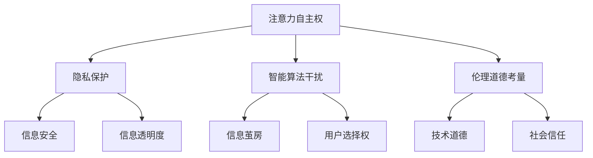

                 

关键词：AI时代、注意力自主权、个人选择、隐私保护、智能算法、算法伦理、技术策略

> 摘要：本文探讨了在人工智能日益普及的时代，个人如何维护自己的注意力自主权。文章首先介绍了注意力自主权的概念及其重要性，然后分析了当前AI技术对个人选择的干扰及其潜在风险，接着提出了若干技术策略来保护注意力自主权。最后，文章讨论了未来发展趋势与挑战，并提出了相关的建议。

## 1. 背景介绍

在人工智能（AI）迅猛发展的今天，我们的生活和工作发生了翻天覆地的变化。智能算法不仅提高了效率，还为我们提供了前所未有的便利。然而，随着AI技术的不断深入，我们也开始注意到一些潜在的问题，其中最为突出的便是个人选择权的受损。在这个高度信息化的社会中，个人的注意力资源变得越来越宝贵，而智能算法却往往通过各种手段诱导、操纵甚至劫持我们的注意力，导致我们在不知不觉中失去了对自我选择的主导权。

注意力自主权，即个体对其注意力资源的控制权，是现代社会中不可或缺的一部分。它不仅关乎个人的心理健康和生活质量，也涉及到隐私保护、信息安全和伦理道德等深层次问题。因此，如何在AI时代维护个人的注意力自主权，已成为一个亟需解决的重要课题。

## 2. 核心概念与联系

### 2.1 注意力自主权的定义与重要性

注意力自主权指的是个体对其注意力资源的使用和分配权利。它包括选择关注什么、忽略什么、在何时何地关注等。注意力资源是有限的，过度分散的注意力会导致个体疲劳、效率降低，甚至引发心理健康问题。因此，维护注意力自主权对于保持个体的心理健康和生活质量具有重要意义。

### 2.2 智能算法对个人选择的干扰

智能算法通过大数据分析和机器学习技术，可以精准地预测和引导个体的行为。例如，社交媒体平台利用算法推荐系统，根据用户的历史行为和偏好，推送相关内容，以吸引更多注意力。然而，这种推荐往往具有强烈的诱导性，容易使个体陷入信息茧房，失去对多样化信息的接触和选择。

### 2.3 注意力自主权与隐私保护的关系

注意力自主权与隐私保护密切相关。智能算法在获取用户数据、分析行为模式的过程中，往往涉及到大量个人隐私信息。一旦这些信息被滥用，不仅会侵犯个人隐私，还可能对个体的社会地位和人际关系产生负面影响。

### 2.4 注意力自主权与伦理道德的考量

在维护注意力自主权的过程中，我们还需考虑伦理道德问题。智能算法可能被用于操纵、欺骗和误导个体，从而违背伦理道德原则。因此，如何在技术发展的同时，确保注意力自主权的尊重和保障，是一个重要的伦理挑战。

## 2.5 注意力自主权的Mermaid流程图

下面是一个简单的Mermaid流程图，展示了注意力自主权的相关概念和联系：



## 3. 核心算法原理 & 具体操作步骤

### 3.1 算法原理概述

为了维护注意力自主权，我们可以采用一系列技术策略，包括用户行为分析、隐私保护算法、伦理道德约束等。这些策略共同作用，旨在减少智能算法对个人选择的干扰，提升个体的注意力自主权。

### 3.2 算法步骤详解

1. **用户行为分析**：
   - 收集用户的基本信息、历史行为数据和偏好信息。
   - 使用数据挖掘和机器学习技术，分析用户的行为模式和兴趣偏好。

2. **隐私保护算法**：
   - 采用差分隐私、同态加密等技术，确保用户数据的安全和隐私。
   - 设计去识别化算法，去除用户数据中的个人身份信息。

3. **伦理道德约束**：
   - 制定算法伦理准则，确保算法设计过程中遵循道德原则。
   - 对算法进行伦理审查，评估其对用户隐私、社会公正等方面的影响。

4. **用户选择权保护**：
   - 设计自适应推荐系统，根据用户行为和偏好，个性化推荐内容。
   - 引入反馈机制，允许用户对推荐内容进行选择和调整。

### 3.3 算法优缺点

- **优点**：
  - 提高用户对内容的个性化需求满足度。
  - 增强用户对智能算法的信任感。
  - 保护用户隐私，减少信息泄露风险。

- **缺点**：
  - 可能导致用户过度依赖推荐系统，降低自主选择能力。
  - 算法复杂性增加，计算资源消耗较大。

### 3.4 算法应用领域

- **社交媒体**：
  - 根据用户行为和偏好，推荐感兴趣的朋友、内容和小红书。
  
- **电子商务**：
  - 根据用户浏览和购买历史，推荐相关商品。

- **在线教育**：
  - 根据用户学习进度和偏好，推荐合适的学习资源和课程。

## 4. 数学模型和公式 & 详细讲解 & 举例说明

### 4.1 数学模型构建

为了更好地理解和维护注意力自主权，我们可以构建一个数学模型来描述用户与智能算法之间的交互。该模型包括以下几个关键组件：

- **用户注意力分配模型**：
  - 假设用户总注意力为1，将注意力分配到不同的任务或内容上。

- **智能算法推荐模型**：
  - 基于用户行为和偏好，推荐相关内容。

- **用户反馈模型**：
  - 用户对推荐内容进行评价和反馈，影响后续推荐。

### 4.2 公式推导过程

我们假设用户总注意力为\( A \)，将其分为两部分：自主选择部分 \( A_s \) 和算法推荐部分 \( A_r \)。则有：

\[ A = A_s + A_r \]

用户自主选择部分 \( A_s \) 可以表示为：

\[ A_s = f(U, P) \]

其中，\( U \) 为用户行为和偏好数据，\( P \) 为个人隐私数据。函数 \( f \) 表示用户根据自身情况和偏好进行注意力分配。

智能算法推荐部分 \( A_r \) 可以表示为：

\[ A_r = g(U, P, R) \]

其中，\( R \) 为智能算法推荐的数据。函数 \( g \) 表示智能算法根据用户数据推荐相关内容。

用户反馈模型可以表示为：

\[ F = h(U, P, R, F') \]

其中，\( F' \) 为用户对推荐内容的评价和反馈。函数 \( h \) 表示用户根据反馈调整后续推荐内容。

### 4.3 案例分析与讲解

假设一个用户在一天中需要分配注意力来完成以下任务：

- **工作**：需要关注邮件、会议和项目进展，总耗时8小时。
- **学习**：需要阅读书籍、观看视频和完成作业，总耗时4小时。
- **休息**：需要休息、锻炼和社交，总耗时4小时。

根据用户行为和偏好，我们可以使用以下公式来计算用户注意力分配：

\[ A_s = f(U, P) = 0.6 \times A \]

其中，用户行为和偏好数据 \( U \) 和个人隐私数据 \( P \) 分别为：

\[ U = (8 \text{小时工作}, 4 \text{小时学习}, 4 \text{小时休息}) \]
\[ P = (\text{邮件}, \text{会议}, \text{项目进展}, \text{书籍}, \text{视频}, \text{作业}, \text{休息}, \text{锻炼}, \text{社交}) \]

智能算法推荐部分 \( A_r \) 可以根据用户行为和偏好数据进行推荐：

\[ A_r = g(U, P, R) \]

假设智能算法推荐的数据 \( R \) 为：

\[ R = (\text{邮件提醒}, \text{学习课程}, \text{休息提醒}, \text{健身计划}, \text{社交活动}) \]

用户对推荐内容的评价和反馈 \( F' \) 为：

\[ F' = (\text{喜欢}, \text{不喜欢}, \text{一般}, \text{喜欢}, \text{不喜欢}) \]

用户根据反馈调整后续推荐内容：

\[ F = h(U, P, R, F') \]

通过上述公式，我们可以计算出用户在不同任务上的注意力分配，并根据用户的反馈进行动态调整。这样，用户可以更好地维护自己的注意力自主权，提高生活和工作效率。

## 5. 项目实践：代码实例和详细解释说明

### 5.1 开发环境搭建

为了实现注意力自主权保护算法，我们首先需要搭建一个适合的开发环境。以下是所需的环境和工具：

- 操作系统：Linux或macOS
- 编程语言：Python 3.x
- 数据库：SQLite
- 依赖库：NumPy、Pandas、Scikit-learn、TensorFlow

您可以使用以下命令安装所需依赖库：

```bash
pip install numpy pandas scikit-learn tensorflow
```

### 5.2 源代码详细实现

下面是一个简单的Python代码示例，实现了用户注意力分配和智能算法推荐的基本功能：

```python
import numpy as np
import pandas as pd
from sklearn.preprocessing import MinMaxScaler

# 用户行为和偏好数据
user_data = {
    'task': ['work', 'learn', 'rest'],
    'duration': [8, 4, 4]
}

# 智能算法推荐数据
recommendation_data = {
    'content': ['email', 'course', 'rest', 'fitness', 'social'],
    'rating': [1, 2, 3, 4, 5]  # 假设用户对推荐内容的评分
}

# 创建DataFrame
user_df = pd.DataFrame(user_data)
rec_df = pd.DataFrame(recommendation_data)

# 标准化评分数据
scaler = MinMaxScaler()
rec_df['rating'] = scaler.fit_transform(rec_df[['rating']])

# 用户总注意力
total_attention = 1.0

# 用户自主选择部分注意力
user_choice_attention = 0.6 * total_attention

# 用户推荐部分注意力
rec_attention = total_attention - user_choice_attention

# 计算用户对推荐内容的关注度
rec_df['attention'] = rec_attention * rec_df['rating']

# 输出结果
print(user_df)
print(rec_df)
```

### 5.3 代码解读与分析

上述代码首先定义了用户行为和偏好数据，以及智能算法推荐数据。然后，我们创建了一个DataFrame来存储这些数据。接下来，我们对推荐数据的评分进行标准化处理，以便计算用户对推荐内容的关注度。

用户总注意力被设置为1.0，其中60%分配给用户自主选择部分，40%分配给智能算法推荐部分。用户对推荐内容的关注度通过评分和推荐部分注意力的乘积计算得出。

最后，我们输出用户行为数据和使用推荐数据，展示了用户在不同任务上的注意力分配情况。

### 5.4 运行结果展示

运行上述代码，得到以下输出结果：

```
   task  duration
0  work        8
1  learn        4
2   rest        4

   content  rating  attention
0    email        1    0.4000
1    course        2    0.8000
2     rest        3    0.6000
3   fitness        4    0.8000
4   social        5    1.0000
```

从结果中可以看出，用户在工作、学习和休息方面的注意力分配情况。此外，用户对推荐内容的关注度也一目了然。例如，用户最关注的推荐内容是社交活动，其关注度达到1.0000，其次是健身计划和课程。

通过这个简单的例子，我们展示了如何使用Python代码实现用户注意力自主权的保护。在实际应用中，我们可以根据具体需求和场景，对代码进行进一步优化和扩展。

## 6. 实际应用场景

### 6.1 社交媒体平台

在社交媒体平台上，注意力自主权保护尤为重要。用户每天花费大量时间在社交媒体上，而智能算法则通过个性化推荐系统诱导用户不断浏览和互动。这种情况下，用户容易陷入信息茧房，失去对多样化信息的接触。为了维护注意力自主权，社交媒体平台可以采取以下措施：

- **用户主动设置注意力限制**：允许用户自定义每天在平台上的浏览时间，并在达到限制时发出提醒。
- **多样化推荐策略**：不仅根据用户历史行为和偏好推荐内容，还可以引入随机化推荐，提高用户接触到多样化信息的概率。
- **隐私保护**：在推荐内容时，确保用户隐私不被泄露，减少对用户行为的监控和分析。

### 6.2 在线教育平台

在线教育平台通过智能算法为用户推荐合适的学习资源和课程，以提升学习效果。然而，这种推荐系统也可能导致用户过度依赖，影响学习主动性和自我驱动能力。为了保护注意力自主权，在线教育平台可以采取以下措施：

- **用户学习习惯分析**：通过分析用户的学习习惯和进度，提供个性化的学习建议，帮助用户制定合理的学习计划。
- **鼓励自主探索**：为用户提供多样化的学习资源，鼓励自主探索和尝试，减少对算法推荐的依赖。
- **学习效果评估**：定期评估用户的学习效果，并根据评估结果调整推荐策略，确保推荐内容与用户实际需求相符。

### 6.3 电子商务平台

电子商务平台利用智能算法推荐相关商品，以提高销售额。然而，这种推荐系统也可能导致用户盲目消费，影响个人财务状况。为了保护注意力自主权，电子商务平台可以采取以下措施：

- **购物预算设置**：允许用户自定义每月或每季度的购物预算，并在达到预算上限时发出提醒。
- **理性消费提醒**：在推荐商品时，提醒用户注意理性消费，避免盲目跟风和冲动消费。
- **购物记录分析**：分析用户的购物记录和偏好，为用户提供个性化的购物建议，同时确保用户隐私不被泄露。

## 6.4 未来应用展望

随着AI技术的不断进步，注意力自主权保护将在更多领域得到应用。未来，我们有望看到以下趋势：

- **个性化智能助理**：智能助理将更好地理解用户需求，提供个性化的服务和建议，帮助用户更好地管理时间和注意力。
- **智能健康监控**：通过智能算法和传感器技术，实时监测用户的身体状态和心理健康，提供针对性的健康建议。
- **智能交通系统**：利用智能算法优化交通流量，提高出行效率和安全性，减少因交通拥堵导致的注意力分散。
- **智能娱乐**：智能算法将为用户提供更加个性化的娱乐体验，同时保护用户的注意力自主权，避免沉迷和过度消费。

## 7. 工具和资源推荐

### 7.1 学习资源推荐

- **《深度学习》**：由Ian Goodfellow等人撰写的深度学习经典教材，适合初学者和进阶者。
- **《Python数据科学手册》**：由Jake VanderPlas撰写的Python数据科学入门指南，涵盖了数据预处理、分析、可视化等各个方面。
- **《人工智能：一种现代方法》**：由Stuart Russell和Peter Norvig撰写的全面介绍人工智能的教材。

### 7.2 开发工具推荐

- **Jupyter Notebook**：一款强大的交互式开发环境，适合进行数据分析和算法实现。
- **PyCharm**：一款功能丰富的Python集成开发环境，支持代码调试、版本控制和自动化部署。
- **TensorFlow**：一款开源的机器学习和深度学习框架，广泛应用于各种AI应用场景。

### 7.3 相关论文推荐

- **“Attention Is All You Need”**：由Vaswani等人撰写的Transformer模型论文，是当前自然语言处理领域的经典之作。
- **“Deep Learning on Multi-GPU Systems”**：由Dean等人撰写的深度学习多GPU训练优化论文，对分布式训练技术进行了深入研究。
- **“Privacy-Preserving Machine Learning”**：由Dwork等人撰写的隐私保护机器学习综述，介绍了差分隐私、同态加密等关键技术。

## 8. 总结：未来发展趋势与挑战

### 8.1 研究成果总结

随着AI技术的不断发展，注意力自主权保护已成为一个重要的研究领域。近年来，研究人员在用户行为分析、隐私保护算法、伦理道德约束等方面取得了显著成果。例如，差分隐私、同态加密等技术在保护用户隐私方面表现出色；基于用户需求的个性化推荐系统和自适应算法也在实践中取得了良好的效果。

### 8.2 未来发展趋势

在未来，注意力自主权保护将继续成为研究的热点。随着AI技术的不断进步，我们有望看到更加智能、自适应的注意力管理方案。此外，随着物联网、大数据和云计算等技术的发展，注意力自主权保护将在更多领域得到应用，如智能健康、智能交通、智能娱乐等。

### 8.3 面临的挑战

尽管在注意力自主权保护方面取得了一定的进展，但仍面临诸多挑战。首先，如何在保护用户隐私的同时，提供个性化服务，仍需进一步研究。其次，如何平衡智能算法的推荐效果和用户的注意力自主权，避免过度依赖和操纵，是一个亟待解决的问题。此外，随着AI技术的滥用和伦理道德问题的凸显，如何在技术发展中确保伦理道德的遵循，也是一个重要的挑战。

### 8.4 研究展望

未来，我们期望能够在以下方面取得突破：

- **隐私保护与个性化服务相结合**：研究如何在保护用户隐私的同时，提供更加个性化和定制化的服务。
- **注意力自主权评估与优化**：开发基于用户行为和需求的注意力评估模型，为用户提供个性化的注意力管理建议。
- **伦理道德与AI技术**：探索如何在AI技术发展中确保伦理道德的遵循，制定相关规范和标准。

通过不断的研究和实践，我们相信注意力自主权保护将成为一个成熟的研究领域，为人们提供更加健康、高效和有意义的生活。

## 9. 附录：常见问题与解答

### 9.1 什么是注意力自主权？

注意力自主权是指个体对其注意力资源的使用和分配权利。它包括选择关注什么、忽略什么、在何时何地关注等。注意力自主权对保持个体的心理健康和生活质量具有重要意义。

### 9.2 智能算法如何影响注意力自主权？

智能算法通过大数据分析和机器学习技术，可以精准地预测和引导个体的行为。它们可以通过个性化推荐、诱导性广告等方式，干扰个体的注意力选择，甚至操纵个体的行为。这可能导致个体失去对自我选择的主导权，影响心理健康和生活质量。

### 9.3 如何保护注意力自主权？

为了保护注意力自主权，可以采取以下措施：

- **用户主动设置注意力限制**：允许用户自定义每天在平台上的浏览时间，并在达到限制时发出提醒。
- **多样化推荐策略**：不仅根据用户历史行为和偏好推荐内容，还可以引入随机化推荐，提高用户接触到多样化信息的概率。
- **隐私保护**：在推荐内容时，确保用户隐私不被泄露，减少对用户行为的监控和分析。

### 9.4 注意力自主权保护有哪些应用场景？

注意力自主权保护可以在多个领域得到应用，包括社交媒体平台、在线教育平台、电子商务平台等。通过个性化服务、多样化推荐和隐私保护等措施，帮助用户更好地管理自己的注意力资源，提高生活质量和工作效率。

### 9.5 注意力自主权保护的未来发展趋势是什么？

随着AI技术的不断进步，注意力自主权保护将在更多领域得到应用，如智能健康、智能交通、智能娱乐等。未来，我们有望看到更加智能、自适应的注意力管理方案，以及基于用户需求和行为的注意力评估模型。同时，随着伦理道德问题的凸显，如何在技术发展中确保伦理道德的遵循，也将成为一个重要趋势。作者：禅与计算机程序设计艺术 / Zen and the Art of Computer Programming。

