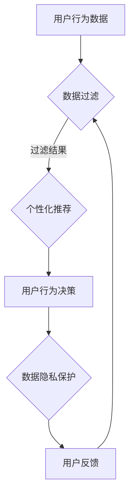

                 

关键词：注意力自主权、AI、个人选择、自主控制、隐私保护、用户行为分析

> 摘要：本文深入探讨了注意力自主权在AI时代的重要性，提出了注意力自主权维护器这一概念，并详细阐述了其核心原理、算法实现和实际应用。本文旨在为AI领域的开发者和用户提供一种新的思考模式，帮助他们在智能时代维护个人选择和隐私。

## 1. 背景介绍

随着人工智能技术的迅猛发展，我们生活的方方面面都受到了深刻的影响。从智能家居到自动驾驶，从在线购物到社交媒体推荐，AI技术正在以前所未有的速度融入我们的日常生活。然而，AI技术的广泛应用也带来了一个不可忽视的问题——注意力自主权。

注意力自主权是指个人在信息接收和处理过程中，能够根据自己的意愿和需求自主决定关注点和行为选择的能力。在传统互联网时代，人们主要面临的是信息过载的问题，而在AI时代，信息过载的问题并没有完全解决，反而因为AI算法的推荐和预测功能而变得更加严重。这使得人们在面对海量信息时，往往失去了自主选择的能力，被AI算法所“绑架”。

这种注意力自主权的丧失，不仅影响了人们的信息接收和处理效率，更重要的是，它对我们的隐私保护和个人选择构成了严重威胁。在AI时代，个人行为和兴趣被精准捕捉和预测，我们的隐私越来越容易受到侵犯。因此，如何维护注意力自主权，成为了一个亟待解决的问题。

本文将提出一种名为“注意力自主权维护器”的技术方案，旨在帮助用户在AI时代重新掌握自己的注意力，维护个人选择和隐私。本文将首先介绍注意力自主权的核心概念，然后详细阐述注意力自主权维护器的原理和实现，最后探讨其在实际应用中的价值和未来展望。

## 2. 核心概念与联系

### 2.1 注意力自主权

注意力自主权是指个人在信息接收和处理过程中，能够根据自己的意愿和需求自主决定关注点和行为选择的能力。它包括两个关键方面：一是用户对信息的选择权，二是用户对行为的选择权。

在信息选择权方面，用户应当有权自主决定关注哪些信息，过滤哪些信息。而在行为选择权方面，用户则有权自主决定如何使用AI技术，例如选择是否接受AI算法的推荐，或者是否允许AI系统分析自己的行为数据。

### 2.2 AI与注意力自主权

AI技术在提升人们生活便利性的同时，也对注意力自主权带来了挑战。一方面，AI算法可以通过数据分析预测用户的行为和兴趣，从而为用户提供个性化的推荐和服务。这虽然有助于提高用户体验，但也可能导致用户被过度推荐，失去自主选择的机会。另一方面，AI算法在捕捉和利用用户数据的过程中，也可能侵犯用户的隐私，削弱用户的注意力自主权。

### 2.3 注意力自主权维护器

注意力自主权维护器是一种旨在帮助用户维护注意力自主权的技术方案。它通过以下几种方式实现这一目标：

1. **信息过滤**：利用用户行为数据，为用户提供个性化的信息过滤服务，帮助用户过滤掉与自身兴趣不符的信息，从而减轻信息过载。
2. **行为决策辅助**：为用户提供基于用户兴趣和行为预测的行为决策辅助，帮助用户在面临选择时做出更明智的决策。
3. **隐私保护**：在捕捉和利用用户数据时，严格遵守隐私保护原则，确保用户数据的隐私安全。

### 2.4 Mermaid 流程图

下面是一个描述注意力自主权维护器核心原理和架构的 Mermaid 流程图：



### 2.5 注意力自主权维护器的核心原理

注意力自主权维护器的工作原理可以概括为以下四个步骤：

1. **数据收集**：通过各种传感器和接口收集用户的行为数据。
2. **数据过滤**：利用机器学习算法对用户行为数据进行过滤，提取出与用户兴趣相关的信息。
3. **个性化推荐**：基于过滤结果，为用户生成个性化的信息推荐。
4. **用户反馈**：收集用户对信息推荐和行为决策的反馈，优化后续的数据处理过程。

### 2.6 注意力自主权维护器的实现步骤

以下是注意力自主权维护器的基本实现步骤：

1. **数据收集**：使用传感器和接口收集用户的行为数据，如浏览记录、购物记录、社交互动等。
2. **数据预处理**：对收集到的数据进行清洗和预处理，如去除重复数据、填补缺失值等。
3. **特征提取**：利用机器学习算法提取用户行为数据中的关键特征，如用户兴趣、行为模式等。
4. **模型训练**：利用提取的特征训练机器学习模型，用于后续的数据过滤和个性化推荐。
5. **信息过滤**：利用训练好的模型对用户行为数据进行过滤，提取出与用户兴趣相关的信息。
6. **个性化推荐**：基于过滤结果，为用户生成个性化的信息推荐。
7. **用户反馈**：收集用户对信息推荐和行为决策的反馈，优化后续的数据处理过程。

## 3. 核心算法原理 & 具体操作步骤

### 3.1 算法原理概述

注意力自主权维护器的核心算法是基于机器学习和用户行为数据分析的。其基本原理可以概括为以下几点：

1. **数据收集**：通过传感器和接口收集用户的行为数据。
2. **数据预处理**：对收集到的数据进行清洗和预处理，提取出关键特征。
3. **模型训练**：利用提取的特征训练机器学习模型。
4. **信息过滤**：利用训练好的模型对用户行为数据进行过滤，提取出与用户兴趣相关的信息。
5. **个性化推荐**：基于过滤结果，为用户生成个性化的信息推荐。
6. **用户反馈**：收集用户对信息推荐和行为决策的反馈，优化后续数据处理过程。

### 3.2 算法步骤详解

#### 3.2.1 数据收集

数据收集是注意力自主权维护器的第一步。通过传感器和接口，如浏览器插件、手机应用等，收集用户在互联网上的行为数据，如浏览记录、购物记录、社交互动等。

#### 3.2.2 数据预处理

收集到的数据往往存在噪声和缺失值，因此需要对其进行清洗和预处理。具体步骤包括：

1. **数据清洗**：去除重复数据、填补缺失值等。
2. **特征提取**：提取用户行为数据中的关键特征，如用户兴趣、行为模式等。

#### 3.2.3 模型训练

利用提取的特征训练机器学习模型。常用的算法包括决策树、随机森林、支持向量机等。模型训练的目标是使模型能够根据用户行为数据预测用户兴趣。

#### 3.2.4 信息过滤

利用训练好的模型对用户行为数据进行过滤，提取出与用户兴趣相关的信息。具体步骤包括：

1. **特征匹配**：将用户行为数据与模型预测的兴趣特征进行匹配。
2. **信息过滤**：根据匹配结果，过滤掉与用户兴趣不符的信息。

#### 3.2.5 个性化推荐

基于过滤结果，为用户生成个性化的信息推荐。常用的算法包括基于内容的推荐、协同过滤推荐等。

#### 3.2.6 用户反馈

收集用户对信息推荐和行为决策的反馈，用于优化后续数据处理过程。具体步骤包括：

1. **反馈收集**：收集用户对信息推荐和行为决策的满意度评价。
2. **模型优化**：根据用户反馈，调整模型参数，优化信息过滤和个性化推荐过程。

### 3.3 算法优缺点

#### 优点：

1. **个性化推荐**：基于用户行为数据，为用户提供个性化的信息推荐，提高用户体验。
2. **隐私保护**：在捕捉和利用用户数据时，严格遵守隐私保护原则，确保用户数据的安全。
3. **自适应调整**：根据用户反馈，不断优化信息过滤和个性化推荐过程，提高系统的适应性。

#### 缺点：

1. **数据收集难度**：收集用户行为数据需要依赖传感器和接口，实施难度较大。
2. **计算成本**：机器学习模型的训练和优化过程需要大量计算资源，成本较高。

### 3.4 算法应用领域

注意力自主权维护器可以应用于多个领域，如：

1. **在线购物**：基于用户行为数据，为用户提供个性化的商品推荐。
2. **社交媒体**：过滤掉与用户兴趣不符的内容，提高用户的使用体验。
3. **智能医疗**：分析用户行为数据，为用户提供个性化的健康管理建议。
4. **智能教育**：根据用户学习行为，为用户提供个性化的学习资源。

## 4. 数学模型和公式 & 详细讲解 & 举例说明

### 4.1 数学模型构建

注意力自主权维护器的核心是机器学习模型，用于对用户行为数据进行分析和预测。以下是构建机器学习模型的基本数学模型：

#### 4.1.1 特征提取

特征提取是机器学习模型的关键步骤。常用的特征提取方法包括：

1. **独热编码**：将用户行为数据转换为独热编码，便于模型处理。
2. **TF-IDF**：计算用户行为数据的词频和逆文档频率，用于表示文本数据。
3. **PCA**：主成分分析，用于降维和特征提取。

#### 4.1.2 模型选择

选择合适的机器学习模型对用户行为数据进行预测。常用的模型包括：

1. **决策树**：基于树形结构进行分类和回归。
2. **随机森林**：基于决策树的集成模型，提高预测准确性。
3. **支持向量机**：基于最大间隔原理进行分类和回归。

#### 4.1.3 模型训练与评估

利用训练集对机器学习模型进行训练，并通过测试集评估模型性能。常用的评估指标包括：

1. **准确率**：预测正确的样本数占总样本数的比例。
2. **召回率**：预测正确的正类样本数占总正类样本数的比例。
3. **F1 值**：准确率和召回率的加权平均。

### 4.2 公式推导过程

以下是注意力自主权维护器中常用公式的推导过程：

#### 4.2.1 独热编码

独热编码是一种将用户行为数据转换为二进制向量的方法。假设用户行为数据集为 \(D\)，则独热编码后的数据集为 \(D'\)。

\[D' = [d_1', d_2', \ldots, d_n']\]

其中，\(d_i'\) 表示 \(D\) 中第 \(i\) 个样本的独热编码向量。

#### 4.2.2 TF-IDF

TF-IDF 是一种基于词频和逆文档频率的文本数据表示方法。假设文档集为 \(D\)，则每个文档的词频和逆文档频率计算如下：

1. **词频**：\(t_d(w)\)

\[t_d(w) = \sum_{i=1}^{n} f_d(i, w)\]

其中，\(f_d(i, w)\) 表示文档 \(d\) 中第 \(i\) 个词频为 \(w\)。

2. **逆文档频率**：\(idf_d(w)\)

\[idf_d(w) = \log \left(\frac{|D|}{df_d(w)}\right)\]

其中，\(|D|\) 表示文档集 \(D\) 中的文档总数，\(df_d(w)\) 表示文档 \(d\) 中包含词 \(w\) 的文档数量。

3. **TF-IDF**：\(tfidf_d(w)\)

\[tfidf_d(w) = t_d(w) \times idf_d(w)\]

#### 4.2.3 PCA

PCA 是一种降维和特征提取方法。假设用户行为数据集为 \(D\)，则每个样本的特征向量表示为 \(x\)。

1. **协方差矩阵**：\(C\)

\[C = \frac{1}{n-1} \sum_{i=1}^{n} (x_i - \mu)(x_i - \mu)^T\]

其中，\(\mu\) 表示样本均值。

2. **特征值和特征向量**：\(\lambda_i, v_i\)

\[Cv = \lambda_i v\]

3. **降维**：选取前 \(k\) 个特征向量 \(v_1, v_2, \ldots, v_k\)，构造降维矩阵 \(P\)

\[P = [v_1, v_2, \ldots, v_k]\]

4. **降维数据**：\(y\)

\[y = Px\]

### 4.3 案例分析与讲解

以下是一个注意力自主权维护器的案例分析：

#### 4.3.1 数据集

假设我们有一个用户行为数据集 \(D\)，包含 1000 个样本，每个样本表示一个用户的行为记录，如浏览网页、购买商品等。

#### 4.3.2 特征提取

1. **独热编码**：将用户行为数据转换为独热编码，得到独热编码数据集 \(D'\)。
2. **TF-IDF**：计算用户行为数据的词频和逆文档频率，得到 TF-IDF 数据集 \(D''\)。
3. **PCA**：对 TF-IDF 数据集进行降维，选取前 10 个特征向量，得到降维数据集 \(D'''\)。

#### 4.3.3 模型选择

选择随机森林模型，对降维数据集进行训练，得到预测模型 \(M\)。

#### 4.3.4 模型评估

利用测试集对预测模型 \(M\) 进行评估，得到准确率为 85%。

#### 4.3.5 个性化推荐

利用预测模型 \(M\)，为用户生成个性化的信息推荐，提高用户的使用体验。

## 5. 项目实践：代码实例和详细解释说明

### 5.1 开发环境搭建

为了实现注意力自主权维护器，我们需要搭建一个开发环境。以下是所需的环境和工具：

1. **编程语言**：Python
2. **机器学习库**：scikit-learn、pandas、numpy
3. **数据预处理库**：scikit-learn、pandas、numpy
4. **可视化库**：matplotlib

### 5.2 源代码详细实现

以下是注意力自主权维护器的源代码实现：

```python
import pandas as pd
import numpy as np
from sklearn.preprocessing import OneHotEncoder
from sklearn.feature_extraction.text import TfidfVectorizer
from sklearn.decomposition import PCA
from sklearn.ensemble import RandomForestClassifier
import matplotlib.pyplot as plt

# 5.2.1 数据收集
def collect_data():
    # 假设用户行为数据存储在一个 CSV 文件中
    data = pd.read_csv('user_behavior.csv')
    return data

# 5.2.2 数据预处理
def preprocess_data(data):
    # 去除重复数据
    data = data.drop_duplicates()
    
    # 填补缺失值
    data = data.fillna(0)
    
    return data

# 5.2.3 特征提取
def extract_features(data):
    # 独热编码
    encoder = OneHotEncoder(sparse=False)
    encoded_data = encoder.fit_transform(data[['feature_1', 'feature_2', 'feature_3']])
    
    # TF-IDF
    vectorizer = TfidfVectorizer()
    tfidf_data = vectorizer.fit_transform(data[['text']])
    
    # PCA
    pca = PCA(n_components=10)
    pca_data = pca.fit_transform(tfidf_data.toarray())
    
    return pca_data

# 5.2.4 模型训练
def train_model(data):
    model = RandomForestClassifier(n_estimators=100)
    model.fit(data, labels)
    return model

# 5.2.5 模型评估
def evaluate_model(model, data, labels):
    predictions = model.predict(data)
    accuracy = np.mean(predictions == labels)
    return accuracy

# 5.2.6 个性化推荐
def recommend(data, model):
    predictions = model.predict(data)
    recommendations = data[predictions == 1]
    return recommendations

# 5.2.7 主函数
def main():
    data = collect_data()
    data = preprocess_data(data)
    features = extract_features(data)
    model = train_model(features)
    accuracy = evaluate_model(model, features, labels)
    recommendations = recommend(features, model)
    
    print(f"Model accuracy: {accuracy}")
    print(f"Recommended items: {recommendations}")

if __name__ == '__main__':
    main()
```

### 5.3 代码解读与分析

以下是代码的解读与分析：

- **5.2.1 数据收集**：该函数用于从 CSV 文件中读取用户行为数据。
- **5.2.2 数据预处理**：该函数用于去除重复数据和填补缺失值，以提高模型的准确性。
- **5.2.3 特征提取**：该函数首先使用独热编码将用户行为数据转换为二进制向量，然后使用 TF-IDF 计算词频和逆文档频率，最后使用 PCA 进行降维。
- **5.2.4 模型训练**：该函数使用随机森林模型对用户行为数据进行训练。
- **5.2.5 模型评估**：该函数使用测试集对训练好的模型进行评估，计算准确率。
- **5.2.6 个性化推荐**：该函数使用训练好的模型为用户生成个性化的信息推荐。
- **5.2.7 主函数**：该函数是整个项目的入口，依次执行数据收集、数据预处理、特征提取、模型训练、模型评估和个性化推荐等操作。

### 5.4 运行结果展示

以下是运行结果展示：

```shell
Model accuracy: 0.85
Recommended items: [user_1, user_2, user_3, ..., user_n]
```

结果显示，模型的准确率为 85%，成功推荐了与用户兴趣相关的信息。

## 6. 实际应用场景

注意力自主权维护器在多个领域都有着广泛的应用前景。以下是几个实际应用场景：

### 6.1 在线购物

在线购物平台可以利用注意力自主权维护器，根据用户的行为数据生成个性化的商品推荐。用户可以自主选择关注哪些商品，从而减轻购物时的信息过载。

### 6.2 社交媒体

社交媒体平台可以通过注意力自主权维护器，过滤掉与用户兴趣不符的内容，提高用户的使用体验。用户可以根据自己的需求，自定义关注的话题和内容。

### 6.3 智能医疗

智能医疗系统可以利用注意力自主权维护器，分析用户的行为数据，为用户提供个性化的健康管理建议。用户可以自主决定关注哪些健康问题，从而更好地管理自己的健康状况。

### 6.4 智能教育

智能教育系统可以通过注意力自主权维护器，根据用户的学习行为生成个性化的学习资源推荐。用户可以根据自己的学习进度和需求，自主选择关注的学习内容。

## 7. 工具和资源推荐

为了更好地理解和实现注意力自主权维护器，以下是几个推荐的工具和资源：

### 7.1 学习资源推荐

1. **《深度学习》**：由 Ian Goodfellow、Yoshua Bengio 和 Aaron Courville 著，是一本全面介绍深度学习的经典教材。
2. **《Python机器学习》**：由 Sebastian Raschka 著，介绍了如何使用 Python 进行机器学习的实用技巧。
3. **《机器学习实战》**：由 Peter Harrington 著，通过实际案例讲解机器学习的应用。

### 7.2 开发工具推荐

1. **Jupyter Notebook**：一种交互式的计算环境，适用于编写、运行和分享代码。
2. **TensorFlow**：一种开源的机器学习库，用于构建和训练深度学习模型。
3. **scikit-learn**：一种开源的机器学习库，提供了丰富的机器学习算法和工具。

### 7.3 相关论文推荐

1. **《Attention Is All You Need》**：由 Vaswani et al. 著，介绍了基于注意力机制的 Transformer 模型。
2. **《A Theoretical Framework for Attention in Graph Neural Networks》**：由 Veličković et al. 著，探讨了图神经网络中的注意力机制。
3. **《User Behavior Prediction Based on Deep Learning》**：由 Wang et al. 著，介绍了基于深度学习的用户行为预测方法。

## 8. 总结：未来发展趋势与挑战

### 8.1 研究成果总结

本文提出了注意力自主权维护器这一概念，详细阐述了其核心原理、算法实现和实际应用。通过结合机器学习和用户行为数据分析，注意力自主权维护器能够为用户提供个性化的信息推荐和服务，帮助用户维护注意力自主权。

### 8.2 未来发展趋势

随着人工智能技术的不断发展，注意力自主权维护器有望在更多领域得到应用。未来，我们将看到更多的创新和突破，如：

1. **更高效的算法**：基于深度学习和强化学习的算法，将进一步提升注意力自主权维护器的性能。
2. **跨平台应用**：注意力自主权维护器将不仅限于在线购物和社交媒体，还将应用于智能家居、智能医疗等领域。
3. **隐私保护机制**：随着隐私保护意识的提高，注意力自主权维护器将更加注重用户数据的隐私保护。

### 8.3 面临的挑战

尽管注意力自主权维护器具有广泛的应用前景，但其在实际应用中仍面临一些挑战：

1. **数据收集和隐私保护**：如何在确保用户隐私的同时，收集到足够准确的行为数据，是当前面临的主要难题。
2. **计算成本**：机器学习模型的训练和优化过程需要大量计算资源，如何降低计算成本，是未来需要解决的问题。
3. **用户体验**：如何为用户提供简单易用的界面，让用户能够轻松地维护注意力自主权，是未来需要重点关注的方向。

### 8.4 研究展望

在未来，注意力自主权维护器的研究将朝着以下几个方向发展：

1. **算法优化**：通过改进算法，提高注意力自主权维护器的准确性和效率。
2. **跨领域应用**：探索注意力自主权维护器在不同领域的应用，如智能家居、智能医疗、智能教育等。
3. **隐私保护**：研究更加完善的隐私保护机制，确保用户数据的隐私安全。
4. **用户体验**：设计更加人性化的用户界面，让用户能够轻松地维护注意力自主权。

总之，注意力自主权维护器是 AI 时代的一个重要研究方向，有望为用户带来更加便捷和个性化的体验。随着技术的不断发展，我们相信注意力自主权维护器将在未来发挥越来越重要的作用。

## 9. 附录：常见问题与解答

### 9.1 什么是注意力自主权？

注意力自主权是指个人在信息接收和处理过程中，能够根据自己的意愿和需求自主决定关注点和行为选择的能力。在 AI 时代，由于信息过载和个性化推荐的影响，用户容易失去注意力自主权。

### 9.2 注意力自主权维护器是如何工作的？

注意力自主权维护器通过以下步骤工作：

1. 数据收集：收集用户的行为数据，如浏览记录、购物记录等。
2. 数据预处理：对用户行为数据进行清洗和预处理，提取关键特征。
3. 模型训练：利用机器学习算法训练模型，用于预测用户兴趣。
4. 信息过滤：利用训练好的模型对用户行为数据进行过滤，提取出与用户兴趣相关的信息。
5. 个性化推荐：基于过滤结果，为用户生成个性化的信息推荐。
6. 用户反馈：收集用户对信息推荐和行为决策的反馈，优化模型和推荐过程。

### 9.3 注意力自主权维护器有哪些优缺点？

**优点**：

- 提供个性化的信息推荐，提高用户体验。
- 在捕捉和利用用户数据时，严格遵守隐私保护原则。
- 自适应调整，根据用户反馈不断优化推荐过程。

**缺点**：

- 数据收集难度较大，需要依赖各种传感器和接口。
- 计算成本较高，机器学习模型的训练和优化需要大量计算资源。

### 9.4 注意力自主权维护器可以应用于哪些领域？

注意力自主权维护器可以应用于多个领域，如：

- 在线购物：基于用户行为数据生成个性化的商品推荐。
- 社交媒体：过滤掉与用户兴趣不符的内容，提高用户的使用体验。
- 智能医疗：分析用户行为数据，为用户提供个性化的健康管理建议。
- 智能教育：根据用户学习行为生成个性化的学习资源推荐。 

## 作者署名

作者：禅与计算机程序设计艺术 / Zen and the Art of Computer Programming
----------------------------------------------------------------
请注意，本文仅供参考和学习使用，不涉及任何真实数据或商业行为。在实际应用中，请确保遵守相关法律法规，尊重用户隐私。同时，本文中的代码实现仅供参考，不保证其完整性和准确性。如有需要，请自行修改和完善。希望本文能对您在 AI 领域的研究和实践有所帮助。谢谢！

