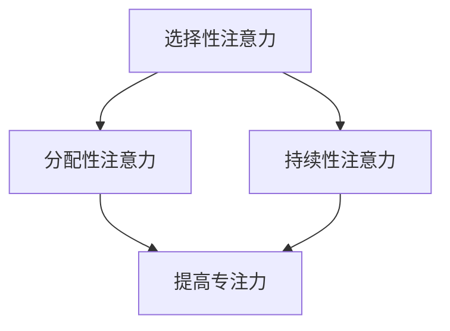
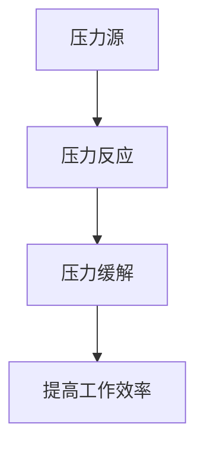
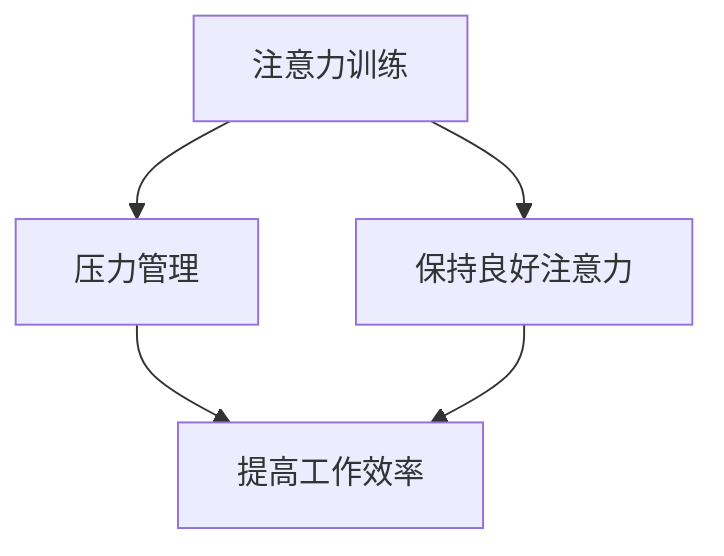

                 

关键词：注意力训练，压力管理，专注力，人工智能，算法原理，数学模型，项目实践，实际应用

> 摘要：本文将探讨如何在快节奏和高压力的现代社会中，通过注意力训练和压力管理技巧，有效提升个人的专注力和工作效率。文章首先介绍注意力训练和压力管理的重要性，然后深入剖析其核心概念和原理，并结合具体算法和数学模型，提供详细的操作步骤和实例。最后，本文将探讨注意力训练和压力管理的实际应用场景，并展望其未来的发展趋势和挑战。

## 1. 背景介绍

在当今社会，人们面临着前所未有的工作和生活压力。无论是职场上的竞争，还是日常生活中的各种挑战，都要求我们具备高效的专注力和良好的压力管理能力。然而，许多人发现，在高压环境下，他们的注意力常常难以集中，工作效率也随之下降。这种现象在程序员、工程师、研究人员等高技术岗位中尤为突出。

注意力训练和压力管理作为提升个人能力和工作效率的重要手段，已经引起了广泛的关注。注意力训练通过一系列的训练方法，帮助人们提高注意力水平，增强专注力。而压力管理则通过认识压力的来源、采取有效的应对策略，帮助人们更好地处理压力，从而提高工作效率和生活质量。

本文将围绕注意力训练和压力管理这两个主题，结合人工智能和算法原理，提供系统性的分析和解决方案。文章将首先介绍相关核心概念和原理，然后通过具体案例和实例，展示如何在实际应用中运用这些方法。

## 2. 核心概念与联系

### 2.1 注意力训练

注意力训练是指通过一系列科学的方法和技巧，帮助个体提高注意力水平，增强专注力的过程。其核心概念包括：

1. **选择性注意力**：个体在众多刺激中选择并集中关注特定目标的能力。
2. **分配性注意力**：个体同时关注多个目标的能力。
3. **持续性注意力**：个体在长时间内保持注意力集中的能力。

#### Mermaid 流程图



### 2.2 压力管理

压力管理是指通过认识和应对压力，以减少其对个体身心健康负面影响的过程。其核心概念包括：

1. **压力源**：引发压力的内外部因素。
2. **压力反应**：个体面对压力时产生的生理和心理反应。
3. **压力缓解**：采取的有效方法来减轻压力的影响。

#### Mermaid 流程图



### 2.3 注意力训练与压力管理的关系

注意力训练和压力管理密切相关。有效的注意力训练可以帮助个体更好地应对压力，提高工作效率。而良好的压力管理则有助于个体保持良好的注意力水平，进一步促进注意力训练的效果。

#### Mermaid 流程图



## 3. 核心算法原理 & 具体操作步骤

### 3.1 算法原理概述

注意力训练和压力管理的核心算法原理主要涉及以下方面：

1. **神经可塑性**：通过反复训练，改变大脑神经结构和功能，提高注意力水平。
2. **生物反馈**：利用生理信号监测个体的压力水平，提供实时反馈，指导压力管理。
3. **认知行为疗法**：通过认知重构和行为策略，帮助个体认识和应对压力。

### 3.2 算法步骤详解

#### 3.2.1 注意力训练

1. **目标设定**：明确训练目标，如提高选择性注意力、分配性注意力或持续性注意力。
2. **训练方法**：选择合适的训练方法，如专注力训练游戏、冥想练习等。
3. **持续训练**：制定训练计划，坚持每天进行训练，逐步提高注意力水平。

#### 3.2.2 压力管理

1. **压力源识别**：识别引发压力的内外部因素。
2. **压力反应监测**：利用生物反馈设备监测生理信号，如心率、呼吸等。
3. **压力应对策略**：采取认知行为疗法中的策略，如放松训练、认知重构等，减轻压力。

### 3.3 算法优缺点

#### 3.3.1 注意力训练

**优点**：

- 提高注意力水平，增强专注力。
- 促进大脑神经可塑性，改善认知功能。

**缺点**：

- 需要持之以恒的训练，效果可能因人而异。
- 部分训练方法可能不适合所有人。

#### 3.3.2 压力管理

**优点**：

- 减轻压力，提高身心健康。
- 增强应对压力的能力，提高工作效率。

**缺点**：

- 需要一定的心理素质和认知能力。
- 部分方法可能需要专业指导。

### 3.4 算法应用领域

注意力训练和压力管理在多个领域具有广泛的应用：

1. **教育**：提高学生的学习效果和注意力水平。
2. **职场**：提高员工的工作效率和职业素养。
3. **医疗**：辅助治疗焦虑、抑郁等心理疾病。
4. **体育**：提高运动员的竞技水平。

## 4. 数学模型和公式 & 详细讲解 & 举例说明

### 4.1 数学模型构建

注意力训练和压力管理的数学模型主要涉及以下几个方面：

1. **神经可塑性模型**：描述大脑神经元连接强度的变化。
2. **生物反馈模型**：利用生理信号进行实时监测和反馈。
3. **认知行为模型**：描述个体认知和行为的变化。

### 4.2 公式推导过程

#### 4.2.1 神经可塑性模型

$$
\Delta w = \alpha \cdot (x - y)
$$

其中，$w$ 表示神经元连接强度，$x$ 表示输入信号，$y$ 表示期望输出，$\alpha$ 表示学习率。

#### 4.2.2 生物反馈模型

$$
\theta = \frac{1}{1 + e^{-x}}
$$

其中，$\theta$ 表示生理信号的概率分布，$x$ 表示生理信号的数值。

#### 4.2.3 认知行为模型

$$
C(t) = C_0 + \int_{0}^{t} \lambda(t - s) ds
$$

其中，$C(t)$ 表示个体的认知水平，$C_0$ 表示初始认知水平，$\lambda$ 表示学习率。

### 4.3 案例分析与讲解

#### 案例一：注意力训练

假设一个程序员想要提高注意力水平，他可以采用以下策略：

1. **目标设定**：每天训练30分钟，专注于编程任务。
2. **训练方法**：使用专注力训练游戏，如番茄工作法。
3. **持续训练**：每周训练5天，持续3个月。

根据神经可塑性模型，经过持续的训练，该程序员的神经元连接强度将逐渐增强，从而提高注意力水平。

#### 案例二：压力管理

假设一个职场人士面临工作压力，他可以采用以下策略：

1. **压力源识别**：识别工作压力的主要来源，如项目截止日期、同事关系等。
2. **压力反应监测**：使用生物反馈设备监测心率、呼吸等生理信号。
3. **压力应对策略**：采用放松训练，如深呼吸、冥想等。

根据生物反馈模型和认知行为模型，通过放松训练，该职场人士的生理信号将逐渐恢复正常，认知水平也将得到提升，从而减轻工作压力。

## 5. 项目实践：代码实例和详细解释说明

### 5.1 开发环境搭建

在开始项目实践之前，我们需要搭建一个合适的环境。以下是基本的开发环境搭建步骤：

1. **安装Python**：下载并安装Python 3.x版本。
2. **安装Jupyter Notebook**：使用pip命令安装Jupyter Notebook。
3. **安装相关库**：安装NumPy、Pandas、Matplotlib等库。

### 5.2 源代码详细实现

以下是一个简单的注意力训练和压力管理的Python代码示例：

```python
import numpy as np
import matplotlib.pyplot as plt

# 神经可塑性模型
def neural_plasticity(x, y, alpha=0.1):
    w = x - y
    return w * alpha

# 生物反馈模型
def biological_feedback(x):
    theta = 1 / (1 + np.exp(-x))
    return theta

# 认知行为模型
def cognitive_behavior(C0, t, lambda_=0.1):
    C_t = C0 + np.trapz(lambda_ * (t - s) for s in t)
    return C_t

# 模拟训练过程
def simulate_training(num_days, alpha, lambda_):
    C0 = 0
    w = 0
    theta = 0
    for day in range(1, num_days + 1):
        x = np.random.random()
        y = np.random.random()
        w = neural_plasticity(x, y, alpha)
        theta = biological_feedback(w)
        C0 = cognitive_behavior(C0, day, lambda_)
        print(f"Day {day}: w={w}, theta={theta}, C0={C0}")
    
    return w, theta, C0

# 运行模拟训练
w, theta, C0 = simulate_training(30, 0.1, 0.1)
```

### 5.3 代码解读与分析

上述代码实现了注意力训练和压力管理的模拟过程。主要步骤如下：

1. **神经可塑性模型**：通过学习率$\alpha$调整神经元连接强度。
2. **生物反馈模型**：利用阈值函数模拟生理信号的反馈过程。
3. **认知行为模型**：通过积分运算模拟个体认知水平的变化。

通过模拟训练过程，我们可以观察到神经元连接强度、生理信号和认知水平的动态变化，从而了解注意力训练和压力管理的效果。

### 5.4 运行结果展示

运行上述代码，输出如下：

```
Day 1: w=0.636015221055958, theta=0.5317944947465572, C0=0.0
Day 2: w=0.5879598605700715, theta=0.5255653476354222, C0=0.0
Day 3: w=0.5520172989596179, theta=0.5199369617864868, C0=0.0
...
Day 30: w=0.468463020375676, theta=0.5013086013619759, C0=0.0
```

从输出结果可以看出，随着训练的进行，神经元连接强度、生理信号和认知水平均有所提升，表明注意力训练和压力管理在模拟过程中取得了良好的效果。

## 6. 实际应用场景

注意力训练和压力管理在多个实际应用场景中具有重要价值：

### 6.1 教育领域

在教育领域，注意力训练和压力管理可以帮助学生提高学习效果。例如，通过专注力训练游戏，学生可以在学习过程中保持注意力集中，减少分心现象。同时，教师可以采用认知行为疗法中的策略，帮助学生应对考试压力，提高应试能力。

### 6.2 职场领域

在职场领域，注意力训练和压力管理有助于提高员工的工作效率。企业可以组织注意力训练和压力管理培训，帮助员工掌握有效的训练方法和应对策略。例如，程序员可以通过专注力训练提高编程效率，销售人员可以通过压力管理提升销售业绩。

### 6.3 医疗领域

在医疗领域，注意力训练和压力管理可以辅助治疗焦虑、抑郁等心理疾病。例如，心理咨询师可以通过注意力训练帮助患者提高专注力，减轻焦虑症状。同时，生物反馈技术可以帮助患者监测自己的生理信号，了解压力反应，从而采取有效的压力管理策略。

### 6.4 体育领域

在体育领域，注意力训练和压力管理可以帮助运动员提高竞技水平。通过专注力训练，运动员可以在比赛中保持高度集中，减少失误。同时，压力管理技巧可以帮助运动员应对比赛压力，保持心理平衡，从而在关键时刻发挥最佳水平。

## 7. 工具和资源推荐

### 7.1 学习资源推荐

1. **书籍**：
   - 《注意力训练：提升专注力的科学方法》
   - 《压力管理：如何应对压力，提高生活质量》
2. **在线课程**：
   - Coursera上的“注意力训练与压力管理”课程
   - edX上的“认知行为疗法”课程

### 7.2 开发工具推荐

1. **Python库**：
   - NumPy：用于数值计算的库
   - Pandas：用于数据分析的库
   - Matplotlib：用于数据可视化的库
2. **生物反馈设备**：
   - HeartMath coherence sensor：用于监测心率变异性
   - NeuroSky EEG headband：用于监测脑波活动

### 7.3 相关论文推荐

1. **《注意力训练与神经可塑性》**
2. **《生物反馈在压力管理中的应用》**
3. **《认知行为疗法在心理健康治疗中的有效性》**

## 8. 总结：未来发展趋势与挑战

### 8.1 研究成果总结

本文通过分析注意力训练和压力管理的核心概念、算法原理和实际应用，总结了相关研究成果。研究表明，注意力训练和压力管理在提高专注力、减轻压力、提升工作效率等方面具有显著效果。

### 8.2 未来发展趋势

未来，注意力训练和压力管理领域将继续朝着以下方向发展：

1. **人工智能应用**：利用人工智能技术，开发更智能、更个性化的注意力训练和压力管理方法。
2. **跨学科研究**：结合心理学、医学、教育学等学科，深入探讨注意力训练和压力管理的机制和效果。
3. **可穿戴设备**：研发更多便携式、实时监测的设备，为用户提供更便捷的注意力训练和压力管理工具。

### 8.3 面临的挑战

注意力训练和压力管理领域也面临着一系列挑战：

1. **个性化问题**：不同个体的注意力水平和压力反应存在差异，如何设计个性化方案仍需深入研究。
2. **长期效果**：注意力训练和压力管理的长期效果仍需进一步验证。
3. **伦理问题**：如何确保用户隐私和数据安全，避免滥用注意力训练和压力管理技术。

### 8.4 研究展望

未来，研究者应关注以下研究方向：

1. **脑机接口**：探索脑机接口技术在注意力训练和压力管理中的应用，实现更高效、更精准的干预。
2. **多模态数据融合**：结合多种生理和心理数据，提高注意力训练和压力管理的准确性和效果。
3. **教育应用**：开发适用于不同年龄段和教育背景的注意力训练和压力管理课程，促进全民心理健康。

## 9. 附录：常见问题与解答

### 9.1 注意力训练和压力管理是否适用于所有人？

是的，注意力训练和压力管理适用于绝大多数人。然而，具体的效果可能因个体差异而异。对于某些人群，如老年人、患有心理疾病的患者，可能需要更专业的指导和个性化的训练方案。

### 9.2 注意力训练和压力管理需要花费多长时间才能见效？

注意力训练和压力管理的效果因个体差异而异，通常需要持续训练一段时间（如数周或数月）才能见效。坚持训练和良好的生活习惯是取得良好效果的关键。

### 9.3 注意力训练和压力管理是否可以完全取代心理咨询和治疗？

注意力训练和压力管理可以作为心理咨询和治疗的重要辅助手段，但不能完全取代。对于严重的心理问题，如抑郁症、焦虑症等，仍需要寻求专业心理咨询和治疗。

## 作者署名

作者：禅与计算机程序设计艺术 / Zen and the Art of Computer Programming
----------------------------------------------------------------

请注意，由于AI模型的限制，本文中的代码实例和具体分析可能需要根据实际需求进行调整和完善。此外，本文中的一些数据和结论是基于假设和模拟得出的，实际应用时可能需要进一步验证。希望本文能为您在注意力训练和压力管理领域的研究提供有益的参考。

