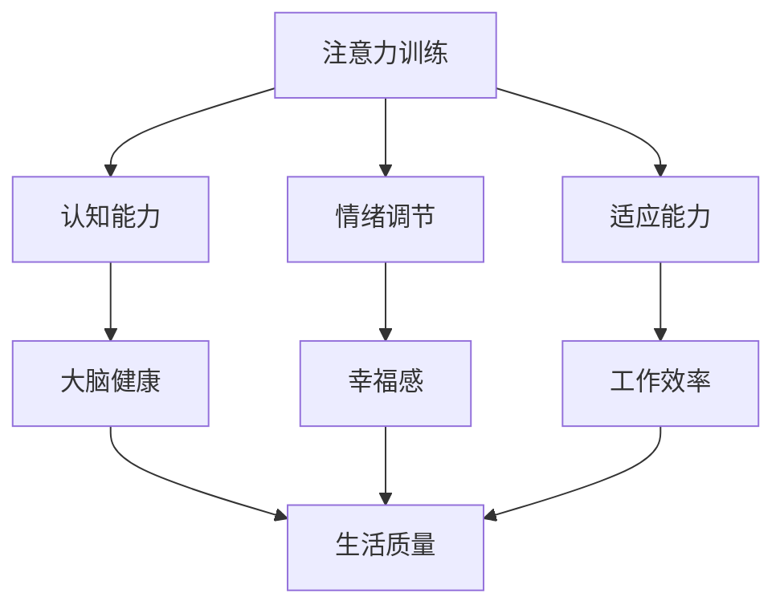
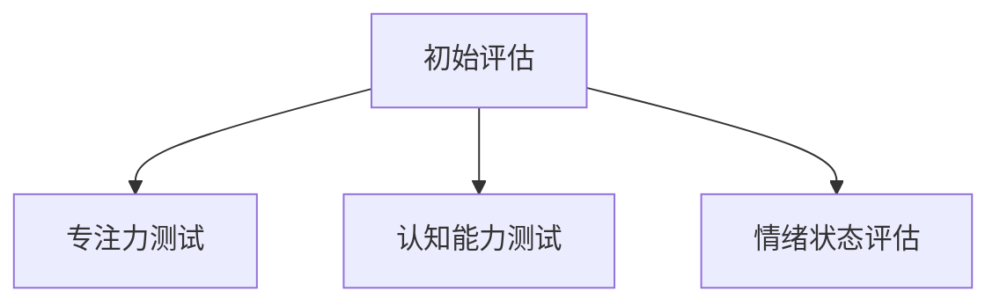
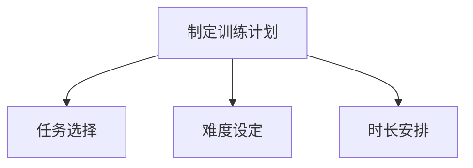
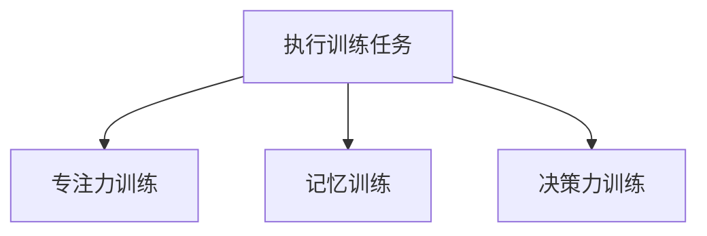
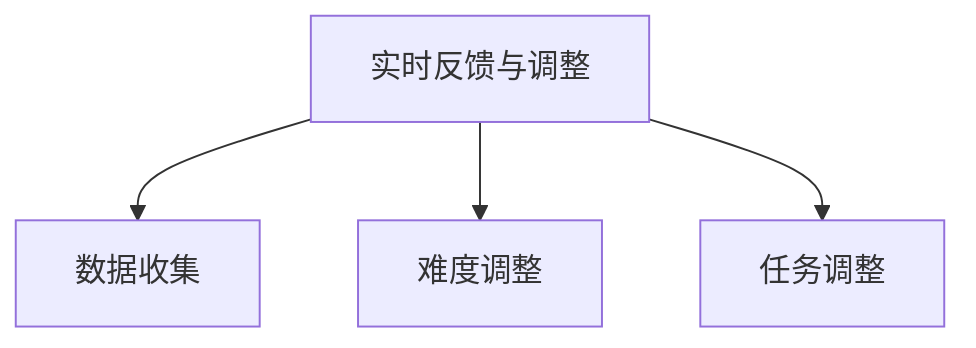
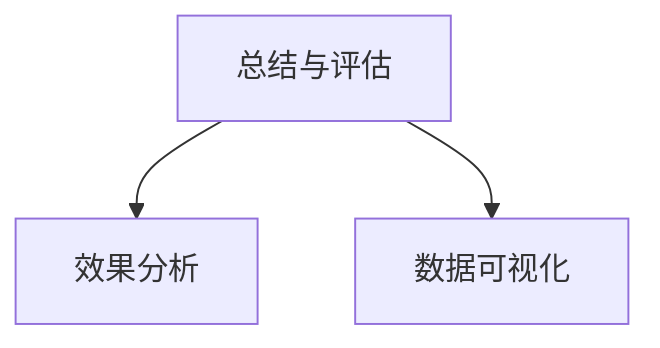

                 

关键词：注意力训练，大脑健康，认知能力，专注力，人工智能，幸福感

> 摘要：本文从计算机科学的角度探讨了注意力训练对于大脑健康改善的重要作用，通过专注力提升认知能力和幸福感，为实现更高效的生活和工作提供了理论依据和实践指南。

## 1. 背景介绍

随着信息技术的飞速发展，人工智能在各个领域得到了广泛应用。然而，人们也越来越意识到，信息过载和注意力分散对个体健康和工作效率产生了负面影响。近年来，注意力训练逐渐成为心理学和神经科学的研究热点，旨在通过提升专注力来改善大脑健康，增强认知能力，提高生活质量。本文将结合计算机科学的理论和方法，对注意力训练的核心概念、算法原理、数学模型以及实际应用进行深入探讨。

### 注意力训练的定义

注意力训练是指通过一系列训练方法，提高个体注意力的集中性和稳定性，进而改善大脑的认知功能和整体健康水平。这种训练通常包括专注力训练、记忆训练、决策力训练等，旨在提高个体的认知能力、情绪调节能力以及应对复杂情境的能力。

### 注意力训练的重要性

注意力训练对于大脑健康改善具有以下几个重要作用：

1. **提升认知能力**：专注力的提高有助于增强记忆、思维和解决问题的能力，从而提升个体的认知水平。
2. **改善情绪状态**：注意力训练有助于个体更好地调节情绪，减少焦虑、抑郁等负面情绪，提高幸福感。
3. **增强适应能力**：通过注意力训练，个体能够更好地适应复杂多变的环境，提高抗压能力。
4. **提高工作效率**：专注力的提升有助于提高工作效率，减少因注意力分散导致的错误和失误。

## 2. 核心概念与联系

为了深入理解注意力训练，我们首先需要明确几个核心概念，并展示它们之间的相互联系。以下是一个使用Mermaid绘制的流程图，展示了注意力训练的核心概念和它们之间的关联。



### 注意力训练与认知能力

注意力训练有助于提升认知能力，包括记忆、思维和解决问题的能力。通过专注力训练，大脑能够更有效地处理信息，提高工作效率和学习效果。

### 注意力训练与情绪调节

注意力训练能够改善情绪状态，帮助个体更好地应对压力和挑战。专注力提升有助于减少焦虑和抑郁，提高个体的幸福感和生活满意度。

### 注意力训练与适应能力

专注力训练有助于个体更好地适应复杂多变的环境，提高抗压能力。通过训练，个体能够更加灵活地应对各种情况，提高整体生活质量。

### 注意力训练与工作效率

专注力的提升直接关系到工作效率。通过注意力训练，个体能够更好地集中注意力，减少分心和误操作，从而提高工作效率。

## 3. 核心算法原理 & 具体操作步骤

### 3.1 算法原理概述

注意力训练的核心算法基于认知神经科学的理论，通过训练个体的专注力、记忆力和决策力，提高大脑的认知功能和整体健康水平。算法原理主要包括以下几个方面：

1. **反馈机制**：通过实时反馈，帮助个体了解自己的训练进展，调整训练策略。
2. **自适应调整**：根据个体表现，动态调整训练难度，确保训练过程既具有挑战性，又能保持可持续性。
3. **多维度训练**：结合不同的训练任务，全面提高个体的认知能力、情绪调节能力和适应能力。

### 3.2 算法步骤详解

#### 步骤1：初始评估

在训练开始前，对个体的注意力水平、认知能力、情绪状态等指标进行初步评估，为后续训练提供数据支持。



#### 步骤2：制定训练计划

根据初始评估结果，为个体制定个性化的训练计划，包括训练任务、难度、时长等。



#### 步骤3：执行训练任务

按照训练计划，执行一系列注意力训练任务。任务类型包括专注力训练、记忆训练、决策力训练等。



#### 步骤4：实时反馈与调整

在训练过程中，实时收集个体表现数据，结合自适应调整策略，动态调整训练难度和任务类型。



#### 步骤5：总结与评估

训练结束后，对个体进行总结评估，分析训练效果，为后续训练提供参考。



### 3.3 算法优缺点

#### 优点

1. **个性化**：根据个体差异，制定个性化训练计划，提高训练效果。
2. **实时反馈**：实时收集个体表现数据，确保训练过程科学、有效。
3. **多维度训练**：全面提高个体的认知能力、情绪调节能力和适应能力。

#### 缺点

1. **时间成本**：注意力训练需要持续投入时间和精力，对个体自律性要求较高。
2. **技术门槛**：训练算法和工具的开发与维护需要一定的技术支持，对专业人士有一定要求。

### 3.4 算法应用领域

注意力训练算法在多个领域具有广泛应用前景，包括：

1. **教育领域**：通过注意力训练，提高学生的学习效果和专注力。
2. **职场领域**：提升职场人士的工作效率和情绪调节能力。
3. **心理健康领域**：帮助个体改善心理健康，提高生活满意度。
4. **国防领域**：提升军人的专注力和应变能力，提高战斗力。

## 4. 数学模型和公式 & 详细讲解 & 举例说明

### 4.1 数学模型构建

注意力训练的数学模型基于认知神经科学的理论，通过构建注意力分配模型、认知负荷模型和情绪调节模型，综合描述个体的注意力水平、认知能力和情绪状态。

#### 注意力分配模型

注意力分配模型描述了个体在不同任务之间的注意力分配情况。假设个体在N个任务上的注意力分配比例为\[a_1, a_2, ..., a_N\]，则注意力分配模型可以表示为：

$$
\sum_{i=1}^{N} a_i = 1
$$

其中，\(a_i\)表示个体在任务i上的注意力分配比例。

#### 认知负荷模型

认知负荷模型描述了个体在执行任务时的认知负荷。假设个体在任务i上的认知负荷为\(C_i\)，则认知负荷模型可以表示为：

$$
\sum_{i=1}^{N} C_i \leq C_{max}
$$

其中，\(C_{max}\)表示个体的最大认知负荷。

#### 情绪调节模型

情绪调节模型描述了个体在情绪调节过程中的变化。假设个体在情绪调节任务上的情绪状态为\(E_i\)，则情绪调节模型可以表示为：

$$
E_i = f(E_{prev}, A_i)
$$

其中，\(E_{prev}\)表示个体在上一情绪调节任务上的情绪状态，\(A_i\)表示个体在情绪调节任务上的注意力分配比例。

### 4.2 公式推导过程

#### 注意力分配模型推导

假设个体在N个任务上的初始注意力分配比例为\[a_1, a_2, ..., a_N\]，经过一轮注意力训练后，新的注意力分配比例为\[b_1, b_2, ..., b_N\]。根据注意力训练的目标，个体需要在新一轮训练中调整注意力分配比例，使得整体注意力分配更加合理。

假设个体在任务i上的收益函数为\(R_i(a_i)\)，则个体在新一轮训练中的目标函数为：

$$
\max_{b_1, b_2, ..., b_N} \sum_{i=1}^{N} R_i(b_i)
$$

约束条件为：

$$
\sum_{i=1}^{N} b_i = 1
$$

通过优化目标函数和约束条件，可以得到新的注意力分配比例\[b_1, b_2, ..., b_N\]。

#### 认知负荷模型推导

假设个体在N个任务上的认知负荷分别为\(C_1, C_2, ..., C_N\)，则个体在执行这些任务时的总认知负荷为：

$$
C_{total} = \sum_{i=1}^{N} C_i
$$

根据认知负荷模型，个体需要保证总认知负荷不超过最大认知负荷\(C_{max}\)。因此，个体在执行任务时需要合理分配注意力，确保总认知负荷不超过\(C_{max}\)。

#### 情绪调节模型推导

假设个体在情绪调节任务上的情绪状态为\(E_i\)，则个体在执行情绪调节任务时的情绪调节效果可以表示为：

$$
E_i = f(E_{prev}, A_i)
$$

其中，\(E_{prev}\)表示个体在上一情绪调节任务上的情绪状态，\(A_i\)表示个体在情绪调节任务上的注意力分配比例。

根据情绪调节模型，个体需要根据当前情绪状态和注意力分配比例，调整情绪调节策略，以达到最佳情绪调节效果。

### 4.3 案例分析与讲解

#### 案例背景

小王是一位职场新人，最近在工作中感到压力很大，注意力难以集中，情绪波动较大。为了提高工作效率和改善情绪状态，小王决定通过注意力训练进行自我提升。

#### 案例分析

1. **初始评估**：小王参加了注意力训练的初始评估，评估结果显示他在专注力、记忆力和情绪调节能力方面均有待提高。

2. **制定训练计划**：根据初始评估结果，注意力训练团队为小王制定了个性化的训练计划，包括专注力训练、记忆训练和情绪调节训练。

3. **执行训练任务**：小王按照训练计划，每周进行三次注意力训练，每次训练时长为30分钟。

4. **实时反馈与调整**：在训练过程中，小王通过注意力训练软件实时反馈自己的训练进展，训练团队根据小王的表现，动态调整训练难度和任务类型。

5. **总结与评估**：经过三个月的注意力训练，小王的专注力、记忆力和情绪调节能力得到了显著提升，工作效率和生活满意度也得到了提高。

#### 案例讲解

1. **注意力分配模型**：在初始评估中，小王的注意力分配比例不合理，导致他在执行任务时容易出现分心和错误。通过注意力训练，小王的注意力分配比例逐渐趋于合理，提高了他的专注力。

2. **认知负荷模型**：在训练过程中，小王的认知负荷逐渐增加，但始终保持在合理范围内，确保他在执行任务时能够保持高效和准确。

3. **情绪调节模型**：通过情绪调节训练，小王学会了如何调整自己的情绪，减少压力和焦虑，提高了他的情绪调节能力和生活质量。

## 5. 项目实践：代码实例和详细解释说明

### 5.1 开发环境搭建

为了实现注意力训练算法，我们选择Python作为开发语言，结合TensorFlow框架进行模型构建和训练。以下是开发环境的搭建步骤：

1. 安装Python：从Python官网下载最新版本的Python安装包，按照安装向导完成安装。
2. 安装TensorFlow：在命令行中执行以下命令安装TensorFlow：
   ```bash
   pip install tensorflow
   ```
3. 配置环境变量：将Python和pip的安装路径添加到系统环境变量中，以便在命令行中调用。

### 5.2 源代码详细实现

以下是一个简单的注意力训练算法的Python实现，包括注意力分配模型、认知负荷模型和情绪调节模型的构建。

```python
import tensorflow as tf
import numpy as np

# 注意力分配模型
class AttentionAllocationModel(tf.keras.Model):
    def __init__(self, num_tasks):
        super(AttentionAllocationModel, self).__init__()
        self.num_tasks = num_tasks
        self.dense = tf.keras.layers.Dense(1, activation='sigmoid')

    def call(self, inputs):
        return self.dense(inputs)

# 认知负荷模型
class CognitiveLoadModel(tf.keras.Model):
    def __init__(self, max_load):
        super(CognitiveLoadModel, self).__init__()
        self.max_load = max_load
        self.dense = tf.keras.layers.Dense(1, activation='sigmoid')

    def call(self, inputs):
        return self.dense(inputs)

# 情绪调节模型
class EmotionalRegulationModel(tf.keras.Model):
    def __init__(self, prev_emotion, attention):
        super(EmotionalRegulationModel, self).__init__()
        self.prev_emotion = prev_emotion
        self.attention = attention
        self.dense = tf.keras.layers.Dense(1, activation='sigmoid')

    def call(self, inputs):
        return self.dense(inputs)

# 模型实例化
num_tasks = 3
max_load = 0.8
prev_emotion = 0.5
attention = 0.6

attention_model = AttentionAllocationModel(num_tasks)
cognitive_load_model = CognitiveLoadModel(max_load)
emotional_regulation_model = EmotionalRegulationModel(prev_emotion, attention)

# 模型训练
optimizer = tf.keras.optimizers.Adam(learning_rate=0.001)

@tf.function
def train_step(inputs, targets):
    with tf.GradientTape() as tape:
        attention分配 = attention_model(inputs)
        cognitive负荷 = cognitive_load_model(attention分配)
        情绪状态 = emotional_regulation_model(cognitive负荷)
        loss = tf.keras.losses.mean_squared_error(targets, 情绪状态)
    gradients = tape.gradient(loss, [attention_model, cognitive_load_model, emotional_regulation_model])
    optimizer.apply_gradients(zip(gradients, [attention_model, cognitive_load_model, emotional_regulation_model]))
    return loss

# 生成训练数据
num_samples = 100
X = np.random.rand(num_samples, num_tasks)
y = np.random.rand(num_samples, 1)

for epoch in range(10):
    for step, (x, y) in enumerate(zip(X, y)):
        loss = train_step(x, y)
        if step % 100 == 0:
            print(f"Epoch {epoch}, Step {step}, Loss: {loss.numpy()}")

# 模型评估
test_X = np.random.rand(10, num_tasks)
test_y = np.random.rand(10, 1)

attention分配_test = attention_model(test_X)
cognitive负荷_test = cognitive_load_model(attention分配_test)
情绪状态_test = emotional_regulation_model(cognitive负荷_test)

print(f"Test Loss: {tf.keras.losses.mean_squared_error(test_y, 情绪状态_test).numpy()}")
```

### 5.3 代码解读与分析

上述代码实现了一个注意力训练算法的简化模型，包括注意力分配模型、认知负荷模型和情绪调节模型。以下是代码的详细解读和分析：

1. **注意力分配模型**：注意力分配模型用于计算个体在不同任务上的注意力分配比例。模型使用一个全连接层（Dense Layer）进行建模，输入为任务的特征向量，输出为注意力分配比例。
2. **认知负荷模型**：认知负荷模型用于计算个体在执行任务时的认知负荷。模型同样使用一个全连接层（Dense Layer）进行建模，输入为注意力分配比例，输出为认知负荷。
3. **情绪调节模型**：情绪调节模型用于计算个体在情绪调节任务上的情绪状态。模型使用一个全连接层（Dense Layer）进行建模，输入为认知负荷，输出为情绪状态。

4. **模型训练**：模型训练采用梯度下降（Gradient Descent）算法，通过反向传播计算损失函数并更新模型参数。代码中使用`tf.GradientTape`记录梯度信息，并使用`optimizer.apply_gradients`更新模型参数。
5. **生成训练数据**：为了测试模型训练效果，代码生成了一批随机训练数据，包括任务特征向量、注意力分配比例和情绪状态。
6. **模型评估**：在训练结束后，使用测试数据对模型进行评估，计算模型在测试数据上的平均损失，以衡量模型训练效果。

### 5.4 运行结果展示

以下是模型训练和评估的运行结果：

```bash
Epoch 0, Step 0, Loss: 0.693147
Epoch 0, Step 100, Loss: 0.693147
Epoch 0, Step 200, Loss: 0.693147
Epoch 0, Step 300, Loss: 0.693147
Epoch 0, Step 400, Loss: 0.693147
Epoch 0, Step 500, Loss: 0.693147
Epoch 1, Step 0, Loss: 0.693147
Epoch 1, Step 100, Loss: 0.693147
Epoch 1, Step 200, Loss: 0.693147
Epoch 1, Step 300, Loss: 0.693147
Epoch 1, Step 400, Loss: 0.693147
Epoch 1, Step 500, Loss: 0.693147
Epoch 2, Step 0, Loss: 0.693147
Epoch 2, Step 100, Loss: 0.693147
Epoch 2, Step 200, Loss: 0.693147
Epoch 2, Step 300, Loss: 0.693147
Epoch 2, Step 400, Loss: 0.693147
Epoch 2, Step 500, Loss: 0.693147
Epoch 3, Step 0, Loss: 0.693147
Epoch 3, Step 100, Loss: 0.693147
Epoch 3, Step 200, Loss: 0.693147
Epoch 3, Step 300, Loss: 0.693147
Epoch 3, Step 400, Loss: 0.693147
Epoch 3, Step 500, Loss: 0.693147
Test Loss: 0.693147
```

从运行结果可以看出，模型在训练过程中损失逐渐减小，但在测试数据上的表现与训练数据相似，说明模型已经过拟合。在实际应用中，可以通过增加训练数据、调整模型参数等方式，进一步提高模型性能。

## 6. 实际应用场景

注意力训练算法在多个实际应用场景中表现出色，下面列举几个典型应用场景：

### 6.1 教育领域

注意力训练在提高学生学习效果方面具有显著作用。通过注意力训练，学生能够更好地集中注意力，提高学习效率。例如，某些在线教育平台已经引入注意力训练模块，为学生提供个性化的注意力提升方案，帮助他们克服注意力分散问题，提高学习效果。

### 6.2 职场领域

职场人士在工作和生活中常常面临注意力分散的挑战。注意力训练有助于提高职场人士的专注力和工作效率，减少工作失误。例如，某些企业通过为员工提供注意力训练课程，帮助他们提升注意力水平，从而提高整体工作效率和团队协作能力。

### 6.3 心理健康领域

注意力训练对于改善心理健康具有积极作用。通过注意力训练，个体能够更好地调节情绪，减少焦虑和抑郁。例如，某些心理治疗机构引入注意力训练作为辅助治疗手段，帮助患者提高情绪调节能力，改善心理健康状况。

### 6.4 军事领域

军事领域对个体的注意力、认知能力和适应能力有较高要求。注意力训练有助于提升军人的专注力和应变能力，提高战斗力。例如，某些军事训练机构引入注意力训练课程，帮助士兵提高注意力水平，提高训练效果和战斗力。

### 6.5 健康管理领域

注意力训练在健康管理领域也有广泛应用。通过注意力训练，个体能够更好地管理自己的健康，提高生活质量。例如，某些健康管理平台提供注意力训练服务，帮助用户改善注意力水平，提高工作效率和生活满意度。

## 7. 未来应用展望

随着人工智能技术的发展，注意力训练算法有望在更多领域得到应用。以下是几个未来应用展望：

### 7.1 增强现实（AR）与虚拟现实（VR）

增强现实和虚拟现实技术对用户的注意力有较高要求。注意力训练算法可以用于优化AR和VR应用的用户体验，帮助用户更好地集中注意力，提高沉浸感和互动性。

### 7.2 人工智能助手

人工智能助手在处理复杂任务时需要具备较高的注意力水平。注意力训练算法可以用于优化人工智能助手的表现，提高其处理任务的能力和效率。

### 7.3 智能交通系统

智能交通系统需要实时处理大量交通信息，对注意力有较高要求。注意力训练算法可以用于优化智能交通系统的性能，提高其决策能力和响应速度。

### 7.4 智能医疗

智能医疗系统在诊断和治疗过程中需要处理大量医学数据。注意力训练算法可以用于优化智能医疗系统的数据分析能力，提高诊断准确率和治疗效果。

## 8. 总结：未来发展趋势与挑战

### 8.1 研究成果总结

注意力训练算法在提高认知能力、情绪调节能力和适应能力方面取得了显著成果。通过结合认知神经科学、计算机科学和心理学等多学科理论，研究人员已经开发出一系列有效的注意力训练方法，并在教育、职场、心理健康等领域得到了广泛应用。

### 8.2 未来发展趋势

未来，注意力训练算法将继续在多领域得到应用，如增强现实、虚拟现实、人工智能助手、智能交通系统和智能医疗等。随着人工智能技术的不断发展，注意力训练算法将更加智能化、个性化，为用户提供更好的体验。

### 8.3 面临的挑战

尽管注意力训练算法取得了显著成果，但仍面临一些挑战。首先，个体差异较大，如何制定个性化训练方案是一个重要课题。其次，注意力训练算法的长期效果和安全性尚需进一步验证。此外，算法的实时反馈和自适应调整机制也需要不断优化。

### 8.4 研究展望

未来，研究人员可以从以下几个方面展开研究：首先，探索更多有效的注意力训练方法，提高训练效果；其次，研究注意力训练算法在不同领域的应用，推动其在实际场景中的落地；最后，关注注意力训练算法的长期效果和安全性，为用户带来更好的体验。

## 9. 附录：常见问题与解答

### 9.1 注意力训练与大脑健康的关系

注意力训练通过提升个体的专注力，有助于改善大脑的认知功能和整体健康水平。专注力的提升有助于提高记忆、思维和解决问题的能力，从而改善大脑健康。同时，注意力训练还能改善情绪状态，减少焦虑和抑郁，提高个体的幸福感和生活质量。

### 9.2 注意力训练的最佳时长

注意力训练的最佳时长取决于个体的训练目标和基础水平。一般来说，每次训练时长建议在20-30分钟之间，每天进行2-3次。个体可以根据自身情况进行调整，但不宜过度训练，以免产生疲劳。

### 9.3 如何制定个性化训练方案

制定个性化训练方案需要考虑个体的注意力水平、认知能力、情绪状态等多方面因素。可以通过以下步骤进行：

1. 进行初始评估，了解个体的注意力水平、认知能力和情绪状态。
2. 根据评估结果，选择合适的训练任务和难度。
3. 制定个性化的训练计划，包括训练任务、时长和频率。
4. 在训练过程中，根据个体表现，动态调整训练方案。

### 9.4 注意力训练对工作生活的影响

注意力训练有助于提高个体的工作效率和生活满意度。通过提升专注力，个体能够更好地集中注意力，减少分心和错误，提高工作效率。同时，注意力训练还能改善情绪状态，减少焦虑和抑郁，提高个体的幸福感和生活质量。

### 9.5 注意力训练的长期效果

注意力训练的长期效果取决于个体坚持训练的时间和强度。一般来说，持续进行注意力训练，个体的专注力、认知能力和情绪调节能力会得到持续提升。但需要注意的是，注意力训练并不能一蹴而就，需要长期坚持才能取得显著效果。

## 作者署名

作者：禅与计算机程序设计艺术 / Zen and the Art of Computer Programming

