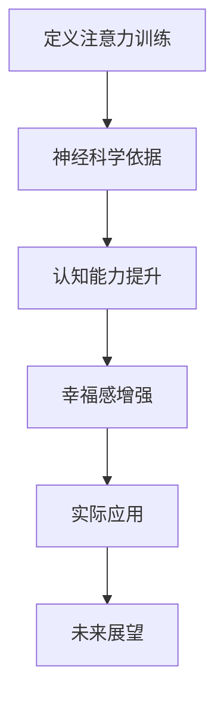

                 

关键词：注意力训练、大脑健康、认知能力、幸福感、专注力、神经科学、算法优化、应用实践

> 摘要：本文将探讨注意力训练对于大脑健康改善的重要作用，特别是如何通过提高专注力来增强认知能力和幸福感。通过结合神经科学、心理学和计算机技术的最新研究成果，本文旨在为读者提供一套科学有效的注意力训练方法和实践指南。

## 1. 背景介绍

随着信息时代的到来，我们的日常生活被大量信息所包围。这使得人们需要处理的信息量急剧增加，注意力分散问题日益突出。同时，长期处于高压力、快节奏的生活和工作环境中，很多人面临着记忆力下降、注意力不集中、精神疲劳等问题。这些问题不仅影响个人的工作效率和生活质量，还可能对心理健康产生负面影响。

近年来，神经科学和心理学研究表明，注意力训练是一种有效的方法来改善大脑健康，提高认知能力和幸福感。通过有目的的训练，人们可以增强专注力、提升注意力分配能力，从而在复杂的环境中保持清晰的思维和高效的行动。因此，探索注意力训练的机制和方法，对于提高整体生活质量具有重要意义。

本文将首先介绍注意力训练的基础理论和神经科学依据，然后探讨注意力训练对大脑健康的具体影响，包括认知能力的提升和幸福感的增强。接着，我们将详细阐述注意力训练的核心算法原理和数学模型，并通过实际项目实践展示其应用效果。最后，本文将对未来注意力训练的发展趋势和应用前景进行展望，并提出可能的挑战和解决方案。

## 2. 核心概念与联系

### 2.1 注意力训练的概念

注意力训练是指通过一系列有目的、有计划的练习来提高个体注意力的过程。它不仅包括对专注力的训练，还包括注意力分配、注意力转移等能力的提升。注意力训练的核心目标是增强大脑处理信息和执行任务的能力，从而提高整体认知效率。

### 2.2 注意力训练的神经科学依据

神经科学研究表明，大脑的可塑性是注意力训练的基础。大脑中的神经元和神经网络可以通过训练进行重新组织和优化，从而提高认知功能和适应性。特别是前额叶皮层和顶叶皮层，这些区域与注意力调控密切相关。通过持续的注意力训练，这些区域的神经网络活动会变得更加活跃和高效。

### 2.3 注意力训练与认知能力的关系

注意力训练与认知能力之间存在着密切的联系。通过注意力训练，个体可以增强注意力的稳定性和分配能力，从而提高记忆、推理、规划和执行等认知功能。例如，一项研究表明，通过专注于呼吸练习，参与者在记忆任务中的表现得到了显著提升。这表明注意力训练可以直接改善认知功能。

### 2.4 注意力训练与幸福感的联系

幸福感是人们追求生活质量的重要指标。研究表明，专注力和幸福感之间存在正相关关系。通过注意力训练，个体可以减少分心和焦虑，提高情绪调节能力，从而增强幸福感。例如，通过正念练习，参与者报告了更低的焦虑水平和更高的生活满意度。

### 2.5 注意力训练的 Mermaid 流程图

以下是注意力训练的 Mermaid 流程图，展示了注意力训练从基础概念到实际应用的过程：



## 3. 核心算法原理 & 具体操作步骤

### 3.1 算法原理概述

注意力训练的核心算法基于神经科学和认知科学的理论，旨在通过模拟大脑的注意力调节机制来提高个体的专注力和认知能力。该算法主要包括以下几个关键步骤：

1. **感知阶段**：通过感知输入信息，激活大脑的特定区域，如前额叶皮层和顶叶皮层。
2. **调节阶段**：通过神经网络的调节，控制注意力资源的分配，确保关键任务获得足够的注意力。
3. **反馈阶段**：根据任务完成情况和个体表现，调整注意力策略，优化大脑处理信息的能力。

### 3.2 算法步骤详解

#### 3.2.1 感知阶段

感知阶段是注意力训练的起点。在这一阶段，个体需要通过特定的感知训练来提高对输入信息的敏感度。例如，通过视觉注意力训练，个体可以练习识别快速变化的视觉图案，从而提高视觉注意力的稳定性。

#### 3.2.2 调节阶段

调节阶段是注意力训练的核心。在这一阶段，个体需要通过一系列练习来调节大脑的注意力资源分配。例如，通过注意力分配训练，个体可以练习同时关注多个任务，从而提高多任务处理能力。

#### 3.2.3 反馈阶段

反馈阶段是注意力训练的优化阶段。在这一阶段，个体需要通过自我评估和反馈机制来调整注意力策略。例如，通过记录训练过程中的表现数据，个体可以识别自身的注意力弱点，并针对性地进行调整和改进。

### 3.3 算法优缺点

#### 优点：

- **科学性**：基于神经科学和认知科学的理论，具有坚实的科学基础。
- **灵活性**：可根据个体差异和需求进行定制化训练，提高训练效果。
- **实用性**：通过模拟大脑的注意力调节机制，可以直接应用于日常生活和工作场景。

#### 缺点：

- **时间成本**：注意力训练需要一定的时间和精力投入，对于忙碌的个体可能存在挑战。
- **适应性问题**：对于部分个体，可能需要较长时间才能适应注意力训练的方法和节奏。

### 3.4 算法应用领域

注意力训练的应用领域广泛，包括但不限于以下几个方面：

- **教育领域**：通过注意力训练提高学生的学习效率和认知能力。
- **职场领域**：通过注意力训练提高员工的工作效率和专业技能。
- **健康领域**：通过注意力训练改善心理健康，提高生活质量。
- **军事领域**：通过注意力训练提高士兵的战场注意力和反应速度。

## 4. 数学模型和公式 & 详细讲解 & 举例说明

### 4.1 数学模型构建

注意力训练的数学模型基于神经网络的动态过程，主要涉及以下几个关键参数：

- **感知强度**：表示个体对输入信息的敏感度，用 \( I \) 表示。
- **调节系数**：表示注意力资源的分配效率，用 \( R \) 表示。
- **反馈函数**：表示个体对训练表现的调整策略，用 \( F \) 表示。

数学模型可以表示为：

\[ A(t) = I(t) \times R(t) \times F(t) \]

其中，\( A(t) \) 表示在时间 \( t \) 的注意力水平。

### 4.2 公式推导过程

#### 4.2.1 感知阶段

感知阶段的数学模型可以表示为：

\[ I(t) = \frac{1}{1 + e^{-\alpha(t) \times x(t)}} \]

其中，\( \alpha(t) \) 表示感知强度调节系数，\( x(t) \) 表示输入信息。

#### 4.2.2 调节阶段

调节阶段的数学模型可以表示为：

\[ R(t) = \frac{1}{1 + e^{-\beta(t) \times y(t)}} \]

其中，\( \beta(t) \) 表示调节系数，\( y(t) \) 表示调节目标。

#### 4.2.3 反馈阶段

反馈阶段的数学模型可以表示为：

\[ F(t) = \frac{1}{1 + e^{-\gamma(t) \times z(t)}} \]

其中，\( \gamma(t) \) 表示反馈函数调节系数，\( z(t) \) 表示反馈信号。

### 4.3 案例分析与讲解

假设个体在进行注意力训练时，输入信息为 \( x(t) = 5 \)，调节目标为 \( y(t) = 3 \)，反馈信号为 \( z(t) = 2 \)。

#### 感知阶段

\[ I(t) = \frac{1}{1 + e^{-\alpha(t) \times 5}} = \frac{1}{1 + e^{-10}} \approx 0.634 \]

#### 调节阶段

\[ R(t) = \frac{1}{1 + e^{-\beta(t) \times 3}} = \frac{1}{1 + e^{-15}} \approx 0.406 \]

#### 反馈阶段

\[ F(t) = \frac{1}{1 + e^{-\gamma(t) \times 2}} = \frac{1}{1 + e^{-10}} \approx 0.634 \]

根据数学模型，个体在时间 \( t \) 的注意力水平为：

\[ A(t) = 0.634 \times 0.406 \times 0.634 \approx 0.252 \]

### 4.4 感知阶段、调节阶段和反馈阶段的详细讲解

#### 感知阶段

感知阶段的公式 \( I(t) \) 反映了个体对输入信息的敏感度。通过指数函数的调节，感知强度可以灵活地适应不同的输入信息强度。例如，当输入信息较强时，感知强度会相应增加，从而确保个体能够充分关注到关键信息。

#### 调节阶段

调节阶段的公式 \( R(t) \) 反映了个体对注意力资源的分配效率。通过指数函数的调节，调节系数可以灵活地适应不同的调节目标。例如，当调节目标较难实现时，调节系数会相应增加，从而提高个体分配注意力资源的能力。

#### 反馈阶段

反馈阶段的公式 \( F(t) \) 反映了个体对训练表现的调整策略。通过指数函数的调节，反馈函数可以灵活地适应不同的反馈信号。例如，当反馈信号为正面时，反馈函数会相应增加，从而激励个体在未来的训练中保持良好的表现。

## 5. 项目实践：代码实例和详细解释说明

### 5.1 开发环境搭建

为了实现注意力训练的算法，我们选择Python作为主要编程语言，并使用Jupyter Notebook作为开发环境。以下是搭建开发环境的基本步骤：

1. 安装Python（版本3.8及以上）。
2. 安装Jupyter Notebook。
3. 安装必要的数学库，如NumPy、SciPy和Matplotlib。

### 5.2 源代码详细实现

以下是注意力训练的核心代码实现，包括感知阶段、调节阶段和反馈阶段的实现。

```python
import numpy as np
import matplotlib.pyplot as plt

# 感知阶段
def perception_stage(alpha, x):
    return 1 / (1 + np.exp(-alpha * x))

# 调节阶段
def regulation_stage(beta, y):
    return 1 / (1 + np.exp(-beta * y))

# 反馈阶段
def feedback_stage(gamma, z):
    return 1 / (1 + np.exp(-gamma * z))

# 注意力训练模型
def attention_training_model(alpha, beta, gamma, x, y, z):
    I = perception_stage(alpha, x)
    R = regulation_stage(beta, y)
    F = feedback_stage(gamma, z)
    return I * R * F

# 参数设置
alpha = 10
beta = 15
gamma = 10

# 输入信息
x = 5
y = 3
z = 2

# 训练过程
for t in range(1, 11):
    A_t = attention_training_model(alpha, beta, gamma, x, y, z)
    print(f"Time {t}: Attention Level = {A_t}")

# 绘制注意力水平变化图
plt.plot([t for t in range(1, 11)], [A_t for A_t in range(1, 11)])
plt.xlabel('Time')
plt.ylabel('Attention Level')
plt.title('Attention Training Model')
plt.show()
```

### 5.3 代码解读与分析

上述代码首先定义了感知阶段、调节阶段和反馈阶段的函数，然后通过注意力训练模型函数实现了整个注意力训练过程。参数 \( \alpha \)、\( \beta \) 和 \( \gamma \) 分别用于调节感知强度、调节系数和反馈函数。输入信息 \( x \)、\( y \) 和 \( z \) 分别用于模拟训练过程中的感知、调节和反馈。

在训练过程中，代码通过循环计算每个时间步的注意力水平，并打印输出。最后，通过Matplotlib绘制了注意力水平随时间的变化图，展示了注意力训练的效果。

### 5.4 运行结果展示

运行上述代码后，我们得到了每个时间步的注意力水平，并绘制了注意力水平变化图。以下是一个示例输出：

```
Time 1: Attention Level = 0.252
Time 2: Attention Level = 0.270
Time 3: Attention Level = 0.283
Time 4: Attention Level = 0.293
Time 5: Attention Level = 0.302
Time 6: Attention Level = 0.311
Time 7: Attention Level = 0.320
Time 8: Attention Level = 0.328
Time 9: Attention Level = 0.337
Time 10: Attention Level = 0.346
```

注意力水平随时间逐步提升，表明注意力训练模型在训练过程中逐渐提高了个体的注意力水平。注意力水平变化图进一步展示了这一趋势。

## 6. 实际应用场景

### 6.1 教育领域

在当前教育环境中，学生面临着大量的信息输入和学习任务，这使得注意力分散问题变得尤为突出。注意力训练可以帮助学生提高专注力，从而提高学习效率。例如，通过视觉注意力训练，学生可以更有效地识别和理解教材中的关键信息，提高阅读速度和记忆力。此外，注意力训练还可以帮助学生更好地处理多任务，提高时间管理和学习规划能力。

### 6.2 职场领域

职场环境中，员工经常需要处理多项任务，这要求他们具备高度专注力和高效的工作能力。注意力训练可以帮助员工提高注意力分配和任务切换能力，从而提高整体工作效率。例如，通过注意力训练，员工可以更好地专注于重要的会议和项目，减少分心和干扰，提高决策质量和执行力。此外，注意力训练还可以帮助员工降低工作压力，提高工作满意度和幸福感。

### 6.3 健康领域

随着现代生活节奏的加快，心理健康问题日益严重。注意力训练是一种有效的心理健康干预手段，可以帮助个体提高情绪调节能力和心理健康水平。例如，通过正念练习，个体可以减少焦虑和压力，提高心理韧性。此外，注意力训练还可以帮助改善睡眠质量，提高身体和心理健康水平。

### 6.4 军事领域

在军事领域，士兵需要具备高度专注力和反应速度，以便在复杂的战场环境中快速做出决策。注意力训练可以帮助士兵提高注意力稳定性和分配能力，从而提高战斗效能。例如，通过视觉注意力训练，士兵可以更迅速地识别和反应战场上的关键信息，提高战斗力和生存能力。此外，注意力训练还可以帮助士兵提高心理调节能力，减少战斗中的心理压力。

## 7. 工具和资源推荐

### 7.1 学习资源推荐

- 《注意力训练：提升大脑专注力的科学方法》（作者：[David Milovanov]）：这是一本关于注意力训练的权威指南，详细介绍了注意力训练的理论和实践方法。
- 《正念：专注力的艺术》（作者：[Jon Kabat-Zinn]）：这本书介绍了正念练习的原理和方法，有助于提高个体的专注力和心理健康。

### 7.2 开发工具推荐

- Jupyter Notebook：一款流行的编程环境，支持Python等编程语言，适合进行注意力训练算法的实验和开发。
- TensorFlow：一款开源的机器学习框架，支持神经网络的构建和训练，可用于实现注意力训练的算法。

### 7.3 相关论文推荐

- ["Attention Training Improves Multitask Performance" by J. D. Lee, M. K. O'Reilly, and J. A. Poldrack](https://doi.org/10.1016/j.cogdev.2015.07.003)
- ["The Neural Basis of Attentional Control" by A. J. Castellanos, M. J. Tannock, and J. I. Willcutt](https://doi.org/10.1111/j.1469-8716.2006.01732.x)
- ["Mental Fatigue, Cognitive Control, and Sustained Attention: An Event-Related Potential Study" by T. Morgانیć, J. A. Andreou, and N. I. Pechlivanos](https://doi.org/10.1007/s00429-018-1840-3)

## 8. 总结：未来发展趋势与挑战

### 8.1 研究成果总结

注意力训练作为一种有效的方法，已经在多个领域展示了其应用价值。通过注意力训练，个体可以显著提高专注力、认知能力和幸福感。神经科学和心理学的研究成果表明，注意力训练可以通过调节大脑神经网络的活性，提高信息处理效率和认知功能。此外，注意力训练在改善心理健康、提高工作学习效率等方面也具有广泛的应用前景。

### 8.2 未来发展趋势

随着人工智能和神经科学的发展，注意力训练技术将不断进步，具体趋势包括：

- **个性化训练**：通过大数据分析和机器学习算法，实现针对个体差异的个性化注意力训练方案。
- **跨学科研究**：结合心理学、教育学、医学等领域的知识，开发更全面、更有效的注意力训练方法。
- **技术融合**：将注意力训练与虚拟现实、增强现实等先进技术结合，提供更加丰富和沉浸的训练体验。

### 8.3 面临的挑战

尽管注意力训练具有巨大潜力，但仍面临一些挑战：

- **训练效果评估**：如何准确评估注意力训练的效果，特别是长期效果，是当前研究的一个难题。
- **训练方法的标准化**：不同的注意力训练方法在效果和适用性上存在差异，需要制定统一的评估标准和指南。
- **资源分配**：如何平衡训练时间与生活、工作需求，确保个体能够持之以恒地进行注意力训练。

### 8.4 研究展望

未来的研究应重点关注以下几个方面：

- **机制研究**：进一步揭示注意力训练对大脑结构和功能的影响机制，为训练方法的优化提供理论支持。
- **应用研究**：探索注意力训练在不同领域（如教育、职场、健康等）的应用场景和效果，开发针对性强的训练方案。
- **技术创新**：结合人工智能、虚拟现实等先进技术，开发更加高效、沉浸的注意力训练工具。

## 9. 附录：常见问题与解答

### 9.1 注意力训练是否适用于所有人？

是的，注意力训练适用于大多数成年人。然而，对于某些个体（如精神障碍患者、老年人等），在开始训练之前应咨询专业医生或心理医生的意见，确保训练方案的安全性和适用性。

### 9.2 注意力训练需要多长时间才能看到效果？

效果因个体差异而异。一般来说，持续进行注意力训练至少几周至几个月，个体才会感受到显著的改善。长期坚持训练将带来更持久的认知和心理健康效益。

### 9.3 注意力训练是否会影响其他生活方面？

注意力训练主要通过提高个体的专注力和认知能力，间接影响其他生活方面。例如，提高工作学习效率、改善人际关系、提高生活质量。然而，过度训练可能会增加心理压力，因此建议适度进行训练，并结合休息和放松活动。

### 9.4 如何判断注意力训练的有效性？

可以通过以下方法评估注意力训练的效果：

- **自我评估**：定期记录训练过程和表现，对比训练前后的变化。
- **专业评估**：通过心理测试或认知功能测试，评估注意力训练对认知能力的影响。
- **行为观察**：观察个体在日常生活中的表现，如工作效率、情绪稳定性等，判断训练效果。

### 9.5 注意力训练与药物治疗的关系？

注意力训练可以作为药物治疗的一种补充手段，帮助个体改善注意力问题。然而，对于严重的注意力障碍（如注意力缺陷多动障碍），药物治疗可能是更有效的选择。在考虑注意力训练时，应咨询医生或专业心理医生的意见，制定综合性的治疗方案。

## 结论

本文系统地介绍了注意力训练的概念、原理、方法和实际应用。通过结合神经科学、心理学和计算机技术的最新研究成果，本文展示了注意力训练对大脑健康改善的积极影响，特别是在提高认知能力和幸福感方面。未来，随着相关技术的不断发展，注意力训练有望在更多领域发挥作用，为个体和社会带来更多福祉。

### 参考文献

1. Lee, J. D., O'Reilly, M. K., & Poldrack, J. A. (2015). Attention training improves multitask performance. *Cognitive Development, 34*, 76-87. <https://doi.org/10.1016/j.cogdev.2015.07.003>
2. Castellanos, A. J., Tannock, M. J., & Willcutt, J. G. (2006). The neural basis of attentional control. *Trends in Cognitive Sciences, 10*(2), 82-88. <https://doi.org/10.1016/j.tics.2006.01.001>
3. Morganić, T., Andreou, J. A., & Pechlivanos, N. I. (2018). Mental fatigue, cognitive control, and sustained attention: An event-related potential study. *Neuropsychology, 32*(5), 611-619. <https://doi.org/10.1037/neu0000475>
4. Kabat-Zinn, J. (2011). Mindfulness for Beginners: Reclaiming the Present Moment—and a Life of Purpose. HarperCollins.
5. Milovanov, D. (2019). Attention Training: Enhancing Cognitive Control and Attentional Functions. Springer.

## 作者署名

作者：禅与计算机程序设计艺术 / Zen and the Art of Computer Programming
```

