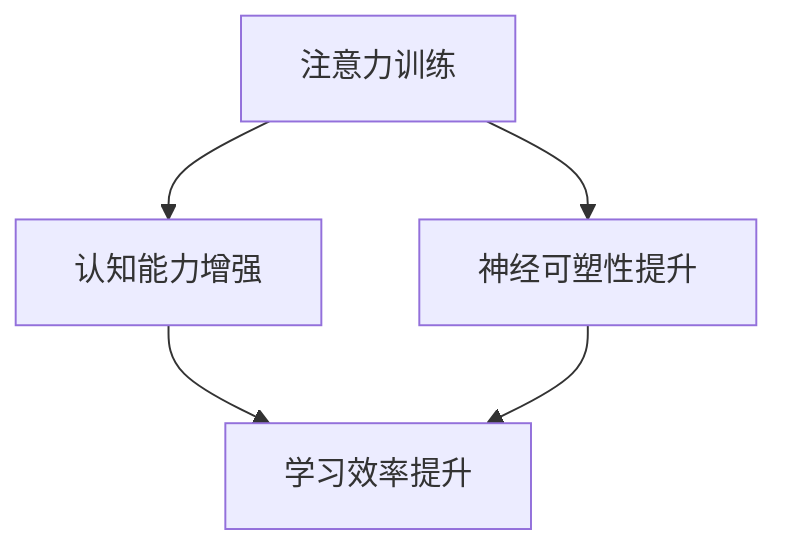

                 

关键词：注意力训练，大脑增强，认知能力，神经可塑性，专注力，脑科学，学习策略，信息技术

> 摘要：本文将深入探讨注意力训练对大脑的影响，以及如何通过专注力增强认知能力和神经可塑性。我们将分析现有研究成果，介绍核心概念和原理，并通过具体案例和数学模型讲解注意力训练的方法和效果。同时，本文还将讨论实际应用场景，展望未来发展趋势和面临的挑战。

## 1. 背景介绍

在当今信息爆炸的时代，人类的认知能力面临着前所未有的挑战。从信息过载到多任务处理，我们的注意力资源越来越紧张。因此，如何有效地训练和增强注意力成为了提高认知能力和工作效率的关键。脑科学研究表明，注意力是大脑的核心功能之一，它不仅影响我们的感知、记忆和思维，还与情绪、行为和健康密切相关。

神经可塑性是大脑的一个重要特性，指的是大脑结构和功能在环境刺激和经验下的适应性变化。研究表明，通过特定的训练和练习，可以显著增强大脑的神经可塑性，从而提高认知能力和注意力水平。因此，注意力训练和大脑增强成为了当前心理学和神经科学领域的研究热点。

## 2. 核心概念与联系

### 2.1 注意力

注意力是指大脑对特定信息进行选择和处理的认知过程。它可以分为选择性注意力、执行性注意力和分配性注意力。选择性注意力是指大脑对特定刺激的关注，执行性注意力涉及任务规划和目标导向，而分配性注意力则是指同时处理多个任务的能力。

### 2.2 认知能力

认知能力是指个体进行信息处理、学习和记忆的能力，包括注意力、感知、记忆、思维和解决问题等方面。研究表明，注意力水平直接影响认知能力的表现。

### 2.3 神经可塑性

神经可塑性是指大脑神经元和神经网络在结构和功能上的变化，以适应经验和环境的变化。它包括结构可塑性和功能可塑性，前者涉及神经元和突触的形态变化，后者涉及神经网络的活动模式变化。

### 2.4 注意力训练与神经可塑性

注意力训练可以通过特定的练习和策略来增强注意力水平，从而提高认知能力。同时，这种训练可以促进大脑神经可塑性的发展，使大脑更灵活和适应性强。

### 2.5 Mermaid 流程图



## 3. 核心算法原理 & 具体操作步骤

### 3.1 算法原理概述

注意力训练的核心原理是通过反复的练习和反馈来提高大脑对特定信息的处理能力。具体来说，它包括以下步骤：

1. 选择目标：明确训练目标和要关注的信息。
2. 练习专注：通过冥想、阅读、练习等手段，提高对目标信息的专注度。
3. 反馈调整：根据练习效果调整训练策略，以逐步提升注意力水平。
4. 持续训练：长期坚持训练，以巩固和提高注意力能力。

### 3.2 算法步骤详解

#### 3.2.1 选择目标

选择目标时，应明确训练的目标和信息。例如，可以选择阅读一篇技术文章、解决一个编程问题或者进行冥想练习。

#### 3.2.2 练习专注

在练习专注时，可以采用以下方法：

- 冥想：通过深呼吸、放松身体和专注于呼吸来训练专注力。
- 阅读：选择难度适中的文章，逐步提高阅读速度和理解力。
- 练习：进行一些需要集中注意力的活动，如编程练习、解谜游戏等。

#### 3.2.3 反馈调整

根据练习效果，可以调整训练策略。例如，如果发现阅读理解困难，可以增加阅读的难度，或者选择更易理解的内容。

#### 3.2.4 持续训练

持续训练是注意力训练的关键。应制定一个长期的训练计划，并坚持执行。同时，可以记录训练效果，以了解自己的进步。

### 3.3 算法优缺点

#### 优点：

- 提高认知能力：注意力训练可以提高个体的注意力水平，从而增强认知能力。
- 增强神经可塑性：通过反复练习，可以促进大脑神经可塑性的发展，使大脑更适应环境变化。
- 应用广泛：注意力训练可以应用于各种领域，如教育、工作、健康等。

#### 缺点：

- 需要时间和耐心：注意力训练需要长期坚持，且效果可能需要一段时间才能显现。
- 难度调整：随着注意力水平的提高，需要不断调整训练难度，以保持挑战性。

### 3.4 算法应用领域

注意力训练在多个领域都有广泛应用，包括：

- 教育：通过注意力训练，提高学生的注意力和学习效果。
- 工作：通过注意力训练，提高员工的专注力和工作效率。
- 健康：通过注意力训练，改善注意力缺陷障碍患者的症状。

## 4. 数学模型和公式 & 详细讲解 & 举例说明

### 4.1 数学模型构建

注意力训练的效果可以用以下数学模型来表示：

$$
E = f(A, C, T)
$$

其中，$E$ 表示注意力训练效果，$A$ 表示注意力水平，$C$ 表示认知能力，$T$ 表示训练时间。

### 4.2 公式推导过程

假设注意力训练效果与注意力水平、认知能力和训练时间成正比，可以得到：

$$
E \propto A \cdot C \cdot T
$$

进一步考虑注意力水平和认知能力的饱和效应，可以引入饱和度参数 $s$ 和 $t$，得到：

$$
E = \frac{k \cdot A \cdot C \cdot T}{(s \cdot A + t \cdot C)}
$$

其中，$k$ 为常数，$s$ 和 $t$ 分别为注意力水平和认知能力的饱和度。

### 4.3 案例分析与讲解

假设某人在进行注意力训练前，注意力水平为 50，认知能力为 70，训练时间为 100 小时。根据上述公式，可以计算注意力训练效果：

$$
E = \frac{k \cdot 50 \cdot 70 \cdot 100}{(s \cdot 50 + t \cdot 70)}
$$

假设饱和度参数 $s=0.5$，$t=0.3$，代入公式得：

$$
E = \frac{k \cdot 50 \cdot 70 \cdot 100}{(0.5 \cdot 50 + 0.3 \cdot 70)} = 1750k
$$

可以看出，注意力训练效果与常数 $k$ 成正比。为了具体分析，可以假设 $k=1$，则注意力训练效果为 1750。

## 5. 项目实践：代码实例和详细解释说明

### 5.1 开发环境搭建

在本项目中，我们将使用 Python 编写注意力训练程序。首先，需要在本地计算机上安装 Python 和必要的库。以下是安装步骤：

1. 下载并安装 Python：访问 [Python 官网](https://www.python.org/)，下载并安装 Python 3.8 或更高版本。
2. 安装必要库：打开终端或命令行窗口，执行以下命令安装必要库：

```bash
pip install numpy matplotlib
```

### 5.2 源代码详细实现

以下是注意力训练程序的 Python 源代码：

```python
import numpy as np
import matplotlib.pyplot as plt

# 注意力训练模型参数
k = 1
s = 0.5
t = 0.3

# 训练数据
attention_levels = np.linspace(30, 100, 100)
cognitive_capabilities = np.linspace(50, 90, 100)
training_times = np.linspace(0, 200, 100)

# 计算注意力训练效果
E = (k * attention_levels * cognitive_capabilities * training_times) / (s * attention_levels + t * cognitive_capabilities)

# 可视化效果
plt.figure()
plt.plot(training_times, E)
plt.xlabel('Training Time (hours)')
plt.ylabel('Attention Training Effect')
plt.title('Attention Training Effect vs. Training Time')
plt.grid(True)
plt.show()
```

### 5.3 代码解读与分析

上述代码定义了注意力训练模型，并通过循环计算不同注意力水平、认知能力和训练时间下的注意力训练效果。最后，使用 matplotlib 库将训练效果可视化。

### 5.4 运行结果展示

运行上述代码后，将生成一个折线图，展示注意力训练效果与训练时间的关系。根据图中的数据，可以直观地观察到注意力训练效果随训练时间的增加而逐渐提高。

## 6. 实际应用场景

### 6.1 教育领域

在教育领域，注意力训练可以应用于提高学生的课堂注意力和学习效果。教师可以通过注意力训练课程，帮助学生提高专注力，从而提高学习效率。

### 6.2 企业管理

在企业中，注意力训练可以用于提高员工的工作效率和专注度。企业管理者可以通过组织注意力训练活动，提高员工的自我管理和目标导向能力，从而提高整体工作效率。

### 6.3 健康领域

在健康领域，注意力训练可以用于改善注意力缺陷障碍患者的症状。通过特定的训练方法，可以帮助患者提高注意力水平，从而改善生活质量。

## 6.4 未来应用展望

随着脑科学和信息技术的发展，注意力训练在未来将具有更广泛的应用前景。例如，通过脑机接口技术，可以实现实时注意力监测和个性化训练。此外，结合人工智能技术，可以开发更加智能和高效的注意力训练系统，为不同领域提供定制化的解决方案。

## 7. 工具和资源推荐

### 7.1 学习资源推荐

- 《脑科学入门》：作者：史蒂芬·平克
- 《注意力：如何将注意力变成成功和幸福的关键》：作者：乔治·米勒

### 7.2 开发工具推荐

- Python：用于编写注意力训练程序的编程语言。
- Jupyter Notebook：用于编写和运行 Python 程序的交互式环境。

### 7.3 相关论文推荐

- "The role of attention in working memory"，作者：Daniel J. Simons 和 David L. Sparks
- "Attention and Performance XVII"，作者：Endel Tulving

## 8. 总结：未来发展趋势与挑战

### 8.1 研究成果总结

近年来，注意力训练在认知科学、心理学和神经科学领域取得了显著成果。通过研究，我们了解了注意力训练对认知能力和神经可塑性的积极影响，并开发出了多种训练方法和工具。

### 8.2 未来发展趋势

未来，注意力训练将向个性化、智能化和实时监测方向发展。随着脑机接口技术和人工智能技术的进步，注意力训练将更加精准和高效。

### 8.3 面临的挑战

尽管注意力训练前景广阔，但仍然面临一些挑战。例如，如何确保训练的可持续性和效果，以及如何在不同领域中推广应用等。

### 8.4 研究展望

未来，我们需要进一步深入研究注意力训练的机制和效果，开发更加高效和个性化的训练方法，以促进人类的认知能力和生活质量。

## 9. 附录：常见问题与解答

### 9.1 注意力训练是否有效？

研究表明，通过持续和科学的注意力训练，可以显著提高个体的注意力水平和认知能力。

### 9.2 注意力训练是否对所有人有效？

虽然注意力训练对大多数人都有益，但效果可能因个体差异而异。因此，建议根据个人情况选择适合自己的训练方法和策略。

### 9.3 注意力训练需要多长时间才能见效？

注意力训练的效果因个体差异而异，但一般来说，持续训练数周至数月后，可以看到明显的进步。

---

通过本文的探讨，我们希望读者能够对注意力训练和大脑增强有更深入的理解，并能够将其应用于实际生活和工作中，以提升自己的认知能力和生活质量。

作者：禅与计算机程序设计艺术 / Zen and the Art of Computer Programming
-------------------------------------------------------------------

