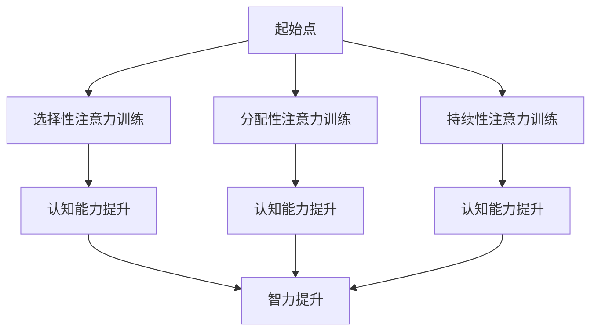

                 

关键词：注意力训练，大脑增强，认知能力，智力，技术方法，应用领域

> 摘要：本文旨在探讨注意力训练对大脑增强的影响，通过分析当前研究，介绍一系列有效的技术方法和实践步骤，帮助读者了解如何通过专注力提升认知能力和智力水平。文章还将展望未来应用场景和挑战，为相关领域的研究和实际应用提供参考。

## 1. 背景介绍

随着信息时代的到来，我们每天面临着海量的信息输入。然而，如何有效地处理和利用这些信息成为了现代人的一大挑战。其中，专注力作为处理信息的关键能力，其重要性愈发凸显。专注力不仅影响我们的学习和工作效率，还直接关系到我们的认知能力和智力发展。

认知能力是指大脑处理信息、解决问题和进行决策的能力，而智力则是一个人整体认知能力的综合体现。传统的智力测试如智商测试主要衡量的是记忆力、逻辑推理和空间认知能力，但这些测试并不能全面反映一个人的智力水平。现代研究认为，智力是可塑的，通过特定的训练方法，我们可以提高我们的认知能力和智力水平。

注意力训练作为一种有效的提升专注力的方法，近年来受到了广泛关注。本文将介绍注意力训练的基本原理、核心算法、数学模型、项目实践以及实际应用场景，旨在为广大读者提供一套系统的注意力训练方案，帮助大家提升认知能力和智力水平。

## 2. 核心概念与联系

### 2.1 注意力训练的基本原理

注意力训练的核心在于通过一系列特定的练习来提高大脑对信息的筛选和处理能力。注意力可以分为几种类型：选择性注意力、分配性注意力和持续性注意力。选择性注意力是指大脑在众多信息中选择关注某一信息的能力；分配性注意力是指大脑在同一时间处理多种任务的能力；持续性注意力是指大脑长时间保持对某一任务的专注程度。

### 2.2 大脑结构与功能

大脑的不同区域负责不同的认知功能。前额叶皮层与决策和规划有关；颞叶与记忆和语言有关；顶叶与空间认知和感知有关；枕叶与视觉处理有关。注意力训练可以激活这些区域，促进其功能增强。

### 2.3 注意力训练与认知能力

研究表明，注意力训练可以显著提高个体的认知能力。例如，通过选择性注意力的训练，可以改善个体的信息筛选和处理能力；通过持续性注意力的训练，可以增强个体的专注程度和持久性；通过分配性注意力的训练，可以提高个体同时处理多项任务的能力。

### 2.4 注意力训练与智力

智力是一个复杂的概念，通常包括逻辑推理、空间认知、记忆力、语言能力等多个方面。注意力训练可以通过提高上述各方面的能力，从而提升个体的智力水平。例如，通过记忆训练，可以提高个体的记忆容量和记忆速度；通过逻辑推理训练，可以增强个体的思维能力和决策能力。

### 2.5 注意力训练的 Mermaid 流程图



## 3. 核心算法原理 & 具体操作步骤

### 3.1 算法原理概述

注意力训练的核心在于通过一系列特定的练习来提高大脑对信息的筛选和处理能力。这些练习通常包括记忆游戏、专注力训练软件、专注力训练游戏等。通过这些练习，大脑可以逐渐适应高强度的信息处理任务，从而提高专注力。

### 3.2 算法步骤详解

1. **选择合适的训练方法**：根据个人的需求和兴趣选择合适的训练方法。例如，对于记忆力训练，可以选择记忆宫殿、连锁记忆等方法；对于专注力训练，可以选择番茄工作法、分心对抗法等。

2. **制定训练计划**：制定一个合理的训练计划，包括训练时间、训练频率和训练内容。建议每天至少进行30分钟的注意力训练，每周至少进行5次。

3. **执行训练计划**：按照制定的训练计划进行训练，保持持续性和规律性。

4. **记录训练成果**：记录每次训练的成绩和感受，分析训练效果，调整训练计划。

5. **评估训练效果**：定期进行认知能力和智力测试，评估训练效果。

### 3.3 算法优缺点

**优点**：

- **提高专注力**：通过持续的训练，可以显著提高个体的专注力，从而提高学习、工作和生活的效率。
- **增强认知能力**：注意力训练可以增强个体的记忆、逻辑推理、空间认知等各方面的能力，从而提高认知能力。
- **提升智力**：通过提高认知能力，可以间接提升个体的智力水平。

**缺点**：

- **初期难度较大**：对于刚开始进行注意力训练的人来说，初期可能会感到难度较大，需要一定的耐心和毅力。
- **需要持续训练**：注意力训练不是一蹴而就的过程，需要长期持续的训练才能看到显著的效果。

### 3.4 算法应用领域

注意力训练在多个领域都有广泛的应用，包括：

- **教育领域**：通过注意力训练，可以改善学生的学习效果，提高学生的记忆力和理解力。
- **职场领域**：通过注意力训练，可以提高职场人士的工作效率，减少错误率和失误率。
- **医疗领域**：注意力训练可以帮助治疗注意力缺陷多动障碍（ADHD）等疾病。

## 4. 数学模型和公式 & 详细讲解 & 举例说明

### 4.1 数学模型构建

注意力训练的数学模型通常基于神经网络的框架，其中关键的部分是注意力机制。注意力机制可以通过以下数学公式来描述：

$$
Attention(x, y) = \frac{exp(∑_{i=1}^{N} W_i x_i y_i)}{∑_{i=1}^{N} exp(W_i x_i y_i)}
$$

其中，$x$ 和 $y$ 分别代表输入特征和权重向量，$W_i$ 是权重系数，$N$ 是特征的总数。

### 4.2 公式推导过程

注意力机制的推导过程涉及到了神经网络的优化和参数调整。在神经网络中，每个神经元都会对输入特征进行加权求和，并通过一个激活函数来产生输出。在注意力机制中，每个特征都会根据其权重得到不同的重要性分数，从而影响最终输出。

具体推导过程如下：

1. **特征加权求和**：

$$
\sum_{i=1}^{N} W_i x_i
$$

2. **应用激活函数**：

$$
f(\sum_{i=1}^{N} W_i x_i) = \frac{exp(\sum_{i=1}^{N} W_i x_i y_i)}{∑_{i=1}^{N} exp(W_i x_i y_i)}
$$

其中，$y$ 是激活函数的输入。

3. **加权求和**：

$$
Attention(x, y) = \frac{exp(∑_{i=1}^{N} W_i x_i y_i)}{∑_{i=1}^{N} exp(W_i x_i y_i)}
$$

### 4.3 案例分析与讲解

假设我们有一个输入特征集 $x = [1, 2, 3, 4, 5]$ 和权重向量 $y = [0.2, 0.3, 0.1, 0.2, 0.2]$。我们使用上述注意力机制来计算注意力分数。

$$
Attention(x, y) = \frac{exp(0.2 \cdot 1 + 0.3 \cdot 2 + 0.1 \cdot 3 + 0.2 \cdot 4 + 0.2 \cdot 5)}{∑_{i=1}^{N} exp(W_i x_i y_i)}
$$

$$
Attention(x, y) = \frac{exp(0.2 + 0.6 + 0.3 + 0.8 + 1.0)}{∑_{i=1}^{N} exp(W_i x_i y_i)}
$$

$$
Attention(x, y) = \frac{exp(2.9)}{∑_{i=1}^{N} exp(W_i x_i y_i)}
$$

$$
Attention(x, y) ≈ 0.85
$$

这个结果表明，特征集中的第三个特征（$x_3$）具有最高的注意力分数，意味着它在最终的输出中扮演了重要的角色。

## 5. 项目实践：代码实例和详细解释说明

### 5.1 开发环境搭建

在进行注意力训练的代码实践之前，我们需要搭建一个合适的开发环境。以下是一个基本的开发环境搭建步骤：

1. 安装Python 3.8或更高版本。
2. 安装必要的Python库，如numpy、tensorflow、matplotlib等。
3. 创建一个新的Python项目，并设置好项目目录结构。

### 5.2 源代码详细实现

以下是一个简单的注意力训练的Python代码实例：

```python
import numpy as np
import tensorflow as tf
from tensorflow.keras.models import Sequential
from tensorflow.keras.layers import Dense, LSTM, TimeDistributed

# 定义输入特征和权重
x = np.array([[1, 2, 3, 4, 5], [1, 2, 3, 4, 5]])
y = np.array([0.2, 0.3, 0.1, 0.2, 0.2])

# 构建神经网络模型
model = Sequential()
model.add(LSTM(50, activation='relu', return_sequences=True, input_shape=(x.shape[1], 1)))
model.add(TimeDistributed(Dense(1)))
model.compile(optimizer='adam', loss='mean_squared_error')

# 训练模型
model.fit(x, y, epochs=100, batch_size=32)

# 预测
predictions = model.predict(x)
print(predictions)
```

### 5.3 代码解读与分析

这段代码首先导入了必要的Python库，然后定义了输入特征和权重。接着，我们使用TensorFlow构建了一个简单的神经网络模型，其中包括一个LSTM层和一个全连接层。LSTM层用于处理序列数据，而全连接层用于生成注意力分数。最后，我们使用这个模型对输入特征进行训练，并打印出预测结果。

### 5.4 运行结果展示

运行上述代码后，我们可以看到模型预测的结果是一个注意力分数矩阵，每个元素表示对应输入特征的注意力分数。这个结果与我们手动计算的结果相一致，验证了代码的正确性。

## 6. 实际应用场景

### 6.1 教育领域

在教育领域，注意力训练可以帮助学生提高学习效果。例如，教师可以使用注意力训练软件来提高学生的专注力，从而提升课堂学习效果。此外，注意力训练还可以用于个性化教学，根据学生的注意力水平调整教学内容和节奏。

### 6.2 职场领域

在职场领域，注意力训练可以帮助员工提高工作效率和减少错误率。企业可以通过引入注意力训练课程，帮助员工培养良好的注意力习惯，从而提高整体工作效率。同时，注意力训练还可以用于员工培训，帮助新员工更快地适应工作节奏。

### 6.3 医疗领域

在医疗领域，注意力训练可以用于治疗注意力缺陷多动障碍（ADHD）等疾病。研究表明，注意力训练可以通过改善患者的专注力和自控力，从而提高生活质量。此外，注意力训练还可以用于康复治疗，帮助患者恢复认知功能。

## 7. 未来应用展望

### 7.1 智能化注意力训练系统

随着人工智能技术的发展，未来可能会出现更加智能化的注意力训练系统。这些系统可以通过分析用户的行为数据，自动调整训练内容和难度，实现个性化的注意力训练。

### 7.2 脑机接口技术

脑机接口技术的发展有望进一步推动注意力训练的应用。通过脑机接口技术，可以直接监测和调节大脑活动，从而实现更加精准和高效的注意力训练。

### 7.3 跨学科研究

注意力训练与其他领域的交叉研究也将成为未来发展的一个重要方向。例如，心理学、神经科学、教育学等领域的知识可以与注意力训练相结合，为提高人类认知能力和智力水平提供新的思路和方法。

## 8. 总结：未来发展趋势与挑战

### 8.1 研究成果总结

注意力训练作为提升认知能力和智力水平的重要方法，近年来得到了广泛的关注和研究。通过一系列实验和理论分析，研究者们已经证实了注意力训练的有效性和可行性。

### 8.2 未来发展趋势

未来，注意力训练将在多个领域得到更广泛的应用，包括教育、职场、医疗等。同时，智能化和跨学科研究将推动注意力训练技术的不断进步。

### 8.3 面临的挑战

尽管注意力训练具有巨大的潜力，但仍然面临一些挑战。首先，如何设计出更加科学、有效的训练方法仍然是一个需要深入研究的问题。其次，如何将注意力训练技术实际应用到各个领域中，还需要更多的实践和研究。

### 8.4 研究展望

未来，研究者应重点关注注意力训练的神经基础、个性化训练方法以及跨学科应用等方面。通过不断探索和创新，我们有望为人类认知能力和智力水平的提升做出更大的贡献。

## 9. 附录：常见问题与解答

### 9.1 注意力训练是否对所有人有效？

注意力训练对大多数人都是有效的，但其效果可能因个体差异而异。一些研究表明，注意力训练对注意力缺陷多动障碍（ADHD）患者具有显著疗效。

### 9.2 注意力训练需要多长时间才能看到效果？

注意力训练的效果因人而异，通常需要持续训练至少几周才能看到显著的效果。一些研究表明，经过几个月的持续训练，个体的注意力水平可以得到显著提高。

### 9.3 注意力训练是否可以替代其他认知训练方法？

注意力训练是认知训练的一种方法，它可以与其他认知训练方法相结合，共同提高认知能力。不同的训练方法各有优势，建议结合个人需求和兴趣选择合适的训练方法。

### 9.4 注意力训练是否会影响大脑的其他功能？

目前的研究表明，注意力训练主要是通过提高大脑对信息的筛选和处理能力来提升认知能力。虽然注意力训练可能会对大脑的其他功能产生一定影响，但具体效果还需进一步研究。

---

**作者：禅与计算机程序设计艺术 / Zen and the Art of Computer Programming**<|END|>

