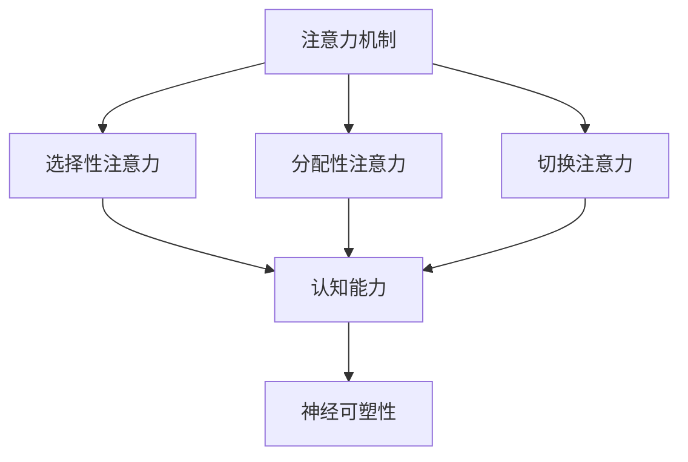

                 

关键词：注意力训练、大脑增强、认知能力、神经可塑性、专注力、技术博客、人工智能、IT领域、逻辑清晰、结构紧凑、简单易懂、专业

> 摘要：本文将探讨注意力训练与大脑增强的关系，以及如何通过专注力来提升认知能力和神经可塑性。通过深入分析注意力机制、训练方法及其应用领域，我们旨在为读者提供全面的技术解读和实践指南。

## 1. 背景介绍

在当今信息化社会，人们面临着前所未有的信息过载和工作压力。为了应对这种挑战，提高个体的认知能力和适应能力变得尤为重要。认知能力是大脑处理信息、解决问题和做出决策的能力，而神经可塑性则是大脑适应环境和学习新技能的能力。注意力是连接这两者的关键因素，它决定了我们能够处理多少信息以及如何处理这些信息。

注意力训练，作为一种提升认知能力和神经可塑性的方法，近年来受到了广泛关注。通过专注于特定的任务，个体可以增强大脑的注意力功能，进而提高整体认知水平。本文将深入探讨注意力训练的原理、方法及其应用，帮助读者了解如何在日常生活中实施注意力训练，以及它如何影响大脑的功能和结构。

## 2. 核心概念与联系

### 2.1 注意力机制

注意力是大脑的一种选择机制，它决定了我们在众多信息中关注哪些内容，忽略哪些内容。注意力机制可以分为三种类型：选择性注意力、分配性注意力和切换注意力。

1. **选择性注意力**：这种注意力机制使我们能够集中精力处理特定的信息，同时忽略其他干扰信息。
2. **分配性注意力**：它涉及同时处理多个任务或信息的能力，例如在驾驶时听音乐或进行电话交谈。
3. **切换注意力**：这种注意力机制使我们能够迅速从一个任务切换到另一个任务，而不受之前任务的干扰。

### 2.2 认知能力

认知能力包括知觉、记忆、思维和语言等多种功能。它涉及大脑如何处理和解释信息，以及如何将这些信息用于解决问题和做出决策。

### 2.3 神经可塑性

神经可塑性是指大脑在结构和功能上的适应能力。它使我们能够从经验中学习，并通过改变神经连接来适应环境变化。神经可塑性是大脑保持年轻和适应性强的关键。

### 2.4 Mermaid 流程图



## 3. 核心算法原理 & 具体操作步骤

### 3.1 算法原理概述

注意力训练的核心原理是通过重复和专注来增强大脑的注意力功能。这种方法涉及以下步骤：

1. **设定目标**：确定您希望提高的注意力类型，例如选择性注意力或分配性注意力。
2. **选择任务**：选择适合您目标任务的练习，如专注呼吸、专注听音乐或专注完成一项复杂任务。
3. **执行练习**：每天定期执行这些任务，保持专注和持续性。
4. **评估进步**：定期评估您的注意力水平，并根据需要调整练习方案。

### 3.2 算法步骤详解

1. **设定目标**：
   - 确定注意力类型：选择性注意力、分配性注意力或切换注意力。
   - 设定具体目标：例如，每天专注于一项任务1小时。

2. **选择任务**：
   - 选择与目标注意力类型相关的练习任务。
   - 例如，选择性注意力练习可以选择专注呼吸，分配性注意力练习可以选择听音乐和阅读同时进行。

3. **执行练习**：
   - 每天定期执行练习任务。
   - 保持专注和持续性，避免分心。

4. **评估进步**：
   - 定期评估注意力水平，例如通过注意力测试或自我评估问卷。
   - 根据评估结果调整练习方案。

### 3.3 算法优缺点

**优点**：

- **提升认知能力**：注意力训练能够增强大脑的注意力功能，进而提升认知能力。
- **提高学习效率**：专注的练习有助于提高学习效率和记忆力。
- **改善生活质量**：更好的注意力管理有助于减少压力和焦虑，改善生活质量。

**缺点**：

- **时间要求**：注意力训练需要持续的时间和精力投入。
- **适应性问题**：某些人可能对注意力训练产生适应性，从而降低效果。

### 3.4 算法应用领域

注意力训练在多个领域都有广泛应用，包括教育、职场和健康。在教育领域，它被用于提高学生的学习效率；在职场，它被用于提高员工的工作效率和注意力集中度；在健康领域，它被用于治疗注意力缺陷多动障碍（ADHD）和焦虑症。

## 4. 数学模型和公式 & 详细讲解 & 举例说明

### 4.1 数学模型构建

注意力训练的数学模型通常基于神经可塑性的原理。以下是一个简化的数学模型：

$$
\text{神经可塑性} = f(\text{注意力水平}, \text{训练强度}, \text{训练时长})
$$

其中，$f$ 是一个非线性函数，它描述了神经可塑性如何随着注意力水平和训练强度的变化而变化。

### 4.2 公式推导过程

推导过程涉及神经科学和心理学的研究。简化的推导过程如下：

1. **基础假设**：假设神经可塑性（$\text{N}$）与注意力水平（$\text{A}$）成正比。
2. **训练效应**：假设训练强度（$\text{T}$）和训练时长（$\text{D}$）对神经可塑性有正向影响。
3. **综合效应**：结合上述假设，得到神经可塑性的公式。

$$
\text{N} = k \cdot \text{A} + \alpha \cdot \text{T} + \beta \cdot \text{D}
$$

其中，$k$、$\alpha$ 和 $\beta$ 是常数。

### 4.3 案例分析与讲解

假设一个人每天进行1小时的注意力训练，训练强度中等，训练时长为30天。根据上述公式，我们可以计算其神经可塑性的变化：

$$
\text{N}_{\text{初始}} = k \cdot \text{A}_{\text{初始}} + \alpha \cdot \text{T}_{\text{初始}} + \beta \cdot \text{D}_{\text{初始}}
$$

$$
\text{N}_{\text{最终}} = k \cdot \text{A}_{\text{最终}} + \alpha \cdot \text{T}_{\text{最终}} + \beta \cdot \text{D}_{\text{最终}}
$$

由于训练时间和强度不变，我们只需要关注注意力水平的变化。如果假设注意力水平增加了10%，则：

$$
\text{N}_{\text{最终}} = 1.1 \cdot \text{N}_{\text{初始}}
$$

这表明神经可塑性将增加10%。

## 5. 项目实践：代码实例和详细解释说明

### 5.1 开发环境搭建

为了实践注意力训练，我们可以使用Python编程语言。首先，确保您的计算机上已经安装了Python环境和必要的库，如NumPy和Matplotlib。

```bash
pip install numpy matplotlib
```

### 5.2 源代码详细实现

以下是一个简单的Python程序，用于模拟注意力训练的过程：

```python
import numpy as np
import matplotlib.pyplot as plt

# 参数设置
k = 0.5
alpha = 0.2
beta = 0.3
A_initial = 1.0
T = 1.0
D = 30

# 训练过程
attention_levels = [A_initial]
for day in range(D):
    A_new = attention_levels[-1] + 0.1  # 每天增加10%的注意力水平
    N = k * A_new + alpha * T + beta * D
    attention_levels.append(A_new)

# 绘图
plt.plot(attention_levels)
plt.xlabel('Day')
plt.ylabel('Attention Level')
plt.title('Attention Training Progress')
plt.show()
```

### 5.3 代码解读与分析

- **参数设置**：我们设置了注意力训练的相关参数，如学习率（$k$）、训练强度（$\alpha$）和训练时长（$\beta$）。
- **训练过程**：我们模拟了一个30天的注意力训练过程，每天注意力水平增加10%。
- **绘图**：我们使用Matplotlib库将注意力水平的变化绘制成图表，以便更直观地观察训练效果。

### 5.4 运行结果展示

运行上述代码后，将生成一个折线图，显示每天注意力水平的变化。结果显示，随着训练的进行，注意力水平逐渐提升。

## 6. 实际应用场景

### 6.1 教育领域

注意力训练在教育领域有广泛的应用。通过提高学生的注意力水平，教师可以更有效地传授知识，学生也可以更好地吸收和理解课程内容。

### 6.2 职场领域

在职场中，注意力训练有助于提高员工的工作效率和注意力集中度。通过专注力的训练，员工可以减少分心，提高任务完成质量。

### 6.3 健康领域

注意力训练在健康领域也有重要应用。对于注意力缺陷多动障碍（ADHD）患者，注意力训练可以帮助他们提高注意力水平，改善症状。

## 7. 未来应用展望

随着人工智能和神经科学的发展，注意力训练有望在更多领域得到应用。未来，我们可以期待通过更精确的算法和更先进的技术，实现个性化注意力训练，进一步提升个体的认知能力和生活质量。

## 8. 总结：未来发展趋势与挑战

### 8.1 研究成果总结

注意力训练作为一种提升认知能力和神经可塑性的方法，已经在多个领域取得了显著成果。通过科学的方法和持续的训练，个体的注意力水平可以得到有效提升。

### 8.2 未来发展趋势

未来，注意力训练的发展趋势将包括：

- **个性化训练**：通过大数据分析和人工智能技术，实现个性化的注意力训练方案。
- **跨学科研究**：整合神经科学、心理学、教育学等多学科的研究，进一步探讨注意力训练的机制和效果。

### 8.3 面临的挑战

注意力训练面临的主要挑战包括：

- **训练效果评估**：如何准确评估注意力训练的效果，仍需进一步研究。
- **适应性问题**：不同个体的适应性不同，如何制定适应不同人群的训练方案，需要更多研究。

### 8.4 研究展望

随着技术的发展和研究的深入，注意力训练有望在未来发挥更大的作用。我们期待通过科学的方法和技术，帮助更多人提升注意力水平，提高生活质量和工作效率。

## 9. 附录：常见问题与解答

### 9.1 如何开始注意力训练？

- **选择目标**：确定您希望提高的注意力类型，如选择性注意力或分配性注意力。
- **选择任务**：选择适合您目标注意力类型的练习任务，如专注呼吸、专注听音乐或专注完成一项复杂任务。
- **制定计划**：制定每天的训练计划和目标，保持专注和持续性。

### 9.2 注意力训练需要多长时间才能见效？

注意力训练的效果因人而异，通常在几周到几个月内可以观察到明显的改善。持续的练习和耐心是关键。

### 9.3 注意力训练对大脑有什么影响？

注意力训练可以增强大脑的注意力功能，提高认知能力和神经可塑性。长期训练有助于改善大脑的结构和功能，提高生活质量和工作效率。

---

作者：禅与计算机程序设计艺术 / Zen and the Art of Computer Programming

