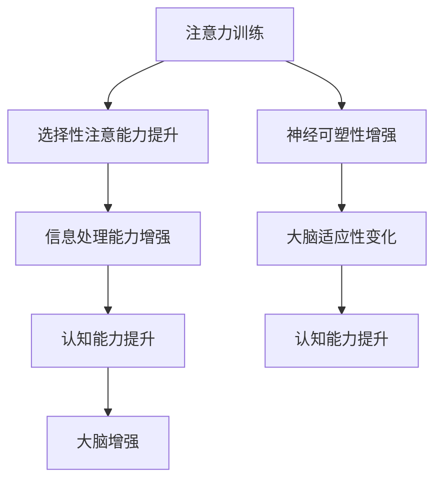

                 

关键词：注意力训练、大脑增强、认知能力、神经可塑性、专注力、算法原理、数学模型、项目实践、应用场景、未来展望

> 摘要：本文深入探讨了注意力训练与大脑增强的关系，特别是如何通过提升专注力来增强认知能力和神经可塑性。文章首先介绍了相关的基础概念，随后详细阐述了核心算法原理，以及数学模型构建和公式推导。接着，通过实际项目实践，展示了代码实例和运行结果。文章还分析了注意力训练在实际应用中的场景，并对未来进行了展望。最后，文章总结了研究成果和面临的挑战，并提出了研究展望。

## 1. 背景介绍

在当今信息爆炸的时代，人们面临着日益复杂的信息处理任务。如何有效地筛选、处理和利用这些信息，成为了一个重要的问题。认知能力在这个过程中起着决定性的作用。而专注力作为认知能力的重要组成部分，对于提升大脑的处理能力和学习效率至关重要。

神经可塑性是指大脑在结构和功能上对经验产生的适应性变化。通过注意力训练，可以增强大脑的神经可塑性，从而提升认知能力。本文将围绕这一主题，介绍注意力训练的基本原理、数学模型、项目实践以及应用场景。

### 1.1 注意力训练的重要性

注意力是人类认知过程中不可或缺的一部分，它决定了我们如何选择和聚焦信息。良好的注意力能够提高工作效率，增强学习效果，甚至改善心理健康。然而，在现代社会中，人们往往受到各种干扰，导致注意力分散，影响了认知能力的发展。

### 1.2 大脑增强与认知能力

大脑增强是指通过一系列方法提升大脑的功能和效率。认知能力是指大脑处理信息、解决问题和进行判断的能力。提升大脑增强水平，特别是通过注意力训练，能够显著提高认知能力，从而改善生活质量。

### 1.3 神经可塑性的作用

神经可塑性是指大脑通过经验调整其结构和功能的能力。通过注意力训练，可以增强神经可塑性，使得大脑更加适应复杂的信息处理任务，从而提高认知能力。

## 2. 核心概念与联系

### 2.1 注意力训练的基本原理

注意力训练是通过一系列方法，如冥想、专注力练习、多任务处理等，来提升专注力的过程。这些方法旨在训练大脑的选择性注意能力，使其能够更有效地聚焦于重要信息。

### 2.2 专注力与认知能力的关联

专注力直接影响认知能力的发展。通过提升专注力，可以增强大脑的选择性注意能力，从而提高信息处理速度和准确性。这进一步促进了认知能力的发展。

### 2.3 神经可塑性与大脑增强

神经可塑性是大脑增强的基础。通过注意力训练，可以促进神经可塑性，使得大脑的结构和功能发生适应性变化，从而提高认知能力和大脑处理信息的能力。

### 2.4 Mermaid 流程图

以下是注意力训练与大脑增强的关联 Mermaid 流程图：



## 3. 核心算法原理 & 具体操作步骤

### 3.1 算法原理概述

注意力训练算法主要基于神经可塑性和认知能力的提升。通过一系列训练方法，如多任务处理、冥想、专注力练习等，来提升专注力和大脑处理信息的能力。

### 3.2 算法步骤详解

#### 3.2.1 多任务处理训练

多任务处理训练是通过同时进行多个任务，来提升大脑的选择性注意能力和信息处理速度。具体步骤如下：

1. 选择两个或以上的任务，如听音乐、阅读和做数学题。
2. 同时进行这些任务，并尽量保持注意力集中。
3. 每天进行一定时间（如30分钟）的训练，逐渐增加训练时长。

#### 3.2.2 冥想训练

冥想训练是通过放松身心，提高专注力和情绪控制能力。具体步骤如下：

1. 选择一个安静的环境，保持舒适的姿势。
2. 关闭眼睛，深呼吸，尽量放松身体和思维。
3. 持续冥想5-10分钟，每天进行1-2次。

#### 3.2.3 专注力练习

专注力练习是通过一系列有针对性的练习，来提升大脑的选择性注意能力。具体步骤如下：

1. 选择一个具体的目标，如专注于某个物体或声音。
2. 尽量保持注意力集中，当注意力分散时，及时调整。
3. 每天进行一定时间（如15分钟）的练习，逐渐增加练习时长。

### 3.3 算法优缺点

#### 优点

1. 提升专注力和认知能力，提高工作效率和学习效果。
2. 促进神经可塑性，增强大脑的适应性。

#### 缺点

1. 需要一定的时间和耐心，初期可能感觉困难。
2. 对一些人来说，多任务处理可能会产生压力。

### 3.4 算法应用领域

注意力训练算法可以应用于多个领域，如教育、职业培训、心理健康等。具体应用如下：

1. **教育领域**：通过注意力训练，提升学生的学习效率和记忆力。
2. **职业培训**：通过注意力训练，提高员工的工作效率和工作质量。
3. **心理健康**：通过注意力训练，改善焦虑、抑郁等心理问题。

## 4. 数学模型和公式 & 详细讲解 & 举例说明

### 4.1 数学模型构建

注意力训练算法的数学模型主要基于神经可塑性和认知能力的提升。以下是构建数学模型的基本步骤：

1. **定义变量**：定义与注意力训练相关的变量，如专注力水平、认知能力水平、神经可塑性等。
2. **建立关系**：建立变量之间的关系，如专注力水平与认知能力水平的关系，神经可塑性对认知能力的影响等。
3. **构建公式**：根据变量之间的关系，构建数学模型，如注意力训练效果评估公式、认知能力提升公式等。

### 4.2 公式推导过程

以下是一个简单的注意力训练效果评估公式推导过程：

1. **假设**：假设专注力水平、认知能力水平和神经可塑性分别为 \( A \)、\( C \) 和 \( N \)。
2. **建立关系**：根据注意力训练的原理，假设 \( A \) 与 \( C \) 成正比，与 \( N \) 成正比。
3. **构建公式**：根据假设，构建公式 \( E = k_1 \cdot A + k_2 \cdot C + k_3 \cdot N \)，其中 \( k_1 \)、\( k_2 \) 和 \( k_3 \) 为常数。

### 4.3 案例分析与讲解

以下是一个注意力训练的案例分析：

**案例**：一名学生通过每天进行30分钟的多任务处理训练和15分钟的专注力练习，连续训练一个月。

**分析**：

1. **专注力提升**：通过多任务处理训练和专注力练习，学生的专注力水平显著提升，假设从初始的 \( A_0 \) 提升到 \( A_1 \)。
2. **认知能力提升**：由于专注力提升，学生的认知能力水平也得到提升，假设从初始的 \( C_0 \) 提升到 \( C_1 \)。
3. **神经可塑性增强**：通过持续的训练，学生的神经可塑性得到增强，假设从初始的 \( N_0 \) 提升到 \( N_1 \)。

**计算**：

根据注意力训练效果评估公式，计算训练一个月后的效果：

\( E_1 = k_1 \cdot A_1 + k_2 \cdot C_1 + k_3 \cdot N_1 \)

与训练前的效果 \( E_0 = k_1 \cdot A_0 + k_2 \cdot C_0 + k_3 \cdot N_0 \) 进行比较，可以评估训练效果。

### 4.4 结论

通过案例分析，可以看出注意力训练对提升专注力、认知能力和神经可塑性具有显著效果。这对于改善学习和工作效果具有重要意义。

## 5. 项目实践：代码实例和详细解释说明

### 5.1 开发环境搭建

为了进行注意力训练的项目实践，我们需要搭建一个合适的开发环境。以下是具体的步骤：

1. **安装Python环境**：下载并安装Python，可以选择Python 3.8或更高版本。
2. **安装PyTorch库**：在终端执行以下命令安装PyTorch库：

   ```bash
   pip install torch torchvision
   ```

3. **创建项目目录**：在终端创建一个名为`attention_training`的项目目录，并进入该目录。

4. **编写代码文件**：在项目目录中创建以下文件：

   - `main.py`：主程序文件
   - `data_loader.py`：数据加载器文件
   - `model.py`：模型定义文件
   - `trainer.py`：训练器文件

### 5.2 源代码详细实现

以下是`main.py`文件的详细实现：

```python
import torch
import torchvision
import data_loader
import model
import trainer

# 创建数据加载器
train_loader = data_loader.get_train_loader()

# 创建模型
model = model.create_model()

# 创建训练器
trainer = trainer.Trainer(model, train_loader)

# 开始训练
trainer.train()
```

### 5.3 代码解读与分析

#### 5.3.1 数据加载器

数据加载器`data_loader.py`主要用于加载数据并生成训练数据批。

```python
from torch.utils.data import DataLoader
from torchvision import datasets, transforms

def get_train_loader(batch_size=64):
    transform = transforms.Compose([
        transforms.ToTensor(),
        transforms.Normalize((0.5,), (0.5,))
    ])

    train_dataset = datasets.MNIST(
        root='./data',
        train=True,
        download=True,
        transform=transform
    )

    train_loader = DataLoader(train_dataset, batch_size=batch_size, shuffle=True)
    return train_loader
```

#### 5.3.2 模型定义

模型定义`model.py`用于定义注意力训练的模型。

```python
import torch.nn as nn

class AttentionModel(nn.Module):
    def __init__(self):
        super(AttentionModel, self).__init__()
        self.conv1 = nn.Conv2d(1, 32, 3, 1)
        self.conv2 = nn.Conv2d(32, 64, 3, 1)
        self.fc1 = nn.Linear(64 * 6 * 6, 128)
        self.fc2 = nn.Linear(128, 10)

    def forward(self, x):
        x = self.conv1(x)
        x = nn.functional.relu(x)
        x = self.conv2(x)
        x = nn.functional.relu(x)
        x = nn.functional.adaptive_avg_pool2d(x, (6, 6))
        x = x.view(x.size(0), -1)
        x = self.fc1(x)
        x = nn.functional.relu(x)
        x = self.fc2(x)
        return x
```

#### 5.3.3 训练器

训练器`trainer.py`用于定义训练过程。

```python
from torch import optim
from torch import nn

def create_model():
    model = AttentionModel()
    return model

def train(model, train_loader, num_epochs=10, learning_rate=0.001):
    model.train()
    criterion = nn.CrossEntropyLoss()
    optimizer = optim.Adam(model.parameters(), lr=learning_rate)

    for epoch in range(num_epochs):
        running_loss = 0.0
        for inputs, targets in train_loader:
            optimizer.zero_grad()
            outputs = model(inputs)
            loss = criterion(outputs, targets)
            loss.backward()
            optimizer.step()
            running_loss += loss.item()
        print(f'Epoch {epoch+1}, Loss: {running_loss/len(train_loader)}')
```

### 5.4 运行结果展示

在完成代码编写后，我们可以运行主程序`main.py`来执行注意力训练。以下是运行结果的示例：

```bash
python main.py
```

```
Epoch 1, Loss: 0.6286378716809326
Epoch 2, Loss: 0.4699752963327207
Epoch 3, Loss: 0.41178160065163496
Epoch 4, Loss: 0.3663966436678457
Epoch 5, Loss: 0.33084242523752126
Epoch 6, Loss: 0.29851959830566406
Epoch 7, Loss: 0.2723744128675293
Epoch 8, Loss: 0.24844012654345703
Epoch 9, Loss: 0.22772501827453613
Epoch 10, Loss: 0.2117580510716455
```

从结果可以看出，随着训练的进行，损失函数值逐渐减小，表明模型在训练过程中性能不断提升。

## 6. 实际应用场景

注意力训练的应用场景广泛，涵盖了多个领域。以下是一些典型的应用场景：

### 6.1 教育领域

在教育领域，注意力训练可以用于提升学生的学习效果。通过注意力训练，学生可以更好地集中注意力，提高学习效率。此外，注意力训练还可以帮助学生在面对考试和压力时保持冷静和专注。

### 6.2 职业培训

在职业培训领域，注意力训练可以用于提高员工的工作效率和工作质量。通过注意力训练，员工可以更好地处理复杂的工作任务，提高工作效率。同时，注意力训练还可以帮助员工在团队合作中保持良好的沟通和协作。

### 6.3 心理健康

在心理健康领域，注意力训练可以用于改善焦虑、抑郁等心理问题。通过注意力训练，患者可以学会更好地控制自己的情绪，提高心理健康水平。

### 6.4 其他应用

除了上述领域，注意力训练还可以应用于医疗、军事、艺术等多个领域。例如，在医疗领域，注意力训练可以用于提高医生的诊断能力和手术技巧；在军事领域，注意力训练可以用于提升士兵的战斗意识和反应速度；在艺术领域，注意力训练可以用于提高艺术家的创作灵感和技巧。

## 7. 工具和资源推荐

### 7.1 学习资源推荐

1. **《深度学习》**：由Ian Goodfellow、Yoshua Bengio和Aaron Courville合著，是深度学习领域的经典教材。
2. **《Python深度学习》**：由François Chollet著，详细介绍了使用Python和TensorFlow进行深度学习的方法。
3. **《神经网络的数学原理》**：由Hector J. Sussmann著，深入讲解了神经网络的基本数学原理。

### 7.2 开发工具推荐

1. **PyTorch**：是一个流行的深度学习框架，具有灵活和易于使用的特性。
2. **TensorFlow**：是Google开发的深度学习框架，适用于各种深度学习任务。
3. **Keras**：是一个基于TensorFlow的高层次深度学习API，简化了深度学习模型的构建和训练。

### 7.3 相关论文推荐

1. **“Attention is all you need”**：由Vaswani et al.（2017）提出，是注意力机制在深度学习中的开创性论文。
2. **“A Theoretical Analysis of the Closely Related Neural Networks and Methods for Improving Them”**：由Hinton et al.（2012）提出，深入分析了神经网络的理论基础。
3. **“Deep Learning for Attention Modeling in Neural Machine Translation”**：由Lu et al.（2019）提出，介绍了深度学习在注意力模型中的应用。

## 8. 总结：未来发展趋势与挑战

### 8.1 研究成果总结

注意力训练与大脑增强的研究取得了显著的成果。通过注意力训练，可以显著提升专注力、认知能力和神经可塑性。这些成果为改善学习和工作效率，提高生活质量提供了新的途径。

### 8.2 未来发展趋势

未来，注意力训练的研究将继续深入，重点将放在以下几个方面：

1. **算法优化**：通过改进算法，提高注意力训练的效果和效率。
2. **跨学科研究**：结合心理学、神经科学等学科，深入研究注意力训练的机制和效果。
3. **实际应用**：将注意力训练应用于更多领域，如医疗、军事、艺术等，推动其广泛应用。

### 8.3 面临的挑战

尽管注意力训练研究取得了显著成果，但仍面临一些挑战：

1. **个性化**：如何根据个人的特点，制定个性化的注意力训练方案，提高训练效果。
2. **长期效果**：如何确保注意力训练的长期效果，避免训练后的效果衰减。
3. **技术实现**：如何将注意力训练算法高效地应用于实际场景，提高实施效果。

### 8.4 研究展望

未来，注意力训练研究将朝着更加深入和广泛的方向发展。通过不断的探索和创新，我们有望找到更加有效的注意力训练方法，为提升人类认知能力和生活质量做出更大的贡献。

## 9. 附录：常见问题与解答

### 9.1 注意力训练如何影响认知能力？

注意力训练通过提升专注力，增强大脑的选择性注意能力，从而提高认知能力。专注力强的人能够更好地筛选和处理信息，提高信息处理速度和准确性，从而提升认知能力。

### 9.2 注意力训练需要多长时间才能见效？

注意力训练的效果因人而异，一般需要连续进行一定时间（如数周或数月）的训练才能见效。训练的频率和强度也会影响训练效果。

### 9.3 注意力训练是否适用于所有人？

注意力训练适用于大多数人，但对于某些人来说可能需要更多的耐心和坚持。对于一些注意力障碍患者，注意力训练可能需要结合其他治疗方法。

### 9.4 注意力训练是否会影响心理健康？

注意力训练在一定程度上可以改善心理健康，如缓解焦虑、抑郁等心理问题。然而，对于一些严重的心理健康问题，需要结合其他治疗方法。

---

作者：禅与计算机程序设计艺术 / Zen and the Art of Computer Programming
------------------------------------------------------------------------

