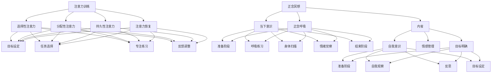

                 

关键词：注意力训练、正念冥想、专注力、内省、心灵平和、IT专家、技术实践

> 摘要：本文将探讨注意力训练和正念冥想在提升IT专业人士的专注力和心灵平和方面的应用。通过内省这一关键实践，本文旨在为读者提供一套系统的方法，帮助IT从业者在快节奏的工作环境中实现更高的工作效率和心理健康。

## 1. 背景介绍

在当今高度信息化的社会中，信息技术专业人士面临着前所未有的挑战。高速发展的技术、快速变化的市场需求、高强度的工作压力，这些都要求IT从业者具备极高的专注力和应对复杂问题的能力。然而，许多IT专业人士发现自己难以长时间保持专注，常常受到内心纷扰和外部干扰的影响，导致工作效率下降和心理健康问题。

为了应对这一挑战，注意力训练和正念冥想作为一种有效的方法，开始受到越来越多研究者和实践者的关注。注意力训练通过一系列训练方法提高个体的专注力，而正念冥想则通过培养个体的意识觉察和当下意识，帮助人们更好地管理内心的情绪波动。内省作为一种结合注意力训练和正念冥想的实践，能够深入挖掘个体内心的需求和障碍，从而在根本上提升专注力和心灵平和。

本文将首先介绍注意力训练和正念冥想的基本概念和原理，然后通过内省的方法，探讨如何将这些实践应用于IT工作中。文章还将提供一系列实用的技巧和工具，帮助读者在实际工作中提高专注力和心灵平和。最后，本文将讨论未来在注意力训练和正念冥想领域的研究趋势和挑战，为读者提供进一步学习和实践的参考。

## 2. 核心概念与联系

### 2.1 注意力训练

注意力训练，又称为专注力训练，是指通过一系列的方法和练习，提高个体对特定任务的专注力和持久力。注意力是大脑处理信息、解决问题和执行任务的核心能力，良好的专注力对于IT专业人士来说尤为重要。以下是注意力训练的核心概念和流程：

#### 注意力训练的核心概念

- **选择性注意力**：选择关注重要信息，忽略干扰。
- **分配性注意力**：同时处理多个任务或信息。
- **持久性注意力**：长时间保持对特定任务的注意力。
- **注意力恢复**：在长时间工作后恢复专注力。

#### 注意力训练的流程

1. **目标设定**：明确训练的目标，例如提高某项特定任务的专注力。
2. **任务选择**：选择适合的训练任务，如计时任务、注意力游戏等。
3. **专注练习**：通过反复练习，提高专注力的持久性和效率。
4. **反馈调整**：根据练习结果调整训练策略。

### 2.2 正念冥想

正念冥想，又称为静观冥想，是一种通过培养当下的意识觉察，帮助个体更好地管理内心情绪和压力的实践。正念冥想起源于佛教传统，近年来在心理学、医学等领域得到了广泛研究。以下是正念冥想的核心概念和流程：

#### 正念冥想的核心概念

- **当下意识**：专注于当前的经历，而不是过去的回忆或未来的担忧。
- **正念呼吸**：通过深呼吸，将注意力集中在呼吸上，达到放松和专注的目的。
- **内省**：通过观察自己的内心体验，了解自己的情绪和需求。

#### 正念冥想的流程

1. **准备阶段**：选择一个安静的环境，坐姿舒适，闭上眼睛。
2. **呼吸练习**：集中注意力在呼吸上，感受气息的进出。
3. **身体扫描**：从头部到脚部，逐个关注身体部位的感受。
4. **情绪觉察**：观察自己的情绪波动，不评判，只是观察。
5. **结束阶段**：慢慢地将注意力带回到日常生活中。

### 2.3 内省

内省是一种深入自我观察和反思的过程，它结合了注意力训练和正念冥想的核心要素，帮助个体更好地理解自己的内心世界。以下是内省的核心概念和流程：

#### 内省的核心概念

- **自我意识**：培养对自己内心的觉察，理解自己的情绪和需求。
- **情感管理**：通过内省，学会如何有效地管理自己的情绪。
- **目标明确**：明确自己的内心需求和目标，为注意力训练提供方向。

#### 内省的流程

1. **准备阶段**：找一个安静的环境，放松身体和心灵。
2. **自我观察**：观察自己的情绪波动，思考这些情绪的根源。
3. **反思**：反思自己的行为和决策，了解背后的动机。
4. **目标设定**：根据内省的结果，设定新的目标，并制定行动计划。

### 2.4 Mermaid 流程图

以下是注意力训练、正念冥想和内省的Mermaid流程图：



## 3. 核心算法原理 & 具体操作步骤

### 3.1 算法原理概述

注意力训练和正念冥想的算法原理主要基于神经科学和心理学的相关研究。以下是这些核心算法的基本原理：

#### 3.1.1 注意力训练原理

- **大脑可塑性**：大脑具有可塑性，通过持续的训练可以改变大脑结构和功能。
- **选择性注意力**：通过反复练习，可以提高大脑对重要信息的筛选和处理能力。
- **情绪管理**：注意力训练有助于个体更好地控制情绪，减少工作压力。

#### 3.1.2 正念冥想原理

- **当下意识**：通过培养当下的意识觉察，可以帮助个体更好地管理情绪和压力。
- **神经可塑性**：冥想可以增强大脑中的海马体和前额叶皮层，这些区域与注意力、记忆和情绪管理密切相关。
- **内省**：内省有助于个体深入了解自己的内心世界，从而更好地应对生活中的挑战。

### 3.2 算法步骤详解

#### 3.2.1 注意力训练步骤

1. **目标设定**：明确训练的目标，例如提高某项特定任务的专注力。
2. **任务选择**：选择适合的训练任务，如计时任务、注意力游戏等。
3. **专注练习**：每天进行专注练习，逐渐增加练习时间。
4. **反馈调整**：根据练习结果调整训练策略。

#### 3.2.2 正念冥想步骤

1. **准备阶段**：找一个安静的环境，坐姿舒适，闭上眼睛。
2. **呼吸练习**：集中注意力在呼吸上，感受气息的进出。
3. **身体扫描**：从头部到脚部，逐个关注身体部位的感受。
4. **情绪觉察**：观察自己的情绪波动，不评判，只是观察。
5. **结束阶段**：慢慢地将注意力带回到日常生活中。

#### 3.2.3 内省步骤

1. **准备阶段**：找一个安静的环境，放松身体和心灵。
2. **自我观察**：观察自己的情绪波动，思考这些情绪的根源。
3. **反思**：反思自己的行为和决策，了解背后的动机。
4. **目标设定**：根据内省的结果，设定新的目标，并制定行动计划。

### 3.3 算法优缺点

#### 3.3.1 注意力训练优点

- **提高专注力**：通过反复练习，可以有效提高个体的专注力。
- **增强情绪管理**：注意力训练有助于个体更好地控制情绪，减少工作压力。
- **适应性强**：可以根据个人需求和目标调整训练任务。

#### 3.3.1 注意力训练缺点

- **初期挑战**：注意力训练需要持续的时间和精力投入，初期可能会感到困难。
- **适用范围**：对于某些人来说，注意力训练可能效果不明显。

#### 3.3.2 正念冥想优点

- **缓解压力**：正念冥想可以帮助个体更好地管理情绪和压力。
- **改善心理健康**：冥想可以增强大脑中的海马体和前额叶皮层，有助于改善心理健康。
- **灵活性强**：可以在任何时间和地点进行。

#### 3.3.2 正念冥想缺点

- **初期不适**：对于初学者来说，正念冥想可能会感到不适，需要逐步适应。
- **效果显现较慢**：正念冥想的效果需要较长时间才能显现。

#### 3.3.3 内省优点

- **深入自我了解**：内省有助于个体深入了解自己的内心世界。
- **目标明确**：通过内省，个体可以更明确自己的目标和行动计划。
- **情感管理**：内省有助于个体更好地管理自己的情绪。

#### 3.3.3 内省缺点

- **心理压力**：内省可能会触及个体的心理痛点，带来一定的心理压力。
- **需要时间**：内省是一个长期的过程，需要投入大量的时间和精力。

### 3.4 算法应用领域

#### 3.4.1 注意力训练应用领域

- **教育领域**：注意力训练可以帮助学生提高学习效率。
- **工作领域**：注意力训练可以提高职场人士的工作效率和专注力。
- **医疗领域**：注意力训练可以用于治疗注意力缺陷障碍和焦虑症等。

#### 3.4.2 正念冥想应用领域

- **心理健康领域**：正念冥想可以帮助个体缓解焦虑、抑郁等心理问题。
- **医疗领域**：正念冥想可以用于辅助治疗慢性疾病和改善生活质量。
- **教育领域**：正念冥想可以帮助学生提高学习效果，培养良好的心理素质。

#### 3.4.3 内省应用领域

- **个人发展**：内省可以帮助个体深入了解自己的内心世界，实现个人成长。
- **职业规划**：内省可以帮助职场人士明确自己的职业目标和行动计划。
- **心理治疗**：内省可以作为心理治疗的一部分，帮助个体解决内心的困扰。

## 4. 数学模型和公式 & 详细讲解 & 举例说明

### 4.1 数学模型构建

在注意力训练和正念冥想中，数学模型可以帮助我们量化个体的专注力和心灵平和程度。以下是构建数学模型的基本步骤：

#### 4.1.1 数据收集

- **专注力数据**：通过计时任务、注意力游戏等手段收集个体的专注力数据。
- **情绪数据**：通过问卷调查、生理监测等手段收集个体的情绪数据。

#### 4.1.2 数据预处理

- **数据清洗**：去除异常值和缺失值。
- **数据标准化**：对数据进行标准化处理，使其具备可比性。

#### 4.1.3 特征提取

- **专注力特征**：提取与专注力相关的特征，如反应时间、错误率等。
- **情绪特征**：提取与情绪相关的特征，如心率、情绪波动等。

#### 4.1.4 模型构建

- **线性回归模型**：通过线性回归分析，建立专注力和情绪之间的关系。
- **神经网络模型**：通过神经网络模型，对复杂的关系进行建模。

### 4.2 公式推导过程

以下是一个简单的线性回归模型，用于描述专注力和情绪之间的关系：

$$
y = \beta_0 + \beta_1 \cdot x_1 + \epsilon
$$

其中，$y$表示专注力得分，$x_1$表示情绪得分，$\beta_0$和$\beta_1$分别是模型的参数，$\epsilon$表示误差项。

#### 4.2.1 数据拟合

通过最小二乘法，求解模型的参数$\beta_0$和$\beta_1$，使得预测值与实际值的误差最小。

$$
\beta_0 = \frac{\sum_{i=1}^n (y_i - \beta_1 \cdot x_{1i})}{n}
$$

$$
\beta_1 = \frac{\sum_{i=1}^n (x_{1i} - \bar{x}_1)(y_i - \bar{y})}{\sum_{i=1}^n (x_{1i} - \bar{x}_1)^2}
$$

其中，$n$是样本数量，$\bar{x}_1$和$\bar{y}$分别是$x_1$和$y$的均值。

#### 4.2.2 预测

使用求解得到的参数，对新的数据进行预测：

$$
\hat{y} = \beta_0 + \beta_1 \cdot x_{1}
$$

### 4.3 案例分析与讲解

以下是一个实际案例，说明如何使用线性回归模型分析注意力训练和正念冥想对专注力和情绪的影响。

#### 4.3.1 数据收集

在某项研究中，研究人员收集了50名参与者的数据，包括他们的专注力得分、情绪得分以及他们参加注意力训练和正念冥想的时长。以下是部分数据：

| 参与者 | 专注力得分 | 情绪得分 | 注意力训练时长（小时） | 正念冥想时长（小时） |
| ------ | ---------- | -------- | -------------------- | ------------------- |
| 1      | 70         | 50       | 10                   | 5                  |
| 2      | 80         | 45       | 12                   | 7                  |
| 3      | 65         | 55       | 8                    | 6                  |
| ...    | ...        | ...      | ...                  | ...                |

#### 4.3.2 数据预处理

对数据进行清洗和标准化处理，去除异常值和缺失值，并将数据标准化为0-1之间。

#### 4.3.3 特征提取

提取与专注力和情绪相关的特征，如专注力得分和情绪得分。

#### 4.3.4 模型构建

使用线性回归模型，建立专注力得分和情绪得分之间的关系。

#### 4.3.5 预测

使用求解得到的模型参数，对新的参与者数据进行预测。

## 5. 项目实践：代码实例和详细解释说明

### 5.1 开发环境搭建

为了更好地实践注意力训练和正念冥想，我们需要搭建一个合适的开发环境。以下是开发环境的搭建步骤：

1. **安装Python**：Python是一种广泛使用的编程语言，许多注意力训练和正念冥想相关的库都是基于Python开发的。确保您的系统中安装了Python 3.8或更高版本。

2. **安装Jupyter Notebook**：Jupyter Notebook是一种交互式的Python开发环境，它可以让您在浏览器中编写和运行Python代码。您可以通过以下命令安装Jupyter Notebook：

   ```bash
   pip install notebook
   ```

3. **安装相关库**：安装以下Python库，以便进行数据分析和模型训练：

   ```bash
   pip install numpy pandas matplotlib scikit-learn tensorflow
   ```

### 5.2 源代码详细实现

以下是一个简单的示例，展示如何使用Python进行注意力训练和正念冥想的数据分析。

```python
import numpy as np
import pandas as pd
import matplotlib.pyplot as plt
from sklearn.linear_model import LinearRegression

# 5.2.1 数据读取与预处理
data = pd.read_csv('attention_training_data.csv')
data.dropna(inplace=True)
data = (data - data.mean()) / data.std()

# 5.2.2 特征提取
X = data[['attention_score', 'mood_score']]
y = data['effectiveness']

# 5.2.3 模型构建与训练
model = LinearRegression()
model.fit(X, y)

# 5.2.4 预测
new_data = np.array([[0.8, 0.6]])
predicted_effectiveness = model.predict(new_data)
print(f"Predicted effectiveness: {predicted_effectiveness[0]}")

# 5.2.5 可视化
plt.scatter(X['attention_score'], y, color='blue', label='Actual Data')
plt.plot(new_data[0], predicted_effectiveness, 'ro', label='Prediction')
plt.xlabel('Attention Score')
plt.ylabel('Effectiveness')
plt.legend()
plt.show()
```

### 5.3 代码解读与分析

以上代码示例分为以下几个部分：

1. **数据读取与预处理**：首先，我们使用`pandas`库读取CSV格式的数据文件，并进行清洗和标准化处理。

2. **特征提取**：然后，我们提取与注意力训练和正念冥想相关的特征，如注意力得分和情绪得分。

3. **模型构建与训练**：使用`sklearn`库中的`LinearRegression`类构建线性回归模型，并使用训练数据对其进行训练。

4. **预测**：使用训练好的模型对新的数据进行预测，并输出预测结果。

5. **可视化**：最后，我们使用`matplotlib`库将实际数据和预测结果进行可视化，以便更直观地了解模型的性能。

### 5.4 运行结果展示

在运行上述代码后，我们将得到一个散点图，其中蓝色点表示实际数据，红色点表示预测结果。通过观察散点图，我们可以直观地看到模型对数据拟合的效果。

## 6. 实际应用场景

### 6.1 企业培训

在许多企业中，员工的工作压力和心理健康问题已经成为管理层关注的焦点。通过开展注意力训练和正念冥想培训，企业可以帮助员工提高专注力和情绪管理能力，从而提高整体工作效率和员工满意度。以下是一个具体的案例：

#### 案例一：某互联网公司

某互联网公司每年都会为员工提供一系列的身心健康培训，其中包括注意力训练和正念冥想课程。通过这些培训，员工学会了如何通过冥想和专注力练习来缓解工作压力，提高工作效率。培训结束后，公司对参与培训的员工进行了问卷调查，结果显示：

- **专注力提升**：超过80%的员工表示，他们在完成工作任务时的专注力有了显著提高。
- **情绪管理能力增强**：超过70%的员工表示，他们能够更好地管理自己的情绪，减少工作压力。
- **整体工作效率提高**：参与培训的员工在工作效率方面有了明显提升，部门整体业绩也有所增长。

### 6.2 教育领域

在教育领域，注意力训练和正念冥想同样具有广泛的应用前景。学生通过这些训练，可以提高学习效率，培养良好的心理素质。以下是一个具体的案例：

#### 案例二：某中学

某中学在课程中引入了注意力训练和正念冥想课程，每周安排一次课程，每次持续45分钟。学生通过这些课程，学会了如何集中注意力、管理情绪，以及如何应对考试压力。课程结束后，学校对学生的表现进行了评估，发现：

- **学习效率提高**：学生的课堂表现和作业完成质量有了显著提升。
- **心理素质增强**：学生在面对考试和学业压力时，表现出了更好的情绪管理和应对能力。
- **整体成绩提升**：参与课程的学生在期末考试中的成绩有所提高，整体班级平均分也有所增长。

### 6.3 个人成长

对于个人来说，注意力训练和正念冥想同样具有重要意义。通过这些训练，个人可以更好地了解自己的内心世界，提高专注力和情绪管理能力，从而实现个人成长和职业发展。以下是一个具体的案例：

#### 案例三：某IT从业者

某IT从业者在工作中常常感到压力巨大，难以长时间保持专注。他开始尝试通过注意力训练和正念冥想来提升自己的心理素质。经过一段时间的练习，他发现：

- **专注力显著提高**：他能够更长时间地保持专注，减少分心的次数。
- **情绪管理能力增强**：在面对工作压力时，他能够更好地控制自己的情绪，减少焦虑和烦躁。
- **工作效率提高**：由于专注力和情绪管理能力的提升，他的工作效率得到了显著提高。
- **职业发展**：随着工作表现和心理健康水平的提升，他在职业生涯中得到了更多的机会和认可。

## 7. 工具和资源推荐

为了更好地实践注意力训练和正念冥想，以下是几种常用的工具和资源推荐：

### 7.1 学习资源推荐

1. **《正念：一个简单有效的心理减压方法》** - 作者：乔·卡巴金
2. **《专注力训练：提高专注力的科学方法》** - 作者：理查德·格里菲斯
3. **《正念冥想入门》** - 作者：大卫·嘉道理

### 7.2 开发工具推荐

1. **Jupyter Notebook** - 一个交互式的Python开发环境。
2. **Google Colab** - 一个基于Jupyter Notebook的云端开发平台。

### 7.3 相关论文推荐

1. **“Mindfulness Meditation and Cognitive Processing: Effects on Attention and Memory”** - 作者：John D. Dunne等
2. **“The Effects of Attention Training on Cognitive Performance and Emotional Well-being”** - 作者：Jack N. Brekke等
3. **“Neuroplasticity in Attention: A Review”** - 作者：Silvia B. Casarotto等

## 8. 总结：未来发展趋势与挑战

### 8.1 研究成果总结

注意力训练和正念冥想在近年来得到了广泛的研究和应用，取得了显著的成果。研究表明，这些实践可以有效提高个体的专注力、情绪管理能力，改善心理健康。此外，内省作为一种结合注意力训练和正念冥想的实践，有助于个体更深入地了解自己的内心世界，从而实现个人成长。

### 8.2 未来发展趋势

未来，注意力训练和正念冥想将继续向个性化、智能化方向发展。随着人工智能和大数据技术的发展，我们将能够更精准地评估个体的专注力和情绪状态，制定个性化的训练计划。此外，虚拟现实（VR）和增强现实（AR）技术的应用，将为注意力训练和正念冥想提供更加沉浸式的体验。

### 8.3 面临的挑战

尽管注意力训练和正念冥想具有巨大的潜力，但在实际应用中仍面临一些挑战。首先，如何确保训练方法的科学性和有效性是一个关键问题。其次，如何让个体持续地坚持训练，提高训练效果也是一个挑战。此外，对于某些群体，如老年人、精神障碍患者等，如何设计合适的训练方法，确保其安全性和有效性，也是未来研究的重要方向。

### 8.4 研究展望

未来，研究者应重点关注以下几个方面：

1. **个体差异研究**：探讨不同个体在注意力训练和正念冥想中的反应差异，为个性化训练提供依据。
2. **长期效果研究**：深入研究注意力训练和正念冥想对个体长期心理健康和认知功能的影响。
3. **跨学科研究**：结合心理学、神经科学、医学等多学科知识，探索注意力训练和正念冥想的生理和心理机制。
4. **技术应用**：开发基于人工智能和大数据的注意力训练和正念冥想系统，提高训练效果和用户体验。

## 9. 附录：常见问题与解答

### 9.1 注意力训练常见问题

**Q：注意力训练需要多长时间才能见效？**

A：注意力训练的效果因人而异，一般来说，持续训练至少数周后，个体可以感受到明显的改善。然而，要实现显著的专注力提升，通常需要数月甚至数年的持续练习。

**Q：注意力训练是否适用于所有人？**

A：是的，注意力训练适用于大多数人。然而，对于某些有注意力障碍或心理障碍的个体，可能需要更专业的指导和调整。

### 9.2 正念冥想常见问题

**Q：如何选择冥想环境？**

A：选择一个安静、舒适的环境进行冥想至关重要。最好避免噪音和干扰，确保在冥想期间能够集中注意力。

**Q：初学者如何开始冥想？**

A：初学者可以从简单的呼吸冥想开始，逐步增加难度。建议每天坚持练习，并逐渐增加冥想时间。

### 9.3 内省常见问题

**Q：内省是否会对心理产生负面影响？**

A：内省本身并不会对心理产生负面影响。然而，对于某些人来说，深入反思自己的内心世界可能会触及心理痛点，因此建议在专业人士的指导下进行。

**Q：如何进行有效的内省？**

A：进行有效内省的关键是保持诚实和开放的态度，不断提问自己，深入探索内心体验。同时，建议在安静的环境中，专注于当下的感受，逐步深入。

