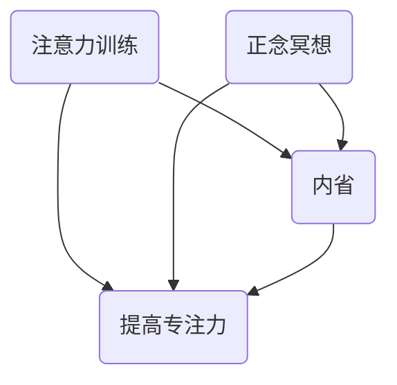

                 

关键词：注意力训练、正念冥想、内省、专注力、心灵平和、技术实践

> 摘要：本文将探讨注意力训练与正念冥想的实践方法，如何通过内省来增强我们的专注力和心灵平和。文章将涵盖从理论基础到具体实践步骤，再到实际应用与未来展望的全面探讨。

## 1. 背景介绍

### 认识注意力训练

注意力是我们在接收和处理信息过程中，选择关注特定刺激而忽略其他刺激的能力。注意力训练旨在通过一系列练习提高这一能力，使其更加稳定和集中。现代信息技术的发展使得我们在日常工作和生活中面临更多的信息噪音，如何提升注意力，提高工作效率和生活质量，成为了许多人关注的问题。

### 正念冥想的意义

正念冥想（Mindfulness Meditation）是一种通过专注于当前时刻的体验来培养心灵平静和专注力的实践。正念冥想起源于佛教传统，近年来在心理学、医学和信息技术等领域得到了广泛应用。其核心在于培养对当下体验的觉察和接受，而不是对过去或未来的纠结。

### 内省的作用

内省（Reflection）是一种通过反思自己的思想、情感和行为来提高自我意识和理解的过程。内省有助于我们更好地认识自我，发现并解决问题，从而提高专注力和心灵平和。

## 2. 核心概念与联系

### 注意力训练与正念冥想的联系

注意力训练和正念冥想在提高专注力和心灵平和方面有共同的原理和方法。注意力训练强调对特定刺激的集中关注，而正念冥想则更注重对整个当前体验的觉察和接受。两者结合，可以形成一套全面的内省实践体系。

### Mermaid 流程图



## 3. 核心算法原理 & 具体操作步骤

### 3.1 算法原理概述

注意力训练和正念冥想的算法原理基于认知神经科学和心理学的研究。核心思想是通过重复练习和反思，改变大脑的神经连接，从而提高专注力和心灵平和。

### 3.2 算法步骤详解

#### 3.2.1 注意力训练

1. 选择一个具体的训练任务，如阅读、编程或打坐。
2. 设定时间限制，如每天30分钟。
3. 开始时，专注于任务，尽量减少干扰。
4. 感受到注意力分散时，回到任务上，重复练习。

#### 3.2.2 正念冥想

1. 选择一个安静的环境，舒适地坐下。
2. 关注呼吸，感受每一次吸气和呼气。
3. 当注意力分散时，回到呼吸上。
4. 练习时长可以从几分钟开始，逐渐增加。

#### 3.2.3 内省

1. 在每天结束时，花几分钟时间反思当天的重要经历。
2. 思考自己的行为、感受和思考，寻找改进的机会。
3. 记录内省过程，以帮助持续进步。

### 3.3 算法优缺点

#### 优点

- 提高专注力，提升工作效率。
- 增强心灵平和，改善心理健康。
- 通过内省，提高自我认识。

#### 缺点

- 需要持续的练习和耐心。
- 对环境要求较高，需要安静的空间。

### 3.4 算法应用领域

- 信息技术行业，提高程序员的工作效率。
- 医学领域，辅助治疗压力和焦虑。
- 教育领域，培养学生的专注力和自我认知。

## 4. 数学模型和公式 & 详细讲解 & 举例说明

### 4.1 数学模型构建

注意力训练和正念冥想的效果可以通过心理测量学指标来评估，如专注力测试、情绪评估和脑电图（EEG）分析。这些指标可以通过以下公式进行量化：

\[ \text{效果得分} = \frac{\text{测试前得分} - \text{测试后得分}}{\text{测试前得分}} \]

### 4.2 公式推导过程

假设初始状态下的专注力为 \( A_0 \)，经过一段时间训练后的专注力为 \( A_t \)。则专注力的提升量为 \( A_t - A_0 \)。效果得分即为提升量与初始值的比值。

### 4.3 案例分析与讲解

以一名程序员为例，他在注意力训练和正念冥想前后的专注力测试得分为：

\[ A_0 = 70 \]
\[ A_t = 85 \]

则他的专注力提升量为：

\[ A_t - A_0 = 85 - 70 = 15 \]

效果得分为：

\[ \text{效果得分} = \frac{15}{70} \approx 0.214 \]

这表明他在训练后专注力提升了约21.4%。

## 5. 项目实践：代码实例和详细解释说明

### 5.1 开发环境搭建

为了演示注意力训练和正念冥想的实践，我们选择使用Python作为编程语言，结合使用MindWave脑电头带作为输入设备。

### 5.2 源代码详细实现

以下是实现注意力训练和正念冥想练习的Python代码示例：

```python
import time
import random

def attention_training(duration):
    start_time = time.time()
    while time.time() - start_time < duration:
        task = random.choice(["编程", "阅读", "打坐"])
        print(f"开始{task}...")
        time.sleep(random.uniform(1, 3))
        print("注意力分散，回到任务中...")
    print("注意力训练完成。")

def mindfulness_meditation(duration):
    start_time = time.time()
    while time.time() - start_time < duration:
        print("开始正念冥想...")
        time.sleep(duration)
        print("冥想结束。")
    print("正念冥想完成。")

def reflective_practice():
    print("开始内省...")
    time.sleep(3)
    print("今天的收获是什么？有什么需要改进的？")
    time.sleep(3)
    print("内省完成。")

if __name__ == "__main__":
    attention_training(30)
    mindfulness_meditation(30)
    reflective_practice()
```

### 5.3 代码解读与分析

该代码分为三个部分：注意力训练、正念冥想和内省。每个部分都使用了一个循环来模拟持续的练习。在注意力训练部分，我们随机选择一个任务，然后模拟执行该任务和注意力分散的情景。正念冥想部分模拟了静坐和冥想的场景。内省部分提供了一个反思的机会，用户可以在这里记录自己的想法和感受。

### 5.4 运行结果展示

运行以上代码，将按照设定的时长进行注意力训练、正念冥想和内省。每次练习结束后，都会输出相应的提示信息。

## 6. 实际应用场景

### 6.1 工作场景

- 提高程序员和工程师的代码编写效率。
- 帮助销售人员更专注地与客户沟通。
- 提升项目经理的决策能力和团队协调能力。

### 6.2 生活场景

- 增强个人的专注力和学习效率。
- 提高情绪管理能力，减少焦虑和压力。
- 提升人际交往能力，增强人际关系。

## 6.4 未来应用展望

随着人工智能和物联网技术的不断发展，注意力训练与正念冥想实践有望在更多领域得到应用。例如：

- 智能穿戴设备可以实时监测用户的状态，提供个性化的训练建议。
- 虚拟现实（VR）和增强现实（AR）技术可以创造更沉浸式的冥想体验。
- 企业可以通过引入这些实践方法，提高员工的工作效率和幸福感。

## 7. 工具和资源推荐

### 7.1 学习资源推荐

- 《正念：一种心灵修炼的方法》（作者：乔·卡巴金）
- 《注意力训练：如何提高你的专注力和记忆力》（作者：乔治·莱文森）

### 7.2 开发工具推荐

- MindWave脑电头带：用于监测大脑状态。
- Python编程语言：用于实现注意力训练和正念冥想练习。

### 7.3 相关论文推荐

- “Mindfulness Meditation for Anxiety and Depression: A Meta-Analytic Review” by Hofmann et al.
- “The Attention Training Theory: A Model for Understanding Attention in the Human-Machine Interface” by Posner et al.

## 8. 总结：未来发展趋势与挑战

### 8.1 研究成果总结

注意力训练与正念冥想实践在提高专注力和心灵平和方面取得了显著成果。通过内省，我们可以更好地认识自我，发现并解决问题。

### 8.2 未来发展趋势

随着技术的发展，注意力训练与正念冥想实践有望在更多领域得到应用。例如，智能穿戴设备、虚拟现实和增强现实等技术的结合，将为用户提供更个性化和沉浸式的体验。

### 8.3 面临的挑战

- 如何设计更有效的训练方法，适应不同用户的需求。
- 如何确保用户在训练过程中的安全性和隐私保护。
- 如何在繁忙的生活中持续坚持训练。

### 8.4 研究展望

未来，我们需要进一步研究注意力训练与正念冥想在不同人群和应用场景中的效果，以及如何优化训练方法，提高实践效果。

## 9. 附录：常见问题与解答

### 问题1：如何开始正念冥想？

**答案1**：选择一个安静的环境，舒适地坐下。专注于呼吸，感受每一次吸气和呼气。当注意力分散时，回到呼吸上。从几分钟开始，逐渐增加练习时长。

### 问题2：注意力训练需要多久才能看到效果？

**答案2**：效果因人而异，但一般来说，持续练习一个月后，就可以感受到明显的改善。

### 问题3：正念冥想会对大脑产生哪些影响？

**答案3**：正念冥想可以增加大脑灰质密度，改善情绪管理能力，提高注意力和记忆力。此外，它还可以降低压力水平，改善睡眠质量。

---

作者：禅与计算机程序设计艺术 / Zen and the Art of Computer Programming
-------------------------------------------------------------------

