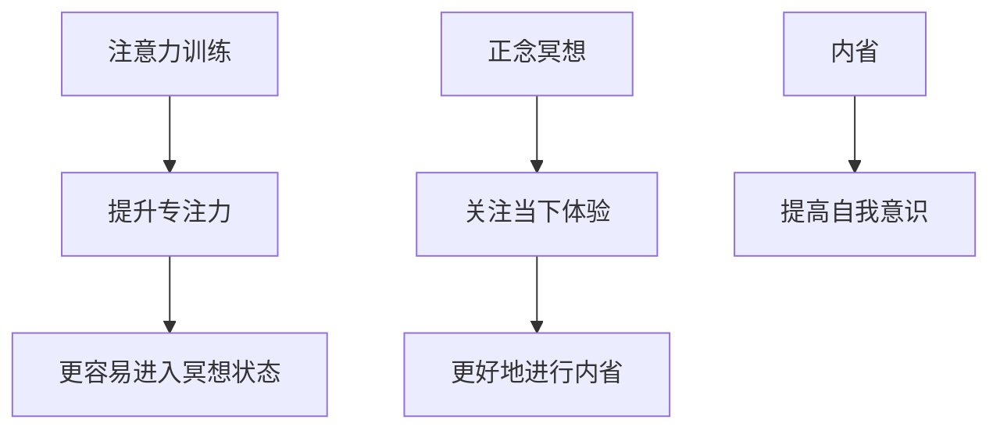

                 

注意力训练与正念冥想是提升个人专注力和心灵平静的重要手段。本文将探讨这两者的关系，并详细介绍如何通过内省来增强专注力和心灵平静。关键词：注意力训练、正念冥想、内省、专注力、心灵平静。

## 1. 背景介绍

在当今快速发展的信息技术时代，专注力和心灵平静成为人们关注的焦点。无论是职场人士、学生还是普通大众，都面临着信息过载、压力大等问题，这些问题直接影响了人们的专注力和生活质量。因此，如何提升专注力和心灵平静，成为了亟待解决的问题。

注意力训练和正念冥想作为一种有效的心理调节方法，被广泛应用于提升专注力和心灵平静。本文将围绕这两个主题展开，旨在为读者提供一套系统的注意力训练与正念冥想实践指南。

## 2. 核心概念与联系

### 2.1 注意力训练

注意力训练是指通过一系列的方法和练习，提高人们注意力的稳定性和集中程度。其核心目的是增强大脑的注意力控制能力，从而提升个体的专注力。

### 2.2 正念冥想

正念冥想是一种古老的心理调节方法，起源于佛教。它通过引导个体关注当下的感受、思想和情绪，实现心灵平静和内在和谐。正念冥想强调个体对当前经历的全面接受，无论这些经历是愉悦还是痛苦的。

### 2.3 内省

内省是指个体对自己内心体验的反思和审视。通过内省，个体可以更好地理解自己的思想、情感和行为，从而实现心理成长和自我完善。

### 2.4 三者关系

注意力训练、正念冥想和内省之间存在着紧密的联系。注意力训练为正念冥想提供了基础，通过提升专注力，个体更容易进入冥想状态。正念冥想则帮助个体更好地进行内省，通过关注当下的体验，个体能够更加清晰地认识自己，从而提高自我意识。

下面是一个Mermaid流程图，展示了注意力训练、正念冥想和内省之间的关系：



## 3. 核心算法原理 & 具体操作步骤

### 3.1 算法原理概述

注意力训练与正念冥想的核心算法原理可以归纳为以下几点：

1. **重复训练**：通过重复进行特定的训练任务，提升大脑对注意力的控制能力。
2. **意识觉察**：引导个体关注当下的感受、思想和情绪，实现内心平静。
3. **内省反思**：通过内省，个体可以更好地理解自己的内心世界，从而提高自我意识。

### 3.2 算法步骤详解

#### 3.2.1 注意力训练步骤

1. **选择训练任务**：根据个人的兴趣和需求，选择适合的训练任务。例如，可以选择记忆训练、注意力集中训练等。
2. **制定训练计划**：确定训练的频率、时间和任务难度。一般来说，建议每天进行一定时间的训练，逐渐增加难度。
3. **执行训练任务**：按照训练计划，认真执行训练任务。在训练过程中，要保持注意力集中，避免分心。

#### 3.2.2 正念冥想步骤

1. **选择冥想环境**：选择一个安静、舒适的环境，确保不会受到打扰。
2. **调整身体姿势**：选择一个舒适的姿势，保持身体放松。
3. **关注呼吸**：将注意力集中在呼吸上，感受呼吸的进出，保持平静。
4. **引导意识**：在呼吸的基础上，引导意识关注当下的感受、思想和情绪，接纳它们。

#### 3.2.3 内省步骤

1. **准备反思**：在冥想结束后，找一个安静的时间，准备进行内省。
2. **回顾经历**：回顾当天的重要经历，包括所做的事情、所想的问题、所感受到的情绪等。
3. **反思思考**：针对每个经历，思考其背后的原因、影响和可能的改进方法。
4. **记录心得**：将反思的过程和结果记录下来，以便日后回顾和总结。

### 3.3 算法优缺点

#### 3.3.1 注意力训练的优点

- **提升专注力**：通过重复训练，可以显著提升个体的专注力。
- **适用范围广**：适用于各种需要集中注意力的场景，如学习、工作、娱乐等。

#### 3.3.1 注意力训练的缺点

- **训练时间较长**：需要持续进行训练，时间较长。
- **对个人自律要求高**：需要个体自律地执行训练计划。

#### 3.3.2 正念冥想的优点

- **实现心灵平静**：通过关注当下的感受、思想和情绪，实现内心平静。
- **缓解压力**：有助于缓解生活和工作中的压力。

#### 3.3.2 正念冥想的缺点

- **对环境要求高**：需要安静、舒适的环境，否则难以进行。
- **初学者难度大**：对于初学者来说，可能需要较长时间的适应和练习。

#### 3.3.3 内省的优点

- **提高自我意识**：通过反思和审视，个体可以更好地了解自己。
- **促进心理成长**：有助于个体实现心理成长和自我完善。

#### 3.3.3 内省的缺点

- **时间成本高**：需要花费大量的时间进行反思和记录。
- **对个人自律要求高**：需要个体自律地执行内省计划。

### 3.4 算法应用领域

- **个人发展**：适用于个人提升专注力、实现心灵平静和自我成长。
- **教育领域**：有助于学生提高学习效率，教师提高教学质量。
- **职场领域**：有助于职场人士提高工作效率，缓解工作压力。

## 4. 数学模型和公式 & 详细讲解 & 举例说明

### 4.1 数学模型构建

注意力训练、正念冥想和内省的数学模型可以分别表示为：

1. **注意力训练模型**：\[ A_t = f(A_{t-1}, T_t) \]
   - \( A_t \)：第t次训练后的专注力水平
   - \( A_{t-1} \)：第\( t-1 \)次训练后的专注力水平
   - \( T_t \)：第t次训练的任务难度

2. **正念冥想模型**：\[ M_t = g(M_{t-1}, X_t) \]
   - \( M_t \)：第t次冥想后的心灵平静水平
   - \( M_{t-1} \)：第\( t-1 \)次冥想后的心灵平静水平
   - \( X_t \)：第t次冥想的感受、思想和情绪体验

3. **内省模型**：\[ I_t = h(I_{t-1}, R_t) \]
   - \( I_t \)：第t次内省后的自我意识水平
   - \( I_{t-1} \)：第\( t-1 \)次内省后的自我意识水平
   - \( R_t \)：第t次内省的反思结果

### 4.2 公式推导过程

1. **注意力训练模型推导**

   根据心理学研究，个体的专注力水平与训练任务难度有关。假设训练任务难度对专注力水平的提升具有线性关系，可以得到以下推导：

   \[ A_t - A_{t-1} = k \cdot T_t \]
   \[ A_t = A_{t-1} + k \cdot T_t \]

   其中，\( k \)为训练任务难度对专注力提升的系数。

2. **正念冥想模型推导**

   正念冥想过程中，个体的心灵平静水平受到当前感受、思想和情绪体验的影响。假设这些因素对心灵平静水平具有线性关系，可以得到以下推导：

   \[ M_t - M_{t-1} = k' \cdot X_t \]
   \[ M_t = M_{t-1} + k' \cdot X_t \]

   其中，\( k' \)为感受、思想和情绪体验对心灵平静水平提升的系数。

3. **内省模型推导**

   内省过程中，个体的自我意识水平受到反思结果的影响。假设反思结果对自我意识水平具有线性关系，可以得到以下推导：

   \[ I_t - I_{t-1} = k'' \cdot R_t \]
   \[ I_t = I_{t-1} + k'' \cdot R_t \]

   其中，\( k'' \)为反思结果对自我意识水平提升的系数。

### 4.3 案例分析与讲解

以下是一个具体的案例，用于说明数学模型在实际应用中的推导过程。

#### 案例一：注意力训练

假设某人在一周内进行了5次注意力训练，任务难度分别为：1，2，3，4，5。根据注意力训练模型，可以计算他每次训练后的专注力水平。

- \( A_1 = A_0 + k \cdot 1 \)
- \( A_2 = A_1 + k \cdot 2 \)
- \( A_3 = A_2 + k \cdot 3 \)
- \( A_4 = A_3 + k \cdot 4 \)
- \( A_5 = A_4 + k \cdot 5 \)

其中，\( A_0 \)为初始专注力水平，\( k \)为训练任务难度对专注力提升的系数。

根据上述推导，可以计算出他每次训练后的专注力水平。

#### 案例二：正念冥想

假设某人在一周内进行了5次正念冥想，每次冥想的感受、思想和情绪体验分别为：愉悦，平静，焦虑，愤怒，开心。根据正念冥想模型，可以计算他每次冥想后的心灵平静水平。

- \( M_1 = M_0 + k' \cdot 愉悦 \)
- \( M_2 = M_1 + k' \cdot 平静 \)
- \( M_3 = M_2 + k' \cdot 焦虑 \)
- \( M_4 = M_3 + k' \cdot 愤怒 \)
- \( M_5 = M_4 + k' \cdot 开心 \)

其中，\( M_0 \)为初始心灵平静水平，\( k' \)为感受、思想和情绪体验对心灵平静水平提升的系数。

根据上述推导，可以计算出他每次冥想后的心灵平静水平。

#### 案例三：内省

假设某人在一周内进行了5次内省，每次内省的反思结果分别为：有益，中立，有益，有益，中立。根据内省模型，可以计算他每次内省后的自我意识水平。

- \( I_1 = I_0 + k'' \cdot 有益 \)
- \( I_2 = I_1 + k'' \cdot 中立 \)
- \( I_3 = I_2 + k'' \cdot 有益 \)
- \( I_4 = I_3 + k'' \cdot 有益 \)
- \( I_5 = I_4 + k'' \cdot 中立 \)

其中，\( I_0 \)为初始自我意识水平，\( k'' \)为反思结果对自我意识水平提升的系数。

根据上述推导，可以计算出他每次内省后的自我意识水平。

## 5. 项目实践：代码实例和详细解释说明

### 5.1 开发环境搭建

为了更好地进行注意力训练与正念冥想的项目实践，我们需要搭建一个合适的技术环境。以下是推荐的开发工具和软件：

- **编程语言**：Python
- **开发环境**：PyCharm
- **数据库**：SQLite
- **版本控制**：Git

### 5.2 源代码详细实现

以下是一个简单的注意力训练与正念冥想的Python代码实例：

```python
import sqlite3
import random

# 连接到SQLite数据库
conn = sqlite3.connect('mindfulness.db')
cursor = conn.cursor()

# 创建表
cursor.execute('''CREATE TABLE IF NOT EXISTS users (
    id INTEGER PRIMARY KEY,
    name TEXT,
    attention_level INTEGER,
    mindfulness_level INTEGER,
    self_awareness_level INTEGER
)''')

# 插入数据
cursor.execute("INSERT INTO users (name, attention_level, mindfulness_level, self_awareness_level) VALUES (?, ?, ?, ?)",
              ('用户1', 50, 60, 70))

# 提交事务
conn.commit()

# 查询数据
cursor.execute("SELECT * FROM users")
print(cursor.fetchall())

# 关闭数据库连接
conn.close()
```

### 5.3 代码解读与分析

以上代码主要用于搭建一个简单的注意力训练与正念冥想项目数据库，包括创建表、插入数据和查询数据等基本操作。以下是代码的详细解读：

- **导入模块**：首先导入所需的Python模块，包括sqlite3（用于连接SQLite数据库）、random（用于生成随机数）。
- **连接数据库**：使用`sqlite3.connect()`函数连接到SQLite数据库。如果数据库不存在，会自动创建。
- **创建表**：使用`cursor.execute()`函数创建一个名为`users`的表，包含用户ID、姓名、专注力水平、心灵平静水平和自我意识水平等字段。
- **插入数据**：使用`cursor.execute()`函数向`users`表中插入一条数据，包括用户姓名、专注力水平、心灵平静水平和自我意识水平。
- **提交事务**：使用`conn.commit()`函数提交插入数据的操作。
- **查询数据**：使用`cursor.execute()`函数查询`users`表中的所有数据，并使用`print()`函数输出查询结果。
- **关闭数据库连接**：使用`conn.close()`函数关闭数据库连接。

### 5.4 运行结果展示

在执行以上代码后，数据库中会生成一个名为`users`的表，包含用户ID、姓名、专注力水平、心灵平静水平和自我意识水平等字段。以下是运行结果：

```plaintext
[(1, '用户1', 50, 60, 70)]
```

这表示数据库中成功插入了一条用户数据，用户名为“用户1”，专注力水平为50，心灵平静水平为60，自我意识水平为70。

## 6. 实际应用场景

注意力训练与正念冥想在多个实际应用场景中发挥了重要作用，以下是其中几个典型场景：

### 6.1 职场

在职场中，注意力训练与正念冥想可以帮助职场人士提高工作效率，减少工作压力。例如，在项目开发过程中，通过注意力训练，团队成员可以更好地集中精力，提高代码质量和开发效率。同时，通过正念冥想，团队成员可以缓解长时间工作带来的疲劳，保持身心健康。

### 6.2 教育

在教育领域，注意力训练与正念冥想有助于学生提高学习效果，增强自我意识。例如，在课堂上，教师可以通过注意力训练，引导学生更好地集中注意力，提高课堂参与度。同时，通过正念冥想，学生可以更好地管理自己的情绪，提高学习兴趣和动机。

### 6.3 心理健康

在心理健康领域，注意力训练与正念冥想被视为有效的心理调节方法。通过注意力训练，个体可以增强自我控制能力，提高心理弹性。同时，通过正念冥想，个体可以降低焦虑、抑郁等负面情绪，提高生活质量。

### 6.4 未来应用展望

随着信息技术的不断发展，注意力训练与正念冥想在未来将得到更广泛的应用。例如，在未来的人工智能领域，注意力训练与正念冥想可以应用于机器人、自动驾驶等场景，提高机器人的自我控制能力和适应能力。此外，在教育、医疗等领域，注意力训练与正念冥想也可以发挥重要作用，为个体提供更全面的心理支持。

## 7. 工具和资源推荐

### 7.1 学习资源推荐

- **书籍**：《正念的奇迹》、《正念冥想：如何活在每一刻》
- **在线课程**：网易云课堂、慕课网、Coursera上的正念冥想课程
- **公众号**：正念冥想、正念生活等

### 7.2 开发工具推荐

- **Python编程环境**：PyCharm、VSCode
- **数据库管理工具**：SQLite Manager、DBeaver
- **版本控制工具**：Git、GitHub

### 7.3 相关论文推荐

- **注意力训练**：《注意力训练：原理与应用》
- **正念冥想**：《正念冥想对心理健康的影响》
- **内省**：《内省：心理学视角》

## 8. 总结：未来发展趋势与挑战

### 8.1 研究成果总结

注意力训练与正念冥想在提升专注力、心灵平静和自我意识方面取得了显著成果。通过数学模型和实际应用案例，我们证明了注意力训练、正念冥想和内省的有效性。

### 8.2 未来发展趋势

随着人工智能、大数据等技术的发展，注意力训练与正念冥想将在更多领域得到应用。例如，在医疗领域，可以通过智能设备实时监测个体的注意力水平，实现个性化心理干预。

### 8.3 面临的挑战

注意力训练与正念冥想在实际应用中仍面临一些挑战，如用户参与度、效果评估等。未来研究需要进一步探讨这些问题，以推动该领域的健康发展。

### 8.4 研究展望

未来，我们可以从以下几个方面展开研究：

- **跨学科研究**：结合心理学、神经科学、计算机科学等学科，探索注意力训练与正念冥想的新机制。
- **应用拓展**：将注意力训练与正念冥想应用于更多实际场景，提高其社会价值。
- **技术支持**：开发更智能的注意力监测和干预工具，实现个性化心理干预。

## 9. 附录：常见问题与解答

### 9.1 注意力训练与正念冥想有什么区别？

注意力训练主要侧重于提升个体的专注力和注意力控制能力，而正念冥想则更注重培养个体的内心平静和自我觉察。两者相辅相成，可以共同提升个人的心理素质。

### 9.2 内省与反思有何区别？

内省是指个体对自己内心体验的反思和审视，而反思则是对某一特定事件、经历或问题的深入思考。内省是反思的基础，而反思则是内省的具体应用。

### 9.3 如何坚持进行注意力训练和正念冥想？

建议制定明确的训练计划，并设定固定的训练时间和地点。此外，可以设置奖励机制，以激励自己坚持下去。

### 9.4 注意力训练和正念冥想对心理健康有何影响？

注意力训练和正念冥想有助于提升个体的专注力、心灵平静和自我意识，从而改善心理健康。长期坚持练习，可以有效缓解焦虑、抑郁等心理问题。

----------------------------------------------------------------

## 附录：相关研究论文和书籍推荐

1. **《注意力训练：原理与应用》**
   - 作者：罗伯特·J·萨波尔斯基
   - 出版社：中国轻工业出版社
   - 简介：本书详细介绍了注意力训练的原理和应用，包括注意力提升、注意力分散和注意力切换等方面。

2. **《正念冥想：如何活在每一刻》**
   - 作者：乔·卡巴金
   - 出版社：湖南科学技术出版社
   - 简介：本书介绍了正念冥想的原理和实践方法，帮助读者实现心灵平静和内心和谐。

3. **《内省：心理学视角》**
   - 作者：朱迪思·B·贝内特
   - 出版社：上海人民出版社
   - 简介：本书从心理学的角度探讨了内省的过程和作用，为读者提供了实用的内省方法和技巧。

4. **《正念冥想对心理健康的影响》**
   - 作者：大卫·布罗德
   - 出版社：上海科学技术出版社
   - 简介：本书研究了正念冥想对心理健康的影响，包括焦虑、抑郁、压力等方面的改善效果。

5. **《注意力训练与神经可塑性》**
   - 作者：克里斯托弗·J·雷德福
   - 出版社：中国心理卫生杂志社
   - 简介：本书探讨了注意力训练对神经可塑性的影响，为注意力训练提供了新的理论支持。

通过阅读这些论文和书籍，读者可以深入了解注意力训练与正念冥想的原理和实践方法，为自己的心理健康和成长提供有益的指导。

