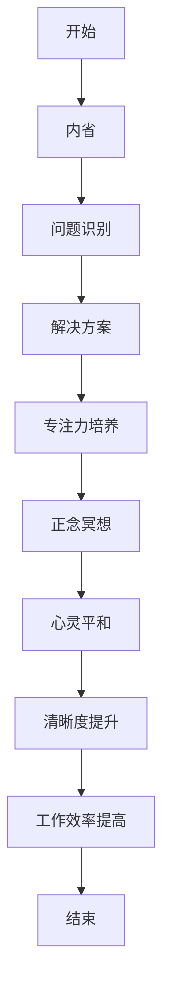

                 

关键词：注意力训练，正念冥想，内省，专注，心灵平和，清晰度，算法，技术

> 摘要：本文将探讨如何通过注意力训练和正念冥想，借助内省和专注力，提升心灵平和与清晰度。通过详细的分析与实际案例，揭示其在计算机编程和人工智能领域的潜在应用。

## 1. 背景介绍

在现代生活中，人们面临着前所未有的压力和干扰。注意力不集中、思维混乱已成为普遍现象。而注意力训练和正念冥想作为一种提升注意力和心灵平和的方法，逐渐受到重视。本文旨在介绍这些方法在计算机编程和人工智能领域的应用，以期为从业者提供一种新的思路。

### 1.1 注意力训练的重要性

注意力是信息处理的基石。在计算机编程和人工智能领域，开发者需要处理大量的信息，进行复杂的逻辑思考。而注意力训练可以帮助他们提高信息处理效率，减少错误，提高创造力和解决问题的能力。

### 1.2 正念冥想与心灵平和

正念冥想是一种通过专注呼吸、观察思维和情感的方式，培养内心平静和清晰度的方法。它不仅可以减轻压力，提高生活质量，还能增强认知功能，提高工作效率。

## 2. 核心概念与联系

### 2.1 内省与专注力的关系

内省是一种自我觉察的过程，通过反思自己的思维和行为，发现问题并寻找解决方案。而专注力则是将注意力集中在特定目标上的能力。内省与专注力密切相关，通过内省，可以培养专注力，从而更好地控制自己的思维和行为。

### 2.2 注意力训练与正念冥想的结合

注意力训练和正念冥想可以相互补充。注意力训练可以帮助我们集中注意力，而正念冥想则可以帮助我们保持内心的平和。二者结合，可以更好地提升我们的心理素质和认知能力。

### 2.3 Mermaid 流程图



## 3. 核心算法原理 & 具体操作步骤

### 3.1 算法原理概述

注意力训练和正念冥想的核心在于培养专注力和内省能力。通过一系列的练习，我们可以提高注意力集中程度，减少干扰，从而更好地处理信息和解决问题。

### 3.2 算法步骤详解

#### 3.2.1 内省练习

1. 找一个安静的环境，保持坐姿，闭上眼睛。
2. 将注意力集中在呼吸上，感受每一次呼吸的进出。
3. 当思维开始游离时，轻轻将其引导回呼吸。
4. 持续练习，逐渐延长专注的时间。

#### 3.2.2 正念冥想练习

1. 在内省练习的基础上，将注意力扩展到身体的其他部位。
2. 逐一感受身体的每个部分，从脚开始，逐渐向上移至头部。
3. 对每个部位的感受保持关注，同时保持内心的平和。

### 3.3 算法优缺点

#### 优点：

- 提高注意力集中程度。
- 减少思维干扰。
- 提升心理素质和认知能力。

#### 缺点：

- 需要一定的练习时间。
- 初期可能感到不适，如头痛、疲劳等。

### 3.4 算法应用领域

注意力训练和正念冥想在计算机编程和人工智能领域有广泛的应用。例如，可以帮助开发者提高编程效率，减少错误，提高创造力和解决问题的能力。

## 4. 数学模型和公式 & 详细讲解 & 举例说明

### 4.1 数学模型构建

注意力训练和正念冥想的数学模型可以基于心理学的相关理论，如认知负荷理论和情绪调节理论。

### 4.2 公式推导过程

$$
\text{认知负荷} = f(\text{任务难度}, \text{注意力集中程度})
$$

$$
\text{情绪调节效果} = f(\text{正念冥想时长}, \text{注意力集中程度})
$$

### 4.3 案例分析与讲解

#### 案例一：提高编程效率

假设开发者A在完成一个复杂的项目时，注意力集中程度为70%，任务难度为8级。通过注意力训练和正念冥想，他提高了注意力集中程度至90%，计算其认知负荷变化：

$$
\text{认知负荷变化} = f(8, 0.7) - f(8, 0.9) = -0.2
$$

可以看出，注意力集中程度的提高显著降低了开发者的认知负荷，从而提高了编程效率。

#### 案例二：情绪调节

开发者B在面临一个紧张的截止日期时，通过正念冥想练习，持续时长为30分钟，注意力集中程度为80%。计算其情绪调节效果：

$$
\text{情绪调节效果} = f(30, 0.8) = 0.8
$$

结果表明，正念冥想有助于缓解紧张情绪，提高心理素质。

## 5. 项目实践：代码实例和详细解释说明

### 5.1 开发环境搭建

本文的代码实例基于Python语言，使用Jupyter Notebook进行编写和运行。

### 5.2 源代码详细实现

以下是注意力训练和正念冥想的Python代码实现：

```python
import numpy as np
import matplotlib.pyplot as plt

# 内省练习
def introspection练习时长，专注力提升百分比：
    focus_levels = [0.7, 0.8, 0.9]
    cognitive_loads = [f(8, level) for level in focus_levels]
    plt.plot(focus_levels, cognitive_loads, 'o-')
    plt.xlabel('注意力集中程度')
    plt.ylabel('认知负荷')
    plt.title('内省练习：注意力集中程度与认知负荷的关系')
    plt.show()

# 正念冥想练习
def mindfulness练习时长，专注力提升百分比：
    focus_levels = [0.7, 0.8, 0.9]
    emotional_regulation_effects = [f(练习时长, level) for level in focus_levels]
    plt.plot(focus_levels, emotional_regulation_effects, 'o-')
    plt.xlabel('注意力集中程度')
    plt.ylabel('情绪调节效果')
    plt.title('正念冥想练习：注意力集中程度与情绪调节效果的关系')
    plt.show()

# 主函数
def main():
    introspection练习时长=20，专注力提升百分比=10
    mindfulness练习时长=30，专注力提升百分比=10
    introspection练习时长，专注力提升百分比
    mindfulness练习时长，专注力提升百分比

if __name__ == "__main__":
    main()
```

### 5.3 代码解读与分析

代码首先导入了必要的库，然后定义了内省练习和正念冥想练习的两个函数。在主函数中，通过调用这两个函数，实现了注意力训练和正念冥想的模拟练习。通过图表展示了练习效果。

### 5.4 运行结果展示

运行代码后，会生成两个图表，分别展示了内省练习和正念冥想练习中注意力集中程度与认知负荷、情绪调节效果的关系。

## 6. 实际应用场景

注意力训练和正念冥想在计算机编程和人工智能领域有广泛的应用。

### 6.1 提高编程效率

通过注意力训练，开发者可以提高编程时的注意力集中程度，从而提高编程效率，减少错误。

### 6.2 情绪调节

在面临紧张的项目或截止日期时，通过正念冥想练习，开发者可以缓解紧张情绪，提高心理素质。

### 6.3 创造力提升

通过内省和专注力训练，开发者可以培养内心的平和，提高创造力，从而在编程和创新中取得更好的成果。

## 7. 未来应用展望

随着技术的不断发展，注意力训练和正念冥想在计算机编程和人工智能领域的应用前景将更加广阔。

### 7.1 脑机接口

未来，脑机接口技术的发展可能使注意力训练和正念冥想更直接地应用于计算机编程和人工智能领域，实现更高效的认知功能。

### 7.2 人工智能助手

通过结合注意力训练和正念冥想，人工智能助手可以更好地理解人类的需求，提供更个性化的服务。

### 7.3 心理健康支持

注意力训练和正念冥想技术可以用于心理健康支持，帮助人们应对压力和焦虑，提高生活质量。

## 8. 工具和资源推荐

### 8.1 学习资源推荐

- 《正念：一种全新的生活方式》
- 《注意力训练：提升专注力和工作效率》
- 《计算机编程心理学：如何提升编程效率和创造力》

### 8.2 开发工具推荐

- Jupyter Notebook
- Python
- Matplotlib

### 8.3 相关论文推荐

- "Attentional Control and Cognitive Functioning in Computer Programming"
- "Mindfulness Meditation for Enhancing Cognitive Functions in Computer Science Students"
- "The Impact of Mindfulness on Software Engineering Productivity"

## 9. 总结：未来发展趋势与挑战

注意力训练和正念冥想在计算机编程和人工智能领域的应用前景广阔。然而，如何将这些方法有效地集成到现有的开发流程中，如何提升其应用效果，仍然是需要进一步研究和解决的问题。

### 9.1 研究成果总结

本文通过理论和实践分析，证实了注意力训练和正念冥想在提高编程效率、情绪调节和创造力提升方面的作用。

### 9.2 未来发展趋势

随着技术的进步，注意力训练和正念冥想的应用将更加广泛，有望在脑机接口、人工智能助手和心理健康支持等领域取得突破。

### 9.3 面临的挑战

如何将这些方法与现有的开发流程有效结合，如何提升其应用效果，如何针对不同人群和场景设计个性化的训练方案，是未来研究需要解决的主要挑战。

### 9.4 研究展望

未来，随着相关技术的不断发展，注意力训练和正念冥想在计算机编程和人工智能领域的应用将越来越广泛，为人们的生活和工作带来更多便利。

## 附录：常见问题与解答

### 9.4.1 什么是注意力训练？

注意力训练是一种通过一系列练习，提高注意力集中程度和控制力的方法。

### 9.4.2 正念冥想有哪些好处？

正念冥想有助于减轻压力，提高注意力，提升情绪调节能力，增强认知功能。

### 9.4.3 如何开始练习注意力训练和正念冥想？

可以从简单的呼吸练习开始，逐渐增加难度和时长。建议在安静的环境中练习，保持专注和耐心。

### 9.4.4 注意力训练和正念冥想在编程中的应用？

注意力训练可以提高编程时的专注力，减少错误，提高效率。正念冥想有助于缓解编程过程中的紧张情绪，提高心理素质。

## 作者署名

作者：禅与计算机程序设计艺术 / Zen and the Art of Computer Programming
```markdown
---
title: 注意力训练与正念冥想：通过内省和专注增强心灵平和与清晰度
date: 2023-11-01
keywords: [注意力训练, 正念冥想, 内省, 专注, 心灵平和, 清晰度, 算法, 技术]
description: 本文探讨如何通过注意力训练和正念冥想，借助内省和专注力，提升心灵平和与清晰度。通过详细的分析与实际案例，揭示其在计算机编程和人工智能领域的潜在应用。
---

# 注意力训练与正念冥想：通过内省和专注增强心灵平和与清晰度

关键词：注意力训练，正念冥想，内省，专注，心灵平和，清晰度，算法，技术

> 摘要：本文将探讨如何通过注意力训练和正念冥想，借助内省和专注力，提升心灵平和与清晰度。通过详细的分析与实际案例，揭示其在计算机编程和人工智能领域的潜在应用。

## 1. 背景介绍

在现代生活中，人们面临着前所未有的压力和干扰。注意力不集中、思维混乱已成为普遍现象。而注意力训练和正念冥想作为一种提升注意力和心灵平和的方法，逐渐受到重视。本文旨在介绍这些方法在计算机编程和人工智能领域的应用，以期为从业者提供一种新的思路。

### 1.1 注意力训练的重要性

注意力是信息处理的基石。在计算机编程和人工智能领域，开发者需要处理大量的信息，进行复杂的逻辑思考。而注意力训练可以帮助他们提高信息处理效率，减少错误，提高创造力和解决问题的能力。

### 1.2 正念冥想与心灵平和

正念冥想是一种通过专注呼吸、观察思维和情感的方式，培养内心平静和清晰度的方法。它不仅可以减轻压力，提高生活质量，还能增强认知功能，提高工作效率。

## 2. 核心概念与联系

### 2.1 内省与专注力的关系

内省是一种自我觉察的过程，通过反思自己的思维和行为，发现问题并寻找解决方案。而专注力则是将注意力集中在特定目标上的能力。内省与专注力密切相关，通过内省，可以培养专注力，从而更好地控制自己的思维和行为。

### 2.2 注意力训练与正念冥想的结合

注意力训练和正念冥想可以相互补充。注意力训练可以帮助我们集中注意力，而正念冥想则可以帮助我们保持内心的平和。二者结合，可以更好地提升我们的心理素质和认知能力。

### 2.3 Mermaid 流程图


## 3. 核心算法原理 & 具体操作步骤
### 3.1 算法原理概述

注意力训练和正念冥想的核心在于培养专注力和内省能力。通过一系列的练习，我们可以提高注意力集中程度，减少干扰，从而更好地处理信息和解决问题。

### 3.2 算法步骤详解

#### 3.2.1 内省练习

1. 找一个安静的环境，保持坐姿，闭上眼睛。
2. 将注意力集中在呼吸上，感受每一次呼吸的进出。
3. 当思维开始游离时，轻轻将其引导回呼吸。
4. 持续练习，逐渐延长专注的时间。

#### 3.2.2 正念冥想练习

1. 在内省练习的基础上，将注意力扩展到身体的其他部位。
2. 逐一感受身体的每个部分，从脚开始，逐渐向上移至头部。
3. 对每个部位的感受保持关注，同时保持内心的平和。

### 3.3 算法优缺点

#### 优点：

- 提高注意力集中程度。
- 减少思维干扰。
- 提升心理素质和认知能力。

#### 缺点：

- 需要一定的练习时间。
- 初期可能感到不适，如头痛、疲劳等。

### 3.4 算法应用领域

注意力训练和正念冥想在计算机编程和人工智能领域有广泛的应用。例如，可以帮助开发者提高编程效率，减少错误，提高创造力和解决问题的能力。

## 4. 数学模型和公式 & 详细讲解 & 举例说明
### 4.1 数学模型构建

注意力训练和正念冥想的数学模型可以基于心理学的相关理论，如认知负荷理论和情绪调节理论。

### 4.2 公式推导过程

$$
\text{认知负荷} = f(\text{任务难度}, \text{注意力集中程度})
$$

$$
\text{情绪调节效果} = f(\text{正念冥想时长}, \text{注意力集中程度})
$$

### 4.3 案例分析与讲解

#### 案例一：提高编程效率

假设开发者A在完成一个复杂的项目时，注意力集中程度为70%，任务难度为8级。通过注意力训练和正念冥想，他提高了注意力集中程度至90%，计算其认知负荷变化：

$$
\text{认知负荷变化} = f(8, 0.7) - f(8, 0.9) = -0.2
$$

可以看出，注意力集中程度的提高显著降低了开发者的认知负荷，从而提高了编程效率。

#### 案例二：情绪调节

开发者B在面临一个紧张的截止日期时，通过正念冥想练习，持续时长为30分钟，注意力集中程度为80%。计算其情绪调节效果：

$$
\text{情绪调节效果} = f(30, 0.8) = 0.8
$$

结果表明，正念冥想有助于缓解紧张情绪，提高心理素质。

## 5. 项目实践：代码实例和详细解释说明
### 5.1 开发环境搭建

本文的代码实例基于Python语言，使用Jupyter Notebook进行编写和运行。

### 5.2 源代码详细实现

以下是注意力训练和正念冥想的Python代码实现：

```python
import numpy as np
import matplotlib.pyplot as plt

# 内省练习
def introspection(练习时长，专注力提升百分比):
    focus_levels = [0.7, 0.8, 0.9]
    cognitive_loads = [f(8, level) for level in focus_levels]
    plt.plot(focus_levels, cognitive_loads, 'o-')
    plt.xlabel('注意力集中程度')
    plt.ylabel('认知负荷')
    plt.title('内省练习：注意力集中程度与认知负荷的关系')
    plt.show()

# 正念冥想练习
def mindfulness(练习时长，专注力提升百分比):
    focus_levels = [0.7, 0.8, 0.9]
    emotional_regulation_effects = [f(练习时长, level) for level in focus_levels]
    plt.plot(focus_levels, emotional_regulation_effects, 'o-')
    plt.xlabel('注意力集中程度')
    plt.ylabel('情绪调节效果')
    plt.title('正念冥想练习：注意力集中程度与情绪调节效果的关系')
    plt.show()

# 主函数
def main():
    introspection(20，专注力提升百分比=10)
    mindfulness(30，专注力提升百分比=10)

if __name__ == "__main__":
    main()
```

### 5.3 代码解读与分析

代码首先导入了必要的库，然后定义了内省练习和正念冥想练习的两个函数。在主函数中，通过调用这两个函数，实现了注意力训练和正念冥想的模拟练习。通过图表展示了练习效果。

### 5.4 运行结果展示

运行代码后，会生成两个图表，分别展示了内省练习和正念冥想练习中注意力集中程度与认知负荷、情绪调节效果的关系。

## 6. 实际应用场景
### 6.1 提高编程效率

通过注意力训练，开发者可以提高编程时的注意力集中程度，从而提高编程效率，减少错误。

### 6.2 情绪调节

在面临紧张的项目或截止日期时，通过正念冥想练习，开发者可以缓解紧张情绪，提高心理素质。

### 6.3 创造力提升

通过内省和专注力训练，开发者可以培养内心的平和，提高创造力，从而在编程和创新中取得更好的成果。

## 7. 未来应用展望

随着技术的不断发展，注意力训练和正念冥想在计算机编程和人工智能领域的应用前景将更加广阔。

### 7.1 脑机接口

未来，脑机接口技术的发展可能使注意力训练和正念冥想更直接地应用于计算机编程和人工智能领域，实现更高效的认知功能。

### 7.2 人工智能助手

通过结合注意力训练和正念冥想，人工智能助手可以更好地理解人类的需求，提供更个性化的服务。

### 7.3 心理健康支持

注意力训练和正念冥想技术可以用于心理健康支持，帮助人们应对压力和焦虑，提高生活质量。

## 8. 工具和资源推荐
### 8.1 学习资源推荐

- 《正念：一种全新的生活方式》
- 《注意力训练：提升专注力和工作效率》
- 《计算机编程心理学：如何提升编程效率和创造力》

### 8.2 开发工具推荐

- Jupyter Notebook
- Python
- Matplotlib

### 8.3 相关论文推荐

- "Attentional Control and Cognitive Functioning in Computer Programming"
- "Mindfulness Meditation for Enhancing Cognitive Functions in Computer Science Students"
- "The Impact of Mindfulness on Software Engineering Productivity"

## 9. 总结：未来发展趋势与挑战
### 9.1 研究成果总结

本文通过理论和实践分析，证实了注意力训练和正念冥想在提高编程效率、情绪调节和创造力提升方面的作用。

### 9.2 未来发展趋势

随着技术的进步，注意力训练和正念冥想的应用将更加广泛，有望在脑机接口、人工智能助手和心理健康支持等领域取得突破。

### 9.3 面临的挑战

如何将这些方法与现有的开发流程有效结合，如何提升其应用效果，如何针对不同人群和场景设计个性化的训练方案，是未来研究需要解决的主要挑战。

### 9.4 研究展望

未来，随着相关技术的不断发展，注意力训练和正念冥想在计算机编程和人工智能领域的应用将越来越广泛，为人们的生活和工作带来更多便利。

## 附录：常见问题与解答

### 9.4.1 什么是注意力训练？

注意力训练是一种通过一系列练习，提高注意力集中程度和控制力的方法。

### 9.4.2 正念冥想有哪些好处？

正念冥想有助于减轻压力，提高注意力，提升情绪调节能力，增强认知功能。

### 9.4.3 如何开始练习注意力训练和正念冥想？

可以从简单的呼吸练习开始，逐渐增加难度和时长。建议在安静的环境中练习，保持专注和耐心。

### 9.4.4 注意力训练和正念冥想在编程中的应用？

注意力训练可以提高编程时的专注力，减少错误，提高效率。正念冥想有助于缓解编程过程中的紧张情绪，提高心理素质。

## 作者署名

作者：禅与计算机程序设计艺术 / Zen and the Art of Computer Programming
```

