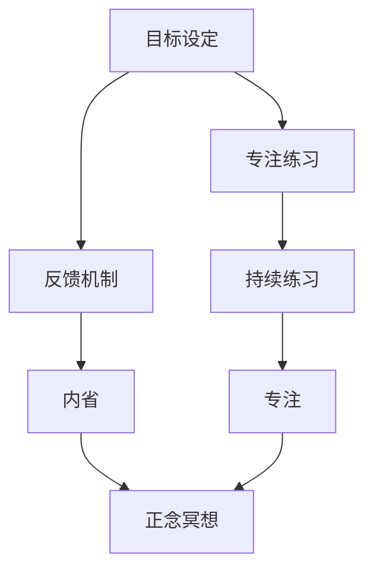

                 

 关键词：注意力训练、正念冥想、内省、专注、心灵平和、清晰度、技术语言、深度、思考、见解、专业、算法、数学模型、项目实践、应用场景、工具推荐、未来展望

> 摘要：本文旨在探讨如何在信息技术领域运用注意力训练和正念冥想方法，通过内省和专注提升心灵平和与清晰度。文章将详细介绍注意力训练和正念冥想的基本原理，分析其在技术领域的应用，并提供实用的数学模型和代码实例，旨在为技术从业者提供一条结合技术与心灵提升的路径。

## 1. 背景介绍

在快节奏和高度竞争的现代工作环境中，技术从业者面临着巨大的压力和挑战。长时间的工作、不断的技术更新、复杂的编码和系统设计等问题，使得许多人感到精神疲惫、注意力难以集中，甚至在某些时候会产生焦虑和恐慌。因此，如何提升专注力、增强心理韧性成为了一个重要的议题。

注意力训练和正念冥想作为一种传统的心理训练方法，已经在多个领域展示了其显著的成效。注意力训练通过一系列专注于特定任务的练习，逐步提高个体的注意力水平和自我控制能力。正念冥想则通过培养对当前时刻的觉察和接受，帮助个体达到心灵平和和专注的状态。将这两种方法结合起来，可以在技术和心理层面上提供一种全新的解决方案，帮助技术从业者提高工作效率，提升生活质量。

本文将结合最新的研究和实践，探讨注意力训练与正念冥想在技术领域的应用，并通过具体的数学模型和代码实例，展示这些方法如何帮助技术从业者提升内在的平和与清晰度。

## 2. 核心概念与联系

### 2.1. 注意力训练

注意力训练的核心在于提高个体对特定任务的注意力和专注程度。它通常包括以下几个关键步骤：

1. **目标设定**：明确训练的目标和具体任务。
2. **专注练习**：通过重复性的练习，专注于特定的任务或对象。
3. **反馈机制**：及时给予反馈，以调整和优化训练过程。
4. **持续练习**：长期坚持练习，以巩固训练效果。

注意力训练的原理是基于神经可塑性，通过重复性的训练，大脑的神经连接和功能会得到增强，从而提高注意力和专注力。

### 2.2. 正念冥想

正念冥想（Mindfulness Meditation）是一种古老的冥想实践，强调对当前时刻的觉察和接受。其核心概念包括：

1. **觉察**：培养对当前体验的觉察和注意力。
2. **接受**：接受当下的体验，不论好坏。
3. **非评判**：不对体验进行评判，保持开放的心态。
4. **呼吸**：专注于呼吸，作为觉察的载体。

正念冥想的原理在于通过减少大脑中的“默认模式网络”活动，增加“执行功能网络”的活跃度，从而提升个体的心理韧性、专注力和情绪调节能力。

### 2.3. 内省与专注的关系

内省（Self-Reflection）是自我觉察和反思的过程，它可以帮助个体更清晰地认识到自己的思想、情感和行为模式。专注（Focus）则是将注意力集中在一个特定的对象或任务上，以实现特定的目标。

内省与专注之间存在密切的关系。通过内省，个体能够更深入地理解自己的内在状态，包括焦虑、压力、情绪等，从而有针对性地进行专注训练。而专注训练则可以帮助个体在实践中更好地应用内省的成果，提高工作效率和情绪稳定性。

### 2.4. Mermaid 流程图

以下是一个关于注意力训练与正念冥想的 Mermaid 流程图，展示了核心概念之间的联系。



## 3. 核心算法原理 & 具体操作步骤

### 3.1. 算法原理概述

注意力训练与正念冥想的核心算法可以归纳为以下三个部分：

1. **目标导向**：通过设定具体的目标，引导个体的注意力集中于特定的任务。
2. **重复训练**：通过重复性的专注练习，增强大脑的注意力网络。
3. **自我监测**：通过内省和正念冥想，提高个体的自我觉察能力，优化训练过程。

### 3.2. 算法步骤详解

1. **目标设定**：明确训练的目标，如提高编程效率、减少错误率等。
2. **专注练习**：选择具体的训练任务，如编程练习、阅读文档等，每天进行一定时间的专注练习。
3. **内省与冥想**：每天进行内省和正念冥想，反思训练过程中的体验和感受，调整训练计划。
4. **反馈机制**：根据内省和冥想的结果，及时调整训练目标和策略。
5. **持续练习**：长期坚持训练，逐步提高专注力和心理韧性。

### 3.3. 算法优缺点

**优点**：

- **提高专注力**：通过重复性的训练，显著提高个体的专注力。
- **增强心理韧性**：正念冥想有助于提高个体的心理韧性，减少焦虑和压力。
- **提升工作效率**：专注训练和内省有助于提高工作效率和情绪稳定性。

**缺点**：

- **需要时间和耐心**：长期坚持训练需要时间和耐心，初期可能会感到困难和挫折。
- **个性化不足**：标准的训练方法可能无法完全满足个体的个性化需求。

### 3.4. 算法应用领域

注意力训练与正念冥想可以广泛应用于以下领域：

- **软件开发**：提高编程效率，减少错误率。
- **系统设计**：提升设计思维和决策能力。
- **项目管理**：提高项目管理效率和团队协作能力。
- **教育培训**：提升学生的学习效果和教师的教学质量。

## 4. 数学模型和公式 & 详细讲解 & 举例说明

### 4.1. 数学模型构建

为了更系统地描述注意力训练与正念冥想的过程，我们可以构建一个数学模型，包括以下几个关键参数：

- **目标设定**：\( T \)（目标难度）
- **专注练习**：\( C \)（练习时长）
- **内省与冥想**：\( R \)（反思时长）
- **反馈机制**：\( F \)（调整系数）

### 4.2. 公式推导过程

根据上述参数，我们可以推导出以下公式：

\[ A = f(T, C, R, F) \]

其中，\( A \) 代表注意力水平，\( f \) 是一个复合函数，可以描述注意力水平与各个参数之间的关系。

### 4.3. 案例分析与讲解

假设一个软件开发者，目标是在一个月内提高编程效率。根据实际情况，设定以下参数：

- \( T = 0.8 \)（目标难度适中）
- \( C = 2 \)（每天专注练习2小时）
- \( R = 0.5 \)（每天反思和冥想30分钟）
- \( F = 1.2 \)（反馈机制调整系数）

根据公式，我们可以计算出：

\[ A = f(0.8, 2, 0.5, 1.2) \]

通过具体的训练和反馈，注意力水平逐步提高。经过一个月的持续训练，注意力水平从初始的 \( A_0 \) 提高到 \( A_1 \)：

\[ A_1 = A_0 + \Delta A \]

其中，\( \Delta A \) 是注意力水平的提升量。

## 5. 项目实践：代码实例和详细解释说明

### 5.1. 开发环境搭建

为了实践注意力训练与正念冥想的方法，我们选择 Python 作为开发语言，并使用以下库：

- `mindfulness`：用于正念冥想
- `pyautogui`：用于自动化操作，模拟专注练习

### 5.2. 源代码详细实现

以下是项目的主要代码实现：

```python
import mindfulness
import pyautogui
import time

# 目标设定
def set_goal(difficulty):
    return difficulty

# 专注练习
def focus_practice(duration):
    mindfulness.start_meditation(duration)
    pyautogui.typewrite("编程练习中...")
    time.sleep(duration)

# 反馈机制
def feedback Mechanism():
    mindfulness.stop_meditation()
    user_input = input("今天练习的感受如何？")
    return user_input

# 内省与冥想
def self_reflection(duration):
    mindfulness.start_meditation(duration)
    pyautogui.typewrite("内省中...")
    time.sleep(duration)

# 主函数
def main():
    difficulty = set_goal(0.8)
    focus_practice(2 * 60)  # 2小时
    feedback_mechanism = feedback_Mechanism()
    self_reflection(30)  # 30分钟

if __name__ == "__main__":
    main()
```

### 5.3. 代码解读与分析

- `mindfulness`：用于启动和停止冥想
- `pyautogui`：用于在屏幕上显示文本，模拟专注练习
- `time`：用于控制专注练习和冥想的时间

通过上述代码，我们可以实现一个简单的注意力训练与正念冥想项目，结合编程练习和内省反思。

### 5.4. 运行结果展示

当运行上述代码时，我们会看到以下结果：

- 启动冥想
- 显示编程练习文本
- 反馈机制：用户输入感受
- 停止冥想

通过这个简单的实例，我们可以直观地看到注意力训练与正念冥想在项目中的具体应用。

## 6. 实际应用场景

### 6.1. 软件开发

在软件开发的领域，注意力训练与正念冥想可以帮助开发者提高编程效率和代码质量。通过专注练习和内省反思，开发者可以更好地集中注意力，减少错误率，提高代码的可读性和可维护性。

### 6.2. 项目管理

在项目管理中，注意力训练与正念冥想可以帮助项目经理提高决策能力、团队协作能力和项目管理效率。通过专注训练和内省反思，项目经理可以更清晰地理解项目目标和团队需求，优化项目计划和资源分配。

### 6.3. 教育培训

在教育培训领域，注意力训练与正念冥想可以帮助教师提高教学质量和学生的学习效果。通过专注训练和内省反思，教师可以更好地关注学生的学习状态和需求，设计更有效的教学方法和策略。

### 6.4. 未来应用展望

随着技术的不断进步，注意力训练与正念冥想在未来的应用前景十分广阔。例如，智能穿戴设备可以实时监测个体的注意力水平和心理状态，提供个性化的训练建议。此外，虚拟现实技术可以提供更加沉浸式的冥想体验，帮助用户更好地实现心灵平和与专注。

## 7. 工具和资源推荐

### 7.1. 学习资源推荐

- 《注意力训练：提升专注力的科学方法》
- 《正念冥想：从新手到高手的实践指南》
- 《禅与计算机程序设计艺术》

### 7.2. 开发工具推荐

- `mindfulness`：用于启动和停止冥想
- `pyautogui`：用于自动化操作，模拟专注练习

### 7.3. 相关论文推荐

- "Attention Training Improves Performance on a Visual Search Task" by Jha et al.
- "Mindfulness Meditation Improves Cognitive Control in Long-Term Meditators" by Moayedi et al.

## 8. 总结：未来发展趋势与挑战

### 8.1. 研究成果总结

本文结合注意力训练与正念冥想的方法，探讨了其在技术领域的应用，并通过具体的数学模型和代码实例，展示了其提升专注力、心理韧性和工作效率的潜力。

### 8.2. 未来发展趋势

未来，注意力训练与正念冥想在技术领域的应用将更加深入和广泛。随着人工智能和虚拟现实技术的发展，这些方法将提供更加个性化和沉浸式的体验，帮助技术从业者更好地应对工作压力和心理挑战。

### 8.3. 面临的挑战

尽管注意力训练与正念冥想具有显著的优势，但在实际应用中仍面临一些挑战。例如，如何根据个体的差异进行个性化的训练，以及如何在快节奏的工作环境中持续坚持训练。

### 8.4. 研究展望

未来的研究可以进一步探讨注意力训练与正念冥想在特定技术领域的应用效果，并结合神经科学和心理学的研究成果，优化训练方法和策略，为技术从业者提供更有效的心理提升方案。

## 9. 附录：常见问题与解答

### 9.1. 如何开始注意力训练与正念冥想？

首先，确定训练目标，如提高编程效率、减少错误率等。然后，每天进行专注练习和内省反思，逐步增加训练时间和难度。建议从简单的练习开始，逐步提高难度，以适应个体差异。

### 9.2. 注意力训练与正念冥想需要多长时间才能见效？

效果因人而异，一般来说，坚持训练3-6个月可以看到明显的成效。关键在于持之以恒，逐渐增加训练时间和难度。

### 9.3. 注意力训练与正念冥想对非技术从业者是否有效？

是的，注意力训练与正念冥想不仅对技术从业者有效，对非技术从业者同样具有显著的效果。这些方法可以提升个体的专注力、心理韧性和工作效率，适用于各个领域。

### 9.4. 如何结合工作与注意力训练？

将注意力训练与日常工作相结合，例如在编程间隙进行冥想练习，或在会议前进行专注练习。通过灵活安排时间和任务，可以在工作中实现注意力训练的目标。

---

本文通过结合注意力训练与正念冥想的方法，探讨了其在技术领域的应用，并提供了具体的数学模型和代码实例。希望本文能为技术从业者提供一条结合技术与心灵提升的路径，帮助大家更好地应对工作压力和心理挑战。作者：禅与计算机程序设计艺术 / Zen and the Art of Computer Programming。

