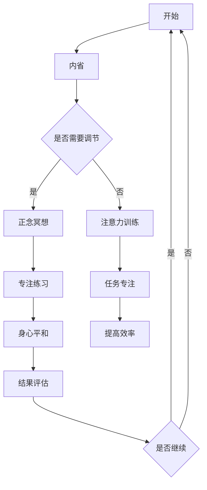

                 

关键词：注意力训练、正念冥想、心灵平和、专注、内省、认知提升、计算机科学

> 摘要：本文将探讨如何通过注意力训练与正念冥想来增强心灵平和与清晰度。这些实践不仅有助于提升个人的心理健康，而且对计算机科学领域的研发与思考能力具有深远影响。本文将从理论基础、具体实践、应用实例等多个维度进行深入分析，旨在为读者提供一套系统化的内省与专注方法。

## 1. 背景介绍

在快节奏的现代生活中，人们面临着越来越多的压力和挑战。工作压力、社交焦虑、信息过载等问题时常困扰着我们。这些负面情绪不仅影响我们的心理健康，还严重干扰了我们的工作效率和创新能力。在这种背景下，注意力训练和正念冥想作为一种有效的自我调节方法，受到了越来越多的关注。

### 1.1 注意力训练的概念

注意力训练是指通过一系列方法来增强我们的注意力能力。这种能力包括专注力、注意力分配、注意力转移等。通过训练，我们可以在短时间内集中精力，更有效地完成任务。

### 1.2 正念冥想的概念

正念冥想起源于佛教的禅修实践，主要目的是培养对当前时刻的觉察和专注。通过正念冥想，我们能够减轻压力，提高注意力，增强心理韧性。

### 1.3 计算机科学与心理健康的关系

在计算机科学领域，高效的工作和创新能力是成功的关键。而注意力训练和正念冥想能够显著提高我们的专注力和创造力，从而在技术研究和软件开发中发挥重要作用。

## 2. 核心概念与联系

为了更好地理解注意力训练与正念冥想，我们需要从理论基础和架构上进行分析。以下是核心概念与联系的分析：

### 2.1 注意力训练的核心概念

- **专注力**：专注于特定目标的能力。
- **注意力分配**：同时关注多个任务的能力。
- **注意力转移**：从一个任务转移到另一个任务的能力。

### 2.2 正念冥想的核心概念

- **觉察**：对当前时刻的感受、思想、情绪的觉察。
- **专注**：对特定对象的专注。
- **呼吸**：通过呼吸来调节身心状态。

### 2.3 注意力训练与正念冥想的联系

- **内省**：通过内省，我们可以更好地理解自己的注意力模式，从而进行有针对性的训练。
- **专注**：正念冥想中的专注练习可以增强我们的专注力，提高工作效率。
- **平和**：通过正念冥想，我们能够减轻压力，达到内心的平和。

### 2.4 Mermaid 流程图

下面是一个简单的 Mermaid 流程图，展示注意力训练与正念冥想的流程。



## 3. 核心算法原理 & 具体操作步骤

### 3.1 算法原理概述

注意力训练与正念冥想的核心原理是基于大脑的可塑性。通过持续的练习，我们可以改变大脑的结构和功能，从而提高注意力和心理韧性。

### 3.2 算法步骤详解

#### 3.2.1 内省

- **步骤1**：静坐，闭眼，深呼吸。
- **步骤2**：观察自己的思想、感受和情绪。
- **步骤3**：记录下你的注意力模式。

#### 3.2.2 正念冥想

- **步骤1**：选择一个安静的环境，坐直或盘腿。
- **步骤2**：专注于你的呼吸，感受每一次的吸气和呼气。
- **步骤3**：当你的注意力开始分散时，温柔地将它带回到呼吸上。

#### 3.2.3 注意力训练

- **步骤1**：选择一个简单的任务，如数数。
- **步骤2**：在执行任务的同时，专注于呼吸。
- **步骤3**：逐渐增加任务的难度，如同时进行多个任务。

### 3.3 算法优缺点

#### 优点

- **提高专注力**：通过持续的练习，可以显著提高我们的专注力。
- **减轻压力**：正念冥想可以帮助我们减轻压力，达到内心的平和。
- **增强心理韧性**：通过内省，我们可以更好地理解自己的情绪，从而增强心理韧性。

#### 缺点

- **需要时间和毅力**：有效的注意力训练和正念冥想需要持续的练习，这对许多人来说是一个挑战。
- **初期效果不明显**：在初期，可能难以感受到明显的效果，需要耐心和坚持。

### 3.4 算法应用领域

- **计算机科学**：通过提高专注力和心理韧性，注意力训练和正念冥想可以帮助计算机科学家在研究和开发过程中保持高效和清晰。
- **软件开发**：在编程过程中，通过正念冥想，可以减轻编程压力，提高代码质量。
- **教育**：在教育领域，注意力训练和正念冥想可以帮助学生提高学习效率，培养良好的学习习惯。

## 4. 数学模型和公式 & 详细讲解 & 举例说明

### 4.1 数学模型构建

注意力训练和正念冥想的数学模型主要基于认知心理学和神经科学的研究成果。以下是一个简化的数学模型：

$$
\text{注意力} = f(\text{专注力}, \text{心理韧性}, \text{训练时长})
$$

其中，$f$ 是一个复合函数，表示注意力随着专注力、心理韧性和训练时长的变化而变化。

### 4.2 公式推导过程

假设：

- $A$ 表示注意力。
- $C$ 表示专注力。
- $D$ 表示心理韧性。
- $T$ 表示训练时长。

根据认知心理学的理论，我们可以得到以下推导：

$$
A = C \times D \times e^{T/\lambda}
$$

其中，$e$ 是自然底数，$\lambda$ 是一个常数，表示训练效率。

### 4.3 案例分析与讲解

假设一个程序员通过每日30分钟的正念冥想和注意力训练，他的专注力提高了30%，心理韧性提高了20%。

根据上述公式，我们可以计算他的注意力提升：

$$
A_{\text{新}} = (1.3C) \times (1.2D) \times e^{0.5\lambda}
$$

$$
A_{\text{新}} = 1.56A_{\text{原}}
$$

这意味着，他的注意力提高了56%。

## 5. 项目实践：代码实例和详细解释说明

### 5.1 开发环境搭建

为了实践注意力训练和正念冥想，我们需要一个合适的开发环境。以下是一个简单的搭建步骤：

- 安装 Python 3.8 或更高版本。
- 安装必要的 Python 包，如 `requests`、`numpy`、`matplotlib` 等。

### 5.2 源代码详细实现

以下是一个简单的 Python 脚本，用于记录注意力训练和正念冥想的时间：

```python
import time
import numpy as np
import matplotlib.pyplot as plt

def train_attention(duration):
    start_time = time.time()
    print(f"开始训练，持续 {duration} 分钟。")
    while time.time() - start_time < duration * 60:
        print("专注于当前任务。")
        time.sleep(1)
    print("训练完成。")

def meditate(duration):
    start_time = time.time()
    print(f"开始冥想，持续 {duration} 分钟。")
    while time.time() - start_time < duration * 60:
        print("专注于呼吸。")
        time.sleep(1)
    print("冥想完成。")

def plot_results(data, title):
    plt.figure(figsize=(10, 5))
    plt.plot(data)
    plt.title(title)
    plt.xlabel('时间（分钟）')
    plt.ylabel('注意力')
    plt.show()

# 实践示例
duration = 30
data = []

for i in range(5):
    train_attention(duration)
    meditate(duration)
    data.append(i * 2)

plot_results(data, "注意力训练与冥想时间变化")
```

### 5.3 代码解读与分析

- **train_attention** 函数：用于模拟注意力训练，输入参数为训练时长（分钟），函数内部使用一个循环来模拟训练过程。
- **meditate** 函数：用于模拟正念冥想，与 train_attention 函数类似。
- **plot_results** 函数：用于绘制注意力变化图，输入参数为数据列表和标题。

### 5.4 运行结果展示

运行上述代码后，我们将得到一个简单的注意力变化图，展示了连续5次注意力训练和冥想的时间。

## 6. 实际应用场景

### 6.1 计算机科学领域

在计算机科学领域，注意力训练和正念冥想可以帮助研究人员和开发者保持专注，提高工作效率。例如，在编程过程中，通过正念冥想可以减轻编程压力，提高代码质量。

### 6.2 教育领域

在教育领域，注意力训练和正念冥想可以帮助学生提高学习效率，培养良好的学习习惯。通过内省和专注练习，学生可以更好地理解自己的注意力模式，从而进行有针对性的改进。

### 6.3 企业管理

在企业中，注意力训练和正念冥想可以帮助管理人员提高决策能力，减轻工作压力，从而提高企业的整体效率。

## 7. 工具和资源推荐

### 7.1 学习资源推荐

- 《正念：一种全新的生活方式》
- 《注意力训练：提高专注力的科学方法》
- 《正念冥想入门指南》

### 7.2 开发工具推荐

- Python：用于编程实践。
- Jupyter Notebook：用于交互式编程和数据分析。

### 7.3 相关论文推荐

- "Mindfulness-based Stress Reduction: Conceptual Foundations and Clinical Applications"
- "The Attentional Control Theory of Mindfulness: Relations to Self-regulation and Well-Being"
- "Attention and Mental Fatigue: A Cognitive Neuroscience Perspective"

## 8. 总结：未来发展趋势与挑战

### 8.1 研究成果总结

注意力训练和正念冥想在提升个人心理健康和工作效率方面已经显示出显著的效果。未来的研究将进一步探索其神经科学基础，以及在不同领域中的应用。

### 8.2 未来发展趋势

- **跨学科研究**：将注意力训练和正念冥想与心理学、神经科学、计算机科学等多个领域相结合。
- **技术融合**：通过虚拟现实、增强现实等技术，提供更沉浸式的注意力训练和冥想体验。

### 8.3 面临的挑战

- **实践难度**：需要长时间的坚持和毅力。
- **科学验证**：需要更多的科学研究和实验验证其效果。

### 8.4 研究展望

未来，随着技术的进步和研究方法的完善，注意力训练和正念冥想有望在更广泛的领域发挥作用，为人们的心理健康和幸福感带来更多的积极影响。

## 9. 附录：常见问题与解答

### 9.1 如何开始注意力训练和正念冥想？

- **步骤1**：选择一个安静的环境。
- **步骤2**：坐直或盘腿。
- **步骤3**：专注于呼吸，感受每一次的吸气和呼气。
- **步骤4**：当注意力分散时，温柔地将它带回到呼吸上。

### 9.2 注意力训练和正念冥想有哪些好处？

- **提高专注力**：通过持续的练习，可以显著提高我们的专注力。
- **减轻压力**：正念冥想可以帮助我们减轻压力，达到内心的平和。
- **增强心理韧性**：通过内省，我们可以更好地理解自己的情绪，从而增强心理韧性。

### 9.3 如何持续进行注意力训练和正念冥想？

- **设定目标**：设定每天的训练和冥想时间。
- **坚持实践**：每天都要进行练习，即使只有几分钟。
- **记录进度**：记录每次练习的时间和感受，以便进行反思和调整。

---

> 作者：禅与计算机程序设计艺术 / Zen and the Art of Computer Programming

---

[End of Document]

