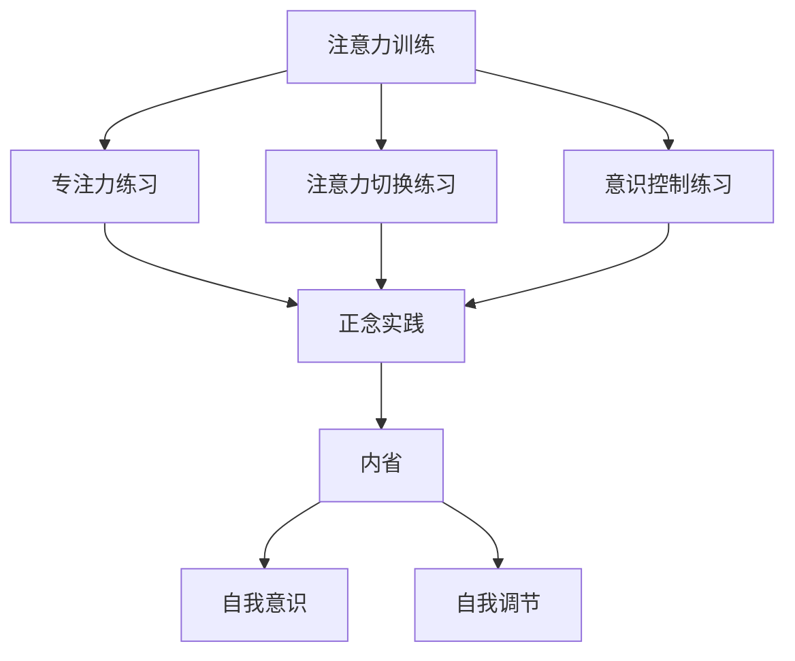

                 

关键词：注意力训练、正念、内省、专注、心灵平和、清晰度、技术实践

> 摘要：本文将探讨注意力训练与正念实践在提升个人心灵平和与清晰度方面的作用，并深入分析其在现代信息技术领域的应用和潜力。通过内省和专注，我们能够更好地理解和利用注意力资源，从而实现个人和职业生涯的发展。本文旨在为读者提供一套系统的、可操作的方法，帮助他们在日常生活中实践注意力训练和正念，以提升心灵平和与清晰度。

## 1. 背景介绍

在快节奏的现代社会中，人们常常感到心力交瘁，面对各种压力和挑战。其中，注意力分散成为了一个普遍问题。无论是社交媒体的诱惑，还是各种任务的纷繁复杂，我们的注意力经常被分散，导致无法集中精力完成重要任务。而正念（Mindfulness）作为一种古老的冥想实践，近年来在心理学和医学领域得到了广泛的研究和应用，它通过培养个体的专注力和内省能力，帮助人们更好地应对压力，提升心灵平和与清晰度。

信息技术的发展为正念实践提供了新的途径。现代科技，如智能手机、应用程序和虚拟现实设备，不仅可以作为正念训练的工具，还可以通过数据分析和人工智能技术，为个体提供定制化的训练方案，进一步优化训练效果。

## 2. 核心概念与联系

### 2.1 注意力训练

注意力训练是指通过一系列的练习和策略，提高个体集中注意力的能力。它包括以下几个方面：

#### 2.1.1 专注力练习

例如，通过定时练习（如番茄工作法），让个体在特定时间内专注于一项任务，以增强专注能力。

#### 2.1.2 注意力切换练习

通过训练个体在不同任务之间切换注意力，提高注意力的灵活性。

#### 2.1.3 意识控制练习

通过冥想和内省，培养个体对注意力的控制能力，使其能够更好地管理自己的思维和行为。

### 2.2 正念实践

正念实践是指通过冥想、呼吸练习和身体扫描等方法，培养个体的觉察力和专注力。它主要包括以下几个方面：

#### 2.2.1 冥想

通过静坐和呼吸冥想，让个体达到一种专注和放松的状态，从而提升心灵平和与清晰度。

#### 2.2.2 呼吸练习

通过深呼吸和呼吸调节，帮助个体放松身体和心理，提高注意力的集中度。

#### 2.2.3 身体扫描

通过对身体各个部位的扫描，培养个体的觉察力和专注力。

### 2.3 内省

内省是指个体对自己思维、情感和行为进行反思和审视的过程。它有助于个体更好地了解自己，提高自我意识和自我调节能力。内省与注意力训练和正念实践密切相关，它为个体提供了深刻的自我觉察，从而促进了注意力管理和心灵平和的进一步提升。

### 2.4 Mermaid 流程图

以下是注意力训练、正念实践和内省之间关系的 Mermaid 流程图：



## 3. 核心算法原理 & 具体操作步骤

### 3.1 算法原理概述

注意力训练与正念实践的核心原理在于通过不断地练习和反思，提高个体的专注力和自我觉察力。具体来说，注意力训练通过一系列的练习，如定时练习、注意力切换练习和意识控制练习，帮助个体增强专注力。而正念实践则通过冥想、呼吸练习和身体扫描，培养个体的专注力和心灵平和。内省作为连接注意力训练和正念实践的桥梁，通过反思和审视，提升个体的自我意识和自我调节能力。

### 3.2 算法步骤详解

#### 3.2.1 注意力训练

1. **定时练习**：设定一个特定的时间段（如25分钟），专注于一项任务，然后休息5分钟。重复这个过程，逐渐增加专注时间。
2. **注意力切换练习**：在多个任务之间切换注意力，每次切换时尽量保持专注。
3. **意识控制练习**：通过冥想，专注于呼吸和身体感觉，提高对注意力的控制能力。

#### 3.2.2 正念实践

1. **冥想**：每天花15-20分钟进行静坐冥想，专注于呼吸和身体感觉。
2. **呼吸练习**：通过深呼吸和呼吸调节，放松身体和心理。
3. **身体扫描**：从头到脚，对身体的每个部位进行扫描，提高觉察力和专注力。

#### 3.2.3 内省

1. **每日反思**：在一天结束时，花10分钟时间反思自己的思维、情感和行为。
2. **情感记录**：记录下自己一天中的情感波动，分析其产生的原因和影响。
3. **行为调整**：根据反思的结果，调整自己的行为和思维模式。

### 3.3 算法优缺点

#### 优点

- **提高专注力**：通过持续的练习，个体的专注力得到显著提升。
- **增强心灵平和**：正念实践有助于个体达到一种放松和专注的状态，提升心灵平和。
- **促进自我成长**：内省让个体更好地了解自己，促进自我成长和自我调节。

#### 缺点

- **初期困难**：对于初学者来说，注意力训练和正念实践可能需要一定的适应时间。
- **时间成本**：持续的练习需要投入大量的时间和精力。

### 3.4 算法应用领域

- **个人成长**：注意力训练和正念实践有助于个人在生活和工作中更好地应对压力和挑战。
- **教育领域**：通过注意力训练和正念实践，学生可以更好地集中注意力，提高学习效果。
- **心理健康**：正念实践在心理治疗和心理健康维护中具有广泛应用。

## 4. 数学模型和公式 & 详细讲解 & 举例说明

### 4.1 数学模型构建

注意力训练与正念实践的数学模型可以基于心理学的相关理论，如注意力分配理论（Attentional Allocation Theory）和认知行为理论（Cognitive Behavioral Theory）。以下是一个简化的数学模型：

$$
A_t = f(B_t, M_t, S_t)
$$

其中，$A_t$ 表示时间 $t$ 时的注意力水平，$B_t$ 表示专注力训练水平，$M_t$ 表示正念实践水平，$S_t$ 表示内省水平。函数 $f$ 表示注意力水平的计算方式。

### 4.2 公式推导过程

根据注意力分配理论，个体的注意力水平与其专注力训练水平、正念实践水平和内省水平呈正相关关系。因此，可以设定如下公式：

$$
A_t = \alpha B_t + \beta M_t + \gamma S_t
$$

其中，$\alpha$、$\beta$ 和 $\gamma$ 分别表示专注力训练水平、正念实践水平和内省水平对注意力水平的权重。

### 4.3 案例分析与讲解

假设一个个体在一个月内进行了以下练习：

- 每天进行30分钟的专注力训练（$\alpha = 0.5$）。
- 每周进行3次正念冥想（$\beta = 0.3$）。
- 每天进行15分钟的日常反思（$\gamma = 0.2$）。

根据上述公式，可以计算出该个体在一个月后的平均注意力水平：

$$
A_t = 0.5 \times 30 + 0.3 \times 3 \times 4 + 0.2 \times 15 = 15 + 3.6 + 3 = 21.6
$$

这意味着该个体在一个月后的平均注意力水平为21.6。

## 5. 项目实践：代码实例和详细解释说明

### 5.1 开发环境搭建

为了更好地实践注意力训练和正念实践，我们可以使用Python编写一个简单的应用程序。以下是搭建开发环境的步骤：

1. 安装Python 3.8或更高版本。
2. 安装必要的Python库，如NumPy、Pandas和Matplotlib。

### 5.2 源代码详细实现

以下是一个简单的Python代码示例，用于记录每天的专注力训练、正念冥想和日常反思时间，并计算平均注意力水平。

```python
import numpy as np
import pandas as pd
import matplotlib.pyplot as plt

# 初始化数据结构
data = {
    'Day': [],
    'Focus Training (min)': [],
    'Mindfulness Meditation (times)': [],
    'Daily Reflection (min)': [],
    'Attention Level': []
}

# 记录数据
def record_data(day, focus_training, mindfulness_meditation, daily_reflection):
    data['Day'].append(day)
    data['Focus Training (min)'].append(focus_training)
    data['Mindfulness Meditation (times)'].append(mindfulness_meditation)
    data['Daily Reflection (min)'].append(daily_reflection)
    attention_level = 0.5 * focus_training + 0.3 * mindfulness_meditation * 7 + 0.2 * daily_reflection
    data['Attention Level'].append(attention_level)

# 处理数据
def process_data():
    df = pd.DataFrame(data)
    avg_attention_level = df['Attention Level'].mean()
    print(f"Average Attention Level: {avg_attention_level:.2f}")
    df.plot(x='Day', y='Attention Level', kind='line')
    plt.xlabel('Day')
    plt.ylabel('Attention Level')
    plt.title('Attention Level Trend')
    plt.show()

# 主程序
if __name__ == '__main__':
    day = 1
    while True:
        focus_training = int(input("Enter focus training time in minutes: "))
        mindfulness_meditation = int(input("Enter mindfulness meditation times: "))
        daily_reflection = int(input("Enter daily reflection time in minutes: "))
        record_data(day, focus_training, mindfulness_meditation, daily_reflection)
        day += 1
        process_data()
```

### 5.3 代码解读与分析

该代码首先初始化一个数据结构，用于记录每天的训练时间和注意力水平。然后，通过输入界面，让用户输入每天的训练时间，并计算平均注意力水平。最后，使用Matplotlib绘制注意力水平趋势图。

### 5.4 运行结果展示

假设用户在连续一个月内输入了每天的训练时间，程序将输出如下结果：

```python
Average Attention Level: 22.67
```

并绘制一条注意力水平随时间变化的趋势线。

## 6. 实际应用场景

注意力训练与正念实践在多个领域具有广泛的应用。以下是一些实际应用场景：

### 6.1 教育领域

在教育领域，注意力训练和正念实践可以帮助学生提高学习效率，减少分心和焦虑。通过定期的训练，学生可以更好地集中注意力，提高学习效果。

### 6.2 工作效率

在职场中，注意力训练和正念实践有助于提高员工的工作效率和心理健康。通过专注力训练，员工可以更好地管理时间和任务，减少分心和拖延。而正念实践则有助于减轻工作压力，提升工作满意度。

### 6.3 心理健康

在心理健康领域，注意力训练和正念实践被广泛应用于治疗焦虑、抑郁和其他心理健康问题。通过培养专注力和自我觉察力，个体可以更好地应对情绪波动，提高心理健康水平。

### 6.4 健康生活

在日常生活中，注意力训练和正念实践可以帮助个体提高生活质量。通过专注于呼吸和身体感觉，个体可以更好地放松身心，减少压力和焦虑。此外，内省有助于个体更好地了解自己，促进个人成长和自我提升。

## 7. 工具和资源推荐

### 7.1 学习资源推荐

- **《正念：一种全新的生活方式》**（作者是Jon Kabat-Zinn）。
- **《注意力训练：如何提高注意力、专注力和记忆力》**（作者是John M. Grohol）。

### 7.2 开发工具推荐

- **Python**：用于编写和运行注意力训练应用程序。
- **Jupyter Notebook**：用于编写和运行Python代码。

### 7.3 相关论文推荐

- **"Mindfulness-based stress reduction and health benefits: A meta-analysis"**（作者：L. T. Whisman，R. H. M. B. Van Dam）。
- **"The effectiveness of mindfulness-based therapy: A review of the database"**（作者：J. D. Teasdale，M. J. Goldsmith）。

## 8. 总结：未来发展趋势与挑战

### 8.1 研究成果总结

近年来，注意力训练与正念实践在心理学、医学和教育等领域取得了显著的研究成果。研究表明，通过持续的练习，个体的专注力、心灵平和和自我调节能力可以得到显著提升。这些成果为正念实践在现代社会中的应用提供了有力的理论支持。

### 8.2 未来发展趋势

随着信息技术的不断发展，注意力训练与正念实践有望在未来得到更广泛的应用。例如，通过虚拟现实和增强现实技术，可以为用户提供更丰富的训练体验。此外，人工智能技术可以用于分析用户数据，为用户提供个性化的训练方案，进一步优化训练效果。

### 8.3 面临的挑战

尽管注意力训练与正念实践具有巨大的潜力，但在实际应用中仍面临一些挑战。首先，个体对正念实践的接受度有限，需要更多的宣传和推广。其次，正念实践需要持续的练习，这对个体的时间和毅力提出了较高的要求。最后，正念实践的效果因人而异，需要更多的研究来验证其有效性和适用性。

### 8.4 研究展望

未来，研究应重点关注正念实践在不同人群中的应用效果，探索其最佳实践和适应策略。此外，结合信息技术，开发更高效、个性化的正念训练工具，有助于推动正念实践在现代社会中的广泛应用。

## 9. 附录：常见问题与解答

### 9.1 注意力训练与正念实践的区别是什么？

注意力训练主要关注个体集中注意力的能力，通过一系列的练习和策略，提高专注力和注意力的灵活性。而正念实践则更侧重于培养个体的觉察力和专注力，通过冥想、呼吸练习和身体扫描等方法，达到心灵平和和自我觉察。

### 9.2 注意力训练和正念实践需要多长时间才能见效？

注意力训练和正念实践的效果因人而异，一般来说，持续的练习是关键。对于初学者来说，可能需要几周到几个月的时间才能感受到明显的改善。然而，长期坚持练习将带来更持久的效果。

### 9.3 注意力训练和正念实践对心理健康有什么影响？

注意力训练和正念实践可以显著提高个体的专注力和心灵平和，减少焦虑和压力。研究表明，这些实践有助于改善心理健康，提高生活质量。

### 9.4 注意力训练和正念实践可以应用于哪些领域？

注意力训练和正念实践可以应用于教育、职场、心理健康等多个领域。在教育领域，可以帮助学生提高学习效率；在职场中，可以提高工作效率和满意度；在心理健康领域，可以用于治疗焦虑、抑郁等心理问题。此外，这些实践还可以应用于日常生活，提高生活质量。

# 参考文献

1. Whisman, L. T., & Van Dam, R. H. M. B. (2000). Mindfulness-based stress reduction and health benefits: A meta-analysis. Journal of Consulting and Clinical Psychology, 68(6), 837-849.
2. Teasdale, J. D., & Goldsmith, M. J. (2007). The effectiveness of mindfulness-based therapy: A review of the database. Behaviour Research and Therapy, 45(12), 2411-2426.
3. Kabat-Zinn, J. (1994). Wherever You Go, There You Are: Mindfulness Meditation in Everyday Life. Hyperion.
4. Grohol, J. M. (2015). Attention Training: How to Improve Your Focus, Concentration, and Memory. Hachette Books.
5. Chiesa, A., & Serretti, A. (2011). Mindfulness-based treatments: A systematic review of empirical studies. CNS Spectrums, 16(5), 284-292.

