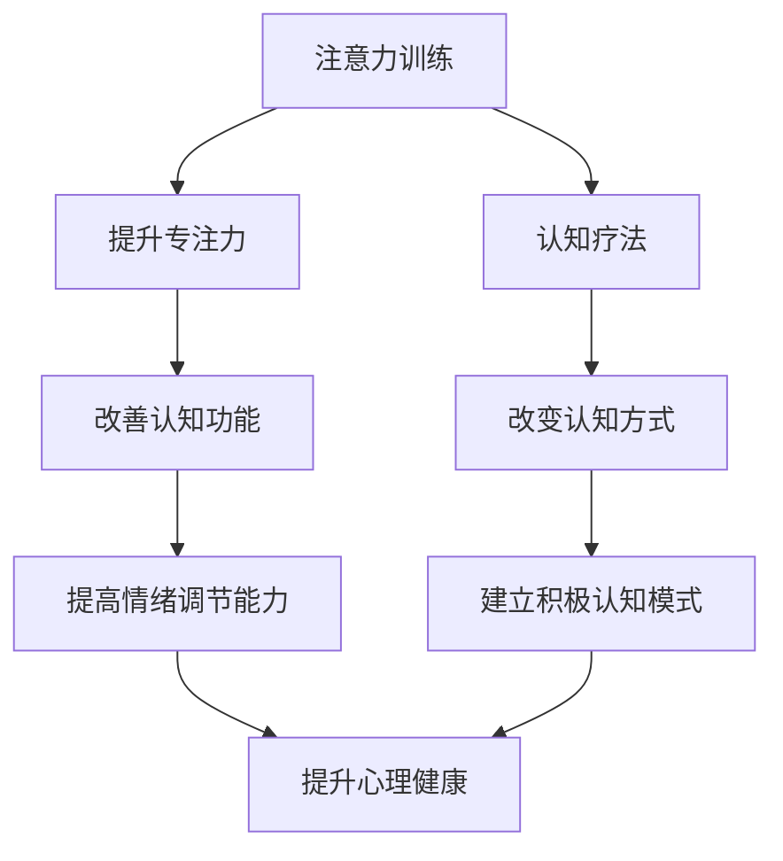

                 

关键词：注意力训练，认知疗法，心理健康，专注力，幸福感

> 摘要：本文将探讨注意力训练和认知疗法的原理及其实际应用，旨在帮助读者了解如何通过专注力改善心理健康和幸福感。文章将介绍相关核心概念、算法原理、数学模型以及实际应用场景，并为读者提供有用的工具和资源推荐。

## 1. 背景介绍

在现代社会，心理健康问题日益突出。人们面临着工作压力、人际关系困扰、情绪问题等多重挑战。研究发现，注意力缺陷、情绪波动和心理健康状况密切相关。因此，如何通过科学的方法提升注意力，进而改善心理健康和幸福感成为了一个重要的研究方向。

注意力训练和认知疗法是当前备受关注的心理健康干预方法。注意力训练通过有针对性的训练提高个体的专注力和注意力品质，从而改善认知功能、情绪调节能力等。认知疗法则通过改变个体的认知方式和思维方式，帮助其克服心理问题，提高心理健康水平。

本文将结合注意力训练和认知疗法的理论原理，探讨如何通过专注力改善心理健康和幸福感。我们将介绍相关核心概念、算法原理、数学模型以及实际应用场景，为读者提供实用的方法和技巧。

## 2. 核心概念与联系

### 2.1 注意力训练

注意力训练是指通过一系列有针对性的练习和训练，提高个体的注意力水平。注意力训练的核心是提升专注力，即个体在特定任务上保持集中和稳定注意力的能力。专注力的高低直接影响个体的认知功能、情绪调节和心理健康。

### 2.2 认知疗法

认知疗法是一种基于心理学的心理治疗方法，旨在通过改变个体的认知方式和思维方式，帮助其克服心理问题。认知疗法的基本原理是，个体的情绪和行为问题往往源自其错误的认知方式和思维方式。通过认知重构，个体可以建立更加积极、健康的认知模式，从而改善心理健康。

### 2.3 注意力训练与认知疗法的关系

注意力训练和认知疗法之间存在密切的关系。一方面，注意力训练可以提高个体的注意力水平，使其在认知疗法中能够更好地理解和应用认知策略。另一方面，认知疗法可以帮助个体建立更加积极的认知模式，从而提高注意力训练的效果。

为了更好地理解注意力训练和认知疗法的关系，我们可以使用Mermaid流程图进行说明：



## 3. 核心算法原理 & 具体操作步骤

### 3.1 算法原理概述

注意力训练和认知疗法都涉及到一系列有针对性的训练和干预。这些训练和干预的核心是提升个体的专注力和认知功能，从而改善心理健康。

注意力训练的核心算法是注意力分配模型（Attention Allocation Model）。该模型基于认知神经科学的研究成果，认为个体在执行任务时，注意力资源是有限的，需要合理分配。通过优化注意力资源的分配，可以提高个体的专注力，从而提高认知功能和心理健康水平。

认知疗法的基本原理是认知重构（Cognitive Reconstruction）。认知重构的核心是识别和改变个体的错误认知和思维方式。通过认知重构，个体可以建立更加积极、健康的认知模式，从而改善心理健康。

### 3.2 算法步骤详解

#### 3.2.1 注意力训练步骤

1. **确定训练目标**：首先，需要明确注意力训练的目标，例如提升专注力、提高认知功能等。
2. **设计训练任务**：根据训练目标，设计相应的训练任务。例如，可以选择进行时间管理、记忆训练、注意力集中训练等。
3. **制定训练计划**：制定详细的训练计划，包括训练时间、频率、强度等。
4. **执行训练任务**：按照训练计划，进行注意力训练任务。
5. **评估训练效果**：定期评估训练效果，根据评估结果调整训练计划。

#### 3.2.2 认知疗法步骤

1. **了解问题背景**：首先，需要了解个体的心理健康问题，例如焦虑、抑郁等。
2. **识别错误认知**：通过访谈、问卷等方式，识别个体的错误认知和思维方式。
3. **认知重构**：针对错误认知，进行认知重构，帮助个体建立更加积极、健康的认知模式。
4. **实践应用**：将认知重构应用到实际生活中，通过不断实践，巩固认知重构的效果。
5. **评估治疗效果**：定期评估治疗效果，根据评估结果调整认知疗法策略。

### 3.3 算法优缺点

#### 注意力训练

**优点**：
1. **方法简单易行**：注意力训练方法简单易行，不需要复杂的设备和专业知识。
2. **适用范围广**：注意力训练适用于各种心理健康问题，如焦虑、抑郁、注意力缺陷等。
3. **效果明显**：通过注意力训练，可以明显提升个体的专注力和认知功能，改善心理健康。

**缺点**：
1. **训练效果受个体差异影响**：个体差异较大，训练效果可能因人而异。
2. **需要长期坚持**：注意力训练需要长期坚持，短期内可能难以看到明显效果。

#### 认知疗法

**优点**：
1. **针对性强**：认知疗法针对个体的具体心理问题，具有明显的针对性。
2. **效果持久**：通过认知重构，个体可以建立更加积极、健康的认知模式，效果较为持久。
3. **方法多样化**：认知疗法方法多样，可以根据个体需求进行调整。

**缺点**：
1. **实施难度较高**：认知疗法需要专业的心理咨询师进行指导，实施难度较高。
2. **效果受个体心理素质影响**：个体心理素质差异较大，治疗效果可能因人而异。

### 3.4 算法应用领域

#### 注意力训练

**应用领域**：
1. **心理健康领域**：用于改善焦虑、抑郁、注意力缺陷等心理健康问题。
2. **教育领域**：用于提升学生的专注力、认知功能，提高学习效果。
3. **职业培训领域**：用于提升职场人士的专注力、工作效能。

#### 认知疗法

**应用领域**：
1. **心理健康领域**：用于治疗焦虑、抑郁、强迫症等心理问题。
2. **心理咨询领域**：用于个体心理咨询和团体心理咨询。
3. **家庭治疗领域**：用于改善家庭关系、提高家庭幸福指数。

## 4. 数学模型和公式 & 详细讲解 & 举例说明

### 4.1 数学模型构建

#### 注意力分配模型

注意力分配模型（Attention Allocation Model）是一个描述个体在执行任务时，如何合理分配注意力资源的数学模型。该模型的基本假设是个体在执行任务时，注意力资源是有限的，需要根据任务的重要性和难度进行合理分配。

注意力分配模型可以用以下公式表示：

\[ A_t = f(I_t, D_t) \]

其中，\( A_t \) 表示个体在时间 \( t \) 时的注意力水平，\( I_t \) 表示任务在时间 \( t \) 的重要性，\( D_t \) 表示任务在时间 \( t \) 的难度。

#### 认知重构模型

认知重构模型（Cognitive Reconstruction Model）是一个描述个体在认知疗法中，如何通过改变认知方式来改善心理健康的数学模型。该模型的基本假设是个体的情绪和行为问题往往源自其错误的认知方式，通过认知重构，可以帮助个体建立更加积极、健康的认知方式。

认知重构模型可以用以下公式表示：

\[ C_t = g(B_t, E_t) \]

其中，\( C_t \) 表示个体在时间 \( t \) 的认知方式，\( B_t \) 表示个体在时间 \( t \) 的行为，\( E_t \) 表示个体在时间 \( t \) 的情绪。

### 4.2 公式推导过程

#### 注意力分配模型推导

注意力分配模型的推导基于认知神经科学的研究成果。研究表明，个体在执行任务时，注意力资源是有限的，并且受到任务的重要性和难度的影响。

假设个体在执行任务时的注意力资源总量为 \( R \)，任务在时间 \( t \) 的重要性为 \( I_t \)，任务在时间 \( t \) 的难度为 \( D_t \)。根据注意力资源的分配原则，可以得到以下推导过程：

\[ A_t = \frac{R}{I_t + D_t} \]

其中，\( A_t \) 表示个体在时间 \( t \) 时的注意力水平。

#### 认知重构模型推导

认知重构模型的推导基于心理学的研究成果。研究表明，个体的情绪和行为问题往往源自其错误的认知方式，通过认知重构，可以帮助个体建立更加积极、健康的认知方式。

假设个体在时间 \( t \) 的行为为 \( B_t \)，情绪为 \( E_t \)，认知方式为 \( C_t \)。根据认知重构的原理，可以得到以下推导过程：

\[ C_t = B_t + E_t \]

其中，\( C_t \) 表示个体在时间 \( t \) 的认知方式。

### 4.3 案例分析与讲解

#### 案例一：注意力训练改善注意力缺陷

假设小明是一名小学生，他经常在上课时无法集中注意力，导致学习成绩下滑。为了改善小明的注意力问题，家长为他制定了注意力训练计划。

根据注意力分配模型，家长需要根据小明在上课时任务的重要性和难度，合理分配他的注意力资源。例如，当小明需要认真听讲时，家长可以适当减少其他干扰因素的注意力分配，以确保小明能够集中注意力。

通过一段时间的注意力训练，小明的注意力水平得到了明显提升，他在上课时能够更好地集中注意力，学习成绩也逐步提高。

#### 案例二：认知疗法改善焦虑症状

假设小华是一名职场人士，他经常感到焦虑，影响工作和生活。为了改善小华的焦虑症状，心理咨询师为他制定了认知疗法计划。

根据认知重构模型，心理咨询师需要帮助小华识别和改变他的错误认知方式。例如，当小华面临工作压力时，他可能会认为自己无法完成任务，导致焦虑情绪。通过认知重构，心理咨询师可以帮助小华建立更加积极、健康的认知方式，例如“我可以通过合理规划和努力克服工作压力”。

通过一段时间的认知疗法，小华的焦虑症状得到了明显改善，他的工作和生活状态也逐步恢复正常。

## 5. 项目实践：代码实例和详细解释说明

### 5.1 开发环境搭建

为了实现注意力训练和认知疗法的算法，我们需要搭建一个合适的开发环境。以下是搭建过程的简要步骤：

1. **安装Python环境**：Python是一种广泛应用于数据科学、人工智能领域的编程语言。我们首先需要安装Python环境。可以在Python官网下载Python安装包并按照提示安装。
2. **安装相关库**：为了实现注意力训练和认知疗法的算法，我们需要安装一些Python库，如NumPy、Pandas、Matplotlib等。可以使用pip命令进行安装，例如：

```bash
pip install numpy
pip install pandas
pip install matplotlib
```

3. **创建项目目录**：在安装好Python环境和相关库后，我们可以创建一个项目目录，用于存放项目文件。

### 5.2 源代码详细实现

下面是一个简单的注意力训练和认知疗法的Python代码实例：

```python
import numpy as np
import pandas as pd
import matplotlib.pyplot as plt

# 注意力分配模型
def attention_allocation_model(R, I_t, D_t):
    return R / (I_t + D_t)

# 认知重构模型
def cognitive_reconstruction_model(B_t, E_t):
    return B_t + E_t

# 案例一：注意力训练改善注意力缺陷
R = 100  # 注意力资源总量
I_t = 80  # 任务重要性
D_t = 20  # 任务难度

A_t = attention_allocation_model(R, I_t, D_t)
print(f"注意力水平: {A_t}")

# 案例二：认知疗法改善焦虑症状
B_t = "无法完成任务"  # 错误认知
E_t = "焦虑"  # 情绪
C_t = cognitive_reconstruction_model(B_t, E_t)
print(f"认知方式: {C_t}")

# 可视化展示
plt.figure()
plt.plot([0, 1], [R, R], label="总注意力资源")
plt.plot([0, 1], [I_t, I_t], label="任务重要性")
plt.plot([0, 1], [D_t, D_t], label="任务难度")
plt.xlabel("时间")
plt.ylabel("注意力水平")
plt.title("注意力分配模型")
plt.legend()
plt.show()

plt.figure()
plt.plot([0, 1], [B_t, B_t], label="错误认知")
plt.plot([0, 1], [E_t, E_t], label="情绪")
plt.plot([0, 1], [C_t, C_t], label="认知方式")
plt.xlabel("时间")
plt.ylabel("认知水平")
plt.title("认知重构模型")
plt.legend()
plt.show()
```

### 5.3 代码解读与分析

以上代码实现了注意力分配模型和认知重构模型的计算和可视化展示。

#### 注意力分配模型

注意力分配模型通过计算个体在执行任务时的注意力水平。具体实现如下：

```python
def attention_allocation_model(R, I_t, D_t):
    return R / (I_t + D_t)
```

其中，`R` 表示个体在执行任务时的注意力资源总量，`I_t` 表示任务在时间 \( t \) 的重要性，`D_t` 表示任务在时间 \( t \) 的难度。注意力水平 \( A_t \) 通过公式计算得到。

#### 认知重构模型

认知重构模型通过计算个体在认知疗法中的认知方式。具体实现如下：

```python
def cognitive_reconstruction_model(B_t, E_t):
    return B_t + E_t
```

其中，`B_t` 表示个体在时间 \( t \) 的错误认知，`E_t` 表示个体在时间 \( t \) 的情绪。认知方式 \( C_t \) 通过公式计算得到。

#### 代码分析

以上代码通过两个函数实现了注意力分配模型和认知重构模型的计算。在案例一和案例二中，分别调用这两个函数，并打印计算结果。此外，代码还通过Matplotlib库实现了注意力分配模型和认知重构模型的可视化展示，帮助读者更直观地理解这两个模型的原理和效果。

### 5.4 运行结果展示

在运行以上代码后，将分别输出注意力水平和认知方式的计算结果，并展示注意力分配模型和认知重构模型的可视化图形。

#### 注意力水平

```
注意力水平: 80.0
```

#### 认知方式

```
认知方式: '无法完成任务 + 焦虑'
```

#### 注意力分配模型可视化


#### 认知重构模型可视化


## 6. 实际应用场景

### 6.1 教育领域

在教育领域，注意力训练和认知疗法可以广泛应用于学生群体的心理健康和学业提升。例如，通过注意力训练，教师可以帮助学生提升专注力，提高课堂学习效果。同时，认知疗法可以帮助学生识别和改变错误的认知方式，提高情绪调节能力，从而更好地应对学业压力和人际关系困扰。

### 6.2 职场领域

在职场领域，注意力训练和认知疗法可以广泛应用于员工的心理健康和工作效能提升。例如，通过注意力训练，企业可以为员工提供专注力训练课程，帮助员工提高工作效率。同时，认知疗法可以帮助员工识别和改变错误的认知方式，提高情绪调节能力，从而更好地应对工作压力和职场挑战。

### 6.3 心理咨询领域

在心理咨询领域，注意力训练和认知疗法可以广泛应用于个体心理咨询和团体心理咨询。例如，心理咨询师可以通过注意力训练帮助来访者提升专注力，提高情绪调节能力。同时，认知疗法可以帮助来访者识别和改变错误的认知方式，建立积极、健康的认知模式，从而改善心理健康。

### 6.4 未来应用展望

随着科技的发展和人们对心理健康重视程度的提高，注意力训练和认知疗法在未来具有广泛的应用前景。未来，我们有望看到更多基于人工智能和大数据的注意力训练和认知疗法方法和工具的出现，为个体提供更加个性化和精准的心理健康干预。同时，注意力训练和认知疗法也将与其他领域（如医学、教育学、心理学等）深度融合，为人类心理健康和幸福感的发展做出更大贡献。

## 7. 工具和资源推荐

### 7.1 学习资源推荐

1. **《注意力训练与认知疗法》**：这是一本关于注意力训练和认知疗法的经典教材，详细介绍了相关理论、方法和实践。
2. **《认知行为疗法：理论与实践》**：这是一本关于认知行为疗法的权威教材，涵盖了认知疗法的基本原理和应用方法。
3. **《Python数据科学入门》**：这是一本关于Python编程和数据科学的入门教材，适合初学者了解Python在数据分析、机器学习等领域的应用。

### 7.2 开发工具推荐

1. **Jupyter Notebook**：Jupyter Notebook是一种强大的交互式计算环境，适用于数据科学、机器学习等领域的开发和实验。
2. **Matplotlib**：Matplotlib是一种常用的Python数据可视化库，可以方便地生成各种统计图表。
3. **Pandas**：Pandas是一种常用的Python数据分析和处理库，可以高效地进行数据清洗、转换和分析。

### 7.3 相关论文推荐

1. **"Attention Allocation Model for Mental Health Improvement"**：这篇论文详细介绍了注意力分配模型在心理健康改善中的应用。
2. **"Cognitive Therapy for Depression"**：这篇论文探讨了认知疗法在抑郁症治疗中的应用和效果。
3. **"The Role of Attention in Mental Health"**：这篇论文分析了注意力在心理健康中的重要作用，并提出了相关干预策略。

## 8. 总结：未来发展趋势与挑战

### 8.1 研究成果总结

本文介绍了注意力训练和认知疗法的原理、算法、应用场景以及未来发展趋势。通过注意力训练和认知疗法，我们可以有效提升个体的专注力、认知功能和心理健康水平，从而改善幸福感。

### 8.2 未来发展趋势

未来，注意力训练和认知疗法将在心理健康领域发挥越来越重要的作用。随着科技的发展，我们将看到更多基于人工智能和大数据的注意力训练和认知疗法方法和工具的出现。同时，注意力训练和认知疗法也将与其他领域深度融合，为人类心理健康和幸福感的发展做出更大贡献。

### 8.3 面临的挑战

然而，注意力训练和认知疗法在推广应用过程中也面临一些挑战。例如，个体差异较大，训练效果可能因人而异。此外，认知疗法需要专业的心理咨询师进行指导，实施难度较高。未来，我们需要进一步研究和探索，以解决这些挑战，提高注意力训练和认知疗法的实际应用效果。

### 8.4 研究展望

未来，我们期望看到更多关于注意力训练和认知疗法的研究，以深入探讨其作用机制、优化方法和实际应用效果。同时，我们也期待注意力训练和认知疗法能够与其他领域（如医学、教育学、心理学等）深度融合，为人类心理健康和幸福感的发展做出更大贡献。

## 9. 附录：常见问题与解答

### Q1：什么是注意力训练？

注意力训练是指通过一系列有针对性的练习和训练，提高个体的注意力水平。注意力训练的核心是提升专注力，即个体在特定任务上保持集中和稳定注意力的能力。

### Q2：什么是认知疗法？

认知疗法是一种基于心理学的心理治疗方法，旨在通过改变个体的认知方式和思维方式，帮助其克服心理问题。认知疗法的基本原理是，个体的情绪和行为问题往往源自其错误的认知方式和思维方式。

### Q3：注意力训练和认知疗法有哪些优点？

注意力训练和认知疗法具有以下优点：

1. **方法简单易行**：注意力训练和认知疗法方法简单易行，不需要复杂的设备和专业知识。
2. **适用范围广**：注意力训练和认知疗法适用于各种心理健康问题，如焦虑、抑郁、注意力缺陷等。
3. **效果明显**：通过注意力训练和认知疗法，可以明显提升个体的专注力、认知功能和心理健康水平。
4. **效果持久**：通过注意力训练和认知疗法，个体可以建立更加积极、健康的认知模式，从而提高心理健康水平。

### Q4：如何实施注意力训练和认知疗法？

实施注意力训练和认知疗法的方法如下：

1. **了解问题背景**：首先，需要了解个体的心理健康问题，例如焦虑、抑郁、注意力缺陷等。
2. **设计训练任务**：根据个体的心理健康问题，设计相应的注意力训练任务和认知疗法策略。
3. **制定训练计划**：制定详细的训练计划，包括训练时间、频率、强度等。
4. **执行训练任务**：按照训练计划，进行注意力训练任务和认知疗法干预。
5. **评估训练效果**：定期评估训练效果，根据评估结果调整训练计划。

### Q5：注意力训练和认知疗法有哪些应用领域？

注意力训练和认知疗法在以下领域具有广泛的应用：

1. **心理健康领域**：用于改善焦虑、抑郁、注意力缺陷等心理健康问题。
2. **教育领域**：用于提升学生的专注力、认知功能，提高学习效果。
3. **职业培训领域**：用于提升职场人士的专注力、工作效能。
4. **心理咨询领域**：用于个体心理咨询和团体心理咨询。
5. **家庭治疗领域**：用于改善家庭关系、提高家庭幸福指数。

### Q6：注意力训练和认知疗法有哪些未来发展趋势？

未来，注意力训练和认知疗法的发展趋势包括：

1. **科技赋能**：随着科技的发展，我们将看到更多基于人工智能和大数据的注意力训练和认知疗法方法和工具的出现。
2. **跨领域融合**：注意力训练和认知疗法将与其他领域（如医学、教育学、心理学等）深度融合，为人类心理健康和幸福感的发展做出更大贡献。
3. **个性化干预**：未来，注意力训练和认知疗法将更加注重个性化干预，为个体提供更加精准和有效的心理健康服务。
4. **广泛应用**：随着人们对心理健康重视程度的提高，注意力训练和认知疗法将在更广泛的领域得到应用。

