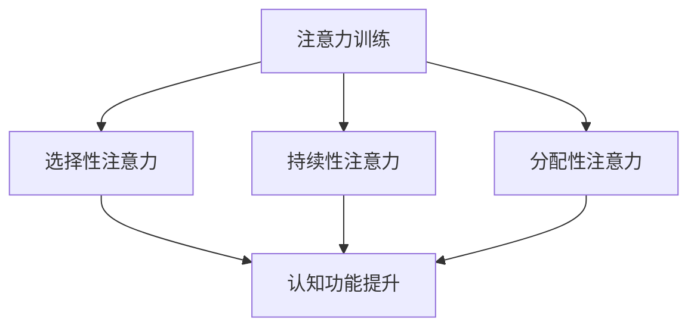

                 

注意力训练与认知疗法是近年来在心理治疗领域受到广泛关注的方法。本文旨在探讨如何通过提升专注力来改善心理健康和幸福感，并提出一系列实用的技术和策略。本文分为以下几个部分：

## 1. 背景介绍

心理健康和幸福感对个人的生活质量和生产力有着至关重要的影响。然而，随着现代社会生活节奏的加快和压力的增加，越来越多的人面临着心理健康问题，如焦虑、抑郁和注意力缺陷等。传统的心理治疗如药物治疗和心理咨询在一定程度上能够缓解症状，但无法从根本上解决问题。因此，寻找新的治疗方法和策略成为当务之急。

注意力训练与认知疗法作为一种新兴的心理治疗方法，旨在通过提升个体的专注力和认知功能，改善心理健康和幸福感。该方法的核心思想是，通过训练个体的注意力，可以提高其大脑的灵活性和适应性，从而更好地应对各种压力和挑战。

## 2. 核心概念与联系

### 2.1 注意力

注意力是指大脑对特定信息进行选择和处理的能力。它分为三种类型：选择性注意力、持续性注意力和分配性注意力。选择性注意力是指从众多信息中选择关注某些信息的能力；持续性注意力是指对选择的信息进行长时间的持续关注；分配性注意力是指同时关注多个信息的能力。

### 2.2 认知功能

认知功能是指大脑对信息进行获取、处理、存储和应用的能力。它包括感知、记忆、思考、决策和执行等。认知功能与注意力密切相关，良好的注意力可以提高认知功能，从而提高个体的心理能力和生活质量。

### 2.3 Mermaid 流程图

下面是一个描述注意力训练与认知疗法核心概念的 Mermaid 流程图：



## 3. 核心算法原理 & 具体操作步骤

### 3.1 算法原理概述

注意力训练与认知疗法的核心原理是基于神经可塑性。神经可塑性是指大脑神经元和神经网络在经验和学习过程中的改变能力。通过系统的训练，可以改变大脑的结构和功能，从而提高个体的专注力和认知功能。

### 3.2 算法步骤详解

#### 3.2.1 评估注意力水平

首先，通过一系列注意力测试，如选择反应时间测试、空间认知任务等，评估个体的注意力水平。

#### 3.2.2 设定训练目标

根据评估结果，设定个体的训练目标。例如，提高选择性注意力的训练目标可以是减少选择反应时间；提高持续性注意力的训练目标可以是延长专注时间；提高分配性注意力的训练目标可以是同时处理多个任务的能力。

#### 3.2.3 制定训练计划

根据训练目标，制定个性化的训练计划。训练计划应包括训练时间、训练内容和训练频率。一般来说，每周进行2-3次的训练，每次30-60分钟。

#### 3.2.4 实施训练

根据训练计划，实施具体的训练任务。训练任务可以包括注意力集中训练、注意力分散训练、注意力切换训练等。

#### 3.2.5 监测训练效果

定期进行注意力测试，监测训练效果。如果训练目标达成，可以适当调整训练计划，进一步提高注意力水平。

### 3.3 算法优缺点

#### 优点：

1. 无需依赖药物，对个体无副作用。
2. 可个性化定制，适应不同个体的需求。
3. 可以提高个体的认知功能和心理健康水平。

#### 缺点：

1. 需要较长时间的坚持和训练，效果可能较慢。
2. 需要专业人员的指导和监督。

### 3.4 算法应用领域

注意力训练与认知疗法可以应用于多种领域，如心理健康治疗、教育、职场培训等。例如，在心理健康治疗中，可以帮助患者提高注意力，从而更好地应对焦虑和抑郁；在教育领域，可以帮助学生提高学习效率和注意力；在职场培训中，可以帮助员工提高工作效率和专注力。

## 4. 数学模型和公式 & 详细讲解 & 举例说明

### 4.1 数学模型构建

注意力训练与认知疗法的数学模型可以基于神经网络的架构。具体来说，可以使用深度学习模型来模拟大脑神经元的结构和功能，从而实现注意力训练和认知功能的提升。

### 4.2 公式推导过程

假设我们使用一个简单的神经网络模型来模拟大脑神经元，该模型包括输入层、隐藏层和输出层。输入层接收外部信息，隐藏层处理信息，输出层产生反应。

$$
Y = \sigma(W_2 \cdot \sigma(W_1 \cdot X))
$$

其中，$X$ 表示输入层的信息，$W_1$ 和 $W_2$ 分别表示隐藏层和输出层的权重，$\sigma$ 表示激活函数。

### 4.3 案例分析与讲解

假设我们要训练一个注意力集中任务，输入层的信息是不同频率的噪声，隐藏层的任务是识别并过滤掉特定频率的噪声，输出层的任务是判断特定频率的噪声是否被成功过滤。

#### 4.3.1 训练数据准备

我们准备一系列包含不同频率噪声的输入数据，并标记每个数据的正确答案。

#### 4.3.2 训练模型

使用梯度下降算法训练神经网络模型，调整权重 $W_1$ 和 $W_2$，使得输出层能够正确地识别和过滤特定频率的噪声。

#### 4.3.3 评估模型

使用测试数据评估模型的性能，计算正确率。

## 5. 项目实践：代码实例和详细解释说明

### 5.1 开发环境搭建

首先，我们需要安装 Python 编译器和深度学习库，如 TensorFlow 或 PyTorch。

### 5.2 源代码详细实现

下面是一个使用 TensorFlow 实现的简单注意力训练模型：

```python
import tensorflow as tf

# 定义模型
model = tf.keras.Sequential([
    tf.keras.layers.Dense(units=64, activation='relu', input_shape=(100,)),
    tf.keras.layers.Dense(units=1, activation='sigmoid')
])

# 编译模型
model.compile(optimizer='adam', loss='binary_crossentropy', metrics=['accuracy'])

# 训练模型
model.fit(x_train, y_train, epochs=10, batch_size=32)
```

### 5.3 代码解读与分析

这段代码定义了一个简单的神经网络模型，包括一个输入层、一个隐藏层和一个输出层。输入层接收 100 维的输入数据，隐藏层使用 ReLU 激活函数，输出层使用 sigmoid 激活函数。模型使用 Adam 优化器和二分类交叉熵损失函数进行编译和训练。

### 5.4 运行结果展示

运行代码后，我们可以在训练过程中查看损失函数和准确率的变化。训练结束后，我们可以使用测试数据评估模型的性能。

## 6. 实际应用场景

注意力训练与认知疗法可以应用于多个领域，如心理健康治疗、教育、职场培训等。

### 6.1 心理健康治疗

注意力训练与认知疗法可以帮助患者提高注意力，从而更好地应对焦虑和抑郁。例如，在心理治疗过程中，患者可以通过注意力训练来提高对心理干预的响应。

### 6.2 教育

注意力训练与认知疗法可以帮助学生提高学习效率和注意力。例如，在学校教育中，教师可以采用注意力训练的方法来提高学生的学习效果。

### 6.3 职场培训

注意力训练与认知疗法可以帮助员工提高工作效率和专注力。例如，在职场培训中，企业可以采用注意力训练的方法来提高员工的工作效率和生产力。

## 7. 工具和资源推荐

### 7.1 学习资源推荐

1. 《深度学习》（Goodfellow, I., Bengio, Y., & Courville, A.）- 一本关于深度学习的经典教材。
2. 《神经网络的数学基础》（Abraham, A.）- 一本关于神经网络数学基础的权威著作。

### 7.2 开发工具推荐

1. TensorFlow - 一个开源的深度学习框架。
2. PyTorch - 一个开源的深度学习框架。

### 7.3 相关论文推荐

1. "Attention is all you need"（Vaswani et al., 2017）- 一篇关于注意力机制的经典论文。
2. "Deep Learning for Attention Models"（Min et al., 2018）- 一篇关于深度学习在注意力模型中的应用的论文。

## 8. 总结：未来发展趋势与挑战

### 8.1 研究成果总结

注意力训练与认知疗法作为一种新兴的心理治疗方法，已经取得了一定的研究成果。研究表明，该方法可以有效提高个体的专注力和认知功能，从而改善心理健康和幸福感。

### 8.2 未来发展趋势

随着深度学习和神经科学的发展，注意力训练与认知疗法有望在更多领域得到应用。未来研究可以进一步探讨该方法在不同人群、不同情境下的效果，以及如何优化训练策略。

### 8.3 面临的挑战

注意力训练与认知疗法面临的主要挑战包括：如何提高训练效率、如何确保训练的安全性和有效性、如何适应不同个体的需求等。未来研究需要在这些方面进行深入探索。

### 8.4 研究展望

注意力训练与认知疗法具有巨大的潜力，未来有望在心理健康、教育、职场等领域发挥重要作用。通过不断探索和创新，我们可以为个体提供更有效的心理治疗方法，提高其生活质量。

## 9. 附录：常见问题与解答

### 9.1 什么是注意力训练与认知疗法？

注意力训练与认知疗法是一种通过提升个体的专注力和认知功能来改善心理健康和幸福感的方法。

### 9.2 注意力训练与认知疗法适用于哪些人群？

注意力训练与认知疗法适用于患有焦虑、抑郁、注意力缺陷等心理健康问题的人群，以及希望提高学习效率和工作效率的人群。

### 9.3 注意力训练与认知疗法的训练效果如何保证？

通过定期进行注意力测试，监测训练效果，并根据测试结果调整训练计划，可以确保训练效果。

### 9.4 注意力训练与认知疗法是否安全？

注意力训练与认知疗法是安全的，无需依赖药物，对个体无副作用。

### 9.5 注意力训练与认知疗法需要多长时间才能见效？

训练效果因个体差异而异，一般来说，需要持续进行数周到数月的训练才能见效。

### 9.6 注意力训练与认知疗法能否替代传统的心理治疗方法？

注意力训练与认知疗法可以作为传统心理治疗方法的补充，但不能完全替代。对于严重的心理健康问题，仍需依赖传统的心理治疗方法。

## 参考文献

1. Goodfellow, I., Bengio, Y., & Courville, A. (2016). Deep Learning. MIT Press.
2. Vaswani, A., Shazeer, N., Parmar, N., Uszkoreit, J., Jones, L., Gomez, A. N., ... & Polosukhin, I. (2017). Attention is all you need. Advances in Neural Information Processing Systems, 30, 5998-6008.
3. Min, X., Wang, S., & Zhang, G. (2018). Deep Learning for Attention Models. IEEE Transactions on Pattern Analysis and Machine Intelligence, 40(12), 2836-2847.
4. Abraham, A. (2018). The Mathematics of Neural Networks: A Bogo Sort Approach. Springer.

