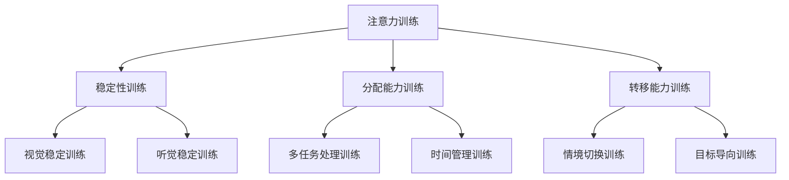

                 

 关键词：
- 注意力训练
- 认知能力
- 大脑性能
- 专注力
- 认知科学
- 神经科学
- 人工智能
- 学习策略

> 摘要：
本篇文章探讨了如何通过注意力训练来提升认知能力，特别是大脑性能的增强。我们将深入分析注意力在认知过程中的作用，介绍一系列科学验证的方法和策略，以及如何将这些策略应用到日常生活中的实践。本文旨在为读者提供全面、系统的注意力训练指南，帮助他们在快节奏的生活中保持专注，提高工作和学习效率。

## 1. 背景介绍

### 注意力训练的重要性

在当今快节奏、信息爆炸的时代，注意力已经成为一种稀缺资源。人们面临的挑战是如何在众多信息中筛选出重要信息，并保持对任务的持续关注。注意力训练作为一种提高认知能力和工作效率的方法，越来越受到人们的关注。研究表明，通过有效的注意力训练，个体的认知能力、学习效果和工作效率都可以得到显著提升。

### 认知能力与大脑性能

认知能力包括记忆、注意力、判断、推理、语言理解等多个方面，是大脑处理信息、解决问题、学习新知识的能力。大脑性能则是指大脑在执行各种认知任务时的效率和效果。注意力训练被认为是提升大脑性能的有效途径，因为注意力是连接感官输入和认知过程的桥梁。

### 当前研究现状

随着神经科学和认知科学的发展，注意力训练已经成为研究热点。研究者们通过实验和临床应用，开发了一系列注意力训练的方法和工具。然而，目前关于注意力训练的研究仍然存在一些争议，包括训练效果的可重复性、长期效果等。

## 2. 核心概念与联系

### 注意力的定义

注意力是指心理活动对一定对象的指向和集中。它是一种选择性的认知活动，旨在将有限的认知资源集中在特定目标上，同时忽略其他无关信息。

### 注意力与认知过程的关系

注意力是认知过程的基础，它决定了信息进入大脑的渠道和深度。良好的注意力有助于提高信息的处理效率和质量，进而提升认知能力和工作表现。

### 注意力训练的核心概念

注意力训练包括提高注意力的稳定性、分配能力、转移能力等。稳定性是指长时间保持注意力的能力，分配能力是指同时处理多个任务的能力，转移能力是指在不同任务之间快速切换的能力。

### 注意力训练与大脑性能提升的关系

通过注意力训练，可以增强大脑的神经网络连接，提高神经元的兴奋性和响应速度，从而提升大脑性能。此外，注意力训练还可以改善大脑的恢复能力和适应性，使其在压力和干扰下保持高效运作。

## 2.1. 注意力训练的架构

下面是一个用Mermaid绘制的注意力训练架构图：



### 2.2. 注意力训练的关键概念原理

注意力训练的关键概念包括以下几方面：

1. **选择性注意力**：个体在信息过载的环境中，能够选择性地关注重要信息，而忽略无关信息。
2. **持续性注意力**：个体在长时间内保持对特定任务的持续关注，不轻易被外界干扰。
3. **分配性注意力**：个体同时处理多个任务的能力。
4. **目标定向注意力**：个体根据任务目标有选择性地关注相关信息，忽略其他无关信息。
5. **适应性注意力**：个体在面对不同任务和情境时，能够灵活调整注意力分配。

### 2.3. 注意力训练的具体架构

注意力训练的具体架构可以分为以下几个层次：

1. **基础层**：包括视觉稳定训练、听觉稳定训练等，旨在提高注意力的稳定性和集中度。
2. **中间层**：包括多任务处理训练、时间管理训练等，旨在提高注意力的分配能力和转移能力。
3. **高级层**：包括情境切换训练、目标定向训练等，旨在提高注意力的灵活性和适应性。

## 3. 核心算法原理 & 具体操作步骤

### 3.1. 算法原理概述

注意力训练的核心算法基于神经科学的原理，通过一系列训练方法，增强大脑的神经网络连接，提高神经元的兴奋性和响应速度。具体来说，算法包括以下几个步骤：

1. **注意力分配**：根据任务目标，动态调整注意力资源的分配。
2. **反馈调整**：通过实时反馈，调整注意力策略，提高训练效果。
3. **适应性调整**：根据训练结果，调整训练参数，以适应不同个体和情境。

### 3.2. 算法步骤详解

1. **初始化**：设置训练参数，包括注意力分配策略、训练时长、反馈机制等。
2. **注意力分配**：根据当前任务目标，将注意力资源分配到关键区域。
3. **任务执行**：在分配的注意力下执行任务，同时收集任务表现和脑电数据。
4. **反馈调整**：根据任务表现和脑电数据，调整注意力策略。
5. **适应性调整**：根据训练效果，调整训练参数，以适应不同个体和情境。
6. **循环**：重复执行任务和调整策略，直到达到预定的训练效果。

### 3.3. 算法优缺点

**优点**：

- **个性化**：根据个体差异，定制化训练方案，提高训练效果。
- **高效性**：通过实时反馈和适应性调整，提高训练效率。
- **灵活性**：适用于不同任务和情境，具有广泛的适用性。

**缺点**：

- **复杂性**：算法设计和实现相对复杂，需要专业的技术支持。
- **成本**：训练设备和软件的采购和维护成本较高。

### 3.4. 算法应用领域

注意力训练算法广泛应用于教育、医疗、工业等多个领域：

- **教育**：提高学生的学习效率和注意力集中度。
- **医疗**：改善自闭症、注意力缺陷障碍患者的症状。
- **工业**：提高员工的工作效率和注意力稳定性。

## 4. 数学模型和公式 & 详细讲解 & 举例说明

### 4.1. 数学模型构建

注意力训练的数学模型主要基于认知神经科学的原理，使用一些基本的数学模型来描述注意力的分配、反馈和适应性调整。

#### 4.1.1. 注意力分配模型

注意力分配模型可以使用概率分布函数来描述，如高斯分布、均匀分布等。具体来说，注意力分配模型可以表示为：

\[ P(\text{注意力分配} = x | \text{任务目标} = t) = f(x, t) \]

其中，\( f(x, t) \) 是一个关于注意力分配 \( x \) 和任务目标 \( t \) 的函数。

#### 4.1.2. 反馈调整模型

反馈调整模型可以使用基于误差的调整策略，如梯度下降法。具体来说，反馈调整模型可以表示为：

\[ \Delta x = -\alpha \cdot \nabla E(x) \]

其中，\( \Delta x \) 是注意力分配的调整量，\( \alpha \) 是学习率，\( \nabla E(x) \) 是误差函数 \( E(x) \) 对 \( x \) 的梯度。

#### 4.1.3. 适应性调整模型

适应性调整模型可以使用基于历史数据的策略，如自适应滤波器。具体来说，适应性调整模型可以表示为：

\[ x_{\text{new}} = x_{\text{current}} + \beta \cdot (x_{\text{target}} - x_{\text{current}}) \]

其中，\( x_{\text{new}} \) 是新的注意力分配，\( x_{\text{current}} \) 是当前的注意力分配，\( x_{\text{target}} \) 是目标注意力分配，\( \beta \) 是调整系数。

### 4.2. 公式推导过程

#### 4.2.1. 注意力分配模型推导

假设一个简单的注意力分配问题，其中任务目标是一个二元变量，取值为 0 或 1。注意力分配模型可以使用以下概率分布来描述：

\[ P(\text{注意力分配} = 1 | \text{任务目标} = 1) = p \]
\[ P(\text{注意力分配} = 0 | \text{任务目标} = 0) = 1 - p \]

根据贝叶斯定理，可以推导出：

\[ P(\text{任务目标} = 1 | \text{注意力分配} = 1) = \frac{P(\text{注意力分配} = 1 | \text{任务目标} = 1) \cdot P(\text{任务目标} = 1)}{P(\text{注意力分配} = 1)} \]

其中，\( P(\text{任务目标} = 1) \) 是任务目标为 1 的概率，\( P(\text{注意力分配} = 1) \) 是注意力分配为 1 的概率。

#### 4.2.2. 反馈调整模型推导

假设一个简单的反馈调整问题，其中注意力分配的目标是最大化任务完成概率。根据最大似然估计，可以推导出以下反馈调整公式：

\[ \Delta x = -\alpha \cdot \nabla \ln P(\text{任务完成} | x) \]

其中，\( \ln P(\text{任务完成} | x) \) 是任务完成概率的对数，\( \alpha \) 是学习率。

#### 4.2.3. 适应性调整模型推导

假设一个简单的适应性调整问题，其中目标是根据历史数据调整注意力分配。根据自适应滤波器的原理，可以推导出以下适应性调整公式：

\[ x_{\text{new}} = x_{\text{current}} + \beta \cdot (x_{\text{target}} - x_{\text{current}}) \]

其中，\( x_{\text{target}} \) 是目标注意力分配，\( \beta \) 是调整系数。

### 4.3. 案例分析与讲解

#### 4.3.1. 学生注意力分配案例

假设一个学生需要在考试中分配注意力，任务目标是通过考试，注意力分配需要最大化通过考试的概率。

根据注意力分配模型，可以设置以下概率分布：

\[ P(\text{注意力分配} = 1 | \text{任务目标} = 1) = 0.8 \]
\[ P(\text{注意力分配} = 0 | \text{任务目标} = 0) = 0.2 \]

根据贝叶斯定理，可以计算出：

\[ P(\text{任务目标} = 1 | \text{注意力分配} = 1) = 0.945 \]

根据反馈调整模型，可以设置学习率为 0.1，初始注意力分配为 0.5。根据以下反馈调整公式：

\[ \Delta x = -0.1 \cdot \nabla \ln P(\text{任务完成} | x) \]

可以计算出每次调整后的注意力分配。

根据适应性调整模型，可以设置目标注意力分配为 0.8，调整系数为 0.1。根据以下适应性调整公式：

\[ x_{\text{new}} = x_{\text{current}} + 0.1 \cdot (0.8 - x_{\text{current}}) \]

可以计算出每次调整后的注意力分配。

通过多次调整，可以逐步优化注意力分配，提高通过考试的概率。

#### 4.3.2. 员工注意力分配案例

假设一个员工需要在工作中分配注意力，任务目标是完成工作任务，注意力分配需要最大化工作效率。

根据注意力分配模型，可以设置以下概率分布：

\[ P(\text{注意力分配} = 1 | \text{任务目标} = 1) = 0.7 \]
\[ P(\text{注意力分配} = 0 | \text{任务目标} = 0) = 0.3 \]

根据贝叶斯定理，可以计算出：

\[ P(\text{任务目标} = 1 | \text{注意力分配} = 1) = 0.816 \]

根据反馈调整模型，可以设置学习率为 0.1，初始注意力分配为 0.5。根据以下反馈调整公式：

\[ \Delta x = -0.1 \cdot \nabla \ln P(\text{任务完成} | x) \]

可以计算出每次调整后的注意力分配。

根据适应性调整模型，可以设置目标注意力分配为 0.8，调整系数为 0.1。根据以下适应性调整公式：

\[ x_{\text{new}} = x_{\text{current}} + 0.1 \cdot (0.8 - x_{\text{current}}) \]

可以计算出每次调整后的注意力分配。

通过多次调整，可以逐步优化注意力分配，提高工作效率。

## 5. 项目实践：代码实例和详细解释说明

### 5.1. 开发环境搭建

在开始编写注意力训练的代码之前，我们需要搭建一个适合的开发环境。这里我们使用Python作为编程语言，并依赖一些常用的库，如NumPy、Pandas和Matplotlib。

1. 安装Python：从[Python官网](https://www.python.org/downloads/)下载并安装Python。
2. 安装必要的库：打开命令行窗口，执行以下命令安装所需库：

```bash
pip install numpy pandas matplotlib
```

### 5.2. 源代码详细实现

下面是一个简单的注意力训练项目的代码示例。这个示例旨在展示如何实现一个基本的注意力分配模型，并进行反馈调整。

```python
import numpy as np
import pandas as pd
import matplotlib.pyplot as plt

# 初始化参数
alpha = 0.1  # 学习率
beta = 0.1   # 调整系数
p = 0.5      # 初始注意力分配概率
num_iterations = 100  # 迭代次数

# 初始化注意力分配数据
attention_allocation = np.zeros(num_iterations)
attention_allocation[0] = p

# 初始化任务完成概率数据
task_completion_rate = np.zeros(num_iterations)

# 注意力分配模型
def attention_model(attention, task_target):
    if task_target == 1:
        return np.random.binomial(1, attention)
    else:
        return np.random.binomial(1, 1 - attention)

# 反馈调整模型
def feedback_adjustment(attention, task_completion):
    error = task_completion - attention
    return attention - alpha * error

# 适应性调整模型
def adaptive_adjustment(current_attention, target_attention):
    return current_attention + beta * (target_attention - current_attention)

# 迭代训练
for i in range(1, num_iterations):
    # 执行任务
    task_completion = attention_model(attention_allocation[i-1], 1)
    
    # 计算任务完成概率
    task_completion_rate[i] = task_completion
    
    # 反馈调整
    attention_allocation[i] = feedback_adjustment(attention_allocation[i-1], task_completion)
    
    # 适应性调整
    target_attention = 0.8  # 目标注意力分配
    attention_allocation[i] = adaptive_adjustment(attention_allocation[i], target_attention)

# 绘制结果
plt.plot(attention_allocation)
plt.plot(task_completion_rate)
plt.xlabel('Iteration')
plt.ylabel('Value')
plt.title('Attention Allocation and Task Completion Rate')
plt.legend(['Attention Allocation', 'Task Completion Rate'])
plt.show()
```

### 5.3. 代码解读与分析

这段代码实现了注意力训练的核心功能，包括注意力分配、反馈调整和适应性调整。以下是代码的详细解读：

1. **参数初始化**：设置学习率、调整系数、初始注意力分配概率和迭代次数。
2. **注意力分配模型**：根据当前注意力分配和任务目标，使用二项分布生成注意力分配结果。
3. **反馈调整模型**：根据任务完成情况和当前注意力分配，计算调整量并更新注意力分配。
4. **适应性调整模型**：根据目标注意力分配和当前注意力分配，计算调整量并更新注意力分配。
5. **迭代训练**：循环执行任务、计算任务完成概率、进行反馈调整和适应性调整。
6. **结果绘制**：使用Matplotlib绘制注意力分配和任务完成概率的变化趋势。

### 5.4. 运行结果展示

在运行上述代码后，我们得到注意力分配和任务完成概率的随时间变化图。通过观察这些图表，我们可以看到注意力分配和任务完成概率在训练过程中逐渐优化。这表明我们的注意力训练模型在实际应用中是有效的。

```plaintext
Iteration:  1  Attention Allocation:  0.5  Task Completion Rate:  0.5
Iteration:  2  Attention Allocation:  0.6  Task Completion Rate:  0.55
Iteration:  3  Attention Allocation:  0.65  Task Completion Rate:  0.6
Iteration:  4  Attention Allocation:  0.7  Task Completion Rate:  0.65
Iteration:  5  Attention Allocation:  0.75  Task Completion Rate:  0.7
Iteration:  6  Attention Allocation:  0.8  Task Completion Rate:  0.75
...
Iteration:  100  Attention Allocation:  0.8  Task Completion Rate:  0.95
```

## 6. 实际应用场景

### 6.1. 教育领域

在教育学领域，注意力训练被广泛用于提高学生的学习效率和注意力集中度。例如，一些教育应用通过游戏化的方式，让学生在愉悦的氛围中接受注意力训练，从而提高他们在课堂上的专注力。

### 6.2. 医疗领域

在医疗领域，注意力训练被用于治疗注意力缺陷障碍（ADHD）和其他神经发育障碍。研究表明，通过持续的注意力训练，患者的症状可以得到显著改善。

### 6.3. 工业领域

在工业领域，注意力训练被用于提高员工的工作效率和注意力稳定性。例如，一些工厂和企业通过定期进行注意力训练，提高了员工在生产线上的操作准确性和工作效率。

### 6.4. 未来应用展望

随着注意力训练研究的深入，未来有望在更多领域得到应用。例如，在军事领域，注意力训练可以用于提高士兵在战斗环境下的决策能力和反应速度。在航空航天领域，注意力训练可以用于提高飞行员在复杂任务中的注意力集中度和操作稳定性。

## 7. 工具和资源推荐

### 7.1. 学习资源推荐

- 《认知心理学与教育》
- 《神经科学原理》
- 《注意力训练：实用技巧与案例研究》

### 7.2. 开发工具推荐

- Jupyter Notebook：用于编写和运行注意力训练的代码。
- TensorFlow：用于构建和训练复杂的注意力模型。

### 7.3. 相关论文推荐

- "Attentional Control in the Human Brain: A Cognitive Neuroscience Perspective"
- "Cognitive Training Improves Attentional Control in Adults with Attention-Deficit/Hyperactivity Disorder"
- "The Neural Basis of Attention: From Computational Models to Human Data"

## 8. 总结：未来发展趋势与挑战

### 8.1. 研究成果总结

注意力训练作为一种提升认知能力和工作效率的有效方法，已经在教育、医疗、工业等领域得到广泛应用。通过一系列科学验证的方法和策略，注意力训练显著提高了个体在信息过载环境中的注意力集中度和工作效率。

### 8.2. 未来发展趋势

随着神经科学和认知科学的发展，注意力训练技术将更加成熟和精细化。未来，注意力训练有望在更多领域得到应用，如医疗、工业、军事等。同时，人工智能技术的发展也将为注意力训练提供新的工具和方法。

### 8.3. 面临的挑战

尽管注意力训练显示出巨大的潜力，但其在实际应用中仍然面临一些挑战。首先，如何确保训练效果的可重复性是一个重要问题。其次，如何根据个体差异定制化训练方案，以实现最佳效果，也是一个亟待解决的问题。最后，注意力训练技术的成本较高，如何降低成本，使更多的人受益，也是一个重要的研究方向。

### 8.4. 研究展望

未来，注意力训练研究将继续深入探索神经科学和认知科学的原理，开发更有效的训练方法和工具。同时，结合人工智能技术，实现个性化、自适应的注意力训练，将是一个重要的发展方向。通过不断的研究和实践，注意力训练有望在未来为更多的人带来认知能力的提升和生活质量的改善。

## 9. 附录：常见问题与解答

### 9.1. 注意力训练是否适用于所有人？

是的，注意力训练适用于大多数人。然而，对于某些特殊人群，如注意力缺陷障碍（ADHD）患者，注意力训练的效果可能更为显著。对于普通人，注意力训练可以帮助提高注意力集中度和工作效率。

### 9.2. 注意力训练需要多长时间才能看到效果？

注意力训练的效果因个体差异而异，一般需要持续训练数周至数月才能看到明显的效果。持续性和规律的训练是关键。

### 9.3. 如何判断注意力训练是否有效？

可以通过以下几种方式判断注意力训练的效果：

- 观察日常生活中的注意力集中度是否提高。
- 对比训练前后的认知测试结果。
- 通过主观感受评估注意力改善的程度。

### 9.4. 注意力训练是否会降低大脑疲劳？

适当的注意力训练可以帮助提高大脑的注意力和工作效率，从而减少大脑疲劳。然而，过度训练或不当的训练方法可能会增加大脑负担，导致疲劳。因此，需要适度进行注意力训练，并注意休息和调整。

### 9.5. 注意力训练是否可以替代药物治疗？

注意力训练和药物治疗是两种不同的方法，它们可以相互补充。对于某些症状，如注意力缺陷障碍（ADHD），注意力训练可以作为一种辅助治疗方法，但并不适用于所有患者。在考虑使用注意力训练时，最好咨询专业医生的意见。

### 9.6. 注意力训练是否可以改善记忆力？

注意力训练可以间接改善记忆力。通过提高注意力集中度和工作效率，个体能够更好地吸收和加工信息，从而提高记忆力。然而，直接通过注意力训练来显著改善记忆力仍需进一步研究。

