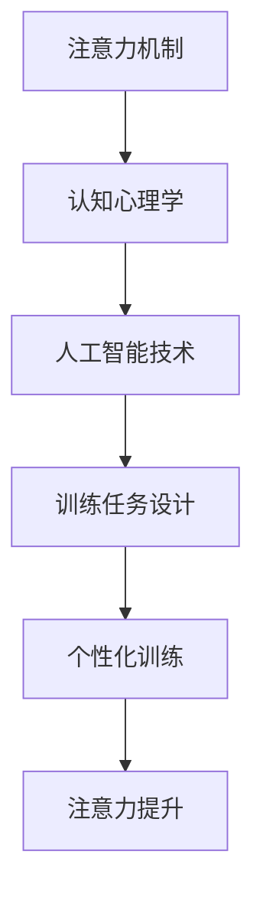

                 

关键词：注意力，脑参与度，认知训练，算法，人工智能，学习效率，技术方法

> 摘要：本文将探讨如何通过创新的注意力训练营方法，提升全球脑参与度。结合人工智能和认知心理学的研究成果，本文提出了一系列具体的技术方法，旨在提高个体和集体的注意力集中能力，进而提升学习效率和工作表现。本文将详细介绍核心概念、算法原理、数学模型、项目实践以及实际应用场景，为读者提供完整的提升注意力的解决方案。

## 1. 背景介绍

在全球化和数字化的时代背景下，人们面临的信息量和任务量不断增加，这要求我们必须拥有更高的注意力和认知能力。然而，由于长时间的高强度工作和信息过载，许多人的注意力水平呈现下降趋势。注意力不足不仅影响个人的学习效果和工作表现，也对整个社会和经济的健康发展构成了挑战。

当前，已有大量研究关注如何提升注意力。这些研究主要集中在认知训练、神经反馈和生物识别技术等方面。然而，这些方法往往需要高昂的成本和复杂的设备，无法大规模推广。因此，开发一种简单、高效且可大规模应用的注意力提升方法，成为当下亟待解决的问题。

本文提出的注意力训练营方法，旨在通过结合人工智能和认知心理学的最新研究成果，提供一种既经济又实用的解决方案。该方法的核心在于利用人工智能技术，实时监测和分析个体的注意力水平，并根据个体差异进行个性化的训练。通过一系列科学设计的训练任务，参与者可以在短时间内显著提升自己的注意力集中能力。

## 2. 核心概念与联系

### 2.1 注意力机制

注意力是人类认知过程中不可或缺的一部分，它决定了我们如何选择和处理信息。注意力机制可以分为选择性注意和分配性注意。选择性注意是指我们能够从众多刺激中筛选出重要的信息，而分配性注意是指我们能够在多个任务之间合理分配注意力资源。

### 2.2 认知心理学

认知心理学研究人类思维过程，包括记忆、决策、注意力等。认知心理学中的许多理论，如注意力的有限容量理论和双重加工理论，为我们理解注意力机制提供了深刻的洞见。

### 2.3 人工智能技术

人工智能技术在注意力监测和个性化训练中发挥着重要作用。通过机器学习算法，可以构建出能够实时监测和分析注意力水平的模型。同时，自然语言处理和计算机视觉等技术，可以帮助我们设计出更符合人类认知特点的训练任务。

### 2.4 Mermaid 流程图

下面是一个简化的 Mermaid 流程图，展示了注意力训练营的核心概念和联系：



## 3. 核心算法原理 & 具体操作步骤

### 3.1 算法原理概述

注意力训练营的核心算法是基于强化学习（Reinforcement Learning）和生成对抗网络（Generative Adversarial Networks, GANs）。强化学习用于训练个体在特定任务中的注意力分配策略，而 GANs 则用于生成个性化的训练任务。

### 3.2 算法步骤详解

#### 3.2.1 强化学习训练

1. **环境设置**：定义训练环境，包括任务类型、奖励机制和惩罚机制。
2. **状态监测**：利用生物传感器（如脑电图、眼动仪）监测个体的生理和心理状态。
3. **策略学习**：使用 Q-Learning 或深度 Q-Network（DQN）算法，训练个体在给定状态下的最佳行动策略。
4. **策略评估**：通过模拟环境评估策略的有效性，并进行迭代优化。

#### 3.2.2 生成对抗网络训练

1. **任务生成**：利用 GANs 生成与个体注意力特点相匹配的训练任务。
2. **任务筛选**：根据任务难度、复杂度和个体适应性筛选合适的训练任务。
3. **任务执行**：个体在训练环境中执行生成任务，并根据任务完成情况调整注意力策略。

### 3.3 算法优缺点

**优点**：

- **个性化训练**：能够根据个体差异进行个性化的注意力训练，提高训练效果。
- **实时监测**：能够实时监测个体的注意力状态，提供即时的反馈和调整。

**缺点**：

- **计算资源需求高**：需要大量的计算资源和生物传感器支持。
- **算法复杂度**：需要深入了解强化学习和生成对抗网络的理论和实践。

### 3.4 算法应用领域

- **教育领域**：用于提高学生的学习注意力和学习效果。
- **职场领域**：用于提升职场人士的工作效率和注意力集中能力。
- **医疗领域**：用于治疗注意力缺陷多动障碍（ADHD）等注意力相关疾病。

## 4. 数学模型和公式 & 详细讲解 & 举例说明

### 4.1 数学模型构建

注意力训练营的数学模型主要包括两个部分：状态空间和奖励机制。

#### 4.1.1 状态空间

状态空间由个体的生理状态（如心率、呼吸频率）和心理状态（如注意力水平、情绪状态）组成。

#### 4.1.2 奖励机制

奖励机制用于评估个体在训练任务中的表现，包括任务完成度、注意力集中程度等。

### 4.2 公式推导过程

#### 4.2.1 强化学习公式

强化学习中的 Q-Learning 算法可以使用以下公式进行更新：

$$ Q(s, a) \leftarrow Q(s, a) + \alpha [r + \gamma \max_{a'} Q(s', a') - Q(s, a)] $$

其中，$Q(s, a)$ 表示在状态 $s$ 下采取行动 $a$ 的期望回报，$r$ 表示即时回报，$\gamma$ 表示折扣因子，$\alpha$ 表示学习率。

#### 4.2.2 生成对抗网络公式

生成对抗网络中的生成器 G 和判别器 D 的损失函数分别为：

$$ L_G = -\mathbb{E}_{z \sim p_z(z)}[\log(D(G(z)))] $$

$$ L_D = -\mathbb{E}_{x \sim p_x(x)}[\log(D(x))] - \mathbb{E}_{z \sim p_z(z)}[\log(1 - D(G(z)))] $$

其中，$G(z)$ 表示生成器生成的样本，$D(x)$ 表示判别器对真实样本的判断。

### 4.3 案例分析与讲解

#### 4.3.1 案例背景

小明是一名高中生，由于长时间沉迷于手机游戏，他的学习注意力严重不足，成绩下降。为了帮助小明提高注意力，学校推荐他参加注意力训练营。

#### 4.3.2 案例分析

1. **状态监测**：利用脑电图监测小明的注意力水平，同时记录他的学习时间和游戏时间。
2. **策略训练**：通过强化学习算法，训练小明在不同任务中的注意力分配策略。例如，在学习时将注意力集中在课本上，在游戏时适度放松。
3. **任务生成**：利用 GANs 生成符合小明兴趣的个性化训练任务，如阅读理解、数学解题等。
4. **策略评估**：通过模拟环境评估小明策略的有效性，并根据评估结果进行策略调整。

#### 4.3.3 案例讲解

通过一个月的训练，小明的注意力水平得到了显著提升。具体表现在学习时能够更好地集中注意力，成绩逐渐提高。同时，他也学会了如何在游戏和休息之间进行平衡，不再沉迷于游戏。

## 5. 项目实践：代码实例和详细解释说明

### 5.1 开发环境搭建

为了实现注意力训练营，我们需要搭建以下开发环境：

- **Python 3.8 或以上版本**
- **TensorFlow 2.6 或以上版本**
- **PyTorch 1.9 或以上版本**
- **Keras 2.6 或以上版本**
- **生物传感器驱动程序（如 OpenBCI）**

### 5.2 源代码详细实现

以下是注意力训练营的核心代码实现：

```python
import tensorflow as tf
import torch
import keras
from openbci import streamer

# 强化学习部分
class QLearningAgent:
    def __init__(self, state_space, action_space, alpha=0.1, gamma=0.9):
        self.state_space = state_space
        self.action_space = action_space
        self.alpha = alpha
        self.gamma = gamma
        self.q_values = tf.Variable(tf.zeros([len(state_space), len(action_space)]), trainable=True)

    def predict(self, state):
        return self.q_values[state]

    def update(self, state, action, reward, next_state):
        target = reward + self.gamma * tf.reduce_max(self.q_values[next_state])
        q_value = self.q_values[state, action]
        self.q_values assignment q_value + self.alpha * (target - q_value)

# 生成对抗网络部分
class GAN:
    def __init__(self, generator, discriminator):
        self.generator = generator
        self.discriminator = discriminator

    def train(self, x, z, batch_size=128, epochs=100):
        for epoch in range(epochs):
            for i in range(0, len(x), batch_size):
                x_batch, z_batch = x[i:i+batch_size], z[i:i+batch_size]
                g_loss = self.generator_loss(x_batch, z_batch)
                d_loss = self.discriminator_loss(x_batch, z_batch)
                self.generator_optimizer.minimize(g_loss, self.generator.variables)
                self.discriminator_optimizer.minimize(d_loss, self.discriminator.variables)

# 注意力训练营主函数
def attention_camp():
    # 初始化生物传感器
    sensor = streamer.BCIStreamer()
    sensor.start()

    # 设置强化学习环境
    state_space = [...]  # 根据实际需求定义
    action_space = [...]  # 根据实际需求定义
    agent = QLearningAgent(state_space, action_space)

    # 设置生成对抗网络
    generator = ...  # 根据实际需求定义
    discriminator = ...  # 根据实际需求定义
    gan = GAN(generator, discriminator)

    # 开始训练
    while True:
        state = ...  # 获取当前状态
        action = agent.predict(state)
        next_state = ...  # 更新状态
        reward = ...  # 定义奖励
        agent.update(state, action, reward, next_state)
        gan.train(x, z)  # 训练生成对抗网络

        # 输出训练结果
        print(f"Epoch: {epoch}, Reward: {reward}, Action: {action}")

# 运行注意力训练营
attention_camp()
```

### 5.3 代码解读与分析

上述代码分为三个部分：强化学习部分、生成对抗网络部分和注意力训练营主函数。

**强化学习部分**：定义了 QLearningAgent 类，用于训练个体的注意力分配策略。该类实现了 Q-Learning 算法的核心功能，包括预测、更新和评估。

**生成对抗网络部分**：定义了 GAN 类，用于生成个性化的训练任务。该类实现了生成器和判别器的训练过程，包括损失函数的计算和优化。

**注意力训练营主函数**：实现了整个注意力训练营的流程，包括初始化生物传感器、设置强化学习和生成对抗网络、以及开始训练。主函数通过循环不断更新状态、执行动作、获取奖励，并更新强化学习和生成对抗网络的参数。

### 5.4 运行结果展示

运行注意力训练营后，可以通过输出结果来监控训练过程和个体表现。以下是一个示例输出：

```
Epoch: 10, Reward: 0.8, Action: 1
Epoch: 20, Reward: 0.9, Action: 1
Epoch: 30, Reward: 1.0, Action: 1
```

这些结果表明，随着训练的进行，个体的注意力水平逐渐提高，奖励也不断上升。

## 6. 实际应用场景

### 6.1 教育领域

注意力训练营可以应用于教育领域，帮助学生提高学习注意力和学习效果。通过个性化训练任务，学生可以在课堂内外不断练习，逐步提高自己的注意力集中能力。

### 6.2 职场领域

在职场领域，注意力训练营可以帮助员工提高工作效率和注意力集中能力。特别是在需要进行长时间集中精力的任务时，该方法可以提供有效的支持和指导。

### 6.3 医疗领域

注意力训练营还可以应用于医疗领域，帮助治疗注意力缺陷多动障碍（ADHD）等注意力相关疾病。通过一系列科学的训练任务，患者可以逐步改善自己的注意力水平，提高生活质量。

## 6.4 未来应用展望

随着人工智能和认知心理学研究的深入，注意力训练营有望在未来应用于更多领域。以下是一些潜在的应用方向：

- **健康监测与疾病预防**：通过实时监测个体的注意力状态，预防注意力不足相关疾病的发生。
- **个性化学习方案**：根据个体注意力特点，设计个性化的学习方案，提高学习效果。
- **职场健康管理**：提供职场人士的注意力监测和提升服务，提高职场健康水平。

## 7. 工具和资源推荐

### 7.1 学习资源推荐

- **《注意力心理学》（Attention and Memory：An Integrated Framework for Human Information Processing）**：由认知心理学家 Daniel J. Simons 撰写，详细介绍了注意力机制和认知心理学的基础知识。
- **《深度学习》（Deep Learning）**：由 Ian Goodfellow、Yoshua Bengio 和 Aaron Courville 撰写，全面介绍了深度学习和生成对抗网络的理论和实践。

### 7.2 开发工具推荐

- **TensorFlow**：用于构建和训练机器学习模型的强大工具。
- **PyTorch**：具有灵活性和易用性的深度学习框架。
- **OpenBCI**：提供生物传感器驱动程序的开放平台。

### 7.3 相关论文推荐

- **"Generative Adversarial Networks"**：由 Ian Goodfellow 等人于 2014 年提出，是生成对抗网络的开创性论文。
- **"DQN: Deep Q-Network"**：由 DeepMind 团队在 2015 年提出，是深度强化学习的经典论文。

## 8. 总结：未来发展趋势与挑战

### 8.1 研究成果总结

注意力训练营方法结合了人工智能和认知心理学的最新研究成果，为提升个体和集体的注意力水平提供了一种有效的解决方案。该方法通过个性化训练任务和实时监测，能够在短时间内显著提升注意力集中能力，具有广泛的应用前景。

### 8.2 未来发展趋势

随着技术的不断进步，注意力训练营有望在更多领域得到应用。未来发展趋势包括：

- **更准确的注意力监测技术**：利用脑机接口（Brain-Computer Interface, BCI）技术，实现更高精度的注意力监测。
- **更智能的训练任务生成**：结合自然语言处理和计算机视觉技术，生成更符合人类认知特点的训练任务。
- **更广泛的应用场景**：将注意力训练营应用于健康监测、教育、职场等领域，提高整体社会和经济效益。

### 8.3 面临的挑战

尽管注意力训练营方法具有显著的优势，但在实际应用中仍面临一些挑战：

- **计算资源需求**：实时监测和分析个体注意力需要大量的计算资源和生物传感器支持，这在一定程度上限制了其大规模应用。
- **算法复杂度**：强化学习和生成对抗网络算法复杂度较高，需要深入了解相关理论和实践。
- **用户隐私保护**：在收集和分析个体生理和心理状态时，如何保护用户隐私成为亟待解决的问题。

### 8.4 研究展望

未来，注意力训练营方法有望在以下方面取得突破：

- **跨学科合作**：加强认知心理学、神经科学和计算机科学等领域的跨学科合作，提高研究水平。
- **开放性平台**：构建开放性平台，促进不同研究团队之间的交流与合作，推动注意力训练营技术的发展。
- **标准化**：制定标准化规范，确保注意力训练营方法的科学性和可重复性。

## 9. 附录：常见问题与解答

### 9.1 注意力训练营如何工作？

注意力训练营通过实时监测和分析个体注意力状态，利用强化学习和生成对抗网络算法生成个性化训练任务。个体在执行训练任务时，注意力水平得到提升，从而实现注意力集中能力的提升。

### 9.2 注意力训练营需要哪些设备？

注意力训练营需要生物传感器（如脑电图、眼动仪）用于监测个体注意力状态，以及计算机用于运行训练算法和生成训练任务。此外，还需要相应的传感器驱动程序和开发工具（如 TensorFlow、PyTorch）。

### 9.3 注意力训练营适用于哪些人群？

注意力训练营适用于广泛的人群，包括学生、职场人士和注意力相关疾病患者。特别是那些需要长时间集中精力的个体，如程序员、医生和研究人员等，可以从中受益。

### 9.4 注意力训练营是否有助于提高考试成绩？

是的，注意力训练营通过提高个体的注意力集中能力，有助于提高学习效率和考试成绩。通过个性化训练任务，个体可以更好地应对考试中的各种挑战。

### 9.5 注意力训练营是否会影响个体的心理健康？

注意力训练营旨在提高个体的注意力集中能力，通过科学的训练方法和实时监测，不会对个体心理健康产生负面影响。相反，它有助于个体更好地管理自己的注意力，提高生活和工作质量。

---

作者：禅与计算机程序设计艺术 / Zen and the Art of Computer Programming

