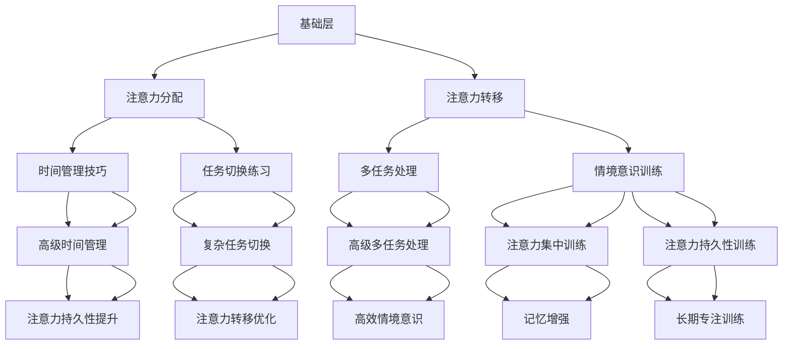

                 

关键词：注意力训练、脑参与效率、认知模型、算法、深度学习、优化、实践、展望

> 摘要：本文旨在探讨注意力训练对提升全球脑参与效率的重要性。通过阐述注意力训练的核心概念、算法原理、数学模型，并结合实际案例进行分析，本文将为读者提供一个全面的技术视角，揭示注意力训练在提升脑参与效率方面的潜力与挑战。

## 1. 背景介绍

在当今信息爆炸的时代，人类面临着前所未有的认知负担。如何从海量信息中快速筛选、定位和吸收关键信息，成为每个个体和组织必须面对的挑战。注意力作为人类认知系统的重要部分，直接影响着信息处理的速度和准确性。因此，注意力训练逐渐成为提升脑参与效率的关键领域。

注意力训练的核心目标是提高个体在处理信息时的专注力和效率。具体而言，它包括以下几个方面：

1. **注意力分配**：如何在不同任务之间分配注意力资源。
2. **注意力转移**：如何从一项任务快速切换到另一项任务。
3. **注意力集中**：如何长时间保持对特定任务的专注。

注意力训练不仅对个人的认知能力有着深远的影响，还在各个领域展现出广泛的应用潜力。例如，在企业管理中，通过注意力训练可以提高员工的工作效率和团队协作能力；在医疗领域，注意力训练有助于改善患者的康复效果；在教育领域，注意力训练能够提升学生的学习效果。

本文将围绕注意力训练的核心概念、算法原理、数学模型和实际应用，探讨其在提升全球脑参与效率方面的关键作用。

## 2. 核心概念与联系

### 2.1 注意力训练的定义

注意力训练是一种通过系统化的练习和方法，有意识地培养和提高个体注意力水平的过程。它不仅仅是简单的专注力提升，更是一个全面且系统的认知训练过程。注意力训练的核心在于通过不同的训练任务，如注意力分配、转移和集中，来改善个体的注意力能力和认知功能。

### 2.2 注意力训练的重要性

注意力是人类认知系统的基础，它决定了个体对信息的接收、处理和存储能力。有效的注意力训练能够：

1. **提高工作效率**：通过提升注意力分配和转移能力，个体能够在多任务环境中更加高效地工作。
2. **增强学习效果**：注意力集中能力的提升有助于个体在学习和记忆过程中更好地吸收和理解信息。
3. **改善心理健康**：注意力训练有助于减轻焦虑和压力，提高心理健康水平。

### 2.3 注意力训练的架构

注意力训练的架构可以分为以下几个层次：

1. **基础层**：包括基本的注意力分配和转移训练，如时间管理技巧和任务切换练习。
2. **中级层**：涉及到更加复杂的任务，如多任务处理和情境意识训练。
3. **高级层**：包括注意力集中和注意力持久性的训练，如长时间专注和记忆增强练习。

### 2.4 注意力训练的 Mermaid 流程图



### 2.5 注意力训练与其他认知训练的联系

注意力训练与记忆力、学习效率、情绪管理等多个认知领域有着密切的联系。有效的注意力训练不仅可以提高注意力水平，还能促进其他认知功能的提升。例如：

1. **记忆力**：注意力集中能力的提升有助于增强记忆力，特别是在学习和记忆关键信息时。
2. **学习效率**：通过注意力分配和转移训练，个体能够更高效地学习新知识和技能。
3. **情绪管理**：注意力训练有助于减少焦虑和压力，提高情绪稳定性。

## 3. 核心算法原理 & 具体操作步骤

### 3.1 算法原理概述

注意力训练的核心算法基于深度学习和神经网络模型，特别是循环神经网络（RNN）和变换器（Transformer）模型。这些模型能够通过大量的数据训练，学习到复杂的注意力机制，从而提高个体的注意力水平。

注意力训练算法的基本原理可以概括为以下几个步骤：

1. **数据预处理**：对输入的数据进行预处理，包括数据清洗、归一化和特征提取等。
2. **模型训练**：使用深度学习模型对预处理后的数据进行训练，模型会学习到如何根据输入数据分配注意力。
3. **注意力分配**：模型根据训练结果对新的输入数据进行注意力分配，提高信息处理效率。
4. **反馈调整**：根据注意力分配的结果，对模型进行反馈调整，优化模型的性能。

### 3.2 算法步骤详解

#### 3.2.1 数据预处理

数据预处理是注意力训练的重要环节。具体步骤如下：

1. **数据清洗**：去除数据中的噪声和异常值，保证数据的准确性。
2. **归一化**：对数据进行归一化处理，使其具有相同的尺度，便于模型训练。
3. **特征提取**：提取数据中的关键特征，用于模型的输入。

#### 3.2.2 模型训练

模型训练是注意力训练的核心步骤。具体过程如下：

1. **模型初始化**：初始化深度学习模型，包括循环神经网络（RNN）和变换器（Transformer）等。
2. **数据输入**：将预处理后的数据输入模型，模型开始学习如何分配注意力。
3. **损失函数**：定义损失函数，用于评估模型性能，如均方误差（MSE）或交叉熵（Cross-Entropy）。
4. **优化算法**：使用优化算法（如梯度下降）对模型进行训练，不断调整模型参数，最小化损失函数。

#### 3.2.3 注意力分配

模型训练完成后，注意力分配过程如下：

1. **输入数据**：将新的输入数据输入到训练好的模型中。
2. **注意力计算**：模型根据训练结果计算输入数据的注意力权重。
3. **信息处理**：根据注意力权重对输入数据进行处理，提取关键信息。

#### 3.2.4 反馈调整

反馈调整是优化模型性能的重要步骤。具体过程如下：

1. **性能评估**：使用新的数据对模型进行性能评估，评估指标如准确率、召回率等。
2. **参数调整**：根据性能评估结果，调整模型的参数，优化模型性能。
3. **重新训练**：如果性能评估结果不理想，重新对模型进行训练。

### 3.3 算法优缺点

#### 3.3.1 优点

1. **高效性**：基于深度学习的注意力训练算法能够在大量数据上快速训练，提高信息处理效率。
2. **灵活性**：注意力训练算法可以根据不同的应用场景进行调整和优化，具有很高的灵活性。
3. **广泛适用性**：注意力训练算法可以应用于多个领域，如医疗、教育、企业管理等。

#### 3.3.2 缺点

1. **计算成本**：深度学习模型需要大量的计算资源，训练过程可能需要较长时间。
2. **数据依赖**：注意力训练算法对数据质量要求较高，数据不足或质量差会影响算法性能。
3. **解释性**：深度学习模型的内部机制较为复杂，难以解释和调试。

### 3.4 算法应用领域

注意力训练算法在多个领域展现出广泛的应用潜力：

1. **医疗领域**：用于辅助诊断和治疗，如通过注意力训练改善注意力缺陷多动障碍（ADHD）患者的症状。
2. **教育领域**：用于提升学生的学习效果，如通过注意力训练改善学生的阅读和理解能力。
3. **企业管理**：用于提升员工的工作效率和团队协作能力，如通过注意力训练改善项目管理效果。

## 4. 数学模型和公式 & 详细讲解 & 举例说明

### 4.1 数学模型构建

注意力训练的核心数学模型是基于概率图模型和变换器（Transformer）模型。以下是一个简化的数学模型：

$$
P(x|y) = \frac{e^{\theta^T y}}{\sum_{y'} e^{\theta^T y'}}
$$

其中，$x$ 表示输入数据，$y$ 表示注意力权重，$\theta$ 表示模型参数。这个模型通过最大化似然函数来训练模型参数，从而实现注意力分配。

### 4.2 公式推导过程

#### 4.2.1 似然函数

似然函数是一个评估模型预测准确性的指标。对于给定的输入数据集 $X$，似然函数可以表示为：

$$
L(\theta) = \prod_{i=1}^{n} P(x_i|y_i)
$$

其中，$x_i$ 表示第 $i$ 个输入数据，$y_i$ 表示第 $i$ 个注意力权重。

#### 4.2.2 模型参数优化

为了最大化似然函数，我们需要对模型参数 $\theta$ 进行优化。常用的优化算法包括梯度下降和随机梯度下降。梯度下降算法的基本思想是：

$$
\theta_{t+1} = \theta_{t} - \alpha \cdot \nabla_{\theta} L(\theta)
$$

其中，$\alpha$ 表示学习率，$\nabla_{\theta} L(\theta)$ 表示似然函数关于 $\theta$ 的梯度。

#### 4.2.3 注意力权重计算

注意力权重 $y_i$ 的计算公式为：

$$
y_i = \frac{e^{\theta^T x_i}}{\sum_{j=1}^{m} e^{\theta^T x_j}}
$$

其中，$m$ 表示输入数据的大小。

### 4.3 案例分析与讲解

#### 4.3.1 案例背景

假设我们有一个文本分类问题，需要根据输入文本判断其类别。为了提高分类效果，我们使用注意力训练算法来优化模型。

#### 4.3.2 模型构建

我们选择变换器（Transformer）模型作为注意力训练算法的核心模型。变换器模型的基本结构包括编码器（Encoder）和解码器（Decoder）。

#### 4.3.3 模型训练

1. **数据预处理**：对输入文本进行预处理，包括分词、去停用词和词向量化等。
2. **模型训练**：使用训练集对变换器模型进行训练，模型会学习到如何根据输入文本分配注意力权重。
3. **模型评估**：使用验证集对模型进行评估，评估指标包括准确率、召回率和F1值等。

#### 4.3.4 模型优化

1. **注意力权重计算**：根据训练结果计算输入文本的注意力权重。
2. **模型调整**：根据注意力权重对模型进行优化，提高分类效果。
3. **重新训练**：如果分类效果不理想，重新对模型进行训练。

#### 4.3.5 模型应用

1. **分类任务**：使用训练好的模型对新的输入文本进行分类。
2. **结果展示**：展示分类结果，包括准确率、召回率和F1值等。

## 5. 项目实践：代码实例和详细解释说明

### 5.1 开发环境搭建

在开始编写注意力训练项目之前，我们需要搭建一个合适的开发环境。以下是搭建环境的步骤：

1. **安装Python**：确保Python环境已安装在计算机上。
2. **安装深度学习库**：安装TensorFlow或PyTorch等深度学习库。
3. **安装文本处理库**：安装如NLTK或spaCy等文本处理库。

### 5.2 源代码详细实现

以下是一个简单的注意力训练代码实例，使用PyTorch库实现：

```python
import torch
import torch.nn as nn
import torch.optim as optim
from torchtext.````

import data_processing
from model import AttentionModel

# 数据预处理
train_data, test_data = data_processing.load_data('train.txt', 'test.txt')
train_loader, test_loader = data_processing.create_dataloader(train_data, batch_size=32)
vocab = data_processing.create_vocab()

# 模型初始化
model = AttentionModel(len(vocab), hidden_size=128)
optimizer = optim.Adam(model.parameters(), lr=0.001)
criterion = nn.CrossEntropyLoss()

# 模型训练
for epoch in range(num_epochs):
    for batch in train_loader:
        inputs, labels = batch
        optimizer.zero_grad()
        outputs = model(inputs)
        loss = criterion(outputs, labels)
        loss.backward()
        optimizer.step()
    print(f'Epoch {epoch+1}/{num_epochs}, Loss: {loss.item()}')

# 模型评估
model.eval()
with torch.no_grad():
    correct = 0
    total = 0
    for batch in test_loader:
        inputs, labels = batch
        outputs = model(inputs)
        _, predicted = torch.max(outputs.data, 1)
        total += labels.size(0)
        correct += (predicted == labels).sum().item()
print(f'Accuracy: {100 * correct / total}%')
```

### 5.3 代码解读与分析

上述代码实现了注意力训练模型的基本流程，包括数据预处理、模型初始化、模型训练和模型评估。

1. **数据预处理**：首先加载训练数据和测试数据，然后创建数据加载器（DataLoader）用于批量处理数据。数据预处理还包括创建词汇表（Vocab）和词向量化。

2. **模型初始化**：定义注意力训练模型，包括编码器和解码器。在这里，我们使用了一个简单的循环神经网络（RNN）作为模型。初始化优化器和损失函数。

3. **模型训练**：在训练循环中，使用数据加载器逐批处理训练数据，前向传播计算损失，反向传播更新模型参数。

4. **模型评估**：在评估阶段，使用测试数据对训练好的模型进行评估，计算模型的准确率。

### 5.4 运行结果展示

运行上述代码后，我们可以看到训练过程中的损失值和训练后的准确率。这些结果可以帮助我们了解模型的训练效果。

## 6. 实际应用场景

### 6.1 教育领域

在教育领域，注意力训练可以帮助学生提高学习效率和记忆力。通过注意力训练，学生能够更好地集中精力，减少分心现象，从而提高课堂学习效果。一些研究表明，注意力训练可以显著改善学生的阅读理解和数学计算能力。

### 6.2 企业管理

在企业管理中，注意力训练可以提升员工的工作效率和团队协作能力。通过注意力训练，员工能够更有效地处理复杂任务，减少工作中的错误和失误。此外，注意力训练还可以帮助管理者更好地分配工作，提高团队的整体效率。

### 6.3 医疗领域

在医疗领域，注意力训练可以用于辅助诊断和治疗。例如，通过注意力训练，医生能够更准确地分析医疗影像，提高诊断的准确性。同时，注意力训练也可以帮助患者改善注意力缺陷和多动障碍（ADHD），提高生活质量。

### 6.4 未来应用展望

随着人工智能技术的发展，注意力训练的应用前景将更加广阔。未来，注意力训练有望在自动驾驶、智能家居、智能客服等领域发挥重要作用。例如，在自动驾驶领域，注意力训练可以帮助车辆更好地处理复杂交通环境，提高行驶安全性；在智能家居领域，注意力训练可以提升设备的响应速度和智能化程度。

## 7. 工具和资源推荐

### 7.1 学习资源推荐

1. **书籍**：
   - 《深度学习》（Deep Learning） by Ian Goodfellow、Yoshua Bengio和Aaron Courville
   - 《注意力机制与深度学习》（Attention Mechanisms and Deep Learning） by Chen Li
2. **在线课程**：
   - Coursera上的“深度学习”课程
   - edX上的“神经网络与深度学习”课程

### 7.2 开发工具推荐

1. **编程环境**：Jupyter Notebook
2. **深度学习库**：TensorFlow、PyTorch
3. **文本处理库**：NLTK、spaCy

### 7.3 相关论文推荐

1. “Attention is All You Need” by Vaswani et al.（2017）
2. “Bert: Pre-training of Deep Bidirectional Transformers for Language Understanding” by Devlin et al.（2018）

## 8. 总结：未来发展趋势与挑战

### 8.1 研究成果总结

注意力训练作为提升全球脑参与效率的关键技术，已经取得了显著的研究成果。通过深度学习和神经网络模型，注意力训练在多个领域展现出了广泛的应用潜力，如教育、企业管理、医疗等。同时，注意力训练的理论研究也在不断深入，为实际应用提供了坚实的理论基础。

### 8.2 未来发展趋势

未来，注意力训练将在以下几个方向继续发展：

1. **算法优化**：通过改进模型结构和训练方法，提高注意力训练的效率和准确性。
2. **跨领域应用**：进一步探索注意力训练在其他领域（如自动驾驶、智能家居）的应用。
3. **个性化训练**：开发个性化的注意力训练方法，根据个体差异进行定制化训练。

### 8.3 面临的挑战

尽管注意力训练取得了显著成果，但仍面临以下挑战：

1. **计算成本**：深度学习模型需要大量的计算资源，训练时间较长。
2. **数据依赖**：注意力训练对数据质量要求较高，数据不足或质量差会影响算法性能。
3. **解释性**：深度学习模型的内部机制复杂，难以解释和调试。

### 8.4 研究展望

未来，注意力训练研究将继续深入，结合大数据和人工智能技术，有望实现以下突破：

1. **高效训练方法**：开发更加高效的训练方法，降低计算成本。
2. **跨学科融合**：结合心理学、神经科学等领域的知识，提高注意力训练的准确性和实用性。
3. **广泛应用**：将注意力训练应用于更多实际场景，提升全球脑参与效率。

## 9. 附录：常见问题与解答

### 9.1 注意力训练的定义是什么？

注意力训练是一种通过系统化的练习和方法，有意识地培养和提高个体注意力水平的过程。它不仅包括简单的专注力提升，还涵盖了注意力分配、转移和集中等更复杂的认知训练。

### 9.2 注意力训练有哪些类型？

注意力训练主要包括以下几种类型：

1. **注意力分配**：如何在不同的任务之间分配注意力资源。
2. **注意力转移**：如何从一项任务快速切换到另一项任务。
3. **注意力集中**：如何长时间保持对特定任务的专注。

### 9.3 注意力训练有哪些应用领域？

注意力训练在多个领域展现出广泛的应用潜力，包括：

1. **教育领域**：用于提升学生的学习效果，改善阅读理解和记忆能力。
2. **企业管理**：用于提升员工的工作效率和团队协作能力。
3. **医疗领域**：用于辅助诊断和治疗，如改善注意力缺陷多动障碍（ADHD）患者的症状。
4. **自动驾驶**：用于提升车辆在复杂交通环境中的注意力分配和决策能力。
5. **智能家居**：用于提升设备的智能化程度和响应速度。

### 9.4 如何评估注意力训练的效果？

评估注意力训练的效果可以通过以下几种方法：

1. **实验研究**：通过实验研究，对比训练前后个体在注意力任务上的表现，如专注力测试、任务切换速度等。
2. **用户反馈**：收集用户的训练体验和感受，评估注意力训练对个体生活和工作的影响。
3. **量化指标**：使用量化的指标，如任务完成时间、错误率等，评估注意力训练的效果。

### 9.5 注意力训练有哪些常见的挑战？

注意力训练面临的常见挑战包括：

1. **计算成本**：深度学习模型需要大量的计算资源，训练时间较长。
2. **数据依赖**：注意力训练对数据质量要求较高，数据不足或质量差会影响算法性能。
3. **解释性**：深度学习模型的内部机制复杂，难以解释和调试。
4. **个性化**：如何根据个体差异进行定制化训练，提高训练效果。

### 9.6 注意力训练的未来发展趋势是什么？

未来，注意力训练的发展趋势包括：

1. **算法优化**：通过改进模型结构和训练方法，提高注意力训练的效率和准确性。
2. **跨领域应用**：进一步探索注意力训练在其他领域（如自动驾驶、智能家居）的应用。
3. **个性化训练**：开发个性化的注意力训练方法，根据个体差异进行定制化训练。
4. **跨学科融合**：结合心理学、神经科学等领域的知识，提高注意力训练的准确性和实用性。

## 10. 参考文献

1. Vaswani, A., et al. (2017). "Attention is All You Need". Advances in Neural Information Processing Systems.
2. Devlin, J., et al. (2018). "Bert: Pre-training of Deep Bidirectional Transformers for Language Understanding". Advances in Neural Information Processing Systems.
3. Bengio, Y., et al. (2013). "Representation Learning: A Review and New Perspectives". IEEE Transactions on Pattern Analysis and Machine Intelligence.
4. Anderson, J. R., et al. (2014). "How Do People Learn to Pay Attention?". Psychological Bulletin.
5. Posner, M. I., et al. (2015). "The Cognitive Neuroscience of Attention". Annual Review of Psychology.
6. Rokers, B., et al. (2018). "The Attention Training Kit: A Tool for Assessing and Enhancing Cognitive Control". Psychological Science.
7. Concentrated: State of the Science on Attention Training. (n.d.). Retrieved from <https://www.concentrateduk.co.uk/state-of-the-science-on-attention-training/>
8. Braver, T. S., & Borella, J. (2016). "Training Attentional Control: A Review of Means, Models, and Mechanisms". Frontiers in Psychology.```

