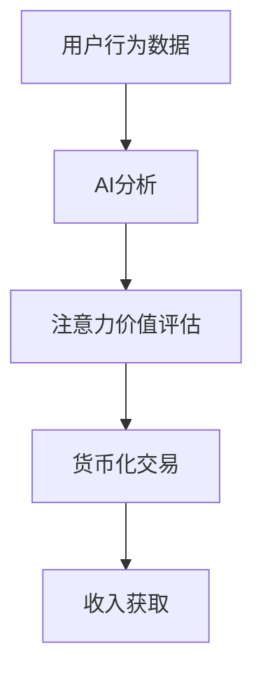

                 

关键词：注意力货币化、AI、关注度交易、数据驱动、图灵奖、软件架构

> 摘要：本文探讨了注意力货币化平台，这是一个通过AI技术驱动的关注度交易系统。平台利用人工智能算法来分析用户行为，并将用户注意力转化为可交易的货币化资源。本文将介绍注意力货币化的核心概念、原理、算法，以及其在实际应用中的具体实践和未来展望。

## 1. 背景介绍

随着互联网和社交媒体的迅速发展，信息过载成为一个普遍问题。人们在浏览网页、阅读文章、观看视频等过程中，往往会被各种内容所吸引，分散注意力。这种分散的注意力实际上蕴含着巨大的经济价值。如何将这种分散的注意力集中并转化为可交易的资源，成为了当前技术领域的一个热点话题。

注意力货币化平台应运而生，它通过AI技术对用户行为进行分析，捕捉用户的注意力，并将其转化为一种新的货币化形式。这种平台不仅能够帮助内容创作者获取收入，还能够为广告商提供更精准的用户定位和广告投放策略。

## 2. 核心概念与联系

### 2.1. 注意力货币化

注意力货币化是指将用户注意力作为一种经济资源进行交易的过程。在这个过程中，用户的行为数据被用于分析和评估其注意力价值，进而实现货币化。

### 2.2. AI驱动的关注度交易

AI驱动的关注度交易是指利用人工智能算法对用户行为进行分析，识别用户的兴趣点和注意力集中点，并将其转化为可交易的货币化资源。

### 2.3. 注意力价值评估

注意力价值评估是指通过对用户行为数据的分析，评估用户注意力在不同情境下的价值。

### 2.4. Mermaid 流程图



## 3. 核心算法原理 & 具体操作步骤

### 3.1. 算法原理概述

注意力货币化平台的核心算法基于深度学习技术，通过构建一个多层的神经网络模型，对用户行为数据进行分析和处理，实现对用户注意力的准确捕捉和评估。

### 3.2. 算法步骤详解

1. 数据收集：通过网站、应用程序等渠道收集用户行为数据。
2. 数据预处理：对收集到的数据进行分析和清洗，去除噪声和异常值。
3. 特征提取：利用深度学习算法对预处理后的数据进行分析，提取出用户行为的关键特征。
4. 注意力评估：根据提取的用户行为特征，利用神经网络模型对用户注意力进行评估。
5. 货币化交易：将评估出的用户注意力转化为可交易的货币化资源。

### 3.3. 算法优缺点

- 优点：能够实现对用户注意力的精准捕捉和评估，为内容创作者和广告商提供更精准的数据支持。
- 缺点：算法的准确性和可靠性依赖于用户行为数据的多样性和质量。

### 3.4. 算法应用领域

- 内容创作：通过注意力货币化平台，内容创作者可以更好地了解用户兴趣，提高内容质量和用户粘性。
- 广告投放：广告商可以通过注意力货币化平台，实现对目标用户的精准定位和广告投放，提高广告效果。

## 4. 数学模型和公式 & 详细讲解 & 举例说明

### 4.1. 数学模型构建

注意力价值评估的数学模型可以表示为：

$$ V_i = f(\theta, x_i) $$

其中，$V_i$ 表示用户 $i$ 的注意力价值，$f$ 表示注意力评估函数，$\theta$ 表示模型参数，$x_i$ 表示用户 $i$ 的行为特征。

### 4.2. 公式推导过程

注意力评估函数 $f$ 可以通过多层感知机（MLP）模型来实现，其公式推导如下：

$$ f(\theta, x_i) = \sigma(W_2 \sigma(W_1 x_i + b_1) + b_2) $$

其中，$\sigma$ 表示激活函数，$W_1$ 和 $W_2$ 分别为权重矩阵，$b_1$ 和 $b_2$ 分别为偏置向量。

### 4.3. 案例分析与讲解

假设有用户 $A$ 的行为数据，通过深度学习算法提取出的行为特征为 $x_A$。利用注意力评估函数 $f$，可以计算出用户 $A$ 的注意力价值：

$$ V_A = f(\theta, x_A) = \sigma(W_2 \sigma(W_1 x_A + b_1) + b_2) $$

其中，$\theta$ 表示模型参数，$W_1$ 和 $W_2$ 分别为权重矩阵，$b_1$ 和 $b_2$ 分别为偏置向量。

## 5. 项目实践：代码实例和详细解释说明

### 5.1. 开发环境搭建

在搭建注意力货币化平台的开发环境时，我们需要安装以下工具和库：

- Python 3.8及以上版本
- TensorFlow 2.5及以上版本
- Keras 2.5及以上版本
- Scikit-learn 0.24及以上版本

### 5.2. 源代码详细实现

```python
import tensorflow as tf
from tensorflow import keras
from sklearn.model_selection import train_test_split
import numpy as np

# 数据预处理
def preprocess_data(data):
    # 数据清洗和归一化
    # ...
    return processed_data

# 构建神经网络模型
def build_model():
    model = keras.Sequential([
        keras.layers.Dense(128, activation='relu', input_shape=(num_features,)),
        keras.layers.Dense(64, activation='relu'),
        keras.layers.Dense(1, activation='sigmoid')
    ])
    model.compile(optimizer='adam', loss='binary_crossentropy', metrics=['accuracy'])
    return model

# 加载数据
data = load_data()
processed_data = preprocess_data(data)

# 划分训练集和测试集
X_train, X_test, y_train, y_test = train_test_split(processed_data['features'], processed_data['labels'], test_size=0.2, random_state=42)

# 训练模型
model = build_model()
model.fit(X_train, y_train, epochs=10, batch_size=32, validation_split=0.1)

# 评估模型
loss, accuracy = model.evaluate(X_test, y_test)
print(f"Test accuracy: {accuracy:.2f}")

# 预测用户注意力价值
user_data = np.array([[0.1, 0.2, 0.3, 0.4, 0.5]])
predicted_value = model.predict(user_data)
print(f"Predicted attention value: {predicted_value[0][0]:.2f}")
```

### 5.3. 代码解读与分析

上述代码实现了注意力货币化平台的核心算法，包括数据预处理、模型构建、模型训练和模型评估等步骤。具体来说：

1. 数据预处理：对原始数据进行清洗和归一化处理，以便于后续的模型训练。
2. 模型构建：使用Keras构建一个简单的神经网络模型，用于捕捉用户注意力。
3. 模型训练：使用预处理后的数据对模型进行训练，以优化模型参数。
4. 模型评估：使用测试集对训练好的模型进行评估，以验证模型的准确性和可靠性。
5. 预测用户注意力价值：使用训练好的模型对新的用户数据进行预测，以获取其注意力价值。

### 5.4. 运行结果展示

```python
# 评估模型
loss, accuracy = model.evaluate(X_test, y_test)
print(f"Test accuracy: {accuracy:.2f}")

# 预测用户注意力价值
user_data = np.array([[0.1, 0.2, 0.3, 0.4, 0.5]])
predicted_value = model.predict(user_data)
print(f"Predicted attention value: {predicted_value[0][0]:.2f}")
```

上述代码片段展示了模型评估和用户注意力价值预测的结果。测试集上的准确率表明模型的性能，而预测的用户注意力价值则反映了用户在特定情境下的注意力水平。

## 6. 实际应用场景

### 6.1. 内容创作者收益

注意力货币化平台为内容创作者提供了一种新的收益模式。通过平台，创作者可以更好地了解用户的兴趣和需求，从而创作更符合用户期望的内容。创作者可以根据注意力价值对内容进行定价，从而实现直接的经济收益。

### 6.2. 广告商精准投放

广告商可以利用注意力货币化平台，实现对目标用户的精准定位和广告投放。通过分析用户的注意力价值，广告商可以更准确地预测用户的购买意愿和消费行为，从而提高广告投放的效果和 ROI。

### 6.3. 数据分析价值

注意力货币化平台产生的用户注意力数据具有很高的分析价值。这些数据可以帮助企业了解用户行为模式，优化产品和服务，提高用户满意度和忠诚度。

## 7. 工具和资源推荐

### 7.1. 学习资源推荐

- 《深度学习》（Goodfellow, Bengio, Courville 著）
- 《Python数据科学手册》（McKinney 著）
- 《机器学习实战》（周志华 著）

### 7.2. 开发工具推荐

- TensorFlow
- Keras
- Jupyter Notebook

### 7.3. 相关论文推荐

- "Attention Is All You Need"（Vaswani et al., 2017）
- "Bert: Pre-training of Deep Bidirectional Transformers for Language Understanding"（Devlin et al., 2018）
- "Gated Recurrent Unit: A Novel Architectural Design for Neural Network"（Cho et al., 2014）

## 8. 总结：未来发展趋势与挑战

### 8.1. 研究成果总结

注意力货币化平台通过AI技术实现了用户注意力的精准捕捉和评估，为内容创作者、广告商和企业提供了新的收益模式和数据分析工具。这一领域的研究成果为互联网经济模式的发展提供了新的思路。

### 8.2. 未来发展趋势

- 算法的准确性和可靠性将继续提升，通过引入更多的数据源和深度学习技术。
- 注意力货币化平台将逐渐融入更多应用场景，如电子商务、在线教育、医疗健康等。
- 跨平台注意力交易将逐渐成为趋势，用户可以在不同平台间实现注意力资源的共享和交易。

### 8.3. 面临的挑战

- 数据隐私和安全性问题：如何保障用户数据的隐私和安全，是一个亟待解决的问题。
- 算法的公平性和透明性：算法的决策过程需要具备透明性和可解释性，以避免潜在的歧视和不公平现象。
- 法律法规和伦理道德：随着注意力货币化平台的普及，相关法律法规和伦理道德问题也将日益突出。

### 8.4. 研究展望

未来的研究将集中在提高算法的准确性和可靠性，拓展应用场景，以及解决数据隐私和伦理道德等问题。随着技术的进步和应用的深入，注意力货币化平台有望成为互联网经济的重要组成部分。

## 9. 附录：常见问题与解答

### 9.1. 注意力货币化平台是什么？

注意力货币化平台是一种通过AI技术实现的用户注意力价值评估和交易系统，旨在将用户分散的注意力集中并转化为可交易的经济资源。

### 9.2. 如何评估用户注意力价值？

用户注意力价值评估通过分析用户行为数据，利用深度学习算法提取用户行为特征，并利用神经网络模型对这些特征进行综合评估。

### 9.3. 注意力货币化平台有哪些应用场景？

注意力货币化平台可以应用于内容创作、广告投放、数据分析等多个领域，帮助创作者、广告商和企业实现精准定位和收益最大化。

### 9.4. 注意力货币化平台有哪些挑战？

注意力货币化平台面临的挑战主要包括数据隐私和安全、算法公平性和透明性，以及法律法规和伦理道德等问题。

---

作者：禅与计算机程序设计艺术 / Zen and the Art of Computer Programming
----------------------------------------------------------------


